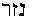
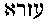
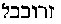
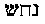

[Intangible Textual Heritage](../../index)  [Theosophy](../index) 
[Index](index)  [Previous](iu101)  [Next](iu103) 

------------------------------------------------------------------------

###### p. 123

### CHAPTER III.

> "**K**ING.--Let us from point to point this story know."--*All's Well
> That Ends Well.--*Act v., Scene 3.

> "He is the One, self-proceeding; and from Him all things proceed.  
> And in them He Himself exerts His activity; no mortal  
> **B**EHOLDS **H**IM, but **H**E beholds all!"--
>
> Orphic Hymn.

> "And Athens, O Athena, is thy own!  
> Great Goddess hear! and on my darkened mind  
> Pour thy pure light in measure unconfined;  
> That sacred light, O all-proceeding Queen,  
> Which beams eternal from thy face serene.  
> My soul, while wand'ring on the earth, inspire  
> With thy own blessed and impulsive fire!"--**P**ROCLUS; **T**AYLOR:
>
> To Minerva.

> "Now *faith* is the substance of things. . . . By faith the harlot
> Rahab perished not with them that believed not, when she had *received
> the spies in peace.*"*--Hebrews* xi*.* 1, 31.

> "What doth it profit, my brethren, though a man hath faith, and have
> not works? *Can* FAITH *save him?* . . . Likewise also was not Rahab
> the harlot *justified by works,* when she had received the messengers,
> and had sent them out another way?"--*James* ii. 14, 25.

CLEMENT describes Basilides, the Gnostic, as "a philosopher devoted to
the contemplation of divine things." This very appropriate expression
may be applied to many of the founders of the more important sects which
later were all engulfed in one--that stupendous compound of
unintelligible dogmas enforced by Irenaeus, Tertullian, and others,
which is now termed Christianity. *If these must be called heresies,
then early Christianity itself must be included in the number.*
Basilides and Valentinus preceded Irenaeus and Tertullian; and the two
latter Fathers had less facts than the two former Gnostics to show that
their *heresy* was plausible. Neither divine right nor truth brought
about the triumph of their Christianity; fate alone was propitious. We
can assert, with entire plausibility, that there is not one of all these
sects--Kabalism, Judaism, and our present Christianity included--but
sprung from the two main branches of that one mother-trunk, the once
universal religion, which antedated the Vedaic ages--we speak of that
prehistoric Buddhism which merged later into Brahmanism.

The religion which the primitive teaching of the early few apostles most
resembled--a religion preached by Jesus himself--is the elder of these
two, Buddhism. The latter as taught in its primitive purity, and carried
to perfection by the last of the Buddhas, Gautama, based its

###### p. 124

moral ethics on three fundamental principles. It alleged that 1, every
thing existing, exists from natural causes; 2, that virtue brings its
own reward, and vice and sin their own punishment; and, 3, that the
state of man in this world is probationary. We might add that on these
three principles rested the universal foundation of every religious
creed; God, and individual immortality for every man--if he could but
win it. However puzzling the subsequent theological tenets; however
seemingly incomprehensible the metaphysical abstractions which have
convulsed the theology of every one of the great religions of mankind as
soon as it was placed on a sure footing, the above is found to be the
essence of every religious philosophy, with the exception of later
Christianity. It was that of Zoroaster, of Pythagoras, of Plato, of
Jesus, and even of Moses, albeit the teachings of the Jewish law-giver
have been so piously tampered with.

We will devote the present chapter mainly to a brief survey of the
numerous sects which have recognized themselves as Christians; that is
to say, that have believed in a *Christos,* or an ANOINTED ONE. We will
also endeavor to explain the latter appellation from the kabalistic
stand-point, and show it reappearing in every religious system. It might
be profitable, at the same time, to see how much the earliest
apostles--Paul and Peter, agreed in their preaching of the new
Dispensation. We will begin with Peter.

We must once more return to that greatest of all the Patristic frauds;
the one which has undeniably helped the Roman Catholic Church to its
unmerited supremacy, viz.: the barefaced assertion, in the teeth of
historical evidence, that Peter suffered martyrdom at Rome. It is but
too natural that the Latin clergy should cling to it, for, with the
exposure of the fraudulent nature of this pretext, the dogma of
apostolic succession must fall to the ground.

There have been many able works of late, in refutation of this
preposterous claim. Among others we note Mr. G. Reber's, *The Christ of
Paul*, which overthrows it quite ingeniously. The author proves, 1, that
there was no church established at Rome, until the reign of Antoninus
Pius; 2, that as Eusebius and Irenaeus both agree that Linus was the
second Bishop of Rome, into whose hands "the blessed apostles" Peter and
Paul committed the church after building it, it could not have been at
any other time than between A.D. 64 and 68; 3, that this interval of
years happens during the reign of Nero, for Eusebius states that Linus
held this office twelve years (*Ecclesiastical History,* book iii., c.
13), entering upon it A.D. 69, one year after the death of Nero, and
dying himself in 81. After that the author maintains, on very solid
grounds, that Peter could not be in Rome A.D. 64, for he was then in
Babylon; wherefrom he

###### p. 125

wrote his first Epistle, the date of which is fixed by Dr. Lardner and
other critics at precisely this year. But we believe that his best
argument is in proving that it was not in the character of the cowardly
Peter to risk himself in such close neighborhood with Nero, who "was
feeding the wild beasts of the Amphitheatre with the flesh and bones of
Christians" [\*](#fn_178) at that time.

Perhaps the Church of Rome was but consistent in choosing as her titular
founder the apostle who thrice denied his master at the moment of
danger; and the only one, moreover, except Judas, who provoked Christ in
such a way as to be addressed as the "Enemy." "Get thee behind me,
**S**ATAN!" exclaims Jesus, rebuking the taunting apostle. [\*\*](#fn_179)

There is a tradition in the Greek Church which has never found favor at
the Vatican. The former traces its origin to one of the Gnostic
leaders--Basilides, perhaps, who lived under Trajan and Adrian, at the
end of the first and the beginning of the second century. With regard to
this particular tradition, if the Gnostic is Basilides, then he must be
accepted as a sufficient authority, having claimed to have been a
disciple of the Apostle Matthew, and to have had for master Glaucias, a
disciple of St. Peter himself. Were the narrative attributed to him
authenticated, the London Committee for the Revision of the Bible would
have to add a new verse to *Matthew, Mark,* and *John,* who tell the
story of Peter's denial of Christ.

This tradition, then, of which we have been speaking, affirms that, when
frightened at the accusation of the servant of the high priest, the
apostle had thrice denied his master, and the cock had crowed, Jesus,
who was then passing through the hall in custody of the soldiers,
turned, and, looking at Peter, said: "Verily, I say unto thee, Peter,
thou shalt deny me throughout the coming ages, and never stop until thou
shalt be old, and shalt stretch forth thy hands, and another shall gird
thee and carry thee whither thou wouldst not." The latter part of this
sentence, say the Greeks, relates to the Church of Rome, and prophesies
her constant apostasy from Christ, under the mask of false religion.
Later, it was inserted in the twenty-first chapter of *John,* but the
whole of this chapter had been pronounced a forgery, even before it was
found that this *Gospel* was never written by John the Apostle at all.

The anonymous author of *Supernatural Religion,* a work which in two
years passed through several editions, and which is alleged to have been
written by an eminent theologian, proves conclusively the spuriousness
of the four gospels, or at least their complete transformation in the
hands

###### p. 126

of the too-zealous Irenaeus and his champions. The fourth gospel is
completely upset by this able author; the extraordinary forgeries of the
Fathers of the early centuries are plainly demonstrated, and the
relative value of the synoptics is discussed with an unprecedented power
of logic. The work carries conviction in its every line. From it we
quote the following: "We gain infinitely more than we lose in abandoning
belief in the reality of Divine Revelation. Whilst we retain, pure and
unimpaired, the treasure of Christian morality, we relinquish nothing
but the debasing elements added to it by human superstition. We are no
longer bound to believe a theology which outrages reason and moral
sense. We are freed from base anthropomorphic views of God and His
government of the Universe, and from Jewish Mythology we rise to higher
conceptions of an infinitely wise and beneficent Being, hidden from our
finite minds, it is true, in the impenetrable glory of Divinity, but
whose laws of wondrous comprehensiveness and perfection we ever perceive
in operation around us. . . . The argument so often employed by
theologians, that Divine revelation is necessary for man, and that
certain views contained in that revelation are required for our moral
consciousness, is purely imaginary, and derived from the revelation
which it seeks to maintain. The only thing absolutely necessary for man
is **T**RUTH, and to that, and that alone, must our moral consciousness
adapt itself." [\*](#fn_180)

We will consider farther in what light was regarded the Divine
revelation of the Jewish *Bible* by the Gnostics, who yet believed in
Christ in their own way, a far better and less blasphemous one than the
Roman Catholic. The Fathers have forced on the believers in Christ a
*Bible,* the laws prescribed in which he was the first to break; the
teachings of which he utterly rejected; and for which crimes he was
finally crucified. Of whatever else the Christian world can boast, it
can hardly claim logic and consistency as its chief virtues.

The fact alone that Peter remained to the last an "apostle of the
circumcision," speaks for itself. *Whosoever else might have built the
Church of Rome it was not Peter.* If such were the case, the successors
of this apostle would have to submit themselves to circumcision, if it
were but for the sake of consistency, and to show that the claims of the
popes are not utterly groundless, Dr. Inman asserts that report says
that "in our Christian times popes have to be privately perfect," [\*\*](#fn_181) but we do not know whether it is
carried to the extent of the Levitical Jewish law. The first fifteen
Christian bishops of Jerusalem, commencing with James and including
Judas, were all circumcised Jews. [\*\*\*](#fn_182)

###### p. 127

In the *Sepher Toldos Jeshu*, [\*](#fn_183) a
Hebrew manuscript of great antiquity, the version about Peter is
different. Simon Peter, it says, was one of their own brethren, though
he had somewhat departed from the laws, and the Jewish hatred and
persecution of the apostle seems to have existed but in the fecund
imagination of the fathers. The author speaks of him with great respect
and fairness, calling him "a faithful servant of the living God," who
passed his life in austerity and meditation, "living in Babylon at the
summit of a tower," composing hymns, and preaching charity. He adds that
Peter always recommended to the Christians not to molest the Jews, but
as soon as he was dead, behold another preacher went to Rome and
pretended that Simon Peter had altered the teachings of his master. He
invented a burning hell and threatened every one with it; promised
miracles, but worked none.

How much there is in the above of fiction and how much of truth, it is
for others to decide; but it certainly bears more the evidence of
sincerity and fact on its face, than the fables concocted by the fathers
to answer their end.

We may the more readily credit this friendship between Peter and his
late co-religionists as we find in *Theodoret* the following assertion:
"The Nazarenes are Jews, honoring the ANOINTED (Jesus) as a *just man*
and using the *Evangel* according to Peter." [\*\*](#fn_184) Peter was a Nazarene, according to
the *Talmud.* He belonged to the sect of the later Nazarenes, which
dissented from the followers of John the Baptist, and became a rival
sect; and which--as tradition goes--was instituted by Jesus himself.

History finds the first Christian sects to have been either Nazarenes
like John the Baptist; or Ebionites, among whom were many of the
relatives of Jesus; or Essenes (Iessaens) the Therapeutae, healers, of
which the Nazaria were a branch. All these sects, which only in the days
of Irenaeus began to be considered heretical, were more or less
kabalistic. They believed in the expulsion of demons by magical
incantations, and practiced this method; Jervis terms the Nabatheans and
other such sects "wandering Jewish exorcists," [\*\*\*](#fn_185) the Arabic word *Nabae*, meaning to
wander, and the Hebrew naba, to prophesy. The *Talmud* indiscriminately

###### p. 128

calls all the Christians *Nozari*. [\*](#fn_186) All the Gnostic sects equally believed
in magic. Irenaeus, in describing the followers of Basilides, says,
"They use images, invocations, incantations, and all other things
pertaining unto magic." Dunlap, on the authority of Lightfoot, shows
that Jesus was called *Nazaraios,* in reference to his humble and mean
external condition; "for Nazaraios means separation, alienation from
other men." [\*\*](#fn_187)

The real meaning of the word nazar 
 signifies to vow or consecrate one's self to the
service of God. As a noun it is a *diadem* or emblem of such
consecration, a head so consecrated. [\*\*\*](#fn_188) Joseph was styled a *nazar*. [\*\*\*\*](#fn_189) "The head of Joseph, the vertex
of the nazar among his brethren." Samson and Samuel (  Semes-on and Sem-va-el)
are described alike as *nazars.* Porphyry, treating of Pythagoras, says
that he was purified and initiated at Babylon by Zar-adas, the head of
the sacred college. May it not be surmised, therefore, that the
Zoro-Aster was the *nazar* of Ishtar, Zar-adas or Na-Zar-Ad, [\*\*\*\*\*](#fn_190) being the same with change of
idiom? Ezra, or  ,
was a priest and scribe, a hierophant; and the first Hebrew colonizer of
Judea was 
Zeru-Babel or the Zoro or nazar of Babylon.

The Jewish Scriptures indicate two distinct worships and religions among
the Israelites; that of Bacchus-worship under the mask of Jehovah, and
that of the Chaldean initiates to whom belonged some of the *nazars,*
the theurgists, and a few of the prophets. The headquarters of these
were always at Babylon and Chaldea, where two rival schools of Magians
can be distinctly shown. Those who would doubt the statement will have
in such a case to account for the discrepancy between history and Plato,
who of all men of his day was certainly one of the best informed.
Speaking of the Magians, he shows them as instructing the Persian kings
of Zoroaster, as the son or priest of Oromasdes; and yet Darius, in the
inscription at Bihistun, boasts of having restored the cultus of Ormazd
and put down the Magian rites! Evidently there were two distinct and
antagonistic Magian schools. The oldest and the most esoteric of the two
being that which, satisfied with its unassailable knowledge and secret
power, was content to apparently relinquish her exoteric popularity, and
concede her supremacy into the hands of the reforming Darius. The later
Gnostics showed the same prudent policy by accommodating themselves in
every country to the prevailing religious forms, still secretly adhering
to their own essential doctrines.

###### p. 129

There is another hypothesis possible, which is that Zero-Ishtar was the
high priest of the Chaldean worship, or Magian hierophant. When the
Aryans of Persia, under Darius Hystaspes, overthrew the Magian Gomates,
and *restored* the Masdean worship, there ensued an amalgamation by
which the Magian Zoro-astar became the Zara-tushra of the *Vendidad.*
This was not acceptable to the other Aryans, who adopted the Vedic
religion as distinguished from that of *Avesta.* But this is but an
hypothesis.

And whatever Moses is now believed to have been, we will demonstrate
that he was an initiate. The Mosaic religion was at best a
sun-and-serpent worship, diluted, perhaps, with some slight monotheistic
notions before the latter were forcibly crammed into the so-called
"inspired Scriptures" by Ezra, at the time he was alleged to have
*re*written the Mosaic books. At all events the *Book of Numbers* was a
later book; and there the sun-and-serpent worship is as plainly
traceable as in any Pagan story. The tale of the fiery serpents is an
allegory in more than one sense. The "serpents" were the *Levites* or
*Ophites,* who were Moses' body-guard (see *Exodus* xxxii. 26); and the
command of the "Lord" to Moses to hang the heads of the people "before
the Lord against the sun," which is the emblem of this Lord, is
unequivocal.

The nazars or prophets, as well as the Nazarenes, were an anti-Bacchus
caste, in so far that, in common with all the initiated prophets, they
held to the spirit of the symbolical religions and offered a strong
opposition to the idolatrous and exoteric practices of the dead letter.
Hence, the frequent stoning of the prophets by the populace and under
the leadership of those priests who made a profitable living out of the
popular superstitions. Otfried Muller shows how much the Orphic
Mysteries differed from the *popular* rites of Bacchus, [\*](#fn_191) although the *Orphikoi* are known to
have followed the worship of Bacchus. The system of the purest morality
and of a severe asceticism promulgated in the teachings of Orpheus, and
so strictly adhered to by his votaries, are incompatible with the
lasciviousness and gross immorality of the popular rites. The fable of
Aristaeus pursuing Eurydike into the woods where a serpent occasions her
death, is a very plain allegory, which was in part explained at the
earliest times. Aristaeus is *brutal power,* pursuing Eurydike, the
esoteric doctrine, into the woods where the serpent (emblem of every
sun-god, and worshipped under its grosser aspect even by the Jews) kills
her; *i.e.*, forces truth to become still more esoteric, and seek
shelter in the Underworld, which is not the hell of our theologians.
Moreover, the fate of Orpheus, torn to pieces by the Bacchantes, is

###### p. 130

another allegory to show that the gross and popular rites are always
more welcome than divine but simple truth, and proves the great
difference that must have existed between the esoteric and the popular
worship. As the poems of both Orpheus and Musaeus were said to have been
lost since the earliest ages, so that neither Plato nor Aristotle
recognized anything authentic in the poems extant in their time, it is
difficult to say with precision what constituted their peculiar rites.
Still we have the oral tradition, and every inference to draw therefrom;
and this tradition points to Orpheus as having brought his doctrines
from India. As one whose religion was that of the oldest Magians--hence,
that to which belonged the initiates of all countries, beginning with
Moses, the "sons of the Prophets," and the ascetic *nazars* (who must
not be confounded with those against whom thundered Hosea and other
prophets) to the Essenes. This latter sect were Pythagoreans before they
rather degenerated, than became perfected in their system by the
Buddhist missionaries, whom Pliny tells us established themselves on the
shores of the Dead Sea, ages before his time, "*per saeculorum millia.*"
But if, on the one hand, these Buddhist monks were the first to
establish monastic communities and inculcate the strict observance of
dogmatic conventual rule, on the other they were also the first to
enforce and popularize those stern virtues so exemplified by Sakya-muni,
and which were previously exercised only in isolated cases of well-known
philosophers and their followers; virtues preached two or three
centuries later by Jesus, practiced by a few Christian ascetics, and
gradually abandoned, and even entirely forgotten by the Christian
Church.

The *initiated* nazars had ever held to this rule, which had to be
followed before them by the adepts of every age; and the disciples of
John were but a dissenting branch of the Essenes. Therefore, we cannot
well confound them with all the nazars spoken of in the *Old Testament,*
and who are accused by Hosea with having separated or consecrated
themselves to *Bosheth*; which implied the greatest possible
abomination. To infer, as some critics and theologians do, that it means
to separate one's self to *chastity* or continence, is either to
advisedly pervert the true meaning, or to be totally ignorant of the
Hebrew language. The eleventh verse of the first chapter of Micah half
explains the word in its veiled translation: "Pass ye away, thou
inhabitant of Saphir, etc.," and in the original text the word is
*Bosheth.* Certainly neither Baal, nor Iahoh Kadosh, with his
*Kadeshim,* was a god of ascetic virtue, albeit the *Septuaginta* terms
them, as well as the *galli--*the perfected priests--τετελεσμενους, the
*initiated* and the *consecrated.* [\*](#fn_192)

###### p. 131

The great *Sod* of the *Kadeshim,* translated in *Psalm* lxxxix. 7, by
"assembly of the saints," was anything but a mystery of the
"*sanctified*" in the sense given to the latter word by Webster.

The Nazireate sect existed long before the laws of Moses, and originated
among people most inimical to the "chosen" ones of Israel, viz., the
people of Galilee, the ancient *olla-podrida* of idolatrous nations,
where was built Nazara, the present Nazareth. It is in Nazara that the
ancient Nazoria or Nazireates held their "Mysteries of Life" or
"assemblies," as the word now stands in the translation, [\*](#fn_193) which were but the secret mysteries of
initiation, [\*\*](#fn_194) utterly distinct in
their practical form from the popular Mysteries which were held at
Byblus in honor of Adonis. While the true *initiates* of the ostracised
Galilee were worshipping the true God and enjoying transcendent visions,
what were the "chosen" ones about? Ezekiel tells it to us (chap. viii)
when, in describing what he saw, he says that the *form* of a hand took
him by a lock of his head and transported him from Chaldea unto
Jerusalem. "And there stood seventy men of the senators of the house of
Israel. . . . 'Son of man, hast thou seen what the ancients . . . do in
the dark?' " inquires the "Lord." "At the door of the house of the Lord
. . . behold there sat women weeping for Tammuz" (Adonis). We really
cannot suppose that the Pagans have ever surpassed the "chosen" people
in certain shameful *abominations* of which their own prophets accuse
them so profusely. To admit this truth, one hardly needs even to be a
Hebrew scholar; let him read the *Bible* in English and meditate over
the language of the "holy" prophets.

This accounts for the hatred of the later Nazarenes for the orthodox
Jews--followers of the *exoteric* Mosaic Law--who are ever taunted by
this sect with being the worshippers of Iurbo-Adunai, or Lord Bacchus.
Passing under the disguise of *Adoni-Iachoh* (original text, *Isaiah*
lxi*.* 1), Iahoh and Lord Sabaoth, the Baal-Adonis, or Bacchus,
worshipped in the groves and *public sods* or Mysteries, under the
polishing hand of Ezra becomes finally the later-vowelled Adonai of the
Massorah--the One and Supreme God of the Christians!

"Thou shalt not worship the Sun who is named Adunai," says the *Codex*
of the Nazarenes; "whose name is also *Kadush [\*\*\*](#fn_195)* and El-El. This Adunai will elect
to himself a nation and congregate *in crowds* (his worship will be
exoteric) . . . Jerusalem will become the refuge and city of the
*Abortive,* who shall perfect themselves (circumcise) with a sword . . .
and shall adore Adunai." [\*\*\*\*](#fn_196)

###### p. 132

The oldest Nazarenes, who were the descendants of the Scripture
*nazars,* and whose last prominent leader was John the Baptist, although
never very orthodox in the sight of the scribes and Pharisees of
Jerusalem were, nevertheless, respected and left unmolested. Even Herod
"feared the multitude" because they regarded John as a prophet
(*Matthew* xiv. 5)*.* But the followers of Jesus evidently adhered to a
sect which became a still more exasperating thorn in their side. It
appeared as a heresy *within* another heresy; for while the nazars of
the olden times, the "Sons of the Prophets," were Chaldean kabalists,
the adepts of the new dissenting sect showed themselves reformers and
innovators from the first. The great similitude traced by some critics
between the rites and observances of the earliest Christians and those
of the Essenes may be accounted for without the slightest difficulty.
The Essenes, as we remarked just now, were the converts of Buddhist
missionaries who had overrun Egypt, Greece, and even Judea at one time,
since the reign of Asoka the zealous propagandist; and while it is
evidently to the Essenes that belongs the honor of having had the
Nazarene reformer, Jesus, as a pupil, still the latter is found
disagreeing with his early teachers on several questions of formal
observance. He cannot strictly be called an Essene, for reasons which we
will indicate further on, neither *was* he a nazar, or Nazaria of the
older sect. What Jesus *was,* may be found in the *Codex Nazaraeus,* in
the unjust accusations of the Bardesanian Gnostics.

"Jesu is *Nebu,* the false Messiah, the destroyer of the old orthodox
religion," says the *Codex*. [\*](#fn_197) He
is the founder of the sect of the new nazars, and, as the words clearly
imply, a follower of the Buddhist doctrine. In Hebrew the word *naba*
means to speak of inspiration; and 
 is *nebo,* a god of wisdom. But Nebo is also
*Mercury,* and *Mercury is Buddha* in the Hindu monogram of planets.
Moreover, we find the Talmudists holding that Jesus was inspired by the
genius of Mercury. [\*\*](#fn_198)

The Nazarene reformer had undoubtedly belonged to one of these sects;
though, perhaps, it would be next to impossible to decide absolutely
which. But what is self-evident is that he preached the philosophy of
Buddha-Sakyamuni. Denounced by the later prophets, cursed by the
Sanhedrim, the nazars--they were confounded with others of that name
"who separated themselves unto that shame," [\*\*\*](#fn_199) they were secretly, if not openly
persecuted by the orthodox synagogue. It be-

###### p. 133

comes clear why Jesus was treated with such contempt from the first, and
deprecatingly called "the Galilean." Nathaniel inquires--"Can there any
good thing come out of Nazareth?" (*John* i. 46) at the very beginning
of his career; and merely because he knows him to be a *nazar.* Does not
this clearly hint, that even the older nazars were not really Hebrew
religionists, but rather a class of Chaldean theurgists? Besides, as the
*New Testament* is noted for its mistranslations and transparent
falsifications of texts, we may justly suspect that the word Nazareth
was substituted for that of *nasaria,* or nozari. That it originally
read "Can any good thing come from a nozari, or Nazarene"; a follower of
St. John the Baptist, with whom we see him associating from his first
appearance on the stage of action, after having been lost sight of for a
period of nearly twenty years. The blunders of the *Old Testament* are
as nothing to those of the *gospels.* Nothing shows better than these
self-evident contradictions the system of pious fraud upon which the
super-structure of the Messiahship rests. "This is *Elias* which was for
to come," says Matthew of John the Baptist, thus forcing an ancient
kabalistic tradition into the frame of evidence (xi. 14). But when
addressing the Baptist himself, they ask him (*John* i*.* 21), "Art thou
Elias?" "And he saith *I am not*"! Which knew best--John or his
biographer? And which is divine revelation?

The motive of Jesus was evidently like that of Gautama-Buddha, to
benefit humanity at large by producing a religious reform which should
give it a religion of pure ethics; the true knowledge of God and nature
having remained until then solely in the hands of the esoteric sects,
and their adepts. As Jesus used *oil* and the Essenes never used aught
but pure water, [\*](#fn_200) he cannot be
called a strict Essene. On the other hand, the Essenes were also "set
apart"; they were healers (*assaya*) and dwelt in the desert as all
ascetics did.

But although he did not abstain from wine he could have remained a
Nazarene all the same. For in chapter vi. of *Numbers,* we see that
after the priest has waved a part of the hair of a Nazorite for a
wave-offering before the Lord, "after that a Nazarene may drink wine"
(v. 20). The bitter denunciation by the reformer of the people who would
be satisfied with nothing is worded in the following exclamation: "John
came neither eating nor drinking and they say: 'He hath a devil.' . . .
The Son of Man came eating and drinking, and they say: 'Behold a man
gluttonous and a wine-bibber.' " And yet he was an Essene and Nazarene,
for we not only find him sending a message to Herod, to say that he was
one of those who cast out demons, and who performed

###### p. 134

cures, but actually calling himself a prophet and declaring himself
equal to the other prophets. [\*](#fn_201)

The author of *Sod* shows Matthew trying to connect the appellation of
Nazarene with a prophecy, [\*\*](#fn_202) and
inquires "Why then does Matthew state that the prophet said he should be
called *Nazaria*?" Simply "because he belonged to that sect, and a
prophecy would confirm his claims to the Messiahship. . . . Now it does
not appear that the prophets anywhere state that the Messiah will be
called a *Nazarene.*"* [\*\*\*](#fn_203)* The
fact alone that Matthew tries in the last verse of chapter ii. to
strengthen his claim that Jesus dwelt in Nazareth *merely to fulfil a
prophecy,* does more than weaken the argument, it upsets it entirely;
for the first two chapters have sufficiently been proved later
forgeries.

Baptism is one of the oldest rites and was practiced by all the nations
in their Mysteries, as sacred ablutions. Dunlap seems to derive the name
of the *nazars* from nazah, sprinkling; Bahak-Zivo is the genius who
called the world into existence [\*\*\*\*](#fn_204) out of the "dark water," say the
Nazarenes; and Richardson's *Persian, Arabic, and English Lexicon*
asserts that the word *Bahak* means "raining." But the Bahak-Zivo of the
Nazarenes cannot be traced so easily to Bacchus, who "was the rain-god,"
for the nazars were the greatest opponents of Bacchus-worship. "Bacchus
is brought up by the Hyades, the rain-nymphs," says Preller; [\*\*\*\*\*](#fn_205) who shows, furthermore,
that [\*\*\*\*\*\*](#fn_206) at the conclusion
of the religious Mysteries, the priests baptized (washed) their
monuments and anointed them with oil. All this is but a very indirect
proof. The Jordan baptism need not be shown a substitution for the
*exoteric* Bacchic rites and the libations in honor of Adonis or
Adoni--whom the Nazarenes abhorred--in order to prove it to have been a
sect sprung from the "Mysteries" of the "Secret Doctrine"; and their
rites can by no means be confounded with those of the Pagan populace,
who had simply fallen into the idolatrous and unreasoning faith of all
plebeian multitudes. John was the prophet of these Nazarenes, and in
Galilee he was termed "the Saviour," but he was not the founder of that
sect which derived its tradition from the remotest Chaldeo-Akkadian
theurgy.

"The early plebeian Israelites were Canaanites and Phoenicians, with

###### p. 135

the same worship of the Phallic gods--Bacchus, Baal or Adon,
Iacchos--Iao or Jehovah"; but even among them there had always been a
class of *initiated* adepts. Later, the character of this plebe was
modified by Assyrian conquests; and, finally, the Persian colonizations
superimposed the Pharisean and Eastern ideas and usages, from which the
*Old* *Testament* and the Mosaic institutes were derived. The Asmonean
priest-kings promulgated the canon of the *Old Testament* in
contradistinction to the *Apocrypha* or Secret Books of the Alexandrian
Jews--kabalists. [\*](#fn_207) Till John
Hyrcanus they were Asideans (Chasidim) and Pharisees (Parsees), but then
they became Sadducees or Zadokites--asserters of sacerdotal rule as
contradistinguished from rabbinical. The Pharisees were lenient and
intellectual, the Sadducees, bigoted and cruel.

Says the *Codex:* "John, son of the Aba-Saba-Zacharia, conceived by his
mother *Anasabet* in her hundredth year, had baptized for *forty-two
years* [\*\*](#fn_208) when Jesu Messias came
to the Jordan to be baptized with John's baptism. . . . But he will
*pervert John's doctrine,* changing the baptism of the Jordan, and
perverting the sayings of justice." [\*\*\*](#fn_209)

The baptism was changed from *water* to that of the Holy Ghost,
undoubtedly in consequence of the ever-dominant idea of the Fathers to
institute a reform, and make the Christians distinct from St. John's
Nazarenes, the Nabatheans and Ebionites, in order to make room for new
dogmas. Not only do the Synoptics tell us that Jesus was baptizing the
same as John, but John's own disciples complained of it, though surely
Jesus cannot be accused of following a purely Bacchic rite. The
parenthesis in verse 2d of John iv., " . . . though Jesus himself
baptized not," is so clumsy as to show upon its face that it is an
interpolation, Matthew makes John say that he that should come after him
would not baptize them with water "but with *the Holy Ghost* and fire."
Mark, Luke, and John corroborate these words. Water, fire, and spirit,
or Holy Ghost, have all their origin in India, as we will show.

###### p. 136

Now there is one very strange peculiarity about this sentence. It is
flatly denied in *Acts* xix. 2-5. Apollos, a Jew of Alexandria, belonged
to the sect of St. John's disciples; he had been baptized, and
instructed others in the doctrines of the Baptist. And yet when Paul,
cleverly profiting by his absence at Corinth, finds certain disciples of
Apollos' at Ephesus, and asks them whether they received *the Holy
Ghost,* he is naively answered, "We have not so much as heard whether
there be any Holy Ghost!" "Unto what then were you baptized?" he
inquires. "*Unto John's baptism,*" they say. Then Paul is made to repeat
the words attributed to John by the Synoptics; and these men "were
baptized in the name of the Lord Jesus," exhibiting, moreover, at the
same instant, the usual polyglot gift which accompanies the descent of
the Holy Ghost.

How then? St. John the Baptist, who is called the "precursor," that "the
prophecy might be fulfilled," the great prophet and martyr, whose words
ought to have had such an importance in the eyes of his disciples,
announces the "Holy Ghost" to his listeners; causes crowds to assemble
on the shores of the Jordan, where, at the great ceremony of Christ's
baptism, the promised "Holy Ghost" appears within the opened heavens,
and the multitude hears the voice, and yet there are disciples of St.
John who have "never so much as *heard* whether there be any Holy
Ghost"!

Verily the disciples who wrote the *Codex Nazaraeus* were right. Only it
is not Jesus himself, but those who came after him, and who concocted
the *Bible* to suit themselves, that "*perverted* John's doctrine,
*changed* the baptism of the Jordan, and perverted the sayings of
justice."

It is useless to object that the present *Codex* was written centuries
after the direct apostles of John preached. So were our *Gospels.* When
this astounding interview of Paul with the "Baptists" took place,
Bardesanes had not yet appeared among them, and the sect was not
considered a "heresy." Moreover, we are enabled to judge how little St.
John's promise of the "Holy Ghost," and the appearance of the "Ghost"
himself, had affected his disicples, by the displeasure shown by them
toward the disciples of Jesus, and the kind of rivalry manifested from
the first. Nay, so little is John himself sure of the identity of Jesus
with the expected Messiah, that after the famous scene of the baptism at
the Jordan, and the oral assurance by the *Holy Ghost* Himself that
"*This is my beloved Son*" (*Matthew* iii. 17), we find "the Precursor,"
in *Matthew* xi., sending two of his disciples from his prison to
inquire of Jesus: "Art thou *he* that should come, or do we look *for
another*"!!

This flagrant contradiction alone ought to have long ago satisfied
reasonable minds as to the putative divine inspiration of the *New
Testament*.

###### p. 137

But we may offer another question: If baptism is the sign of
regeneration, and an ordinance instituted by Jesus, why do not
Christians now baptize as Jesus is here represented as doing, "with the
Holy Ghost and with fire," instead of following the custom of the
Nazarenes? In making these palpable interpolations, what possible motive
could Irenaeus have had except to cause people to believe that the
appellation of Nazarene, which Jesus bore, came only from his father's
residence at Nazareth, and not from his affiliation with the sect of
*Nazaria,* the healers?

This expedient of Irenaeus was a most unfortunate one, for from time
immemorial the prophets of old had been thundering against the baptism
of fire as practiced by their neighbors, which imparted the "spirit of
prophecy," or the Holy Ghost. But the case was desperate; the Christians
were universally called Nazoraens and Iessaens (according to
Epiphanius), and Christ simply ranked as a Jewish prophet and healer--so
self-styled, so accepted by his own disciples, and so regarded by their
followers. In such a state of things there was no room for either a new
hierarchy or a new God-head; and since Irenaeus had undertaken the
business of manufacturing both, he had to put together such materials as
were available, and fill the gaps with his own fertile inventions.

To assure ourselves that Jesus was a true Nazarene--albeit with ideas of
a new reform--we must not search for the proof in the translated
*Gospels,* but in such original versions as are accessible. Tischendorf,
in his translation from the Greek of *Luke* iv. 34, has it "Iesou
Nazarene"; and in the Syriac it reads "Iasoua, thou *Nazaria.*" Thus, if
we take in account all that is puzzling and incomprehensible in the four
*Gospels,* revised and corrected as they now stand, we shall easily see
for ourselves that the true, original Christianity, such as was preached
by Jesus, is to be found only in the so-called Syrian heresies. Only
from them can we extract any clear notions about what was primitive
Christianity. Such was the faith of Paul, when Tertullus the orator
accused the apostle before the governor Felix. What he complained of was
that they had found "that man a mover of sedition . . . a ringleader of
*the sect of the Nazarenes*"; [\*](#fn_210)
and, while Paul denies every other accusation, he confesses that "after
the way which they call heresy, *so worship I the God of my
fathers*." [\*\*](#fn_211) This confession is a
whole revelation. It shows: 1, that Paul admitted belonging to the sect
of the Nazarenes; 2, that he worshipped the *God of his fathers,* not
the trinitarian Christian God, of whom he knows nothing, and who was not
invented until after his death; and, 3, that this unlucky confession
satisfactorily explains why the treatise*, Acts of the Apostles,*
together with John's *Revelation,* which at one

###### p. 138

period was utterly rejected, were kept out of the canon of the *New
Testament* for such a length of time.

At Byblos, the neophytes as well as the hierophants were, after
participating in the Mysteries, obliged to fast and remain in solitude
for some time. There was strict fasting and preparation before as well
as after the Bacchic, Adonian, and Eleusinian orgies; and Herodotus
hints, with fear and veneration about the LAKE of Bacchus, in which
"they (the priests) made at night exhibitions of his life and
sufferings." [\*](#fn_212) In the Mithraic
sacrifices, during the initiation, a preliminary scene of death was
simulated by the neophyte, and it preceded the scene showing him himself
"being born again by the rite *of baptism.*" A portion of this ceremony
is still enacted in the present day by the Masons, when the neophyte, as
the Grand Master Hiram Abiff, lies dead, and is raised by the strong
grip of the lion's paw.

The priests were circumcised. The neophyte could not be initiated
without having been present at the solemn Mysteries of the **L**AKE. The
Nazarenes were baptized in the Jordan; and could not be baptized
elsewhere; they were also circumcised, and had to fast before as well as
after the purification by baptism. Jesus is said to have fasted in the
wilderness for forty days, immediately after his baptism. To the present
day, there is outside every temple in India, a lake, stream, or a
reservoir full of holy water, in which the Brahmans and the Hindu
devotees bathe daily. Such places of consecrated water are necessary to
every temple. The bathing festivals, or *baptismal* rites, occur twice
every year; in October and April. Each lasts ten days; and, as in
ancient Egypt and Greece, the statues of their gods, goddesses, and
idols are immersed in water by the priests; the object of the ceremony
being to wash away from them the sins of their worshippers which they
have taken upon themselves, and which pollute them, until washed off by
holy water. During the Aratty, the bathing ceremony, the principal god
of every temple is carried in solemn procession to be baptized in the
sea. The Brahman priests, carrying the sacred images, are followed
generally by the Maharajah--barefoot, and nearly naked. *Three times*
the priests enter the sea; the third time they carry with them the whole
of the images. Holding them up with prayers repeated by the whole
congregation, the Chief Priest plunges the statues of the gods *thrice*
in the name of the *mystic trinity,* into the water; after which they
are purified. [\*\*](#fn_213) The Orphic hymn
calls *water* the greatest purifier of men and gods.

###### p. 139

Our Nazarene sect is known to have existed some 150 years B.C., and to
have lived on the banks of the Jordan, and on the eastern shore of the
Dead Sea, according to Pliny and Josephus. [\*](#fn_214) But in King's *Gnostics,* we find
quoted another statement by Josephus from verse 13, which says that the
Essenes had been established on the shores of the Dead Sea "for
thousands of ages" before Pliny's time. [\*\*](#fn_215)

According to Munk the term "Galilean" is nearly synonymous with that of
"Nazarene"; furthermore, he shows the relations of the former with the
Gentiles as very intimate. The populace had probably gradually adopted,
in their constant intercourse, certain rites and modes of worship of the
Pagans; and the scorn with which the Galileans were regarded by the
orthodox Jews is attributed by him to the same cause. Their friendly
relations had certainly led them, at a later period, to adopt the
"Adonia," or the sacred rites over the body of the lamented Adonis, as
we find Jerome fairly lamenting this circumstance. "Over Bethlehem," he
says, "the grove of Thammuz, that is of Adonis, was casting its shadow!
And in the GROTTO where formerly the infant Jesus cried, the lover of
Venus was being mourned." [\*\*\*](#fn_216)

It was after the rebellion of Bar Cochba, that the Roman Emperor
established the Mysteries of Adonis at the Sacred Cave in Bethlehem; and
who knows but this was the *petra* or rock-temple on which the church
was built? The Boar of Adonis was placed above the gate of Jerusalem
which looked toward Bethlehem.

Munk says that the "Nazireate was an institution established before the
laws of Musah." [\*\*\*\*](#fn_217) This is
evident; as we find this sect not only mentioned but minutely described
in *Numbers* (chap. vi.). In the commandment given in this chapter to
Moses by the "Lord," it is easy to recognize the rites and laws of the
Priests of Adonis. [\*\*\*\*\*](#fn_218) The
abstinence and purity strictly prescribed in both sects are identical.
Both allowed

###### p. 140

their hair *to grow long* [\*](#fn_219) as the
Hindu coenobites and fakirs do to this day, while other castes shave
their hair and abstain on certain days from wine. The prophet Elijah, a
Nazarene, is described in 2 *Kings,* and by Josephus as "a hairy man
girt with a girdle of leather." [\*\*](#fn_220)
And John the Baptist and Jesus are both represented as wearing very long
hair. [\*\*\*](#fn_221) John is "clothed with
camel's hair" and wearing a girdle of hide, and Jesus in a long garment
"without any seams" . . . "and very white, like snow," says Mark; the
very dress worn by the Nazarene Priests and the Pythagorean and Buddhist
Essenes, as described by Josephus.

If we carefully trace the terms *nazar*, and *nazaret*, throughout the
best known works of ancient writers, we will meet them in connection
with "Pagan" as well as Jewish adepts. Thus, Alexander Polyhistor says
of Pythagoras that he was a disciple of the Assyrian *Nazaret,* whom
some suppose to be Ezekiel. Diogenes Laertius states most positively
that Pythagoras, after being initiated into all the Mysteries of the
Greeks and barbarians, "went into Egypt and afterward visited the
Chaldeans and Magi"; and Apuleius maintains that it was Zoroaster who
instructed Pythagoras.

Were we to suggest that the Hebrew *nazars,* the railing prophets of the
"Lord," had been initiated into the so-called Pagan mysteries, and
belonged (or at least a majority of them) to the same Lodge or circle of
adepts as those who were considered idolaters; that their "circle of
prophets" was but a collateral branch of a secret association, which we
may well term "international," what a visitation of Christian wrath
would we not incur! And still, the case looks strangely suspicious.

Let us first recall to our mind that which Ammianus Marcellinus, and
other historians relate of Darius Hystaspes. The latter, penetrating
into Upper India (Bactriana), learned pure rites, and stellar and
cosmical sciences from Brahmans, and communicated them to the Magi. Now
Hystaspes is shown in history to have crushed the Magi; and
introduced--or rather forced upon them--the pure religion of Zoroaster,
that of Ormazd. How is it, then, that an inscription is found on the
tomb

###### p. 141

of Darius, stating that he was "teacher and hierophant of magic, or
Magianism?" Evidently there must be some historical mistake, and history
confesses it. In this imbroglio of names, Zoroaster, the teacher and
instructor of Pythagoras, can be neither the Zoroaster nor Zarathustra
who instituted sun-worship among the Parsees; nor he who appeared at the
court of Gushtasp (Hystaspes) the alleged father of Darius; nor, again,
the Zoroaster who placed his magi above the kings themselves. The oldest
Zoroastrian scripture--the *Avesta--*does not betray the slightest
traces of the reformer having ever been acquainted with any of the
nations that subsequently adopted his mode of worship. He seems utterly
ignorant of the neighbors of Western Iran, the Medes, the Assyrians, the
Persians, and others. If we had no other evidences of the great
antiquity of the Zoroastrian religion than the discovery of the blunder
committed by some scholars in our own century, who regarded King
Vistaspa (Gushtasp) as identical with the father of Darius, whereas the
Persian tradition points directly to Vistaspa as to the last of the line
of Kaianian princes who ruled in Bactriana, it ought to be enough, for
the Assyrian conquest of Bactriana took place 1,200 years B.C. [\*](#fn_222)

Therefore, it is but natural that we should see in the appellation of
Zoroaster not a name but a generic term, whose significance must be left
to philologists to agree upon. *Guru*, in Sanscrit, is a spiritual
teacher; and as Zuruastara means in the same language he who worships
the sun, why is it impossible, that by some natural change of language,
due to the great number of different nations which were converted to the
sun-worship, the word *guru-astara,* the spiritual teacher of
sun-worship, so closely resembling the name of the founder of this
religion, became gradually transformed in its primal form of Zuryastara
or Zoroaster? The opinion of the kabalists is that there was but one
Zarathustra and many *guruastars* or spiritual teachers, and that one
such *guru*, or rather *huru*-aster, as he is called in the old
manuscripts, was the instructor of Pythagoras. To philology and our
readers we leave the explanation for what it is worth. Personally we
believe in it, as we credit on this subject kabalistic tradition far
more than the explanation of scientists, no two of whom have been able
to agree up to the present year.

Aristotle states that Zoroaster lived 6,000 years before Christ;
Hermippus of Alexandria, who is said to have read the genuine books of
the Zoroastrians, although Alexander the Great is accused of having
destroyed

###### p. 142

them, shows Zoroaster as the pupil of Azonak (Azon-ach, or the Azon-God)
and as having lived 5,000 years before the fall of Troy. Er or Eros,
whose vision is related by Plato in the *Republic,* is declared by
Clement to have been Zordusth. While the Magus who dethroned Cambyses
was a Mede, and Darius proclaims that he put down the Magian rites to
establish those of Ormazd, Xanthus of Lydia declares Zoroaster to have
been the chief of the Magi!

Which of them is wrong? or are they all right, and only the modern
interpreters fail to explain the difference between the Reformer and his
apostles and followers? This blundering of our commentators reminds us
of that of Suetonius, who mistook the Christians for one Christos, or
*Crestos,* as he spells it, and assured his readers that Claudius
banished him for the disturbance he made among the Jews.

Finally, and to return again to the *nazars,* Zaratus is mentioned by
Pliny in the following words: "He was Zoroaster and *Nazaret.*" As
Zoroaster is called *princeps* of the Magi, and *nazar* signifies
separated or consecrated, is it not a Hebrew rendering of *mag*? Volney
believes so. The Persian word *Na-zaruan* means millions of years, and
refers to the Chaldean "Ancient of Days." Hence the name of the Nazars
or Nazarenes, who were consecrated to the service of the Supreme one
God, the kabalistic En-Soph, or the Ancient of Days, the "Aged of the
aged."

But the word *nazar* may also be found in India. In Hindustani *nazar*
is sight, internal or *supernatural* vision; *nazar band-i* means
fascination, a mesmeric or magical spell; and *nazaran* is the word for
sightseeing or vision.

Professor Wilder thinks that as the word *Zeruana* is nowhere to be
found in the *Avesta,* but only in the later Parsi books, it came from
the Magians, who composed the Persian sacred caste in the Sassan period,
but were originally Assyrians. "Turan, of the poets," he says, "I
consider to be Aturia, or Assyria; and that Zohak (Az-dahaka, Dei-okes,
or Astyages), the Serpent-king, was Assyrian, Median, and
Babylonian--when those countries were united."

This opinion does not, however, in the least implicate our statement
that the secret doctrines of the Magi, of the pre-Vedic Buddhists, of
the hierophants of the Egyptian Thoth or Hermes, and of the adepts of
whatever age and nationality, including the Chaldean kabalists and the
Jewish *nazars,* were *identical* from the beginning. When we use the
term *Buddhists,* we do not mean to imply by it either the exoteric
Buddhism instituted by the followers of Gautama-Buddha, nor the modern
Buddhistic religion, but the secret philosophy of Sakyamuni, which in
its essence is certainly identical with the ancient wisdom-religion of
the sanctuary, the pre-Vedic Brahmanism. The "schism" of Zoroaster, as
it is called, is a

###### p. 143

direct proof of it. For it was no *schism,* strictly speaking, but
merely a partially-public exposition of strictly monotheistic religious
truths, hitherto taught only in the sanctuaries, and that he had learned
from the Brahmans. Zoroaster, the primeval institutor of sun-worship,
cannot be called the founder of the dualistic system; neither was he the
first to teach the unity of God, for he taught but what he had learned
himself with the Brahmans. And that Zarathustra and his followers, the
Zoroastrians, "had been settled in India before they immigrated into
Persia," is also proved by Max Muller. "That the Zoroastrians and their
ancestors started from India," he says, "during the Vaidik period, can
be proved as distinctly as that the inhabitants of Massilia started from
Greece. . . . Many of the gods of the Zoroastrians come out . . . as
mere reflections and deflections of the primitive and authentic gods of
the *Veda*." [\*](#fn_223)

If, now, we can prove--and we can do so on the evidence of the *Kabala*
and the oldest traditions of the wisdom-religion, the philosophy of the
old sanctuaries--that all these gods, whether of the Zoroastrians or of
the *Veda,* are but so many personated *occult powers* of nature, the
faithful servants of the adepts of secret wisdom--Magic--we are on
secure ground.

Thus, whether we say that Kabalism and Gnosticism proceeded from
Masdeanism or Zoroastrianism, it is all the same, unless we meant the
*exoteric* worship--which we do not. Likewise, and in this sense, we may
echo King, the author of the *Gnostics,* and several other
archaeologists, and maintain that both the former proceeded from
*Buddhism,* at once the simplest and most satisfying of philosophies,
and which resulted in one of the purest religions of the world. It is
only a matter of chronology to decide which of these religions,
differing but in external form, is the oldest, therefore the least
adulterated. But even this bears but very indirectly, if at all, on the
subject we treat of. Already some time before our era, the adepts,
except in India, had ceased to congregate in large communities; but
whether among the Essenes, or the Neo-platonists, or, again, among the
innumerable struggling sects born but to die, the same doctrines,
identical in substance and spirit, if not always in form, are
encountered. By *Buddhism,* therefore, we mean that religion signifying
literally the doctrine of wisdom, and which by many ages antedates the
metaphysical philosophy of Siddhartha Sakyamuni.

After nineteen centuries of enforced eliminations from the canonical
books of every sentence which might put the investigator on the true
path, it has become very difficult to show, to the satisfaction of exact
science, that the "Pagan" worshippers of Adonis, their neighbors, the
Naza-

###### p. 144

renes, and the Pythagorean Essenes, the healing Therapeutes, [\*](#fn_224) the Ebionites, and other sects, were
all, with very slight differences, followers of the ancient theurgic
Mysteries. And yet by analogy and a close study of the *hidden* sense of
their rites and customs, we can trace their kinship.

It was given to a contemporary of Jesus to become the means of pointing
out to posterity, by his interpretation of the oldest literature of
Israel, how deeply the kabalistic philosophy agreed in its esoterism
with that of the profoundest Greek thinkers. This contemporary, an
ardent disciple of Plato and Aristotle, was Philo Judaeus. While
explaining the Mosaic books according to a purely kabalistic method, he
is the famous Hebrew writer whom Kingsley calls the Father of New
Platonism.

It is evident that Philo's Therapeutes are a branch of the Essenes.
Their name indicates it--Εσσαιος, *Asaya,* physician. Hence, the
contradictions, forgeries, and other desperate expedients to reconcile
the prophecies of the Jewish canon with the Galilean nativity and
god-ship.

Luke, who was a physician, is designated in the Syriac texts as *Asaia,*
the Essaian or Essene. Josephus and Philo Judaeus have sufficiently
described this sect to leave no doubt in our mind that the Nazarene
Reformer, after having received his education in their dwellings in the
desert, and been duly initiated in the Mysteries, preferred the free and
independent life of a wandering *Nazaria,* and so separated or
*inazarenized* himself from them, thus becoming a travelling Therapeute,
a Nazaria, a healer. Every Therapeute, before quitting his community,
had to do the same. Both Jesus and St. John the Baptist preached the end
of the Age; [\*\*](#fn_225) which proves their
knowledge of the secret computation of the priests and kabalists, who
with the chiefs of the Essene communities alone had the secret of the
duration of the cycles. The latter were kabalists and theurgists; "they
had their *mystic* books, and predicted future events," says Munk. [\*\*\*](#fn_226)

Dunlap, whose personal researches seem to have been quite successful in
that direction, traces the Essenes, Nazarenes, Dositheans, and some
other sects as having all existed before Christ: "They rejected
pleasures*, despised riches, loved one another,* and more than other
sects, neglected

###### p. 145

wedlock, deeming the conquest of the passions to be virtuous," [\*](#fn_227) he says.

These are all virtues preached by Jesus; and if we are to take the
gospels as a standard of truth, Christ was a metempsychosist "or
*re-incarnationist*"*--*again like these same Essenes, whom we see were
Pythagoreans in all their doctrine and habits. Iamblichus asserts that
the Samian philosopher spent a certain time at Carmel with them. [\*\*](#fn_228) In his discourses and sermons, Jesus
always spoke in parables and used metaphors with his audience. This
habit was again that of the Essenians and the Nazarenes; the Galileans
who dwelt in cities and villages were never known to use such
allegorical language. Indeed, some of his disciples being Galileans as
well as himself, felt even surprised to find him using with the people
such a form of expression. "Why speakest thou unto them in
parables?" [\*\*\*](#fn_229) they often
inquired. "Because, it is given unto you to know the Mysteries of the
kingdom of heaven, but to them it is not given," was the reply, which
was that of an initiate. "Therefore, I speak unto them in parables;
because, they seeing, see not, and hearing, they hear not, neither do
they understand." Moreover, we find Jesus expressing his thoughts still
clearer--and in sentences which are purely Pythagorean--when, during the
*Sermon on the Mount,* he says:

> "Give ye not that which is sacred to the dogs,  
> Neither cast ye your pearls before swine;  
> For the swine will tread them under their feet  
> And the dogs will turn and rend you."

Professor A. Wilder, the editor of Taylor's *Eleusinian Mysteries,*
observes "a like disposition on the part of Jesus and Paul to classify
their doctrines as esoteric and exoteric, the Mysteries of the Kingdom
of God 'for the apostles,' and 'parables' for the multitude. 'We speak
wisdom,' says Paul, 'among them that *are perfect*' (or
initiated)." [\*\*\*\*](#fn_230)

In the Eleusinian and other Mysteries the participants were always
divided into two classes, the *neophytes* and the *perfect.* The former
were sometimes admitted to the preliminary initiation: the dramatic
performance of Ceres, or the soul, descending to Hades. [\*\*\*\*\*](#fn_231) But it was

p. 146

given only to the "*perfect*" to enjoy and learn the Mysteries of the
divine *Elysium,* the celestial abode of the blessed; this Elysium being
unquestionably the same as the "Kingdom of Heaven." To contradict or
reject the above, would be merely to shut one's eyes to the truth.

The narrative of the Apostle Paul, in his second *Epistle to the
Corinthians* (xii*.* 3, 4), has struck several scholars, well versed in
the descriptions of the mystical rites of the initiation given by some
classics, as alluding most undoubtedly to the final *Epopteia*. [\*](#fn_232) "I knew a certain man--*whether in body
or outside of body,* I know not: God knoweth--who was rapt into
Paradise, and heard things ineffable αῤετα ρεματα, *which it is not
lawful for a man to repeat.*" These words have rarely, so far as we
know, been regarded by commentators as an allusion to the beatific
visions of an "*initiated*" seer. But the phraseology is unequivocal.
These things "*which it is not lawful to repeat,*" are hinted at in the
same words, and the reason for it assigned, is the same as that which we
find repeatedly expressed by Plato, Proclus, Iamblichus, Herodotus, and
other classics. "We speak WISDOM only among them who are PERFECT," says
Paul; the plain and undeniable translation of the sentence being: "We
speak of the profounder (or final) esoteric doctrines of the Mysteries
(which were denominated *wisdom*) only among them who are
*initiated*." [\*\*](#fn_233) So in relation to
the "man who was rapt into Paradise"--and who was evidently Paul
himself [\*\*\*](#fn_234)--the Christian word
Paradise having replaced that of Elysium. To complete the proof, we
might recall the words of Plato, given elsewhere, which show that before
an initiate could see the gods in their purest light, he had to become
*liberated* from his body; *i.e.*, to separate his astral soul from
it. [\*\*\*\*](#fn_235) Apuleius also describes
his initiation into the Mysteries in the same way: "I approached the
confines of death; and, having trodden on the threshold of Proserpina,
returned, having been carried through all the elements. In the depths of
midnight I saw the sun glittering with a splendid light, together with
*the infernal and supernal gods,* and to these divinities approaching, I
paid the tribute of devout adoration." [\*\*\*\*\*](#fn_236)

###### p. 147

Thus, in common with Pythagoras and other hierophant reformers, Jesus
divided his teachings into exoteric and esoteric. Following faithfully
the Pythagoreo-Essenean ways, he never sat at a meal without saying
"grace." "The priest prays before his meal," says Josephus, describing
the Essenes. Jesus also divided his followers into "neophytes,"
"brethren," and the "perfect," if we may judge by the difference he made
between them. But his career at least as a public Rabbi, was of a too
short duration to allow him to establish a regular school of his own;
and with the exception, perhaps, of John, it does not seem that he had
initiated any other apostle. The Gnostic amulets and talismans are
mostly the emblems of the apocalyptic allegories. The "seven vowels" are
closely related to the "seven seals"; and the mystic title Abraxas,
partakes as much of the composition of *Shem Hamphirosh,* "the holy
word" or ineffable name, as the name called: The word of God, that "*no
man knew but he himself*," [\*](#fn_237) as
John expresses it.

It would be difficult to escape from the well-adduced proofs that the
*Apocalypse* is the production of an initiated kabalist, when this
*Revelation* presents whole passages taken from the *Books of Enoch* and
*Daniel,* which latter is in itself an abridged imitation of the former;
and when, furthermore, we ascertain that the Ophite Gnostics who
rejected the *Old* *Testament* entirely, as "emanating from an inferior
being (Jehovah)," accepted the most ancient prophets, such as Enoch, and
deduced the strongest support from this book for their religious tenets,
the demonstration becomes evident. We will show further how closely
related are all these doctrines. Besides, there is the history of
Domitian's persecutions of magicians and philosophers, which affords as
good a proof as any that John was generally considered a kabalist. As
the apostle was included among the number, and, moreover, conspicuous,
the imperial edict banished him not only from Rome, but even from the
continent. It was not the Christians whom--confounding them with the
Jews, as some historians will have it--the emperor persecuted, but the
astrologers and kabalists. [\*\*](#fn_238)

The accusations against Jesus of practicing the magic of Egypt were
numerous, and at one time universal, in the towns where he was known.
The Pharisees, as claimed in the *Bible,* had been the first to fling it
in his

###### p. 148

face, although Rabbi Wise considers Jesus himself a Pharisee. The
*Talmud* certainly points to James the Just as one of that sect. [\*](#fn_239) But these partisans are known to have
always stoned every prophet who denounced their evil ways, and it is not
on this fact that we base our assertion. These accused him of sorcery,
and of driving out devils by Beelzebub, their prince, with as much
justice as later the Catholic clergy had to accuse of the same more than
one innocent martyr. But Justin Martyr states on better authority that
the men of his time *who* *were not Jews* asserted that the miracles of
Jesus were performed by magical art--μαγικε πηαντασια--the very
expression used by the skeptics of those days to designate the feats of
thaumaturgy accomplished in the Pagan temples. "They even ventured to
call him a magician and a deceiver of the people," complains the
martyr. [\*\*](#fn_240) In the *Gospel of
Nicodemus* (the *Acta Pilate*)*,* the Jews bring the same accusation
before Pilate. "Did we not tell thee he was a magician?" [\*\*\*](#fn_241) Celsus speaks of the same charge,
and as a Neo-platonist believes in it. [\*\*\*\*](#fn_242) The Talmudic literature is full
of the most minute particulars, and their greatest accusation is that
"Jesus could fly as easily in the air as others could walk." [\*\*\*\*\*](#fn_243) St. Austin asserted that it was
generally believed that he had been initiated in Egypt, and that he
wrote books concerning magic, which he delivered to John. [\*\*\*\*\*\*](#fn_244) There was a work called
*Magia Jesu Christi,* which was attributed to Jesus [\*\*\*\*\*\*\*](#fn_245) himself. In the *Clementine
Recognitions* the charge is brought against Jesus that he did not
perform his miracles as a Jewish prophet, but as a magician, *i.e.*, an
initiate of the "heathen" temples. [\*\*\*\*\*\*\*\*](#fn_246)

It was usual then, as it is now, among the intolerant clergy of opposing
religions, as well as among the lower classes of society, and even among
those patricians who, for various reasons had been excluded from any
participation of the Mysteries, to accuse, sometimes, the highest
hierophants and adepts of sorcery and black magic. So Apuleius, who

###### p. 149

had been initiated, was likewise accused of witchcraft, and of carrying
about him the figure of a skeleton--a potent agent, as it is asserted,
in the operations of the black art. But one of the best and most
unquestionable proofs of our assertion may be found in the so-called
*Museo Gregoriano.* On the sarcophagus, which is panelled with
bas-reliefs representing the miracles of Christ, [\*](#fn_247) may be seen the full figure of Jesus,
who, in the resurrection of Lazarus, appears beardless "and equipped
with a wand in the received guise of a *necromancer* (?) whilst the
corpse of Lazarus is swathed in bandages exactly as an Egyptian mummy."

Had posterity been enabled to have several such representations executed
during the first century when the figure, dress, and every-day habits of
the Reformer were still fresh in the memory of his contemporaries,
perhaps the Christian world would be more Christ-like; the dozens of
contradictory, groundless, and utterly meaningless speculations about
the "Son of Man" would have been impossible; and humanity would now have
but one religion and one God. It is this absence of all proof, the lack
of the least positive clew about him whom Christianity has deified, that
has caused the present state of perplexity. No pictures of Christ were
possible until after the days of Constantine, when the Jewish element
was nearly eliminated among the followers of the new religion. The Jews,
apostles, and disciples, whom the Zoroastrians and the Parsees had
inoculated with a holy horror of any form of images, would have
considered it a sacrilegious blasphemy to represent in any way or shape
their master. The only authorized image of Jesus, even in the days of
Tertullian, was an allegorical representation of the "Good
Shepherd," [\*\*](#fn_248) which was no
portrait, but the figure of a man with a jackal-head, like Anubis. [\*\*\*](#fn_249) On this gem, as seen in the
collection of Gnostic amulets, the Good Shepherd bears upon his
shoulders the lost lamb. He seems to have a human head upon his neck;
but, as King correctly observes, "it only *seems so* to the uninitiated
eye." On closer inspection, he becomes the double-headed Anubis, having
one head human, the other a jackal's, whilst his girdle assumes the form
of a serpent rearing aloft its crested head. "This figure," adds the
author of the *Gnostics,* etc., "had two meanings--one obvious for the
vulgar; the other mystical, and recognizable by the *initiated alone.*
It was perhaps the signet of some chief

###### p. 150

teacher or apostle." [\*](#fn_250) This affords
a fresh proof that the Gnostics and early *orthodox* (?) Christians were
not so wide apart in their *secret doctrine.* King deduces from a
quotation from *Epiphanius,* that even as late as 400 A.D. it was
considered an atrocious sin to attempt to represent the bodily
appearance of Christ. Epiphanius [\*\*](#fn_251) brings it as an idolatrous charge
against the Carpocratians that "they kept painted portraits, and *even
gold and silver images,* and *in other materials,* which they pretended
to be portraits of Jesus, and made by Pilate after the likeness of
Christ. . . . These they keep in secret, along with Pythagoras, Plato,
and Aristotle, and setting them all up together, they worship and offer
sacrifices unto them *after the Gentiles' fashion.*"

What would the pious Epiphanius say were he to resuscitate and step into
St. Peter's Cathedral at Rome! Ambrosius seems also very desperate at
the idea--that some persons fully credited the statement of Lampridius
that Alexander Severus had in his private chapel an image of Christ
among other great philosophers. "That the Pagans should have preserved
the likeness of Christ," he exclaims, "but the disciples have neglected
to do so, is a notion the mind shudders to entertain, much less to
believe."

All this points undeniably to the fact, that except a handful of
self-styled Christians who subsequently won the day, all the civilized
portion of the Pagans who knew of Jesus honored him as a philosopher, an
*adept* whom they placed on the same level with Pythagoras and
Apollonius. Whence such a veneration on their part for a man, were he
simply, as represented by the Synoptics, a poor, unknown Jewish
carpenter from Nazareth? As an incarnated God there is no single record
of him on this earth capable of withstanding the critical examination of
science; as one of the greatest reformers, an inveterate enemy of every
theological dogmatism, a persecutor of bigotry, a teacher of one of the
most sublime codes of ethics, Jesus is one of the grandest and most
clearly-defined figures on the panorama of human history. His age may,
with every day, be receding farther and farther back into the gloomy and
hazy mists of the past; and his theology--based on human fancy and
supported by untenable dogmas may, nay, must with every day lose more of
its unmerited prestige; alone the grand figure of the philosopher and
moral reformer instead of growing paler will become with every century
more pronounced and more clearly defined. It will reign supreme and
universal only on that day when the whole of humanity recognizes but one

###### p. 151

father--the UNKNOWN ONE above--and one brother--the whole of mankind
below.

In a pretended letter of Lentulus, a senator and a distinguished
historian, to the Roman senate, there is a description of the personal
appearance of Jesus. The letter itself, written in horrid Latin, is
pronounced a bare-faced forgery; but we find therein an expression which
suggests many thoughts. Albeit a forgery it is evident that whosoever
invented it has nevertheless tried to follow tradition as closely as
possible. The hair of Jesus is represented in it as "wavy and curling .
. . flowing down upon his shoulders," and as "*having a parting in the
middle of the head after the fashion of the Nazarenes.*" This last
sentence shows: 1. That there was such a tradition, based on the
biblical description of John the Baptist, the *Nazaria,* and the custom
of this sect. 2. Had Lentulus been the author of this letter, it is
difficult to believe that Paul should never have heard of it; and had he
known its contents, he would never have pronounced it a *shame* for men
to wear their hair long, [\*](#fn_252) thus
shaming his Lord and Christ-God. 3. If Jesus did wear his hair long and
"parted in the middle of the forehead, after the fashion of the
Nazarenes (as well as John, the only one of his apostles who followed
it), then we have one good reason more to say that Jesus must have
belonged to the sect of the Nazarenes, and been called **N**ASARIA for
this reason and not because he was an inhabitant of Nazareth; for they
never wore their hair long. The Nazarite, who *separated* himself unto
the Lord, allowed "no razor to come upon his head." "He shall be holy,
and shall let the locks of the hair of his head grow," says *Numbers*
(vi. 5). Samson was a Nazarite, *i.e.*, vowed to the service of God, and
in his hair was his strength. "No razor shall come upon his head; the
child shall be a Nazarite unto God from the womb" (*Judges* xiii. 5).
But the final and most reasonable conclusion to be inferred from this is
that Jesus, who was so opposed to all the orthodox Jewish practices,
would *not* have allowed his hair to grow had he not belonged to this
sect, which in the days of John the Baptist had already become a heresy
in the eyes of the Sanhedrim. The *Talmud,* speaking of the Nazaria, or
the Nazarenes (who had abandoned the world like Hindu yogis or hermits)
calls them a sect of physicians, of wandering exorcists; as also does
Jervis. "They went about the country, living on alms and performing
cures." [\*\*](#fn_253) Epiphanius says that
the Nazarenes come next in heresy to the Corinthians whether having
existed "before them or after them, nevertheless *synchronous,*" and
then adds that "all Christians at that time were equally called
*Nazarenes*"! [\*\*\*](#fn_254)

###### p. 152

In the very first remark made by Jesus about John the Baptist, we find
him stating that he is "Elias, which was for to come." This assertion,
if it is not a later interpolation for the sake of having a prophecy
fulfilled, means again that Jesus was a kabalist; unless indeed we have
to adopt the doctrine of the French spiritists and suspect him of
believing in reincarnation. Except the kabalistic sects of the Essenes,
the Nazarenes, the disciples of Simeon Ben Iochai, and Hillel, neither
the orthodox Jews, nor the Galileans, believed or knew anything about
the doctrine of *permutation.* And the Sadducees rejected even that of
the resurrection.

"But the author of this *restitutionis* was Mosah, our master, upon whom
be peace! Who was the *revolutio* (transmigration) of Seth and Hebel,
that he might cover the nudity of his Father Adam--*Primus,*" says the
*Kabala. [\*](#fn_255)* Thus, Jesus hinting
that John was the *revolutio,* or transmigration of Elias, seems to
prove beyond any doubt the school to which he belonged.

Until the present day uninitiated Kabalists and Masons believe
permutation to be synonymous with transmigration and metempsychosis. But
they are as much mistaken in regard to the doctrine of the true
Kabalists as to that of the Buddhists. True, the *Sohar* says in one
place, "All souls are subject to transmigration . . . men do not know
the ways of the Holy One, blessed be He; they do not know that they are
brought before the tribunal, both before they enter this world and after
they quit it," and the Pharisees also held this doctrine, as Josephus
shows (*Antiquities,* xviii*.* 13). Also the doctrine of Gilgul, held to
the strange theory of the "Whirling of the Soul," which taught that the
bodies of Jews buried far away from the Holy Land, still preserve a
particle of soul which can neither rest nor quit them, until it reaches
the soil of the "Promised Land." And this "whirling" process was thought
to be accomplished by the soul being conveyed back through an actual
evolution of species; transmigrating from the minutest insect up to the
largest animal. But this was an *exoteric* doctrine. We refer the reader
to the *Kabbala Denudata* of Henry Khunrath; his language, however
obscure, may yet throw some light upon the subject.

But this doctrine of permutation, or *revolutio,* must not be understood
as a belief in reincarnation. That Moses was considered the
transmigration of Abel and Seth, does not imply that the
kabalists--those who were *initiated* at least--believed that the
identical spirit of either of Adam's sons reappeared under the corporeal
form of Moses. It only shows what was the mode of expression they used
when hinting at one of the profoundest mysteries of the Oriental Gnosis,
one of the most majestic arti-

###### p. 153

cles of faith of the Secret Wisdom. It was purposely veiled so as to
half conceal and half reveal the truth. It implied that Moses, like
certain other god-like men, was believed to have reached the highest of
all states on earth:--the rarest of all psychological phenomena, the
perfect union of the immortal spirit with the terrestrial *duad* had
occurred. The trinity was complete. A *god* was incarnate. But how rare
such incarnations!

That expression, "Ye are gods," which, to our biblical students, is a
mere abstraction, has for the kabalists a vital significance. Each
immortal spirit that sheds its radiance upon a human being is a god--the
Microcosmos of the Macrocosmos, part and parcel of the Unknown God, the
First Cause of which it is a direct emanation. It is possessed of all
the attributes of its parent source. Among these attributes are
omniscience and omnipotence. Endowed with these, but yet unable to fully
manifest them while in the body, during which time they are obscured,
veiled, limited by the capabilities of physical nature, the thus
divinely-inhabited man may tower far above his kind, evince a god-like
wisdom, and display deific powers; for while the rest of mortals around
him are but *overshadowed* by their divine SELF, with every chance given
to them to become immortal hereafter, but no other security than their
personal efforts to win the kingdom of heaven, the so chosen man has
already become an immortal while yet on earth. His prize is secured.
Henceforth he will live forever in eternal life. Not only he may have
"dominion" [\*](#fn_256) over all the works of
creation by employing the "excellence" of the NAME (the ineffable one)
but be higher in this life, not, as Paul is made to say, "a little lower
than the angels." [\*\*](#fn_257)

The ancients never entertained the sacrilegious thought that such
perfected entities were incarnations of the One Supreme and for ever
invisible God. No such profanation of the awful Majesty entered into
their conceptions. Moses and his antitypes and types were to them but
complete men, gods on earth, for their *gods* (divine spirits) had
entered unto their hallowed tabernacles, the purified physical bodies.
The disembodied spirits of the heroes and sages were termed gods by the
ancients. Hence, the accusation of polytheism and idolatry on the part
of those who were the first to anthropomorphize the holiest and purest
abstractions of their forefathers.

###### p. 154

The real and hidden sense of this doctrine was known to all the
initiates. The Tanaim imparted it to their elect ones, the Isarim, in
the solemn solitudes of crypts and deserted places. It was one of the
most esoteric and jealously guarded, for human nature was the same then
as it is now, and the sacerdotal caste as confident as now in the
supremacy of its knowledge, and ambitious of ascendancy over the weaker
masses; with the difference perhaps that its hierophants could prove the
legitimacy of their claims and the plausibility of their doctrines,
whereas now, *believers* must be content with blind faith.

While the kabalists called this mysterious and rare occurrence of the
union of spirit with the mortal charge entrusted to its care, the
"descent of the Angel Gabriel" (the latter being a kind of generic name
for it), the *Messenger of Life,* and the angel Metatron; and while the
Nazarenes termed the same Abel-Zivo, [\*](#fn_258) the *Delegatus* sent by the Lord of
Celsitude, it was universally known as the "Anointed Spirit."

Thus it is the acceptation of this doctrine which caused the Gnostics to
maintain that Jesus was a man overshadowed by the Christos or Messenger
of Life, and that his despairing cry from the cross "Eloi, Eloi, Lama
Sabachthani," was wrung from him at the instant when he felt that this
inspiring Presence had finally abandoned him, for--as some affirmed--his
faith *had* also abandoned him when on the cross.

The early Nazarenes, who must be numbered among the Gnostic sects,
believing that Jesus was a prophet, held, nevertheless, in relation to
him the same doctrine of the divine "overshadowing," of certain "men of
God," sent for the salvation of nations, and to recall them to the path
of righteousness. "The Divine mind is eternal," says the *Codex*, [\*\*](#fn_259) "and it is pure light, and poured out
through splendid *and immense space* (pleroma). It is Genetrix of the
Æons. But one of them went to matter (chaos) stirring up confused
(turbulentos) movements; and by a certain portion of *heavenly* light
fashioned it, properly constituted for use and appearance, but the
beginning of every evil. The Demiurge (of matter) claimed divine
honor. [\*\*\*](#fn_260) Therefore Christus
("the anointed"), the prince of the Æons (powers), was sent (expeditus),
who *taking on the person* of a most devout Jew, Iesu, *was to conquer
him;* but who having *laid it* (the body) *aside,* departed on high." We
will explain further on the full significance of the name Christos and
its mystic meaning.

And now, in order to make such passages as the above more intelligible,
we will endeavor to define, as briefly as possible, the dogmas in

###### p. 155

which, with very trifling differences, nearly all the Gnostic sects
believed. It is in Ephesus that flourished in those days the greatest
college, wherein the abstruse Oriental speculations and the Platonic
philosophy were taught in conjunction. It was a focus of the universal
"secret" doctrines; the weird laboratory whence, fashioned in elegant
Grecian phraseology, sprang the quintessence of Buddhistic, Zoroastrian,
and Chaldean philosophy. Artemis, the gigantic concrete symbol of
theosophico-pantheistic abstractions, the great mother Multimamma,
androgyne and patroness of the "Ephesian writings," was conquered by
Paul; but although the zealous converts of the apostles pretended to
burn all their books on "curious arts," τα περιεργα, enough of these
remained for them to study when their first zeal had cooled off. It is
from Ephesus that spread nearly all the *Gnosis* which antagonized so
fiercely with the Irenaean dogmas; and still it was Ephesus, with her
numerous collateral branches of the great college of the Essenes, which
proved to be the hot-bed of all the kabalistic speculations brought by
the Tanaim from the captivity. "In Ephesus," says Matter, "the notions
of the Jewish-Egyptian school, and the semi-Persian speculations of the
kabalists had then recently come to swell the vast conflux of Grecian
and Asiatic doctrines, so there is no wonder that teachers should have
sprung up there who strove to combine the religion newly preached by the
apostle with the ideas there so long established."

Had not the Christians burdened themselves with the *Revelations* of a
little nation, and accepted the Jehovah of Moses, the Gnostic ideas
would never have been termed *heresies;* once relieved of their dogmatic
exaggerations the world would have had a religious system based on pure
Platonic philosophy, and surely something would then have been gained.

Now let us see what are the greatest *heresies* of the Gnostics. We will
select Basilides as the standard for our comparisons, for all the
founders of other Gnostic sects group round him, like a cluster of stars
borrowing light from their sun.

Basilides maintained that he had all his doctrines from the Apostle
Matthew, and from Peter through Glaucus, the disciple of the
latter. [\*](#fn_261) According to
Eusebius, [\*\*](#fn_262) he published
twenty-four volumes of *Interpretations upon the Gospels*, [\*\*\*](#fn_263) all of which were burned, a fact
which makes us suppose that they contained more truthful matter than the
school of Irenaeus was prepared to deny. He asserted that the unknown,

###### p. 156

eternal, and uncreated Father having first brought forth *Nous,* or
Mind, the latter emanated from itself--the *Logos.* The Logos (the Word
of John) emanated in its turn *Phronesis,* or the Intelligences
(Divine-human spirits). From Phronesis sprung *Sophia,* or feminine
wisdom, and *Dynamis--*strength. These were the personified attributes
of the Mysterious godhead, the Gnostic quinternion, typifying the five
spiritual, but intelligible substances, personal virtues or beings
external to the unknown godhead. This is preeminently a kabalistic idea.
It is still more Buddhistic. The earliest system of the Buddhistic
philosophy--which preceded by far Gautama-Buddha--is based upon the
uncreated substance of the "Unknown," the A'di Buddha. [\*](#fn_264) This eternal, infinite Monad possesses,
as proper to his own essence, five acts of wisdom. From these it, by
five separate acts of Dhyan, emitted five Dhyani Buddhas; these, like
A'di Buddha, are quiescent in their system (passive). Neither A'di, nor
either of the five Dhyani Buddhas, were ever incarnated, but seven of
their emanations became Avatars, *i.e.*, were incarnated on this earth.

###### p. 157

Describing the Basilidean system, Irenaeus, quoting the Gnostics,
declares as follows:

"When the uncreated, *unnamed* Father saw the corruption of mankind, he
sent his first-born *Nous,* into the world, in the form of Christ, for
the redemption of all who believe in him, out of the power of those who
fabricated the world (the Demiurgus, and his six sons, the planetary
genii). He appeared amongst men as the man, Jesus, and wrought miracles.
This Christ did *not die* in person, but Simon the Cyrenian suffered in
his stead, *to whom he lent his bodily form;* for the Divine Power, the
Nous of the Eternal Father, *is not corporeal,* and *cannot die.* Whoso,
therefore, maintains that Christ has died, is still the bondsman of
ignorance; whoso denies the same, he is free, and hath understood the
purpose of the Father." [\*](#fn_265)

So far, and taken in its abstract sense, we do not see anything
blasphemous in this system. It may be a *heresy* against the theology of
Irenaeus and Tertullian, [\*\*](#fn_266) but
there is certainly nothing sacrilegious against the religious idea
itself, and it will seem to every impartial thinker far more consistent
with divine reverence than the anthropomorphism of actual Christianity.
The Gnostics were called by the orthodox Christians, *Docetae,* or
Illusionists, for believing that Christ did not, nor could, suffer death
actually--in physical body. The later Brahmanical books contain,
likewise, much that is repugnant to the reverential feeling and idea of
the Divinity; and as well as the Gnostics, the Brahmans explain such
legends as may shock the divine dignity of the Spiritual beings called
gods by attributing them to *Maya* or illusion.

A people brought up and nurtured for countless ages among all the
psychological phenomena of which the civilized (!) nations read, but
reject as incredible and worthless, cannot well expect to have its
religious system even understood--let alone appreciated. The profoundest
and most transcendental speculations of the ancient metaphysicians of
India and other countries, are all based on that great Buddhistic and
Brahmanical principle underlying the whole of their religious
metaphysics--*illusion* of the senses. Everything that is finite is
illusion, all that which is eternal and infinite is reality. Form,
color, that which we hear and feel, or see with our mortal eyes, exists
only so far as it can be conveyed to each of us through our senses. The
universe for a man born blind does not exist in either form or color,
but it exists in its *privation* (in the Aristotelean sense), and is a
reality for the spiritual senses

###### p. 158

of the blind man. We all live under the powerful dominion of phantasy.
Alone the highest and invisible *originals* emanated from the thought of
the Unknown are real and permanent beings, forms, and ideas; on earth,
we see but their reflections; more or less correct, and ever dependent
on the physical and mental organization of the person who beholds them.

Ages untold before our era, the Hindu Mystic Kapila, who is considered
by many scientists as a skeptic, because they judge him with their
habitual superficiality, magnificently expressed this idea in the
following terms:

"Man (physical man) counts for so little, that hardly anything can
demonstrate to him his proper existence and that of nature. Perhaps,
that which we regard as the universe, and the divers beings which seem
to compose it, have nothing real, and are but the product of continued
illusion--*maya--*of our senses."

And the modern Schopenhauer, repeating this philosophical idea, 10,000
years old now, says: "Nature is non-existent, *per se*. . . . Nature is
the infinite illusion of our senses." Kant, Schelling, and other
metaphysicians have said the same, and their school maintains the idea.
The objects of sense being ever delusive and fluctuating, cannot be a
reality. Spirit alone is unchangeable, hence--alone is no illusion. This
is pure Buddhist doctrine. The religion of the *Gnosis* (knowledge), the
most evident offshoot of Buddhism, was utterly based on this
metaphysical tenet. Christos suffered *spiritually* for us, and far more
acutely than did the illusionary Jesus while his body was being tortured
on the Cross.

In the ideas of the Christians, Christ is but another name for Jesus.
The philosophy of the Gnostics, the initiates, and hierophants
understood it otherwise. The word Christos, Χριστοσ, like all Greek
words, must be sought in its philological origin--the Sanscrit. In this
latter language *Kris* means sacred, [\*](#fn_267) and the Hindu deity was named Chris-na
(the pure or the sacred) from that. On the other hand, the Greek
*Christos* bears several meanings, as anointed (pure oil, *chrism*) and
others. In all languages, though the synonym of the word means pure or
sacred essence, it is the first emanation of the invisible Godhead,
manifesting itself tangibly in spirit. The Greek Logos, the Hebrew
Messiah, the

###### p. 159

Latin Verbum, and the Hindu Viradj (the son) are identically the same;
they represent an idea of collective entities--of flames detached from
the one eternal centre of light.

"The man who accomplishes pious but interested acts (with the sole
object of his salvation) may reach the ranks of the *devas*
(saints); [\*](#fn_268) but he who
accomplishes, disinterestedly, the same pious acts, finds himself ridden
forever of the five elements" (of matter). "Perceiving the Supreme Soul
in all beings and all beings in the Supreme Soul, in offering his own
soul in sacrifice, he identifies himself with the Being who shines in
his own splendor" (*Manu*, book xii., slokas 90, 91).

Thus, Christos, as a unity, is but an abstraction: a general idea
representing the collective aggregation of the numberless
spirit-entities, which are the direct emanations of the infinite,
invisible, incomprehensible **F**IRST **C**AUSE--the individual spirits
of men, erroneously called the souls. They are the divine sons of God,
of which some only overshadow mortal men--but this the majority--some
remain forever planetary spirits, and some--the smaller and rare
minority--unite themselves during life with some men. Such God-like
beings as Gautama-Buddha, Jesus, Tissoo, Christna, and a few others had
united themselves with their spirits permanently--hence, they became
gods on earth. Others, such as Moses, Pythagoras, Apollonius, Plotinus,
Confucius, Plato, Iamblichus, and some Christian saints, having at
intervals been so united, have taken rank in history as demi-gods and
leaders of mankind. When unburthened of their terrestrial tabernacles,
their freed souls, henceforth united forever with their spirits, rejoin
the whole shining host, which is bound together in one spiritual
solidarity of thought and deed, and called "the anointed." Hence, the
meaning of the Gnostics, who, by saying that "Christos" suffered
spiritually for humanity, implied that his Divine Spirit suffered
mostly.

Such, and far more elevating were the ideas of Marcion, the great
"Heresiarch" of the second century, as he is termed by his opponents. He
came to Rome toward the latter part of the half-century, from A.D.
139-142, according to Tertullian, Irenaeus, Clemens, and most of his
modern commentators, such as Bunsen, Tischendorf, Westcott, and many
others. Credner and Schleiermacher [\*\*](#fn_269) agree as to his high and
irreproachable personal character, his pure religious aspirations and
elevated views. His influence must have been powerful, as we find

###### p. 160

Epiphanius writing more than two centuries later that in his time the
followers of Marcion were to be found throughout the whole world. [\*](#fn_270)

The danger must have been pressing and great indeed, if we are to judge
it to have been proportioned with the opprobrious epithets and
vituperation heaped upon Marcion by the "Great African," that Patristic
Cerberus, whom we find ever barking at the door of the Irenaean
dogmas. [\*\*](#fn_271) We have but to open his
celebrated refutation of Marcion's *Antitheses,* to acquaint ourselves
with the *fine-fleur* of monkish abuse of the Christian school; an abuse
so faithfully carried through the middle ages, to be renewed again in
our present day--at the Vatican. "Now, then, ye hounds, yelping at the
God of Truth, whom the apostles cast out, to all your questions. These
are the bones of contention which ye gnaw," etc. [\*\*\*](#fn_272) "The poverty of the Great African's
arguments keeps pace with his abuse," remarks the author of
*Supernatural Religion. [\*\*\*\*](#fn_273)*
"Their (the Father's) religious controversy bristles with misstatements,
and is turbid with pious abuse. Tertullian was a master of his style,
and the vehement vituperation with which he opens and often interlards
his work against 'the impious and sacrilegious Marcion,' offers anything
but a guarantee of fair and legitimate criticism."

How firm these two Fathers--Tertullian and Epiphanius--were on their
theological ground, may be inferred from the curious fact that they
intemperately both vehemently reproach "the beast" (Marcion) "with
erasing passages from the *Gospel of Luke* which never were in *Luke* at
all." [\*\*\*\*\*](#fn_274) "The lightness and
inaccuracy," adds the critic, "with which Tertullian proceeds, are all
the better illustrated by the fact that not only does he accuse Marcion
falsely, but *he actually defines the motives* for which he expunged a
passage *which never existed;* in the same chapter he also similarly
accuses Marcion of erasing (from *Luke*) the saying that Christ had not
come to destroy the law and the prophets, but to fulfill them, and he
actually repeats the charge on two other occasions. [\*\*\*\*\*\*](#fn_275) Epiphanius also commits the
mistake of reproaching Marcion with omitting from *Luke* what is only
found in *Matthew.*" [\*\*\*\*\*\*\*](#fn_276)

Having so far shown the amount of reliance to be placed in the Patristic
literature, and it being unanimously conceded by the great majority of
biblical critics that what the Fathers fought for was not *truth,* but
their own interpretations and unwarranted assertions, [\*\*\*\*\*\*\*\*](#fn_277) we will now

p. 161

proceed to state what were the views of Marcion, whom Tertullian desired
to annihilate as the most dangerous *heretic* of his day. If we are to
believe Hilgenfeld, one of the greatest German biblical critics, then
"From the critical standing-point one must . . . consider the statements
of the Fathers of the Church only as expressions of their *subjective
view,* which itself requires proof." [\*](#fn_278)

We can do no better nor make a more correct statement of facts
concerning Marcion than by quoting what our space permits from
*Supernatural Religion,* the author of which bases his assertions on the
evidence of the greatest critics, as well as on his own researches. He
shows in the days of Marcion "two broad parties in the primitive
Church"--one considering Christianity "a mere continuation of the law,
and dwarfing it into an Israelitish institution, a narrow sect of
Judaism"; the other representing the glad tidings "as the introduction
of a new system, applicable to all, and supplanting the Mosaic
dispensation of the law by a universal dispensation of grace." These two
parties, he adds, "were popularly represented in the early Church, by
the two apostles Peter and Paul, and their antagonism is faintly
revealed in the *Epistle to the Galatians.*" [\*\*](#fn_279)

###### p. 162

Marcion, who recognised no other *Gospels* than a few *Epistles of
Paul,* who rejected totally the anthropomorphism of the *Old Testament,*
and drew a distinct line of demarcation between the old Judaism and
Christianity, viewed Jesus neither as a King, Messiah of the Jews, nor
the son of David, who was in any way connected with the law or prophets,
"but, a divine being sent to reveal to man a spiritual religion, wholly
new, and a God of goodness and grace hitherto unknown." The "Lord

###### p. 163

God" of the Jews in his eyes, the Creator (Demiurgos), was totally
different and distinct from the Deity who sent Jesus to reveal the
divine truth and preach the glad tidings, to bring reconciliation and
salvation to all. The mission of Jesus--according to Marcion--was to
abrogate the Jewish "Lord," who "was opposed to the God and Father of
Jesus Christ as *matter is to spirit, impurity to purity.*"

Was Marcion so far wrong? Was it blasphemy, or was it intuition, divine
inspiration in him to express that which every honest heart yearning for
truth, more or less feels and acknowledges? If in his sincere desire to
establish a purely spiritual religion, a universal faith based on
unadulterated truth, he found it necessary to make of Christianity an
entirely new and separate system from that of Judaism, did not Marcion
have the very words of Christ for his authority? "No man putteth a piece
of new cloth into an old garment . . . for the rent is made worse. . . .
Neither do men put new wine into old bottles, else the bottles break,
and the wine runneth out, and the bottles perish; but *they put new wine
into new bottles,* and both are preserved." In what particular does the
jealous, wrathful, revengeful God of Israel resemble the unknown deity,
the God of mercy preached by Jesus;--*his* Father who is in Heaven, and
the Father of all humanity? This Father alone is the God of spirit and
purity, and, to compare Him with the subordinate and capricious Sinaitic
Deity is an error. Did Jesus ever pronounce the name of Jehovah? Did he
ever place *his* Father in contrast with this severe and cruel Judge;
his God of mercy, love, and justice, with the Jewish genius of
retaliation? Never! From that memorable day when he preached his Sermon
on the Mount, an immeasurable void opened between his God and that other
deity who fulminated his commands from that other mount--Sinai. The
language of Jesus is unequivocal; it implies not only rebellion but
defiance of the Mosaic "Lord God." "Ye have heard," he tells us, "that
it hath been said, an eye for an eye, and a tooth for a tooth: but *I
say* unto you, That ye resist not evil: but whosoever shall smite thee
on thy right cheek, turn to him the other also. Ye have heard that it
hath been said \[by the same "Lord God" on Sinai\]: Thou shalt love thy
neighbor, and hate thine enemy. But *I say* unto you; Love your enemies,
bless them that curse you, do good to them that hate you, and pray for
them which despitefully use you, and persecute you" (*Matthew* v.)

.

And now, open *Manu* and read:

"Resignation, *the action of rendering good for evil,* temperance,
probity, purity, repression of the senses, the knowledge of the
*Sastras* (the holy books), that of the supreme soul, truthfulness and
abstinence from anger, such are the ten virtues in which consists duty.
. . . Those who

###### p. 164

study these ten precepts of duty, and after having studied them conform
their lives thereto, will reach to the supreme condition" (*Manu*, book
vi., sloka 92).

If *Manu* did not trace these words many thousands of years before the
era of Christianity, at least no voice in the whole world will dare deny
them a less antiquity than several centuries B.C. The same in the case
of the precepts of Buddhism.

If we turn to the *Pratimokska Sutra* and other religious tracts of the
Buddhists, we read the ten following commandments:

1\. Thou shalt not kill any living creature.  
2. Thou shalt not steal.  
3. Thou shalt not break thy vow of chastity.  
4. Thou shalt not lie.  
5. Thou shalt not betray the secrets of others.  
6. Thou shalt not wish for the death of thy enemies.  
7. Thou shalt not desire the wealth of others.  
8. Thou shalt not pronounce injurious and foul words.  
9. Thou shalt not indulge in luxury (sleep on soft beds or be lazy).  
10. Thou shalt not accept gold or silver. [\*](#fn_280)

"Good master, what shall I do that I may have eternal life?" asks a man
of Jesus. "Keep the commandments." "Which?" "Thou shalt do no murder,
Thou shalt not commit adultery, Thou shalt not steal, Thou shalt not
bear false witness," [\*\*](#fn_281) is the
answer.

"What shall I do to obtain possession of Bhodi? (knowledge of eternal
truth)" asks a disciple of his Buddhist master. "What way is there to
become an Upasaka?" "Keep the commandments." "What are they?" "Thou
shalt abstain all thy life from murder, theft, adultery, and lying,"
answers the master. [\*\*\*](#fn_282)

Identical injunctions are they not? Divine injunctions, the living up to
which would purify and exalt humanity. But are they more divine when
uttered through one mouth than another? If it is god-like to return good
for evil, does the enunciation of the precept by a Nazarene give it any
greater force than its enunciation by an Indian, or Thibetan
philosopher? We see that the Golden Rule was not original with Jesus;
that its birth-place was India. Do what we may, we cannot deny
Sakya-Muni Buddha a less remote antiquity than several centuries before
the birth of Jesus. In seeking a model for his system of ethics why
should Jesus have gone to the foot of the Himalayas rather than to the
foot of

###### p. 165

Sinai, but that the doctrines of Manu and Gautarna harmonized exactly
with his own philosophy, while those of Jehovah were to him abhorrent
and terrifying? The Hindus taught to return *good for evil,* but the
Jehovistic command was: "An eye for an eye" and "a tooth for a tooth."

Would Christians still maintain the identity of the "Father" of Jesus
and Jehovah, if evidence sufficiently clear could be adduced that the
"Lord God" was no other than the Pagan Bacchus, Dionysos? Well, this
identity of the Jehovah at Mount Sinai with the god Bacchus is hardly
disputable. The name 
 is Yava or Iao, according to Theodoret, which is
the *secret* name of the Phoenician Mystery-god; [\*](#fn_283) and it was actually adopted from the
Chaldeans with whom it also was the secret name of the creator. Wherever
Bacchus was worshipped there was a tradition of Nysa and a cave where he
was reared. Beth-San or Scythopolis in Palestine had that designation;
so had a spot on Mount Parnassus. But Diodorus declares that Nysa was
between Phoenicia and Egypt; Euripides states that Dionysos came to
Greece from India; and Diodorus adds his testimony: "Osiris was brought
up in Nysa, in Arabia the Happy; he was the son of Zeus, and was named
from his father (nominative Zeus, genitive *Dios*) and the place
Dio-Nysos"--the Zeus or Jove of Nysa. This identity of name or title is
very significant. In Greece Dionysos was second only to Zeus, and Pindar
says:

> "So Father Zeus governs all things, and Bacchus he governs also."

But outside of Greece Bacchus was the all-powerful "Zagreus, the highest
of gods." Moses seems to have worshipped him personally and together
with the populace at Mount Sinai; unless we admit that he was an
*initiated* priest, an adept, who knew how to lift the veil which hangs
behind all such exoteric worship, but kept the secret. "*And Moses built
an altar, and called the name of it Jehovah-***N**ISSI"! or *Iao-Nisi.*
What better evidence is required to show that the Sinaitic god was
indifferently Bacchus, Osiris, and Jehovah? Mr. Sharpe appends also his
testimony that the place where Osiris was born "was Mount Sinai, called
by the Egyptians Mount Nissa." The Brazen Serpent was a *nis,  ,* and the month of the
Jewish Passover

nisan.

If the Mosaic "Lord God" was the only living God, and Jesus His only
Son, how account for the rebellious language of the latter? Without
hesitation or qualification he sweeps away the Jewish *lex talionis* and
substitutes for it the law of charity and self-denial. If the

Old Testament

###### p. 166

is a divine revelation, how can the *New Testament* be? Are we required
to believe and worship a Deity who contradicts himself every few hundred
years? Was Moses inspired, or was Jesus *not* the son of God? This is a
dilemma from which the theologians are bond to rescue us. It is from
this very dilemma that the Gnostics endeavored to snatch the budding
Christianity.

Justice has been waiting nineteen centuries for intelligent commentators
to appreciate this difference between the orthodox Tertullian and the
Gnostic Marcion. The brutal violence, unfairness, and bigotry of the
"great African" repulse all who accept his Christianity. "How can a
god," inquired Marcion, "break his own commandments? How could he
consistently prohibit idolatry and image-worship, and still cause Moses
to set up the brazen serpent? How command: Thou shalt not steal, and
then order the Israelites to *spoil* the Egyptians of their gold and
silver?" Anticipating the results of modern criticism, Marcion denies
the applicability to Jesus of the so-called Messianic prophecies. Writes
the author of *Supernatural Religion*: [\*](#fn_284) "The Emmanuel of Isaiah is not Christ;
the 'Virgin,' his mother, is simply a 'young woman,' an alma of the
temple; and the sufferings of the servant of God (*Isaiah* lii. 13 -
liii. 3) are not predictions of the death of Jesus." [\*\*](#fn_285)

------------------------------------------------------------------------

### Footnotes

[125:\*](iu102.htm#fr_178) "The Christ of
Paul," p. 123.

[125:\*\*](iu102.htm#fr_179) Gospel according
to Mark, viii. 33.

[126:\*](iu102.htm#fr_180) "Supernatural
Religion," vol. ii., p. 489.

[126:\*\*](iu102.htm#fr_181) "Ancient Pagan and
Modern Christian Symbolism," p. 28.

[126:\*\*\*](iu102.htm#fr_182) See Eusebius,
"Ex. H.," bk. iv., ch. v.; "Sulpicius Severus," vol. ii., p. 31.

[127:\*](iu102.htm#fr_183) It appears that the
Jews attribute a very high antiquity to "Sepher Toldos Jeshu." It was
mentioned for the first time by Martin, about the beginning of the
thirteenth century, for the Talmudists took great care to conceal it
from the Christians. Levi says that Porchetus Salvaticus published some
portions of it, which were used by Luther (see vol. viii., Jena Ed.).
The Hebrew text, which was missing, was at last found by Munster and
Buxtorf, and published in 1681, by Christopher Wagenseilius, in
Nuremberg, and in Frankfort, in a collection entitled "Tela Ignea
Satanae," or The Burning Darts of Satan (See Levi's "Science des
Esprits").

[127:\*\*](iu102.htm#fr_184) Theodoret:
"Haeretic. Fab.," lib. ii., 11.

[127:\*\*\*](iu102.htm#fr_185) Jervis W.
Jervis: "Genesis," p. 324.

[128:\*](iu102.htm#fr_186) "Lightfoot," 501.

[128:\*\*](iu102.htm#fr_187) Dunlap: "Sod, the
Son of the Man," p. x.

[128:\*\*\*](iu102.htm#fr_188) Jeremiah vii.
29: "Cut off thine hair, O Jerusalem, and cast it away, and take up a
lamentation on high places."

[128:\*\*\*\*](iu102.htm#fr_189) Genesis xlix.
26.

[128:\*\*\*\*\*](iu102.htm#fr_190) Nazareth?

[129:\*](iu102.htm#fr_191) Otfried Muller:
"Historical Greek Literature," pp. 230-240.

[130:\*](iu102.htm#fr_192) See "Movers," p.
683.

[131:\*](iu102.htm#fr_193) "Codex Nazaraeus,"
ii., 305.

[131:\*\*](iu102.htm#fr_194) See Lucian: "De
Syria Dea."

[131:\*\*\*](iu102.htm#fr_195) See Psalm
lxxxix. 18.

[131:\*\*\*\*](iu102.htm#fr_196) "Codex
Nazaraeus," i. 47.

[132:\*](iu102.htm#fr_197) Ibid.; Norberg:
"Onomasticon," 74.

[132:\*\*](iu102.htm#fr_198) Alph. de Spire:
"Fortalicium Fidei," ii., 2.

[132:\*\*\*](iu102.htm#fr_199) Hosea ix. 10.

[133:\*](iu102.htm#fr_200) "The Essenes
considered oil as a defilement," says Josephus: "Wars," ii., p. 7.

[134:\*](iu102.htm#fr_201) Luke xiii. 32.

[134:\*\*](iu102.htm#fr_202) Matthew ii. We
must bear in mind that the Gospel according to Matthew in the New
Testament is not the original Gospel of the apostle of that name. The
authentic Evangel was for centuries in the possession of the Nazarenes
and the Ebionites, as we show further on the admission of St. Jerome
himself, who confesses that he had to *ask permission* of the Nazarenes
to translate it.

[134:\*\*\*](iu102.htm#fr_203) Dunlap: "Sod,
the Son of the Man."

[134:\*\*\*\*](iu102.htm#fr_204) "Codex
Nazaraeus," vol. ii., p. 233.\]

[134:\*\*\*\*\*](iu102.htm#fr_205) Preller:
vol. i., p. 415.

[134:\*\*\*\*\*\*](iu102.htm#fr_206) Ibid.,
vol. i., p. 490.

[135:\*](iu102.htm#fr_207) The word Apocrypha
was very erroneously adopted as doubtful and spurious. The word means
*hidden* and *secret;* but that which is secret may be often more true
than that which is revealed.

[135:\*\*](iu102.htm#fr_208) The statement, if
reliable, would show that Jesus was between fifty and sixty years old
when baptized; for the Gospels make him but a few months younger than
John. The kabalists say that Jesus was over forty years old when first
appearing at the gates of Jerusalem. The present copy of the "Codex
Nazaraeus" is dated in the year 1042, but Dunlap finds in Irenaeus (2d
century) quotations from and ample references to this book. "The basis
of the material common to Irenaeus and the 'Codex Nazaraeus' must be at
least as early as the first century," says the author in his preface to
"Sod, the Son of the Man," p. i.

[135:\*\*\*](iu102.htm#fr_209) "Codex
Nazaraeus," vol. i., p. 109; Dunlap: Ibid., xxiv.

[137:\*](iu102.htm#fr_210) Acts xxiv. 5.

[137:\*\*](iu102.htm#fr_211) Ibid., 14.

[138:\*](iu102.htm#fr_212) "Herodotus," ii., p.
170.

[138:\*\*](iu102.htm#fr_213) The Hindu High
Pontiff--the Chief of the Namburis, who lives in the Cochin Land, is
generally present during these festivals of "Holy Water" immersions. He
travels sometimes to very great distances to preside over the ceremony.

[139:\*](iu102.htm#fr_214) "Ant. Jud.," xiii.,
p. 9; xv., p., 10.

[139:\*\*](iu102.htm#fr_215) King thinks it a
great exaggeration and is inclined to believe that these Essenes, who
were most undoubtedly Buddhist monks, were "merely a continuation of the
associations known as Sons of the Prophets." "The Gnostics and their
Remains," p. 22

.

[139:\*\*\*](iu102.htm#fr_216) St. Jerome:
"Epistles," p. 49 (ad. Poulmam); see Dunlap's "Spirit-History," p. 218.

[139:\*\*\*\*](iu102.htm#fr_217) "Munk," p.
169.

[139:\*\*\*\*\*](iu102.htm#fr_218) Bacchus and
Ceres--or the mystical *Wine* and *Bread*, used during the Mysteries,
become, in the "Adonia," Adonis and Venus. Movers shows that "*Iao* is
Bacchus," p. 550; and his authority is *Lydus de Mens* (38-74); "Spir.
Hist.," p. 195. *Iao* is a Sun-god and the Jewish Jehovah; the
intellectual or Central Sun of the kabalists. See *Julian* in *Proclus.*
But this "Iao" is not the Mystery-god.

[140:\*](iu102.htm#fr_219) Josephus: "Ant.
Jud.," iv., p. 4.

[140:\*\*](iu102.htm#fr_220) Ibid., ix.; 2
Kings, i. 8.

[140:\*\*\*](iu102.htm#fr_221) In relation to
the well-known fact of Jesus wearing his hair long, and being always so
represented, it becomes quite startling to find how little the unknown
Editor of the "Acts" knew about the Apostle Paul, since he makes him say
in 1 Corinthians xi. 14, "Doth not Nature itself teach you, that if a
*man* *have long hair, it is a shame unto him*?" Certainly Paul could
never have said such a thing! Therefore, if the passage is genuine, Paul
knew nothing of the prophet whose doctrines he had embraced and for
which he died; and if false--how much more reliable is what remains?

[141:\*](iu102.htm#fr_222) Max Muller has
sufficiently proved the case in his lecture on the "Zend-Avesta." He
calls Gushtasp "the mythical pupil of Zoroaster." Mythical, perhaps,
only because the period in which he lived and learned with Zoroaster is
too remote to allow our modern science to speculate upon it with any
certainty.

[143:\*](iu102.htm#fr_223) Max Muller: "Zend
Avesta," 83.

[144:\*](iu102.htm#fr_224) Philo: "De Vita.
Contemp."

[144:\*\*](iu102.htm#fr_225) The real meaning
of the division into *ages* is esoteric and Buddhistic. So little did
the uninitiated Christians understand it that they accepted the words of
Jesus *literally* and firmly believed that he meant the end of the
world. There had been many prophecies about the forthcoming age. Virgil,
in the fourth Eclogue, mentions the Metatron--a new offspring, with whom
the *iron age* shall end and a *golden one* arise.

[144:\*\*\*](iu102.htm#fr_226) "Palestine," p.
525, et seq.

[145:\*](iu102.htm#fr_227) "Sod," vol. ii.,
Preface, p. xi.

[145:\*\*](iu102.htm#fr_228) "Vit. Pythag."
Munk derives the name of the *Iessaens* or Essenes from the Syriac
*Asaya*--the healers, or physicians, thus showing their identity with
the Egyptian Therapeutae. "Palestine," p. 515.

[145:\*\*\*](iu102.htm#fr_229) Matthew xiii.
10.

[145:\*\*\*\*](iu102.htm#fr_230) "Eleusinian
Mysteries," p. 15.

[145:\*\*\*\*\*](iu102.htm#fr_231) This descent
to Hades signified the inevitable fate of each soul to be united for a
time with a terrestrial body. This union, or dark prospect for the soul
to find itself p. 146 imprisoned within the
dark tenement of a body, was considered by all the ancient philosophers
and is even by the modern Buddhists, as a punishment.

[146:\*](iu102.htm#fr_232) "Eleusinian
Mysteries," p. 49, foot-note.

[146:\*\*](iu102.htm#fr_233) "The profound or
esoteric doctrines of the ancients were denominated *wisdom*, and
afterward *philosophy,* and also the *gnosis,* or knowledge. They
related to the human soul, its divine parentage, its supposed
degradation from its high estate by becoming connected with "generation"
or the physical world, its onward progress and restoration to God by
regenerations or . . . transmigrations." Ibid, p. 2, foot-note.

[146:\*\*\*](iu102.htm#fr_234) Cyril of
Jerusalem asserts it. See vi. 10.

[146:\*\*\*\*](iu102.htm#fr_235) "Phaedrus,"
64.

[146:\*\*\*\*\*](iu102.htm#fr_236) "The Golden
Ass," xi.

[147:\*](iu102.htm#fr_237) "Apocalypse," xix.
12.

[147:\*\*](iu102.htm#fr_238) See Suet. in
"Vita. Eutrop.," 7. It is neither cruelty, nor an insane indulgence in
it, which shows this emperor in history as passing his time in catching
flies and transpiercing them with a golden bodkin, but religious
superstition. The Jewish astrologers had predicted to him that he had
provoked the wrath of Beelzebub, the "Lord of the flies," and would
perish miserably through the revenge of the dark god of Ekron, and die
like King Ahaziah, because he persecuted the Jews.

[148:\*](iu102.htm#fr_239) We believe that it
was the Sadducees and not the Pharisees who crucified Jesus. They were
Zadokites--partisans of the house of Zadok, or the sacerdotal family. In
the "Acts" the apostles were said to be persecuted by the Sadducees, but
never by the Pharisees. In fact, the latter never persecuted any one.
They had the scribes, rabbis, and learned men in their numbers, and were
not, like the Sadducees, jealous of their order.

[148:\*\*](iu102.htm#fr_240) "Dial.," p. 69.

[148:\*\*\*](iu102.htm#fr_241) Fabricius: "Cod.
Apoc., N. T.," i., 243; Tischendorf: "Evang. Ap.," p. 214.

[148:\*\*\*\*](iu102.htm#fr_242) Origen: "Cont.
Cels.," II.

[148:\*\*\*\*\*](iu102.htm#fr_243) Rabbi
Iochan: "Mag.," 51.

[148:\*\*\*\*\*\*](iu102.htm#fr_244) "Origen,"
II.

[148:\*\*\*\*\*\*\*](iu102.htm#fr_245) Cf.
"August de Consans. Evang.," i., 9; Fabric.: "Cod. Ap. N. T.," i., p.
305, ff.

[148:\*\*\*\*\*\*\*\*](iu102.htm#fr_246)
"Recog.," i. 58; cf., p. 40.

[149:\*](iu102.htm#fr_247) King's "Gnostics,"
p. 145; the author places this sarcophagus among the earliest
productions of that art which inundated later the world with mosaics and
engravings, representing the events and personages of the "New
Testament."

[149:\*\*](iu102.htm#fr_248) "De Pudicitia."
See "The Gnostics and their Remains," p. 144.

[149:\*\*\*](iu102.htm#fr_249) Ibid., plate i.,
p. 200.

[150:\*](iu102.htm#fr_250) This gem is in the
collection of the author of "The Gnostics and their Remains." See p.
201.

[150:\*\*](iu102.htm#fr_251) "Heresies," xxvii.

[151:\*](iu102.htm#fr_252) 1 Cor. xi. 14.

[151:\*\*](iu102.htm#fr_253) See the "Israelite
Indeed," vol. ii., p. 238; "Treatise Nazir."

[151:\*\*\*](iu102.htm#fr_254) "Epiph. ed.
Petar," vol. i., p. 117.

[152:\*](iu102.htm#fr_255) "Kabbala Denudata,"
ii., 155; "Vallis Regia," Paris edition.

[153:\*](iu102.htm#fr_256) Psalms viii.

[153:\*\*](iu102.htm#fr_257) This
contradiction, which is attributed to Paul in Hebrews, by making him say
of Jesus in chapter i., 4: "Being made *so much better* than the
angels," and then immediately stating in chapter ii. 9, "But we see
Jesus, who was made *a little lower* than the angels," shows how
unscrupulously the writings of the apostles, if they ever wrote any,
were tampered with.

[154:\*](iu102.htm#fr_258) "Codex Nazaraeus,"
i. 23.

[154:\*\*](iu102.htm#fr_259) Ibid., preface, p.
v., translated from Norberg.

[154:\*\*\*](iu102.htm#fr_260) "According to
the Nazarenes and Gnostics, the Demiurge, the creator of the material
world, is not the highest God." (See Dunlap: "Sod, the Son of the Man.")

[155:\*](iu102.htm#fr_261) Clemens: "Al.
Strom." vii., 7, § 106.

[155:\*\*](iu102.htm#fr_262) H. E., iv. 7.

[155:\*\*\*](iu102.htm#fr_263) The gospels
interpreted by Basilides were not our present gospels, which, as it is
proved by the greatest authorities, were not in his days in existence.
See "Supernatural Religion," vol. ii., chap. Basilides.

[156:\*](iu102.htm#fr_264) The five make
mystically ten. They are androgynes. "Having divided big body in two
parts, the Supreme Wisdom became male and female" ("Manu," book i.,
sloka 32). There are many early Buddhistic ideas to be found in
Brahmanism.

The prevalent idea that the last of the Buddhas, Gautama, is the ninth
incarnation of Vishnu, or the *ninth* Avatar, is disclaimed partially by
the Brahmans, and wholly rejected by the learned Buddhist theologians.
The latter insist that the worship of Buddha possesses a far higher
claim to antiquity than any of the Brahmanical deities of the *Vedas,*
which they call secular literature. The Brahmans, they show, came from
other countries, and established their heresy on the already accepted
popular *deities.* They conquered the land by the sword, and succeeded
in burying truth, by building a theology of their own on the ruins of
the more ancient one of Buddha, which had prevailed for ages. They admit
the divinity and spiritual existence of some of the Vedantic gods; but
as in the case of the Christian angel-hierarchy they believe that all
these deities are greatly subordinate, even to the incarnated Buddhas.
They do not even acknowledge the creation of the physical universe.
Spiritually and *invisibly* it has existed from all eternity, and thus
it was made merely visible to the human senses. When it first appeared
it was called forth from the realm of the invisible into the visible by
the impulse of A'di Buddha--the "Essence." They reckon twenty-two such
visible appearances of the universe governed by Buddhas, and as many
destructions of it, by fire and water in regular successions. After the
last destruction by the flood, at the end of the precedent cycle--(the
exact calculation, embracing several millions of years, is a secret
cycle) the world, during the present age of the Kali Yug--Maha Bhadda
Calpa--has been ruled successively by four Buddhas, the last of whom was
Gautama, the "Holy One." The fifth, Maitree-Buddha, is yet to come. This
latter is the expected kabalistic King Messiah, the Messenger of Light,
and Sosiosh, the Persian Saviour, who will come on a *white* horse. It
is also the Christian Second Advent. See "Apocalypse" of St. John.

[157:\*](iu102.htm#fr_265) "Irenaeus," i. 23.

[157:\*\*](iu102.htm#fr_266) Tertullian
reversed the table himself by rejecting, later in life, the doctrines
for which he fought with such an acerbity and by becoming a Montanist.

[158:\*](iu102.htm#fr_267) In his debate with
Jacolliot upon the right spelling of the Hindu Christna, Mr. Textor de
Ravisi, an ultramontane Catholic, tries to prove that the name of
Christna ought to be written Krishna, for, as the latter means black,
and the statues of this deity are generally black, the word is derived
from the color. We refer the reader to Jacolliot's answer in his recent
work, "Christna et le Christ," for the conclusive evidence that the name
is not derived from the color.

[159:\*](iu102.htm#fr_268) There is no
equivalent for the word "miracle," in the Christian sense, among the
Brahmans or Buddhists. The only correct translation would be *meipo,* a
wonder, something remarkable; but not a violation of natural law. The
"saints" only produce *meipo*.

[159:\*\*](iu102.htm#fr_269) "Beitrage," vol.
i., p. 40; Schleiermacher: "Sammil. Werke," viii.; "Einl. N. T.," p. 64.

[160:\*](iu102.htm#fr_270) "Epiph. Haera.,"
xlii., p. 1.

[160:\*\*](iu102.htm#fr_271) Tertullian: "Adv.
Marc.," ii. 5; cf. 9.

[160:\*\*\*](iu102.htm#fr_272) Ibid., ii. 5.

[160:\*\*\*\*](iu102.htm#fr_273) Vol. ii., p.
105.

[160:\*\*\*\*\*](iu102.htm#fr_274) Ibid., vol.
ii., p. 100.

[160:\*\*\*\*\*\*](iu102.htm#fr_275) "Adv.
Marc.," iv., 9, 36.

[160:\*\*\*\*\*\*\*](iu102.htm#fr_276)
"Supernatural Religion," p. 101; Matthew v. 17.

[160:\*\*\*\*\*\*\*\*](iu102.htm#fr_277) This
author, vol. ii., p. 103, remarks with great justice of the "Heresiarch"
Marcion, "whose high personal character exerted so powerful an influence
upon his p. 161 own time," that "it was the
misfortune of Marcion to live in an age when Christianity had passed out
of the pure morality of its infancy; when, untroubled by complicated
questions of dogma, simple faith and pious enthusiasm had been the one
great bond of Christian brotherhood, into a phase of ecclesiastical
development in which religion was fast degenerating into theology, and
complicated doctrines were rapidly assuming the rampant attitude which
led to so much bitterness, persecution, and schism. In later times
Marcion might have been honored as a reformer, in his own he was
denounced as a heretic. Austere and ascetic in his opinions, he aimed at
superhuman purity, and, although his clerical adversaries might scoff at
his impracticable doctrines regarding marriage and the subjugation of
the flesh, they have had their parallels amongst those whom the Church
has since most delighted to honor, and, at least, the whole tendency of
his system was markedly towards the side of virtue." These statements
are based upon Credner's "Beitrage," i., p. 40; cf. Neander: "Allg. K.
G.," ii., p. 792, f.; Schleiermacher, Milman, etc., etc.

[161:\*](iu102.htm#fr_278) Justin's "Die Evv.,"
p. 446, sup. B.

[161:\*\*](iu102.htm#fr_279) But, on the other
hand, this antagonism is very *strongly* marked in the "Clementine
Homilies," in which Peter unequivocally denies that Paul, whom he calls
Simon the Magician, has ever had a *vision* of Christ, and calls him "an
enemy." Canon Westcott says: "There can be no doubt that St. Paul is
referred to as 'the enemy' " ("On the Canon," p. 252, note 2;
"Supernatural Religion," vol. ii., p. 35). But this antagonism, which
rages unto the present day, we find even in St. Paul's "Epistles." What
can be more energetic than such like sentences: "Such are *false*
apostles, deceitful workers, transforming themselves into the apostles
of Christ. . . . I suppose I was not a whit behind the very chiefest
apostle" (2 Corinthians, xi.). "Paul, an apostle *not of men*, neither
by man, but by Jesus Christ *and* God the Father, who raised him from
the dead . . . but there be some that trouble you, and *would pervert*
the Gospel p. 162 of Christ . . . *false
brethren*. . . . When Peter came to Antioch I withstood him to his face,
because he was to be blamed. For before that certain came from James,
*he did eat* with the Gentiles, but when they were come he withdrew,
fearing them which were of the circumcision. And the other Jews
dissembled . . . insomuch that Barnabas also was carried away with their
*dissimulation,*" etc., etc. (Galat. i and ii.). On the other hand, we
find Peter in the "Homilies," indulging in various complaints which,
although alleged to be addressed to Simon Magus, are evidently all
direct answers to the above-quoted sentences from the Pauline Epistles,
and *cannot* have anything to do with Simon. So, for instance, Peter
said: "For some among the Gentiles have rejected my lawful preaching,
and accepted certain *lawless* and *foolish* teaching of the hostile men
(enemy)"--Epist. of Peter to James, § 2. He says further: "Simon (Paul)
. . . who came before me to the Gentiles . . . and I have followed him
as light upon darkness, as knowledge upon ignorance, as health upon
disease" ("Homil.," ii. 17). Still further, he calls him *Death* and a
*deceiver* (Ibid., ii. 18). He warns the Gentiles that "our Lord and
*Prophet* (?) (*Jesus*) announced that he would send from among his
followers, apostles to *deceive.* "Therefore, above all, remember to
avoid every apostle, or teacher, or prophet, who first does not
accurately compare his teaching with that of James, called the brother
of our Lord" (see the difference between Paul and James on *faith,*
Epist. to Hebrews, xi., xii., and Epist. of James, ii.). "Lest the Evil
One should send a false preacher . . . as he has sent to us Simon (?)
preaching a counterfeit of truth in the name of our Lord, and
disseminating error" ("Hom." xi., 35; see above quotation from Gal. 1,
5). He then denies Paul's assertion, in the following words: "If,
therefore, our Jesus indeed appeared in a vision to you, it was only as
an irritated adversary. . . . But how can any one through visions become
wise in teaching? And if you say, 'it is possible,' then I ask,
wherefore did the Teacher remain for a whole year and discourse to those
who were attentive? And how can *we* *believe your story that he
appeared to you?* And in what manner did he appear to you, when you hold
opinions contrary to his teaching? . . . For you now set yourself up
against me, who am a *firm rock, the foundation of the Church.* If you
were not an opponent, you would not calumniate me, you would not revile
my teaching . . . (circumcision?) in order that, in declaring what I
have myself heard from the Lord, I may not be believed, as though *I
were condemned*. . . . But if you say that I am condemned, you blame God
who revealed Christ to me." "This last phrase," observes the author of
"Supernatural Religion," " 'if you say that I am condemned,' is an
evident allusion to Galat. ii, 11, 'I withstood him to the face, because
he was condemned' " ("Supernatural Religion," p. 37). "There cannot be a
doubt," adds the just-quoted author, "that the Apostle Paul is attacked
in this religious romance as the great enemy of the true faith, under
the hated name of Simon the Magician, whom Peter follows everywhere for
the purpose of unmasking and confuting him" (p. 34). And if so, then we
must believe that it was St. Paul who broke both his legs in Rome when
flying in the air.

[164:\*](iu102.htm#fr_280) "Pratimoksha Sutra,"
Pali Burmese copy; see also "Lotus de la Bonne Loi," translated by
Burnouf, p. 444.

[164:\*\*](iu102.htm#fr_281) Matthew xix.
16-18.

[164:\*\*\*](iu102.htm#fr_282) "Pittakatayan,"
book iii., Pali Version.

[165:\*](iu102.htm#fr_283) See Judges xiii. 18,
"And the angel of the Lord said unto him: Why askest thou after my name,
seeing it is SECRET?"

[166:\*](iu102.htm#fr_284) Vol. ii., p. 106.

[166:\*\*](iu102.htm#fr_285) Emmanuel was
doubtless the son of the prophet himself, as described in the sixth
chapter; what was predicted, can only be interpreted on that hypothesis.
The prophet had also announced to Ahaz the extinction of his line. "If
ye will not believe, surely ye shall not be established." Next comes the
prediction of the placing of a new prince on the throne--Hezekiah of
Bethlehem, said to have been Isaiah's son-in-law, under whom the
captives should return from the uttermost parts of the earth. Assyria
should be humbled, and peace overspread the Israelitish country, compare
Isaiah vii. 14-16; viii. 3, 4; ix. 6, 7; x. 12, 20, 21; xi.; Micah v.,
2-7. The popular party, the party of the prophets, always opposed to the
Zadokite priesthood, had resolved to set aside Ahaz and his time-serving
policy, which had let in Assyria upon Palestine, and to set up Hezekiah,
a man of their own, who should rebel against Assyria and overthrow the
Assur-worship and Baalim (2 Kings xv. 11). Though only the prophets hint
this, it being cut out from the historical books, it is noticeable that
Ahaz offered his own child to Moloch, also that he died at the age of
thirty-six, and Hezekiah took the throne at twenty-five, in full adult
age.

------------------------------------------------------------------------

[Next: Chapter VI](iu103)
