[Intangible Textual Heritage](../../index)  [Theosophy](../index) 
[Index](index)  [Previous](iu103)  [Next](iu105) 

------------------------------------------------------------------------

###### p. 212

### CHAPTER V.

> "Learn to know all, but keep thyself unknown."--**G**NOSTIC **M**AXIM.

> "There is one God supreme over all gods, diviner than mortals,  
> Whose form is not like unto man's, and as unlike his nature;  
> But vain mortals imagine that gods *like themselves are begotten  
> *With human sensations, and voice, and corporeal
> members."--**X**ENOPHANES: *Clem. Al. Strom.,* v. 14, § 110.

> "**T**YCHIADES.--Can you tell me the reason, Philocles, why most men
> desire to lye, and delight not only to speak fictions themselves, but
> give busie attention to others who do?  
> "**P**HILOCLES.--There be many reasons, Tychiades, which compell some
> to speak lyes, because they see 'tis profitable."--
>
> A Dialogue of Lucian.

> "**S**PARTAN.--Is it to thee, or to God, that I must confess?  
> "**P**RIEST.--To God.  
> "**S**PARTAN.--Then, MAN, stand back!"--**P**LUTARCH:
>
> Remarkable Lacedemonian Sayings.

WE will now give attention to some of the most important Mysteries of
the *Kabala,* and trace their relations to the philosophical myths of
various nations.

In the oldest Oriental *Kabala,* the Deity is represented as three
circles in one, shrouded in a certain smoke or chaotic exhalation. In
the preface to the *Sohar,* which transforms the three primordial
circles into **T**HREE **H**EADS, over these is described an exhalation
or smoke, neither black nor white, but colorless, and circumscribed
within a circle. This is the unknown Essence. [\*](#fn_393) The origin of the Jewish image may,
perhaps, be traced to Hermes' *Pimander,* the Egyptian *Logos,* who
appears within a cloud of a humid nature, with a smoke escaping from
it. [\*\*](#fn_394) In the *Sohar* the highest
God is, as we have shown in the preceding chapter, and as in the case of
the Hindu and Buddhist philosophies, a pure abstraction, whose objective
existence is denied by the latter. It is Hakama, the "**S**UPREME
**W**ISDOM, that cannot be understood by reflection," and that lies
within and without the **C**RANIUM of **L**ONG **F**ACE [\*\*\*](#fn_395) (Sephira), the uppermost of the
three "Heads." It is the "boundless and the infinite En-Soph," the
No-Thing.

The "three Heads," superposed above each other, are evidently taken from
the three mystic triangles of the Hindus, which also superpose each
other. The highest "head" contains the *Trinity in Chaos,* out of which
springs the manifested trinity. En-Soph, the unrevealed forever, who is

###### p. 213

boundless and unconditioned, cannot create, and therefore it seems to us
a great error to attribute to him a "creative thought," as is commonly
done by the interpreters. In every cosmogony this supreme Essence is
*passive;* if boundless, infinite, and unconditioned, it can have no
*thought* nor *idea.* It acts not as the result of volition, but in
obedience to its own nature, and *according to the fatality of the law
of which it is itself the embodiment.* Thus, with the Hebrew kabalists,
En-Soph is non-existent 
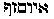, for it is incomprehensible to our finite
intellects, and therefore cannot exist to our minds. Its first emanation
was Sephira, the crown 
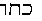. When the time for an active period had come, then
was produced a natural expansion of this Divine essence from within
outwardly, obedient to eternal and immutable law; and from this eternal
and infinite light (which to us is darkness) was emitted a spiritual
substance. [\*](#fn_396) This was the First
Sephiroth, containing in herself the other nine  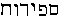 Sephiroth, or
intelligences. In their totality and unity they represent the archetypal
man, Adam Kadmon, the προτογονος, who in his individuality or unity is
yet dual, or bisexual, the Greek *Didumos,* for he is the prototype of
all humanity. Thus we obtain three trinities, each contained in a
"head." In the first head, or face (the three-faced Hindu Trimurti), we
find *Sephira,* the first androgyne, at the apex of the upper triangle,
emitting *Hackama,* or Wisdom, a masculine and active potency--also
called Jah,  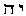-- and
*Binah,  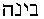, or
Intelligence, a female and passive potency, also represented by the name
Jehovah  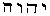. These
three form the first trinity or "face" of the Sephiroth. This triad
emanated Hesed,  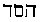,
or Mercy, a masculine active potency, also called El*, from which
emanated *Geburah }
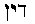, or Justice, also called Eloha, a feminine passive
potency; from the union of these two was produced Tiphereth  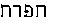, Beauty, Clemency, the
Spiritual Sun, known by the divine name Elohim;* and the second triad,
"face," or "head," was formed. These emanating, in their turn, the
masculine potency *Netzah, 
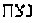, Firmness, or Jehovah Sabaoth, who issued the
feminine passive potency Hod, 
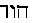, Splendor, or Elohim Sabaoth; the two produced
Jesod,  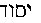,
Foundation, who is the mighty living one El-Chai,* thus yielding the
third trinity or "head." The tenth Sephiroth is rather a duad, and is
represented on the diagrams as the lowest circle. It is Malchuth or
Kingdom,  , and
Shekinah  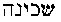, also
called Adonai, and *Cherubim* among the angelic hosts. The first "Head"
is called the Intellectual world; the second "Head" is the Sensuous, or
the world of Perception, and the third is the Material or Physical
world.

"Before he gave any shape to the universe," says the *Kabala,* "before

###### p. 214

he produced any form, he was alone without any form and resemblance to
anything else. Who, then, can comprehend him, how he was before the
creation, since he was formless? Hence, it is forbidden to represent him
by any form, similitude, or even by his sacred name, by a single letter,
or a single point. . . . The Aged of the Aged, the Unknown of the
Unknown, has a form, and yet no form. He has a form whereby the universe
is preserved, and yet has no form, because he cannot be comprehended.
When he first assumed a form (in Sephira, his first emanation), he
caused nine splendid lights to emanate from it." [\*](#fn_397)

And now we will turn to the Hindu esoteric Cosmogony and definition of
"Him who is, and yet is not."

"From him who is, [\*\*](#fn_398) from this
immortal Principle which exists in our minds but cannot be perceived by
the senses, is born Purusha, the Divine male and female, who became
*Narayana,* or the Divine Spirit moving on the water."

Swayambhuva, the unknown essence of the Brahmans, is identical with
En-Soph, the unknown essence of the kabalists. As with the latter, the
ineffable name could not be pronounced by the Hindus, under the penalty
of death. In the ancient primitive trinity of India, that which may be
certainly considered as pre-Vedic, the *germ* which fecundates the
*mother-principle,* the mundane egg, or the universal womb, is called
*Nara,* the Spirit, or the Holy Ghost, which emanates from the
primordial essence. It is like Sephira, the oldest emanation, called the
*primordial point,* and the *White Head,* for it is the point of divine
light appearing from within the fathomless and boundless darkness. In
*Manu* it is "**N**ARA, or the Spirit of God, which moves on Ayana
(Chaos, or place of motion), and is called **N**ARAYANA, or moving on
the waters." [\*\*\*](#fn_399) In Hermes, the
Egyptian, we read: "In the beginning of the time there was naught in the
chaos." But when the "*verbum,*" issuing from the void like a "colorless
smoke," makes its appearance, then "this verbum moved on the humid
principle." [\*\*\*\*](#fn_400) And in
*Genesis* we find: "And darkness was upon the face of the deep (chaos).
And the Spirit of God moved upon the face of the waters." In the
*Kabala,* the emanation of the primordial passive principle (Sephira),
by dividing itself into two parts, active and passive, emits
Chochma-Wisdom and Binah-Jehovah, and in conjunction with these two
acolytes, which complete the trinity, becomes the Creator of the
abstract Universe; the physical world being the production of later and
still more material powers. [\*\*\*\*\*](#fn_401) In the Hindu Cosmogony,
Swayambhuva emits

p. 215

Nara and Nari, its bisexual emanation, and dividing its parts into two
halves, male and female, these fecundate the mundane egg, within which
develops Brahma, or rather Viradj, the Creator. "The starting-point of
the Egyptian mythology," says Champollion, "is a triad . . . namely,
Kneph, Neith, and Phtah; and Ammon, the male, the father; Muth, the
female and mother; and Khons, the son."

The ten Sephiroth are copies taken from the ten Pradjapatis created by
Viradj, called the "Lords of all beings," and answering to the biblical
Patriarchs.

Justin Martyr explains some of the "heresies" of the day, but in a very
unsatisfactory manner. *He shows, however, the identity of all the
world-religions at their starting-points.* The first *beginning* opens
invariably with the *unknown* and passive deity, producing from himself
a

###### p. 216

certain active power or virtue, "Rational," which is sometimes called
**W**ISDOM, sometimes the **S**ON, very often God, Angel, Lord, and
**L**OGOS. [\*](#fn_402) The latter is
sometimes applied to the very first emanation, but in several systems it
proceeds from the first androgyne or double ray produced at the
beginning by the unseen. Philo depicts this wisdom as male and female.
But though its first manifestation had a beginning, for it proceeded
from *Oulom* [\*\*](#fn_403) (Aion, time), the
highest of the Æons, when emitted from the Fathers, it had remained with
him *before all creations,* for it is part of him. [\*\*\*](#fn_404) Therefore, Philo Judaeus calls Adam
Kadmon "*mind*" (the Ennoia of *Bythos* in the Gnostic system). "The
mind, let it be named Adam." [\*\*\*\*](#fn_405)

Strictly speaking, it is difficult to view the Jewish *Book of Genesis*
otherwise than as a chip from the trunk of the mundane tree of universal
Cosmogony, rendered in Oriental allegories. As cycle succeeded cycle,
and one nation after another came upon the world's stage to play its
brief part in the majestic drama of human life, each new people evolved
from ancestral traditions its own religion, giving it a local color, and
stamping it with its individual characteristics. While each of these
religions had its distinguishing traits, by which, were there no other
archaic vestiges, the physical and psychological status of its creators
could be estimated, all preserved a common likeness to one prototype.
This parent cult was none other than the primitive "wisdom-religion."
The Israelitish *Scriptures* are no exception. Their national
history--if they can claim any autonomy before the return from Babylon,
and were anything more than migratory septs of Hindu pariahs, cannot be
carried back a day beyond Moses; and if this ex-Egyptian priest must,
from theological necessity, be transformed into a Hebrew patriarch, we
must insist that the Jewish nation was lifted with that smiling infant
out of the bulrushes of Lake Moeris. Abraham, their alleged father,
belongs to the universal mythology. Most likely he is but one of the
numerous aliases of *Zeruan* (Saturn), the king of the golden age, who
is also called the old man (emblem of time). [\*\*\*\*\*](#fn_406) It is now demonstrated by
Assyriologists that in the old Chaldean books Abraham is called Zeru-an,
or Zerb-an--meaning one very rich in gold and silver, and a mighty
prince. [\*\*\*\*\*\*](#fn_407) He is also
called Zarouan and Zarman--a decrepit old man. [\*\*\*\*\*\*\*](#fn_408)

###### p. 217

The ancient Babylonian legend is that Xisuthrus (Hasisadra of the
Tablets, or Xisuthrus) sailed with his ark to Armenia, and his son Sim
became supreme king. Pliny says that Sim was called Zeruan; and Sim is
Shem. In Hebrew, his name writes img iu2-217}, *Shem--*a sign. Assyria
is held by the ethnologists to be the land of Shem, and Egypt called
that of Ham, Shem, in the tenth chapter of *Genesis* is made the father
of all the children of Eber, of Elam (Oulam or Eilam), and Ashur (Assur
or Assyria). The "*nephelim,*" or fallen men, *Gebers,* mighty men
spoken of in *Genesis* (vi. 4), come from *Oulam,* "men of *Shem.*" Even
Ophir, which is evidently to be sought for in the India of the days of
Hiram, is made a descendant of Shem. The records are purposely mixed up
to make them fit into the frame of the Mosaic *Bible.* But *Genesis,*
from its first verse down to the last, has naught to do with the "chosen
people"; it belongs to the world's history. Its appropriation by the
Jewish authors in the days of the so-called *restoration* of the
destroyed books of the Israelites, by Ezra, proves nothing, and, until
now, has been self-propped on an alleged divine revelation. It is simply
a compilation of the universal legends of the universal humanity. Bunsen
says that in the "Chaldean tribe immediately connected with Abraham, we
find reminiscences of dates disfigured and misunderstood, as genealogies
of single men, or indications of epochs. The Abrahamic recollections go
back at least three millennia beyond the grandfather of Jacob." [\*](#fn_409)

Alexander Polyhistor says that Abraham was born at Kamarina or *Uria,* a
city of soothsayers, and *invented astronomy.* Josephus claims the same
for Terah, Abraham's father. The tower of Babel was built as much by the
direct descendants of Shem as by those of the "accursed" Ham and Canaan,
for the people in those days were "one," and the "whole earth was of one
language"; and Babel was simply an astrological tower, and its builders
were astrologers and adepts of the primitive Wisdom-Religion, or, again,
what we term Secret Doctrine.

The Berosian Sibyl says: Before the Tower, Zeru-an, Titan, and
Yapetosthe governed the earth, Zeru-an wished to be supreme, but his two
brothers resisted, when their sister, Astlik, intervened and appeased
them. It was agreed that Zeru-an should rule, but his male children
should be put to death; and strong Titans were appointed to carry this
into effect.

Sar (circle, saros) is the Babylonian god of the sky. He is also Assaros
or Asshur (the son of Shem), and Zero--Zero-ana, the chakkra, or wheel,
boundless time. Hence, as the first step taken by Zoroaster, while
founding his new religion, was to change the most sacred deities

###### p. 218

of the Sanscrit *Veda* into names of evil spirits, in his Zend
*Scriptures,* and even to reject a number of them, we find no traces in
the *Avesta* of Chakkra--the symbolic circle of the sky.

Elam, another of the sons of Shem, is *Oulam  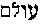*and refers to an order or
cycle of events. In *Ecclesiastes* iii. 11, it is termed "world." In
*Ezekiel* xxvi*.* 20, "of old time." In *Genesis* iii. 22, the word
stands as "forever"; and in chapter ix. 16, "eternal." Finally, the term
is completely defined in *Genesis* vi. 4, in the following words: "There
were *nephelim* (giants, fallen men, or Titans) on the earth." The word
is synonymous with Æon, αιον. In *Proverbs* viii. 23, it reads: "I was
effused from *Oulam*, from *Ras*" (wisdom). By this sentence, the wise
king-kabalist refers to one of the mysteries of the human spirit--the
immortal crown of the man-trinity. While it ought to read as above, and
be interpreted kabalistically to mean that the *I* (or my eternal,
immortal *Ego*), the spiritual entity, was effused from the boundless
and nameless eternity, through the creative wisdom of the unknown God,
it reads in the canonical translation: "The Lord possessed me in the
beginning of his way, before his works of old"! which is unintelligible
nonsense, without the kabalistic interpretation. When Solomon is made to
say that *I* was "from the beginning . . . while, as yet, he (the
Supreme Deity) had not made the earth nor the highest part of the dust
of the world . . . I was there," and "when he appointed the foundations
of the earth . . . then I was by him, *as one brought up with him,*"
what can the kabalist mean by the "*I*," but his own divine spirit, a
drop effused from that eternal fountain of light and wisdom--the
universal spirit of the Deity?

The thread of glory emitted by En-Soph from the highest of the three
kabalistic heads, through which "all things shine with light," the
thread which makes its exit through Adam *Primus,* is the individual
spirit of every man. "I was daily his (En-Soph's) delight, rejoicing
always before him . . . and my delights were *with the sons of men,*"
adds Solomon, in the same chapter of the *Proverbs.* The immortal spirit
delights in the *sons of men,* who, without this spirit, are but
dualities (physical body and astral soul, or that *life-principle* which
animates even the lowest of the animal kingdom). But, we have seen that
the doctrine teaches that this spirit cannot unite itself with that man
in whom matter and the grossest propensities of his animal soul will be
ever crowding it out. Therefore, Solomon, who is made to speak under the
inspiration of his own spirit, that possesses him for the time being,
utters the following words of wisdom: "Hearken unto me, my son" (the
dual man), "blessed are they who keep my ways. . . . Blessed is the man
that heareth me, watching daily at my gates. . . . For whoso *findeth
me, findeth life,* and shall obtain favor of the Lord. . . . But he that

###### p. 219

sinneth *against me* wrongeth his *own soul* . . . and loves *death*"
(*Proverbs* vii. 1-36).

This chapter, as interpreted, is made by some theologians, like
everything else, to apply to Christ, the "Son of God," who states
repeatedly, that he who follows him obtains eternal life, and conquers
death. But even in its distorted translation it can be demonstrated that
it referred to anything but to the alleged Saviour. Were we to accept it
in this sense, then, the Christian theology would have to return,
*nolens volens,* to Averroism and Buddhism; to the doctrine of
emanation, in short; for Solomon says: "I was effused" from Oulam and
Rasit, both of which are a part of the Deity; and thus Christ would not
be as their doctrine claims, God himself, but only an *emanation* of
Him, like the Christos of the Gnostics. Hence, the meaning of the
personified Gnostic Æon, the word signifying cycles or determined
periods in the eternity and at the same time, representing a hierarchy
of celestial beings--spirits. Thus Christ is sometimes termed the
"Eternal Æon." But the word "eternal" is erroneous in relation to the
Æons. Eternal is that which has neither beginning nor end; but the
"Emanations" or Æons, although having lived as absorbed in the divine
essence from the eternity, when once individually emanated, must be said
to have a beginning. They may be therefore *endless* in this spiritual
life, never eternal.

These endless emanations of the one First Cause, all of which were
gradually transformed by the popular fancy into distinct gods, spirits,
angels, and demons, were so little considered immortal, that all were
assigned a limited existence. And this belief, common to all the peoples
of antiquity, to the Chaldean Magi as well as to the Egyptians and even
in our day held by the Brahmanists and Buddhists, most triumphantly
evidences the monotheism of the ancient religious systems. This doctrine
calls the life-period of all the inferior divinities, "one day of
Parabrahma." After a cycle of fourteen milliards, three hundred and
twenty-millions of human years--the tradition says--the trinity itself,
with all the lesser divinities, will be annihilated, together with the
universe, and cease to exist. Then another universe will gradually
emerge from the pralaya (dissolution), and men on earth will be enabled
to comprehend **S**WAYAMBHUVA as he is. Alone, this primal cause will
exist forever, in all his glory, filling the infinite space. What better
proof could be adduced of the deep reverential feeling with which the
"heathen" regard the one Supreme eternal cause of all things visible and
invisible.

This is again the source from which the ancient kabalists derived
identical doctrines. If the Christians understood *Genesis* in their own
way, and, if accepting the texts literally, they enforced upon the
uneducated masses the belief in a creation of our world out of nothing;
and

###### p. 220

moreover assigned to it a *beginning,* it is surely not the Tanaim, the
sole expounders of the hidden meaning contained in the *Bible,* who are
to be blamed. No more than any other philosophers had they ever believed
either in spontaneous, limited, or *ex nihilo* creations. The *Kabala*
has survived to show that their philosophy was precisely that of the
modern Nepal Buddhists, the Svabhavikas. They believed *in the eternity
and the indestructibility of matter,* and hence in many prior creations
and destructions of worlds, before our own. "There were old worlds which
perished." [\*](#fn_410) "From this we see that
the Holy One, blessed be His name, had successively created and
destroyed sundry worlds, before he created the present world; and when
he created this world he said: 'This pleases me; the previous ones did
not please me.' " [\*\*](#fn_411) Moreover,
they believed, again like the Svabhavikas, now termed Atheists, that
every thing proceeds (is created) from its own nature and that once that
the first impulse is given by that Creative Force inherent in the
"Self-created substance," or Sephira, everything evolves out of itself,
following its pattern, the more spiritual prototype which precedes it in
the scale of infinite creation. "The indivisible point which has no
limit, and cannot be comprehended (for it is absolute), expanded from
within, and formed a brightness which served as a garment (a veil) to
the indivisible points. . . . It, too, expanded from within. . . .
Thus*, everything originated through* a constant upheaving agitation,
and thus finally the world originated." [\*\*\*](#fn_412)

In the later Zoroastrian books, after that Darius had restored both the
worship of Ormazd and added to it the purer Magianism of the primitive
*Secret Wisdom-- 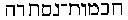, of
which, as the inscription tells us, he was himself a hierophant, we see
again reappearing the Zeru-ana, or boundless time, represented by the
Brahmans in the chakkra,* or a circle; that we see figuring on the
uplifted finger of the principal deities. Further on, we will show the
relation in which it stands to the Pythagorean, mystical numbers--the
first and the last--which is a *zero* (0)*,* and to the greatest of the
Mystery-Gods **IAO**. The identity of this symbol alone, in all the old
religions, is sufficient to show their common descent from one primitive
Faith. [\*\*\*\*](#fn_413) This term of
"boundless time," which can be applied but to the ONE who has neither
beginning nor end, is

###### p. 221

called by the Zoroastrians Zeruana-Akarene, because he has always
existed. "His glory," they say, is too exalted, his light too
resplendent for either human intellect or mortal eyes to grasp and see.
His primal emanation is eternal light which, from having been previously
concealed in darkness, was called out to manifest itself, and thus was
formed Ormazd, "the King of Life." He is the first-born of boundless
time, but like his own antitype, or preexisting spiritual idea, has
lived within primitive darkness from all eternity. His *Logos* created
the pure intellectual world. After the lapse of three grand cycles [\*](#fn_414) he created the material world in six
periods. The six Amshaspands, or *primitive* spiritual men, whom Ormazd
created in his own image, are the mediators between this world and
himself. Mithras is an emanation of the Logos and the chief of the
twenty-eight *izeds,* who are the tutelary angels over the spiritual
portion of mankind--the souls of men. The *Ferouers* are infinite in
number. They are the ideas or rather the ideal conceptions of things
which formed themselves in the mind of Ormazd or Ahuramazda before he
willed them to assume a concrete form. They are what Aristotle terms
"privations" of forms and substances. The religion of Zarathustra, as he
is always called in the *Avesta,* is one from which the ancient Jews
have the most borrowed. In one of the Yashts, Ahuramazda, the Supreme,
gives to the seer as one of his sacred names, *Ahmi,* "I am"; and in
another place, *ahmi yat ahmi,* "I am that I am," as Jehovah is alleged
to have given it to Moses.

This Cosmogony, adopted with a change of names in the Rabbinical
*Kabala,* found its way, later, with some additional speculations of
Manes, the half-Magus, half-Platonist, into the great body of
Gnosticism. The real doctrines of the Basilideans, Valentinians, and the
Marcionites cannot be correctly ascertained in the prejudiced and
calumnious writings of the Fathers of the Church; but rather in what
remains of the works of the Bardesanesians, known as the Nazarenes. It
is next to impossible, now that all their manuscripts and books are
destroyed, to assign to any of these sects its due part in dissenting
views. But there are a few men still living who have preserved books and
direct traditions about the Ophites, although they care little to impart
them to the world. Among the unknown sects of Mount Lebanon and
Palestine the truth has been concealed for more than a thousand years.
And their *diagram* of the Ophite scheme differs with the description of
it given by Origen and hence with the *diagram* of Matter. [\*\*](#fn_415)

###### p. 222

The kabalistic trinity is one of the models of the Christian one. "The
ANCIENT whose name be sanctified, is with three heads, but which make
only one." [\*](#fn_416) *Tria capita exsculpa
sunt, unum intra alterum, et alterum supra alterum.* "Three heads are
inserted in one another, and one over the other. The first head is the
Concealed Wisdom (*Sapientia Abscondita*)*.* Under this head is the
ANCIENT (Pythagorean *Monad*)*,* the most hidden of mysteries; a head
which is no head (*caput quod non est caput*); no one can know what that
is in this head. No intellect is able to comprehend this wisdom. [\*\*](#fn_417) This *Senior Sanctissimus* is
surrounded by the three heads. He is the eternal LIGHT of the wisdom;
and the wisdom is the source from which all the manifestations have
begun. These three heads, included in ONE HEAD (which is no head); and
these three are bent down (overshadow) SHORT-FACE (the son) and through
them all things shine with light." [\*\*\*](#fn_418) "En-Soph emits a thread from El or
*Al* (the highest God of the Trinity), and the light follows the thread
and enters, and passing through makes its exit through Adam *Primus*
(Kadmon), who is *concealed* until the plan for arranging (*statum
dispositionis*) is ready; it threads through him from his head to his
feet; and in him (in the concealed Adam) is the figure of A MAN." [\*\*\*\*](#fn_419)

"Whoso wishes to have an insight into the sacred unity, let him consider
a flame rising from a burning coal or a burning lamp. He will see first
a two-fold light--a bright white, and a black or blue light; the white
light is *above,* and ascends in a direct light, while the blue, or dark
light, is *below,* and seems as the chair of the former, yet both are so
intimately connected together that they constitute only one flame. The
seat, however, formed by the blue or dark light, is again connected with
the burning matter which is *under* it again. The white light never
changes its color, it always remains white; but various shades are
observed in the lower light, whilst the lowest light, moreover, takes
two directions; *above,* it is connected with the white light, and
*below* with the burning matter. Now, this is constantly consuming
itself, and perpetually ascends to the upper light, and thus everything
merges into a single unity." [\*\*\*\*\*](#fn_420)

Such were the ancient ideas of the trinity in the unity, as an
abstraction. Man, who is the microcosmos of the macrocosmos, or of the

###### p. 223

archetypal heavenly man, Adam Kadmon, is likewise a trinity; for he is
*body, soul,* and

spirit.

"All that is created by the 'Ancient of the Ancients' can live and exist
only by a male and a female," says the Sohar. [\*](#fn_421) He alone, to whom no one can say,
"Thou," for he is the spirit of the **W**HITE-**H**EAD in whom the
"**T**HREE **H**EADS" are united, is uncreated. Out of the subtile fire,
on one side of the White Head, and of the "subtile air," on the other,
emanates Shekinah, his veil (the femininized Holy Ghost). "This air,"
says Idra Rabba, "is the most occult (occultissimus) attribute of the
Ancient of the Days. [\*\*](#fn_422) The
Ancienter of the Ancienter is the *Concealed* of the Concealed. [\*\*\*](#fn_423) All things are Himself, and Himself
is concealed on every way. [\*\*\*\*](#fn_424)
The *cranium* of the **W**HITE-**H**EAD has no beginning, but its end
has a shining reflection and a *roundness* which is our universe."

"They regard," says Klenker, "the first-born as man and wife, in so far
as his light includes in itself all other lights, and in so far as his
spirit of life or breath of life includes all other life spirits in
itself." [\*\*\*\*\*](#fn_425) The kabalistic
Shekinah answers to the Ophite Sophia. Properly speaking, Adam Kadmon is
the Bythos, but in this emanation-system, where everything is calculated
to perplex and place an obstacle to inquiry, he is the *Source* of
Light, the first "primitive man," and at the same time *Ennoia,* the
Thought of Bythos, the Depth, for he is Pimander.

The Gnostics, as well as the Nazarenes, allegorizing on the
personification, said that the *First* and *Second* man loved the beauty
of Sophia, (Sephira) the first woman, and thus the Father and the Son
fecundated the heavenly "Woman" and, from primal darkness procreated the
visible light (Sephira is the Invisible, or Spiritual Light), "whom they
called the **A**NOINTED **C**HRISTUM, or King Messiah." [\*\*\*\*\*\*](#fn_426) This Christus is the *Adam of
Dust* before his fall, with the spirit of the Adonai, his Father, and
Shekinah Adonai, his mother, upon him; for Adam Primus is Adon, Adonai,
or Adonis. The primal existence manifests itself by its wisdom, and
produces the *Intelligible* **L**OGOS (all visible creation). This
wisdom was venerated by the Ophites under the form of a serpent. So far
we see that the first and second life are the two Adams, or the first
and the second man. In the former lies *Eva*, or the yet unborn
spiritual Eve, and she is within Adam *Primus,* for she is a part of
himself, who is androgyne. The Eva of dust, she who will be called in

###### p. 224

Genesis "the mother of all that live," is *within* Adam the Second. And
now, from the moment of its first manifestation, the **L**ORD **M**ANO,
the Unintelligible Wisdom, disappears from the scene of action. It will
manifest itself only as Shekinah, the GRACE; for the **C**ORONA is "the
innermost Light of all Lights," and hence it is darkness's own
substance. [\*](#fn_427)

In the *Kabala,* Shekinah is the ninth emanation of Sephira, which
contains the whole of the ten Sephiroth within herself. She belongs to
the third triad and is produced together with *Malchuth* or "Kingdom,"
of which she is the female counterpart. Otherwise she is held to be
higher than any of these; for she is the "Divine Glory," the "veil," or
"garment," of En-Soph. The Jews, whenever she is mentioned in the
*Targum,* say that she is the glory of Jehovah, which dwelt in the
tabernacle, manifesting herself like a visible cloud; the "Glory" rested
over the Mercy-Seat in the

Sanctum Sanctorum.

In the Nazarene or Bardesanian System, which may be termed the Kabala
within the Kabala, the Ancient of Days--*Antiquus Altus,* who is the
Father of the Demiurgus of the universe, is called the *Third* Life, or
*Abatur;* and he is the Father of Fetahil, who is the architect of the
visible universe, which he calls into existence by the powers of his
genii, at the order of the "Greatest"; the Abatur answering to the
"Father" of Jesus in the later Christian theology. These two superior
*Lives* then, are the crown within which dwells the greatest *Ferho.*
"Before any creature came into existence the Lord Ferho existed." [\*\*](#fn_428) This one is the First Life, formless
and invisible; in whom the living Spirit of **L**IFE exists, the Highest
**G**RACE. The two are ONE from eternity, for they are the Light and the
CAUSE of the Light. Therefore, they answer to the kabalistic concealed
*wisdom,* and to the concealed Shekinah--the Holy Ghost. "This light,
which is manifested, is the garment of the Heavenly Concealed," says
Idra Suta. And the "heavenly man" is the superior Adam. "No one knows
his paths except *Macroprosopus*" (Long-face)--the Superior *active*
god. [\*\*\*](#fn_429) "Not as I am *written*
will I be read; in this world my name will be written Jehovah and read
Adonai," [\*\*\*\*](#fn_430) say the Rabbins,
very correctly. Adonai is the Adam Kadmon; he is **F**ATHER and
**M**OTHER both. By this double mediatorship the Spirit of the "Ancient
of the Ancient" descends upon the *Microprosopus* (Short-face) or the
Adam of Eden. And the "Lord God breathes into his nostrils the breath of
life."

When the woman separates herself from her androgyne, and becomes

###### p. 225

a distinct individuality, the first story is repeated over again. Both
the Father and Son, the two Adams, love her beauty; and then follows the
allegory of the temptation and fall. It is in the *Kabala,* as in the
Ophite system, in which both the Ophis and the Ophiomorphos are
emanations emblematized as serpents, the former representing Eternity,
Wisdom, and Spirit (as in the Chaldean Magism of Aspic-worship and
Wisdom-Doctrine in the olden times), and the latter Cunning, Envy, and
Matter. Both spirit and matter are serpents; and Adam Kadmon becomes the
Ophis who tempts himself--man and woman--to taste of the "Tree of Good
and Evil," in order to teach them the mysteries of spiritual wisdom.
Light tempts Darkness, and Darkness attracts Light, for Darkness is
*matter,* and "the *Highest* Light shines not in its *Tenebrae.*" With
knowledge comes the temptation of the Ophiomorphos, and he prevails. The
dualism of every existing religion is shown forth by the fall. "I have
gotten a man from *the Lord,*" exclaims Eve, when the Dualism, Cain and
Abel--evil and good--is born. "And the Adam knew Hua, his woman
(*astu*), and she became pregnant and bore *Kin,* and she said:  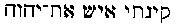: *Kiniti ais* Yava.--I
have gained or obtained a husband, even *Yava--*Is, Ais--man." "*Cum
arbore peccati Deus creavit seculum.*"

And now we will compare this system with that of the Jewish
Gnostics--the Nazarenes, as well as with other philosophies.

The **I**SH **A**MON, the pleroma, or the boundless circle within which
lie "all forms," is the THOUGHT of the power divine; it works in
SILENCE, and suddenly light is begotten by darkness; it is called the
SECOND life; and this one produces, or generates the THIRD. This third
light is "the FATHER of all things that live," as **E**UA is the "mother
of all that live." He is the Creator who calls inert matter into life,
through his vivifying spirit, and, therefore, is called the ancient of
the world. Abatur is the Father who creates the first Adam, who creates
in his turn the second. Abatur opens a gate and walks to the dark water
(chaos), and looking down into it, the darkness reflects the image of
Himself . . . and lo! a **S**ON is formed--the Logos or Demiurge;
Fetahil, who is the builder of the *material* world, is called into
existence. According to the Gnostic dogma, this was the *Metatron,* the
Archangel Gabriel, or messenger of life; or, as the biblical allegory
has it, the androgynous Adam-Kadmon again, the SON, who, with his
Father's spirit, produces the ANOINTED, or Adam before his fall.

When Swayambhuva, the "Lord who exists through himself," feels impelled
to manifest himself, he is thus described in the Hindu sacred books.

Having been impelled to produce various beings from his own divine

###### p. 226

substance, he first manifested the waters which developed within
themselves a productive seed.

The seed became a germ bright as gold, blazing like the luminary with a
thousand beams; and in that egg he was born himself, in the form of
**B**RAHMA, the great principle of all the beings (*Manu,* book i.,
slokas 8, 9).

The Egyptian Kneph, or Chnuphis, Divine Wisdom, represented by a
serpent, produces an egg from his mouth, from which issues Phtha. In
this case Phtha represents the universal germ, as well as Brahma, who is
of the neuter gender, when the final *a* has a diaresis on it; [\*](#fn_431) otherwise it becomes simply one of the
names of the Deity. The former was the model of the **T**HREE **L**IVES
of the Nazarenes, as that of the kabalistic "Faces," **P**HARAZUPHA,
which, in its turn, furnished the model for the Christian Trinity of
Irenaeus and his followers. The egg was the primitive matter which
served as a material for the building of the visible universe; it
contained, as well as the Gnostic Pleroma, the kabalistic Shekinah, the
man and wife, the spirit and life, "whose light includes all other
lights" or life-spirits. This first manifestation was symbolized by a
serpent, which is at first *divine* wisdom, but, *falling into
generation,* becomes polluted. Phtha is the heavenly man, the Egyptian
Adam-Kadmon, or Christ, who, in conjunction with the female Holy Ghost,
the **Z**Œ, produces the five elements, air, water, fire, earth, and
ether; the latter being a servile copy from the Buddhist A'd, and his
five Dhyana Buddhas, as we have shown in the preceding chapter. The
Hindu Swayambhuva-Nara, develops from himself the *mother-principle,*
enclosed within his own divine essence--Nari, the immortal Virgin, who,
when impregnated by his spirit, becomes Tanmatra, the mother of the five
elements--air, water, fire, earth, and ether. Thus may be shown how from
the Hindu cosmogony all others proceed.

Knorr von Rosenroth, busying himself with the interpretation of the
*Kabala,* argues that, "In this first state (of secret wisdom), the
infinite God Himself can be understood as 'Father' (of the new
covenant). But the *Light* being let down by the Infinite through a
canal into the 'primal Adam,' or *Messiah,* and joined with him, can be
applied to the name SON. And the influx emitted down from him (the Son)
to the lower parts (of the universe), can be applied to the character of
the Holy Ghost." [\*\*](#fn_432)
Sophia-Achamoth, the half-spiritual, half-material **L**IFE, which
vivifies the inert matter in the depths of chaos, is the Holy Ghost of
the Gnostics, and the *Spiritus* (female) of the Nazarenes. She is--be
it re-

###### p. 227

membered--the *sister* of *Christos,* the perfect emanation, and both
are children or emanations of Sophia, the purely spiritual and
intellectual daughter of Bythos, the Depth. For the elder Sophia is
Shekinah, the Face of God, "God's Shekinah, which is his image." [\*](#fn_433)

"The *Son* Zeus-Belus, or Sol-Mithra is an image of the Father, an
emanation from the *Supreme Light,*" says Movers. "He passed for
Creator." [\*\*](#fn_434)

"Philosophers say the first air is *anima mundi.* But the garment
(Shekinah) is higher than the first air, since it is joined closer to
the En-Soph, the Boundless." [\*\*\*](#fn_435)
Thus *Sophia* is Shekinah, and Sophia-Achamoth the *anima mundi,* the
astral light of the kabalists, which contains the spiritual and material
germs of all *that is.* For the Sophia-Achamoth, like *Eve*, of whom she
is the prototype, is "the mother of all that live."

There are three trinities in the Nazarene system as well as in the Hindu
philosophy of the ante and early Vedic period. While we see the few
translators of the *Kabala,* the Nazarene *Codex,* and other abstruse
works, hopelessly floundering amid the interminable pantheon of names,
unable to agree as to a system in which to classify them, for the one
hypothesis contradicts and overturns the other, we can but wonder at all
this trouble, which could be so easily overcome. But even now, when the
translation, and even the perusal of the ancient Sanscrit has become so
easy as a point of comparison, they would never think it possible that
every philosophy--whether Semitic, Hamitic, or Turanian, as they call
it, has its key in the Hindu sacred works. Still facts are there, and
facts are not easily destroyed. Thus, while we find the Hindu trimurti
triply manifested as

> Nara (or Para-Pouroucha), Agni, Brahma, the Father,  
> Nari (Mariama), Vaya, Vishnu, the Mother,  
> Viradj (Brahma), Surya, Siva, the Son,

and the Egyptian trinity as follows:

> Kneph (or Amon), Osiris, Ra (Horus), the Father,  
> Maut (or Mut), Isis, Isis, the Mother,  
> Khons, Horus, Malouli, the Son;  id="fr_436">[\*\*\*\*](#fn_436)

the Nazarene System runs,

> Ferho (Ish-Amon), Mano, Abatur, the Father,  
> Chaos (dark water), Spiritus (female), Netubto, the Mother,  
> Fetahil, Ledhaio, Lord Jordan, the Son.

The first is the concealed or non-manifested trinity--a pure
abstraction. The other the active or the one revealed in the results of
creation,

###### p. 228

proceeding out of the former--its spiritual prototype. The third is the
mutilated image of both the others, crystallized in the form of human
dogmas, which vary according to the exuberance of the national
materialistic fancy.

The Supreme Lord of splendor and of light, luminous and refulgent,
before which no other existed, is called Corona (the crown); Lord Ferho,
the unrevealed life which existed in the former from eternity; and Lord
Jordan--the spirit, the living water of grace. [\*](#fn_437) He is the one through whom alone we can
be saved; and thus he answers to the Shekinah, the spiritual garment of
En-Soph, or the Holy Ghost. These three constitute the trinity
*abscondito.* The second trinity is composed of the three lives. The
first is the similitude of Lord Ferho, through whom he has proceeded
forth; and the second Ferho is the King of Light--**M**ANO (*Rex
Lucis*)*.* He is the heavenly life and light, and older than the
Architect of heaven and earth. [\*\*](#fn_438)
The second life is *Ish Amon* (Pleroma), the vase of election,
containing the visible thought of the *Iordanus Maximus--*the *type* (or
its intelligible reflection), the prototype of the living water, who is
the "spiritual Jordan." [\*\*\*](#fn_439) Third
life, which is produced by the other two, is **A**BATUR (*Ab*, the
Parent or Father). This is the mysterious and decrepit "Aged of the
Aged," the "Ancient *Senem sui obtegentem et grandaevum mundi.*" This
latter third Life is the Father of the Demiurge Fetahil, the Creator of
the world, whom the Ophites call Ilda-Baoth, [\*\*\*\*](#fn_440) though Fetahil is the
*only-begotten one,* the reflection of the Father, Abatur, who begets
him by looking into the "dark water";  [\*\*\*\*\*](#fn_441) but the Lord Mano, "the Lord of
loftiness, the Lord of all genii," is higher than the Father, in this
kabalistic *Codex--*one is purely spiritual, the other material. So, for
instance, while Abatur's "only begotten" one is the genius Fetahil, the
Creator of the physical world, Lord Mano, the "Lord of Celsitude," who
is the son of Him, who is "the Father of all who preach the Gospel,"
produces also an "only-begotten" one, the Lord Lehdaio, "a just Lord."
He is the Christos, the anointed, who pours out the "grace" of the
Invisible Jordan, the Spirit of the

Highest Crown.

In the Arcanum, "in the assembly of splendor, lighted by **M**ANO, to
whom the scintillas of splendor owe their origin," the genii who live in
light "rose, they went to the visible Jordan, and flowing water . . .
they assembled for a counsel . . . and called forth the Only-Begotten
Son

###### p. 229

of an imperishable image, and who cannot be conceived by reflection,
Lebdaio, the just Lord, and sprung from Lebdaio, the just lord, whom the
life had produced by his word." [\*](#fn_442)

Mano is the chief of the seven Æons, who are Mano (*Rex Lucis*), Aiar
Zivo, Ignis Vivus, Lux, Vita, Aqua Viva (the living water of baptism,
the genius of the Jordan), and Ipsa Vita, the chief of the six genii,
which form with him the mystic *seven.* The Nazarene Mano is simply the
copy of the Hindu first Manu--the emanation of Manu Swayambhuva--from
whom evolve in succession the six other Manus, types of the subsequent
races of men. We find them all represented by the apostle-kabalist John
in the "seven lamps of fire" burning before the throne, which are the
seven spirits of God," [\*\*](#fn_443) and in
the seven angels bearing the seven vials. Again in Fetahil we recognize
the original of the Christian doctrine.

In the *Revelation* of Joannes Theologos it is said: "I turned and saw
in the midst of the *seven* candlesticks one like unto the Son of man .
. . his head and his hairs were white like wool, as white as snow; and
his eyes were as a flame of fire . . . and his feet like unto fine
brass, as if they burned in a furnace" (i. 13, 14, 15)*. John* here
repeats, as is well known, the words of Daniel and Ezekiel. "The Ancient
of Days . . . whose hair was white as pure wool . . . etc." And "the
appearance of a *man* . . . above the throne . . . and the appearance of
fire, and it had brightness round about." [\*\*\*](#fn_444) The fire being "the glory of the
Lord." Fetahil is son of the man, the Third Life, and his upper part is
represented as white as snow, while standing near the throne of the
living fire he has the appearance of a flame.

All these "apocalyptic" visions are based on the description of the
"white head" of the Sohar, in whom the kabalistic trinity is united. The
white head, "which conceals in its cranium the spirit," and which is
environed by subtile fire. The "appearance of a man" is that of Adam
Kadmon, through which passes the thread of light represented by the
fire. Fetahil is the *Vir Novissimus* (the newest man), the son of
Abatur, [\*\*\*\*](#fn_445) the latter being
the "man," or the *third* life, [\*\*\*\*\*](#fn_446) now the third personage of the
trinity. *John* sees "one like unto the son of man," holding in his
right hand seven stars, and standing between "seven golden candlesticks"
(*Revelation* i.). Fetahil takes his "stand on high," according to the
will of his father, "the highest Æon who has seven sceptres," and

###### p. 230

seven genii, who astronomically represent the seven planets or stars. He
stands "shining in the garment of the Lord's, resplendent by the agency
of the genii." [\*](#fn_447) He is the Son of
his Father, Life, and his mother, Spirit, or Light. [\*\*](#fn_448) The Logos is represented in the
*Gospel according to John* as one in whom was "*Life*, and the life was
the *light* of men" (i. 4). Fetahil is the Demiurge, and his father
created the visible universe of matter through him. [\*\*\*](#fn_449) In the *Epistle of Paul to the
Ephesians* (iii. 9), God is said to have "*created all things* by
Jesus." In the *Codex* the Parent-**L**IFE says: "Arise, go, our son
first-begotten, ordained for all creatures." [\*\*\*\*](#fn_450) "As the living father hath sent
me," says Christ, "God sent his only-begotten son that we might
live." [\*\*\*\*\*](#fn_451) Finally, having
performed his work on earth, Fetahil reascends to his father Abatur.
"*Et* *qui, relicto quem procreavit mundo, ad Abatur suum patrem
contendit,*"* [\*\*\*\*\*\*](#fn_452)* "My
father sent me . . . I go to the Father," repeats Jesus.

Laying aside the theological disputes of Christianity which try to blend
together the Jewish Creator of the first chapter of *Genesis* with the
"Father" of the *New Testament,* Jesus states repeatedly of his Father
that "He is *in secret.*" Surely he would not have so termed the
ever-present "Lord God" of the Mosaic books, who showed Himself to Moses
and the Patriarchs, and finally allowed all the elders of Israel to look
on Himself. [\*\*\*\*\*\*\*](#fn_453) When
Jesus is made to speak of the temple at Jerusalem as of his "Father's
house," he does not mean the physical building, which he maintains he
can destroy and then again rebuild in three days, but of the temple of
Solomon; the wise kabalist, who indicates in his *Proverbs* that every
man is the temple of God, or of his own divine spirit. This term of the
"Father who is in secret," we find used as much in the *Kabala* as in
the *Codex Nazaraeus,* and elsewhere. No one has ever seen the wisdom
concealed in the "Cranium," and no one has beheld the "Depth" (Bythos).
Simon, the *Magician,* preached "one Father unknown to all." [\*\*\*\*\*\*\*\*](#fn_454)

We can trace this appellation of a "secret" God still farther back. In
the *Kabala* the "Son" of the *concealed* Father who dwells in light and
glory, is the "Anointed," the *Seir-Anpin,* who unites in himself all
the Sephiroth, he is Christos, or the Heavenly man. It is through Christ
that the Pneuma, or the Holy Ghost, creates "all things"

###### p. 231

(*Ephesians* iii. 9), and produces the four elements, air, water, fire,
and earth. This assertion is unquestionable, for we find Irenaeus basing
on this fact his best argument for the necessity of there being four
gospels. There can be neither more nor fewer than four--he argues. "For
as there are four quarters of the world, and four general winds
(Καθολικα Πνευματα) . . . it is right that she (the Church) should have
four pillars. From which it is manifest that the Word, *the maker of
all,* he *who sitteth upon the Cherubim* . . . as David says,
supplicating his advent, 'Thou that sittest between the Cherubim, shine
forth!' For the Cherubim also are *four-faced* and their faces are
symbols of the working of the Son of God." [\*](#fn_455)

We will not stop to discuss at length the special holiness of the
four-faced Cherubim, although we might, perhaps, show their origin in
all the ancient pagodas of India, in the *vehans* (or vehicles) of their
chief gods; as likewise we might easily attribute the respect paid to
them to the kabalistic wisdom, which, nevertheless, the Church rejects
with great horror. But, we cannot resist the temptation to remind the
reader that he may easily ascertain the several significances attributed
to these Cherubs by reading the *Kabala.* "When the souls are to leave
their abode," says the *Sohar,* holding to the doctrine of the
pre-existence of souls in the world of emanations, "each soul separately
appears before the Holy King, dressed in a sublime form, with the
features in which it is to appear in this world. It is from this sublime
form that the image proceeds" (*Sohar,* iii., p. 104 ab). Then it goes
on to say that the types or forms of these faces "are four in
number--those of the angel or man, of the lion, the bull, and the
eagle." Furthermore, we may well express our wonder that Irenaeus should
not have re-enforced his argument for the four gospels--by citing the
whole Pantheon of the four-armed Hindu gods!

Ezekiel in representing his four animals, now called Cherubim, as types
of the four symbolical beings, which, in his visions support the throne
of Jehovah, had not far to go for his models. The Chaldeo-Babylonian
protecting genii were familiar to him; the Sed, Alap or *Kirub*
(Cherubim), the bull, with the human face; the Nirgal, human-headed
lion; Oustour the Sphinx-man; and the Nathga, with its eagle's head. The
religion of the masters--the idolatrous Babylonians and Assyrians--was
transferred almost bodily into the revealed Scripture of the Captives,
and from thence came into Christianity.

Already, we find Ezekiel addressed by the likeness of the glory of the
Lord, "as Son of man." This peculiar title is used repeatedly

###### p. 232

throughout the whole book of this prophet, which is as kabalistic as the
"roll of a book" which the "Glory" causes him to eat. It is written
*within* and *without;* and its real meaning is identical with that of
the *Apocalypse.* It appears strange that so much stress should be laid
on this peculiar appellation, said to have been applied by Jesus to
himself, when, in the symbolical or kabalistic language, a prophet is so
addressed. It is as extraordinary to see Irenaeus indulging in such
graphic descriptions of Jesus as to show him, "the maker of all, sitting
upon a Cherubim," unless he identifies him with Shekinah, whose usual
place was among the Charoubs of the Mercy Seat. We also know that the
Cherubim and Seraphim are titles of the "Old Serpent" (the orthodox
Devil) the Seraphs being the burning or fiery serpents, in kabalistic
symbolism. The ten emanations of Adam Kadmon, called the Sephiroth, have
all emblems and titles corresponding to each. So, for instance, the last
two are Victory, or Jehovah-Sabaoth, whose symbol is the right column of
Solomon, the Pillar *Jachin;* while GLORY is the left Pillar, or Boaz,
and its name is "the Old Serpent," and also "Seraphim and
Cherubim." [\*](#fn_456)

The "Son of man" is an appellation which could not be assumed by any one
but a kabalist. Except, as shown above, in the *Old Testament,* it is
used but by one prophet--Ezekiel, the kabalist. In their mysterious and
mutual relations, the Æons or Sephiroth are represented in the *Kabala*
by a great number of circles, and sometimes by the figure of a MAN,
which is symbolically formed out of such circles. This man is
Seir-Anpin, and the 243 numbers of which his figure consists relate to
the different orders of the celestial hierarchy. The original idea of
this figure, or rather the model, may have been taken from the Hindu
Brahma, and the various castes typified by the several parts of his
body, as King suggests in his *Gnostics.* In one of the grandest and
most beautiful cave-temples at Ellora, Nasak, dedicated to Vishvakarma,
son of Brahma, is a representation of this God and his attributes. To
one acquainted with Ezekiel's description of the "likeness of four
living creatures," every one of which had four faces and the hands of a
man under its wings, etc., [\*\*](#fn_457) this
figure at Ellora must certainly appear absolute*ly biblical.* Brahma is
called the father of "man," as well as Jupiter and other highest gods.

It is in the Buddhistic representations of Mount Meru, called by the
Burmese *Mye-nmo*, and by the Siamese *Sineru,* that we find one of the
originals of the Adam Kadmon, Seir-Anpin, the "heavenly man," and of all
the Æons, Sephiroth, Powers, Dominions, Thrones, Virtues, and

###### p. 233

Dignities of the *Kabala.* Between two pillars, which are connected by
an arch, the key-stone of the latter is represented by a *crescent.*
This is the domain in which dwells the Supreme Wisdom of A'di Buddha,
the Supreme and invisible Deity. Beneath this highest central point
comes the circle of the direct emanation of the Unknown--the circle of
Brahma with some Hindus, of the first *avatar* of Buddha, according to
others. This answers to Adam Kadmon and the ten Sephiroth. Nine of the
emanations are encircled by the tenth, and occasionally represented by
pagodas, each of which bears a name which expresses one of the chief
attributes of the manifested Deity. Then below come the seven stages, or
heavenly spheres, each sphere being encircled by a sea. These are the
celestial mansions of the *devatas,* or gods, each losing somewhat in
holiness and purity as it approaches the earth. Then comes Meru itself,
formed of numberless circles within three large ones, typifying the
trinity of man; and for one acquainted with the numerical value of the
letters in biblical names, like that of the "Great Beast," or that of
Mithra Μιθρας αβραχας, and others, it is an easy matter to establish the
identity of the Meru-gods with the emanations or Sephiroth of the
kabalists. Also the genii of the Nazarenes, with their special missions,
are all found on this most ancient mythos, a most perfect representation
of the symbolism of the "secret doctrine," as taught in archaic ages.

King gives a few hints--though doubtless too insufficient to teach
anything important, for they are based upon the calculations of Bishop
Newton [\*](#fn_458)--as to this mode of
finding out mysteries in the value of letters. However, we find this
great archaeologist, who has devoted so much time and labor to the study
of Gnostic gems, corroborating our assertion. He shows that the entire
theory is Hindu, and points out that the durga, or female counterpart of
each Asiatic god, is what the kabalists term active *Virtue* [\*\*](#fn_459) in the celestial hierarchy, a term
which the Christian Fathers adopted and repeated, without fully
appreciating, and the meaning of which the later theology has utterly
disfigured. But to return to Meru.

###### p. 234

The whole is surrounded by the Maha Samut, or the great sea--the astral
light and ether of the kabalists and scientists; and within the central
circles appears "the likeness of a man." He is the Achadoth of the
Nazarenes, the twofold unity, or the androgyne man; the heavenly
incarnation, and a perfect representation of Seir-Anpin (short-face),
the son, of *Arich Anpin* (long-face). [\*](#fn_460) This likeness is now represented in
many lamaseries by Gautama-Buddha, the last of the incarnated avatars.
Still lower, under the Meru, is the dwelling of the great Naga, who is
called *Rajah Naga,* the king-serpent--the serpent of *Genesis,* the
Gnostic Ophis--and the goddess of the earth, Bhumay Nari, or Yama, who
waits upon the great dragon, for she is Eve, "the mother of all that
live." Still lower is the eighth sphere, the infernal regions. The
uppermost regions of Brahma are surrounded by the sun, moon, and
planets, the seven stellars of the Nazarenes, and just as they are
described in the

Codex.

"The seven impostor-Daemons who deceive the sons of Adam. The name of
one is *Sol;* of another *Spiritus Venereus,* Astro; of the third
*Nebu,* Mercurius *a false Messiah;* . . . the name of a fourth is Sin
*Luna;* the fifth is *Kiun,* Saturnus; the sixth, Bel-Zeus; the seventh,
Nerig-*Mars.*"* [\*\*](#fn_461)* Then there are
"*Seven Lives* procreated," seven good Stellars, "which are from Cabar
Zio, and are those bright ones who shine in their own form and splendor
that pours from on high. . . . At the gate of the **H**OUSE OF **L**IFE
the throne is fitly placed for the Lord of Splendor, and there are THREE
habitations." [\*\*\*](#fn_462) The habitations
of the *Trimurti,* the Hindu trinity, are placed beneath the
key-stone--the golden crescent, in the representation of Meru. "And
there was under his feet (of the God of Israel) as it were a paved work
of a sapphire-stone" (*Exodus* xxiv. 10). Under the crescent is the
heaven of Brahma, all paved with sapphires. The paradise of Indra is
resplendent with a thousand suns; that of Siva (Saturn), is in the
northeast; his throne is formed of lapis-lazuli and the floor of heaven
is of fervid gold. "When he sits on the throne he blazes with fire up to
*the loins.*" At Hurdwar, during the fair, in which he is more than ever
Mahadeva, the highest god, the attributes and emblems sacred to the
Jewish "Lord God," may be recognized one by one in those of Siva. The
Binlang stone, [\*\*\*\*](#fn_463) sacred to
this Hindu deity, is an unhewn stone like the Beth-el, consecrated by
the Patriarch Jacob, and set up by him "for a pillar," and like the
latter

###### p. 235

Binlang is *anointed.* We need hardly remind the student that the
*linga,* the emblem sacred to Siva and whose temples are modelled after
this form, is identical in shape, meaning, and purpose with the
"pillars" set up by the several patriarchs to mark their adoration of
the Lord God. In fact, one of these patriarchal lithoi might even now be
carried in the Sivaitic processions of Calcutta, without its Hebrew
derivation being suspected. The four arms of Siva are often represented
with appendages like wings; he has *three* eyes and a *fourth* in the
crescent, obtained by him at the churning of the ocean, as Pancha Mukhti
Siva has four heads.

In this god we recognize the description given by Ezekiel, in the first
chapter of his book, of his vision, in which he beholds the "likeness of
a man" in the four living creatures, who had "four faces, four wings,"
who had one pair of "straight feet . . . which sparkled like the color
*of burnished* brass . . . and their rings were full of eyes round about
them four." It is the throne and heaven of Siva that the prophet
describes in saying " . . . and there was the likeness of a throne as
the appearance of a sapphire stone . . . and I saw as the color of amber
(gold) as the appearance of fire around about . . . from his loins even
upward, and from the appearance of his loins even downward, I saw as it
were the appearance of fire" (*Ezekiel* i. 27). "And his feet like unto
fine brass, as if they burned in a furnace" (*Revelation* i*.* 15). "As
for their faces . . . one had the face of a cherub, and the face of a
lion . . . they also had the face of *an ox* and the face of an eagle"
(*Ezekiel* i*.* 10, x. 14). This *fourfold* appearance which we find in
the two *cherubims* of gold on the two ends of the ark; these symbolic
four *faces* being adopted, moreover, later, one by each evangelist, as
may be easily ascertained from the pictures of Matthew, Mark, Luke, and
John, [\*](#fn_464) prefixed to their
respective gospels in the Roman Vulgate and Greek

Bibles.

"Taaut, the great god of the Phoenicians," says Sanchoniathon, "to
express the character of Saturn or Kronos, made his image having four
eyes . . . two before, two behind, open and closed, and four wings, two
expanded, two folded. The eyes denote that the god sees in sleep, and
sleeps in waking; the position of the wings that he flies in rest, and
rests in flying."

The identity of Saturn with Siva is corroborated still more when we
consider the emblem of the latter, the *damara,* which is an hour-glass,
to show the progress of time, represented by this god in his capacity of
a destroyer. The bull Nardi, the *vehan* of Siva and the most sacred em-

###### p. 236

blem of this god, is reproduced in the Egyptian Apis; and in the bull
created by Ormazd and killed by Ahriman. The religion of Zoroaster, all
based upon the "secret doctrine," is found held by the people of
Eritene; it was the religion of the Persians when they conquered the
Assyrians. From thence it is easy to trace the introduction of this
emblem of **L**IFE represented by the Bull, in every religious system.
The college of the Magians had accepted it with the change of
dynasty; [\*](#fn_465) Daniel is described as a
Rabbi, the chief of the Babylonian astrologers and Magi; [\*\*](#fn_466) therefore we see the Assyrian little
bulls and the attributes of Siva reappearing under a hardly modified
form in the cherubs of the Talmudistic Jews, as we have traced the bull
Apis in the sphinxes or cherubs of the Mosaic Ark; and as we find it
several thousand years later in the company of one of the Christian
evangelists, Luke.

Whoever has lived in India long enough to acquaint himself even
superficially with the native deities, must detect the similarity
between Jehovah and other gods besides Siva. As Saturn, the latter was
always held in great respect by the Talmudists. He was held in reverence
by the Alexandrian kabalists as the direct inspirer of the law and the
prophets; one of the names of Saturn was Israel, and we will show, in
time, his identity in a certain way with Abram, which Movers and others
hinted at long since. Thus it cannot be wondered at if Valentinus,
Basilides, and the Ophite Gnostics placed the dwelling of their
Ilda-Baoth, also a destroyer as well as a creator, in the planet Saturn;
for it was he who gave the law in the wilderness and spoke through the
prophets. If more proof should be required we will show it in the
testimony of the canonical *Bible* itself. In *Amos* the "Lord" pours
vials of wrath upon the people of Israel. He rejects their
burnt-offerings and will not listen to their prayers, but inquires of
Amos, "have ye offered unto *me* sacrifices and offerings in the
wilderness forty years, O house of Israel?" "But ye have borne the
tabernacles of your Moloch and *Chiun* your images, the *star of your
god*" (v. 25, 26). Who are Moloch and *Chiun* but Baal--Saturn--Siva,
and *Chiun,* Kivan, the same Saturn whose star the Israelites had made
to themselves? There seems no escape in this case; all these deities are
identical.

The same in the case of the numerous Logoi. While the Zoroastrian
Sosiosh is framed on that of the tenth Brahmanical Avatar, and the fifth
Buddha of the followers of Gautama; and we find the former, after having
passed part and parcel into the kabalistic system of king Messiah,
reflected in the Apostle Gabriel of the Nazarenes, and Æbel-Zivo, the
Legatus, sent on earth by the Lord of Celsitude and Light; all of these
--

###### p. 237

Hindu and Persian, Buddhist and Jewish, the Christos of the Gnostics and
the Philonean Logos--are found combined in "the Word made flesh" of the
fourth *Gospel.* Christianity includes all these systems, patched and
arranged to meet the occasion. Do we take up the *Avesta--*we find there
the dual system so prevalent in the Christian scheme. The struggle
between Ahriman, [\*](#fn_467) Darkness, and
Ormazd, Light, has been going on in the world continually since the
beginning of time. When the worst arrives and Ahriman will seem to have
conquered the world and corrupted all mankind, *then will appear the
Saviour* of mankind, Sosiosh. He will come seated upon a white horse and
followed by an army of good genii equally mounted on milk-white
steeds. [\*\*](#fn_468) And this we find
faithfully copied in the *Revelation:* "I saw heaven opened, and beheld
a *white horse;* and he that sat upon him was called faithful and true.
. . . And the armies which were in heaven followed him upon white
horses" (*Revelation* xix. 11, 14). Sosiosh himself is but a later
Persian *permutation* of the Hindu Vishnu. The figure of this god may be
found unto this day representing him as the Saviour, the "Preserver"
(the preserving spirit of God), in the temple of Rama. The picture shows
him in his tenth incarnation--the *Kalki avatar,* which is yet to
come--as an armed warrior mounted upon a white horse. Waving over his
head the sword destruction, he holds in his other hand a discus, made up
of rings encircled in one another, an emblem of the revolving cycles or
great ages, [\*\*\*](#fn_469) for Vishnu will
thus appear but at the end of the *Kaliyug,* answering to the end of the
world expected by our Adventists. "And out of his mouth goeth a sharp
sword . . . on his head were many crowns" (*Revelation* xix*.* 12).
Vishnu is often represented with several crowns superposed on his head.
"And I saw an angel standing on the Sun" (17). The *white horse is the
horse of the Sun.* [\*\*\*\*](#fn_470) Sosiosh,
the Persian Saviour, is also born of a virgin, [\*\*\*\*\*](#fn_471) and at the end of days he will
come as a Redeemer to regenerate the world, but he will be preceded by
two prophets, who will come to announce him. [\*\*\*\*\*\*](#fn_472) Hence the Jews who had Moses
and Elias, are now waiting for the Messiah. "Then comes the

###### p. 238

general *resurrection,* when the good will immediately enter into this
happy abode--the regenerated earth; and Ahriman and his angels (the
devils), [\*](#fn_473) and the wicked, be
purified by immersion in a lake of molten metal. . . . Henceforward, all
will enjoy unchangeable happiness, and, headed by Sosiosh, ever sing the
praises of the Eternal One." [\*\*](#fn_474)
The above is a perfect repetition of Vishnu in his tenth avatar, for he
will then throw the wicked into the infernal abodes in which, after
purifying themselves, they will be pardoned--even those devils which
rebelled against Brahma, and were hurled into the bottomless pit by
Siva, [\*\*\*](#fn_475) as also the "blessed
ones" will go to dwell with the gods, over the Mount Meru.

Having thus traced the similarity of views respecting the Logos,
Metatron, and Mediator, as found in the *Kabala* and the *Codex* of the
Christian Nazarenes and Gnostics, the reader is prepared to appreciate
the audacity of the Patristic scheme to reduce a purely metaphysical
figure into concrete form, and make it appear as if the finger of
prophecy had from time immemorial been pointing down the vista of ages
to Jesus as the coming Messiah. A theomythos intended to symbolize the
coming day, near the close of the great cycle, when the "glad tidings"
from heaven should proclaim the universal brotherhood and common faith
of humanity, the day of regeneration--was violently distorted into an
accomplished fact.

"Why callest thou me good? there is none good but *one, that is God,*"
says Jesus. Is this the language of a God? of the second person in the
Trinity, who is identical with the First? And if this Messiah, or Holy
Ghost of the Gnostic and Pagan Trinities, had come in his person, what
did he mean by distinguishing between himself the "Son of man," and the
Holy Ghost? "And whosoever shall speak a word against the Son of man, it
shall be forgiven him; but unto him that blasphemeth against the Holy
Ghost, it shall not be forgiven," he says. [\*\*\*\*](#fn_476) And how account for the
marvellous identity of this very language, with the precepts enunciated,
centuries before, by the Kabalists and the "Pagan" initiates? The
following are a few instances out of many.

"No one of the gods, no man or Lord, can be good, but *only God alone,*"
says Hermes. [\*\*\*\*\*](#fn_477)

###### p. 239

"To be a good man is impossible, God alone possesses this privilege,"
repeats Plato, with a slight variation. [\*](#fn_478)

Six centuries before Christ, the Chinese philosopher Confucius said that
his doctrine was simple and easy to comprehend (*Lun-yu*, chap. 5, §
15). To which one of his disciples added: "The doctrine of our Master
consists in having an invariable correctness of heart, and in doing
toward others as we would that they should do to us." [\*\*](#fn_479)

"Jesus of Nazareth, a man approved of God among you by miracles," [\*\*\*](#fn_480) exclaims Peter, long after the
scene of Calvary. "There was a *man* sent from God, whose name was
John," [\*\*\*\*](#fn_481) says the fourth
*Gospel,* thus placing the Baptist on an equality with Jesus. John the
Baptist, in one of the most solemn acts of his life, that of baptizing
Christ, thinks not that he is going to baptize *a God,* but uses the
word man. "This is he of whom I said, after me cometh *a man.*"* [\*\*\*\*\*](#fn_482)* Speaking of himself, Jesus
says, "You seek to kill *me, a man* that hath told you the truth, which
*I have heard of God. [\*\*\*\*\*\*](#fn_483)*
Even the blind man of Jerusalem, healed by the great thaumaturgist, full
of gratitude and admiration for his benefactor, in narrating the miracle
does not call Jesus God, but simply says, ". . . *a man* that is called
Jesus, made clay." [\*\*\*\*\*\*\*](#fn_484)

We do not close the list for lack of other instances and proofs, but
simply because what we now say has been repeated and demonstrated by
others, many times before us. But there is no more incurable evil than
blind and unreasoning fanaticism. Few are the men who, like Dr.
Priestley, have the courage to write, "We find nothing like divinity
ascribed to Christ before Justin Martyr (A. D. 141), who, from being a
philosopher, became a Christian." [\*\*\*\*\*\*\*\*](#fn_485)

Mahomet appeared nearly six hundred years [\*\*\*\*\*\*\*\*\*](#fn_486) after the presumed
deicide. The Graeco-Roman world was still convulsed with religious
dissensions, withstanding all the past imperial edicts and forcible
Christianization. While the Council of Trent was disputing about the
*Vulgate,* the unity of God quietly superseded the trinity, and soon the
Mahometans outnumbered the Christians. Why? Because their prophet never
sought to identify himself with Allah. Otherwise, it is safe to say, he
would not have lived to see his religion flourish. Till the present day
Mahometanism has made and is now making more proselytes than
Christianity. Buddha Siddhartha came as a simple mortal, centuries
before Christ. The religious ethics of this faith are now found to far
exceed

###### p. 240

in moral beauty anything ever dreamed of by the Tertullians and
Augustines.

The true spirit of Christianity can alone be fully found in Buddhism;
partially, it shows itself in other "heathen" religions. Buddha never
made of himself a god, nor was he deified by his followers. The
Buddhists are now known to far outnumber Christians; they are enumerated
at nearly 500,000,000. While cases of conversion among Buddhists,
Brahmanists, Mahometans, and Jews become so rare as to show how sterile
are the attempts of our missionaries, atheism and materialism spread
their gangrenous ulcers and gnaw every day deeper at the very heart of
Christianity. There are no atheists among heathen populations, and those
few among the Buddhists and Brahmans who have become infected with
materialism may always be found to belong to large cities densely
thronged with Europeans, and only among educated classes. Truly says
Bishop Kidder: "Were a wise man to choose his religion from those who
profess it, perhaps Christianity would be the last religion he would
choose!"

In an able little pamphlet from the pen of the popular lecturer, J. M.
Peebles, **M.D**., the author quotes, from the London *Athenaeum*, an
article in which are described the welfare and civilization of the
inhabitants of Yarkand and Kashgar, "who seem virtuous and happy."
"Gracious Heavens!" fervently exclaims the honest author, who himself
was once a Universalist clergyman, "Grant to keep Christian missionaries
*away* from 'happy' and heathen Tartary!" [\*](#fn_487)

From the earliest days of Christianity, when Paul upbraided the *Church*
of Corinth for a crime "as is not so much as named among the
Gentiles--that one should have his father's wife"; and for their making
a pretext of the "Lord's Supper" for *debauch* and drunkenness (1
*Corinthians,* v. 1), the profession of the name of Christ has ever been
more a pretext than the evidence of holy feeling. However, a correct
form of this verse is: "Everywhere the lewd practice among you is heard
about, such a lewd practice as is nowhere among the heathen
nations--even the having or marrying of the father's wife." The Persian
influence would seem to be indicated in this language. The practice
existed "nowhere among the nations," except in Persia, where it was
esteemed especially meritorious. Hence, too, the Jewish stories of
Abraham marrying his sister, Nahor, his niece, Amram his father's
sister, and Judah his son's widow, whose children appear to have been
legitimate. The Aryan tribes esteemed endogamic marriages, while the
Tartars and all barbarous nations required all alliances to be
exogamous.

###### p. 241

There was but one apostle of Jesus worthy of that name, and that was
Paul. However disfigured were his *Epistles* by dogmatic hands before
being admitted into the Canon, his conception of the great and divine
figure of the philosopher who died for his idea can still be traced in
his addresses to the various Gentile nations. Only, he who would
understand him better yet must study the Philonean *Logos* reflecting
now and then the Hindu *Sabda* (logos) of the Mimansa school.

As to the other apostles, those whose names are prefixed to the
*Gospels--*we cannot well believe in their veracity when we find them
attributing to their Master miracles surrounded by circumstances,
recorded, if not in the oldest books of India, at least in such as
antedated Christianity, and in the very phraseology of the traditions.
Who, in his days of simple and blind credulity, but marvelled at the
touching narrative given in the *Gospels according to Mark* and *Luke*
of the resurrection of the daughter of Jairus? Who has ever doubted its
originality? And yet the story is copied entirely from the
*Hari-Purana,* and is recorded among the miracles attributed to
Christna. We translate it from the French version:

"The King Angashuna caused the betrothal of his daughter, the beautiful
Kalavatti, with the young son of Vamadeva, the powerful King of
Antarvedi, named Govinda, to be celebrated with great pomp.

"But as Kalavatti was amusing herself in the groves with her companions,
she was stung by a serpent and died. Angashuna tore his clothes, covered
himself with ashes, and cursed the day when he was born.

"Suddenly, a great rumor spread through the palace, and the following
cries were heard, a thousand times repeated: *'Pacya pitaram; pacya
gurum*!' 'The Father, the Master!' Then Christna approached, smiling,
leaning on the arm of Ardjuna. . . . 'Master!' cried Angashuna, casting
himself at his feet, and sprinkling them with his tears, 'See my poor
daughter!' and he showed him the body of Kalavatti, stretched upon a
mat. . . .

" 'Why do you weep?' replied Christna, in a gentle voice. '*Do you not
see that she is sleeping?* Listen to the sound of her breathing, like
the sigh of the night wind which rustles the leaves of the trees. See,
her cheeks resuming their color, her eyes, whose lids tremble as if they
were about to open; her lips quiver as if about to speak; she is
sleeping, I tell you; and hold! see, she moves, *Kalavatti! Rise and
walk*!'

"Hardly had Christna spoken, when the breathing, warmth, movement, and
life returned little by little, into the corpse, and the young girl,
obeying the injunction of the demi-god, rose from her couch and

###### p. 242

rejoined her companions. But the crowd marvelled and cried out: 'This is
a god, since death is no more for him than sleep!' " [\*](#fn_488)

All such parables are enforced upon Christians, with the addition of
dogmas which, in their extraordinary character, leave far behind them
the wildest conceptions of heathenism. The Christians, in order to
believe in a Deity, have found it necessary to kill their God, that they
themselves should live!

And now, the Supreme, unknown one, the Father of grace and mercy, and
his celestial hierarchy are managed by the Church as though they were so
many theatrical stars and supernumeraries under salary! Six centuries
before the Christian era, Xenophanes had disposed of such
anthropomorphism by an immortal satire, recorded and preserved by
Clement of Alexandria.

> "There is one God Supreme. . . . . . . . .  
> Whose form is not like unto man's, and as unlike his nature;  
> But vain mortals imagine that gods like themselves are begotten  
> With human sensations, and voice, and corporeal members;  
> So if oxen or lions had hands and could work in man's fashion  
> And trace out with chisel or brush their conception of Godhead  
> Then would horses depict gods like horses, and oxen like oxen,  
> Each kind the Divine with its own form and nature endowing."  id="fr_489">[\*\*](#fn_489)

And hear Vyasa--the poet-pantheist of India, who, for all the scientists
can prove, may have lived, as Jacolliot has it, some fifteen thousand
years ago--discoursing on Maya, the illusion of the senses:

"All religious dogmas only serve to obscure the intelligence of man. . .
. Worship of divinities, under the allegories of which, is hidden
respect for natural laws, drives away truth to the profit of the basest
superstitions" (*Vyasa Maya*)

.

It was given to Christianity to paint us God Almighty after the model of
the kabalistic abstraction of the "Ancient of Days." From old frescos on
cathedral ceilings; Catholic missals, and other icons and images, we now
find him depicted by the poetic brush of Gustave Dore. The awful,
unknown majesty of Him, whom no "heathen" dared to reproduce in concrete
form, is figuring in our own century in *Dore's Illustrated Bible.*
Treading upon clouds that float in mid-air, darkness and chaos behind
him and the world beneath his feet, a majestic old man stands, his left
hand gathering his flowing robes about him, and his right raised in the
gesture of command. He has spoken the Word, and

###### p. 243

from his towering person streams an effulgence of Light--the Shekinah.
As a poetic conception, the composition does honor to the artist, but
does it honor God? Better, the chaos behind Him, than the figure itself;
for there, at least, we have a solemn mystery. For our part, we prefer
the silence of the ancient heathens. With such a gross, anthropomorphic,
and, as we conceive, blasphemous representation of the First Cause, who
can feel surprised at any iconographic extravagance in the
representation of the Christian Christ, the apostles, and the putative
Saints? With the Catholics St. Peter becomes quite naturally the janitor
of Heaven, and sits at the door of the celestial kingdom--a ticket-taker
to the Trinity!

In a religious disturbance which recently occurred in one of the
Spanish-American provinces, there were found upon the bodies of some of
the killed, passports signed by the Bishop of the Diocese and addressed
to St. Peter; bidding him "*admit the bearer as a true son of the
Church.*" It was subsequently ascertained that these unique documents
were issued by the Catholic prelate just before his deluded parishioners
went into the fight at the instigation of their priests.

In their immoderate desire to find evidence for the authenticity of the
*New Testament,* the best men, the most erudite scholars even among
Protestant divines, but too often fall into deplorable traps. We cannot
believe that such a learned commentator as Canon Westcott could have
left himself in ignorance as to Talmudistic and purely kabalistic
writings. How then is it that we find him quoting, with such serene
assurance as presenting "striking analogies to the *Gospel of St.
John,*" passages from the work of *The Pastor of Hermas,* which are
complete sentences from the kabalistic literature? "The view which
Hermas gives of Christ's nature and work is no less harmonious with
apostolic doctrine, and it offers striking analogies to the *Gospel of
St. John*. . . . He (Jesus) is a rock higher than the mountains, able to
hold the whole world, ancient, and yet having a new gate! . . . He is
older than creation, so that he took counsel with the Father about the
creation which he made. . . . No one shall enter in unto him otherwise
than by his Son." [\*](#fn_490)

Now while--as the author of *Supernatural Religion* well proves --

###### p. 244

there is nothing in this which looks like a corroboration of the
doctrine taught in the fourth gospel, he omits to state that nearly
everything expressed by the pseudo-Hermas in relation to his parabolic
conversation with the "Lord" is a plain quotation, with repeated
variations, from the *Sohar* and other kabalistic books. We may as well
compare, so as to leave the reader in no difficulty to judge for
himself.

"God," says Hermas, "planted the vineyard, that is, He created the
people and gave them to His Son; and the Son . . . himself cleansed
their sins, etc."; *i.e.*, the Son washed them in his blood, in
commemoration of which Christians drink wine at the communion. In the
*Kabala* it is shown that the Aged of the Aged, or "*Long-Face,*" plants
a vineyard, the latter typifying mankind; and a vine, meaning Life. The
Spirit of "*King* Messiah" is, therefore, shown as washing his garments
in *the wine* from above, from the creation of the world. [\*](#fn_491) Adam, or A-Dam is "blood." The life of
the flesh is in the blood (nephesh--soul), *Leviticus* xvii. And
Adam-Kadmon is the Only-Begotten. Noah also plants a vineyard--the
allegorical hot-bed of future humanity. As a consequence of the adoption
of the same allegory, we find it reproduced in the Nazarene *Codex.*
Seven vines are procreated, which spring from Iukabar Ziva, and Ferho
(or Parcha) Raba waters them. [\*\*](#fn_492)
When the blessed will ascend among the creatures of Light, they shall
see Iavar-Zivo, *Lord of* **L**IFE, and the First **V**INE! [\*\*\*](#fn_493) These kabalistic metaphors are thus
naturally repeated in the *Gospel according to John* (xv. 1): "I am the
true vine, and my Father is the husbandman." In *Genesis* (xlix.), the
dying Jacob is made to say, "The sceptre shall not depart from Judah
(the lion's whelp), nor a lawgiver from between his feet, until Shiloh
(Siloh) comes. . . . Binding his colt unto *the vine,* and his ass's
colt unto the choice vine, he washed his garments *in wine,* and his
clothes *in* *the blood of grapes.*" Shiloh is "King Messiah," as well
as the Shiloh in Ephraim, which was to be made the capital and the place
of the sanctuary. In *The Targum of Onkelos,* the Babylonian, the words
of Jacob read: "Until the *King Messiah* shall come." The prophecy has
failed in the Christian as well as in the kabalistico-Jewish sense. The
sceptre has departed from Judah, whether the Messiah has already or will
come, unless we believe, with the kabalists, that Moses was the first
Messiah, who transferred his soul to Joshua--Jesus. [\*\*\*\*](#fn_494)

Says Hermas: "And, in the middle of the plain, he showed me a great
*white* rock, which had risen out of the plain, and the rock was

###### p. 245

higher than the mountains, rectangular, so as to be able to hold the
whole world; but that rock was old, having a gate hewn out of it, and
the hewing out of the gate seemed to me to be recent." In the *Sohar,*
we find: "To 40,000 superior worlds the *white* of the skull of His Head
(of the most Sacred Ancient *in absconditus*) is extended. [\*](#fn_495) . . . When *Seir* (the first reflection
and image of his Father, the Ancient of the Ancient) will, through the
mystery of the seventy names of Metatron, descend into Iezirah (the
third world), he will open a new gate. . . . The Spiritus Decisorius
will cut and divide the garment (Shekinah) into two parts. [\*\*](#fn_496) . . . At the coming of King Messiah,
from the sacred cubical stone of the Temple a *white light* will be
arising during forty days. This will expand, until *it encloses the
whole world*. . . . At that time King Messiah will allow himself to be
revealed, and will be seen coming out of the gate of the garden of Odan
(Eden). 'He will be revealed in the land Galil.' [\*\*\*](#fn_497) . . . When 'he has made
satisfaction for the sins of Israel, he will lead them on through a *new
gate* to the seat of judgment.' [\*\*\*\*](#fn_498) At the *Gate of the House of
Life,* the throne is prepared for the Lord of Splendor." [\*\*\*\*\*](#fn_499)

Further on, the commentator introduces the following quotation: "This
*rock* and this *gate* are the Son of God. 'How, Lord,' I said, 'is the
rock old and the gate new?' 'Listen,' He said, 'and understand, thou
ignorant man. The *Son of God is older than all of his creation,* so
that he was a Councillor with the Father in His works of creation; and
for this is he old.' " [\*\*\*\*\*\*](#fn_500)

Now, these two assertions are not only purely kabalistic, without even
so much as a change of expression, but Brahmanical and Pagan likewise.
"*Vidi virum excellentem coeli terraeque conditore natu majorem.* . . .
I have seen the most excellent (superior) MAN, who is older by birth
than the maker of heaven and earth," says the kabalistic *Codex. [\*\*\*\*\*\*\*](#fn_501)* The Eleusinian Dionysus,
whose particular name was *Iacchos* (Iaccho, Iahoh) [\*\*\*\*\*\*\*\*](#fn_502)--the God from whom the
liberation of souls was expected--was considered older than the
Demiurge. At the mysteries of the Anthesteria at the lakes (the Limnae),
after the usual baptism by purification of water, the *Mystae* were made
to pass through to another door (gate), and one

###### p. 246

particularly for that purpose, which was called "the gate of Dionysus,"
and that of "the *purified.*"

In the *Sohar,* the kabalists are told that the work-master, the
Demiurge, said to the Lord: "Let us make man after our image." [\*](#fn_503) In the original texts of the first
chapter of *Genesis,* it stands: "And the *Elohim* (translated as the
Supreme God), who are the highest gods or powers, said: Let us make man
in *our* (?) image, after *our* likeness." In the *Vedas,* Brahma holds
counsel with Parabrahma, as to the best mode to proceed to create the
world.

Canon Westcott, quoting Hermas, shows him asking: "And why is the gate
*new*, Lord? I said. 'Because,' he replied, 'he was manifested at the
last of the days of the dispensation; for this cause the gate was made
new, in order that they who shall be saved might enter by it into the
Kingdom of God.' " [\*\*](#fn_504) There are
two peculiarities worthy of note in this passage. To begin with, it
attributes to "the Lord" a false statement of the same character as that
so emphasized by the Apostle John, and which brought, at a later period,
the whole of the orthodox Christians, who accepted the apostolic
allegories as literal, to such inconvenient straits. Jesus, as Messiah,
was *not* manifested at the last of the days; for the latter are yet to
come, notwithstanding a number of divinely-inspired prophecies, followed
by disappointed hopes, as a result, to testify to his immediate coming.
The belief that the "last times" had come, was natural, when once the
coming of King Messiah had been acknowledged. The second peculiarity is
found in the fact that the *prophecy* could have been accepted at all,
when even its approximate determination is a direct contradiction of
Mark, who makes Jesus distinctly state that neither the angels, nor the
Son himself, know of that day or that hour. [\*\*\*](#fn_505) We might add that, as the belief
undeniably originated with the *Apocalypse,* it ought to be a
self-evident proof that it belonged to the calculations peculiar to the
kabalists and the Pagan sanctuaries. It was the secret computation of a
cycle, which, according to their reckoning, was ending toward the latter
part of the first century. It may also be held as a corroborative proof,
that the *Gospel according to Mark,* as well as that ascribed to *John,*
and the *Apocalypse,* were written by men, of whom neither was
sufficiently acquainted with the other. The Logos was first definitely
called *petra* (rock) by Philo; the word, moreover, as we have shown
elsewhere, means, in Chaldaic and Phoenician, "interpreter." Justin
Martyr calls him, throughout his works, "angel," and makes a clear
distinction between the Logos and God the Creator.

###### p. 247

"The Word of God is His Son . . . and he is also called Angel and
Apostle, for he declares whatever we ought to know (interprets), and is
sent to declare whatever is disclosed." [\*](#fn_506)

"Adan Inferior is distributed into its own paths, into thirty-two sides
of paths, yet it is not known to any one but *Seir.* But no one knows
the **S**UPERIOR **A**DAN nor His paths, except that Long Face"--the
Supreme God. [\*\*](#fn_507) Seir is the
Nazarene "genius," who is called Æbel Zivo; and Gabriel Legatus--also
"Apostle Gabriel." [\*\*\*](#fn_508) The
Nazarenes held with the kabalists that even the Messiah who was to come
did not know the "*Superior* Adan," the concealed Deity; no one except
the *Supreme* God; thus showing that above the Supreme Intelligible
Deity, there is one still more secret and unrevealed. Seir-Anpin is the
third God, while "Logos," according to Philo Judaeus, is the second
one. [\*\*\*\*](#fn_509) This is distinctly
shown in the *Codex.* "The false Messiah shall say: "I am Deus, son of
Deus; my Father sent me here. . . . I am the first *Legate,* I am Æbel
Zivo, I am come from on high! But distrust him; for he will not be Æbel
Zivo. Æbel Zivo will not permit himself to be seen in this age." [\*\*\*\*\*](#fn_510) Hence the belief of some
Gnostics that it was not Æbel Zivo (Archangel Gabriel) who
"*overshadowed*" Mary, but Ilda-Baoth, who formed the *material body* of
Jesus; *Christos* uniting himself with him only at the moment of baptism
in the Jordan.

Can we doubt Nork's assertion that "the Bereshith Rabba, the oldest part
of the Midrash Rabboth, *was known to the Church Fathers in a Greek
translation*"? [\*\*\*\*\*\*](#fn_511)

But if, on the one hand, they were sufficiently acquainted with the
different religious systems of their neighbors to have enabled them to
build a new religion alleged to be distinct from all others, their
ignorance of the *Old Testament* itself, let alone the more complicated
questions of Grecian metaphysics, is now found to have been deplorable.
"So, for instance, in *Matthew* xxvii. 9 f., the passage from
*Zechariah* xi. 12, 13, is attributed to Jeremiah," says the author of
*Supernatural Religion.* "In *Mark* i. 2, a quotation from *Malachi*
iii*.* 1, is as-

###### p. 248

cribed to Isaiah. In 1 *Corinthians,* ii. 9, a passage is quoted as
*Holy Scripture,* which is not found in the *Old Testament* at all, but
which is taken, as Origen and Jerome state, from an apocryphal work,
*The Revelation of Elias* (Origen*: Tract.* xxxv.), and the passage is
similarly quoted by the so-called *Epistle of Clement to the
Corinthians* (xxxiv.). How reliable are the pious Fathers in their
explanations of divers heresies may be illustrated in the case of
Epiphanius, who mistook the Pythagorean sacred Tetrad, called in the
Valentinian *Gnosis,* Kol-Arbas, for a *heretic leader*. [\*](#fn_512) What with the involuntary blunders, and
deliberate falsifications of the teachings of those who differed in
views with them; the canonization of the mythological Aura Placida
(gentle breeze), into a pair of Christian martyrs--St. Aura and St.
Placida; [\*\*](#fn_513) the deification of a
*spear* and a *cloak,* under the names of SS. Longimus and
Amphibolus; [\*\*\*](#fn_514) and the Patristic
quotations from prophets, of what was never in those prophets at all;
one may well ask in blank amazement whether the so-called religion of
Christ has ever been other than an incoherent dream, since the death of
the Great Master.

So malicious do we find the holy Fathers in their unrelenting
persecution of pretended "*haeresies*," [\*\*\*\*](#fn_515) that we see them telling, without
hesitation the most preposterous untruths, and inventing entire
narratives, the better to impress their own otherwise unsupported
arguments upon ignorance. If the mistake in relation to the tetrad had
at first originated as a simple consequence of an unpremeditated blunder
of Hippolytus, the explanations of Epiphanius and others who fell into
the same absurd error [\*\*\*\*\*](#fn_516)
have a less innocent look. When Hippolytus gravely denounces the great
heresy of the Tetrad, Kol-Arbas, and states that the imaginary Gnostic
leader is, "Kolarbasus, who endeavors to explain

###### p. 249

religion by measures and numbers," [\*](#fn_517) we may simply smile. But when
Epiphanius, with abundant indignation, elaborates upon the theme, "which
is Heresy **XV**.," and pretending to be thoroughly acquainted with the
subject, adds: "A certain Heracleon follows after Colarbasus, which is
Heresy **XVI**.," [\*\*](#fn_518) then he lays
himself open to the charge of deliberate falsification.

If this zealous *Christian* can boast so unblushingly of having caused
"*by his information* seventy women, even of rank, to be sent into
exile, *through the seductions of some* in whose number he had himself
been drawn into joining their sect," he has left us a fair standard by
which to judge him. C. W. King remarks, very aptly, on this point, that
"it may reasonably be suspected that this worthy renegade had in this
case saved himself from the fate of his fellow-religionists by turning
evidence against them, on the opening of the persecution." [\*\*\*](#fn_519)

And thus, one by one, perished the Gnostics, the only heirs to whose
share had fallen a few stray crumbs of the unadulterated truth of
primitive Christianity. All was confusion and turmoil during these first
centuries, till the moment when all these contradictory dogmas were
finally forced upon the Christian world, and examination was forbidden.
For long ages it was made a sacrilege, punishable with severe penalties,
often death, to seek to comprehend that which the Church had so
conveniently elevated to the rank of *divine* mystery. But since
biblical critics have taken upon themselves to "set the house in order,"
the cases have become reversed. Pagan creditors now come from every part
of the globe to claim their own, and Christian theology begins to be
suspected of complete bankruptcy. Such is the sad result of the
fanaticism of the "orthodox" sects, who, to borrow an expression of the
author of "The Decline and Fall of the Roman Empire," never were, like
the Gnostics, "the most polite, the most learned, and most wealthy of
the Christian name." And, if not all of them "smelt garlic," as Renan
will have it, on the other hand, none of these Christian saints have
ever shrunk from spilling their neighbor's blood, if the views of the
latter did not agree with their own.

And so all our philosophers were swept away by the ignorant and
superstitious masses. The Philaletheians, the lovers of truth, and their
eclectic school, perished; and there, where the young Hypatia had taught
the highest philosophical doctrines; and where Ammonius Saccas had
explained that "the *whole which Christ had in view* was to reinstate
and restore to its primitive integrity the wisdom of the ancients--to
reduce

###### p. 250

within bounds the universally prevailing dominion of superstition . . .
and to exterminate the various errors that had found their way into the
different popular religions" [\*](#fn_520)--there, we say, freely raved the ὁι
πολλοι of Christianity. No more precepts from the mouth of the
"God-taught philosopher," but others expounded by the incarnation of a
most cruel, fiendish superstition.

"If thy father," wrote St. Jerome, "lies down across thy threshold, if
thy mother uncovers to thine eyes the bosom which suckled thee, trample
on thy father's lifeless body, trample on thy mother's bosom, and, with
eyes unmoistened and dry, fly to the Lord who calleth thee"! !

This sentence is equalled, if not outrivalled, by this other, pronounced
in a like spirit. It emanates from another father of the early Church,
the eloquent Tertullian, who hopes to see all the "philosophers" in the
gehenna fire of Hell. "What shall be the magnitude of that scene! . . .
How shall I laugh! How shall I rejoice! How shall I triumph when I see
so many illustrious kings who were said to have mounted into heaven,
groaning with Jupiter, their god, in the lowest darkness of hell! Then
shall the soldiers who have persecuted the name of Christ burn in more
cruel fire than any they had kindled for the saints!" [\*\*](#fn_521)

These murderous expressions illustrate the spirit of Christianity till
this day. But do they illustrate the teachings of Christ? By no means.
As Eliphas Levi says, "The God in the name of whom we would trample on
our mother's bosom we must see in the hereafter, a hell gaping widely at
his feet, and an exterminating sword in his hand. . . . Moloch burned
children but a few seconds; it was reserved to the disciples of a god
who is alleged to have died to redeem humanity on the cross, to create a
new Moloch whose burning stake is eternal!" [\*\*\*](#fn_522)

That this spirit of true Christian love has safely crossed nineteen
centuries and rages now in America, is fully instanced in the case of
the rabid Moody, the revivalist, who exclaims: "I have a son, and no one
but God knows how I love him; but I would see those beautiful eyes dug
out of his head to-night, rather than see him grow up to manhood and go
down to the grave without Christ and without hope!!"

To this an American paper, of Chicago, very justly responds: "This is
the spirit of the inquisition, which we are told is dead. If Moody in
his zeal would 'dig out' the eyes of his darling son, to what lengths
may he not go with the sons of others, whom he may love less? It is the
spirit of Loyola, gibbering in the nineteenth century, and prevented
from lighting the fagot flame and heating red-hot the instruments of
torture only by the arm of law."

------------------------------------------------------------------------

### Footnotes

[212:\*](iu104.htm#fr_393) "Kabbala Denudata";
preface to the "Sohar," ii., p. 242.

[212:\*\*](iu104.htm#fr_394) See Champollion's
"Egypte."

[212:\*\*\*](iu104.htm#fr_395) "Idra Rabba,"
vi., p. 58.

[213:\*](iu104.htm#fr_396) Idra Suta: "Sohar,"
ii.

[214:\*](iu104.htm#fr_397) Idra Suta: "Sohar,"
iii., p. 288 a.

[214:\*\*](iu104.htm#fr_398) *Ego sum qui sum*
(see "Bible").

[214:\*\*\*](iu104.htm#fr_399) See "Institutes
of Manu," translated by Sir William Jones.

[214:\*\*\*\*](iu104.htm#fr_400) Champollion.

[214:\*\*\*\*\*](iu104.htm#fr_401) We are fully
aware that some Christian kabalists term En-Soph the "Crown," p. 215 identify him with Sephira; call En-Soph "an
emanation from God," and make the ten Sephiroth comprise "En-Soph" as a
unity. They also very erroneously reverse the first two emanations of
Sephira--Chochma and Binah. The greatest kabalists have always held
Chochma (Wisdom) as a male and active intelligence, Jah  , and placed it under the
No. 2 on the right side of the triangle, whose apex is the crown, while
Binah (Intelligence) or 
, is under No. 3 on the left hand. But the latter,
being represented by its divine name as Jehovah  , very naturally showed
the God of Israel as only a third emanation, as well as a feminine,
passive principle. Hence when the time came for the Talmudists to
transform their multifarious deities into one living God, they resorted
to their Masoretic points and combined to transform Jehovah into Adonai,
"the Lord." This, under the persecution of the Mediaeval kabalists by
the Church, also forced some of the former to change their female
Sephiroth into male, and *vice versa,* so as to avoid being accused of
disrespect and blasphemy to Jehovah; whose name, moreover, by mutual and
secret agreement they accepted as a *substitute* for Jah, or the mystery
name **IAO**. Alone the *initiated* knew of it, but later it gave rise
to a great confusion among the *uninitiated*. It would be worth
while--were it not for lack of space--to quote a few of the many
passages in the oldest Jewish authorities, such as Rabbi Akiba, and the
"Sohar," which corroborate our assertion. Chochma-Wisdom is a male
principle everywhere, and Binah-Jehovah, a female potency. The writings
of Irenaeus, Theodoret, and Epiphanius, teeming with accusations against
the Gnostics and "Haeresies," repeatedly show Simon Magus and Cerinthus
making of Binah the feminine divine Spirit which inspired Simon. Binah
is Sophia, and the Sophia of the Gnostics is surely not a male potency,
but simply the feminine Wisdom, or Intelligence. (See any ancient "Arbor
Kabbalistica," or Tree of the Sephiroth.) Eliphas Levi, in the "Rituel
de la Haute Magie," vol. i., pp. 223 and 231, places Chochma as No. 2
and as a male Sephiroth on the right hand of the Tree. In the "Kabala"
the three male Sephiroth--Chochma, Chesed, Netsah--are known as the
Pillar of Mercy; and the three feminine on the left, namely, Binah,
Geburah, Hod, are named the Pillar of Judgment; while the four Sephiroth
of the centre--Kether, Tiphereth, Jesod, and Malchuth--are called the
Middle Pillar. And, as Mackenzie, in the "Royal Masonic Cyclopaedia,"
shows, "there is an analogy in these three pillars to the three Pillars
of Wisdom, Strength, and Beauty in a Craft Lodge of Masonry, while the
En-Soph forms the mysterious blazing star, or mystic light of the East"
(p. 407).

[216:\*](iu104.htm#fr_402) Justin: "Cum.
Trypho," p. 284.

[216:\*\*](iu104.htm#fr_403) A division
indicative of time.

[216:\*\*\*](iu104.htm#fr_404) Sanchoniathon
calls time the oldest Æon, *Protogonos,* the "*first-born.*"

[216:\*\*\*\*](iu104.htm#fr_405) Philo Judaeus:
"Cain and his Birth," p. xvii.

[216:\*\*\*\*\*](iu104.htm#fr_406) Azrael,
angel of death, is also Israel. *Ab-ram* means father of elevation,
high-placed father, for Saturn is the highest or outmost planet.

[216:\*\*\*\*\*\*](iu104.htm#fr_407) See
Genesis xiii. 2.

[216:\*\*\*\*\*\*\*](iu104.htm#fr_408) Saturn
is generally represented as a very old man, with a sickle in his hand.

[217:\*](iu104.htm#fr_409) Bunsen: "Egypt's
Place in Universal History," vol. v., p. 85.

[220:\*](iu104.htm#fr_410) Idra Suta: "Sohar,"
iii., p. 292 b.

[220:\*\*](iu104.htm#fr_411) Bereshith Rabba:
"Parsha," ix.

[220:\*\*\*](iu104.htm#fr_412) "Sohar," i., p.
20 a.

[220:\*\*\*\*](iu104.htm#fr_413) "The Sanscrit
*s*," says Max Muller, "is represented by the *z* and *h*. Thus the
geographical name 'hapta hendu,' which occurs in the 'Avesta,' becomes
intelligible, if we retranslate the *z* and *h* into the Sanscrit *s*.
For 'Sapta Sindhu,' or the seven rivers, is the old Vaidic name for
India itself" ("Chips," vol. i., p. 81). The "Avesta" is the spirit of
the "Vedas"--the esoteric meaning made partially known.

[221:\*](iu104.htm#fr_414) What is generally
understood in the "Avesta" system as a *thousand* years, means, in the
esoteric doctrine, a cycle of a duration known but to the initiates and
which has an allegorical sense.

[221:\*\*](iu104.htm#fr_415) Matter: "Histoire
Critique du Gnosticisme," pl. x.

[222:\*](iu104.htm#fr_416) Idra Suta: "Sohar,"
iii., p. 288.

[222:\*\*](iu104.htm#fr_417) Ibid., sect. ii.

[222:\*\*\*](iu104.htm#fr_418) Ibid., vii.

[222:\*\*\*\*](iu104.htm#fr_419) Jam vero
quoniam hoc in loco recondita est illa plane non utuntur, et tantum de
parte lucis ejus particepant quae demittitur et ingreditur intra filum
Ain Soph protensum e Persona 
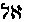(*Al*-God) deorum: intratque et perrumpit et transit
per Adam primum occultum usque in statum dispositionis transitque per
eum a capite usque ad pedes ejus: *et in eo est figura hominis*
("Kabbala Denudata," ii., p. 246).

[222:\*\*\*\*\*](iu104.htm#fr_420) "Sohar," i.,
p. 51 a.

[223:\*](iu104.htm#fr_421) Book iii., p. 290.

[223:\*\*](iu104.htm#fr_422) "Idra Rabba," §§
541, 542.

[223:\*\*\*](iu104.htm#fr_423) Ibid., iii., p.
36.

[223:\*\*\*\*](iu104.htm#fr_424) Ibid., p. 171.

[223:\*\*\*\*\*](iu104.htm#fr_425) "Nat. und
Urspr. d. Emanationslehre b. d. Kabbalisten," p. ii.

[223:\*\*\*\*\*\*](iu104.htm#fr_426)
"Irenaeus," p. 637.

[224:\*](iu104.htm#fr_427) "Idra Suta," ix.;
"Kabbala Denudata"; see Pythagoras: "Monad."

[224:\*\*](iu104.htm#fr_428) "Codex Nazaraeus,"
i., p. 145.

[224:\*\*\*](iu104.htm#fr_429) "Idra Rabba,"
viii., pp. 107-109.

[224:\*\*\*\*](iu104.htm#fr_430) "Auszuge aus
dem Sohar," p. 11.

[226:\*](iu104.htm#fr_431) He is the universal
and spiritual germ of *all* things.

[226:\*\*](iu104.htm#fr_432) "Ad. Kabb. Chr.,"
p. 6.

[227:\*](iu104.htm#fr_433) "Sohar," p. 93.

[227:\*\*](iu104.htm#fr_434) "Movers," p. 265.

[227:\*\*\*](iu104.htm#fr_435) "Kabbala
Denudata," vol. ii., p. 236.

[227:\*\*\*\*](iu104.htm#fr_436) Champollion,
Junior: "Lettres."

[228:\*](iu104.htm#fr_437) "Codex Nazaraeus,"
vol. ii., pp. 47-57.

[228:\*\*](iu104.htm#fr_438) Ibid., vol. i., p.
145.

[228:\*\*\*](iu104.htm#fr_439) Ibid., vol. ii.,
p. 211.

[228:\*\*\*\*](iu104.htm#fr_440) Ibid., vol.
i., p. 308.

[228:\*\*\*\*\*](iu104.htm#fr_441)
Sophia-Achamoth also begets her son Ilda-Baoth, the *Demiurge,* by
looking into chaos or matter, and by coming in contact with it.

[229:\*](iu104.htm#fr_442) "Codex Nazaraeus,"
vol. ii., p. 109. See "Sod, the Son of the Man," for translation.

[229:\*\*](iu104.htm#fr_443) Revelation iv. 5.

[229:\*\*\*](iu104.htm#fr_444) Ezekiel.

[229:\*\*\*\*](iu104.htm#fr_445) "Codex
Nazaraeus," vol. ii., p. 127.

[229:\*\*\*\*\*](iu104.htm#fr_446) The first
androgyne duad being considered a *unit* in all the secret computations,
is, therefore, the Holy Ghost.

[230:\*](iu104.htm#fr_447) "Codex Nazaraeus,"
vol. iii., p. 59.

[230:\*\*](iu104.htm#fr_448) Ibid., vol. i., p.
285.

[230:\*\*\*](iu104.htm#fr_449) Ibid., vol. i.,
p. 309.

[230:\*\*\*\*](iu104.htm#fr_450) Ibid., vol.
i., p. 287. See "Sod, the Son of the Man," p. 101.

[230:\*\*\*\*\*](iu104.htm#fr_451) John iv. 9.

[230:\*\*\*\*\*\*](iu104.htm#fr_452) "Codex
Nazaraeus," vol. ii., p. 123.

[230:\*\*\*\*\*\*\*](iu104.htm#fr_453) "Then
went up Moses and Aaron, Nadab and Abihu, and seventy of the elders of
Israel. *And they saw the God of Israel,*" Exodus xxiv. 9, 10.

[230:\*\*\*\*\*\*\*\*](iu104.htm#fr_454)
Irenaeus: "Clementine Homilies," I., xxii., p. 118.

[231:\*](iu104.htm#fr_455) "Adv. Haes.," III.,
ii., 18.

[232:\*](iu104.htm#fr_456) See King's
"Gnostics."

[232:\*\*](iu104.htm#fr_457) Ezekiel i.-ii.

[233:\*](iu104.htm#fr_458) "Gnostics and their
Remains."

[233:\*\*](iu104.htm#fr_459) "Although this
science is commonly supposed to be peculiar to the Jewish Talmudists,
there is no doubt that they borrowed the idea from a foreign source, and
that from the Chaldeans, the *founders of magic art*," says King, in the
"Gnostics." The titles *Iao* and *Abraxas,* etc., instead of being
recent Gnostic figments, were indeed holy names, borrowed from the most
ancient formulae of the East. Pliny must allude to them when he mentions
the virtues ascribed by the Magi to amethysts engraved with the names of
the sun and moon, names not expressed in either the Greek or Latin
tongues. In the "*Eternal Sun*," the "*Abraxas,*" the "*Adonai,*" of
these gems, we recognize the very amulets ridiculed by the philosophic
Pliny ("Gnostics," pp. 79, 80); *Virtutes* (miracles) as employed by
Irenaeus.

[234:\*](iu104.htm#fr_460) So called to
distinguish the short-face, who *is exterior,* "from the venerable
sacred ancient" (the "Idra Rabba," iii., 36; v 54). Seir-Anpin is the
"image of the Father." "He that hath seen me hath seen my Father" (John
xiv. 9).

[234:\*\*](iu104.htm#fr_461) "Codex Nazaraeus,"
vol. iii., p. 57.

[234:\*\*\*](iu104.htm#fr_462) Ibid., vol.
iii., p. 61.

[234:\*\*\*\*](iu104.htm#fr_463) This stone, of
a sponge-like surface, is found in Narmada and seldom to be seen in
other places.

[235:\*](iu104.htm#fr_464) John has an eagle
near him; Luke, a bull; Mark, a lion; and Matthew, an angel--the
kabalistic quaternary of the Egyptian Tarot.

[236:\*](iu104.htm#fr_465) See Matter, upon the
subject.

[236:\*\*](iu104.htm#fr_466) Consult Book of
Daniel, iv., v.

[237:\*](iu104.htm#fr_467) Ahriman, the
production of Zoroaster, is so called in hatred of the Arias or Aryas,
the Brahmans against whose dominion the Zoroastrians had revolted.
Although an Arya (a noble, a sage) himself, Zoroaster, as in the case of
the Devas whom he disgraced from gods to the position of *devils,*
hesitated not to designate this type of the spirit of evil under the
name of his enemies, the Brahman-Aryas. The whole struggle of Ahura-mazd
and Ahriman is but the allegory of the great religious and political war
between Brahmanism and Zoroastrianism.

[237:\*\*](iu104.htm#fr_468) "Nork," ii., 146.

[237:\*\*\*](iu104.htm#fr_469) Rev. Mr. Maurice
takes it also to mean the cycles.

[237:\*\*\*\*](iu104.htm#fr_470) "Duncker,"
ii., 363; Spiegel's "Avesta," i., 32, 34.

[237:\*\*\*\*\*](iu104.htm#fr_471) See the
"Book of Dehesh," 47.

[237:\*\*\*\*\*\*](iu104.htm#fr_472) See King's
translation of the "Zend Avesta," in his "Gnostics," p. 9.

[238:\*](iu104.htm#fr_473) The daevas or devils
of the Iranians contrast with the devas or deities of India.

[238:\*\*](iu104.htm#fr_474) "Nork," ii., 146.

[238:\*\*\*](iu104.htm#fr_475) The Bishop of
Ephesus, 218 A.D.; Eusebius: "H. E." iii., 31. Origen stoutly maintained
the doctrine of eternal punishment to be erroneous. He held that at the
second advent of Christ even the devils among the damned would be
forgiven. The eternal damnation is a later *Christian* thought.

[238:\*\*\*\*](iu104.htm#fr_476) Luke xii. 10.

[238:\*\*\*\*\*](iu104.htm#fr_477) "Hermes
Trismegistus," vi. 55.

[239:\*](iu104.htm#fr_478) Plato Protogoras;
"Cory," p. 274.

[239:\*\*](iu104.htm#fr_479) Panthier: "La
Chine," ii., 375; "Sod, the Son of the Man," p. 97.

[239:\*\*\*](iu104.htm#fr_480) Acts ii. 22.

[239:\*\*\*\*](iu104.htm#fr_481) John i. 6.

[239:\*\*\*\*\*](iu104.htm#fr_482) Ibid., 30.

[239:\*\*\*\*\*\*](iu104.htm#fr_483) John viii.
40.

[239:\*\*\*\*\*\*\*](iu104.htm#fr_484) Ibid.,
ix. 11.

[239:\*\*\*\*\*\*\*\*](iu104.htm#fr_485)
Priestley: "History of Early Christianity," p. 2, sect. 2.

[239:\*\*\*\*\*\*\*\*\*](iu104.htm#fr_486)
Mahomet was born in 571 A. D.

[240:\*](iu104.htm#fr_487) J. M. Peebles:
"Jesus--Man, Myth, or God?"

[242:\*](iu104.htm#fr_488) Translated from the
"Hari-Purana," by Jacolliot: "Christna, et le Christ."

[242:\*\*](iu104.htm#fr_489) Clement: "Al.
Strom.," v. 14, § 110; translation given in "Supernatural Religion,"
vol. i, p. 77.

[243:\*](iu104.htm#fr_490) This work, "The
Pastor of Hermas," is no longer extant, but appears only in the
"Stichometry" of Nicephorus; it is now considered an apocrypha. But, in
the days of Irenaeus, it was quoted as Holy Scripture (see "Sup.
Religion," vol. i., p. 257) by the Fathers, held to be divinely
inspired, and publicly read in the churches (Iraenus: "Adv. Haer.,"
iv*.,* 20). When Tertullian became a Montanist he rejected it, after
having *asserted* its divinity (Tertullian: "De Orat.," p. 12).

[244:\*](iu104.htm#fr_491) "Sohar," xl., p. 10.

[244:\*\*](iu104.htm#fr_492) "Codex Nazaraeus,"
vol. iii., pp. 60, 61.

[244:\*\*\*](iu104.htm#fr_493) Ibid., vol. ii.,
p. 281; vol. iii., p. 59.

[244:\*\*\*\*](iu104.htm#fr_494) We must remind
the reader, in this connection, that Joshua and Jesus are one and the
same name. In the Slavonian Bibles Joshua reads*--Iessus* (or Jesus),
*Navin*.

[245:\*](iu104.htm#fr_495) "Idra Rabba," vol.
iii., § 41; the "Sohar."

[245:\*\*](iu104.htm#fr_496) "Kabbala
Denudata," vol. ii., p. 230; the "Book of the Babylonian Companions," p.
35.

[245:\*\*\*](iu104.htm#fr_497) "Sohar Ex.," p.
11.

[245:\*\*\*\*](iu104.htm#fr_498) "Midrash
Hashirim"; "Rabbi Akaba"; "Midrash Koheleth," vol. ii., p. 45.

[245:\*\*\*\*\*](iu104.htm#fr_499) "Codex
Nazaraeus," vol. iii., p. 60.

[245:\*\*\*\*\*\*](iu104.htm#fr_500) "On the
Canon," p. 178 ff.

[245:\*\*\*\*\*\*\*](iu104.htm#fr_501) Vol.
ii., p. 57; Norberg's "Onomasticon"; "Sod, the Son of the Man," p. 103.

[245:\*\*\*\*\*\*\*\*](iu104.htm#fr_502)
"Preller," vol. i., p. 484; K. O. Muller: "History of Greek Literature,"
p. 238; "Movers," p. 553.

[246:\*](iu104.htm#fr_503) "Sohar," vol. i.,
fol. 25.

[246:\*\*](iu104.htm#fr_504) "Simil.," vol.
ix., p. 12; "Supernatural Religion," vol. i., p. 257.

[246:\*\*\*](iu104.htm#fr_505) Mark xiii. 32.

[247:\*](iu104.htm#fr_506) "Apolog.," vol. i.,
p. 63.

[247:\*\*](iu104.htm#fr_507) "Idra Rabba," x.,
p. 177.

[247:\*\*\*](iu104.htm#fr_508) "Codex
Nazaraeus," vol. i., p. 23.

[247:\*\*\*\*](iu104.htm#fr_509) Philo says
that the *Logos* is the *interpreter* of the highest God, and argues,
"that he must be the God of us imperfect beings" ("Leg. Alleg.," iii., §
73). According to his opinion man was not made in the likeness of the
*most High* God, the Father of all, but in that of the *second* God who
is his word--Logos" (Philo: "Fragments," 1; ex. Euseb. "Praepar.
Evang.," vii., 13).

[247:\*\*\*\*\*](iu104.htm#fr_510) "Codex
Nazaraeus," p. 57; "Sod, the Son of the Man," p. 59.

[247:\*\*\*\*\*\*](iu104.htm#fr_511) "Hundert
und ein Frage," p. xvii.; Dunlap: "Sod, the Son of the Man," p. 87; the
author, who quotes Nork, says that parts of the "Midrashim" and the
"Targum" of Onkelos, antedate the "New Testament."

[248:\*](iu104.htm#fr_512) Writing upon
Ptolemaeus and Heracleon, the author of "Supernatural Religion" (vol.
ii., p. 217) says that "the inaccuracy of the Fathers keeps pace with
their want of critical judgment," and then proceeds to illustrate this
particularly ridiculous blunder committed by Epiphanius, in common with
Hippolytus, Tertullian, and Philostrius. "Mistaking a passage of
Irenaeus, 'Adv. Haer.,' i., p. 14, regarding the Sacred Tetrad
(Kol-Arbas), Hippolytus supposes Irenaeus to refer to another heretic
leader." He at once treats the Tetrad as such a leader named
"Colarbasus," and after dealing (vi., 4) with the doctrines of Secundus,
and Ptolemaeus, and Heracleon, he proposes, §5, to show, "what are the
opinions held by Marcus and *Colarbasus,*" these two being, according to
him, the successors of the school of Valentinus (cf. Bunsen:
"Hippolytus, U. S. Zeit.," p. 54 f.; "Ref. Omn. Haer.," iv., § 13).

[248:\*\*](iu104.htm#fr_513) See Godf. Higgins:
"Anacalypsis."

[248:\*\*\*](iu104.htm#fr_514) Inman: "Ancient
Pagan and Modern Christian Symbolism," p. 84.

[248:\*\*\*\*](iu104.htm#fr_515)
Meaning--holding up of *different views*.

[248:\*\*\*\*\*](iu104.htm#fr_516) "This absurd
mistake," remarks the author of "Supernatural Religion," vol. ii., p.
218, "shows how little these writers knew of the Gnostics of whom they
wrote, and how the one ignorantly follows the other."

[249:\*](iu104.htm#fr_517) "Ref. Omn. Haer.,"
iv., §13.

[249:\*\*](iu104.htm#fr_518) Epiph.: "Haer.,"
xxxvi., § 1, p. 262 (quoted in "Supernatural Religion"). See Volkmar's
"Die Colarbasus-gnosis" in Niedner's "Zeitschr. Hist. Theol."

[249:\*\*\*](iu104.htm#fr_519) "Gnostics and
their Remains," p. 182 f., note 3.

[250:\*](iu104.htm#fr_520) Mosheim.

[250:\*\*](iu104.htm#fr_521) Tertullian:
"Despectae," ch. xxx.

[250:\*\*\*](iu104.htm#fr_522) Mosheim:
"Eccles. Hist.," c. v., § 5.

------------------------------------------------------------------------

[Next: Chapter VI](iu105)
