[Intangible Textual Heritage](../../index)  [Theosophy](../index) 
[Index](index)  [Previous](iu107)  [Next](iu109) 

------------------------------------------------------------------------

###### p. 405

### CHAPTER IX.

> "All things are governed in the bosom of this triad."--**L**YDUS: *De
> Mensibus,* 20
>
> .

> "Thrice let the heaven be turned on its perpetual axis."--**O**VID:
> *Fasti* iv
>
> .

> "And Balaam said unto Balak, Build me here *seven* altars, and prepare
> me here *seven* oxen and *seven* rams."--*Numbers* xxiii. 1, 2.

> "In *seven* days all creatures who have offended me shall be destroyed
> by a deluge, but thou shalt be secured in a vessel miraculously
> formed; take, therefore . . . and with *seven* holy men, your
> respective wives, and pairs of all animals, enter the ark without
> fear; then shalt thou know God face to face, and all thy questions
> shall be answered."--
>
> Bagavedgitta.

> "And the Lord said, I will destroy man . . . from the face of the
> earth. . . . But with thee will I establish my covenant. . . . Come
> thou and all thy house into the ark. . . . For yet *seven* days and I
> will cause it to rain upon the earth."--*Genesis* vi., vii.

> "The Tetraktys was not only principally honored because all symphonies
> are found to exist within it, but also because it appears to contain
> the nature of all things."--**T**HEOS. OF **S**MYRNA: *Mathem.,* p.
> 147.

OUR task will have been ill-performed if the preceding chapters have not
demonstrated that Judaism, earlier and later Gnosticism, Christianity,
and even Christian Masonry, have all been erected upon identical
cosmical myths, symbols, and allegories, whose full comprehension is
possible only to those who have inherited the key from their inventors.

In the following pages we will endeavor to show how much these have been
misinterpreted by the widely-different, yet intimately-related systems
enumerated above, in fitting them to their individual needs. Thus not
only will a benefit be conferred upon the student, but a long-deferred,
and now much-needed act of justice will be done to those earlier
generations whose genius has laid the whole human race under obligation.
Let us begin by once more comparing the myths of the *Bible* with those
of the sacred books of other nations, to see which is the original,
which copies.

There are but two methods which, correctly explained, can help us to
this result. They are--the *Vedas,* Brahmanical literature and the
Jewish *Kabala.* The former has, in a most philosophical spirit,
conceived these grandiose myths; the latter borrowing them from the
Chaldeans and Persians, shaped them into a history of the Jewish nation,
in which their spirit of philosophy was buried beyond the recognition of
all but

###### p. 406

the elect, and under a far more absurd form than the Aryan had given
them. The *Bible* of the Christian Church is the latest receptacle of
this scheme of disfigured allegories which have been erected into an
edifice of superstition, such as never entered into the conceptions of
those from whom the Church obtained her knowledge. The abstract fictions
of antiquity, which for ages had filled the popular fancy with but
flickering shadows and uncertain images, have in Christianity assumed
the shapes of real personages, and become accomplished facts. Allegory,
metamorphosed, becomes sacred history, and Pagan myth is taught to the
people as a revealed narrative of God's intercourse with His chosen
people.

"The myths," says Horace in his *Ars Poetica,* "have been invented by
wise men to strengthen the laws and teach moral truths." While Horace
endeavored to make clear the very spirit and essence of the ancient
myths, Euhemerus pretended, on the contrary, that "myths were the
legendary history of kings and heroes, transformed into gods by the
admiration of the nations." It is the latter method which was
inferentially followed by Christians when they agreed upon the
acceptation of euhemerized patriarchs, and mistook them for men who had
really lived.

But, in opposition to this pernicious theory, which has brought forth
such bitter fruit, we have a long series of the greatest philosophers
the world has produced: Plato, Epicharmus, Socrates, Empedocles,
Plotinus, and Porphyry, Proclus, Damascenus, Origen, and even Aristotle.
The latter plainly stated this verity, by saying that a tradition of the
highest antiquity, transmitted to posterity under the form of various
myths, teaches us that the first principles of nature may be considered
as "gods," for the *divine* permeates all nature. All the rest, details
and personages, were added later for the clearer comprehension of the
vulgar, and but too often with the object of supporting laws invented in
the common interest.

Fairy tales do not exclusively belong to nurseries; all mankind--except
those few who in all ages have comprehended their hidden meaning and
tried to open the eyes of the superstitious--have listened to such tales
in one shape or the other and, after transforming them into sacred
symbols, called the product **R**ELIGION!

We will try to systematize our subject as much as the ever-recurring
necessity to draw parallels between the conflicting opinions that have
been based on the same myths will permit. We will begin by the book of
*Genesis,* and seek for its hidden meaning in the Brahmanical traditions
and the Chaldeo-Judaic

Kabala.

The first Scripture lesson taught us in our infancy is that God created
the world in six days, and rested on the *seventh.* Hence, a peculiar
solemnity

###### p. 407

is supposed to attach to the seventh day, and the Christians, adopting
the rigid observances of the Jewish sabbath, have enforced it upon us
with the substitution of the first, instead of the seventh day of the
week.

All systems of religious mysticism are based on numerals. With
Pythagoras, the Monas or unity, emanating the duad, and thus forming the
trinity, and the quaternary or Arba-il (the mystic *four*)*,* compose
the number seven. The sacredness of numbers begins with the great
First--the ONE, and ends only with the nought or zero--symbol of the
infinite and boundless circle which represents the universe. All the
intervening figures, in whatever combination, or however multiplied,
represent philosophical ideas, from vague outlines down to a
definitely-established scientific axiom, relating either to a moral or a
physical fact in nature. They are a key to the ancient views on
cosmogony, in its broad sense, including man and beings, and the
evolution of the human race, spiritually as well as physically.

The number *seven* is the most sacred of all, and is, undoubtedly, of
Hindu origin. Everything of importance was calculated by and fitted into
this number by the Aryan philosophers--ideas as well as localities. Thus
they have the

Sapta-Rishi, or seven sages, typifying the seven diluvian primitive
races (post-diluvian as some say).

Sapta-Loka, the seven inferior and superior worlds, whence each of these
Rishis proceeded, and whither he returned in glory before reaching the
final bliss of Moksha. [\*](#fn_809)

Sapta-Kula, or seven castes--the Brahmans assuming to represent the
direct descendants of the highest of them. [\*\*](#fn_810)

Then, again, the Sapta-Pura (seven holy cities); Sapta-Duipa (seven holy
islands); Sapta-Samudra (the seven holy seas); Sapta-Parvata (the seven
holy mountains); Sapta-Arania (the seven deserts); Sapta-Vruksha (the
seven sacred trees); and so on.

###### p. 408

In the Chaldeo-Babylonian incantation, this number reappears again as
prominently as among the Hindus. The number is *dual* in its attributes,
*i.e*., holy in one of its aspects it becomes nefast under other
conditions. Thus the following incantation we find traced on the
Assyrian tablets, now so correctly interpreted.

"The evening of evil omen, the region of the sky, which produces
misfortune. . . .

"Message of pest.  
"Deprecators of Nin-Ki-gal.  
"The seven gods of the vast sky.  
"The seven gods of the vast earth.  
"The seven gods of blazing spheres.  
"The seven gods of celestial legion.  
"The seven gods maleficent.  
"The seven phantoms--bad.  
"The seven phantoms of maleficent flames. . . .  
"Bad demon, bad *alal*, bad *gigim,* bad *telal* *.* . . bad god, bad
*maskim.  
*"Spirit of seven heavens remember . . . Spirit of seven earths remember
. . . etc."

This number reappears likewise on almost every page of *Genesis,* and
throughout the Mosaic books, and we find it conspicuous (see following
chapter) in the *Book of Job* and the Oriental *Kabala.* If the Hebrew
Semitics adopted it so readily, we must infer that it was not blindly,
but with a thorough knowledge of its secret meaning; hence, that they
must have adopted the doctrines of their "heathen" neighbors as well. It
is but natural, therefore, that we should seek in *heathen* philosophy
for the interpretation of this number, which again reappeared in
Christianity with its *seven* sacraments, *seven* churches in Asia
Minor, *seven* capital sins, *seven* virtues (four cardinal and three
theological), etc.

Have the *seven* prismatic colors of the rainbow seen by Noah no other
meaning than that of a covenant between God and man to refresh the
memory of the former? To the kabalist, at least, they have a
significance inseparable from the seven labors of magic, the seven upper
spheres, the seven notes of the musical scale, the seven numerals of
Pythagoras, the seven wonders of the world, the seven ages, and even the
seven steps of the Masons, which lead to the Holy of Holies, after
passing the flights of *three* and *five*.

Whence the identity then of these enigmatical, ever-recurring numerals
that are found in every page of the Jewish Scriptures, as in every ola
and sloka of Buddhistic and Brahmanical books? Whence these numerals
that are the soul of the Pythagorean and Platonic thought, and that no
unilluminated Orientalist nor biblical student has ever been able to
fathom?

###### p. 409

And yet they have a key ready in their hand, did they but know how to
use it. Nowhere is the mystical value of human language and its effects
on human action so perfectly understood as in India, nor any better
explained than by the authors of the oldest *Brahmanas.* Ancient as
their epoch is now found to be, they only try to express, in a more
concrete form, the abstract metaphysical speculations of their own
ancestors.

Such is the respect of the Brahmans for the sacrificial mysteries, that
they hold that the world itself sprang into creation as a consequence of
a "sacrificial word" pronounced by the First Cause. This word is the
"Ineffable name" of the kabalists, fully discussed in the last chapter.

The secret of the *Vedas,* "Sacred Knowledge" though they may be, is
impenetrable without the help of the *Brahmanas.* Properly speaking, the
*Vedas* (which are written in verse and comprised in four books)
constitute that portion called the *Mantra,* or magical prayer, and the
*Brahmanas* (which are in prose) contain their key. While the Mantra
part is alone holy, the Brahmana portion contains all the theological
exegesis, and the speculations and explanations of the sacerdotal. Our
Orientalists, we repeat, will make no substantial progress toward a
comprehension of Vedic literature until they place a proper valuation
upon works now despised by them; as, for instance, the *Aitareya* and
*Kaushitaki Brahmanas,* which belong to the

Rig-Veda.

Zoroaster was called a *Manthran,* or speaker of Mantras, and, according
to Haug, one of the earliest names for the Sacred Scriptures of the
Parsis was *Manthra-spenta.* The power and significance of the Brahman
who acts as the Hotri-priest at the Soma-Sacrifice, consists in his
possession and full knowledge of the uses of the sacred word or
speech--*Vach.* The latter is personified in Sara-isvati, the wife of
Brahma, who is the goddess of the sacred or "Secret Knowledge." She is
usually depicted as riding upon a peacock with its tail all spread. The
eyes upon the feathers of the bird's tail, symbolize the sleepless eyes
that see all things. To one who has the ambition of becoming an adept of
the "Secret doctrines," they are a reminder that he must have the
hundred eyes of Argus to see and comprehend all things.

And this is why we say that it is not possible to solve fully the deep
problems underlying the Brahmanical and Buddhistic sacred books without
having a perfect comprehension of the esoteric meaning of the
Pythagorean numerals. The greatest power of this Vach, or Sacred Speech,
is developed according to the form which is given to the Mantra by the
officiating Hotri, and this form consists wholly in the numbers and
syllables of the sacred metre. If pronounced slowly and in a certain
rhythm, one effect is produced; if quickly and with another rhythm,
there is a different result. "Each metre," says Haug, "is the invisible
master of

###### p. 410

something visible in this world; it is, as it were, its exponent and
ideal. This great significance of the metrical speech is derived from
the number of syllables of which it consists, for each thing has (just
as in the Pythagorean system) a certain numerical proportion. All these
things, metres (chhandas), stomas, and prishthas, are liable to be as
eternal and divine as the words themselves they contain. The earliest
Hindu divines did not only believe in a primitive revelation of the
words of the sacred texts, but even in that of the various forms. These
forms, along with their contents, the everlasting *Veda*-words, are
symbols expressive of things of the invisible world, and in several
respects comparable to the Platonic ideas."

This testimony from an unwilling witness shows again the identity
between the ancient religions as to their secret doctrine. The Gayatri
metre, for example, consists of *thrice eight* syllables, and is
considered the most sacred of metres. It is the metre of Agni, the
fire-god, and becomes at times the emblem of Brahma himself, the chief
creator, and "fashioner of man" in his own image. Now Pythagoras says
that "The number eight, or the Octad, is the first cube, that is to say,
squared in all senses, as a die, proceeding from its base two, or even
number; *so is man four-square or perfect.*" Of course few, except the
Pythagoreans and kabalists, can fully comprehend this idea; but the
illustration will assist in pointing out the close kinship of the
numerals with the Vedic *Mantras.* The chief problems of every theology
lie concealed beneath this imagery of fire and the varying rhythm of its
flames. The burning bush of the *Bible,* the Zoroastrian and other
sacred fires, Plato's universal soul, and the Rosicrucian doctrines of
both soul and body of man being evolved out of fire, the reasoning and
immortal element which permeates all things, and which, according to
Herakleitus, Hippocrates, and Parmenides, is God, have all the same
meaning.

Each metre in the *Brahmanas* corresponds to a number, and as shown by
Haug, as it stands in the sacred volumes, is a prototype of some visible
form on earth, and its effects are either good or evil. The "sacred
speech" can save, but it can kill as well; its many meanings and
faculties are well known but to the *Dikshita* (the adept), who has been
initiated into many mysteries, and whose "spiritual birth" is completely
achieved; the Vach of the *mantra* is a spoken power, which awakes
another corresponding and still more occult power, each allegorically
personified by some god in the world of spirits, and, according as it is
used, responded to either by the gods or the *Rakshasas* (bad spirits).
In the Brahmanical and Buddhist ideas, a curse, a blessing, a vow, a
desire, an idle thought, can each assume a visible shape and so manifest
itself *objectively* to the eyes of its author, or to him that it
concerns.

###### p. 411

Every sin becomes incarnated, so to say, and like an avenging fiend
persecutes its perpetrator.

There are words which have a destructive quality in their very
syllables, as though objective things; for every sound awakens a
corresponding one in the invisible world of spirit, and the repercussion
produces either a good or bad effect. Harmonious rhythm, a melody
vibrating softly in the atmosphere, creates a beneficent and sweet
influence around, and acts most powerfully on the psychological as well
as physical natures of every living thing on earth; it reacts even on
inanimate objects, for matter is still spirit in its essence, invisible
as it may seem to our grosser senses.

So with the numerals. Turn wherever we will, from the Prophets to the
Apocalypse, and we will see the biblical writers constantly using the
numbers *three, four, seven,* and

twelve.

And yet we have known some partisans of the *Bible* who maintained that
the *Vedas* were copied from the Mosaic books! [\*](#fn_811) The *Vedas,* which are written in
Sanscrit, a language whose grammatical rules and forms, as Max Muller
and other scholars confess, were *completely established* long before
the days when the great wave of emigration bore it from Asia all over
the Occident, are there to proclaim their parentage of every philosophy,
and every religious institution developed later among Semitic peoples.
And which of the numerals most frequently occur in the Sanscrit chants,
those sublime hymns to creation, to the unity of God, and the countless
manifestations of His power? **O**NE, THREE, and SEVEN. Read the hymn by
Dirghatamas.

"TO **H**IM WHO REPRESENTS ALL THE **G**ODS."

"The *God* here present, our blessed patron, our sacrificer, has a
brother who spreads himself in mid-air. There exists a *third* Brother
whom we sprinkle with our libations. . . . It is he whom I have seen
master of men and armed with *seven* rays*.*" [\*\*](#fn_812)

And again:

"*Seven* Bridles aid in guiding a car which has but ONE wheel, and which
is drawn by a single horse that shines with *seven* rays. The wheel has
*three* limbs, an immortal wheel, never-wearying, whence hang all the
worlds."

"Sometimes *seven* horses drag a car of *seven* wheels, and *seven*
personages mount it, accompanied by *seven* fecund nymphs of the water."

And the following again, in honor of the fire-god--*Agni,* who is so
clearly shown but a spirit subordinate to the **O**NE God.

###### p. 412

"Ever ONE, although having *three* forms of double nature
(androgynous)--he rises! and the priests offer to *God,* in the act of
sacrifice, their prayers which reach the heavens, borne aloft by Agni."

Is this a coincidence, or, rather, as reason tells us, the result of the
derivation of many national cults from one primitive, universal
religion? A *mystery* for the uninitiated, the *unveiling* of the most
sublime (because correct and true) psychological and physiological
problems for the initiate. Revelations of the personal spirit of man
which is divine because that spirit is not only the emanation of the ONE
Supreme God, but is the only God man is able, in his weakness and
helplessness, to comprehend--to feel *within* himself. This truth the
Vedic poet clearly confesses, when saying:

"The Lord, Master of the universe and full of wisdom, has entered with
me (into me)--weak and ignorant--and has formed me of *himself* in that
place [\*](#fn_813) where the spirits obtain,
by the help of *Science,* the peaceful enjoyment of the *fruit,* as
sweet as ambrosia."

Whether we call this fruit "an apple" from the Tree of Knowledge, or the
*pippala* of the Hindu poet, it matters not. It is the fruit of esoteric
wisdom. Our object is to show the existence of a religious system in
India for many thousands of years before the exoteric fables of the
Garden of Eden and the Deluge had been invented. Hence the identity of
doctrines. Instructed in them, each of the initiates of other countries
became, in his turn, the founder of some great school of philosophy in
the West.

Who of our Sanscrit scholars has ever felt interested in discovering the
real sense of the following hymns, palpable as it is: "*Pippala,* the
sweet fruit of that tree upon which come *spirits* who love the
*science* (?) and where *the gods produce all marvels.* This is a
mystery for him *who knows not the Father* of the world."

Or this one again:

"These stanzas bear at their head a title which announces that they are
consecrated to the *Viswadevas* (that is to say, to all the gods). He
who knows not the Being whom I sing *in all his manifestations,* will
comprehend nothing of my verses; those who do know **H**IM are not
strangers to this reunion."

This refers to the reunion and parting of the immortal and mortal parts
of man. "The immortal Being," says the preceding stanza, "is in the
cradle of the mortal Being. The two eternal spirits go and come
everywhere; only some men know the one without knowing the other"
(*Dirghatamas*)

.

Who can give a correct idea of Him of whom the *Rig-Veda* says:

###### p. 413

"That which is One the wise call it in divers manners." That One is sung
by the Vedic poets in all its manifestations in nature; and the books
considered "childish and foolish" teach how at will to call the beings
of wisdom for our instruction. They teach, as Porphyry says: "a
liberation from all terrene concerns . . . a flight of the *alone* to
the **A**LONE."

Professor Max Muller, whose every word is accepted by his school as
philological gospel, is undoubtedly right in one sense when in
determining the nature of the Hindu gods, he calls them "masks without
an actor . . . names without being, not beings without names." [\*](#fn_814) For he but proves thereby the
monotheism of the ancient Vedic religion. But it seems to us more than
dubious whether he or any scientist of his school needed hope to fathom
the old Aryan [\*\*](#fn_815) thought, without
an accurate study of those very "masks." To the materialist, as to the
scientist, who for various reasons endeavors to work out the difficult
problem of compelling facts to agree with either their own hobbies or
those of the *Bible,* they may seem but the empty shells of phantoms.
Yet such authorities will ever be, as in the past, the unsafest of
guides, except in matters of exact science. The *Bible* patriarchs are
as much "masks without actors," as the pragapatis, and yet, if the
living personage behind these masks is but an abstract shadow there is
an idea embodied in every one of them which belongs to the philosophical
and scientific theories of ancient wisdom. [\*\*\*](#fn_816) And who can render better service
in this work than the native Brahmans themselves, or the kabalists?

To deny, point-blank, any sound philosophy in the later Brahmanical
speculations upon the *Rig-Veda,* is equivalent to refusing to ever
correctly understand the mother-religion itself, which gave rise to
them, and which is the expression of the inner thought of the direct
ancestors of these later authors of the *Brahmanas.* If learned
Europeans can so

###### p. 414

readily show that all the Vedic gods are but empty masks, they must also
be ready to demonstrate that the Brahmanical authors were as incapable
as themselves to discover these "actors" anywhere. This done, not only
the three other sacred books which Max Muller says "do not deserve the
name of *Vedas,*" but the *Rig-Veda* itself becomes a meaningless jumble
of words; for what the world-renowned and subtile intellect of the
ancient Hindu sages failed to understand, no modern scientist, however
learned, can hope to fathom. Poor Thomas Taylor was right in saying that
"philology is not philosophy."

It is, to say the least, illogical to admit that there is a hidden
thought in the literary work of a race perhaps ethnologically different
from our own; and then, because it is utterly unintelligible to us whose
spiritual development during the several thousand intervening years has
bifurcated into quite a contrary direction--deny that it has any sense
in it at all. But this is precisely what, with all due respect for
erudition, Professor Max Muller and his school do in this instance, at
least. First of all, we are told that, albeit cautiously and with some
effort, yet we may still walk in the footsteps of these authors of the
*Vedas.* "We shall feel that we are brought face to face and mind to
mind with men yet intelligible to us *after we have freed ourselves from
our modern conceits.* We shall not succeed always; words, verses, nay
whole hymns in the *Rig-Veda,* will and must remain to us a dead letter.
. . . For, with a few exceptions . . . the whole world of the Vedic
ideas is so entirely beyond our own intellectual horizon, that instead
of translating, we can as yet only guess and combine." [\*](#fn_817)

And yet, to leave us in no possible doubt as to the true value of his
words, the learned scholar, in another passage, expresses his opinion on
these same Vedas (with one exception) thus: "The only important, the
only real Veda, is the *Rig-Veda--*the other so-called *Vedas* deserve
the name of *Veda* no more than the *Talmud* deserves the name of
*Bible.*" Professor Muller rejects them as unworthy of the attention of
any one, and, as we understand it, on the ground that they contain
chiefly "sacrificial formulas, charms, and incantations." [\*\*](#fn_818)

And now, a very natural question: Are any of our scholars prepared to
demonstrate that, so far, they are intimately acquainted with the hidden
sense of these perfectly absurd "sacrificial formulas, charms, and
incantations" and magic nonsense of *Atharva-Veda?* We believe not, and
our doubt is based on the confession of Professor Muller himself, just
quoted. If "the whole world of the Vedic ideas \[the *Rig-Veda* cannot

###### p. 415

be included alone in this *world,* we suppose\] is so entirely beyond
our own \[the scientists'\] intellectual horizon that, instead of
translating, we can as yet only guess and combine"; and the *Yagur-Veda,
Sama-Veda,* and *Atharva-Veda* are "childish and foolish"; [\*](#fn_819) and the *Brahmanas,* the *Sutras
Yaska,* and *Sayana,* "though *nearest in time* to the hymns of the
*Rig-Veda,* indulge in the most frivolous and ill-judged
interpretations," how can either himself or any other scholar form any
adequate opinion of either of them? If, again, the authors of the
*Brahmanas,* the nearest in time to the Vedic hymns, were already
incompetent to offer anything better than "ill-judged interpretations,"
then at what period of history, where, and by whom, were written these
grandiose poems, whose mystical sense has died with their generations?
Are we, then, so wrong in affirming that if sacred texts are found in
Egypt to have become--even to the priestly scribes of 4,000 years
ago--wholly unintelligible, [\*\*](#fn_820) and
the *Brahmanas* offer but "childish and foolish" interpretations of the
*Rig-Veda,* at least as far back as that, then, 1st, both the Egyptian
and Hindu religious philosophies are of an untold antiquity, far
antedating ages cautiously assigned them by our students of comparative
mythology; and, 2d, the claims of ancient priests of Egypt and modern
Brahmans, as to their age, are, after all, correct.

We can never admit that the three other *Vedas* are less worthy of their
name than the Rig-hymns, or that the *Talmud* and the *Kabala* are so
inferior to the *Bible.* The very name of the *Vedas* (the literal
meaning of which is *knowledge* or *wisdom*) shows them to belong to the
literature of those men who, in every country, language, and age, have
been spoken of as "those who know." In Sanscrit the third person
singular is *veda* (he knows), and the plural is *vida* (they know).
This word is synonymous with the Greek Τηεοσεβεια, which Plato uses when
speaking of the *wise--*the magicians; and with the Hebrew Hakamin,
 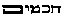(wise men). Reject
the *Talmud* and its old predecessor the *Kabala,* and it will be simply
impossible ever to render correctly one word of that *Bible* so much
extolled at their expense. But then it is, perhaps, just what its
partisans are working for. To banish the *Brahmanas* is to fling away
the key that unlocks the door of the *Rig-Veda.* The *literal*
interpretation of the *Bible* has already borne its fruits; with the
*Vedas* and the Sanscrit sacred books in general it will be just the
same, with this difference, that the absurd interpretation of the
*Bible* has received a time-honored right of eminent domain in the
department of the ridiculous; and will find its

###### p. 416

supporters, against light and against proof. As to the "heathen"
literature, after a few more years of unsuccessful attempts at
interpretation, its religious meaning will be relegated to the limbo of
exploded superstitions, and people will hear no more of it.

We beg to be clearly understood before we are blamed and criticised for
the above remarks. The vast learning of the celebrated Oxford professor
can hardly be questioned by his very enemies, yet we have a right to
regret his precipitancy to condemn that which he himself confesses
"entirely beyond our own intellectual horizon." Even in what he
considers a ridiculous blunder on the part of the author of the
*Brahmanas,* other more spiritually-disposed persons may see quite the
reverse. "*Who* is the greatest of the gods? Who shall first be praised
by our songs?" says an ancient Rishi of the *Rig-Veda;* mistaking (as
Prof. M. imagines) the interrogative pronoun "Who" for some divine name.
Says the Professor: "A place is allotted in the sacrificial invocations
to a god 'Who,' and hymns addressed to him are called 'Whoish hymns.' "
And is a god "Who" less natural as a term than a god "I am"? or "Whoish"
hymns less reverential than "I-amish" psalms? And who can prove that
this is really a blunder, and not a premeditated expression? Is it so
impossible to believe that the strange term was precisely due to a
reverential awe which made the poet hesitate before giving a name, as
form to that which is justly considered as the highest abstraction of
metaphysical ideals--God? Or that the same feeling made the commentator
who came after him to pause and so leave the work of anthropomorphizing
the "Unknown," the "**W**HO," to future human conception? "These early
poets thought more for themselves--than for others," remarks Max Muller
himself. "They sought rather, in their language, to be true to their own
thought than to please the imagination of their hearers." [\*](#fn_821) Unfortunately it is this very thought
which awakes no responsive echo in the minds of our philologists.

Farther, we read the sound advice to students of the *Rig-Veda* hymns,
to collect, collate, sift, and reject. "Let him study the commentaries,
the *Sutras,* the *Brahmanas,* and even later works, in order to exhaust
all the sources from which information can be derived. He \[the
scholar\] *must not despise the traditions of the Brahmans,* even where
their misconceptions . . . are palpable. . . . Not a corner in the
*Brahmanas,* the *Sutras, Yaska,* and *Sayana,* should be left
unexplored *before we propose a rendering of our own*. . . . When the
scholar has done his work, the poet and philosopher must take it up and
finish it." [\*\*](#fn_822)

Poor chance for a "philosopher" to step into the shoes of a learned

###### p. 417

philologist and presume to correct *his* errors! We would like to see
what sort of a reception the most learned Hindu scholar in India would
have from the educated public of Europe and America, if he should
undertake to correct a savant, after he had sifted, accepted, rejected,
explained, and declared what was good, and what "absurd and childish" in
the sacred books of his forefathers. That which would finally be
declared "Brahmanic misconceptions," by the conclave of European and
especially German savants, would be as little likely to be reconsidered
at the appeal of the most erudite pundit of Benares or Ceylon, as the
interpretation of Jewish Scripture by Maimonides and Philo-Judaeus, by
Christians after the Councils of the Church had accepted the
mistranslations and explanations of Irenaeus and Eusebius. What pundit,
or native philosopher of India should know his ancestral language,
religion, or philosophy as well as an Englishman or a German? Or why
should a Hindu be more suffered to expound Brahmanism, than a Rabbinical
scholar to interpret Judaism or the Isaian prophecies? Safer, and far
more trustworthy translators can be had nearer home. Nevertheless, let
us still hope that we may find at last, even though it be in the dim
future, a European philosopher to sift the sacred books of the
wisdom-religion, and not be contradicted by every other of his class.

Meanwhile, unmindful of any alleged authorities, let us try to sift for
ourselves a few of these myths of old. We will search for an explanation
within the popular interpretation, and feel our way with the help of the
magic lamp of Trismegistus--the mysterious number *seven.* There must
have been some reason why this figure was universally accepted as a
mystic calculation. With every ancient people, the Creator, or Demiurge,
was placed over the seventh heaven. "And were I to touch upon the
initiation into our sacred Mysteries," says Emperor Julian, the
kabalist, "which the Chaldean bacchised respecting the *seven-rayed God,
lifting up the souls through Him,* I should say things unknown, and
*very unknown to the rabble,* but well known to the *blessed
Theurgists*." [\*](#fn_823) In Ly*dus* it is
said that "The Chaldeans call the God **IAO**, and **S**ABAOTH he is
often called, *as He* who is over the seven orbits (heavens, or
spheres), that is the Demiurge." [\*\*](#fn_824)

One must consult the Pythagoreans and Kabalists to learn the
potentiality of this number. Exoterically the seven rays of the solar
spectrum are represented concretely in the seven-rayed god Heptaktis.
These seven rays epitomized into THREE primary rays, namely, the red,
blue, and yellow, form the solar trinity, and typify respectively
spirit-

###### p. 418

matter and spirit-essence. Science has also reduced of late the seven
rays to three primary ones, thus corroborating the scientific conception
of the ancients of at least one of the visible manifestations of the
invisible deity, and the seven divided into a quaternary and a trinity.

The Pythagoreans called the number seven the vehicle of life, as it
contained body and soul. They explained it by saying, that the human
body consisted of four principal elements, and that the soul is triple,
comprising reason, passion, and desire. The ineffable **W**ORD was
considered the *Seventh* and highest of all, for there are six minor
substitutes, each belonging to a degree of initiation. The Jews borrowed
their Sabbath from the ancients, who called it *Saturn's* day and deemed
it unlucky, and not the latter from the Israelites when Christianized.
The people of India, Arabia, Syria, and Egypt observed weeks of seven
days; and the Romans learned the hebdomadal method from these foreign
countries when they became subject to the Empire. Still it was not until
the fourth century that the Roman kalends, nones, and ides were
abandoned, and weeks substituted in their place; and the astronomical
names of the days, such as *dies Solis* (day of the Sun), *dies Lunae*
(day of the Moon), *dies Martis* (day of Mars); *dies Mercurii* (day of
Mercury), *dies Jovis* (day of Jupiter), *dies Veneris* (day of Venus),
and *dies Saturni* (day of Saturn), prove that it was not from the Jews
that the week of seven days was adopted. Before we examine this number
kabalistically, we propose to analyse it from the standpoint of the
Judaico-Christian Sabbath.

When Moses instituted the *yom shaba,* or *Shebang* (Shabbath), the
allegory of the Lord God resting from his work of creation on the
seventh day was but a *cloak,* or, as the *Sohar* expresses it, a
screen, to hide the true meaning.

The Jews reckoned then, as they do now, their days by number, as, day
the *first;* day the second; and so on; *yom ahad; yom sheni; yom
shelisho; yom rebis; yom shamishi; yom shishehi;* Yom SHABA.

"The Hebrew *seven 
,* consisting of three letters, S. B. O., has more
than one meaning. First of all, it means *age* or cycle, Shab-ang;
Sabbath   can be
translated *old age,* as well as *rest,* and in the old Coptic, *Sabe*
means *wisdom,* learning. Modern archaeologists have found that as in
Hebrew *Sab*   also
means *gray-headed,* and that therefore the *Saba-*day was the day on
which the "gray-headed men, or 'aged fathers' of a tribe, were in the
habit of assembling for councils or sacrifices." [\*](#fn_825)

"Thus, the week of six days and the seventh, the *Saba* or *Sapta-*day
period, is of the highest antiquity. The observance of the lunar
festivals in India, shows that that nation held hebdomadal meetings as
well. With

###### p. 419SABBATH.

every new quarter the moon brings changes in the atmosphere, hence
certain changes are also produced throughout the whole of our universe,
of which the meteorological ones are the most insignificant. On this day
of the *seventh* and most powerful of the prismatic days, the adepts of
the "Secret Science" meet as they met thousands of years ago, to become
the agents of the occult powers of nature (emanations of the working
God), and commune with the invisible worlds. It is in this observance of
the seventh day by the old sages--not as the resting day of the Deity,
but because they had penetrated into its occult power, that lies the
profound veneration of all the heathen philosophers for the number
*seven* which they term the "venerable," the sacred number. The
Pythagorean *Tetraktis,* revered by the Platonists, was the *square*
placed below the *triangle;* the latter, or the Trinity embodying the
invisible *Monad--*the unity, and deemed too sacred to be pronounced
except within the walls of a Sanctuary.

The ascetic observance of the Christian Sabbath by Protestants is pure
religious tyranny, and does more harm, we fear, than good. It really
dates only from the enactment (in 1678) of the 29th of Charles **II**.,
which prohibited any "tradesman, artificer, workman, laborer, or other
person," to "do or exercise any worldly labor, etc., etc., upon the
Lord's day." The Puritans carried this thing to extremes, apparently to
mark their hatred of Catholicism, both Roman and Episcopal. That it was
no part of the plan of Jesus that such a day should be set apart, is
evident not only from his words but acts. It was not observed by the
early Christians.

When Trypho, *the Jew,* reproached the Christians *for not* *having a
Sabbath,* what does the martyr answer him? "The new law will have you
keep a perpetual Sabbath. You, when *you have passed* *a day in
idleness, think you are religious.* The Lord is not pleased with such
things as these. If any be guilty of *perjury or fraud,* let him reform;
*if* *he be an adulterer,* let him repent; and *he will then have kept
the kind of Sabbath truly pleasing to God*. . . . The elements are never
idle, and keep no Sabbath. There was no need of the observance of
Sabbaths before Moses, neither now is there any need of them after Jesus
Christ."

The *Heptaktis* is not the Supreme Cause, but simply an emanation from
*Him--*the first visible manifestation of the Unrevealed Power. "His
Divine *Breath,* which, violently breaking forth, condensed itself,
shining with radiance until it evolved into Light, and so became
cognizant to external sense," says John Reuchlin. [\*](#fn_826) This is the emanation of the Highest,
the Demiurge, a multiplicity in a *unity,* the *Elohim,* whom we

###### p. 420

see *creating* our world, or rather fashioning it, in six days, and
resting on the *seventh.* And who are these *Elohim* but the euhemerized
powers of nature, the faithful manifested servants, the laws of Him who
is immutable law and harmony Himself?

They remain over the seventh heaven (or spiritual world), for it is they
who, according to the kabalists, formed in succession the six material
worlds, or rather, attempts at worlds, that preceded our own, which,
they say, is the *seventh.* If, in laying aside the
metaphysico-spiritual conception, we give our attention but to the
religio-scientific problem of creation in "six days," over which our
best biblical scholars have vainly pondered so long, we might,
perchance, be on the way to the true idea underlying the allegory. The
ancients were philosophers, consistent in all things. Hence, they taught
that each of these departed worlds, having performed its physical
evolution, and reached--through birth, growth, maturity, old age, and
death--the end of its cycle, had returned to its primitive subjective
form of a *spiritual* earth. Thereafter it had to serve through all
eternity as the dwelling of those who had lived on it as men, and even
animals, but were now spirits. This idea, were it even as incapable of
exact demonstration as that of our theologians relating to Paradise, is,
at least, a trifle more philosophical.

As well as man, and every other living thing upon it, our planet has had
its spiritual and physical evolution. From an impalpable ideal *thought*
under the creative Will of Him of whom we know nothing, and but dimly
conceive in imagination, this globe became fluidic and *semi-*spiritual,
then condensed itself more and more, until its physical
development--matter, the tempting demon--compelled it to try its own
creative faculty. *Matter* defied **S**PIRIT, and the earth, too, had
its "Fall." The allegorical curse under which it labors, is that it only
*procreates,* it does not *create.* Our physical planet is but the
handmaiden, or rather the maid-of-all-work, of the spirit, its master.
"Cursed be the ground . . . thorns and thistles shall it bring," the
Elohim are made to say. "In sorrow thou shalt bring forth children." The
Elohim say this both to the ground and the woman. And this curse will
last until the minutest particle of matter on earth shall have outlived
its days, until every grain of dust has, by gradual transformation
through evolution, become a constituent part of a "living soul," and,
until the latter shall reascend the cyclic arc, and finally stand--its
own *Metatron,* or Redeeming Spirit--at the foot of the upper step of
the spiritual worlds, as at the first hour of its emanation. Beyond that
lies the great "Deep"--**A M**YSTERY!

It must be remembered that every cosmogony has a *trinity* of workers at
its head--Father, spirit; Mother, nature, or matter; and the mani-

###### p. 421

fested universe, the Son or result of the two. The universe, also, as
well as each planet which it comprehends, passes through *four* ages,
like man himself. All have their infancy, youth, maturity, and old age,
and these four added to the other three make the sacred seven again.

The introductory chapters of *Genesis* were never meant to present even
a remote allegory of the creation of *our* earth. They embrace (chapter
i.) a metaphysical conception of some indefinite period in the eternity,
when successive attempts were being made by the law of evolution at the
formation of universes. This idea is plainly stated in the *Sohar:*
"There were old worlds, which perished as soon as they came into
existence, were formless, and were called *sparks.* Thus, the smith,
when hammering the iron, lets the sparks fly in all directions. The
sparks are the primordial worlds which could not continue, because the
*Sacred Aged* (Sephira) had not as yet assumed its form (of androgyne or
opposite sexes) of king and queen (Sephira and Kadmon) and the Master
was not yet at his work." [\*](#fn_827)

The six periods or "days" of *Genesis* refer to the same metaphysical
belief. Five such ineffectual attempts were made by the *Elohim,* but
the sixth resulted in worlds like our own (*i.e*., all the planets and
most of the stars are worlds, and inhabited, though not like our earth).
Having formed this world at last in the sixth period, the Elohim rested
in the *seventh.* Thus the "Holy One," when he created the present
world, said: "This pleases me; the previous ones did not please
me." [\*\*](#fn_828) And the Elohim "saw
everything that he had made, and behold *it was* very good. And the
evening and the morning were the sixth *day*."--*Genesis* i

.

The reader will remember that in Chapter **IV**. an explanation was
given of the "day" and "night" of Brahma. The former represents a
certain period of cosmical activity, the latter an equal one of cosmical
repose. In the one, worlds are being evolved, and passing through their
allotted four ages of existence; in the latter the "inbreathing" of
Brahma reverses the tendency of the natural forces; everything visible
becomes gradually dispersed; chaos comes; and a long night of repose
reinvigorates the cosmos for its next term of evolution. In the morning
of one

###### p. 422

of these "days" the formative processes are gradually reaching their
climax of activity; in the evening imperceptibly diminishing the same
until the *pralaya* arrives, and with it "*night.*" One such morning and
evening do, in fact, constitute a cosmic day; and it was a "day of
Brahma" that the kabalistic author of *Genesis* had in mind each time
when he said: "And the evening and the morning were the first (or fifth
or sixth, or any other) *day.*" Six days of gradual evolution, one of
repose, and then--evening! Since the first appearance of man on *our*
earth there has been an eternal Sabbath or rest for the Demiurge.

The cosmogonical speculations of the first six chapters of *Genesis* are
shown in the races of "sons of God," "giants," etc., of chapter vi.
Properly speaking, the story of the formation of our earth, or
"creation," as it is very improperly called, begins with the rescue of
Noah from the deluge. The Chaldeo-Babylonian tablets recently translated
by George Smith leave no doubt of that in the minds of those who read
the inscriptions esoterically. Ishtar, the great goddess, speaks in
column iii. of the destruction of the *sixth* world and the appearance
of the seventh, thus:

"**S**ix *days* and *nights* the wind, deluge, and storm overwhelmed.  
"On the *seventh* day, in its course was calmed the storm, and all the
deluge,  
"which had destroyed like an earthquake,  
 [\*](#fn_829) "quieted. The sea he caused to
dry, and the wind and deluge ended. . . .  
"I perceived the shore at the boundary of the sea. . . .  
"to the country of Nizir went the ship (argha, or the moon).  
"the mountain of Nizir stopped the ship. . . .  
"the *first* day, and the *second* day, the mountain of Nizir the
same.  
"the *fifth* and the *sixth,* the mountain of Nizir the same.  
"on the *seventh* day, in the course of it  
"I sent forth a dove, and it left. The dove went and turned, and . . .
the raven went . . . and did not return.  
"I built an altar on the peak of the mountain.  
"by *seven* herbs I cut, at the bottom of them I placed reeds, pines,
and simgar. . . .  
"the gods like flies over the sacrifice gathered.  
"from of old *also the great God* in his course.

###### p. 423

"the great brightness (the sun) of Anu had created. [\*](#fn_830) When the glory of those gods the charm
round my neck would not repel," etc.

All this has a purely astronomical, magical, and esoteric relation. One
who reads these tablets will recognize at a glance the biblical account;
and judge, at the same time, how disfigured is the great Babylonian poem
by euhemeric personages--degraded from their exalted positions of gods
into simple patriarchs. Space prevents our entering fully into this
biblical travesty of the Chaldean allegories. We shall therefore but
remind the reader that by the confession of the most unwilling
witnesses--such as Lenormant, first the inventor and then champion of
the Akkadians--the Chaldeo-Babylonian triad placed under Ilon, the
*unrevealed* deity, is composed of Anu, Nuah, and Bel. Anu is the
primordial chaos, the god time and world at once, χρομος and Κοσμος, the
uncreated matter issued from the one and fundamental principle of all
things. As to *Nuah,* he is, according to the same Orientalist:

". . . the intelligence, we will willingly say the *verbum*, which
animates and fecundates matter, which penetrates the universe, directs
and makes it live; and at the same time Nuah is the king of the *humid
principle; the Spirit moving on the waters.*"

Is not this evident? Nuah is Noah, *floating on the waters,* in his ark;
the latter being the emblem of the argha, or moon, the feminine
principle; Noah is the "spirit" falling into matter. We find him as soon
as he descends upon the earth, planting a vineyard, drinking of the
wine, and getting drunk on it; *i.e*., the pure spirit becoming
intoxicated as soon as it is finally imprisoned in matter. The seventh
chapter of *Genesis* is but another version of the first. Thus, while
the latter reads: " . . . and darkness was upon the face of the deep.
And the spirit (of God) moved upon the face of the waters," in chapter
seventh, it is said: " . . . and the waters prevailed . . . and the ark
went (with Noah--the spirit) upon the face of the waters." Thus Noah, if
the Chaldean Nuah, is the spirit vivifying *matter*, chaos represented
by the

###### p. 424

deep or waters of the flood. In the Babylonian legend it is Istar
(Astoreth, the moon) which is shut up in the ark, and sends out a dove
(emblem of Venus and other lunar goddesses) in search of dry land. And
whereas in the Semitic tablets it is Xisuthrus or Hasisadra who is
"translated to the company of the gods for his piety," in the *Bible* it
is Enoch who walks with, and being taken up by God, "was no more."

The successive existence of an incalculable number of worlds before the
subsequent evolution of our own, was believed and taught by all the
ancient peoples. The punishment of the Christians for despoiling the
Jews of their records and refusing the true key to them began from the
earliest centuries. And thus is it that we find the holy Fathers of the
Church laboring through an impossible chronology and the absurdities of
literal interpretation, while the learned rabbis were perfectly aware of
the real significance of their allegories. So not only in the *Sohar,*
but also in other kabalistic works accepted by Talmudists, such as
*Midrash Berasheth,* or the universal *Genesis,* which, with the
*Merkaba* (the chariot of Ezekiel), composes the *Kabala,* may be found
the doctrine of a whole series of worlds evolving out of the chaos, and
being destroyed in succession.

The Hindu doctrines teach of two *Pralayas* or dissolutions; one
universal, the Maha-Pralaya, the other partial, or the minor Pralaya.
This does not relate to the universal dissolution which occurs at the
end of every "Day of Brahma," but to the geological cataclysms at the
end of every minor cycle of our globe. This historical and purely local
deluge of Central Asia, the traditions of which can be traced in every
country, and which, according to Bunsen, happened about the year 10,000
B.C., had naught to do with the mythical Noah, or Nuah. A partial
cataclysm occurs at the close of every "age" of the world, they say,
which does not destroy the latter, but only changes its general
appearance. New races of men and animals and a new flora evolve from the
dissolution of the precedent ones.

The allegories of the "fall of man" and the "deluge," are the two most
important features of the *Pentateuch.* They are, so to say, the Alpha
and Omega, the highest and the lowest keys of the scale of harmony on
which resounds the majestic hymns of the creation of mankind; for they
discover to him who questions the *Zura* (figurative *Gematria*)*,* the
process of man's evolution from the highest spiritual entity unto the
lowest physical--the post-diluvian man, as in the Egyptian
hieroglyphics, every sign of the picture writing which cannot be made to
fit within a certain circumscribed geometrical figure may be rejected as
only intended by the sacred hierogrammatist for a premeditated blind--so
many of the details in the *Bible* must be treated on the same
principle, that portion

###### p. 425

only being accepted which answers to the numerical methods taught in the

Kabala.

The deluge appears in the Hindu books only as a tradition. It claims no
sacred character, and we find it but in the *Mahabharata,* the
*Puranas,* and still earlier in the *Satapatha,* one of the latest
*Brahmanas.* It is more than probable that Moses, or whoever wrote for
him, used these accounts as the basis of his own purposely disfigured
allegory, adding to it moreover the Chaldean Berosian narrative. In
*Mahabharata,* we recognize Nimrod under the name of *King Daytha.* The
origin of the Grecian fable of the Titans scaling Olympus, and the other
of the builders of the Tower of Babel who seek to reach heaven, is shown
in the impious *Daytha,* who sends imprecations against heaven's
thunder, and threatens to conquer heaven itself with his mighty
warriors, thereby bringing upon humanity the wrath of Brahma. "The Lord
then resolved," says the text, "to chastise his creatures with a
terrible punishment which should serve as a warning to survivors, and to
their descendants."

Vaivasvata (who in the *Bible* becomes Noah) saves a little fish, which
turns out to be an *avatar* of Vishnu. The fish warns that just man that
the globe is about to be submerged, that all that inhabit it must
perish, and orders him to construct a vessel in which he shall embark,
with all his family. When the ship is ready, and *Vaivasvata* has shut
up in it with his family *the seeds of plants and pairs of all animals,*
and the rain begins to fall, a gigantic fish, armed with a horn, places
itself at the head of the ark. The holy man, following its orders,
attaches a cable to this horn, and the fish guides the ship safely
through the raging elements. In the Hindu tradition the number of days
during which the deluge lasted *agrees exactly with that of the Mosaic
account.* When the elements were calmed, the fish landed the ark on the
summit of the Himalayas.

This fable is considered by many orthodox commentators to have been
borrowed from the Mosaic *Scriptures*. [\*](#fn_831) But surely if such a *universal*
cataclysm had ever taken place within man's memory, some of the
monuments of the Egyptians, of which many are of such a tremendous
antiquity, would have recorded that occurrence, coupled with that of the

###### p. 426

disgrace of Ham, Canaan, and Mizraim, their alleged ancestors. But, till
now, there has not been found the remotest allusion to such a calamity,
although Mizraim certainly belongs to the first generation after the
deluge, if not actually an antediluvian himself. On the other hand the
Chaldeans preserved the tradition, as we find Berosus testifying to it,
and the ancient Hindus possess the legend as given above. Now, there is
but one explanation of the extraordinary fact that of two contemporary
and civilized nations like Egypt and Chaldea, one has preserved no
tradition of it whatever, although it was the most directly interested
in the occurrence--if we credit the *Bible--*and the other has. The
deluge noticed in the *Bible,* in one of the *Brahmanas,* and in the
Berosus *Fragment*, relates to the partial flood which, about 10,000
years B.C., according to Bunsen, and according to the Brahmanical
computations of the Zodiac also changed the whole face of Central
Asia. [\*](#fn_832) Thus the Babylonians and
the Chaldeans might have learned of it from their mysterious guests,
christened by some Assyriologists Akkadians, or what is still more
probable they, themselves, perhaps, were the descendants of those who
had dwelt in the submerged localities. The Jews had the tale from the
latter as they had everything else; the Brahmans may have recorded the
traditions of the lands which they first invaded, and had perhaps
inhabited before they possessed themselves of the Punjab. But the
Egyptians, whose first settlers had evidently come from Southern India,
had less reason to record the cataclysm, since it had perhaps never
affected them except indirectly, as the flood was limited to Central
Asia.

Burnouf, noticing the fact that the story of the deluge is found only in
one of the most modern *Brahmanas,* also thinks that it might have been
borrowed by the Hindus from the Semitic nations. Against such an
assumption are ranged all the traditions and customs of the Hindus. The
Aryans, and especially the Brahmans, never borrowed anything at all from
the Semitists, and here we are corroborated by one of those "unwilling
witnesses," as Higgins calls the partisans of Jehovah and *Bible.* "I
have never seen anything in the history of the Egyptians and Jews,"
writes Abbe Dubois, forty years a resident of India, "that would induce
me to believe that either of these nations, or any other on the face of
the earth, have been established earlier than the Hindus, and
particularly the Brahmans; so I cannot be induced to believe that the
latter have drawn their rites from foreign nations. On the contrary, I
infer that they have drawn them from an original source of their own.
Whoever knows anything of the spirit and character of the Brahmans,
their stateliness, their pride, and extreme vanity, their distance, and
sovereign contempt for

###### p. 427

everything that is foreign, and of which they cannot boast to have been
the inventors, will agree with me that such a people cannot have
consented to draw their customs and rules of conduct from an alien
country." [\*](#fn_833)

This fable which mentions the earliest avatar--the Matsya--relates to
another yuga than our own, that of the first appearance of animal life;
perchance, who knows, to the Devonian age of our geologists? It
certainly answers better to the latter than the year 2348 B.C.! Apart
from this, the very absence of all mention of the deluge from the oldest
books of the Hindus suggests a powerful argument when we are left
utterly to inferences as in this case. "The *Vedas* and *Manu,*" says
Jacolliot, "those monuments of the old Asiatic thought, existed far
earlier than the diluvian period; *this is an incontrovertible fact,
having all the value of an historical truth,* for, besides the tradition
which shows Vishnu himself as saving the *Vedas* from the deluge--a
tradition which, notwithstanding its legendary form, must certainly rest
upon a real fact--it has been remarked that neither of these sacred
books mention the cataclysm, while the *Puranas* and the *Mahabharata,*
and a great number of other more recent works, describe it with the
minutest detail, *which is a proof of the priority of the former.* The
*Vedas* certainly would never have failed to contain a few hymns on the
terrible disaster which, of all other natural manifestations, must have
struck the imagination of the people who witnessed it."

"Neither would Manu, who gives us a complete narrative of the creation,
with a chronology from the divine and heroical ages, down to the
appearance of man on earth--have passed in silence an event of such
importance." *Manu* (book i., sloka 35), gives the names of ten eminent
saints whom he calls pradjapatis (more correctly *pragapatis*)*,* in
whom the Brahman theologians see prophets, ancestors of the human race,
and the Pundits simply consider as ten powerful kings who lived in the
Krita-yug, or the age of good (the golden age of the Greeks).

The last of these pragapatis is Brighou.

"Enumerating the succession of these eminent beings who, according to
Manu, have governed the world, the old Brahmanical legislator names as
descending from Brighou: Swarotchica, Ottami, Tamasa, Raivata, the
glorious Tchakchoucha, and the son of Vivasvat, every one of the six
having made himself worthy of the title of Manu (divine legislator), a
title which had equally belonged to the Pradjapatis, and every great
personage of primitive India. The genealogy stops at this name.

###### p. 428

"Now, according to the *Puranas* and the *Mahabharata* it was under a
descendant of this son of Vivaswata, named Vaivaswata that occurred the
great cataclysm, the remembrance of which, as will be seen, has passed
into a tradition, and been carried by emigration into all the countries
of the East and West which India has colonized since then. . . .

"The genealogy given by Manu stopping, as we have seen, at Vivaswata, it
follows that this work (of Manu) knew nothing either of Vaivaswata or
the deluge." [\*](#fn_834)

The argument is unanswerable; and we commend it to those official
scientists, who, to please the clergy, dispute every fact proving the
tremendous antiquity of the *Vedas* and *Manu.* Colonel Vans Kennedy has
long since declared that Babylonia was, from her origin, the seat of
*Sanscrit* literature and Brahman learning. And how or why should the
Brahmans have penetrated there, unless it was as the result of intestine
wars and emigration from India? The fullest account of the deluge is
found in the *Mahabharata* of Vedavyasa, a poem in honor of the
astrological allegories on the wars between the Solar and the Lunar
races. One of the versions states that Vivaswata became the father of
all the nations of the earth through his own progeny, and this is the
form adopted for the Noachian story; the other states that--like
Deukalion and Pyrrha--he had but to throw pebbles into the ilus left by
the retiring waves of the flood, to produce men at will. These two
versions--one Hebrew, the other Greek--allow us no choice. We must
either believe that the Hindus borrowed from pagan Greeks as well as
from monotheistic Jews, or--what is far more probable--that the versions
of both of these nations are derived from the Vedic literature through
the Babylonians.

History tells us of the stream of immigration across the Indus, and
later of its overflowing the Occident; and of populations of Hindu
origin passing from Asia Minor to colonize Greece. But history says not
a single word of the "chosen people," or of Greek colonies having
penetrated India earlier than the 5th and 4th centuries B.C., when we
first find vague traditions that make some of the problematical *lost*
tribes of Israel, take from Babylon the route to India. But even were
the story of the ten tribes to find credence, and the tribes themselves
be proved to have existed in profane as well as in sacred history, this
does not help the solution at all. Colebrooke, Wilson, and other eminent
Indianists show the *Mahabharata,* if not the *Satapatha*-brahmana, in
which the story is also given, as by far antedating the age of Cyrus,
hence, the possible time of the appearance of any of the tribes of
Israel in India. [\*\*](#fn_835)

###### p. 429

Orientalists accord the *Mahabharata* an antiquity of between twelve and
fifteen hundred years B.C.; as to the Greek version it bears as little
evidence as the other, and the attempts of the Hellenists in this
direction have as signally failed. The story of the conquering army of
Alexander penetrating into Northern India, itself becomes more doubted
every day. No Hindu national record, not the slightest historical
memento, throughout the length and breadth of India offers the slightest
trace of such an invasion.

If even such *historical facts* are now found to have been all the while
fictions, what are we to think of narratives which bear on their very
face the stamp of invention? We cannot help sympathizing at heart with
Professor Muller when he remarks that it seems "blasphemy to consider
these fables of the heathen world as corrupted and misinterpreted
fragments of *divine* Revelation once granted to the whole race of
mankind." Only, can this scholar be held perfectly impartial and fair to
both parties, unless he includes in the number of these fables those of
the *Bible?* And is the language of the *Old Testament* more *pure* or
*moral* than the books of the Brahmans? Or any fables of the *heathen*
world more blasphemous and ridiculous than Jehovah's interview with
*Moses* (*Exodus* xxxiii. 23)? Are any of the Pagan gods made to appear
more fiendish than the same Jehovah in a score of passages? If the
feelings of a pious Christian are shocked at the absurdities of Father
Kronos eating his children and maiming Uranos; or of Jupiter throwing
Vulcan down from heaven and breaking his leg; on the other hand he
cannot feel hurt if a *non*-Christian laughs at the idea of Jacob boxing
with the Creator, who "when he saw that *he prevailed not* against him,"
dislocated Jacob's thigh, the patriarch still holding fast to God and
not allowing Him to go His way, notwithstanding His pleading.

Why should the story of Deukalion and Pyrrha, throwing stones behind
them, and thus creating the human race, be deemed more ridiculous than
that of Lot's wife being changed into a pillar of salt, or of the
Almighty creating men *of clay* and then breathing the breath of life
into them? The choice between the latter mode of creation and that of
the Egyptian ram-horned god fabricating man on a potter's wheel is
hardly perceptible. The story of Minerva, goddess of wisdom, ushered
into existence after a certain period of gestation in her father's
brain, is at least suggestive and poetical, as an allegory. No ancient
Greek was ever burned for not accepting it literally; and, at all
events, "heathen" fables

###### p. 430

in general are far less preposterous and blasphemous than those imposed
upon Christians, ever since the Church accepted the *Old Testament,* and
the Roman Catholic Church opened its register of thaumaturgical saints.

"Many of the natives of India," continues Professor Muller, "confess
that their feelings revolt against the impurities attributed to the gods
by what they call their sacred writings; yet there are honest Brahmans
who will maintain that *these stories have a deeper meaning;* that
immorality being incompatible with a divine being, *a mystery* must be
supposed to be concealed in these time-hallowed fables, a mystery which
an inquiring and reverent mind may hope to fathom."

This is precisely what the Christian clergy maintain in attempting to
explain the indecencies and incongruities of the *Old Testament.*
Only*,* instead of allowing the interpretation to those who have the key
to these seeming incongruities, they have assumed to themselves the
office and right, by *divine* proxy, to interpret these in their own
way. They have not only done that but have gradually deprived the Hebrew
clergy of the means to interpret their Scriptures as their fathers did;
so that to find among the Rabbis in the present century a well-versed
kabalist, is quite rare. The Jews have themselves forgotten the key! How
could they help it? Where are the original manuscripts? The oldest
Hebrew manuscript in existence is said to be the *Bodleian Codex,* which
is not older than between eight and nine hundred years. [\*](#fn_836) The break between Ezra and this *Codex*
is thus fifteen centuries. In 1490 the Inquisition *caused all the
Hebrew Bibles to be burned;* and Torquemada alone destroyed 6,000
volumes at Salamanca. Except a few manuscripts of the *Tora Ketubim* and
*Nebiim,* used in the synagogues, and which are of quite a recent date,
we do not think there is one old manuscript in existence which is not
punctuated, hence--completely misinterpreted and altered by the
Masorets. Were it not for this timely invention of the *Masorah,* no
copy of the *Old Testament* could possibly be tolerated in our century.
It is well known that the Masorets while transcribing the oldest
manuscripts put themselves to task to take out, except in a few places
which they have probably overlooked, all the *immodest* words and put

###### p. 431

in places sentences of their own, often changing completely the sense of
the verse. "It is clear," says Donaldson, "that the Masoretic school at
Tiberias were engaged in settling or unsettling the Hebrew text until
the final publication of the *Masorah* itself." Therefore, had we but
the original texts--judging by the present copies of the *Bible* in our
possession--it would be really edifying to compare the *Old Testament*
with the *Vedas* and even with the Brahmanical books. We verily believe
that no faith, however blind, could stand before such an avalanche of
crude impurities and fables. If the latter are not only accepted but
enforced upon millions of civilized persons who find it respectable and
edifying to believe in them as *divine revelation,* why should we wonder
that Brahmans believe their books to be equally a *Sruti,* a revelation?

Let us thank the Masorets by all means, but let us study at the same
time both sides of the medal.

Legends, myths, allegories, symbols, if they but belong to the Hindu,
Chaldean, or Egyptian tradition, are thrown into the same heap of
fiction. Hardly are they honored with a superficial search into their
possible relations to astronomy or sexual emblems. The same myths--when
and because mutilated--are accepted as Sacred Scriptures, more--the Word
of God! Is this impartial history? Is this justice to either the past,
the present, or the future? "Ye cannot serve God and Mammon," said the
Reformer, nineteen centuries ago. "Ye cannot serve truth and public
prejudice," would be more applicable to our own age. Yet our authorities
pretend they serve the former.

There are few myths in any religious system but have an historical as
well as a scientific foundation. Myths, as Pococke ably expresses it,
"are now proved to be fables, just in proportion as we *misunderstand*
them; truths, in proportion as they were once *understood.* Our
ignorance it is which has made a myth of history; and our ignorance is
an Hellenic inheritance, much of it the result of Hellenic
vanity." [\*](#fn_837)

Bunsen and Champollion have already shown that the Egyptian sacred books
are by far older than the oldest parts of the *Book of Genesis.* And now
a more careful research seems to warrant the suspicion--which with us
amounts to a certainty, that the laws of Moses are copies from the code
of the Brahmanic Manu. Thus, according to every probability, Egypt owes
her civilization, her civil institutions, and her arts, to India. But
against the latter assumption we have a whole army of "authorities"
arrayed, and what matters if the latter do deny the fact at present?
Sooner or later they will have to accept it, whether they belong to the
German or French school. Among, but not of those

###### p. 432

who so readily compromise between interest and conscience, there are
some fearless scholars, who may bring out to light incontrovertible
facts. Some twenty years since, Max Muller, in a letter to the Editor of
the London *Times,* April, 1857, maintained most vehemently that Nirvana
meant *annihilation,* in the fullest sense of the word. (See *Chips,*
etc*.,* vol. i., p. 287, on the meaning of Nirvana.) But in 1869, in a
lecture before the general meeting of the Association of German
Philologists at Kiel, "he distinctly declares his belief that the
nihilism attributed to Buddha's teaching forms no part of his doctrine,
and that it is wholly wrong to suppose that Nirvana means annihilation."
(Trubner's *American and Oriental Literary Record,* Oct. 16, 1869; also
Inman's *Ancient Faiths and Modern,* p. 128.) Yet if we mistake not,
Professor Muller was as much of an authority in 1857 as in 1869.

"It will be difficult to settle," says (now) this great scholar,
"whether the *Vedas* is the oldest of books, and whether some of the
portions of the *Old Testament* may not be traced back to the same or
even an earlier date than the oldest hymns of the *Veda*." [\*](#fn_838) But his retraction about the Nirvana
allows us a hope that he may yet change his opinion on the question of
*Genesis* likewise, so that the public may have simultaneously the
benefit of truth, and the sanction of one of Europe's greatest
authorities.

It is well known how little the Orientalists have come to anything like
an agreement about the age of Zoroaster, and until this question is
settled, it would be safer perhaps to trust implicitly in the
Brahmanical calculations by the Zodiac, than to the opinions of
scientists. Leaving the profane horde of unrecognized scholars, those we
mean who yet wait their turn to be chosen for public worship as idols
symbolical of scientific leadership, where can we find, among the
sanctioned authorities of the day, two that agree as to this age?
There's Bunsen, who places Zoroaster at Baktra, and the emigration of
Baktrians to the Indus at 3784 B.C., [\*\*](#fn_839) and the birth of Moses at 1392. [\*\*\*](#fn_840) Now it is rather difficult to place
Zoroaster anterior to the *Vedas,* considering that the whole of his
doctrine is that of the earlier *Vedas.* True, he remained in
Afghanistan for a period more or less problematical before crossing into
the Punjab; but the *Vedas* were begun in the latter country. They
indicate the progress of the Hindus, as the *Avesta* that of the
Iranians. And there is Haug who assigns to the *Aitareya Brahmanam--*a
Brahmanical speculation and commentary upon the *Rig-Veda* of a far

###### p. 433

later date than the *Veda* itself--between 1400 and 1200 B.C., while the
*Vedas* are placed by him between 2,000 and 2,400 years B.C. Max Muller
cautiously suggests certain difficulties in this chronological
computation, but still does not altogether deny it. [\*](#fn_841) Let it, however, be as it may, and
supposing that the *Pentateuch* was written by Moses
himself--notwithstanding that he would thereby be made to twice record
his own death--still, if Moses was born, as Bunsen finds, in 1392 B.C.,
the *Pentateuch* could not have been written *before the Vedas.*
Especially if Zoroaster was born 3784 B.C. If, as Dr. Haug [\*\*](#fn_842) tells us, some of the hymns of the
*Rig-Veda* were written before Zoroaster accomplished his schism,
something like thirty-seven centuries B.C., and Max Muller says himself
that "the Zoroastrians and their ancestors started from India during the
Vaidic period," how can some of the portions of the *Old Testament* be
traced back to the same or even "an earlier date than the oldest hymns
of the *Veda*"?

It has generally been agreed among Orientalists that the Aryans, 3,000
years B.C., were still in the steppes east of the Caspian, and united.
Rawlinson *conjectures* that they "flowed east" from Armenia as a common
centre; while two kindred streams began to flow, one northward over the
Caucasus, and the other westward over Asia Minor and Europe. He finds
the Aryans, at a period anterior to the fifteenth century before our
era, "settled in the territory watered by the Upper Indus." Thence Vedic
Aryans migrated to the Punjab, and Zendic Aryans westward, establishing
the historical countries. But this, like the rest, is a hypothesis, and
only given as such.

Again, Rawlinson, evidently following Max Muller, says: "The early
history of the Aryans is for many ages an absolute blank." But many
learned Brahmans, however, have declared that they found trace of the
existence of the *Vedas* as early as 2100 B.C.; and Sir William Jones,
taking for his guide the astronomical data, places the *Yagur-Veda* 1580
B.C. This would be still "before Moses."

It is upon the supposition that the Aryans did not leave Afghanistan for
the Punjab prior to 1500 B.C. that Max Muller and other Oxford savants
have supposed that portions of the *Old Testament* may be traced back to
the same or even an earlier date than the oldest hymns of the *Veda*.
Therefore, until the Orientalists can show us the correct date at which
Zoroaster flourished, no authority can be regarded as better for the
ages of the *Vedas* than the Brahmans themselves.

###### p. 434

As it is a recognized fact that the Jews borrowed most of their laws
from the Egyptians, let us examine who were the Egyptians. In our
opinion--which is but a poor authority, of course--they were the ancient
Indians, and in our first volume we have quoted passages from the
historian Collouca-Batta that support such a theory. What we mean by
ancient India is the following:

No region on the map--except it be the ancient Scythia--is more
uncertainly defined than that which bore the designation of India.
Æthiopia is perhaps the only parallel. It was the home of the Cushite or
Hamitic races, and lay to the east of Babylonia. It was once the name of
Hindustan, when the dark races, worshippers of Bala-Mahadeva and
Bhavani-Mahidevi, were supreme in that country. The India of the early
sages appears to have been the region at the sources of the Oxus and
Jaxartes. Apollonius of Tyana crossed the Caucasus, or Hindu Kush, where
he met with a king who directed him to the abode of the sages--perhaps
the descendants of those whom Ammianus terms the "Brahmans of Upper
India," and whom Hystaspes, the father of Darius (or more probably
Darius Hystaspes himself) visited; and, having been instructed by them,
infused their rites and ideas into the Magian observances. This
narrative about Apollonius seems to indicate Kashmere as the country
which he visited, and the *Nagas--*after their conversion to
Buddhism--as his teachers. At this time Aryan India did not extend
beyond the Punjab.

To our notion, the most baffling impediment in the way of ethnological
progress has always been the triple progeny of Noah. In the attempt to
reconcile postdiluvian races with a genealogical descent from Shem, Ham,
and Japhet, the Christianesque Orientalists have set themselves a task
impossible of accomplishment. The biblical Noachian ark has been a
Procrustean bed to which they had to make everything fit. Attention has
therefore been diverted from veritable sources of information as to the
origin of man, and a purely local allegory mistaken for a historical
record emanating from an inspired source. Strange and unfortunate
choice! Out of all the sacred writings of all the branch nations, sprung
from the primitive stock of mankind, Christianity must choose for its
guidance the national records and scriptures of a people perhaps the
least spiritual of the human family--the Semitic. A branch that has
never been able to develop out of its numerous tongues a language
capable of embodying ideas of a moral and intellectual world; whose form
of expression and drift of thought could never soar higher than the
purely sensual and terrestrial figures of speech; whose literature has
left nothing original, nothing that was not borrowed from the Aryan
thought; and whose science and philosophy are utterly wanting in those
noble features which

###### p. 435

characterize the highly spiritual and metaphysical systems of the
Indo-European (Japetic) races.

Bunsen shows Khamism (the language of Egypt) as a very ancient deposit
from Western Asia, containing *the germs* of the Semitic, and thus
bearing "witness to the primitive cognate unity of the Semitic and Aryan
races." We must remember, in this connection, that the peoples of
Southwestern and Western Asia, including the Medes, were all Aryans. It
is yet far from being proved who were the original and primitive masters
of India. That this period is now beyond the reach of documentary
history, does not preclude the probability of our theory that it was the
mighty race of builders, whether we call them Eastern Æthiopians, or
dark-skinned Aryans (the word meaning simply "noble warrior," a
"brave"). They ruled supreme at one time over the whole of ancient
India, enumerated later by Manu as the possession of those whom our
scientists term the Sanscrit-speaking people.

These Hindus are *supposed* to have entered the country from the
northwest; they are *conjectured* by some to have brought with them the
Brahmanical religion, and the language of the conquerors was *probably*
the Sanscrit. On these three meagre data our philologists have worked
ever since the Hindustani and its immense Sanscrit literature was
forcibly brought into notice by Sir William Jones--all the time with the
three sons of Noah clinging around their necks. This is *exact* science,
free from religious prejudices! Verily, ethnology would have been the
gainer if this Noachian trio had been washed overboard and drowned
before the ark reached land!

The Æthiopians are generally classed in the Semitic group; but we have
to see how far they have a claim to such a classification. We will also
consider how much they might have had to do with the Egyptian
civilization, which, as a writer expresses it, seems referable in the
same perfection to the earliest dates, and not to have had a rise and
progress, as was the case with that of other peoples. For reasons that
we will now adduce, we are prepared to maintain that Egypt owes her
civilization, commonwealth and arts--especially the art of building, to
pre-Vedic India, and that it was a colony of the dark-skinned Aryans, or
those whom Homer and Herodotus term the eastern Æthiopians, *i.e*., the
inhabitants of Southern India, who brought to it their ready-made
civilization in the ante-chronological ages, of what Bunsen calls the
pre-Menite, but nevertheless epochal history.

In Pococke's *India in Greece,* we find the following suggestive
paragraph: "The plain account of the wars carried on between the solar
chiefs, Oosras (Osiris) the prince of the Guclas, and '**T**U-PHOO' is
the simple historical fact of the wars of the Apians, or Sun-tribes of
Oude,

###### p. 436

with the people of '**T**U-PHOO' or **T**HIBET, who were, in fact, the
lunar race, mostly Buddhists [\*](#fn_843) and
opposed by Rama and the '**A**ITYO-**P**IAS' or people of Oude,
subsequently the **A**ITH-IO-PIANS of Africa." [\*\*](#fn_844)

We would remind the reader in this connection, that Ravan, the giant,
who, in the *Ramayana,* wages such a war with Rama Chandra, is shown as
King of Lanka, which was the ancient name for Ceylon; and that Ceylon,
in those days, perhaps formed part of the main-land of Southern India,
and was peopled by the "Eastern Æthiopians." Conquered by Rama, the son
of Dasarata, the Solar King of ancient Oude, a colony of these emigrated
to Northern Africa. If, as many suspect, Homer's *Iliad* and much of his
account of the Trojan war is plagiarized from the *Ramayana,* then the
traditions which served as a basis for the latter must date from a
tremendous antiquity. Ample margin is thus left in pre-chronological
history for a period, during which the "Eastern Æthiopians" might have
established the hypothetical Mizraic colony, with their high Indian
civilization and arts.

Science is still in the dark about cuneiform inscriptions. Until these
are completely deciphered, especially those cut in rocks found in such
abundance within the boundaries of the old Iran, who can tell the
secrets they may yet reveal? There are no Sanscrit monumental
inscriptions older than Chandragupta (315 B.C.), and the Persepolitan
inscriptions are found 220 years older. There are even now some
manuscripts in characters utterly unknown to philologists and
palaeographists, and one of them is, or was, some time since in the
library of Cambridge, England. Linguistic writers class the Semitic with
the Indo-European language, generally including the Æthiopian and the
ancient Egyptian in the classification. But if some of the dialects of
the modern Northern Africa, and even the modern Gheez or Æthiopian, are
now so degenerated and corrupted as to admit of false conclusions as to
the genetical relationship between them and the other Semitic tongues,
we are not at all sure that the latter have any claim to such a
classification, except in the case of the old Coptic and the ancient
Gheez.

That there is more consanguinity between the Æthiopians and the Aryan,
dark-skinned races, and between the latter and the Egyptians, is
something which yet may be proved. It has been lately found that the
ancient Egyptians were of the Caucasian type of mankind, and the

###### p. 437

shape of their skulls is purely Asiatic. [\*](#fn_845) If they were less copper-colored than
the Æthiopians of our modern day, the Æthiopians themselves might have
had a lighter complexion in days of old. The fact that, with the
Æthiopian kings, the order of succession gave the crown to the nephew of
the king, the *son of his sister,* and not to his own son, is extremely
suggestive. It is an old custom which prevails until now in Southern
India. The Rajah is not succeeded by his own sons, but by *his sister's
sons.* [\*\*](#fn_846)

Of all the dialects and tongues alleged to be Semitic, the Æthiopian
alone is written from left to right like the Sanscrit and the Indo-Aryan
people. [\*\*\*](#fn_847)

Thus, against the origin of the Egyptians being attributed to an ancient
Indian colony, there is no graver impediment than Noah's disrespectful
son--Ham--himself a myth. But the earliest form of Egyptian religious
worship and government, theocratic and sacerdotal, and her habits and
customs all bespeak an Indian origin.

The earliest legends of the history of India mention two dynasties now
lost in the night of time; the first was the dynasty of kings, of "the
race of the sun," who reigned in Ayodhia (now Oude); the second that of
the

###### p. 438

"race of the moon," who reigned in Pruyag (Allahabad). Let him who
desires information on the religious worship of these early kings read
the *Book of the Dead,* of the Egyptians, and all the peculiarities
attending this sun-worship and the sun-gods. Neither Osiris nor Horus
are ever mentioned without being connected with the sun. They are the
"Sons of the *Sun*"; "the Lord and Adorer of the Sun" is his name. "The
sun is the creator of the body, the engenderer of the gods who are *the
successors of the Son.*" Pococke, in his most ingenious work, strongly
advocates the same idea, and endeavors to establish still more firmly
the identity of the Egyptian, Greek, and Indian mythology. He shows the
head of the Rajpoot Solar race--in fact the great Cuclo-pos (Cyclop or
builder)--called "The great sun," in the earliest Hindu tradition. This
Gok-la Prince, the patriarch of the vast bands of Inachienses, he says,
"this *Great Sun* was deified at his death, and according to the Indian
doctrine of the metempsychosis, his Soul was supposed to have
transmigrated into the bull 'Apis,' the Sera-pis of the Greeks, and the
**S**OORAPAS, or 'Sun-Chief' of the Egyptians. . . . *Osiris,* properly
Oosras, signifies both 'a bull,' and 'a ray of light.' *Soora-pas*
(Serapis) the sun chief," for the Sun in Sanscrit is Surya.
Champollion's *Manifestation to the Light,* reminds in every chapter of
the two Dynasties of the Kings of the Sun and the Moon. Later, these
kings became all deified and transformed after death into solar and
lunar deities. Their worship was the earliest corruption of the great
primitive faith which justly considered the sun and its fiery
life-giving rays as the most appropriate symbol to remind us of the
universal invisible presence of Him who is master of Life and Death. And
now it can be traced all around the globe. It was the religion of the
earliest Vedic Brahmans, who call, in the oldest hymns of the
*Rig-Veda,* Surya (the sun) and Agni (fire) "the ruler of the universe,"
"the lord of men," and the "wise king." It was the worship of the
Magians, the Zoroastrians, the Egyptians and Greeks, whether they called
him Mithra, or Ahura-Mazda, or Osiris, or Zeus, keeping in honor of his
next of kin, Vesta, the pure celestial fire. And this religion is found
again in the Peruvian solar-worship; in the Sabianism and heliolatry of
the Chaldees, in the Mosaic "burning bush," the hanging of the heads or
chiefs of the people toward the Lord, the "Sun," and even in the
Abrahamic building of fire-altars and the sacrifices of the monotheistic
Jews, to Astarte the Queen of Heaven.

To the present moment, with all the controversies and researches,
History and Science remain as much as ever in the dark as to the origin
of the Jews. They may as well be the exiled Tchandalas, or Pariahs, of
old India, the "bricklayers" mentioned by Vina-Svati, Veda-Vyasa and
Manu, as the Phoenicians of Herodotus, or the Hyk-sos of Josephus, or

p. 439

descendants of Pali shepherds, or a mixture of all these. The *Bible*
names the Tyrians as a kindred people, and claims dominion over
them. [\*](#fn_848)

There is more than one important character in the *Bible,* whose
biography proves him a mythical hero. Samuel is indicated as the
personage of the Hebrew Commonwealth. He is the *doppel* of Samson, of
the *Book of Judges,* as will be seen--being the son of Anna and
**E**L-**K**AINA, as Samson was of Manua or Manoah. Both were fictitious
characters, as now represented in the revealed book; one was the Hebrew
Hercules, and the other Ganesa. Samuel is credited with establishing the
republic, as putting down the Canaanite worship of Baal and Astarte, or
Adonis and Venus, and setting up that of Jehovah. Then the people
demanded a king, and he anointed Saul, and after him David of Bethlehem.

David is the Israelitish King Arthur. He did great achievements and
established a government in all Syria and Idumea. His dominion extended
from Armenia and Assyria on the north and north-east, the Syrian Desert
and Persian Gulf on the East, Arabia on the south, and Egypt and the
Levant on the west. Only Phoenicia was excepted.

His friendship with Hiram seems to indicate that he made his first
expedition from that country into Judea; and his long residence at
Hebron, the city of the Kabeiri (*Arba* or four), would seem likewise to
imply that he established a new religion in the country.

After David came Solomon, powerful and luxurious, who sought to
consolidate the dominion which David had won. As David was a
Jehovah-worshipper, a temple of Jehovah (Tukt Suleima) was built in
Jerusalem, while shrines of Moloch-Hercules, Khemosh, and Astarte were
erected on Mount Olivet. These shrines remained till Josiah.

There were conspiracies formed. Revolts took place in Idumea and
Damascus; and Ahijah the prophet led the popular movement which resulted
in deposing the house of David and making Jeroboam king. Ever after the
prophets dominated in Israel, where the calf-worship prevailed; the
priests ruled over the weak dynasty of David, and the lasci-

###### p. 440

vious local worship existed over the whole country. After the
destruction of the house of Ahab, and the failure of Jehu and his
descendants to unite the country under one head, the endeavor was made
in Judah. Isaiah had terminated the direct line in the person of Ahaz
(*Isaiah* vii*.* 9), and placed on the throne a prince from Bethlehem
(*Micah* v*.* 2, 5). This was Hezekiah. On ascending the throne, he
invited the chiefs of Israel to unite in alliance with him against
Assyria (2 *Chronicles,* xxx. 1, 21; xxxi. 1, 5; 2 *Kings,* xviii. 7).
He seems to have established a sacred college (*Proverbs* xxv. 1), and
to have utterly changed the worship. Aye, even unto breaking into pieces
the brazen serpent that Moses had made.

This makes the story of Samuel and David and Solomon mythical. Most of
the prophets who were literate seem to have begun about this time to
write.

The country was finally overthrown by the Assyrians, who found the same
people and institutions as in the Phoenician and other countries.

Hezekiah was not the lineal, but the titular son of Ahaz. Isaiah, the
prophet, belonged to the royal family, and Hezekiah was reputed his
son-in-law. Ahaz refused to ally himself with the prophet and his party,
saying: "I will not *tempt* (depend on) the Lord" (*Isaiah* vii. 12).
The prophet had declared: "If you will not believe, surely you shall not
be established"--foreshadowing the deposition of his direct language.
"Ye weary my God," replied the prophet, and predicted the birth of a
child by an *alma,* or temple-woman, and that before it should attain
full age (*Hebrews* v. 14; *Isaiah* vii. 16; viii. 4), the king of
Assyria should overcome Syria and Israel. This is the prophecy which
Irenaeus took such pains to connect with Mary and Jesus, and made the
reason why the mother of the Nazarene prophet is represented as
belonging to the temple, and consecrated to God from her infancy.

In a second song, Isaiah celebrated the new chief, to sit on the throne
of David (ix. 6, 7; xi. 1), who should restore to their homes the Jews
whom the confederacy had led captive (*Isaiah* viii*.* 2-12; *Joel* iii.
1-7; *Obadiah* 7*,* 11, 14). Micah--his contemporary--also announced the
same event (iv. 7-13; v. 1-7). The Redeemer was to come out of
Bethlehem; in other words, was of the house of David; and was to resist
Assyria to whom Ahaz had sworn allegiance, and also to reform religion
(2 *Kings,* xviii. 4-8). This Hezekiah did. He was grandson of Zechariah
the seer (2 *Chronicles,* xxix. 1; xxvi. 5), the counsellor of Uzziah;
and as soon as he ascended the throne he restored the religion of David,
and destroyed the last vestiges of that of Moses, *i.e.,* the *esoteric*
doctrine, declaring "our fathers have trespassed" (2 *Chron.,* xxix.
6-9). He next attempted a reunion with the northern monarchy,

###### p. 441

there being an interregnum in Israel (2 *Chron.,* xxx. 1, 2, 6; xxxi. 1,
6, 7). It was successful, but resulted in an invasion by the king of
Assyria. But it was a new *regime;* and all this shows the course of two
parallel streams in the religious worship of the Israelites; one
belonging to the state religion and adopted to fit political exigencies;
the other pure idolatry, resulting from ignorance of the true esoteric
doctrine preached by Moses. For the first time since Solomon built them
"the high places were taken away."

It was Hezekiah who was the expected Messiah of the exoteric
state-religion. He was the scion from the stem of Jesse, who should
recall the Jews from a deplorable captivity, about which the Hebrew
historians seem to be very silent, carefully avoiding all mention of
this particular fact, but which the irascible prophets imprudently
disclose. If Hezekiah crushed the exoteric Baal-worship, he also tore
violently away the people of Israel from the religion of their fathers,
and the secret rites instituted by Moses.

It was Darius Hystaspes who was the first to establish a Persian colony
in Judea, Zoro-Babel was perhaps the leader. "The name *Zoro-babel*
means 'the seed or son of Babylon'--as Zoro-aster   is the seed, son, or
prince of Ishtar." [\*](#fn_849) The new
colonists were doubtless *Judaei*. This is a designation from the East.
Even Siam is called Judia, and there was an Ayodia in India. The temples
of *Solom* or Peace were numerous. Throughout Persia and Afghanistan the
names of Saul and David are very common. The "Law" is ascribed in turn
to Hezekiah, Ezra, Simon the Just, and the Asmonean period. Nothing
definite; everywhere contradictions. When the Asmonean period began, the
chief supporters of the Law were called Asideans or Khasdim (Chaldeans),
and afterward Pharisees or Pharsi (Parsis). This indicates that Persian
colonies were established in Judea and ruled the country; while all the
people that are mentioned in the books of *Genesis* and *Joshua* lived
there as a commonalty (see *Ezra* ix. 1).

There is no real history in the *Old Testament,* and the little
historical information one can glean is only found in the indiscreet
revelations of the prophets. The book, as a whole, must have been
written at various times, or rather invented as an authorization of some
subsequent worship, the origin of which may be very easily traced
partially to the Orphic Mysteries, and partially to the ancient Egyptian
rites in familiarity with which Moses was brought up from his infancy.

Since the last century the Church has been gradually forced into
concessions of usurped biblical territory to those to whom it of right
belonged.

###### p. 442

Inch by inch has been yielded, and one personage after another been
proved mythical and Pagan. But now, after the recent discovery of George
Smith, the much-regretted Assyriologist, one of the securest props of
the *Bible* has been pulled down. Sargon and his tablets are about
demonstrated to be older than Moses. Like the account of *Exodus,* the
birth and story of the lawgiver seem to have been "borrowed" from the
Assyrians, as the "jewels of gold and jewels of silver" were said to be
from the Egyptians.

On page 224 of *Assyrian Discoveries,* Mr. George Smith says: "In the
palace of Sennacherib at Kouyunjik, I found another fragment of the
curious history of Sargon, a translation of which I published in the
*Transactions of the Society of Biblical Archaeology,* vol. i., part i.,
page 46. This text relates that Sargon, an early Babylonian monarch, was
born of royal parents, but concealed by his mother, who placed him on
the Euphrates in an ark of rushes, coated with bitumen, like that in
which the mother of Moses hid her child (see *Exodus* ii.). Sargon was
discovered by a man named Akki, a water-carrier, who adopted him as his
son; and he afterward became King of Babylonia. The capital of Sargon
was the great city of Agadi--called by the Semites Akkad--mentioned in
*Genesis* as a capital of Nimrod (*Genesis* x. l0), and here he reigned
*for forty-five* years. [\*](#fn_850) Akkad lay
near the city of *Sippara*, [\*\*](#fn_851) on
the Euphrates and north of Babylon. "The date of Sargon, who may be
termed the Babylonian Moses, was in the sixteenth century and perhaps
earlier."

G. Smith adds in his *Chaldean Account* that Sargon I. was a Babylonian
monarch who reigned in the city of Akkad about 1600 B.C. The name of
Sargon signifies the right, true, or legitimate king. This curious story
is found on fragments of tablets from Kouyunjik, and reads as follows:

> 1\. Sargona, the powerful king, the king of Akkad am I.  
> 2. My mother was a princess, my father I did not know, a brother of my
> father ruled over the country.  
> 3. In the city of Azupirana, which is by the side of the river
> Euphrates,  
> 4. My mother, the princess, conceived me; in difficulty she brought me
> forth.  
> 5. She placed me in an ark of rushes, with bitumen my exit she sealed
> up.  
> 6. She launched me in the river which did not drown me.  
> 7. The river carried me to Akki, the water-carrier it brought me.  
> 8. Akki, the water-carrier, in tenderness of bowels, lifted me, etc.,
> etc.

###### p. 443

And now *Exodus* (ii.): "And when she (Moses' mother) could not longer
hide him, she took for him an ark of bulrushes, and daubed it with slime
and with pitch, and put the child therein, and she laid it in the flags
by the river's brink."

The story, says Mr. G. Smith, "is supposed to have happened about 1600
B.C., rather earlier than the supposed age of Moses [\*](#fn_852) as we know that the fame of Sargon
reached Egypt, it is quite likely that this account had a connection
with the event related in *Exodus* ii., for every action, when once
performed, has a tendency to be repeated."

The "ages" of the Hindus differ but little from those of the Greeks,
Romans, and even the Jews. We include the Mosaic computation advisedly,
and with intent to prove our position. The chronology which separates
Moses from the creation of the world by *only four generations* seems
ridiculous, merely because the Christian clergy would enforce it upon
the world literally. [\*\*](#fn_853) The
kabalists know that these generations stand for ages of the world. The
allegories which, in the Hindu calculations, embrace the whole
stupendous sweep of the four ages, are cunningly made in the Mosaic
books, through the obliging help of the *Masorah,* to cram into the
small period of two millenniums and a half (2513)!

The exoteric plan of the *Bible* was made to answer also to four ages.
Thus, they reckon the Golden Age from Adam to Abraham; the silver, from
Abraham to David; copper, from David to the Captivity; thenceforward,
the iron. But the secret computation is quite different, and does not
vary at all from the zodiacal calculations of the Brahmans. We are in
the Iron Age, or Kali-Yug, but it began with Noah, the mythical ancestor
of our race.

Noah, or Nuah, like all the euhemerized manifestations of the Unrevealed
One--Swayambhuva (or Swayambhu), was androgyne. Thus, in

###### p. 444

some instances, he belonged to the purely feminine triad of the
Chaldeans, known as "Nuah, the universal Mother." We have shown, in
another chapter, that every male triad had its feminine counterpart, one
in three, like the former. It was the passive complement of the active
principle, its *reflection.* In India, the male trimurty is reproduced
in the Sakti-trimurti, the feminine; and in Chaldea, Ana, Belita and
Davkina answered to Anu, Bel, Nuah. The former three resumed in
one--Belita, were called:

"Sovereign goddess, lady of the nether abyss, mother of gods, queen of
the earth, queen of fecundity."

As the primordial humidity, whence proceeded *all*, Belita is Tamti, or
the sea, the mother of *the city of Erech* (the great Chaldean
necropolis), therefore, an infernal goddess. In the world of stars and
planets she is known as Istar or Astoreth. Hence, she is identical with
Venus, and every other queen of heaven, to whom cakes and buns were
offered in sacrifice, [\*](#fn_854) and, as all
the archaeologists know, with *Eve*, the mother of all that live, and
with Mary.

The Ark, in which are preserved the germs of all living things necessary
to repeople the earth, represents the survival of life, and the
supremacy of spirit over matter, through the conflict of the opposing
powers of nature. In the Astro-Theosophic chart of the Western Rite, the
Ark corresponds with the navel, and is placed at the sinister side, the
side of the woman (the moon), one of whose symbols is the left pillar of
Solomon's temple--Boaz. The umbilicus is connected with the receptacle
in which are fructified the germs of the race. [\*\*](#fn_855) The Ark is the sacred *Argha* of the
Hindus, and thus, the relation in which it stands to Noah's ark may be
easily inferred, when we learn that the Argha was an oblong vessel, used
by the high priests as a sacrificial chalice in the worship of Isis,
Astarte, and Venus-Aphrodite, all of whom were goddesses of the
generative powers of nature, or of matter--hence, representing
symbolically the Ark containing the germs of all living things.

We admit that Pagans had and now have--as in India--strange symbols,
which, to the eyes of the hypocrite and Puritan, seem scandalously

###### p. 445

immoral. But did not the ancient Jews copy most of these symbols? We
have described elsewhere the identity of the lingham with Jacob's
pillar, and we could give a number of instances from the present
Christian rites, bearing the same origin, did but space permit, and were
not all these noticed fully by Inman and others (See Inman's *Ancient
Faiths Embodied in Ancient Names*)

.

Describing the worship of the Egyptians, Mrs. Lydia Maria Child says:
"This reverence for the production of life, introduced into the worship
of Osiris, the sexual emblems so common in Hindustan. A colossal image
of this kind was presented to his temple in Alexandria, by King Ptolemy
Philadelphus. . . . Reverence for the mystery of organized life led to
the recognition of a masculine and feminine principle in all things,
spiritual or material. . . . The sexual emblems, everywhere conspicuous
in the sculptures of their temples, would seem impure in description,
but *no clean and thoughtful mind* could so regard them while witnessing
the obvious simplicity and solemnity with which the subject is
treated." [\*](#fn_856)

Thus speaks this respected lady and admirable writer, and no truly pure
man or woman would ever think of blaming her for it. But such a
perversion of the ancient thought is but natural in an age of cant and
prudery like our own.

The water of the flood when standing in the allegory for the symbolic
"sea," Tamti, typifies the turbulent chaos, or matter, called "the great
dragon." According to the Gnostic and Rosicrucian medaeival doctrine,
the creation of woman was not originally intended. She is the offspring
of man's own impure fancy, and, as the Hermetists say, "an obtrusion."
Created by an unclean thought she sprang into existence at the *evil*
"seventh hour," when the "supernatural" real worlds had passed away and
the "natural" or *delusive* worlds began evolving along the "descending
Microcosmos," or the arc of the great cycle, in plainer phraseology.
First "Virgo," the Celestial Virgin of the Zodiac, she became
"Virgo-Scorpio." But in evolving his second companion, man had
unwittingly endowed her with his own share of Spirituality; and the new
being whom his "imagination" had called into life became his "Saviour"
from the snares of Eve-Lilith, the first Eve, who had a greater share of
matter in her composition than the primitive "spiritual" man. [\*\*](#fn_857)

###### p. 446

Thus woman stands in the cosmogony in relation to "matter" or the *great
deep,* as the "Virgin of the Sea," who crushes the "Dragon" under her
foot. The "Flood" is also very often shown, in symbolical phraseology,
as the "great Dragon." For one acquainted with these tenets it becomes
more than suggestive to learn that with the Catholics the Virgin Mary is
not only the accepted patroness of Christian sailors, but also the
"Virgin of the Sea." So was Dido the patroness of the Phoenician
mariners; [\*](#fn_858) and together with Venus
and other lunar goddesses--the moon having such a strong influence over
the tides--was the "Virgin of the Sea." *Mar,* the Sea, is the root of
the name Mary. The blue color, which was with the ancients symbolical of
the "Great Deep" or the material world, hence--of evil, is made sacred
to our "Blessed Lady." It is the color of "Notre Dame de Paris." On
account of its relation to the symbolical serpent this color is held in
the deepest aversion by the ex-Nazarenes, disciples of John the Baptist,
now the Mendaeans of Basra.

Among the beautiful plates of Maurice, there is one representing
Christna crushing the head of the Serpent. A three-peaked mitre is on
his head (typifying the trinity), and the body and tail of the conquered
serpent encircles the figure of the Hindu god. This plate shows whence
proceeded the inspiration for the "make up" of a later story extracted
from an alleged prophecy. "I will put enmity between thee and the woman,
and between thy seed and her seed; it shall bruise thy head, and thou
shalt bruise his *heel.*"

The Egyptian Orante is also shown with his arms extended as on a
crucifix, and treading upon the "Serpent"; and Horus (the Logos) is
represented piercing the head of the dragon, Typhon or Aphophis. All
this gives us a clew to the biblical allegory of Cain and Abel. Cain was
held as the ancestor of the Hivites, the Serpents, and the twins of Adam
are an evident copy from the fable of Osiris and Typhon. Apart from the
external form of the allegory, however, it embodied the philosophical
conception of the eternal struggle of good and evil.

But how strangely elastic, how adaptable to any and every thing this
mystical philosophy proved after the Christian era! When were ever
facts, irrefutable, irrefragable, and beyond denial, less potential for
the reestablishment of truth than in our century of casuistry and
Christian cunning? Is Christna proved to have been known as the "Good
Shepherd"

###### p. 447

ages before the year A.D. 1, to have crushed the Serpent Kalinaga, and
to have been crucified--all this was but a prophetic foreshadowing of
the future! Are the Scandinavian Thor, who bruised the head of the
Serpent with his cruciform mace, and Apollo, who killed Python, likewise
shown to present the most striking similarities with the heroes of the
Christian fables; they become but original conceptions of "heathen"
minds, "working upon the old Patriarchal prophecies respecting the
Christ, as they were contained in the one universal and primeval
Revelation"! [\*](#fn_859)

The flood, then, is the "Old Serpent" or the great deep of matter,
Isaiah's "dragon in the sea" (xxvii. 1), over which the ark safely
crosses on its way to the mount of Salvation. But, if we have heard of
the ark and Noah, and the *Bible* at all, it is because the mythology of
the Egyptians was ready at hand for Moses (if Moses ever wrote any of
the *Bible*)*,* and that he was acquainted with the story of Horus,
standing on his boat of a serpentine form, and killing the Serpent with
his spear; and with the hidden meaning of these fables, and their real
origin. This is also why we find in *Leviticus,* and other parts of his
books, whole pages of laws identical with those of

Manu.

The animals shut up in the ark are the human passions. They typify
certain ordeals of initiation, and the mysteries which were instituted
among many nations in commemoration of this allegory. Noah's ark rested
on the seventeenth of the *seventh* month. Here we have again the
number; as also in the "clean beasts" that he took by *sevens* into the
ark. Speaking of the water-mysteries of Byblos, Lucian says: "On the top
of one of the two pillars which Bacchus set up, a man remains *seven*
days." [\*\*](#fn_860) He supposes this was
done to honor Deukalion. Elijah, when praying on the top of Mount
Carmel, sends his servant to look for a cloud toward the sea, and
repeats, "go again seven times. And it came to pass at the *seventh*
time, behold there arose a little cloud out of the sea like a man's
hand." [\*\*\*](#fn_861)

"*Noah* is a *revolutio* of Adam, as Moses is a revolutio of Abel and
Seth," says the *Kabala;* that is to say, a repetition or another
version of the same story. The greatest proof of it is the distribution
of the characters in the *Bible.* For instance, beginning with Cain, the
first murderer, every *fifth* man in his line of descent is a murderer.
Thus there come Enoch, Irad, Mehujael, Methuselah, and the *fifth* is
*Lamech,* the second

###### p. 448

murderer, and he is Noah's father. By drawing the five-pointed star of
Lucifer (which has its crown-point downward) and writing the name of
Cain beneath the lowest point, and those of his descendants successively
at each of the other points, it will be found that each fifth
name--which would be written beneath that of Cain--is that of a
murderer. In the *Talmud* this genealogy is given complete, and thirteen
murderers range themselves in line below the name of Cain. This is *no*
coincidence. Siva is the Destroyer, but he is also the *Regenerator.*
Cain is a murderer, but he is also the creator of nations, and an
inventor. This star of Lucifer is the same one that John sees falling
down to earth in his

Apocalypse.

In Thebes, or Theba, which means ark--**TH**-**ABA** being synonymous
with Kartha or Tyre, Astu or Athens and Urbs or Rome, and meaning also
the city--are found the same foliations as described on the pillars of
the temple of Solomon. The bicolored leaf of the olive, the three-lobed
figleaf, and the lanceolate-shaped laurel-leaf, had all esoteric as well
as popular or vulgar meanings with the ancients.

The researches of Egyptologists present another corroboration of the
identity of the *Bible*-allegories with those of the lands of the
Pharaohs and Chaldeans. The dynastic chronology of the Egyptians,
recorded by Herodotus, Manetho, Eratosthenes, Diodorus Siculus, and
accepted by our antiquarians, divided the period of Egyptian history
under four general heads: the dominion of gods, demi-gods, heroes, and
mortal men. By combining the demi-gods and heroes into one class, Bunsen
reduces the periods to three: the ruling gods, the demi-gods or
heroes--sons of gods, but born of mortal mothers--and the Manes, who
were the ancestors of individual tribes. These subdivisions, as any one
may perceive, correspond perfectly with the biblical Elohim, sons of
God, giants, and mortal Noachian men.

Diodorus of Sicily and Berosus give us the names of the twelve great
gods who presided over the twelve months of the year and the twelve
signs of the zodiac. These names, which include Nuah, [\*](#fn_862) are too well known to require
repetition. The double-faced Janus was also at the head of twelve gods,
and in his representations of him he is made to hold the keys to the
celestial domains. All these having served as models for the biblical
patriarchs, have done still further service--especially Janus--by
furnishing copy to St. Peter and his twelve apostles, the

###### p. 449

former also double-faced in his denial, and also represented as holding
the keys of Paradise.

This statement that the story of Noah is but another version in its
hidden meaning of the story of Adam and his three sons, gathers proof on
every page of the book of *Genesis.* Adam is the prototype of Noah. Adam
*falls* because he eats of the forbidden fruit of *celestial* knowledge;
Noah, because he tastes of the *terrestrial* fruit: the juice of the
grape representing the abuse of knowledge in an unbalanced mind. Adam
gets stripped of his spiritual envelope; Noah of his terrestrial
clothing; and the *nakedness* of both makes them feel ashamed. The
wickedness of Cain is repeated in Ham. But the descendants of both are
shown as the wisest of races on earth; and they are called on this
account "snakes," and the "sons of snakes," meaning the *sons of
wisdom,* and not of Satan, as some divines would be pleased to have the
world understand the term. Enmity has been placed between the "snake"
and the "woman" only in this mortal phenomenal "world of man" as "born
of woman." Before the carnal fall, the "snake" was *Ophis,* the divine
wisdom, which needed no matter to procreate men, humanity being utterly
spiritual. Hence the war between the snake and the woman, or between
spirit and matter. If, in its material aspect, the "old serpent" is
matter, and represents Ophiomorphos, in its spiritual meaning it becomes
Ophis-Christos. In the magic of the old Syro-Chaldeans both are conjoint
in the zodiacal sign of the androgyne of Virgo-Scorpio, and may be
*divided* or separated whenever needed. Thus as the origin of "good and
evil," the meaning of the S.S. and Z.Z. has always been interchangeable;
and if upon some occasions the S.S. on sigils and talismans are
suggestive of serpentine evil influence and denote a design of *black*
magic upon others, the double S.S. are found on the sacramental cups of
the Church and mean the presence of the Holy Ghost, or pure wisdom.

The Midianites were known as the *wise* men, or sons of snakes, as well
as Canaanites and Hamites; and such was the renown of the Midianites,
that we find Moses, *the prophet, led on, and inspired by* "*the Lord,*"
humbling himself before Hobab, the son of Raguel, the *Midianite,* and
beseeching him to remain with the people of Israel: "Leave us not, I
pray thee; forasmuch *as thou knowest how we are to encamp* IN THE
WILDERNESS*, thou mayest be to us instead of eyes.*"* [\*](#fn_863)* Further, when Moses sends spies to
search out the land of Canaan, they bring as a proof of the wisdom
(kabalistically speaking) and goodness of the land, a branch with *one*
cluster of *grapes,* which they are compelled to bear between two men on
a staff. Moreover, they add: "we saw the children of **A**NAK there."

###### p. 450

They are the *giants,* the sons of Anak, "*which come of the
giants, [\*](#fn_864)* and we were in our own
sight as grasshoppers, and so we were in their sight." [\*\*](#fn_865)

Anak is Enoch, the patriarch, who *dies not,* and who is the first
possessor of the "mirific name," according to the *Kabala,* and the
ritual of Freemasonry.

Comparing the biblical patriarchs with the descendants of Vaiswasvata,
the Hindu Noah, and the old Sanscrit traditions about the deluge in the
Brahmanical *Mahabharata,* we find them mirrored in the Vaidic
patriarchs who are the primitive types upon which all the others were
modelled. But before comparison is possible, the Hindu myths must be
comprehended in their true significance. Each of these mythical
personages bears, besides an astronomical significance, a spiritual or
moral, and an anthropological or physical meaning. The patriarchs are
not only euhemerized gods--the prediluvian answering to the *twelve*
great gods of Berosus, and to the *ten* Pradjapati, and the postdiluvian
to the seven gods of the famous tablet in the Ninevean Library, but they
stand also as the symbols of the Greek Æons, the kabalistic Sephiroth,
and the zodiacal signs, as types of a series of human races. [\*\*\*](#fn_866) This variation from *ten* to
*twelve* will be accounted for presently, and proved on the very
authority

p. 451

of the *Bible.* Only, they are not the first gods described by
Cicero, [\*](#fn_867) which belong to a
hierarchy of higher powers, the Elohim--but appertain rather to the
second class of the "twelve gods," the *Dii minores,* and who are the
terrestrial reflections of the first, among whom Herodotus places
Hercules. [\*\*](#fn_868) Alone, out of the
group of twelve, Noah, by reason of his position at the transitional
point, belongs to the highest Babylonian triad, Noah, the spirit of the
waters. The rest are identical with the inferior gods of Assyria and
Babylonia, who represented the lower order of emanations, introduced
around Bel, the Demiurge, and help him in his work, as the patriarchs
are shown to assist Jehovah--the "Lord God."

Besides these, many of which were *local* gods, the protecting deities
of rivers and cities, there were the four classes of genius, we see
Ezekiel making them support the throne of Jehovah in his vision. A fact
which, if it identifies the Jewish "Lord God" with one of the Babylonian
trinity, connects, at the same time, the present Christian God with the
same triad, inasmuch as it is these four cherubs, if the reader will
remember, on which Irenaeus makes Jesus ride, and which are shown as the
companions of the evangelists.

The Hindu kabalistic derivation of the books of *Ezekiel* and
*Revelation* are shown in nothing more plainly than in this description
of the four beasts, which typify the four elementary kingdoms--earth,
air, fire, and water. As is well known, they are the Assyrian sphinxes,
but these figures are also carved on the walls of nearly every Hindu
pagoda.

The author of the *Revelation* copies faithfully in his text (see chap.
iv., verse 7) the Pythagorean pentacle, of which Levi's admirable sketch
is reproduced on page 452.

The Hindu goddess Adanari (or as it might be more properly written,
Adonari, since the second a is pronounced almost like the English o) is
represented as surrounded by the same figures. It fits exactly Ezekiel's
"wheel of the Adonai," known as "the Cherub of Jeheskiel," and
indicates, beyond question, the source from which the Hebrew seer drew
his allegories. For convenience of comparison we have placed the figure
in the pentacle. (See page 453.)

###### p. 452

Above these beasts were the angels or spirits, divided in two groups:
the Igili, or celestial beings, and the Am-anaki, or terrestrial
spirits, the giants, children of Anak, of whom the spies complained to
Moses.

The *Kabbala Denudata* gives to the kabalists a very clear, to the
profane a very muddled account of permutations or substitutions of one
person for another. So, for instance, it says, that "the scintilla"
(spiritual spark or soul) of Abraham was taken from Michael, the chief

 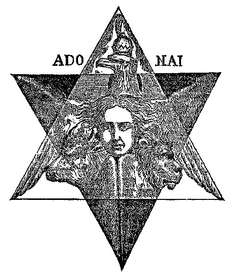

of the Æons, and highest emanation of the Deity; so high indeed that in
the eyes of the Gnostics, Michael was identical with Christ. And yet
Michael and Enoch are one and the same person. Both occupy the
junction-point of the cross of the Zodiac as "man." The scintilla of
Isaac was that of Gabriel, the chief of the angelic host, and the
scintilla of Jacob was taken from Uriel, named "the fire of God"; the
sharpest sighted spirit in all Heaven. Adam is not the Kadmon but Adam
*Primus,* the *Microprosopus.* In one of his aspects the latter is
Enoch,

###### p. 453

the terrestrial patriarch and father of Methuselah. He that "walked with
God" and "did not die" is the spiritual Enoch, who typified humanity,
eternal in spirit and as eternal in flesh, though the latter does *die*.
Death is but a new birth, and spirit is immortal; thus humanity can
never die, for the *Destroyer* has become the *Creator,* Enoch is the
type of the dual man, spiritual and terrestrial. Hence his place in the
centre of the astronomical cross.

 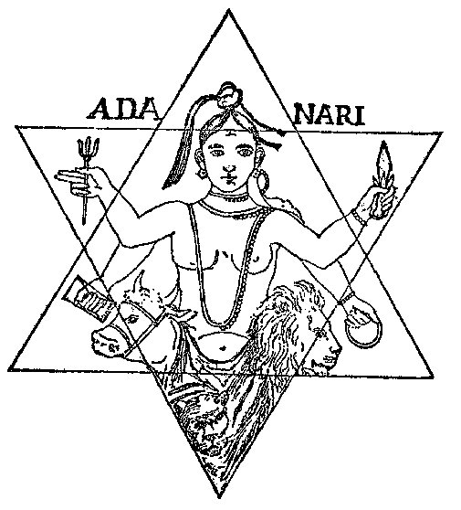

But was this idea original with the Hebrews? We think not. Every nation
which had an astronomical system, and especially India, held the cross
in the highest reverence, for it was the geometrical basis of the
religious symbolism of their *avatars;* the manifestation of the Deity,
or of the Creator in his creature MAN; of God in humanity and humanity
in God, as spirits. The oldest monuments of Chaldea, Persia, and India
disclose the double or eight-pointed cross. This symbol, which very
naturally is found, like every other geometrical figure in nature, in
plants as well as in the snowflakes, has led Dr. Lundy, in his
super-Christian mysticism, to

###### p. 454

name such cruciform flowers as form an eight-pointed star by the
junction of the two crosses--"the *Prophetic Star of the Incarnation,*
which joined heaven and earth, God and man together." [\*](#fn_869) The latter sentence is perfectly
expressed; only, the old kabalist axiom, "as above, so below," answers
still better, as it discloses to us the same God for all humanity, not
alone for the handful of Christians. It is the *Mundane* cross of Heaven
repeated on earth by plants and dual man: the physical man superseding
the "spiritual," at the junction-point of which stands the mythical
Libra-Hermes-Enoch. The gesture of one hand pointing to Heaven, is
balanced by the other pointing down to the earth; boundless generations
below, boundless regenerations above; the visible but the manifestation
of the invisible; the man of dust abandoned to dust, the man of spirit
reborn in spirit; thus it is finite humanity which is the Son of the
Infinite God. Abba--the Father; Amoria--the Mother; the Son, the
Universe. This primitive triad is repeated in all the tbeogonies. Adam
Kadmon, Hermes, Enoch, Osiris, Christna, Ormazd, or Christos are all
one. They stand as *Metatrons* between body and soul--eternal spirits
which redeem flesh by the regeneration of flesh *below,* and soul by the
regeneration *above,* where humanity walks once more with God.

We have shown elsewhere that the symbol of the cross or Egyptian *Tau,
 , was by many ages
earlier than the period assigned to Abraham, the alleled forefather of
the Israelites, for otherwise Moses could not have learned it of the
priests. And that the Tau was held as sacred by the Jews as by other
"Pagan" nations is proved by a fact admitted now by Christian divines as
well as by infidel archeologists. Moses, in Exodus* xii. 22, orders his
people to mark their *door-posts and lintels* with blood, lest the "Lord
God" should make a mistake and smite some of his chosen people, instead
of the doomed Egyptians. [\*\*](#fn_870) And
this mark is a tau! The identical Egyptian handled *cross,* with the
half of which talisman Horus raised the dead, as is shown on a
sculptured ruin at Philae. [\*\*\*](#fn_871)
How gratuitous is the idea that all such crosses and symbols were so
many unconscious prophecies of Christ, is fully exemplified in the case
of the Jews upon whose accusation Jesus was put to death. For instance,
the same learned author remarks in *Monumental Christianity* that "the
Jews themselves acknowledged this sign of salvation until they rejected

###### p. 455

Christ"; and in another place he asserts that the rod of Moses, used in
his miracles before Pharaoh, "was, no doubt, this *crux ansata,* or
something like it, *also used by the Egyptian priests.*"* [\*](#fn_872)* Thus the logical inference would be,
that 1, if the Jews worshipped the same symbols as the Pagans, then they
were no better than they; and 2, if, being so well versed as they were
in the hidden symbolism of the cross, in the face of their having waited
for centuries for the Messiah, they yet rejected both the Christian
Messiah and Christian Cross, then there must have been something wrong
about both.

Those who "rejected" Jesus as the "Son of God," were neither the people
ignorant of religious symbols, nor the handful of atheistical Sadducees
who put him to death; but the very men who were instructed in the secret
wisdom, who knew the origin as well as the meaning of the cruciform
symbol, and who put aside both the Christian emblem and the Saviour
suspended from it, because they could not be parties to such a
blasphemous imposition upon the common people.

Nearly all the prophecies about Christ are credited to the patriarchs
and prophets. If a few of the latter may have existed as real
personages, every one of the former is a myth. We will endeavor to prove
it by the hidden interpretation of the Zodiac, and the relations of its
signs to these antediluvian men.

If the reader will keep in mind the Hindu ideas of cosmogony, as given
in chapter vi., he will better understand the relation between the
biblical antediluvian patriarchs, and that puzzle of
commentators--"Ezekiel's wheel." Thus, be it remembered 1, that the
universe is not a spontaneous creation, but an evolution from
pre-existent matter; 2, that it is only one of an endless series of
universes; 3, that eternity is pointed off into grand cycles, in each of
which twelve transformations of our world occur, following its partial
destruction by fire and water, alternately. So that when a new minor
period sets in, the earth is so changed, even geologically, as to be
practically a new world; 4, that of these twelve transformations, the
earth after each of the first six is grosser, and everything on it--man
included--more material, than after the preceding one: while after each
of the remaining six the contrary is true, both earth and man growing
more and more refined and spiritual with each terrestrial change; 5,
that when the apex of the cycle is reached, a gradual dissolution takes
place, and every living and objective form is destroyed. But when that
point is reached, humanity has become fitted to live subjectively as
well as objectively. And not humanity alone, but also animals,

###### p. 456

plants, and every atom. After a time of rest, say the Buddhists, when a
new world becomes self-formed, the astral souls of animals, and of all
beings, except such as have reached the highest Nirvana; will return on
earth again to end their cycles of transformations, and become men in
their turn.

This stupendous conception, the ancients synthesized for the instruction
of the common people, into a single pictorial design--the Zodiac, or
celestial belt. Instead of the twelve signs now used, there were
originally but ten known to the general public, viz.: Aries, Taurus,
Gemini, Cancer, Leo, Virgo-Scorpio, Sagittarius, Capricornus, Aquarius,
and Pisces. [\*](#fn_873) These were exoteric.
But in addition there were two mystical signs inserted, which none but
initiates comprehended, viz.: at the middle or junction-point where now
stands *Libra,* and at the sign now called Scorpio, which follows Virgo.
When it was found necessary to make them exoteric, these two secret
signs were added under their present appellations as blinds to conceal
the true names which gave the key to the whole secret of creation, and
divulged the origin of "good and evil."

The true Sabean astrological doctrine secretly taught that within this
double sign was hidden the explanation of the gradual transformation of
the world, from its spiritual and subjective, into the "two-sexed"
sublunary state. The twelve signs were therefore divided into two
groups. The first six were called the ascending, or the line of
Macrocosm (the great spiritual world); the last six, the descending
line, or the Microcosm (the little secondary world)--the mere reflection
of the former, so to say. This division was called Ezekiel's wheel, and
was completed in the following way: First came the ascending five signs
(euphemerized into patriarchs), Aries, Taurus, Gemini, Cancer, Leo, and
the group concluded with Virgo-Scorpio. Then came the turning-point,
*Libra.* After which, the first half of the sign Virgo-Scorpio, was
duplicated and transferred to lead the lower, or descending group of
Microcosm which ran down to *Pisces,* or Noah (deluge). To make it
clearer, the sign Virgo-Scorpio, which appeared originally thus  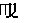, became simply *Virgo,*
and the duplication, 
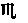, or Scorpio, was placed between Libra, the
*seventh* sign (which is Enoch, or the angel Metatron, or *Mediator*
between spirit and matter, or God and man). It now became Scorpio (or
Cain), which sign or patriarch led *mankind to destruction,* according

###### p. 459

LINES of **G**ENERATIONS.

Sethite.

(Good Principle)

1\. Adam.  
2. Seth.  
3. Enos.  
4. Cainan.  
5. Mahalaleel.  
6. Jared.  
7. Enoch.  
8. Methuselah.  
9 . Lamech.  
10. Noah.

Kenite.

(Evil Principle)

1\. Adam.  
2. Cain.  
3. Enoch.  
4. Irad.  
5. Mehujael.  
6. Methusael.  
7. Lamech.  
8. Jubal.  
9. Jabal.  
10. Tubal Cain.

The above are the ten biblical patriarchs, identical with Hindu
Pragapatis (Pradjapatis), and the Sephiroth of the *Kabala.* We say
*ten* patriarchs, not *twenty,* for the Kenite line was devised for no
other purpose than, 1, to carry out the idea of dualism, on which is
founded the philosophy of every religion; for these two genealogical
tables represent simply the opposing powers or principles of good and
evil; and 2, as a blind for the uninitiated masses. Suppose we restore
them to their primitive form, by erasing these premeditated blinds.
These are so transparent as to require but a small amount of
perspicacity to select, even though one should use only his unaided
judgment, and were not, as we are, enabled to apply the test of the
secret doctrine.

By ridding ourselves, therefore, of the Kenite names that are mere
duplications of the Sethite, or of each other, we get rid of Adam; of
Enoch--who, in one genealogy, is shown the father of Irad, and in the
other, the son of Jared; of Lamech, son of Methusael, whereas he,
Lamech, is son of Methuselah in the Sethite line; of Irad (Jared), [\*](#fn_878) Jubal and Jabal, who, with Tubal-Cain,
form a trinity in one, and that one the double of Cain; of Mehujael (who
is but Mahalaleel differently spelled), and Methusael (Methuselah). This
leaves us in the Kenite genealogy of chapter iv., one only, Cain,
who--the first murderer and fratricide--

De Rossi, of Parma, says of the Massoretes, in his "Compendis," vol.
iv., p. 7: "It is known with what carefulness Esdras, the most excellent
critic they have had, had *reformed* \[the text\] and *corrected* it,
and restored it to its primary splendor. Of the many revisions
undertaken after him, none are more celebrated than that of the
Massoretes, who came after the sixth century . . . and all the most
zealous adorers and defenders of the "Masorah," Christians and Jews . .
. ingenuously accord and confess that it, such as it exists, is
*deficient, imperfect, interpolated, full of errors,* and *a* *most
unsafe guide.*" The square letter was not invented till after the third
century.

###### p. 460

is made to stand in his line as father of Enoch, the most virtuous of
men, who does not die, but is translated alive. Turn we now to the
Sethite table, and we find that Enos, or Enoch, comes *second* from
Adam, and is father to Cain (an). This is no accident. There was an
evident reason for this inversion of paternity; a palpable design--that
of creating confusion and baffling inquiry.

We say, then, that the patriarchs are simply the signs of the Zodiac,
emblems, in their manifold aspects, of the spiritual and physical
evolution of human races, of ages, and of divisions of time. In
astrology, the first four of the "Houses," in the diagrams of the
"Twelve Houses of Heaven"--namely, the first, tenth, seventh, and
fourth, or the second inner square placed with its angles upward and
downward, are termed *angles,* as being of the greatest strength and
power. They answer to Adam, Noah, Cain-an, and Enoch, Alpha, Omega, evil
and good, leading the whole. Furthermore, when divided (including the
two secret names) into four *trigons* or triads, viz.: fiery, airy,
earthy, and watery, we find the latter corresponding to Noah.

Enoch and Lamech were doubled in the table of Cain, to fill out the
required number ten in both "generations" in the *Bible,* instead of
employing the "Secret Name"; and, in order that the patriarchs should
correspond with the ten kabalistic Sephiroth, and fit at the same time
the ten, and, subsequently, *twelve* signs of the Zodiac, in a manner
comprehensible only to the kabalists.

And now, Abel having disappeared out of that line of descent, he is
replaced by Seth, who was clearly an afterthought suggested by the
necessity of not having the human race descend entirely from a murderer.
This dilemma being apparently first noticed when the Kenite table had
been completed, Adam is made (after all the generations had appeared) to
beget this son, Seth. It is a suggestive fact that, whereas the
double-sexed Adam of chapter v. is made in the likeness of the Elohim
(see *Genesis* chapter i. 27 and v. 1 of the same), Seth (v. 3) is
begotten in Adam's "own likeness," thus signifying that there were men
of different races. Also, it is most noticeable that neither the age nor
a single other particular respecting the patriarchs in the Kenite table
is given, whereas the reverse is the case with those in the Sethite
line.

Most assuredly, no one could expect to find, in a work open to the
public, the final mysteries of that which was preserved for countless
ages as the grandest secret of the sanctuary. But, without divulging the
key to the profane, or being taxed with undue indiscretion, we may be
allowed to lift a corner of the veil which shrouds the majestic
doctrines of old. Let us then write down the patriarchs as they ought to
stand in their relation to the Zodiac, and see how they correspond with
the signs.

###### p. 461

The following diagram represents Ezekiel's Wheel, as given in many
works, among others, in Hargrave Jennings'

Rosicrucians:

EZEKIEL'S **W**HEEL (exoteric).

 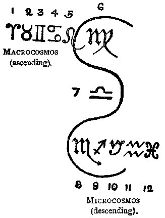

These signs are (follow numbers):

> 1, Aries; 2, Taurus; 3, Gemini; 4, Cancer; 5, Leo; 6, Virgo, or the
> *ascending* line of the grand cycle of creation. After this comes 7,
> *Libra--*"man," which, though it is found right in the middle, or the
> intersection point, leads down the numbers:

> 8, Scorpio; 9, Sagittarius; 10, Capricornus; 11, Aquarius; and 12,
> Pisces.

While discussing the double sign of Virgo-Scorpio and Libra, Hargrave
Jennings observes (p. 65):

"All this is incomprehensible, except in the strange mysticism of the
Gnostics and the kabalists; and the whole theory requires a key of
explanation to render it intelligible; which key is only darkly referred
to as possible, but refused absolutely, by these extraordinary men, as
not permissible to be disclosed."

The said key must be turned *seven* times before the whole system is
divulged. We will give it but *one* turn, and thereby allow the profane
one glimpse into the mystery. Happy he, who understands the whole!

###### p. 462

EZEKIEL'S **W**HEEL (esoteric).

 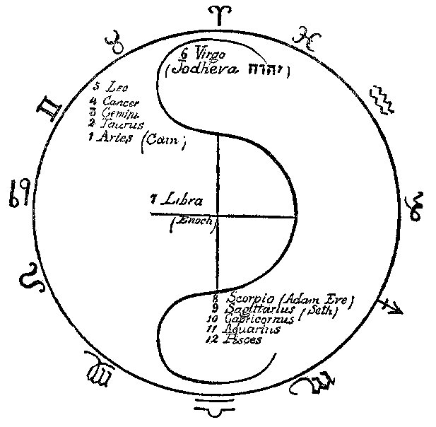

To explain the presence of Jodheva (or Yodheva), or what is generally
termed the tetragram 
, and of Adam and Eve, it will suffice to remind
the reader of the following verses in *Genesis,* with their right
meaning inserted in brackets.

> 1\. "And God \[Elohim\] created man in his \[their\] own image . . .
> male and female created he them \[him\]"--(ch. 1. 27).

> 2\. "Male and female created he them \[him\] . . . and called *their*
> \[his\] name **A**DAM"--(v. 2).

When the ternary is taken in the beginning of the tetragram, it
expresses the divine creation *spiritually, i.e.,* without any carnal
sin: taken at its opposite end it expresses the latter; it is feminine.
The name of Eve is composed of three letters, that of the primitive or
heavenly

###### p. 463

Adam, is written with one letter, Jod or Yodh; therefore it must not be
read Jehova but *Ieva,* or Eve. The Adam of the first chapter is the
spiritual, therefore pure androgyne, Adam Kadmon. When woman issues from
the left rib of the second Adam (of dust), the pure *Virgo* is
separated, and falling "into generation," or the downward cycle, becomes
*Scorpio, [\*](#fn_879)* emblem of sin and
matter. While the ascending cycle points at the purely spiritual races,
or the ten prediluvian patriarchs (the Pradjapatis, and Sephiroth) [\*\*](#fn_880) are led on by the creative Deity
itself, who is Adam Kadmon or Yodcheva, the lower one is that of the
terrestrial races, led on by Enoch or *Libra,* the *seventh;* who,
because he is half-divine, half-terrestrial, is said to have been taken
by God alive. Enoch, or Hermes, or Libra are one. All are the scales of
universal harmony; justice and equilibrium are placed at the central
point of the Zodiac. The grand circle of the heavens, so well discoursed
upon by Plato, in his *Timaeus,* symbolizes the unknown as a unity; and
the smaller circles which form the cross, by their division on the plane
of the Zodiacal ring--typify, at the point of their intersection, life.
The centripetal and centrifugal forces, as symbols of Good and Evil,
Spirit and Matter, Life and Death, are also those of the Creator and the
Destroyer,--Adam and Eve, or God and the Devil, as they say in common
parlance. In the subjective, as well as in the objective worlds, they
are the two powers, which through their eternal conflict keep the
universe of spirit and matter in harmony. They force the planets to
pursue their paths, and keep them in their elliptical orbits, thus
tracing the astronomical cross in their revolution through the Zodiac.
In their conflict the centripetal force, were it to prevail, would drive
the planets and living souls into the sun, type of the invisible
Spiritual Sun, the Paraatma or great universal Soul, their parent; while
the centrifugal force would chase both planets and *souls* into the
dreary space, far from the luminary of the objective universe, away from
the spiritual realm of salvation and eternal life, and into the chaos of
final cosmic destruction, and individual annihilation. But the *balance*
is there, ever sensitive at the intersection point. It regulates the
action of the two combatants, and the combined effort of both, causes
planets and "living souls" to pursue a double diagonal line in their
revolution through Zodiac and Life; and thus preserving strict harmony,
in visible and invisible heaven and earth, the forced unity of the two
reconciles spirit and matter, and Enoch is

###### p. 464

said to stand a "Metatron" before God. Reckoning from him down to Noah
and his three sons, each of these represent a new "world," *i.e*., our
earth, which is the seventh [\*](#fn_881) after
every period of geological transformation, gives birth to another and
distinct race of men and beings.

Cain leads the ascending line, or Macrocosm, for he is the Son of the
"Lord," not of Adam (*Genesis* iv*.* 1). The "Lord" is Adam Kadmon,
Cain, the Son of sinful thought, not the progeny of flesh and blood,
Seth on the other hand is the leader of the races of earth, for he is
the Son of Adam, and begotten "in his own likeness, after his image"
(*Genesis* v. 3). Cain is *Kenu,* Assyrian, and means eldest, while the
Hebrew word  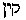 means a
Smith, an artificer.

Our science shows that the globe has passed through five distinct
geological phases, each characterized by a different stratum, and these
are in reverse order, beginning with the last: 1. The Quaternary period,
in which man appears as a certainty; 2. The Tertiary period, in which he
*may have* appeared; 3. Secondary period, that of gigantic saurians, the
megalosaurus, icthyosaurus, and plesiosaurus--*no vestige of man;* 4.
The Palaeozoic period, that of gigantic crustacea; 5 (or first). The
Azoic period, during which science asserts organic life had not yet
appeared.

And is there no possibility that there was a period, and several
periods, when man *existed,* and yet was not an organic being--therefore
could not have left any vestige of himself for exact science? *Spirit*
leaves no skeletons or fossils behind, and yet few are the men on earth
who doubt that man can live both objectively and subjectively. At all
events, the theology of the Brahmans, hoary with antiquity, and which
divides the formative periods of the earth into four ages, and places
between each of these a lapse of 1,728,000 years, far more agrees with
official science and modern discovery than the absurd chronological
notions promulgated by the Councils of Nice and Trent.

The names of the patriarchs were not Hebrew, though they may

###### p. 465

have been Hebraized later; they are evidently of Assyrian or Aryan
origin.

Thus *Adam,* for instance, stands in the explained *Kabala* as a
convertible term, and applies nearly to every other patriarch, as every
Sephiroth to each Sephira, and *vice versa.* Adam, Cain, and Abel form
the first *triad* of the twelve. They correspond in the Sephiral tree to
the Crown, Wisdom, and Intelligence; and in astrology to the three
trigons--the fiery, the earthy, and the airy; which fact, were we
allowed to devote more space than we have to its elucidation, would
perhaps show that astrology deserves the name of science as well as any
other. Adam (Kadmon) or Aries (ram) is identical with the Egyptian
ram-headed god Amun, fabricating man on the potter's wheel. His
duplication, therefore--or the Adam of dust--is also Aries, Amon, when
standing at the head of his generations, for he fabricates mortals also
in "his own likeness." In astrology the planet Jupiter is connected with
the "first house" (Aries). The color of Jupiter, as seen in the "stages
of the seven spheres," on the tower of Borsippa, or Birs Nimrud, was
*red*; [\*](#fn_882) and in Hebrew Adam means
  "red" as well as
"man." The Hindu god Agni, who presides at the sign of Pisces, next to
that of Aries in their relation to the twelve months (February and
March), [\*\*](#fn_883) is painted of a deep
red color, with *two* faces (male and female), *three* legs, and *seven*
arms; the whole forming the number twelve. So, also, Noah (Pisces), who
appears in the generations as the twelfth patriarch, counting Cain and
Abel, is Adam again under another name, for he is the forefather of a
new race of mankind; and with his "three sons," one bad, one good, and
one partaking of both qualities, is the terrestrial reflection of the
super-terrestrial Adam and his three sons. Agni is represented mounted
on a ram, with a tiara surmounted by a cross. [\*\*\*](#fn_884)

Kain, presiding over the Taurus (Bull) of the Zodiac, is also very
suggestive. Taurus belongs to the earthy trigon, and in connection with
this sign it will not be amiss to remind the student of an allegory from
the Persian *Avesta.* The story goes that Ormazd produced a
being--source and type of all the universal beings--called **L**IFE, or
Bull in the *Zend*. Ahriman (Cain) kills this being (Abel), from the
seed of which

###### p. 466

(Seth) new beings are produced. Abel, in Assyrian, means *son,* but in
Hebrew   it means
something ephemeral, not long-lived, *valueless,* and also a "Pagan
idol," [\*](#fn_885) as Kain means a *Hermaic
statue* (a pillar, the symbol of generation). Likewise, Abel is the
female counterpart of Cain (male), for they are twins and probably
androgynous; the latter answering to Wisdom, the former to Intelligence.

So with all other patriarchs. Enos, 
, is *Homo* again--a man, or the same Adam, and
Enoch in the bargain; and 
*K*a*in-*a*n* is identical with Cain. Seth,  *,* is Teth, or Thoth, or
Hermes; and this is the reason, no doubt, why Josephus, in his first
book (ch. 3) shows Seth so proficient in astrology, geometry, and other
occult sciences. Foreseeing the flood, he says, he engraved the
fundamental principles of his art on two pillars of brick and stone, the
latter of which "he saw himself \[Josephus\] *to remain in Syria in his
own time.*" Thus is it that Seth is identified also with Enoch, to whom
kabalists and Masons attribute the same feat; and, at the same time,
with Hermes, or Kadmus again, for Enoch is identical with the former;
 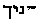 He-NOCH means a
teacher, an initiator, or an initiate; in Grecian mythology, Inachus. We
have seen the part he is made to play in the Zodiac.

Mahalaleel, if we divide the word and write  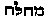, *m*a*-h*a*-la,* means
tender, merciful; and therefore is he made to correspond with the fourth
Sephira, *Love* or *Mercy,* emanated from the first triad. [\*\*](#fn_886) Irad, 
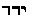, or *I*a*r*e*d*, is (minus the vowels) precisely
the same. If from the verb 
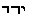, it means *descent;* if from  , *ar*a*d,* it means
offspring, and thus corresponds perfectly with the kabalistic
emanations.

La*m*e*ch,  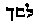, is not
Hebrew, but Greek. Lam-ach means Lam--the father, and Ou-Lom-Ach is the
father of the age; or the father of him (Noah) who inaugurates a new era
or period of creation after the pralaya* of the deluge; Noah being the
symbol of a new world, the Kingdom (Malchuth) of the Sephiroth; hence
his father, corresponding to the ninth Sephiroth, is the
Foundation. [\*\*\*](#fn_887) Furthermore, both
father and son answer to Aquarius and Pisces in the Zodiac; and thus the
former belonging to the airy and the latter to the *watery* trigons,
they close the list of the biblical myths.

But if, as we see, every patriarch represents, in one sense, like each
of the Pradjapatis, a new race of antediluvian human beings; and if, as
it may as easily be proved, they are the copies of the Babylonian
*Saros*,

###### p. 467

or ages, the latter themselves copies of the Hindu ten dynasties of the
"Lords of beings," [\*](#fn_888) yet, however
we may regard them, they are among the profoundest allegories ever
conceived by philosophical minds.

In the *Nuctemeron*, [\*\*](#fn_889) the
evolution of the universe and its successive periods of formation,
together with the gradual development of the human races, are
illustrated as fully as possible in the twelve "hours" into which the
allegory is divided. Each "hour" typifies the evolution of a new man,
and in its turn is divided into four quarters or ages. This work shows
how thoroughly was the ancient philosophy imbued with the doctrines of
the early Aryans, who were the first to divide the life on our planet
into four ages. If one would trace this doctrine from its source in the
night of the traditional period down to the Seer of Patmos, he need not
go astray among the religious systems of all nations. The Babylonians he
would find teaching that in four different periods four Oannes (or suns)
appeared; the Hindus asserting their four Yuga; the Greeks, Romans, and
others firmly believing in the golden, silver, brazen, and iron ages,
each of the epochs being heralded by the appearance of a saviour. The
four Buddhas of the Hindus and the three prophets of the
Zoroastrians--Oshedar-Cami, Oshedar-mah, and Sosiosh--preceded by
Zarotushtra, are the types of these ages.

In the *Bible,* the very opening tells us that *before the sons of God
saw the daughters of men,* the latter lived from 365 to 969 years. But
when the "Lord God" saw the iniquities of mankind, He concluded to allow
them at most 120 years of life (*Genesis* vi*.* 3). To account for such
a violent oscillation in the human mortality-table is only possible by
tracing this decision of the "Lord God" to its origin. Such
incongruities as we meet at every step in the *Bible* can be only
attributed to the facts that the book of *Genesis* and the other books
of *Moses* were tampered with and remodelled by more than one author;
and, that in their original state they were, with the exception of the
external form of the allegories, faithful copies from the Hindu sacred
books. In *Manu,* book i., we find the following:

###### p. 468

"In the first age, neither sickness nor suffering were known. Men lived
four centuries."

This was in the Krita or Satya yug.

"The Krita-yug is the type of justice. The *bull* which stands firm on
its four legs is its image; man adheres to truth, and evil does not as
yet direct his actions." [\*](#fn_890) But in
each of the following ages primitive human life loses one-fourth of its
duration, that is to say, in Treta-yug man lives 300, in Dwapara-yug
200, and in Kali-yug, or our own age, but 100 years generally, at the
most. Noah, son of Lamech--Oulom-*Ach*, or father of the age--is the
distorted copy of Manu, son of Swayambhu, and the six Manus or Rishis
issued from the Hindu "first man" are the originals of Terah, Abraham,
Isaac, Jacob, Joseph, and Moses, the Hebrew sages, who beginning with
Terah were all alleged to have been astrologers, alchemists, inspired
prophets, and soothsayers; or in a more profane but plainer
language--magicians.

If we consult the Talmudistic *Mishna* we find therein the first
emanated divine couple, the androgyne Demiurge Chochmah (or Hachma
Achamoth) and Binah building themselves a house with *seven* pillars.
They are the architects of God--Wisdom and Intelligence--and His
"compass and square." The seven columns are the future *seven* worlds,
or the typical *seven* primordial "days" of creation.

"Chochmah immolates her victims." These victims are the numberless
forces of nature which must "die" (expend themselves) *in order that
they should live;* when one force dies out, it is but to give birth to
another force, its progeny. It dies but lives in its children, and
resuscitates at every *seventh* generation. The servants of Chochmah, or
wisdom, are the souls of H-Adam, for in him are all the souls of Israel.

There are *twelve* hours in the day, says the *Mishna,* and it is during
these hours that is accomplished the creation of man. Would this be
comprehensible, unless we had Manu to teach us that this "day" embraces
the four ages of the world and has a duration of *twelve* thousand
divine years of the Devas?

"The Creators (Elohim) outline in the second" hour "the shape of a more
corporeal form of man. They separate it into two and prepare the sexes
to become distinct from each other. Such is the way the Elohim proceeded
in reference to every created thing." [\*\*](#fn_891) "Every fish, fowl, plant, beast and
man was androgyne at the first hour."

Says the commentator, the great Rabbi Simeon:

###### p. 469

"O, companions, companions, man as emanation was both man and woman; as
well on the side of the **F**ATHER as on the side of the **M**OTHER. And
this is the sense of the words, and Elohim spoke, Let there be Light and
it was Light! . . . And this is the 'two-fold man'!" [\*](#fn_892)

A spiritual woman was necessary as a contrast for the spiritual man.
Harmony is the universal law. In Taylor's translation, Plato's discourse
upon creation is rendered so as to make him say of this universe that
"He caused it to move with circular motion. . . . When, therefore, that
God who is a perpetually reasoning Divinity, cogitated about that God
(man) *who was destined to subsist at some certain period of time,* He
produced his body smooth and even, and every way even and whole from the
centre, and made it perfect. This perfect circle of the created God, *He
decussated in the form of the letter* X."

The italics of both these sentences from *Timaeus* belong to Dr. Lundy,
the author of that remarkable work mentioned once before, *Monumental
Christianity;* and attention is drawn to the words of the Greek
philosopher, with the evident purpose of giving them the prophetic
character which Justin Martyr applied to the same, when accusing Plato
of having borrowed his "physiological discussion in the *Timaeus* . . .
concerning the Son of God placed crosswise in the universe," from Moses
and his serpent of brass. The learned author seems to fully accord an
unpremeditated prophecy to these words; although he does not tell us
whether he believes that like Plato's created god, Jesus was originally
a sphere "smooth and even, and every way even and whole from the
centre." Even if Justin Martyr were excusable for his perversion of
Plato, Dr. Lundy ought to know that the day for that sort of casuistry
is long gone by. What the philosopher meant was *man,* who before being
encased in matter had no use for limbs, but was a pure spiritual entity.
Hence if the Deity, and his universe, and the stellar bodies are to be
conceived as spheroidal, this shape would be archetypal man's. As his
enveloping shell grew heavier, there came the necessity for limbs, and
the limbs sprouted. If we fancy a man with arms and legs naturally
extended at the same angle, by backing him against the circle that
symbolizes his prior shape as a spirit, we would have the very figure
described by Plato--the X cross within the circle.

All the legends of the creation, the fall of man, and the resultant
deluge, belong to universal history, and are no more the property of the
Israelites than that of any other nation. What specially belongs to them
(kabalists excepted) are the disfigured details of every tradition. The
*Genesis* of Enoch is by far anterior to the books of Moses, [\*\*](#fn_893) and

###### p. 470

Guillaume Postel has presented it to the world, explaining the
allegories as far as he dared; but the ground-work is still unexposed.
For the Jews, the *Book of Enoch* is as canonical as the Mosaic books;
and if the Christians accepted the latter as an authority, we do not see
why they should reject the former as an apocrypha. No more can the age
of one than that of the other be determined with anything like
certainty. At the time of the separation, the Samaritans recognized only
the books of Moses and that of Joshua, says Dr. Jost. [\*](#fn_894) In 168 B.C., Jerusalem had its temple
plundered, and all the sacred books were destroyed; [\*\*](#fn_895) therefore, the few **MSS**. that
remained were to be found only among the "teachers of tradition." The
kabalistic Tanaim, and their initiates and prophets had always practised
its teachings in common with the Canaanites, the Hamites, Midianites,
Chaldeans, and all other nations. The story of Daniel is a proof of it.

There was a sort of Brotherhood, or Freemasonry among the kabalists
scattered all over the world, since the memory of man; and, like some
societies of the mediaeval Masonry of Europe, they called themselves
*Companions* [\*\*\*](#fn_896) and
*Innocents*. [\*\*\*\*](#fn_897) It is a belief
(founded on knowledge) among the kabalists, that no more than the
Hermetic rolls are the genuine sacred books of the seventy-two
elders--books which contained the "*Ancient Word*"*--*lost, but that
they have all been preserved from the remotest times among secret
communities. Emanuel Swedenborg says as much, and his words are based,
he says, on the information he had from certain *spirits,* who assured
him that "they performed their worship according to this Ancient Word."
"Seek for it in China," adds the great seer, "peradventure you may find
it in Great Tartary!" Other students of occult sciences have had more
than the word of "certain spirits" to rely upon in this special
case--they have seen the books.

We must choose therefore perforce between two methods--either to accept
the *Bible* exoterically or esoterically. Against the former we have the
following facts: That, after the first copy of the *Book of God* has
been edited and launched on the world by Hilkiah, this copy disappears,
and Ezra has to make a *new Bible,* which Judas Maccabeus finishes; that
when it was copied from the horned letters into square letters, it was
corrupted beyond recognition; that the *Masorah* completed the work of
destruction; that, finally, we have a text, not 900 years old, abounding

###### p. 471VOLUME.

with omissions, interpolations, and premeditated perversions; and that,
consequently, as this Masoretic Hebrew text has fossilized its mistakes,
and the key to the "Word of God" is lost, no one has a right to enforce
upon so-called "Christians" the divagations of a series of hallucinated
and, perhaps, spurious prophets, under the unwarranted and untenable
assumption that the author of it was the "Holy Ghost" in

propria personae.

Hence, we reject this pretended monotheistic Scripture, made up just
when the priests of Jerusalem found their political profit in violently
breaking off all connection with the Gentiles. It is at this moment only
that we find them persecuting kabalists, and banning the "old wisdom" of
both Pagans and Jews. *The real Hebrew Bible was a secret volume,
unknown to the masses,* and even the Samaritan *Pentateuch* is far more
ancient than the *Septuagint.* As for the former, the Fathers of the
Church never even heard of it. We prefer decidedly to take the word of
Swedenborg that the "Ancient Word" is *somewhere in China or the Great
Tartary.* The more so, as the Swedish seer is declared, at least by one
clergyman, namely, the Reverend Dr. R. L. Tafel, of London, to have been
in a state of "inspiration from God," while writing his theological
works. He is given even the superiority over the penmen of the *Bible,*
for, while the latter had the words spoken to them in their ears,
Swedenborg was made to understand them rationally and was, therefore,
*internally* and not externally illuminated. "When," says the reverend
author, "a conscientious member of the New Church hears any charges made
against the divinity and the infallibility of either the soul or the
body of the doctrines of the New Jerusalem, he must at once place
himself on the unequivocal declaration made in those doctrines, that the
Lord has effected His second coming in and by means of those writings
which were published by Emanuel Swedenborg, as His servant, and that,
therefore, those charges are not and cannot be true." And if it is "the
Lord" that spoke through Swedenborg, then there is a hope for us that at
least one divine will corroborate our assertions, that the ancient "word
of God" is nowhere but in the heathen countries, especially

Buddhistic Tartary, Thibet, and China!

"The primitive history of Greece is the primitive history of India,"
exclaims Pococke in his *India in Greece.* In view of subsequent fruits
of critical research, we may paraphrase the sentence and say: "The
primitive history of Judea is a distortion of Indian fable engrafted on
that of Egypt." Many scientists, encountering stubborn facts, and being
reluctant to contrast the narratives of the "divine" revelation with
those of the Brahmanical books, merely present them to the reading
public. Meanwhile they limit their conclusions to criticisms and
contradictions

###### p. 472

of each other. So Max Muller opposes the theories of Spiegel, and some
one else; and Professor Whitney those of the Oxford Orientalist; and Dr.
Haug made onslaughts on Spiegel, while Dr. Spiegel chose some other
victim; and now even the time-honored Akkadians and Turanians have had
their day of glory. The *Proto-Kasdeans, Kasdeo-Scyths, Sumirians,* and
what not, have to make room for some other fictions. Alas! for the
Akkads, Halevy, the Assyriologist attacks the Akkado-Sumirian language
of old Babylon, and Chabas, the Egyptologist, not content with
dethroning the Turanian speech, which has rendered such eminent services
to Orientalists when perplexed, calls the venerable parent of the
Akkadians--Francois Lenormant--himself, a charlatan. Profiting by the
learned turmoil, the Christian clergy take heart for their fantastic
theology on the ground that when the jury disagree there is a gain of
time at least for the indicted party. And thus is overlooked the vital
question whether Christendom would not be the better for adopting
Christism in place of Christianity, with its *Bible,* its vicarious
atonement and its Devil. But to so important a personage as the latter,
we could not do less than devote a special chapter.

------------------------------------------------------------------------

### Footnotes

[407:\*](iu108.htm#fr_810) The *Rishi* are
identical with *Manu*. The ten Pragapati, sons of Viradj, called
Maritchi, Atri, Angira, Polastya, Poulaha, Kratu, Pratcheta, Vasishta,
Brighu, and Narada, are euhemerized *Powers,* the Hindu Sephiroth. These
emanate the seven Rishi, or Manus, the chief of whom issued himself from
the "uncreated." He is the Adam of earth, and signifies man. His "sons,"
the following six Manus, represent each a new race of men, and in the
total they are *humanity* passing gradually through the primitive seven
stages of evolution.

[407:\*\*](iu108.htm#fr_811) In days of old,
when the Brahmans studied more than they do now the hidden sense of
their philosophy, they explained that each of these six distinct races
which preceded ours had disappeared. But now they pretend that a
specimen was preserved which was not destroyed with the rest, but
reached the present *seventh* stage. Thus they, the Brahmans are the
specimens of the heavenly Manu, and issued from the mouth of Brahma;
while the Sudra was created from his foot.

[411:\*](iu108.htm#fr_812) To avoid discussion
we adopt the palaeographical conclusions arrived at by Martin Haug and
some other cautious scholars. Personally we credit the statements of the
Brahmans and those of Halled, the translator of the "Sastras."

[411:\*\*](iu108.htm#fr_813) The god Heptaktis.

[412:\*](iu108.htm#fr_814) The sanctuary of the
initiation.

[413:\*](iu108.htm#fr_815) "Comparative
Mythology."

[413:\*\*](iu108.htm#fr_816) While having no
intention to enter at present upon a discussion as to the nomadic races
of the "Rhematic period," we reserve the right to question the full
propriety of terming that portion of the primitive people from whose
traditions the "Vedas" sprang into existence, Aryans. Some scientists
find the existence of these Aryans not only unproved by science, but the
traditions of Hindustan protesting against such an assumption.

[413:\*\*\*](iu108.htm#fr_817) Without the
esoteric explanation, the "Old Testament" becomes an absurd jumble of
meaningless tales--nay, worse than that, it must rank high with
*immoral* books. It is curious that Professor Max Muller, such a
profound scholar in Comparative Mythology, should be found saying of the
pragapatis and Hindu gods that they are masks *without actors;* and of
Abraham and other mythical patriarchs that they were real living men; of
Abraham especially, we are told (see "Semitic Monotheism") that he
"stands before us as a figure second only to one in the whole history of
the world."

[414:\*](iu108.htm#fr_818) The italics are our
own. "The Vedas," lecture by Max Muller, p. 75.

[414:\*\*](iu108.htm#fr_819) "Chips," vol. i.,
p. 8.

[415:\*](iu108.htm#fr_820) We believe that we
have elsewhere given the contrary opinion, on the subject of
"Atharva-Veda," of Prof. Whitney, of Yale College.

[415:\*\*](iu108.htm#fr_821) See Baron Bunsen's
"Egypt," vol. v.

[416:\*](iu108.htm#fr_822) "Chips," vol. i.;
"The Vedas."

[416:\*\*](iu108.htm#fr_823) Max Muller:
Lecture on "The Vedas."

[417:\*](iu108.htm#fr_824) Julian: "In Matrem,"
p. 173; Julian: "Oratio," v., 172.

[417:\*\*](iu108.htm#fr_825) Lyd.: "De
Mensibus," iv., 38-74; "Movers," p. 550; Dunlap: "Saba," p. 3.

[418:\*](iu108.htm#fr_826) "Westminster
Review": Septenary Institutions; "Stone Him to Death."

[419:\*](iu108.htm#fr_827) "Di Verbo Mirifico."

[421:\*](iu108.htm#fr_828) Idra Suta: "Sohar,"
book iii., p. 292 b. The Supreme consulting with the Architect of the
world--his Logos--about creation.

[421:\*\*](iu108.htm#fr_829) Idra Suta:
"Sohar," iii., 135 b. If the chapters of Genesis and the other Mosaic
books, as well as the subjects, are muddled up, the fault is the
compiler's--not that of oral tradition. Hilkiah and Josiah had to
commune with Huldah, the prophetess, hence resort to *magic* to
understand the word of the "Lord God of Israel," most conveniently found
by Hilkiah (2 Kings, xxiii.); and that it has passed still later through
more than one revision and remodelling is but too well proved by its
frequent incongruities, repetitions, and contradictions.

[422:\*](iu108.htm#fr_830) This assimilation of
the deluge to an earthquake on the Assyrian tablets would go to prove
that the antediluvian nations were well acquainted with other geological
cataclysms besides the deluge, which is represented in the Bible as the
*first* calamity which befel humanity, and a punishment.

[423:\*](iu108.htm#fr_831) George Smith notes
in the tablets, first the creation of the moon, and then of the sun:
"Its beauty and perfection are extolled, and the regularity of its
orbit, which led to its being considered the type of a judge and the
regulator of the world." Did this story of the deluge relate simply to a
cosmogonical cataclysm--even were it universal--why should the goddess
Ishtara or Astoreth (the moon) speak of the *creation of the sun* after
the deluge? The waters might have reached as high as the mountain of
*Nizir* (Chaldean version), or Jebel-Djudi (the deluge-mountains of the
Arabian legends), or yet Ararat (of the biblical narrative), and even
Himalaya of the Hindu tradition, and yet not reach the sun--even the
Bible itself stopped short of such a miracle. It is evident that the
deluge of the people who first recorded it had another meaning, less
problematical and far more philosophical than that of a *universal*
deluge, of which there are no geological traces whatever.

[425:\*](iu108.htm#fr_832) he "dead letter that
killeth," is magnificently illustrated in the case of the Jesuit de
Carriere, quoted in the "Bible dans l'Inde." The following dissertation
represents the spirit of the whole Catholic world: "So that the creation
of the world," writes this faithful son of Loyola, explaining the
biblical chronology of Moses, "and all that is recorded in Genesis,
might have become known to Moses through *recitals personally made to
him by his fathers.* Perhaps, even, the memories yet existed among the
Israelites, and from those recollections he may have recorded the dates
of births and deaths of the patriarchs, the numbering of their children,
and the names of the different countries in which each became
established under the guidance *of the holy spirit, which we must always
regard as the chief author of the sacred books*"!!!

[426:\*](iu108.htm#fr_833) See chapter xv. and
last of Part I.

[427:\*](iu108.htm#fr_834) "Description, etc.,
of the People of India," by the Abbe J. A. Dubois, missionary in Mysore,
vol. i., p. 186.

[428:\*](iu108.htm#fr_835) "Fetichisme,
Polytheisme, Monotheisme," pp. 170, 171.

[428:\*\*](iu108.htm#fr_836) Against the latter
assumption derived solely from the accounts of the Bible we p. 429 have every historical fact. 1st. There are
no proofs of these twelve tribes having ever existed; that of Levi was a
priestly caste and all the others imaginary. 2d. Herodotus, the most
accurate of historians, who was in Assyria when Ezra flourished, never
mentions the Israelites at all! Herodotus was born in 484 B. C.

[430:\*](iu108.htm#fr_837) Dr. Kennicot
himself, and Bruns, under his direction, about 1780, collated 692
manuscripts of the Hebrew "Bible." Of all these, only *two* were
credited to the tenth century, and three to a period as early as the
eleventh and twelfth. The others ranged between the thirteenth and
sixteenth centuries.

In his "Introduzione alla Sacra Scrittura," pp. 34-47, De Rossi, of
Parma, mentions 1,418 **MSS**. collated, and 374 editions. The oldest
manuscript "Codex," he asserts--that of Vienna--dates A.D. 1019; the
next, Reuchlin's, of Carlsruhe, 1038. "There is," he declares, "nothing
in the manuscripts of the Hebrew 'Old Testament' extant of an earlier
date than the eleventh century after Christ."

[431:\*](iu108.htm#fr_838) "India in Greece,"
Preface, ix.

[432:\*](iu108.htm#fr_839) "Chips," vol. i.

[432:\*\*](iu108.htm#fr_840) "Egypt's Place in
Universal History," vol. v., p. 77.

[432:\*\*\*](iu108.htm#fr_841) Ibid., p. 78.

[433:\*](iu108.htm#fr_842) "Chips"; "Aitareya
Brahmanam."

[433:\*\*](iu108.htm#fr_843) Dr. M. Haug,
Superintendent of the Sanscrit studies in the Poona College, Bombay.

[436:\*](iu108.htm#fr_844) Pococke belongs to
that class of Orientalists who believe that Buddhism preceded
Brahmanism, and was the religion of the earliest Vedas, Gautama having
been but the restorer of it in its purest form, which after him
degenerated again into dogmatism.

[436:\*\*](iu108.htm#fr_845) "India in Greece,"
p. 200.

[437:\*](iu108.htm#fr_846) "The Asiatic origin
of the first dwellers in the Nilotic Valley is clearly demonstrated by
concurrent and independent testimony. Cuvier and Blumenbach affirm that
all the skulls of mummies which they had the opportunity of examining,
presented the Caucasian type. A recent American physiologist (Dr.
Morton) has also argued for the same conclusion ("Crania Ægyptiaca."
Philadelphia, 1844).

[437:\*\*](iu108.htm#fr_847) The late Rajah of
Travancore was succeeded by the elder son of his sister now reigning,
the Maharajah *Rama Vurmah.* The next heirs are the sons of his deceased
sister. In case the female line is interrupted by death, the royal
family is obliged to adopt the daughter of some other Rajah, and unless
daughters are born to this Rana another girl is adopted, and so on.

[437:\*\*\*](iu108.htm#fr_848) There are some
Orientalists who believe that this custom was introduced only after the
early Christian settlements in -Æthiopia; but as under the Romans the
population of this country was nearly all changed, the element becoming
wholly Arabic, we may, without doubting the statement, believe that it
was the predominating Arab influence which had altered the earliest mode
of writing. Their present method is even more analogous to the
Devanagari, and other more ancient Indian Alphabets, which read from
left to right; and their letters show no resemblance to the Phoenician
characters. Moreover, all the ancient authorities corroborate our
assertion still more. Philostratus makes the Brahmin Iarchus say (V.A.,
iii., 6) that the Æthiopians were originally *an Indian race,* compelled
to emigrate from the mother-land for sacrilege and regicide (see
Pococke's "India," etc., ii., p. 206). An Egyptian is made to remark,
that he had heard from his father, that the Indians were the wisest of
men, and that the Æthiopians, a colony of the Indians, preserved the
wisdom and usages of their fathers, and acknowledged their ancient
origin. Julius Africanus (in Eusebius and Syncellus), makes the same
statement. And Eusebius writes: "The Æthiopians, emigrating from the
river Indus, settled in the vicinity of Egypt" (Lemp., Barker's edition,
"Meroe").

[439:\*](iu108.htm#fr_849) They might have been
also, as Pococke thinks, simply the tribes of the "Oxus," a name derived
from the "Ookshas," those people whose wealth lay in the "Ox," for he
shows *Ookshan* to be a crude form of *Ooksha,* an ox (in Sanscrit *ox*
is as in English). He believes that it was they, "the lords of the
Oxus," who gave their name to the sea around which they ruled in many a
country, the *Euxine* or Ooksh-ine. *Pali* means a shepherd, and
*s'than* is a land. "The warlike tribes of the Oxus penetrated into
Egypt, then swept onward to Palestine (**P**ALI-STAN), the land of the
Palis or shepherds, and there effected more permanent settlements"
("India in Greece"). Yet, if even so, it would only the more confirm our
opinion that the Jews are a hybrid race, for the "Bible" shows them
freely intermarrying, not alone with the Canaanites, but with every
other nation or race they come in contact with.

[441:\*](iu108.htm#fr_850) Prof. A. Wilder:
"Notes."

[442:\*](iu108.htm#fr_851) Moses reigned over
the people of Israel in the wilderness for over *forty* years.

[442:\*\*](iu108.htm#fr_852) The name of the
wife of Moses was Zipporah (Exodus ii.).

[443:\*](iu108.htm#fr_853) About 1040, the
Jewish doctors removed their schools from Babylonia to Spain, and of the
four great rabbis that flourished during the next four centuries, their
works all show different readings, and abound with mistakes in the
manuscripts. The "Masorah" made things still worse. Many things that
then existed in the manuscripts are there no longer, and their works
teem with interpolations as well as with *lacunae*. The oldest Hebrew
manuscript belongs to this period. Such is the divine revelation we are
to credit.

[443:\*\*](iu108.htm#fr_854) No chronology was
accepted by the rabbis as authoritative till the twelfth century. The 40
and 1,000 are not exact numbers, but have been crammed in to answer
monotheism and the exigencies of a religion calculated to appear
different from that of the Pagans. ("Chron. Orth.," p. 238). One finds
in the "Pentateuch" only events occurring about two years before the
fabled "Exodus" and the last year. The rest of the chronology is
nowhere, and can be followed only through kabalistic computations, with
a key to them in the hand.

[444:\*](iu108.htm#fr_855) The Gnostics, called
Collyridians, had transferred from Astoreth their worship to Mary, also
Queen of Heaven. They were persecuted and put to death by the orthodox
Christians as heretics. But if these Gnostics had established her
worship by offering her sacrifices of cakes, cracknels, or fine wafers,
it was because they imagined her to have been born of an immaculate
virgin, as Christ is alleged to have been born of his mother. And now,
the Pope's *infallibility* having been recognized and accepted, its
first practical manifestation is the revival of the Collyridian belief
as an article of faith (See "Apocryphal New Testament"; Hone: "The
Gospel of Mary attributed to Matthew").

[444:\*\*](iu108.htm#fr_856) Hargrave Jennings:
"Rosicrucians."

[445:\*](iu108.htm#fr_857) "Progress of
Religious Ideas."

[445:\*\*](iu108.htm#fr_858) Lilith was Adam's
*first* wife "before he *married* Eve," of whom "he begat nothing but
devils"; which strikes us as a very novel, if pious, way of explaining a
very philosophical allegory.

[446:\*](iu108.htm#fr_859) It is in
commemoration of the Ark of the Deluge that the Phoenicians, those bold
explorers of the "deep," carried, fixed on the prow of their ships, the
image of the goddess Astarte, who is Elissa, Venus Erycina of Sicily,
and Dido, whose name is the feminine of David.

[447:\*](iu108.htm#fr_860) Dr. Lundy:
"Monumental Christianity."

[447:\*\*](iu108.htm#fr_861) Lucian, iv. 276.

[447:\*\*\*](iu108.htm#fr_862) 1 Kings xviii.
All this is allegorical, and, what is more, purely magical. For Elijah
is bent upon an incantation.

[448:\*](iu108.htm#fr_863) The Talmud books say
that Noah was himself the *dove* (spirit), thus identifying him still
more with the Chaldean Nouah. Baal is represented with the wings of a
dove, and the Samaritans worshipped on Mount Gerizim the image of a
dove. "Talmud, Tract. Chalin.," fol. 6, col. 1.

[449:\*](iu108.htm#fr_864) Numbers x. 29, 31.

[450:\*](iu108.htm#fr_865) The Bible
contradicts itself as well as the Chaldean account, for in chapter vii.
of Genesis it shows "every one of them" perishing in the deluge.

[450:\*\*](iu108.htm#fr_866) Numbers xiii.

[450:\*\*\*](iu108.htm#fr_867) We do not see
why the clergy--especially the Catholic--should object to our statement
that the patriarchs are all signs of the zodiac, and the old gods of the
"heathen" as well. There was a time, and that less than two centuries
ago, when they themselves exhibited the most fervent desire to relapse
into sun and star worship. This pious and curious attempt was denounced
but a few months since by Camille Flammarion, the French astronomer. He
shows two Augsburgian Jesuits, Schiller and Bayer, who felt quite
anxious to change the names of the whole Sabean host of the starry
heaven, and worship them again under Christian names! Having
anathematized the idolatrous sun-worshippers for over fifteen centuries,
the Church now seriously proposed to continue heliolatry--*to the
letter* this time--as their idea was to substitute for Pagan myths
biblical and (in their ideas) real personages. They would have called
the sun, Christ; the moon, Virgin Mary; Saturn, Adam; Jupiter, Moses
(!); Mars, Joshua; Venus, John the Baptist; and Mercury, Elias. And very
proper substitutes too, showing the great familiarity of the Catholic
Church with ancient Pagan and kabalistic learning, and its readiness,
perhaps, to at last confess the source whence came their own myths. For
is not king Messiah the sun, the Demiurge of the heliolaters, under
various names? Is he not the Egyptian Osiris and the Grecian Apollo? And
what more appropriate name than Virgin Mary for the Pagan Diana-Astarte,
"the Queen of Heaven," against which Jeremiah exhausted a whole
vocabulary of imprecations? Such an adoption would have been
historically as well as religiously correct. Two large plates were
prepared, says Flammarion, in a recent number of "La Nature," p. 451 and represented the heavens with Christian
constellations instead of Pagan. Apostles, popes, saints, martyrs, and
personages of the Old and New Testament completed this Christian
Sabeanism. "The disciples of Loyola used every exertion to make this
plan succeed." It is curious to find in India among the Mussulmans the
name of Terah, Abraham's father, Azar or Azarh, and Azur, which also
means fire, and is, at the same time, the name of the Hindu third solar
month (from June to July), during which the sun is in *Gemini,* and the
full moon near *Sagittarius*.

[451:\*](iu108.htm#fr_868) Cicero: "De Nat.
Deo," i., 13.

[451:\*\*](iu108.htm#fr_869) "Herodotus," ii.,
145.

[454:\*](iu108.htm#fr_870) "Monumental
Christianity," p. 3.

[454:\*\*](iu108.htm#fr_871) Who but the
authors of the "Pentateuch" could have invented a Supreme God or his
angel so thoroughly human as to require a smear of blood upon the
door-post to prevent his killing one person for another! For gross
materialism this exceeds any theistical conception that we have noticed
in Pagan literature.

[454:\*\*\*](iu108.htm#fr_872) Denon: "Egypt,"
ii., pl. 40, No. 8, p. 54.

[455:\*](iu108.htm#fr_873) Pages 13 and 402.

[456:\*](iu108.htm#fr_874) In Volney's "Ruins
of Empires" p. 360, it is remarked that as *Aries* was in its fifteenth
degree 1447 B. C., it follows that the first degree of "Libra" could not
have coincided with the Vernal equinox more lately than 15,194 years B.
C., to which, if you add 1790 years since Christ, it appears that 16,984
years have elapsed since the origin of the

Zodiac.

###### p. 457GREEKS.

to exoteric theology; but, according to the true doctrine of the
wisdom-religion, it indicated

the degradation of the whole universe in its course of evolution
downward from the subjective to the objective.

The sign of *Libra* is credited as a later invention by the Greeks, but
it is not generally stated that those among them who were initiated had
only made a change of names conveying the same idea as the secret name
to those "who knew," leaving the masses as unwise as ever. Yet it was a
beautiful idea of theirs, this Libra, or the balance, expressing as much
as could possibly be done without unveiling the whole and ultimate
truth. They intended it to imply that when the course of evolution had
taken the worlds to the lowest point of grossness, where the earths and
their products were coarsest, and their inhabitants most brutish, the
turning-point had been reached--the forces were at an even balance. At
the lowest point, the still lingering divine spark of spirit within
began to convey the upward impulse. The scales typified that eternal
equilibrium which is the necessity of a universe of harmony, of exact
justice, of the balance of centripetal and centrifugal forces, darkness
and light, spirit and matter.

These additional signs of the Zodiac warrant us in saying that the Book
of Genesis as we now find it, must be of later date than the invention
of Libra by the Greeks; for we find the chapters of the genealogies
remodelled to fit the new Zodiac, instead of the latter being made to
correspond with the list of patriarchs. And it is this addition and the
necessity of concealing the true key, that led the Rabbinical compilers
to repeat the names of Enoch and Lamech twice, as we see them now in the
Kenite table. Alone, among all the books of the *Bible, Genesis* belongs
to an immense antiquity. The others are all later additions, the
earliest of which appeared with Hilkiah, who evidently concocted it with
the help of Huldah, the prophetess.

As there is more than one meaning attached to the stories of the
creation and deluge, we say, therefore, that the biblical account cannot
be comprehended apart from the Babylonian story of the same; while
neither will be thoroughly clear without the Brahmanical esoteric
interpretation of the deluge, as found in the *Mahabharata* and the
*Satapatha-Brahmana.* It is the Babylonians who were taught the
"mysteries," the sacerdotal language, and their religion by the
problematical Akkadians who--according to Rawlinson came from
Armenia--not the former who emigrated to India. Here the evidence
becomes clear. The Babylonian Xisuthrus is shown by Movers to have
represented the "sun" in the Zodiac, in the sign of Aquarius, and
*Oannes,* the man-fish, the semi-demon, is Vishnu in his first avatar;
thus giving the key to the double source of the biblical revelation.

###### p. 458

Oannes is the emblem of priestly, esoteric wisdom; he comes out from the
sea, because the "great deep," the water, typifies, as we have shown,
the secret doctrine. For this same reason Egyptians deified the Nile,
apart from its being regarded, in consequence of its periodical
overflows, as the "Saviour" of the country. They even held the
crocodiles as sacred, from having their abode in the "deep." The
"Hamites," so called, have always preferred to settle near rivers and
oceans. Water was the first-created element, according to some old
cosmogonies. This name of Oannes is held in the greatest reverence, in
the Chaldean records. The Chaldean priests wore a head-gear like a
fish's head, and a shadbelly coat, representing the body of a
fish. [\*](#fn_874)

"Thales," says Cicero, "assures that *water* is the principle of all
things; and that God is that Mind which shaped and created all things
from water." [\*\*](#fn_875)

> "In the Beginning, **S**PIRIT within strengthens Heaven and Earth,  
> The watery fields, and the lucid globe of Luna, and then --  
> Titan stars; and mind infused through the limbs  
> Agitates the whole mass, and mixes itself with GREAT MATTER."  id="fr_877">[\*\*\*](#fn_876)

Thus water represents the duality of both the Macrocosmos and the
Microcosmos, in conjunction with the vivifying SPIRIT, and the evolution
of the little world from the universal cosmos. The deluge then, in this
sense, points to that final struggle between the conflicting elements,
which brought the first great cycle of our planet to a close. These
periods gradually merged into each other, order being brought out of
chaos, or disorder, and the successive types of organism being evolved
only as the physical conditions of nature were prepared for their
appearance; for our present race could not have breathed on earth,
during that intermediate period, not having as yet the allegorical coats
of skin. [\*\*\*\*](#fn_877)

In chapters iv. and v. of *Genesis,* we find the so-called generations
of Cain and Seth. Let us glance at them in the order in which they
stand:

[458:\*](iu108.htm#fr_875) See cuts in Inman's
"Ancient Faiths."

[458:\*\*](iu108.htm#fr_876) Cicero: "De Nat.
Deorum," i., 10.

[458:\*\*\*](iu108.htm#fr_877) Virgil: "Æneid,"
vi., 724 ff.

[458:\*\*\*\*](iu108.htm#fr_878) The term
"coats of skin," is the more suggestive when we learn that the Hebrew
word "skin" used in the original text, means *human* skin. The text
says: "And *Java* *Aleim* made for Adam and his wife   CHITONUTT OUR. The first
Hebrew word is the same as the Greek χιτον--chiton--coat. Parkhurst
defines it as *the skin of men* or animals  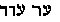, and  , OUR, OR, or ORA. The
same word is used at Exodus xxxiv. 30, 35, when the *skin* of Moses
"shone" (A. Wilder).

[459:\*](iu108.htm#fr_879) Here, again, the
"Masorah," by converting one name into another, has helped to falsify
the little that was left original in the primitive Scriptures.

[463:\*](iu108.htm#fr_880) Scorpio is the
astrological sign of the organs of reproduction.

[463:\*\*](iu108.htm#fr_881) The patriarchs are
all convertible in their numbers as well as interchangeable. According
to what they relate, they become ten, five, seven, twelve, and even
fourteen. The whole system is so complicated that it is an utter
impossibility in a work like this to do more than hint at certain
matters.

[464:\*](iu108.htm#fr_882) See vol. I. of the
present work, p. 32. Alone, the Hindu calculation by the Zodiac, can
give a key to the Hebrew chronologies and the ages of the patriarchs. If
we bear in mind that, according to the former astronomical and
chronological calculations, out of the fourteen manwantara (or divine
ages), each of which composed of *twelve* thousand years of the devas,
multiplied by seventy-one, forms *one period* of creation--not quite
*seven* are yet passed, the Hebrew calculation will become more clear.
To help, as much as possible, those who will be sure to get a good deal
bewildered in this calculation, we will remind the reader that the
Zodiac is divided into 360 degrees, and every sign into thirty degrees;
that in the Samaritan *Bible the age of Enoch is fixed at 360 years;*
that in "Manu," the divisions of time are given thus: "The day and the
night are composed of thirty *Mouhourta.* A mouhourta contains thirty
*kalas.* A month of the mortals is of thirty days, but it is but *one*
day of the pitris. . . . A year of the mortals is one day of the Devas."

[465:\*](iu108.htm#fr_883) See Rawlinson's
"Diagrams."

[465:\*\*](iu108.htm#fr_884) In the Brahmanical
Zodiac the signs are all presided over by and dedicated to one of the
twelve great gods. So, 1. Mecha (Aries) is dedicated to Varuna; 2.
Vricha (Taurus), to Yama; 3. Mithuna (Gemini), to Pavana; 4. Karcataca
(Cancer), to Surya; 5. Sinha (Leo), to Soma; 6. Kanya (Virgo), to
Kartikeia; 7. Toulha (Libra), to Kouvera; 8. Vristchica (Scorpio), to
Kama; 9. Dhanous (Sagittarius), to Ganesa; 10. Makara (Capricornus), to
Poulhar; 11. Kumbha (Aquarius), to Indra; and, 12. Minas (Pisces), to
Agni.

[465:\*\*\*](iu108.htm#fr_885) Moor's "Hindu
Pantheon," pp. 295-302.

[466:\*](iu108.htm#fr_886) Apollo was also
*Abelius,* or Bel.

[466:\*\*](iu108.htm#fr_887) Halal is a name of
Apollo. The name of Ma*halal*-Eliel would then be the autumnal sun, of
July, and this patriarch presides over *Leo* (July) the zodiacal sign.

[466:\*\*\*](iu108.htm#fr_888) See description
of the Sephiroth, in chapter iv.

[467:\*](iu108.htm#fr_889) How servile was this
Chaldean *copy* may be seen in comparing the Hindu chronology with that
of the Babylonians. According to Manu, the antediluvian dynasties of the
Pradjapatis reigned 4,320,000 human years, a whole divine age of the
devas in short, or that length of time which invariably occurs between
life on earth and the dissolution of that life, or pralaya. The
Chaldeans, in their turn, give precisely the same figures, minus *one*
cipher, to wit: they make their 120 saros yield a total of 432,000
years.

[467:\*\*](iu108.htm#fr_890) Eliphas Levi gives
it both in the Greek and Hebrew versions, but so condensed and
arbitrarily that it is impossible for one who knows less than himself to
understand him.

[468:\*](iu108.htm#fr_891) See Rabbi Simeon's
dissertation on the primitive Man-Bull and the horns. "Sohar."

[468:\*\*](iu108.htm#fr_892) "The Nuctameron of
the Hebrews"; see Eliphas Levi, vol. ii.

[469:\*](iu108.htm#fr_893) "Auszuge aus dem
Sohar," p. 13, 15.

[469:\*\*](iu108.htm#fr_894) Such is the
opinion of the erudite Dr. Jost and Donaldson. "The Old Testament. p. 470 Books, as we now find them, seem to have
been concluded about 150 years B.C. . . . The Jews now sought the other
books, which had been dispersed during the wars, and brought them into
one collection" (Ghillany: "Menschenopfer der Hebraer," p. 1). "Sod, the
Son of the Man." Appendix.

[470:\*](iu108.htm#fr_895) "Jost," vol. i., p.
51.

[470:\*\*](iu108.htm#fr_896) Burder's
"Josephus," vol. ii., pp. 331-335.

[470:\*\*\*](iu108.htm#fr_897) "Die Kabbala,"
p. 95.

[470:\*\*\*\*](iu108.htm#fr_898) Gaffarel:
Introduction to "Book of Enoch."

------------------------------------------------------------------------

[Next: Chapter X](iu109)
