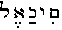

##### fThe Secret Doctrine by H. P. Blavatsky -- Vol. 1

------------------------------------------------------------------------

###### \[\[Vol. 1, Page\]\] 445 GOD IS OUR HIGHER SELF.

\[\[This page continued from [previous section](sd1-2-12)\]\]

#### § XIII. THE SEVEN CREATIONS.

"**T**HERE was neither day nor night, nor sky nor earth, nor darkness
nor light, nor any other thing save only ONE, unapprehensible by
intellect, or THAT which is Brahma and Pumis (Spirit) and Pradhana
(crude matter)" (*Veda:* "*Vishnu Purana Commentary*"); or literally:
"One Pradhanika Brahma Spirit: THAT was." The "Pradhanika Brahma Spirit"
is Mulaprakriti and Parabrahmam.

In Vishnu Purana, Parasara says to Maitreya, his pupil: -- "I have thus
explained to you, excellent Muni, six creations. . . . the creation of
the Arvaksrotas beings was the seventh, and was that of man." Then he
proceeds to speak of two additional and very mysterious creations,
variously interpreted by the commentators.

Origen, commenting upon the books written by Celsus, his opponent --
books which were all destroyed by the prudent Church Fathers --
evidently answers the objections of his contradictor and reveals his
system at the same time. This was evidently *septenary.* But his
theogony, the genesis of the stars or planets, that of sound and colour,
all found as an answer satire, and no better. Celsus, you see, "desiring
to exhibit his learning," speaks of a ladder of creation with *seven
gates*, and on the top

------------------------------------------------------------------------

###### \[\[Vol. 1, Page\]\] 446 THE SECRET DOCTRINE.

of it the eighth -- ever closed. The mysteries of the Persian Mithras
are explained and "musical reasons, moreover, are added." . . . . And to
these again he strives "to add a second explanation connected also with
musical considerations,"\* -- *i.e.*, with the seven notes of the scale,
the Seven Spirits of the Stars, &c., &c.

Valentinus expatiates upon the power of the great *Seven*, who were
called to bring forth this universe after *Ar*(*r*)*hetos*, or the
Ineffable, whose name is composed of seven letters, had represented the
first *hebdomad.* This name (Ar(r)hetos) is one to indicate the
Sevenfold nature of the One (the *logos*)*.* "The goddess Rhea," says
Proclus in *Timaeus* (p. 121), "is a Monad, Duad, and Heptad,"
comprehending in herself all the *Titanidae*, "who are seven."

The *Seven Creations* are found in almost every Purana. They are all
preceded by what Wilson translates -- "the indiscrete Principle,"
absolute Spirit independent of any relation with objects of sense. They
are -- (1) *Mahattattwa*, the Universal Soul, Infinite Intellect, or
Divine Mind; (2) *Bhuta* or *Bhutasarga*, elemental creation, the first
differentiation of Universal indiscrete Substance; (3) *Indriya* or
*Aindriyaka*, organic evolution. "These three were the Prakrita
creations, the *developments of indiscrete nature* preceded by
indiscrete principle"; (4) *Mukhya*, the fundamental creation of
perceptible things, was that of inanimate bodies\*\*; (5)
*Tairyagyonya*, or *Tiryaksrotas*, was that of animals; (6)
*Urdhwasrotas*, or that of divinities\*\*\* (?); (7) *Arvaksrotas*, was
that of man. (*See Vishnu Purana.*)

This is the order given in the *exoteric* texts. According to esoteric
teaching there are seven primary, and seven secondary "creations;" the
former being the Forces *self-evolving* from the one *causeless* FORCE;
the latter, showing the manifested Universe emanating from the already
differentiated *divine* elements.

Esoterically, as well as exoterically, all the above enumerated
Creations stand for the (7) periods of Evolution, whether after an "Age"
or a "Day" of Brahma. This is the teaching *par excellence* of Occult
Philosophy, which, however, never uses the term "creation," nor even
that of evolution, "with regard to *primary* 'Creation':" but calls all
such *forces* "the *aspects* of the Causeless Force." In the Bible

###### \[\[Footnote(s)\]\] -------------------------------------------------

\* Origen *contra* Celsum, b. vi., chap. xxii.

\*\* The text says: "And the fourth creation is *here* the primary, for
*things* immovable are emphatically known as primary." (*See Fitzedward
Hall*'*s Corrections.*)

\*\*\* How can "divinities" have been created *after* the animals? The
esoteric meaning of the expression "animals" is the *germs of all
animal* *life* including man. Man is called a *sacrificial animal*, and
an animal that is the only one among animal creation who sacrifices to
the gods. *Moreover*, by the "sacred animals," the 12 signs of the
zodiac are often meant in the sacred texts, as already stated.

------------------------------------------------------------------------

###### \[\[Vol. 1, Page\]\] 447 THE ORDER OF THE EVOLUTION.

the seven periods are dwarfed into the six days of creation and the
seventh *day* of rest, and the Westerns adhere to the letter. In the
Hindu philosophy, when the active Creator has produced the world of
gods, the *germs* of all the undifferentiated elements and the rudiments
of future senses (the world of noumena, in short), the Universe remains
unaltered for a "Day of Brahma," a period of 4,320,000,000 years. This
is the *seventh* passive period or the "Sabbath day" of Eastern
philosophy, that follows six periods of active evolution. In the
*Satapatha Brahmana* "Brahma" (neuter), the *absolute Cause* of all
Causes, *radiates* the gods. Having radiated the gods (through its
inherent nature) the work is interrupted. In the 1st Book of Manu it is
said, "At the expiration of each night (pralaya) Brahma, having been
asleep, awakes, and, *through the sole energy of the motion*, CAUSES to
emanate from *itself* the spirit, which in its essence is, and yet is
not."

In the *Sepher Jezirah*, the Kabalistic Book of Creation, the author has
evidently repeated the words of Manu. In it the Divine Substance is
represented as having alone existed from the eternity, boundless and
absolute; and as having emitted from itself the Spirit. "One is the
Spirit of the living God, blessed be his Name, who liveth for ever!
Voice, Spirit, and Word, this is the Holy Spirit." (*Sepher Jezireh*,
*chap.* 1, *Mishna IX.*) And this is the Kabalistic abstract Trinity, so
unceremoniously anthropomorphized by the Fathers. From this triple ONE
emanated the whole Kosmos. First from ONE emanated number TWO, or Air,
the creative element; and then number THREE, *Water*, proceeded from the
air; *Ether* or *Fire* complete the mystic four, the Arba-il. (Ibid.) In
the Eastern doctrine Fire is the first Element -- *Ether*, synthesizing
the whole (since it contains all of them).

In the *Vishnu Purana*, the whole seven periods are given, and the
progressive Evolution of "Spirit-Soul," and of the seven forms of matter
(or principles) are shown. It is impossible to enumerate them in this
work. The reader is asked to peruse one of the Puranas.

"R. Yehudah began, it is written: 'Elohim said: Let there be a
firmament, in the midst of waters. . . . . At the time that the Holy . .
. created the world, He (they) created seven heavens Above. He created
seven earths Below, seven seas, seven days, seven rivers, seven weeks,
seven years, seven times, and 7,000 years that the world has been. . . .
. the seventh of all the millennium. So here are seven earths Below,
they are all inhabited except those which are above, and those . . . .
below. And . . . . between each earth, a heaven (firmament) is spread
out between each other. . . . . And there are in them (these earths)
creatures who look different from each other . . . . but if you object
and say that all the children of the world came out from Adam,

------------------------------------------------------------------------

###### \[\[Vol. 1, Page\]\] 448 THE SECRET DOCTRINE.

it is not so. . . . . And the lower earths, where do they come from?
They are *from the chain of the earth*, and from the heaven below,"
etc., etc.\*

Irenaeus is our witness (and a very unwilling one, too) that the
Gnostics taught the same system, veiling very carefully the true
esoteric meaning. This "veiling," however, is identical with that of the
Vishnu Purana and others. Thus Irenaeus writes of the Marcosians: "They
maintain that first of all the four elements, fire, water, earth and
air, were produced after the image of the primary *tetrad* above, and
that then if we add their operations, namely, heat, cold, dryness and
moisture, an exact likeness of the ogdoad is presented." (B. i. ch.
xvii.)

Only this "likeness" and the *ogdoad* itself is a blind, just as in the
seven creations of the Vishnu Puranas, to which two more are added of
which the eighth, termed Anugraha, "possesses both the qualities of
goodness and darkness," a Sankhyan more than a Puranic idea. For
Irenaeus says again (b. I. xxx. 6) that "they (the Gnostics) had a like
eighth creation which was good and bad, divine and human. They affirm
that man was formed *on the eighth day*. Sometimes they affirm that he
was made on the *sixth day*, and at others on the eighth; unless,
perchance, they mean that his earthly part was formed on the sixth day
and his fleshly part (?) on the eighth day; these two being
distinguished by them."

They were so "distinguished," but not as Irenaeus gives it. The Gnostics
had a superior *Hebdomad*, and an inferior one, in Heaven; and a third
terrestrial *Hebdomad*, on the plane of matter. **I**AO, the mystery god
and the Regent of the Moon, as given in Origen's chart, was the chief of
these superior "*Seven Heavens*,"\*\* hence identical with the chief of
the lunar Pitris, that name being given by them to the lunar
Dhyan-Chohans. "They affirm that these seven heavens are intelligent,
and *speak of them as being angels*," writes the same Irenaeus; and adds
that on this account they termed Iao Hebdomas, while his mother was
called "*Ogdoas*," because, as he explains, "she preserved the number of
*the first begotten and primary Ogdoad of the Pleroma.*" (Ibid. b. I, v.
2).

This "first begotten *Ogdoad*" was (*a*) in theogony the *second Logos*
(the manifested) because he was born of the Seven-fold *first Logos*,
hence he is the eighth on this manifested plane; and (*b*) in
astrolatry, it was the *Sun*, Marttanda -- the eighth son of Aditi, whom
she rejects while preserving her Seven Sons, *the planets.* For the
ancients have never regarded the Sun as a planet, but *as a central and
fixed Star.* This, then, is the second Hebdomad born of the
*Seven-rayed* one, Agni, the Sun

###### \[\[Footnote(s)\]\] -------------------------------------------------

\* Qabbalah, p. 415-16, by T. Myer, Philadelphia.

\*\* Superior to the Spirits or "Heavens" of the Earth only.

------------------------------------------------------------------------

###### \[\[Vol. 1, Page\]\] 449 THE SIX STELLAR GODS.

and what not, only not the seven planets, which are Surya's *brothers*,
not his *Sons.* These *Astral* gods, whose chief with the Gnostics was
Ildabaoth\* (from *Ilda* "child," and *Baoth* "the egg"), the son of
Sophia Achamoth, the daughter of Sophia (Wisdom), whose region is the
Pleroma, were his (Ildabaoth's) sons. He produces from himself these six
stellar spirits: *Jove* (Jehovah), *Sabaoth*, *Adonai*, *Eloi*,
*Osraios*, *Astaphaios*,*\*\** and it is they who are the second, or
inferior *Hebdomad.* As to the third, it is composed of the seven
primeval men, the shadows of the lunar gods, projected by the first
Hebdomad. In this the Gnostics did not, as seen, differ much from the
esoteric doctrine except that they veiled it. As to the charge made by
Irenaeus, who was evidently ignorant of the true tenets of the
"Heretics," with regard to man being created on the *sixth* day, and man
being created on the *eighth*, this relates to the mysteries of the
*inner* man. It will become comprehensible to the reader only after he
has read Book II., and understood well the *Anthropogenesis* of the
Esoteric doctrine.

Ildabaoth is a copy of Manu. The latter boasts, "Oh, best of twice-born
men! Know that I (Manu) am he, the creator of all this world, whom that
male Viraj . . . spontaneously produced" (I., 33). He first creates the
ten lords of Being, the Prajapatis, who, as verse 36 says . . . "produce
seven other Manus." (*The Ordinances of Manu.*) Ildabaoth does likewise:
"I am Father and God, and there is no one above me," he exclaims. For
which his mother coolly puts him down by saying, "Do not lie, Ildabaoth,
for the father of all, the *first* man (*Anthropos*) *is above thee*,
*and so is Anthropos*, *the Son of Anthropos*" (Irenaeus, b. I, ch.
xxx., 6). This is a good proof that there were three Logoi (besides the
Seven born of the First), one of these being the *Solar Logos.* And,
again, who was that "Anthropos" himself, so much higher than Ildabaoth?
The Gnostic records alone can solve this riddle. In *Pistis Sophia* the
four-vowelled name **I**EOV is in each case accompanied by the epithet
of "the Primal, or First man." This shows again that the gnosis was but
an echo of our archaic doctrine. The names answering to Parabrahm, to
Brahm, and Manu (the first *thinking* man) are composed of one-vowelled,
three-vowelled and seven-vowelled sounds. Marcus, whose philosophy was
certainly more Pythagorean than anything else, speaks of a revelation to
him of the seven heavens sounding each one vowel as they pronounced the
seven names of the seven (angelic) hierarchies.

When spirit has permeated every minutest atom of the seven principles of
Kosmos, then the *secondary* creation, after the above-mentioned period
of rest, begins.

###### \[\[Footnote(s)\]\] -------------------------------------------------

\* See "Isis Unveiled," Vol. II., p. 183.

\*\* See also King's *Gnostics.* Other sects regarded Jehovah as
Ildabaoth himself King identifies him with Saturn.

------------------------------------------------------------------------

###### \[\[Vol. 1, Page\]\] 450 THE SECRET DOCTRINE.

"The creators (Elohim) outline in the *second* 'hour' the shape of man,"
says Rabbi Simeon (*The Nuctameron of the Hebrews*)*.* "There are twelve
hours in the day," says the *Mishna*, "and it is during these that
creation is accomplished." The "twelve hours of the day" are again the
dwarfed copy, the faint, yet faithful, echo of primitive Wisdom. They
are like the 12,000 divine years of the gods, a cyclic blind. Every "Day
of Brahma" has 14 Manus, which the Hebrew Kabalists, following, however,
in this the Chaldeans, have disguised into 12 "Hours."\* The
*Nuctameron* of Apollonius of Tyana is the same thing. "The Dodecahedron
lies concealed in the perfect Cube," say the Kabalists. The mystic
meaning of this is, that the twelve great transformations of Spirit into
matter (the 12,000 divine years) take place during the four great ages,
or the first *Mahayuga.* Beginning with the metaphysical and the
supra-human, it ends in the physical and purely human natures of Kosmos
and man. Eastern philosophy can give the number of mortal years that run
along the line of spiritual and physical evolutions of the seen and the
unseen, if Western science fails to do so.

*Primary* Creation is called the *Creation of Light* (Spirit); and the
*Secondary* -- that of Darkness (matter).\*\* Both are found in
*Genesis*, chap. i., v. 2, and at the beginning of chapter ii. The first
is the emanation of *self*-born gods (Elohim); the second of physical
nature.

This is why it is said in the Zohar: -- "Oh, companions, companions, man
as emanation was both man and woman; as well on the side of the
**F**ATHER as on the side of the **M**OTHER. And this is the sense of
the words: -- And Elohim spoke: 'Let there be Light and it was Light!' .
. . And this is the 'two-fold man'" Light, moreover, on our plane, is
*darkness* in the higher spheres.

"Man and woman on the side of the FATHER" (Spirit) refers to Primary
Creation; and on the side of the *Mother* (matter) to the secondary. The
two-fold man is Adam Kadmon, the male and female abstract prototype and
the *differentiated* Elohim*. Man* proceeds from the Dhyan Chohan, and
is a "Fallen Angel," a god in exile, as will be shown.

In India these creations were described as follows: --

(I.) Mahat-tattwa creation -- so-called because it was the primordial
self-evolution of that which had to become *Mahat* -- the "divine
**M**IND, conscious and intelligent"; esoterically, "the *spirit* of the
Universal soul." . . . "Worthiest of ascetics, through its potency (*the
potency of that cause*); every *produced* cause comes by its proper
nature." (*Vishnu Purana.*) "Seeing that the potencies of all beings are
under-

###### \[\[Footnote(s)\]\] -------------------------------------------------

\* Elsewhere, however, the identity is revealed. *See supra*, the
quotation from Ibn-Gabirol and his 7 heavens, 7 earths, etc.

\*\* This must not be confused with *precosmic* "**D**ARKNESS," the
Divine ALL.

------------------------------------------------------------------------

###### \[\[Vol. 1, Page\]\] 451 MANY VERSIONS OF THE ONE TRUTH.

stood *only* through the knowledge of *That* (Brahma), which is beyond
reasoning, creation, and the like, such potencies are referable to
Brahma." **T**HAT, then, precedes the manifestation. "The first was
*Mahat*," says *Linga Purana;* for the ONE (the *That*) is neither
*first* nor *last*, but ALL. Exoterically, however, this manifestation
is the *work* of the "Supreme One" (a natural *effect*, rather, of an
Eternal Cause); or, as the Commentator says, it might have been
understood to mean that Brahma was then *created* (?), being identified
with Mahat, active intelligence or the operating will of the Supreme.
Esoteric philosophy renders it "the operating LAW."

It is on the right comprehension of this tenet in the Brahmanas and
Puranas that hangs, we believe, the apple of discord between the three
Vedantin Sects: the Advaita, Dwaita, and the Visishtadvaitas. The first
arguing rightly that Parabrahman, having no relation, as the absolute
*all*, to the manifested world -- the Infinite having no connection with
the finite -- can neither *will* nor *create;* that, therefore, Brahma,
Mahat, Iswara, or whatever name the creative power may be known by,
creative gods and all, are simply an illusive aspect of Parabrahmam in
the conception of the conceivers; while the other sects identify the
impersonal Cause with the Creator, or Iswara.

*Mahat* (or Maha-Buddhi) is, with the Vaishnavas, however, divine mind
*in active operation*, or, as Anaxagoras has it, "an ordering and
disposing mind, which was the cause of all things," -- \[\[*Nous o
diakosmonte kai panton aitios*\]\].

Wilson saw at a glance the suggestive connection between *Mahat* and the
Phoenician Mot, or *Mut*, who was female with the Egyptians -- the
Goddess Mout, the "Mother" -- "which, like Mahat," he says, "was the
first product of the mixture (?) of Spirit and matter, and the first
rudiment of Creation": "Ex connexione autem ejus spiritus prodidit Mot .
. . . . From whose seed were created all living things" -- repeats
Brucker (I., 240) -- giving it a still more materialistic and
anthropomorphic colouring.

Nevertheless, the esoteric sense of the doctrine is seen through every
exoteric sentence on the very face of the old Sanscrit texts that treat
of primordial Creation. "The Supreme Soul, the *all permeant* (Sarvaga)
Substance of the World, having entered (*been drawn*) into matter
(prakriti) and Spirit (purusha), *agitated* the *mutable and the
immutable principles* the season of Creation (manvantara) having
arrived."\* . . .

###### \[\[Footnote(s)\]\] -------------------------------------------------

\* The *nous* of the Greeks, which is (spiritual or divine) mind, or
*mens*, "Mahat," operates upon matter in the same way; it "enters into"
and *agitates* it:

> "Spiritus intus alit, totamque infusa per artus,  
> Mens agitat molem, et magno se corpore miscet."

In the Phoenician Cosmogony, "Spirit mixing with its own principles
gives rise to \[\[Footnote continued on next page\]\]

------------------------------------------------------------------------

###### \[\[Vol. 1, Page\]\] 452 THE SECRET DOCTRINE.

Esoteric doctrine teaches that the Dhyan Chohans are the collective
aggregate of divine Intelligence or primordial *mind*, and that the
first Manus -- the seven "mind-born" Spiritual Intelligences -- are
identical with the former. Hence the "Kwan-shi-yin" -- "the golden
Dragon in whom are the seven," of Stanza III. -- is the primordial
Logos, or Brahma, the first manifested creative Power; and the
Dhyani-Energies are the Manus, or *Manu-Swayambhuva collectively.* The
direct connection, moreover, between the "Manus" and "Mahat" is easy to
see. *Manu* is from the root *man*, "to think"; and thinking proceeds
from the mind. It is, in Cosmogony, the pre-nebular period.

(II.) "The *second* Creation," "Bhuta," was of the rudimental principles
(Tanmatras), thence termed the elemental creation (*Bhuta-sarga*)*.\**
It is the period of the first breath of the differentiation of the
*pre-Cosmic* Elements or matter. *Bhutadi* means literally "the origin
of the Elements," and precedes *Bhuta-sarga* -- the "creation" or
differentiation of those Elements in primordial "Akasa" (Chaos or
Vacuity).\*\* In the "Vishnu Purana" it is said to proceed along, and
belong to, the triple aspect of *Ahankara*, translated Egotism, but
meaning rather that untranslateable term the "**I**-AM-NESS," that which
first issues from "Mahat," or divine mind; the first shadowy outline of
Self-hood, for "pure" Ahankara becomes "passionate" and finally
"rudimental"

###### \[\[Footnote(s)\]\] -------------------------------------------------

\[\[Footnote continued from previous page\]\] creation" also;
(*Brucker*, I., 240); the Orphic triad shows an identical doctrine: for
there *Phanes* (or Eros), *Chaos*, containing crude *undifferentiated*
Cosmic matter, and *Chronos* (time), are the three co-operating
principles, emanating from the Unknowable and concealed *point*, which
produce the work of "Creation." And they are the Hindu *Purusha*
(phanes), *Pradhana* (chaos), and *Kala* (Chronos) or *time.* The good
Professor Wilson does not like the idea, as no Christian clergyman,
however liberal, would. He remarks that "as presently explained,. the
*mixture* (of the *Supreme* Spirit or Soul) *is not mechanical;* it is
*an influence or effect exerted upon intermediate agents* which produce
effects." The sentence in *Vishnu Purana:* "As fragrance affects the
mind from its proximity merely, *and not from any immediate operation
upon mind itself*, so the Supreme influenced the elements of creation,"
the reverend and erudite Sanscritist correctly explains . . . : "As
perfumes do not delight the mind by actual contact, but by the
impression they make upon the sense of smelling, which communicates it
to the mind," adding: "The entrance of the *Supreme* into spirit, as
well as matter, *is less intelligible* than the view elsewhere taken of
it, as the *infusion* of spirit, identified with the supreme, into
Prakriti or matter alone." He prefers the verse in *Padma Purana:* "He
who is called the *male* (spirit) of Prakriti . . . that same divine
Vishnu entered into Prakriti." This "view" is certainly more akin to the
plastic character of certain verses in the Bible concerning the
Patriarchs, such as Lot (*Gen. xix.*, 34-38) and even Adam (*iv*., *v.*
1), and others of a still more anthropomorphic nature. But it is just
that which led Humanity to *Phallicism*, Christian religion being
honeycombed with it, from the first chapter of *Genesis* down to the
*Revelation.*

\* All these sentences are quoted from "Vishnu Purana," Book I., ch. v.

\*\* Vishnu is both Bhutesa, "Lord of the Elements, and all things," and
*Viswarupa*, "Universal Substance or Soul."

------------------------------------------------------------------------

###### \[\[Vol. 1, Page\]\] 453 THE SEVEN CREATIONS.

(initial); it is "the origin of conscious as of all *unconscious*
being," though the Esoteric school rejects the idea of anything being
"unconscious" -- save on this (our) plane of illusion and ignorance. At
this stage of the Second Creation, the second hierarchy of the Manus
appear, the Dhyan Chohans or Devas, who are the origin of Form (rupa):
the *Chitrasikhandina* (bright-crested) or the *Riksha* -- those Rishis
who have become the informing souls of the seven stars (of the Great
Bear).\* In astronomical and Cosmogonical language this Creation relates
to the first stage of Cosmic-life, the *Fire-Mist* Period after its
Chaotic stage,\*\* when atoms issue from *Laya.*

(III.) The third (the *Indriya*) was the modified form of *Ahankara*,
the conception of "I," (from "*Aham*," "I") termed the organic Creation,
or creation of the senses (*Aindriyaka*)*.* "These three were the
Prakrita creation, the (discrete) developments of indiscrete nature
preceded by the indiscrete principle." "Preceded by," ought to be
replaced here with "beginning by," Buddhi; for the latter is neither a
discrete nor an *indiscrete quantity*, but partakes of the nature of
both, in man as in Kosmos: a unit -- a human MONAD on the plane of
illusion -- when once freed from the three forms of Ahankara and
liberated from its terrestrial manas, Buddhi becomes truly a continued
quantity, both in duration and extension, because eternal and immortal.
Earlier it is stated, that the *third* Creation "abounding with the
quality of goodness, is termed *Urdhvasrotas*"; and a page or two
further the *Urdhvasrotas* creation is referred to as "the sixth
creation . . . that of the divinities" (p. 75). This shows plainly that
earlier as well as later manvantaras have been purposely confused, to
prevent the pro-

###### \[\[Footnote(s)\]\] -------------------------------------------------

\* See concerning their *post-types*, the Treatise written by Trithemius
(Agrippa's master, 16th cent.). "Concerning the seven secondaries, or
Spiritual Intelligences, who, after God, actuate the Universe;" giving
out, besides secret cycles and several prophecies, certain facts and
beliefs about the Genii, or the Elohim, which preside over and guide the
septenary stages of the World's Course.

\*\* From the first, the Orientalists have found themselves beset by
great difficulties with regard to any possible order in the Puranic
*Creations.* Brahma is very often confused with Brahm, by Wilson, for
which he is criticised by his successors. The "*Original Sanscrit
Texts*" are preferred by Mr. Fitzedward Hall for the translation of
*Vishnu Purana* and texts, to those used by Wilson. "Had Professor
Wilson enjoyed the advantages which are now at the command of the
student of Indian philosophy, unquestionably he would have expressed
himself differently," as said by the editor of his works. This reminds
one of the answer given by one of Thomas Taylor's admirers to those
scholars who criticised his translations of Plato. "Thomas Taylor may
have had less knowledge of the Greek than his critics have, but he
understood Plato far better than they do," he said. Our present
Orientalists disfigure the *mystic* sense of the Sanskrit texts far more
than Wilson ever did, though the latter is undeniably guilty of very
gross errors.

------------------------------------------------------------------------

###### \[\[Vol. 1, Page\]\] 454 THE SECRET DOCTRINE.

fane from perceiving the truth. This is called "incongruity" and
"contradictions" by the Orientalists.\*

This "creation" of the immortals, the "*Deva-Sarga*," is the last of the
first series, and has a universal reference; namely, to Evolutions in
general, not specifically to our *Manvantara*; but the latter begins
with the same over and over again, showing that it refers to several
distinct Kalpas. For it is said "at the close of the past (*Padma*)
Kalpa the divine Brahma awoke from his night of sleep and beheld the
universe void." Then Brahma is shown going once more over the "seven
creations" in the secondary stage of evolution, repeating the first
three on the objective plane.

(IV.) The *Mukhya*, the Primary as it begins the series of four. Neither
the word "inanimate" bodies nor yet *immovable* things, as translated by
Wilson, gives a correct idea of the Sanskrit terms used. Esoteric
philosophy is not the only one to reject the idea of any atom being
*inorganic*, for it is found also in orthodox Hinduism. Moreover, Wilson
himself says (*in his collected Works*, *vol. iii.*, *p.* 381): "All the
Hindu systems consider vegetable bodies as endowed with life . . . "
*Charachara*, or the synonymous *sthavara* and *jangama*, is, therefore,
inaccurately rendered by "animate and inanimate," "sentient beings," and
"unconscious," or "conscious and unconscious beings," etc., etc.
"Locomotive and fixed" would be better, since trees are considered to
possess souls." *Mukhya* is the "creation" or organic evolution of the
vegetable kingdom. In this *secondary* Period, the three degrees of
Elemental or Rudimental Kingdoms are evolved in this world,
corresponding *inversely* in order to the three Prakritic creations
during the Primary period of Brahma's activity. As in that period, in
the words of "Vishnu Purana": "The first creation was that of *Mahat*
(Intellect), the second, of *Tanmatras* (rudimental principles), and the
third, that of the senses (Aindriyaka)"; in this one, the order of the
Elemental Forces stands thus: (1) The *nascent* centres of Force
(intellectual and physical); (2) the rudimental principles -- *nerve
force*, so to say; and (3) nascent *apperception*, which is the *Mahat*
of the lower kingdoms, especially developed in the third order of
Elementals; these are succeeded by the

###### \[\[Footnote(s)\]\] -------------------------------------------------

\* "The three Creations beginning with Intelligence are elemental, but
the six creations which proceed from the series of which Intellect is
the first are the work of Brahma" (*Vayu-Purana*). Here "creations" mean
everywhere *stages* of Evolution. *Mahat*, "Intellect" or *mind* (which
corresponds with Manas, the former being on the Cosmic, and the latter
on the human plane) stands here, too, lower than *Buddhi* or
Supra-divine Intelligence. Therefore, when we read in *Linga Purana*
that "the first Creation was that of Mahat, Intellect being the first in
manifestation," we must refer that (specified) creation to the first
evolution of our system or even our Earth, none of the preceding ones
being discussed in the *Puranas*, but only occasionally hinted at.

------------------------------------------------------------------------

###### \[\[Vol. 1, Page\]\] 455 CREATIONS CONTINUED.

objective kingdom of minerals, in which latter that apperception is
entirely latent, to re-develop only in the plants). The *mukhya*
"Creation," then, is the middle point between the three lower and the
three higher kingdoms, which represent the seven esoteric kingdoms of
Kosmos, as of Earth.

(V.) The *Tiryaksrotas* (or Tairyagyonya) creation,\* that of the
"(*sacred*) animals," corresponding only on Earth, to the dumb animal
creation. That which is meant by "animals," in *primary* Creation, is
the germ of awakening consciousness or of *apperception*, that which is
faintly traceable in some sensitive plants on Earth and more distinctly
in the *protistic* monera.\*\* On our globe, during the first round,
animal "creation" precedes that of man, while the former (or mammal)
evolves from the latter in our fourth round -- on the physical plane: in
Round I. the animal atoms are drawn into a cohesion of human physical
form; while in Round IV. the reverse occurs according to magnetic
conditions developed during life. And this is *metempsychosis* (*See*
"*Mineral Monad*" *in* "*Five Years of Theosophy*," *p.* 276). This
fifth stage of evolution, called exoterically "Creation," may be viewed
in both the *Primary* and *Secondary* periods, one as the Spiritual and
Cosmic, the other as the material and *terrestrial.* It is
*Archibiosis*, or life-origination -- "origination," so far, of course,
as the *manifestation* of life on all the seven planes is concerned. It
is at this period of Evolution that the *absolutely eternal* universal
motion, or vibration, that which is called in Esoteric language "the
GREAT BREATH," differentiates in the primordial, first manifested ATOM.
More and more, as chemical and physical sciences progress, does this
occult axiom find its corroboration in the world of knowledge: the
scientific hypothesis, that even the simplest elements of matter are
identical in nature and differ from each other only owing to the variety
of the distributions of *atoms* in the molecule or speck of substance,
or by the modes of its *atomic vibration*, gains every day more ground.

Thus, as the differentiation of the primordial germ of life has to
precede the evolution of the Dhyan Chohan of *the third* group or
hierarchy of Being in Primary Creation, before those "gods" can become
rupa (embodied in their first ethereal form), so animal creation has to
*precede*,

###### \[\[Footnote(s)\]\] -------------------------------------------------

\* Professor Wilson translates it, as though animals were higher on the
scale of "creation" than divinities, or angels, although the truth about
the devas is very plainly stated further on. This "creation," says the
text, is both primary (*Prakrita*) and secondary (*Vaikrita*)*.* It is
the latter, as regards the origin of the gods from Brahma (the
*personal* anthropomorphic *creator* of our material universe); it is
the former (*primary*) as affecting Rudra, who is the immediate
production of the first principle. Rudra is not alone a title of Siva,
but embraces agents of creation, angels and men, as will be shown
further on.

\*\* Neither plant nor animal, but an existence between the two.

------------------------------------------------------------------------

###### \[\[Vol. 1, Page\]\] 456 THE SECRET DOCTRINE.

for that same reason, *divine* MAN on earth. And this is why we find in
the Puranas: "The fifth, the Tairyagyonya creation, was that of animals,
and --

(VI). The Urdhvasrotas creation, or that of divinities (*Vishnu Purana
Book I. chap. i.*)*.* But these (divinities) are simply the prototypes
of the First Race, the fathers of their "mind-born" progeny with the
*soft* bones.\* It is these who became the *Evolvers* of the
"Sweat-born" -- an expression explained in Book II. Finally, the sixth
"Creation" is followed, and "*Creation* in general, closed by --

(VII.) The evolution of the "*Arvaksrotas* beings, which was the
seventh, and was that of man" (*Vishnu Purana*, *Book I.*)*.*

The "eighth creation" mentioned is no *Creation* at all; it is a *blind*
again, for it refers to a purely mental process: the cognition of the
"ninth" creation, which, in its turn, is an effect, manifesting in the
*secondary* of that which was a "Creation" in the *Primary* (*Prakrita*)
Creation.\*\* The *Eighth*, then, called *Anugraha* (the *Pratyayasarga*
or the *intellectual* creation of the Sankhyas, explained in *Karika*,
v. 46, p. 146), is "that creation of which *we have a perception*" -- in
its esoteric aspect -- and "to which we give intellectual assent
(Anugraha) in contradistinction to *organic creation.*" It is the
correct perception of our relations to the whole range of "gods" and
especially of those we bear to the *Kumaras* -- the so-called "Ninth
Creation" -- which is in reality an aspect of or reflection of the sixth
in our manvantara (the Vaivasvata). "There is a *ninth*, the Kumara
Creation, which is both primary and secondary," says *Vishnu Purana*,
the oldest of such texts.\*\*\* "The *Kumaras*," explains an *esoteric*
text,

###### \[\[Footnote(s)\]\] -------------------------------------------------

\* "Created beings" -- explains *Vishnu Purana* -- "although they are
destroyed (in their individual forms) at the periods of dissolution, yet
being affected by the good or evil acts of former *existences*, are
never exempted from their consequences. And when Brahma produces the
world anew, they are the progeny of his will . . ." "*Collecting his
mind into itself* (*Yoga* willing), Brahma creates the four orders of
beings, termed gods, demons, *progenitors*, and *MEN*" *.* . .
"progenitors" meaning the prototypes and Evolvers of the first Root Race
of men. The progenitors are the Pitris, and are of seven classes. They
are said in *exoteric* mythology to be born of *Brahma*'*s side*, like
Eve from the rib of Adam.

\*\* "These notions," remarks Dr. Wilson, "the birth of Rudra and the
saints, seem to have been *borrowed* from the Saivas, and to have been
awkwardly engrafted upon the Vaishnava system." The esoteric meaning
ought to have been consulted before venturing such a hypothesis.

\*\*\* Parasara, the Vedic Rishi, who received the Vishnu Purana from
Pulastya and taught it to Maitreya, is placed by the Orientalists at
various epochs. As correctly observed, in the *Hindu Class. Dict:* --
"Speculations as to his era differ widely from 575 **B.C.** to 1391
**B.C**., and *cannot be trusted.*" Quite so; but no less, however, than
any other date as assigned by the Sanskritists, so famous in this
department of arbitrary fancy.

------------------------------------------------------------------------

###### \[\[Vol. 1, Page\]\] 457 WHO THE KUMARAS ARE.

"are the Dhyanis, derived immediately from the supreme Principle, who
reappear in the Vaivasvata Manu period, for the progress of mankind."\*
The commentator of the *Vishnu Purana* corroborates it, by remarking
that "these *sages* live as long as Brahma; and they are only created by
him in the *first* Kalpa, although their generation is very commonly and
inconsistently introduced in the *Varaha*, or *Padma* Kalpa" (the
secondary). Thus, the Kumaras are, exoterically, "the creation of Rudra
or Nilalohita, a form of Siva, by Brahma, and of certain other mind-born
sons of Brahma. But, in the esoteric teaching, they are the progenitors
of the true spiritual SELF in the physical man -- the higher Prajapati,
while the Pitris, or lower Prajapati, are no more than the *fathers* of
the model, or type of his physical form, made "in *their* image." Four
(and occasionally *five*) are mentioned freely in the exoteric texts,
three Kumaras being secret.\*\* (Compare what is said of "The Fallen
Angels" in Book II.).

The Exoteric four are: Sanat-Kumara, Sananda, Sanaka, and Sanatana; and
the esoteric three are: Sana, Kapila, and Sanat-sujata. Special
attention is once more drawn to this class of Dhyan Chohans, for herein
lies the mystery of generation and heredity hinted at in Book I. (*See
the four Orders of Angelic Beings; Comment on Stanza VII.*)*.* Book II.
explains their position in the divine Hierarchy. Meanwhile, let us see
what the *exoteric* texts say about them.

They do not say much; nothing to him who fails to read between the
lines. "We must have recourse, here, to other Puranas for the
elucidation of this term," remarks Wilson, who does not suspect for one
moment that he is in the presence of the "Angels of Darkness," the
mythical "great enemy" of his Church. Therefore, he contrives to
*elucidate* no more than that these (divinities) DECLINING TO CREATE
PROGENY\*\*\* (and thus rebelling against Brahma), remained, as the name

###### \[\[Footnote(s)\]\] -------------------------------------------------

\* They may indeed mark a "special" or extra *creation*, since it is
they who, by incarnating themselves within the senseless human shells of
the two first Root-races, and a great portion of the Third Root-race --
create, so to speak, a *new race:* that of thinking, self-conscious and
*divine* men.

\*\* "The four Kumaras (are) the mind-born Sons of Brahma. Some *specify
seven*" (*H. Class. Dict.*)*.* All these seven Vaidhatra, the patronymic
of the Kumaras, "the Maker's Sons," are mentioned and described in
Iswara Krishna's "Sankhya Karika" with the Commentary of Gaudapadacharya
(Sankaracharya's *Paraguru*) attached to it. It discusses the nature of
the Kumaras, though it refrains from mentioning *by name* all the seven
Kumaras, but calls them instead "the seven sons of Brahma," which they
are, as they are created by Brahma in Rudra. The list of names it gives
us is: Sanaka, Sanandana, Sanatana, Kapila, Ribhu, and Panchasikha. But
these are again all *aliases.*

\*\*\* So untrustworthy are some translations of the Orientalists that
in the French Translation of *Hari-Vamsa*, it is said "The seven
Prajapati, Rudra, Skanda (his son) \[\[Footnote continued on next
page\]\]

------------------------------------------------------------------------

###### \[\[Vol. 1, Page\]\] 458 THE SECRET DOCTRINE.

of the first implies, ever boys, Kumaras: that is, ever pure and
innocent, whence their creation is also called the "Kumara." (*Book I.
chap. v.*, *Vishnu Purana.*) The Puranas, however, may afford a little
more light. "Being ever as he was born, he is here called a youth; and
hence his name is well known as Sanat-Kumara" (*Linga purana*, *prior
section LXX.* 174.) In the *Saiva Purana*, the Kumaras are always
described as Yogins. The Kurma Purana, after enumerating them, says:
"These five, O Brahmans, were Yogins, who acquired entire exemption from
passion." They are *five*, because two of the Kumaras *fell*.

Of all the seven great divisions of Dhyan-Chohans, or Devas, there is
none with which humanity is more concerned than with the Kumaras.
Imprudent are the Christian Theologians who have degraded them into
*fallen* Angels, and now call them "Satan" and Demons; as among these
heavenly denizens who *refuse to create*, the Archangel Michael -- the
greatest patron Saint of Western and Eastern Churches, under his double
name of St. Michael and his supposed copy on earth, St. George
conquering the **D**RAGON -- has to be allowed one of the most prominent
places. (See Book II., "The Sacred Dragons and their Slayers.")

The Kumaras, the "mind-born Sons" of *Brahma-Rudra* (or Siva)

###### \[\[Footnote(s)\]\] -------------------------------------------------

\[\[Footnote continued from previous page\]\] and Sanat-Kumara proceeded
to create beings." Whereas, as Wilson shows, the original is: "These
seven . . . created progeny; and so did Rudra, but Skanda and Sanat
Kumara, *restraining their power*, *abstained* from creation." The "four
orders of beings" are referred to sometimes as "Ambhamsi," which Wilson
renders: "literally Waters," and believes it "a mystic term." It is one,
no doubt; but he evidently failed to catch the *real* esoteric meaning.
"Waters" and "water" stand as the symbol for Akasa, the "primordial
Ocean of Space," on which Narayana, the self-born Spirit, moves:
reclining on that *which is its progeny* (*See Manu*)*.* "Water is the
body of Nara; thus we have heard the name of water explained. Since
*Brahma* rests on the water, therefore he is termed *Narayana*"
(*Linga*, *Vayu*, *and Markandeya Puranas*) ". . . Pure, Purusha created
the Waters pure . . ." at the same time Water is the third principle in
material Kosmos, and the third in the realm of the Spiritual: *Spirit*
of Fire, Flame, Akasa, Ether, Water, Air, Earth, are the cosmic,
sidereal, psychic, spiritual and mystic principles, *pre-eminently
occult*, in every *plane* of being. "Gods, Demons, Pitris and men," are
the four orders of beings to whom the term Ambhamsi is applied (in the
Vedas it is a synonym of gods): because they are all the product of
WATERS (mystically), of the Akasic Ocean, and of the Third Principle in
nature. Pitris and men on earth are the transformations (rebirths) of
gods and demons (Spirits) on a higher plane. Water is, in another sense,
the feminine principle. Venus Aphrodite is the personified Sea, and the
mother of the god of love, the generator of all the gods as much as the
Christian Virgin Mary is Mare (the sea), the mother of the Western God
of Love, Mercy and Charity. If the student of Esoteric philosophy thinks
deeply over the subject he is sure to find out all the suggestiveness of
the term Ambhamsi, in its manifold relations to the Virgin in Heaven, to
the Celestial Virgin of the Alchemists, and even to the "Waters of
Grace" of the modern Baptist.

------------------------------------------------------------------------

###### \[\[Vol. 1, Page\]\] 459 THE PATRON-GUIDE OF ISRAEL.

the howling and terrific *destroyer of human passions and physical
senses*, which are ever in the way of the development of the higher
spiritual perceptions and the growth of the *inner* eternal man --
mystically,\* are the progeny of Siva, the *Mahayogi*, the great patron
of all the Yogis and mystics of India. They themselves, being the
"Virgin-Ascetics," refuse to create the *material* being MAN. Well may
they be suspected of a direct connection with the Christian Archangel
Michael, the "Virgin Combatant" of the Dragon *Apophis*, whose victim is
every soul united too loosely to its immortal Spirit, the Angel who, as
shown by the Gnostics, *refused to create* just as the Kumaras did.
(*See Book II.*, "*The Mystic Dragons and their Slayers.*") *.* . . Does
not that patron-Angel of the Jews *preside* over Saturn (Siva or Rudra),
and the Sabbath, the day of Saturn? Is he not shown of the same essence
with his father (Saturn), and called the "Son of Time," *Kronos*, *or
Kala* (time), a form of Brahma (Vishnu and Siva)?" And is not "Old Time"
of the Greeks, with its scythe and sand-glass, identical with the
"Ancient of Days" of the Kabalists, the latter "Ancient" being one with
the Hindu "Ancient of Days," Brahma (in his *triune* form), whose name
is also "Sanat," the Ancient? Every Kumara bears the prefix of *Sanat*
and *Sana;* and Sanaischara is Saturn, the planet (Sani and Sarra), the
King Saturn whose Secretary in Egypt was Thot-Hermes the first. They are
thus identified both with the planet and the god (Siva), who are, in
their turn, shown the prototypes of Saturn, who is the same as Bel,
Baal, Siva, and Jehovah Sabbaoth, *The angel of whose face is* MIKAEL
( "who is as God"). He is the patron, and guardian
Angel of the Jews, as Daniel tells us (v. 21); and, before the Kumaras
were degraded, by those who were ignorant of their very name, into
demons and fallen angels, the Greek Ophites, the occultly inclined
predecessors and precursors of the Roman Catholic Church after its
secession and separation from the primitive Greek Church, had identified
Michael with their *Ophiomorphos*, the rebellious and opposing spirit.
This means nothing more than the reverse aspect (symbolically) of Ophis
-- divine Wisdom or Christos. In the *Talmud*, *Mikael* (Michael) is
"Prince of *Water*" and the chief of the seven Spirits, for the same
reason that his prototype (among many others) Sanat-Sujata,

###### \[\[Footnote(s)\]\] -------------------------------------------------

\* Siva-Rudra is the Destroyer, as Vishnu is the preserver; and both are
the regenerators of spiritual as well as of physical nature. To live as
a plant, the *seed* must die. To live as a conscious entity in the
Eternity, the passions and senses of man must first DIE before his body
does. "To live is to die and to die is to live," has been too little
understood in the West. Siva, the *destroyer*, is the *creator* and the
Saviour of Spiritual man, as he is the good gardener of nature. He weeds
out the plants, human and cosmic, and kills the passions of the
physical, to call to life the perceptions of the spiritual, man.

------------------------------------------------------------------------

###### \[\[Vol. 1, Page\]\] 460 THE SECRET DOCTRINE.

-- the chief of the Kumaras -- is called Ambhamsi, "Waters," --
according to the commentary on *Vishnu Purana.* Why? Because the
"Waters" is another name of the "Great Deep," the primordial Waters of
space or *Chaos*, and also means "Mother," *Amba*, meaning Aditi and
Akasa, the Celestial Virgin-Mother of the visible universe. Furthermore,
the "Waters of the flood" are also called "the **G**REAT **D**RAGON," or
Ophis, Ophio-Morphos.

The Rudras will be noticed in their Septenary character of
"Fire-Spirits" in the "Symbolism" attached to the Stanzas in Book II.
There we shall also consider the Cross (3 + 4) under its primeval and
later forms, and shall use for purposes of comparison the Pythagorean
numbers side by side with Hebrew Metrology. The immense importance of
the number *seven* will thus become evident, as the root number of
nature. We shall examine it from the standpoints of the Vedas and the
Chaldean Scriptures, as it existed in Egypt thousands of years **B.C**.,
and as treated in the Gnostic records; we shall show how its importance
as a basic number has gained recognition in physical Science; and we
shall endeavour to prove that the importance attached to the number
*seven* throughout all antiquity was due to no fanciful imaginings of
uneducated priests, but to a profound knowledge of natural law.

--------------

\[\[This page continued in next section\]\]

------------------------------------------------------------------------

[Next Section](sd1-2-14)

[Contents](sd1-0-co.htm#contents)
