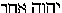

##### The Secret Doctrine by H. P. Blavatsky -- Vol. 1

------------------------------------------------------------------------

###### \[\[Vol. 1, Page\]\] 610 THE SECRET DOCTRINE.

\[\[This page continued from [previous
section](sd1-3-14)\]\]

#### § XV. GODS, MONADS, AND ATOMS.

**S**OME years ago we remarked\* that "the Esoteric Doctrine may well be
called the 'thread-doctrine,' since, like *Sutratman*, in the Vedanta
philosophy,\*\* it passes through and strings together all the ancient
philosophical religious systems, and reconciles and explains them all."
We say now it does more. It not only reconciles the various and
apparently conflicting systems, but it checks the discoveries of modern
exact science, and shows some of them to be necessarily correct, since
they are found corroborated in the ancient records. All this will, no
doubt, be regarded as terribly impertinent and disrespectful, a
veritable crime of *lese*-*Science;* nevertheless, it is a fact.

Science is, undeniably, ultra-materialistic in our days; but it finds,
in one sense, its justification. Nature behaving *in actu* ever
esoterically, and being, as the Kabalists say, *in abscondito*, can only
be judged by the profane through her appearance, and that appearance is
always deceitful on the physical plane. On the other hand, the
naturalists refuse to blend physics with metaphysics, the body with its
informing soul and spirit, which they prefer ignoring. This is a matter
of choice with some, while the minority strive very sensibly to enlarge
the domain of physical science by trespassing on the forbidden grounds
of metaphysics, so distasteful to some materialists. These scientists
are wise in their generation. For all their wonderful discoveries would
go for nothing, and remain for ever *headless* bodies, unless they lift
the veil of matter and strain their eyes to see *beyond.* Now that they
have studied nature in the length, breadth, and thickness of her
physical frame, it is time to remove the skeleton to the second plane
and search within the unknown depths for the living and real entity, for
its SUB-*stance* -- the noumenon of evanescent matter.

###### \[\[Footnote(s)\]\] -------------------------------------------------

\* "The Septenary Principle," art. in "Five Years of Theosophy," p. 197.

\*\* The Atman or Spirit (the Spiritual **S**ELF) passing like a thread
through the five subtle bodies (or principles, *Koshas*) is called
"thread-soul," or *Sutratman* in Vedantic philosophy.

------------------------------------------------------------------------

###### \[\[Vol. 1, Page\]\] 611 WHICH OF THE TWO IS BLIND?

It is only by acting on such lines that some of the truths, now called
"exploded superstitions," will be discovered to be facts and the relics
of ancient knowledge and wisdom.

One of such "degrading" beliefs -- in the opinion of the all-denying
sceptic -- is found in the idea that Kosmos, besides its objective
planetary inhabitants, its humanities in other inhabited worlds, is full
of invisible, intelligent *Existences.* The so-called Arch-Angels,
Angels and Spirits, of the West, copies of their prototypes, the
Dhyan-Chohans, the Devas and Pitris, of the East, are no real Beings but
fictions. On this point Materialistic Science is inexorable. To support
its position, it upsets its own axiomatic law of uniformity in the laws
of nature, that of continuity, and all the logical sequence of analogies
in the evolution of being. The masses of the profane are asked, and
made, to believe that the accumulated testimony of History, which shows
even the Atheists of old -- such as Epicurus and Democritus -- believing
in *gods*, was false; and that philosophers like Socrates and Plato,
asserting their existence, were mistaken enthusiasts and fools. If we
hold our opinions merely on historical grounds, on the authority of
legions of the most eminent Sages, Neo-Platonists, Mystics of all the
ages, from Pythagoras down to the eminent Scientists and Professors of
the present century, who, if they reject "gods," believe in "spirits,"
shall we consider such authorities as weak-minded and foolish as any
Roman Catholic peasant, who believes in and prays to his once human
Saint, or the Archangel, St. Michael? But is there no difference between
the belief of the peasant and that of the Western heirs to the
Rosicrucians and Alchemists of the Middle Ages? Is it the Van Helmonts,
the Khunraths, the Paracelsuses and Agrippas, from Roger Bacon down to
St. Germain, who were all blind enthusiasts, hysteriacs or cheats, or is
it the handful of modern sceptics -- the "leaders of thought" -- who are
struck with the cecity of negation? The latter, we opine. It would be a
*miracle* indeed, quite an abnormal fact in the realm of probabilities
and logic, were that handful of negators to be the sole custodians of
*truth*, while the million-strong hosts of believers in gods, angels,
and spirits -- in Europe and America alone -- namely, Greek and Latin
Christians, Theosophists, Spiritualists, Mystics, etc., etc., should be
no better than deluded fanatics and hallucinated mediums, and often no
higher than the victims of deceivers and impostors! However varying in
their external presentations and dogmas, beliefs in the Hosts of
invisible Intelligences of various grades have all the same foundation.
Truth and error are mixed in all. The exact extent, depth, breadth, and
length of the mysteries of Nature are to be found only in Eastern
esoteric sciences. So vast and so profound are these that hardly a few,
a very few of the highest Initiates -- those *whose very existence is
known but to a small number of*

------------------------------------------------------------------------

###### \[\[Vol. 1, Page\]\] 612 THE SECRET DOCTRINE.

*Adepts* -- are capable of assimilating the knowledge. Yet it is all
there, and one by one facts and processes in Nature's workshops are
permitted to find their way into the exact Sciences, while mysterious
help is given to rare individuals in unravelling its arcana. It is at
the close of great Cycles, in connection with racial development, that
such events generally take place. We are at the very close of the cycle
of 5,000 years of the present Aryan Kaliyuga; and between this time and
1897 there will be a large rent made in the Veil of Nature, and
materialistic science will receive a death-blow.

Without throwing any discredit upon time-honoured beliefs, in whatever
direction, we are forced to draw a marked line between blind faith,
evolved by theologies, and knowledge due to the independent researches
of long generations of adepts; between, in short, faith and philosophy.
There have been -- in all ages -- undeniably learned and good men who,
having been reared in sectarian beliefs, died in their crystallized
convictions. For Protestants, the garden of Eden is the primeval point
of departure in the drama of Humanity, and the solemn tragedy on the
summit of Calvary, the prelude to the hoped-for Millennium. For Roman
Catholics, Satan is at the foundation of Kosmos, Christ in its centre,
and Antichrist at its apex. For both, the Hierarchy of Being begins and
ends within the narrow frames of their respective theologies: one
self-created *personal* God and an Empyrean ringing with the Hallelujas
of *created* angels; the rest, *false* gods, Satan and fiends.

Theophilosophy proceeds on broader lines. From the very beginning of
AEons -- in time and space in our Round and Globe -- the Mysteries of
Nature (at any rate, those which it is lawful for our races to know)
were recorded by the pupils of those same now invisible "heavenly men,"
in geometrical figures and symbols. The keys thereto passed from one
generation of "wise men" to the other. Some of the symbols, thus passed
from the east to the west, were brought therefrom by Pythagoras, who was
not the inventor of his famous "Triangle." The latter figure, along with
the plane cube and circle, are more eloquent and scientific descriptions
of the order of the evolution of the Universe, spiritual and psychic, as
well as physical, than volumes of descriptive Cosmogonies and revealed
"*Geneses*." The *ten points* inscribed within that "Pythagorean
*triangle*" are worth all the theogonies and angelologies ever emanated
from the theological brain. For he who interprets them -- on their very
face, and in the order given -- will find in these seventeen points (the
seven Mathematical Points hidden) the uninterrupted series of the
genealogies from the first *Heavenly* to *terrestrial* man. And, as they
give the order of Beings, so they reveal the order in which were evolved
the Kosmos, our earth, and the primordial elements by

------------------------------------------------------------------------

###### \[\[Vol. 1, Page\]\] 613 THE MATHEMATICAL POINT.

which the latter was generated. Begotten in the invisible *Depths*, and
in the womb of the same "Mother" as its fellow-globes -- he who will
master the mysteries of our Earth, will have mastered those of all
others.

Whatever ignorance, pride or fanaticism may suggest to the contrary,
Esoteric Cosmology can be shown inseparably connected with both
philosophy and modern science. The gods of the ancients, the monads --
from Pythagoras down to Leibnitz -- and the atoms of the present
materialistic schools (as borrowed by them from the theories of the old
Greek Atomists) are only a compound unit, or a graduated unity like the
human frame, which begins with body and ends with spirit. In the occult
sciences they can be studied separately, but never mastered unless
viewed in their mutual correlations during their life-cycle, and as a
Universal Unity during *Pralayas.*

La Pluche shows sincerity, but gives a poor idea of his philosophical
capacities when declaring his personal views on the Monad or the
Mathematical Point. "A point," he says, "is enough to put all the
schools in the world in a combustion. But what need has man to know that
point, since the creation of such a small being is beyond his power? *A
fortiori*, philosophy acts against probability when, from that point
which absorbs and disconcerts all her meditations, she presumes to pass
on to the generation of the world. . . ."

Philosophy, however, could never have formed its conception of a
logical, universal, and absolute Deity if it had no Mathematical Point
within the Circle to base its speculations upon. It is only the
manifested Point, lost to our senses after its pregenetic appearance in
the infinitude and *incognizability* of the Circle, that made a
reconciliation between philosophy and theology possible -- on condition
that the latter should abandon its crude materialistic dogmas. And it is
because it has so unwisely rejected the Pythagorean Monad and
geometrical figures, that Christian theology has evolved its
self-created human and personal God, the monstrous Head from whence flow
in two streams the dogmas of Salvation and Damnation. This is so true
that even those clergymen who would be philosophers and who were masons,
have, in their arbitrary interpretations, fathered upon the ancient
sages the queer idea that "the Monad represented (with them) *the
throne* of the Omnipotent Deity, placed in the centre of the Empyrean to
indicate **T.G.A.O.T.U**."\* -- read "the Great Architect of the
Universe." A curious explanation this, more Masonic than strictly
Pythagorean.

Nor did the "hierogram within a Circle, or equilateral Triangle,"

###### \[\[Footnote(s)\]\] -------------------------------------------------

\* "Science of Numbers," by the Rev. G. Oliver (p. 36).

------------------------------------------------------------------------

###### \[\[Vol. 1, Page\]\] 614 THE SECRET DOCTRINE.

ever mean "the exemplification of the unity of the divine Essence"; for
this was exemplified by the plane of the boundless Circle. What it
really meant was the triune co-equal Nature of the first differentiated
Substance, or the *con*-*substantiality* of the (manifested) Spirit,
matter and the Universe -- their "Son," who proceeds from the Point (the
real, esoteric **L**OGOS) or the Pythagorean **M**ONAD. For the Greek
*Monas* signifies "Unity" in its primary sense. Those unable to seize
the difference between the monad -- the Universal Unit -- and the
*Monads* or the manifested Unity, as also between the ever-hidden and
the revealed **L**OGOS or the *Word*, ought never to meddle in
philosophy, let alone the Esoteric Sciences. It is needless to remind
the educated reader of Kant's *Thesis* to demonstrate his second
*Antinomy.*\* Those who have read and understood it will see clearly the
line we draw between the *absolutely Ideal* Universe and the invisible
though manifested Kosmos. Our Gods and Monads are not the Elements of
*extension* itself, but only those of the invisible reality which is the
basis of the manifested Kosmos. Neither esoteric philosophy, nor Kant,
nor Leibnitz would ever admit that extension can be composed of simple
or unextended parts. But theologian-philosophers will not grasp this.
The Circle and the Point, which latter retires into and merges with the
former, after having emanated the first three points and connected them
with lines, thus forming the first *noumenal* basis of the Second
Triangle in the Manifested World, have ever been an insuperable obstacle
to theological flights into dogmatic Empyreans. On the authority of this
Archaic Symbol, a male, personal god, the *Creator* and *Father* of all,
becomes a third-rate emanation, the Sephiroth standing *fourth* in
descent, and on the left hand of En-Soph (see the *Kabalistic Tree of
Life*)*.* Hence, the Monad is degraded into a Vehicle -- a "throne"!

The Monad -- only the emanation and reflection of the Point (Logos) in
the phenomenal World -- becomes, as the *apex* of the manifested
equilateral triangle, the "Father." The left side or line is the *Duad*,
the "Mother," regarded as the evil, counteracting principle (Plutarch,
*De* *Placitis Placitorum*); the right side represents the Son ("his
Mother's husband" in every Cosmogony, as one with the *apex*); at the
basic line is the Universal plane of productive Nature, unifying on the
phenomenal plane Father-Mother-Son, as these were unified in the *apex*,
in the supersensuous World.\*\* By mystic transmutation they became the
Quaternary -- the triangle became the **T**ETRAKTIS.

###### \[\[Footnote(s)\]\] -------------------------------------------------

\* See Kant's *Critique de la Raison pure* (Barni's transl., Vol. II.,
p. 54).

\*\* In the Greek and Latin churches -- which regard marriage as one of
the sacraments -- the officiating priest during the marriage ceremony
represents the apex of the *triangle;* the bride its left feminine side
and the bridegroom the right one, while the horizontal line is
symbolised by the row of witness, the bridesmaids and best-men. But
behind \[\[Footnote continued on next page\]\]

------------------------------------------------------------------------

###### \[\[Vol. 1, Page\]\] 615 SPACE, FORCE AND MATTER.

This transcendental application of geometry to Cosmic and divine
theogony -- the Alpha and the Omega of mystical conception -- became
dwarfed after Pythagoras by Aristotle. By omitting the Point and the
Circle, and taking no account of the apex, he reduced the metaphysical
value of the idea, and thus limited the doctrine of magnitude to a
simple TRIAD -- the *line*, the *surface*, and the *body.* His modern
heirs, who play at Idealism, have interpreted these three geometrical
figures as Space, Force, and Matter -- "the potencies of an interacting
Unity."\* Materialistic Science, perceiving but the basic line of the
*manifested* "triangle" -- the plane of matter -- translates it
practically as (Father)-**M**ATTER, (Mother)-**M**ATTER, and
(Son)-**M**ATTER, and theoretically as Matter, Force, and Correlation.

But to the average physicist, as remarked by a Kabalist, "Space, Force,
Matter, are, what signs in algebra are to the mathematician, merely
conventional symbols;" or "Force as force, and Matter as matter, are as
absolutely unknowable as is the assumed empty space in which they are
held to interact." As symbols representing abstractions, "the physicist
bases reasoned hypotheses of the origin of things . . . . and sees three
needs in what he terms creation: (*a*) a place wherein to create; (*b*)
a medium by which to create; (*c*) a material from which to create. And
in giving a logical expression to this hypothesis through the terms
space, force, matter, he believes he has proved the existence of that
which each of these represents *as he conceives it to be*."\*\*

The physicist who regards Space merely as a representation of our mind,
or extension unrelated to things in it, which Locke defined as capable
of neither resistance nor motion; the paradoxical materialist, who would
have a *void* there, where he can see no matter, would reject with the
utmost contempt the proposition that "Space is a substantial though
(apparently) an absolutely unknowable living Entity." (*New Aspects*, p.
9.) Such is, nevertheless, the Kabalistic teaching, and it is that of
Archaic philosophy. Space is the real world, while our world is an
artificial one. It is the One Unity throughout its infinitude: in its
bottomless depths as on its illusive surface; a surface studded with
countless phenomenal Universes, systems and mirage-like worlds.
Nevertheless, to the Eastern Occultist, who is an objective Idealist at
the bottom, in the *real* world, which is a Unity of Forces, there is "a
connection of all matter in the *plenum*," as Leibnitz would say. This
is symbolized in the Pythagorean Triangle.

###### \[\[Footnote(s)\]\] -------------------------------------------------

\[\[Footnote continued from previous page\]\] the priest there is the
altar with its mysterious containments and symbolic meaning, inside of
which no one but the consecrated priests ought to enter. In the early
days of Christianity the marriage ceremony was a mystery and a true
symbol. Now, however, even the churches have lost the true meaning of
this symbolism.

\* See Von Hartmann's and Herbert Spencer's works.

\*\* "New Aspects of Life," by Henry Pratt, M.D.

------------------------------------------------------------------------

###### \[\[Vol. 1, Page\]\] 616 THE SECRET DOCTRINE.

It consists of *ten points* inscribed pyramid-like (from one to the last
four) within its three lines, and it symbolizes the Universe in the
famous Pythagorean Decad. The upper single dot is a Monad, and
represents a Unit-Point, which is *the* Unity from whence all proceeds,
and all is of the same essence with it. While the ten dots within the
triangle represent the phenomenal world, the three sides of the
equilateral triangle which enclose the pyramid of dots are the barriers
of *noumenal* Matter, or Substance, that separate it from the world of
Thought. "Pythagoras considered a *point* to correspond in proportion to
unity; a *line* to 2; a *superficies* to 3; a *solid* to 4; and he
defined a point as a Monad having position, and the beginning of all
things; a line was thought to correspond with duality, because it was
produced by the first motion from indivisible nature, and formed the
junction of two points. A superficies was compared to the number three
because it is the first of all causes that are found in figures; for a
circle, which is the principal of all round figures, comprises a triad,
in centre -- space -- circumference. But a triangle, which is the first
of all rectilineal figures, is included in a ternary, and receives its
form according to that number; and was considered by the Pythagoreans to
be the creator of all sublunary things. The four points at the base of
the Pythagorean triangle correspond with a solid or cube, which combines
the principles of length, breadth, and thickness, for no solid can have
less than four extreme boundary points." (*Pythag. Triangle*, p. 19.)

It is argued that "the human mind cannot conceive an indivisible unit
short of the annihilation of the idea with its subject." This is an
error, as the Pythagoreans have proved, and a number of Seers before
them, although there is a special training for it, and although the
profane mind can hardly grasp it. But there are such things as
*metamathematics* and *metageometry.* Even mathematics pure and simple
proceed from the Universal to the particular, from the mathematical,
hence *indivisible* Point, to solid figures. The teaching originated in
India, and was taught in Europe by Pythagoras, who, throwing a veil over
the Circle and the Point -- which no living man can define except as
incomprehensible abstractions -- laid the origin of the differentiated
Cosmic matter in the basic or horizontal line of the Triangle. Thus the
latter became the earliest of geometrical figures. The author of "New
Aspects of Life" and of the Kabalistic Mysteries -- objects to the
objectivization, so to speak, of the Pythagorean conception and use of
the equilateral triangle, and calls it a *misnomer.* His argument that a
solid equilateral body -- "one whose base, and each of its sides, form
equal triangles -- must have four co-equal sides or surfaces, while a
triangular plane will as necessarily possess five," demonstrates on the
contrary the grandeur of the conception in all its esoteric application
to the idea of

------------------------------------------------------------------------

###### \[\[Vol. 1, Page\]\] 617 PHANTOMS OF THE MIND.

the *pregenesis*, and the genesis of Kosmos. Granted, that an ideal
triangle, depicted by mathematical, imaginary lines "can have no sides
at all, being simply *a phantom of the mind* (if sides be imputed to
which, they must be the sides of the object it constructively
represents)." But in such case most of the scientific hypotheses are no
better than "phantoms of the mind"; they are unverifiable, except on
inference, and have been adopted merely to answer scientific
necessities. Furthermore, the ideal triangle -- "as the abstract idea of
a triangular body, and, therefore, as the type of an abstract idea" --
accomplished and carried out to perfection the double symbolism
intended. As an emblem applicable to the objective idea, the simple
triangle became a solid. When repeated in stone on the four cardinal
points, it assumed the shape of the Pyramid -- the symbol of the
phenomenal merging into the noumenal Universe of thought -- at the apex
of the four triangles; and, as an "imaginary figure constructed of three
mathematical lines," it symbolized the subjective spheres -- those lines
"enclosing a mathematical space -- which is equal to nothing enclosing
nothing." Because, to the senses and the untrained consciousness of
profane and scientist, everything beyond the line of differentiated
matter -- *i.e.*, outside of, and beyond the realm of even the most
spiritual *substance* -- has to remain for ever *equal to nothing.* It
is the **A**IN-**S**OPH -- the *No*-THING.

Yet these "phantoms of the mind" are in truth no greater abstractions
than the abstract ideas in general upon evolution and physical
development -- *e.g*., Gravity, Matter, Force, etc. -- on which the
exact sciences are based. Our most eminent chemists and physicists are
earnestly pursuing the not hopeless attempt of finally tracing to its
hiding-place the *protyle*, or the basic line of the Pythagorean
triangle. The latter is, as said, the grandest conception imaginable, as
it symbolizes both the ideal and the visible universes.\* For if "*the
possible unit is only a possibility as an actuality of nature*, *as an
individual of any kind*," and as every individual natural object is
capable of division, and by division loses its unity, *or ceases to be a
unit*,\*\* it is so only in the realm of exact sciences in a world as
deceptive as it is illusive. In the realm of the Esoteric sciences the
unit divided *ad infinitum*, instead of losing its unity, approaches
with every division the planes of the only eternal **R**EALITY. The eye
of the **S**EER can follow and behold it in all its pregenetic glory.
This same idea of the reality of the subjective, and the unreality of
the objective universes, is found at the bottom of the Pythagorean and
Platonic teachings -- limited to the *Elect* alone; for

###### \[\[Footnote(s)\]\] -------------------------------------------------

\* In the world of Form, having found its expression in the Pyramids,
Symbolism has in them both a triangle and a square, with their four
co-equal triangles or surfaces, the four basic points, and the fifth --
the *apex.*

\*\* "New Aspects of Life."

------------------------------------------------------------------------

###### \[\[Vol. 1, Page\]\] 618 THE SECRET DOCTRINE.

Porphyry, speaking of the *Monad* and the *Duad*, says that the former
only was considered substantial and real, "*that most simple Being*,
*the cause of all unity and the measure of all things.*"

But the Duad, although the origin of Evil, or Matter -- thence *unreal*
in philosophy -- is still Substance during Manvantara, and is often
called the *third* monad, in Occultism, and the connecting line as
between two Points, . . . or Numbers which proceeded from THAT, "which
was before all Numbers," as expressed by Rabbi Barahiel. And from this
Duad proceeded all the *Scintillas* of the three upper and the four
lower worlds or planes -- which are in constant interaction and
correspondence. This is a teaching which the Kabala has in common with
Eastern Occultism. For in the occult philosophy there are the "**O**NE
Cause" and the "*Primal* Cause," which latter thus becomes,
paradoxically, the second, as clearly expressed by the author of the
"*Qabbalah*, *from the philosophical writings of Ibn Gabirol*," -- "in
the treatment of the Primal cause, two things must be considered, the
Primal Cause *per se*, and the relation and connection of the Primal
Cause with the visible and unseen universe." Thus he shows the early
Hebrews following in the steps of the Oriental philosophy -- Chaldean,
Persian, Hindu, Arabic, etc. Their Primal Cause was designated at first
"by the triadic Shaddai, the (triune) Almighty, subsequently by the
Tetragrammaton, **YHVH**, symbol of the Past, Present, and Future," and,
let us add, of the eternal **I**S, or the **I** **A**M. Moreover, in the
Kabala the name **YHVH** (or Jehovah) expresses a He and a She, male and
female, two in one, or Hokhmah and Binah, and his, or rather their
*Shekinah* or synthesizing spirit (grace), which makes again of the Duad
a Triad. This is demonstrated in the Jewish Liturgy for Pentecost, and
the prayer, "In the name of Unity, of the Holy and Blessed Hu (He), and
His Shekinah, the Hidden and Concealed Hu, blessed be **YHVH** (the
Quaternary) for ever." "Ha is said to be masculine and **YAH** feminine,
together they make the  *i.e.*, one **YHVH**. One, but
of a male-female nature. The Shekinah is always considered in the
Qabbalah as feminine" (p. 175). And so it is considered in the
*exoteric* Puranas, for Shekinah is no more than *Sakti* -- the female
double or lining of any god, in such case. And so it was with the early
Christians whose Holy Spirit was feminine, as Sophia was with the
Gnostics. But in the transcendental Chaldean Kabala or "Book of
Numbers," "Shekinah" is sexless, and the purest abstraction, a State,
like Nirvana, not subject or object or anything except an absolute
**P**RESENCE.

Thus it is only in the anthropomorphised systems (such as the Kabala has
now greatly become) that Shekinah-Sakti is feminine. As such she becomes
the *Duad* of Pythagoras, the two straight lines of the symbol that can
never meet, which therefore form no geometrical figure and are

------------------------------------------------------------------------

###### \[\[Vol. 1, Page\]\] 619 THE MONAD OF LEIBNITZ.

the symbol of matter. Out of this Duad, when united in one basic line of
the triangle on the lower plane (the upper Triangle of the Sephirothal
Tree), emerge the Elohim, or Deity in *Cosmic* Nature, with the true
Kabalists the *lowest* designation, translated in the Bible "God" (see
the same work and page).\* Out of these issue the *Scintillas.*

The *Scintillas* are the "Souls," and these Souls appear in the
three-fold form of Monads (units), atoms and gods -- according to our
teaching. "Every atom becomes a visible complex unit (a molecule), and
once attracted into the sphere of terrestrial activity, the Monadic
Essence, passing through the mineral, vegetable, and animal kingdoms,
becomes man." (Esot. Catechism.) Again, "God, Monad, and Atom are the
correspondences of Spirit, Mind, and Body (*Atma*, *Manas and Sthula
Sarira*) in man." In their septenary aggregation they are the "Heavenly
Man" (see *Kabala* for the latter term); thus, terrestrial man is the
provisional reflection of the Heavenly. . . . . "The Monads (*Jivas*)
are the Souls of the Atoms, both are the fabric in which the Chohans
(Dhyanis, *gods*) cloth themselves when a form is needed." (*Esot.
Cat.*)

This relates to Cosmic and sub-planetary Monads, not to the Super-Cosmic
*Monas* (the Pythagorean Monad) as called, in its synthetic character,
by the Pantheistical Peripatetics. The Monads of the present
dissertation are treated from the standpoint of their individuality, as
*atomic Souls*, before these atoms descend into pure terrestrial form.
For this descent into *concrete* matter marks the medial point of their
own individual pilgrimage. Here, losing in the mineral kingdom their
individuality, they begin to ascend through the seven states of
terrestrial evolution to that point where a correspondence is firmly
established between the human and *Deva* (divine) consciousness. At
present, however, we are not concerned with their terrestrial
metamorphoses and tribulations, but with their life and behaviour in
Space, on planes wherein the eye of the most intuitional chemist and
physicist cannot reach them -- unless, indeed, he develops in himself
highly clairvoyant faculties.

It is well known that Leibnitz came several times very near the truth,
but defined monadic evolution incorrectly, which is not to be wondered
at, since he was not an **I**NITIATE, nor even a Mystic, only a

###### \[\[Footnote(s)\]\] -------------------------------------------------

\* Such recent works as the Qabbalah of Mr. Isaac Myer and of Mr. S. L.
MacGregor Mathers, fully justify our attitude towards the Jehovistic
Deity. It is not the transcendental, philosophical, and highly
metaphysical abstraction of the original Kabalistic thought --
Ain-Soph-Shekinah-Adam-Kadmon, and all that follows -- that we oppose,
but the crystallization of all these into the highly unphilosophical,
repulsive, and anthropomorphic Jehovah, the androgynous and *finite*
deity for which eternity, omnipotence, and omniscience are claimed. We
do not war against the IDEAL **R**EALITY, but the hideous theological
*Shadow*.

------------------------------------------------------------------------

###### \[\[Vol. 1, Page\]\] 620 THE SECRET DOCTRINE.

very intuitional philosopher. Yet no psycho-physicist ever came nearer
than he has to the esoteric general outline of evolution. This evolution
-- viewed from its several standpoints -- *i.e.*, as the *universal* and
the *individualized* Monad; and the chief aspects of the Evolving
Energy, after differentiation -- the purely Spiritual, the Intellectual,
the Psychic and the Physical -- may be thus formulated as an invariable
law; a descent of Spirit into Matter, equivalent to an ascent in
physical evolution; a re-ascent from the depths of materiality towards
its *status quo ante*, with a corresponding dissipation of concrete form
and substance up to the **L**AYA state, or what Science calls "the
zero-point," and beyond.

These states -- once the spirit of Esoteric philosophy is grasped --
become absolutely necessary from simple logical and analogical
considerations. Physical Science having now ascertained, through its
department of Chemistry, the invariable law of this evolution of atoms
-- from their "*protylean*" state down to that of a physical and then a
chemical particle (or molecule) -- cannot well reject the same as a
general law. And once it is forced by its enemies -- Metaphysics and
Psychology\* -- out of its alleged impregnable strongholds, it will find
it more difficult than it now appears to refuse room *in the Spaces* of
**S**PACE to Planetary Spirits (gods), Elementals, and even the
*Elementary* Spooks or Ghosts, and others. Already Figuier and Paul
D'Assier, two Positivists and Materialists, have succumbed before this
logical necessity. Other and still greater Scientists will follow in
that "intellectual **F**ALL." They will be driven out of their position
not by spiritual, theosophical, or any other physical or even mental
phenomena, but simply by the enormous *gaps* and *chasms* that open
daily and will still be opening before them, as one discovery follows
the other, until they are finally knocked off their feet by the ninth
wave of simple common sense.

Here is an example: Prof. W. Crookes' latest discovery of what he has
named *protyle.* In the "Notes on the Bhagavat Gita," by one of the best
metaphysicians and Vedantic scholars in India,\*\* the lecturer,
referring cautiously to "things occult" in that great Indian esoteric
work, makes a remark as suggestive as it is strictly correct. ". . .
Into the details of the evolution of the solar system itself," he says,
"*it is not necessary for me to enter.* You may gather some idea *as to
the way* in which the various elements start into existence from these
THREE *principles into which* **M**ULAPRAKRITI *is differentiated* (the
Pythagorean triangle), by

###### \[\[Footnote(s)\]\] -------------------------------------------------

\* Let not the word "psychology" cause the reader to carry his thought
by an association of ideas to modern "Psychologists," so-called, whose
*idealism* is another name for uncompromising materialism, and whose
pretended Monism is no better than a mask to conceal the void of final
annihilation -- even of consciousness. Here *Spiritual* psychology is
meant.

\*\* T. Subba Row, see *Theosophist* for Feb., 1887.

------------------------------------------------------------------------

###### \[\[Vol. 1, Page\]\] 621 THE CHEMISTRY OF THE FUTURE.

examining the lecture delivered by Professor Crookes a short time ago
upon the so-called elements of modern chemistry. This lecture will give
you some idea of the way in which these Elements spring from
*Vishwanara*,\* the most objective of these three principles, which
seems to stand in the place of the *protyle* mentioned in that lecture.
*Except in a few particulars*, this lecture seems to give the outlines
of the theory of physical evolution on the plane of *Vishwanara*, and
is, so far as I know, *the nearest approach made by modern
investigators* TO THE REAL OCCULT THEORY *on the subject.*"

These words will be re-echoed and approved by every Eastern Occultist.
Much from the lectures by Prof. Crookes has already been quoted in §
**XII.** of these Addenda. Since then, there has been another lecture
delivered, as remarkable as the first one, on the "Genesis of the
Elements,"\*\* and also a third one. Here we have almost a corroboration
of the teachings of Esoteric philosophy concerning the mode of primeval
evolution. It is, indeed, as *near an approach*, made by a great scholar
and specialist in chemistry,\*\*\* to the Secret Doctrine, as could be
made apart from the application of the monads and atoms to the dogmas of
pure transcendental metaphysics, and their connection and correlation
with "Gods and intelligent Conscious Monads." But Chemistry is now on
its ascending plane, thanks to one of its highest European
representatives. It is impossible for it to go back to that day when
materialism regarded its *sub*-elements as absolutely simple and
homogeneous bodies, which it had raised, in its blindness, to the rank
of elements. The mask has been snatched off by too clever a hand for
there to be any fear of a new disguise. And after years of pseudology,
of bastard molecules parading under the name of elements, behind and
beyond which there could be nought but void, a great professor of
chemistry asks once more: "What are these elements, whence do they come,
what is their signification? . . . . These elements perplex us in our
researches, baffle us in our speculations, and haunt us in our very
dreams. They stretch like an unknown sea before us mocking --
mystifying, and murmuring strange revelations and possibilities." (*Gen.
of Elem.*, p. 1.)

###### \[\[Footnote(s)\]\] -------------------------------------------------

\* "*Vishwanara* is not merely the manifested objective world, but the
one physical basis (the horizontal line of the triangle) from which the
whole objective world starts into existence." And this is the Cosmic
*Duad*, the androgynous Substance. Beyond only, is the true *Protyle.*

\*\* By W. Crookes, **F.R.S., V.P.C.S**., delivered at the Royal
Institution, London, on Friday, February 18th, 1887.

\*\*\* How true it is will be fully demonstrated only on that day when
his discovery of radiant matter will have resulted in a further
elucidation with regard to the true source of light, and revolutionized
all the present speculations. Further familiarity with the northern
streamers of the *aurora borealis* may help the recognition of this
truth.

------------------------------------------------------------------------

###### \[\[Vol. 1, Page\]\] 622 THE SECRET DOCTRINE.

Those who are heirs to primeval revelations have taught these
"possibilities" in every century, but have never found a fair hearing.
The truths inspired to Kepler, Leibnitz, Gassendi, Swedenborg, etc.,
were ever alloyed with their own speculations in one or another
predetermined direction --hence distorted. But now one of the great
truths has dawned upon an eminent professor of modern exact science, and
he fearlessly proclaims as a fundamental axiom that Science has not made
itself acquainted, so far, with *real* simple elements. For Prof.
Crookes tells his audience:

"If I venture to say *that our commonly received elements are* NOT
*simple and primordial*, that they have *not* arisen by chance or have
*not* been created in a desultory and mechanical manner, but have been
evolved from simpler matters -- or perhaps, indeed, from one sole kind
of matter -- I do but give formal utterance to an idea which has been,
so to speak, for some time 'in the air' of science. Chemists,
physicists, philosophers of the highest merit, declare explicitly their
belief that the seventy (or thereabouts) elements of our text-books are
not the pillars of Hercules which we must never hope to pass." . . .
"Philosophers in the present as in the past -- men who certainly have
not worked in the laboratory -- have reached the same view from another
side." Thus Mr. Herbert Spencer records his conviction that 'the
chemical atoms are produced from the true or physical atoms by processes
of evolution under conditions which chemistry has not yet been able to
produce.' . . . "And the poet has forestalled the philosopher. Milton
('Paradise Lost,' Book V.) makes the Archangel Raphael say to Adam,
instinct with the evolutionary idea, that the Almighty had created

> . . . 'One first matter, all  
> Indued with various forms, various degrees  
> Of substance.' "

Nevertheless, the idea would have remained crystallized "in the air of
Science," and never have descended into the thick atmosphere of
materialism and profane mortals for years to come, perhaps, had not
Professor Crookes bravely and fearlessly reduced it to its simple
elements, and thus publicly forced it on Scientific notice. "An idea,"
says Plutarch, "is a *being* incorporeal, which has no subsistence by
itself, but gives figure and form unto shapeless matter, and *becomes
the cause of the manifestation.*" (*De Placit. Philos.*) The revolution
produced in old chemistry by Avogadro was the first page in the Volume
of *New Chemistry.* Mr. Crookes has now turned the second page, and is
boldly pointing *to what may be the last.* For once *protyle* accepted
and recognized -- *as invisible Ether was*, *both being logical and
scientific necessities* -- Chemistry will have virtually ceased to live:
it will reappear in its reincarnation as *New Alchemy*, or
**M**ETACHEMISTRY. The discoverer of

------------------------------------------------------------------------

###### \[\[Vol. 1, Page\]\] 623 THE GENESIS OF ATOMS.

radiant matter will have vindicated in time the Archaic Aryan works on
Occultism and even the Vedas and Puranas. For what are the manifested
"Mother," the "Father-Son-Husband" (Aditi and Daksha, a form of Brahma,
as Creators) and the "Son," -- the three "First-born" -- *but simply
Hydrogen*, *Oxygen*, and that which in its terrestrial manifestation is
called *nitrogen.* Even the exoteric descriptions of the "First Born"
triad give all the characteristics of these three *gases.* Priestley,
the "discoverer" of Oxygen, or that which was known in the highest
antiquity!

Yet all the ancient, mediaeval, and modern poets and philosophers have
been anticipated even in the exoteric Hindu books. Descartes' *plenum*
of matter differentiated into particles; Leibnitz's *Ethereal Fluid* and
Kant's "primitive fluid" dissolved into its elements; Kepler's Solar
Vortex and Systemic Vortices; in short, from the Elemental Vortices
inaugurated by the universal mind -- through Anaxagoras, down to
Galileo, Torricelli, and Swedenborg, and after them to the latest
speculations by European mystics -- all this is found in the Hindu hymns
and Mantras to the "Gods, Monads, and Atoms," in their fulness, for they
are inseparable. In esoteric teachings, the most transcendental
conceptions of the universe and its mysteries, as the most (seemingly)
materialistic speculations are found reconciled, because those sciences
embrace the whole scope of evolution from Spirit to matter. As declared
by an American Theosophist, "The Monads (of Leibnitz) may from one point
of view be called *force*, from another *matter.* To occult Science,
*force* and *matter* are *only two sides of the same* SUBSTANCE."
("Path," No. 10, p. 297.)

Let the reader remember these "Monads" of Leibnitz, every one of which
is a living mirror of the universe, every monad reflecting every other,
and compare this view and definition with certain Sanskrit stanzas
(*Slokas*) translated by Sir William Jones, in which it is said that the
creative source of the Divine Mind, . . . "Hidden in a veil of thick
darkness, formed *mirrors of the atoms* of the world, and *cast
reflection from its own face on every atom. .* . . ."

When, therefore, Professor Crookes declares that "If we can show how the
so-called chemical elements might have been generated we shall be able
to fill up a formidable gap in our knowledge of the universe, . . ." the
answer is ready. The theoretical knowledge is contained in the esoteric
meaning of every Hindu cosmogony in the *Puranas;* the practical
demonstration thereof -- is in the hands of those who will not be
recognised *in this* century, save by the very few. The scientific
possibilities of various discoveries, that must inexorably lead exact
Science into the acceptation of Eastern Occult views, which contain all
the requisite material for the filling of those "gaps," are, so far, at
the mercy of modern materialism. It is only by working in the direction

------------------------------------------------------------------------

###### \[\[Vol. 1, Page\]\] 624 THE SECRET DOCTRINE.

taken by Professor Crookes that there is any hope for the recognition of
a few, hitherto Occult, truths.

Meanwhile, one thirsting to have a glimpse at a practical diagram of the
evolution of primordial matter, which, separating and differentiating
under the impulse of cyclic law, divides itself into a septenary
gradation of **S**UBSTANCE (from a general view), can do no better than
examine the plates attached to Mr. Crookes' lecture: "Genesis of the
Elements," and ponder well over some passages of the text. In one place
(p. 11) he says: --

". . . . Our notions of a chemical element have expanded. Hitherto the
molecule has been regarded as an aggregate of two or more atoms, and no
account has been taken of the architectural design on which these atoms
have been joined. We may consider that the structure of a chemical
element is more complicated than has hitherto been supposed. Between the
molecules we are accustomed to deal with in chemical reactions and
ultimate atoms as first created, come smaller molecules or aggregates of
physical atoms; then sub-molecules differ one from the other, according
to the position they occupied in the yttrium edifice."

"Perhaps this hypothesis can be simplified if we imagine yttrium to be
represented by a five-shilling piece. By chemical fractionation I have
divided it into five separate shillings, and find that these shillings
are not counterparts, but like the carbon atoms in the benzol ring, have
the impress of their position, 1, 2, 3, 4, 5, stamped on them. . . . If
I throw my shillings into the melting-pot or dissolve them chemically,
the mint stamp disappears and they all turn out to be silver." . . .

This will be the case with all the atoms and molecules when they have
separated from their compound forms and bodies -- when *pralaya* sets
in. Reverse the case, and imagine the dawn of a new manvantara. The pure
"silver" of the absorbed material will once more separate into
SUBSTANCE, which will generate "Divine Essences" whose "principles"\*
are the primary elements, the sub-elements, the physical energies and
subjective and objective matter; or, as these are epitomised -- GODS,
MONADS, and ATOMS. If leaving for one moment the metaphysical or
transcendental side of the question, -- dropping out of the present
consideration the supersensuous and intelligent beings and entities
believed in by the Kabalists and Christians -- we turn to the atomical
theory of evolution, the occult teachings are still found corroborated
by exact Science and its confessions, as far, at least, as regards the
supposed "simple" elements, now suddenly

###### \[\[Footnote(s)\]\] -------------------------------------------------

\* Corresponding on the cosmic scale with the Spirit, Soul-mind, Life,
and the three *Vehicles* -- the astral, the *Mayavic* and the physical
bodies (of mankind) whatever division is made.

------------------------------------------------------------------------

###### \[\[Vol. 1, Page\]\] 625 HERMES OR HUXLEY?

degraded into poor and distant relatives -- not even second cousins to
the latter. For we are told by Prof. Crookes that:

"Hitherto, it has been considered that if the atomic weight of a metal,
determined by different observers, setting out from different compounds,
was always found to be constant . . . then such metal must rightly take
rank among the simple or elementary bodies. We learn . . . that this is
no longer the case. Again, we have here wheels within wheels. Gadolinium
is not an element but a compound. . . We have shown that yttrium is a
complex of five or more new constituents. And who shall venture to
gainsay that each of these constituents, if attacked in some different
manner, and if the result were submitted to a test more delicate and
searching than the radiant-matter test, might not be still further
divisible? Where, then, is the actual ultimate element? As we advance it
recedes like the tantalizing mirage lakes and groves seen by the tired
and thirsty traveller in the desert. Are we in our quest for truth to be
thus deluded and baulked? The very idea of an element, as something
absolutely primary and ultimate, seems to be growing less and less
distinct. . ." (p. 16).

On page 429 of *Isis Unveiled*, Vol. I., we said that "the mystery of
first creation, which was ever the despair of Science, is unfathomable
unless they (the Scientists) accept the doctrine of Hermes. *They will
have to follow in the footsteps of the Hermetists.*" Our prophecy begins
to assert itself.

But between Hermes and Huxley there is a middle course and point. Let
the men of Science only throw a bridge half-way, and think seriously
over the theories of Leibnitz. We have shown *our* theories with regard
to atomic evolution -- their last formation into compound chemical
molecules being produced within our terrestrial workshops in the earth's
atmosphere and not elsewhere -- as strangely agreeing with the evolution
of atoms shown on Mr. Crookes' plates. Several times already it was
stated in this volume that *Marttanda* (the Sun) had evolved and
aggregated, together with his smaller seven Brothers, from his Mother's
(Aditi's) bosom, that bosom being *prima* MATER-ia -- the lecturer's
primordial *protyle.* Esoteric doctrines teach the existence of "an
antecedent form of energy having periodic cycles of ebb and swell, rest
and activity" (p. 21) -- and behold a great scholar in Science now
asking the world to accept this as one of the postulates. We have shown
the "Mother," fiery and hot, becoming gradually cool and radiant, and
that same Scientist claims as his second postulate, a *scientific
necessity*, it would seem -- "an internal action akin to cooling,
operating slowly in the protyle." Occult Science teaches that "Mother"
lies stretched in infinity (during *Pralaya*) as the great Deep, the
"*dry* Waters of Space," according to the quaint expression in the
*Catechism*, and becomes *wet*

------------------------------------------------------------------------

###### \[\[Vol. 1, Page\]\] 626 THE SECRET DOCTRINE.

only after the separation and the moving over its face of *Narayana*,
the "Spirit which is invisible Flame, which never burns, but sets on
fire all that it touches, and gives it life and generation."\* And now
Science tells us that "the first-born element . . . most nearly allied
to protyle" . . . would be "*hydrogen* . . . which for some time would
be the only existing form of matter" in the Universe. What says *Old*
Science? It answers: just so; but we would call hydrogen and oxygen
(which instils the fire of life into the "Mother" by incubation) in the
*pregenetic* and even pre-geological ages -- the *Spirit*, the
*noumenon* of that which becomes in its grossest form oxygen and
hydrogen and nitrogen on Earth -- nitrogen being of no divine origin,
but merely an earth-born cement to unite other gases and fluids, and
serve as a sponge to carry in itself the breath of LIFE -- pure air.\*\*
Before these *gases* and fluids become what they are in *our*
atmosphere, they are interstellar Ether; still earlier and on a *deeper*
plane -- something else, and so on *in infinitum.* The eminent and
learned gentleman must pardon an Occultist for quoting him at such
length; but such is the penalty of a Fellow of the Royal Society who
approaches so near the precincts of the Sacred Adytum of Occult
mysteries as virtually to overstep the forbidden boundaries.

But it is time to leave modern *physical* science and turn to the
psychological and metaphysical side of the question. We would only
remark that to the "two very reasonable postulates" required by the
eminent lecturer, "to get a glimpse of some few of the secrets so darkly
hidden" behind "the door of the Unknown" -- a third should be
added\*\*\* -- lest no battering at it should avail; the postulate that
Leibnitz, in his speculations, stood on a firm groundwork of fact and
truth. The admirable and thoughtful synopsis of these speculations -- as
given by John Theodore Merz in his "Leibnitz" -- shows how nearly he has
brushed the hidden secrets of esoteric Theogony in his *Monadologie.*
And yet that philosopher has hardly risen in his speculations above the
first planes, the lower principles of the Cosmic Great Body. His theory
soars to no loftier heights than those of the *manifested* life,
self-consciousness and intelligence, leaving the regions of the earlier
post-genetic mysteries untouched, as his ethereal fluid is
post-planetary.

But this third postulate will hardly be accepted by the modern men

###### \[\[Footnote(s)\]\] -------------------------------------------------

\* "The Lord is a consuming *fire.*" . . . "In him was *life*, and the
life was the light of men."

\*\* Which if separated ALCHEMICALLY would yield the Spirit of Life, and
its Elixir.

\*\*\* Foremost of all, the postulate that there is no such thing in
Nature as *inorganic* substances or bodies. Stones, minerals, rocks, and
even chemical "atoms" are simply organic units in profound lethargy.
Their coma has an end and their inertia becomes activity.

------------------------------------------------------------------------

###### \[\[Vol. 1, Page\]\] 627 LEIBNITZ AND OCCULTISM.

of Science; and, like Descartes, they will prefer keeping to the
properties of external things, which, like extension, are incapable of
explaining the phenomenon of motion, rather than accept the latter as an
independent Force. They will never become anti-Cartesian in this
generation; nor will they admit that "this property of inertia is not a
purely geometrical property, that it points to the existence of
something in external bodies which is not extension merely." This is
Leibnitz's idea as analyzed by Mertz, who adds that he called this
*something* Force, and maintained that external things were endowed with
Force, and that in order to be the bearers of this force they must have
a substance, for they are not lifeless and inert masses, but the centres
and bearers of form, a purely esoteric claim, since *force* was with
Leibnitz an *active* principle, the division between mind and matter
disappearing by this conclusion. But --

"The mathematical and dynamical inquiries of Leibnitz would not have led
to the same result in the mind of a purely scientific inquirer. But
Leibnitz was not a scientific man in the modern sense of the word. Had
he been so, he might have worked out the conception of energy, defined
mathematically the ideas of force and mechanical work, and arrived at
the conclusion that even for purely scientific purposes it is desirable
to look upon force, not as a primary quantity, but as a quantity derived
from some other value."

But, luckily for truth --

"Leibnitz was a philosopher; and as such he had certain primary
principles, which biassed him in favour of certain conclusions, and his
discovery that external things were substances endowed with force was at
once used for the purpose of applying these principles. One of these
principles was the law of continuity, the conviction that all the world
was connected, that there were no gaps and chasms which could not be
bridged over. The contrast of extended thinking substances was
unbearable to him. The definition of the extended substances had already
become untenable: it was natural that a similar inquiry was made into
the definition of mind, the thinking substance. . ."

The divisions made by Leibnitz, however incomplete and faulty from the
standpoint of Occultism, show a spirit of metaphysical intuition to
which no man of science, not Descartes -- not even Kant -- has ever
reached. With him there existed ever an infinite gradation of thought.
Only a small portion of the contents of our thoughts, he said, rises
into the clearness of apperception, "into the light of perfect
consciousness." Many remain in a confused or obscure state, in the state
of "perceptions;" but they are there; . . . Descartes denied soul to the
animal, Leibnitz endowed, as the Occultists do, "the whole creation with
mental life, this being, according to him, capable of infinite
gradations." And

------------------------------------------------------------------------

###### \[\[Vol. 1, Page\]\] 628 THE SECRET DOCTRINE.

this, as Mertz justly observes, "at once widened the realm of mental
life, destroying the contrast of *animate and inanimate matter;* it did
yet more -- it reacted on the conception of matter, of the extended
substance. For it became evident that external or material things
presented the property of extension to our senses only, not to our
thinking faculties. The mathematician, in order to calculate geometrical
figures, had been obliged to divide them into an infinite number of
infinitely small parts, and the physicist saw no limit to the
divisibility of matter into atoms. The bulk through which external
things seemed to fill space was a property which they acquired only
through the coarseness of our senses. . . . Leibnitz followed these
arguments to some extent, but he could not rest content in assuming that
matter was composed of a finite number of very small parts. His
mathematical mind forced him to carry out the argument *in infinitum.*
And what became of the atoms then? They lost their extension and they
retained only their property of resistance; they were the centres of
force. They were reduced to mathematical points . . . but if their
extension in space was nothing, *so much fuller was their inner life.*
Assuming that inner existence, such as that of the human mind, is a new
dimension, not a geometrical but a metaphysical dimension . . . having
reduced the geometrical extension of the atoms to nothing, Leibnitz
endowed them with an infinite extension in the direction of their
metaphysical dimension. After having lost sight of them in the world of
space, the mind has, as it were, to dive into a metaphysical world to
find and grasp the real essence of what appears in space merely as a
mathematical point. . . . As a cone stands on its point, or a
perpendicular straight line cuts a horizontal plane only in one
mathematical point, but may extend infinitely in height and depth, so
the essences *of things real* have only a punctual existence in this
physical world of space; but have an infinite depth of inner life in the
metaphysical world of thought . . . " (p. 144).

This is the spirit, the very root of occult doctrine and thought. The
"Spirit-Matter" and "Matter-Spirit" extend infinitely *in depth*, and
like "the essence of things" of Leibnitz, our essence of things *real*
is *at the seventh depth;* while the *unreal* and gross matter of
Science and the external world, is at the lowest end of our perceptive
senses. The Occultist knows the worth or worthlessness of the latter.

The student must now be shown the fundamental distinction between the
system of Leibnitz\* and that of occult philosophy, on the question of
the Monads, and this may be done with his *Monadology* before us. It may
be correctly stated that were Leibnitz' and Spinoza's systems

###### \[\[Footnote(s)\]\] -------------------------------------------------

\* The real spelling of the name -- as spelt by himself -- is Leibniz.
He was of Slavonian descent though a German by birth.

------------------------------------------------------------------------

###### \[\[Vol. 1, Page\]\] 629 SPINOZA AND LEIBNITZ.

reconciled, the essence and Spirit of esoteric philosophy would be made
to appear. From the shock of the two -- as opposed to the Cartesian
system -- emerge the truths of the Archaic doctrine. Both opposed the
metaphysics of Descartes. His idea of the contrast of two substances --
Extension and Thought -- radically differing from each other and
mutually irreducible, was too arbitrary and too unphilosophical for
them. Thus Leibnitz made of the two Cartesian substances two attributes
of one universal unity, in which he saw God. Spinoza recognised but one
universal indivisible substance and absolute ALL, like Parabrahmam.
Leibnitz, on the contrary perceived the existence of a plurality of
substances. There was but ONE for Spinoza; for Leibnitz an infinitude of
Beings, *from*, and *in*, the One. Hence, though both admitted but *one
real Entity*, while Spinoza made it impersonal and indivisible, Leibnitz
divided his *personal* Deity into a number of divine and semi-divine
Beings. Spinoza was a *subjective*, Leibnitz an *objective* Pantheist,
yet both were great philosophers in their intuitive perceptions.

Now, if these two teachings were blended together and each corrected by
the other, -- and foremost of all the One Reality weeded of its
personality -- there would remain as sum total a true spirit of esoteric
philosophy in them; the impersonal, attributeless, absolute divine
essence which is *no* "Being," but the root of all being. Draw a deep
line in your thought between that ever-incognizable essence, and the, as
invisible, yet comprehensible Presence (*Mulaprakriti*), or Schekinah,
from *beyond and through which* vibrates the Sound of the *Verbum*, and
from which evolve the numberless hierarchies of intelligent *Egos*, of
conscious as of semi-conscious, *perceptive* and *apperceptive* Beings,
whose essence is spiritual Force, whose Substance is the Elements and
whose Bodies (when needed) are the *atoms* -- and our doctrine is there.
For, says Leibnitz, "the primitive Element of every material body being
Force, which has none of the characteristics of (*objective*) matter --
it can be conceived but can never be the object of any imaginative
representation." That which was for him the primordial and ultimate
element in every body and object was thus not the material atoms, or
molecules, necessarily more or less extended, as those of Epicurus and
Gassendi, but, as Mertz shows, immaterial and metaphysical atoms,
'mathematical points'; or *real souls*, -- as explained by Henri
Lachelier (*Professeur agrege de Philosophie*), his French biographer.
"That which exists outside of us in an absolute manner, are Souls whose
essence is force," (*Monadologie*, *Introd.*)*.*

Thus, *reality* in the manifested world is composed of a *unity of
units*, so to say, immaterial (from our stand-point) and infinite. This
Leibnitz calls "Monads," Eastern philosophy "*Jivas*" -- and Occultism
gives it, with the Kabalists and all the Christians, a variety of names.

------------------------------------------------------------------------

###### \[\[Vol. 1, Page\]\] 630 THE SECRET DOCTRINE.

They are with us, as with Leibnitz -- "the expression of the
universe,"\* and every physical point is but the phenomenal expression
of the noumenal, metaphysical point. His distinction between
*perception* and *apperception*, is the philosophical though dim
expression of the Esoteric teachings. His "reduced universes," of which
"there are as many as there are Monads" -- is the chaotic representation
of our Septenary System with its divisions and sub-divisions.

As to the relation his Monads bear to our Dhyan-Chohans, Cosmic Spirits,
Devas and Elementals, we may reproduce briefly the opinion of a learned
and thoughtful theosophist, Mr. H. A. Bjerregaard, on the subject. In an
excellent paper "On the Elementals, the Elementary Spirits, and the
relationship between them and Human Beings," read by him before the
"Aryan Theosophical Society of New York" (see **P**ATH, Nos. 10 and 11,
of Jan. and Feb. 1887), Mr. Bjerregaard formulates distinctly his
opinion. . . . . "To Spinoza, substance is dead and inactive, but to
Leibnitz's penetrating mind everything is living activity and active
energy. In holding this view, *he comes infinitely nearer the Orient
than any other thinker of his day*, *or after him.* His discovery that
*an active energy forms the essence of Substance* is a principle that
*places him in direct relationship to the Seers of the East.*"

And the lecturer proceeds to show that to Leibnitz atoms and elements
are *centres of force*, or rather "spiritual beings whose very nature is
to act," for the elementary particles are not acting mechanically, but
from an *internal* principle. They are incorporeal spiritual units
("substantial," however, but not *immaterial* in our sense) inaccessible
to all changes from without, and indestructible by any external force.
Leibnitz's monads, adds the lecturer, "differ from atoms in the
following particulars, which are very important for us to remember,
otherwise we shall not be able to see the difference between elementals
and mere matter." . . . . "Atoms are not distinguished from each other,
they are qualitatively alike; but one monad differs from every other
monad qualitatively; and every one is a peculiar world to itself. Not so
with atoms; they are absolutely alike quantitatively and qualitatively,
and possess no individuality of their own.\*\* Again, the atoms
(molecules,

###### \[\[Footnote(s)\]\] -------------------------------------------------

\* "Leibnitz's Dynamism," says Professor Lachelier, "would offer but
little difficulty if, with him, the Monad had remained a simple atom of
*blind force.* But . . . ." One perfectly understands the perplexity of
modern materialism!

\*\* Leibnitz was an *absolute* Idealist in maintaining that "material
atoms are contrary to reason" (*Systeme nouveau*, Erdmann, p. 126. col.
2). For him *matter* was a simple representation of the monad, whether
human or atomic. Monads, he thought (as we do), are everywhere. Thus the
human soul is a monad, and every cell in the human body has its monad,
as every cell in animal, vegetable, and even in the (so-called)
*inorganic* bodies. His *atoms* are the molecules of modern Science, and
his monads those *simple* \[\[Footnote continued on next page\]\]

------------------------------------------------------------------------

###### \[\[Vol. 1, Page\]\] 631 MAYA AND MAHAMAYA.

rather) of materialistic philosophy can be considered as extended and
divisible, while the monads are mere mathematical points and
indivisible. Finally, and this is a point where these monads of Leibnitz
closely resemble the elementals of mystic philosophy -- these monads are
representative Beings. Every monad reflects every other. Every monad is
a living mirror of the Universe within its own sphere. And mark this,
for upon it depends the power possessed by these monads, and upon this
depends the work they can do for us; in mirroring the world, the monads
are not mere passive reflective agents, but *spontaneously
self*-*active*; they produce the images spontaneously, as the soul does
a dream. In every monad, therefore, the adept may read everything, even
the future. Every monad or *Elemental* is a looking-glass that can
speak. . ."

It is at this point that Leibnitz's philosophy breaks down. There is no
provision made, nor any distinction established, between the "Elemental"
monad and that of a high Planetary Spirit, or even the human monad or
Soul. He even goes so far as to sometimes doubt whether "God has ever
made anything but Monads or substances without extension." (*Examen des
Principes du P. Malebranche.*) He draws a distinction between Monads and
Atoms,\* because, as he repeatedly states, "bodies with all their
qualities are only phenomenal, like the rainbow. . . . *Corpora omnia
cum omnibus qualitatibus suis non sunt aliud quam phenomena bene
fundata*, *ut Iris*" (Letter to Father Desbosses, *Correspondence*,
letter xviii.) -- but soon after he finds a provision for this in a
substantial correspondence, a certain metaphysical bond between the
monads -- *vinculum substantiale.* Esoteric philosophy, teaching an
*objective* Idealism -- though it regards the objective Universe and all
in it as *Maya*, temporary illusion -- draws a practical distinction
between collective illusion, *Mahamaya*, from the purely metaphysical
stand-point, and the objective relations in it between various conscious
*Egos* so long as this illusion lasts. The adept, therefore, *may* read
the future in an Elemental Monad, but he has to draw for this object a
great number of them, as each monad represents only a portion of the
Kingdom it belongs to. "It is not in the object, but in the modification
of the cognition of the object that the Monads are limited. They all go
confusedly to the infinite, to the all, but they are all limited and
distinguished by the

###### \[\[Footnote(s)\]\] -------------------------------------------------

\[\[Footnote continued from previous page\]\] *atoms* that materialistic
Science takes on faith, though it will never succeed in *interviewing*
them -- except in imagination. But Leibnitz is rather contradictory in
his views about Monads. He speaks of his *Metaphysical Points* and
*Formal Atoms*, at one time as *realities*, occupying space; at another
as pure Spiritual *ideas;* then again endows them with objectivity and
aggregates and positions in their co-relations.

\* The *atoms* of Leibnitz have, in truth, nothing but the name in
common with the atoms of the Greek Materialists, or even the *molecules*
of modern Science. He calls them formal atoms, and compares them to the
substantial forms of Aristotle. (See *Systeme Nouveau*, § 3.)

------------------------------------------------------------------------

###### \[\[Vol. 1, Page\]\] 632 THE SECRET DOCTRINE.

degrees of distinct perceptions." (§ 60, *Monadologie*.)\* And as
Leibnitz explains, "All the portions of the Universe are distinctly
represented in the Monads, *but some are reflected in one monad*, *some
in another;*" but a number of monads could represent simultaneously the
thoughts of the two millions of inhabitants of Paris.

But what say the Occult Sciences to this, and what do they add?

They say that what is called collectively *Monads* by Leibnitz --
roughly viewed, and leaving every subdivision out of calculation, for
the present\*\* -- may be separated into three distinct Hosts, which,
counted from the highest planes, are, firstly, "gods," or conscious,
spiritual *Egos;* the intelligent architects, who work after the plan in
the *Divine Mind.* Then come the Elementals, or *Monads*, who form
collectively and unconsciously the grand Universal Mirrors of everything
connected with their respective realms. Lastly, the atoms, or material
molecules, which are informed in their turn by their *apperceptive*
monads, just as every cell in a human body is so informed. (See the
closing pages of Book I.) There are shoals of such *informed* atoms
which, in their turn, inform the molecules; an infinitude of monads, or
Elementals proper, and countless spiritual Forces -- *Monadless*, for
they are pure incorporealities,\*\*\* except under certain laws, when
they assume a form -- not *necessarily human.* Whence the substance that
clothes them -- the apparent organism they evolve around their centres?
The *Formless* ("Arupa") Radiations, existing in the harmony of
Universal Will, and being what we term the collective or the aggregate
of Cosmic Will on the plane of the subjective Universe, unite together
an infinitude of monads -- each the mirror of its own Universe -- and
thus individualize

###### \[\[Footnote(s)\]\] -------------------------------------------------

\* Leibnitz, like Aristotle, calls the created or *emanated* monads (the
Elementals issued from Cosmic Spirits or Gods) -- *Entelechies*,
\[\[*Entelecheia*\]\] -- and "incorporeal *automata.*" (§ 18,
*Monadologie.*)

\*\* These three "rough divisions" correspond to *spirit*, *mind* (or
soul), and *body*, in the human constitution.

\*\*\* Brother C. H. A. Bjerregaard, in his lecture (already mentioned),
warns his audience not to regard the *Sephiroth* too much as
*individualities*, but to avoid at the same time seeing in them
*abstractions.* "We shall never arrive at the truth," he says, "much
less the power of *associating with those celestials*, until we return
to the simplicity and fearlessness of the primitive ages, when men mixed
freely with the gods, and the gods descended among men and guided them
in truth and holiness" (No. 10, *Path*) . . . . "There are several
designations for 'angels' in the Bible which clearly show that beings
like the Elementals of the Kabala and the monads of Leibnitz, must be
understood by that term rather than that which is commonly understood.
They are called 'morning stars,' 'flaming fires,' 'the mighty ones,' and
St. Paul sees them in his cosmogonic vision as 'Principalities and
Powers.' Such names as these preclude the idea of personality, and we
find ourselves compelled to think of them as impersonal Existences . . .
as an *influence*, a spiritual substance, or *conscious Force.*"
(*Path*, No. 11, p. 322.)

------------------------------------------------------------------------

###### \[\[Vol. 1, Page\]\] 633 THE WHEELS OF LIFE.

for the time being an independent mind, omniscient and universal; and by
the same process of magnetic aggregation they create for themselves
objective, visible bodies, out of the interstellar atoms. For atoms and
Monads, associated or dissociated, simple or complex, are, from the
moment of the first differentiation, but the *principles*, corporeal,
psychic and Spiritual, of the "Gods," -- themselves the Radiations of
primordial nature. Thus, to the eye of the Seer, the higher Planetary
Powers appear under two aspects: the subjective -- *as influences*, and
the objective -- as mystic FORMS, which, under Karmic law, become a
*Presence*, Spirit and Matter being One, as repeatedly stated. Spirit is
matter *on the seventh plane;* matter is Spirit -- on the lowest point
of its cyclic activity; and both -- are **M**AYA.

Atoms are called "Vibrations" in Occultism; also "Sound" --
collectively. This does not interfere with Mr. Tyndall's scientific
discovery. He traced, on the lower rung of the ladder of monadic being,
the whole course of the *atmospheric vibrations* -- and this constitutes
the *objective* part of the process in nature. He has traced and
recorded the rapidity of their motion and transmission; the force of
their impact; their setting up vibrations in the tympanum and their
transmission of these to the stolithes, etc., etc., till the vibration
of the auditory nerve commences -- and a new phenomenon now takes place:
the *subjective side* of the process or *the sensation of Sound.* Does
he perceive or see it? No; for his speciality is to discover the
behaviour of matter. But why should not a psychic see it, a spiritual
seer, whose inner Eye is opened, and who can see through the veil of
matter? The waves and undulations of Science are all produced by atoms
propelling their molecules into activity *from within.* Atoms fill the
immensity of Space, and by their continuous vibration *are* that MOTION
which keeps the wheels of Life perpetually going. It is that inner work
that produces the natural phenomena called the correlation of Forces.
Only, at the origin of every such "force," there stands the *conscious*
guiding noumenon thereof -- Angel or God, Spirit or Demon -- ruling
powers, yet the same.

As described by Seers -- those who can see the motion of the
interstellar shoals, and follow them in their evolution clairvoyantly --
they are dazzling, like specks of virgin snow in radiant sunlight. Their
velocity is swifter than thought, quicker than any mortal physical eye
could follow, and, as well as can be judged from the tremendous rapidity
of their course, the motion is circular. . . . . Standing on an open
plain, on a mountain summit especially, and gazing into the vast vault
above and the spacial infinitudes around, the whole atmosphere seems
ablaze with them, the air soaked through with these dazzling
coruscations. At times, the intensity of their motion produces flashes

------------------------------------------------------------------------

###### \[\[Vol. 1, Page\]\] 634 THE SECRET DOCTRINE.

like the Northern lights during the *Aurora Borealis.* The sight is so
marvellous, that, as the Seer gazes into this inner world, and feels the
scintillating points shoot past him, he is filled with awe at the
thought of other, still greater mysteries, that lie beyond, and within,
this radiant ocean. . . . .

However imperfect and incomplete this explanation on "Gods, Monads and
Atoms," it is hoped that some students and theosophists, at least, will
feel that there may be indeed a close relation between materialistic
Science, and Occultism, which is the complement and missing soul of the
former.

-------

\[\[This page continued in next section\]\]

------------------------------------------------------------------------

[Next Section](sd1-3-16)

[Contents](sd1-0-co.htm#contents)
