##### The Secret Doctrine by H. P. Blavatsky -- Vol. 2

------------------------------------------------------------------------

###### \[\[Vol. 2, Page\]\] 22 THE SECRET DOCTRINE.

#### STANZA I.\* BEGINNINGS OF SENTIENT LIFE.

-------

§§ (1) **T**HE **L**HA, or Spirit of the Earth. (2) Invocation of the
Earth to the Sun.  
(3) What the Sun answers. (4) Transformation of the Earth.

--------------

1\. **T**HE **L**HA (*a*) WHICH TURNS THE FOURTH (*Globe, or our Earth*)
IS SERVANT TO THE **L**HA(S) OF THE SEVEN (*the planetary Spirits*)
(*b*)*,* THEY WHO REVOLVE, DRIVING THEIR CHARIOTS AROUND THEIR **L**ORD,
THE ONE EYE (*Loka-Chakshub*) OF OUR WORLD. **H**IS BREATH GIVES LIFE TO
THE SEVEN (*gives light to the planets*)*.* **I**T GAVE LIFE TO THE
FIRST (*c*)*.* "**T**HEY ARE ALL DRAGONS OF **W**ISDOM," adds the
Commentary (*d*).

(*a*) Lha is the ancient word in trans-Himalayan regions for "Spirit,"
any celestial or *superhuman* Being, and it covers the whole series of
heavenly hierarchies, from Archangel, or Dhyani, down to an angel of
darkness, or terrestrial Spirit.

(*b*) This expression shows in plain language that the Spirit-Guardian
of our globe, which is the fourth in the chain, is subordinate to the
chief Spirit (or God) of the Seven Planetary Genii or Spirits. As
already explained, the ancients had, in their Kyriel of gods, seven
chief Mystery-gods, whose chief was, *exoterically,* the visible Sun, or
the eighth, and, *esoterically,* the *second Logos,* the Demiurge. The
seven (who have now become the "Seven Eyes of the Lord" in the Christian
religion) were the regents of the seven *chief* planets; but these were
not

\[\[Footnote(s)\]\] -------------------------------------------------

\* All the words and sentences placed in brackets in the Stanzas and
Commentaries are the writer's. In some places they may be incomplete and
even inadequate from the Hindu standpoint; but in the meaning attached
to them in Trans-Himalayan Esotericism they are correct. In every case
the writer takes any blame upon herself. Having never claimed personal
infallibility, that which is given on her own authority may leave much
to be desired, in the very abstruse cases where too deep metaphysics is
involved. The teaching is offered as it is understood; and as there are
seven keys of interpretation to every symbol and allegory, that which
may not fit a meaning, say from the psychological or astronomical
aspect, will be found quite correct from the physical or metaphysical.

------------------------------------------------------------------------

###### \[\[Vol. 2, Page\]\] 23 THE ACTION OF THE GREAT BREATH.

reckoned according to the enumeration devised later by people who had
forgotten, or who had an inadequate notion of, the real *Mysteries,* and
included neither the sun, the moon, nor the earth. The sun was the
chief, exoterically, of the twelve great gods, or zodiacal
constellations; and, esoterically, the Messiah, the Christos (the
subject *anointed* by the **G**reat **B**REATH, or the **O**NE)
surrounded by his twelve subordinate powers, also subordinate, in turn,
to each of the seven "Mystery-gods" of the planets.

"The seven higher make the Seven Lhas create the world," states a
Commentary; which means that our Earth, leaving aside the rest, was
*created* or fashioned by terrestrial spirits, the "Regents" being
simply the supervisors. This is the first germ, the seed of that which
grew later into the Tree of Astrology and Astrolatry. The Higher ones
were the *Kosmocratores,* the fabricators of our solar system. This is
borne out by all the ancient Cosmogonies: that of Hermes, of the
Chaldees, of the Aryans, of the Egyptians, and even of the Jews.
Heaven's belt, the signs of the Zodiac (the *Sacred animals*)*,* are as
much the Bne' Alhim (Sons of the Gods or the Elohim) as the Spirits of
the Earth; but they are prior to them. Soma and Sin, Isis and Diana, are
all lunar gods or goddesses, called the fathers and mothers of our
Earth, which is subordinate to them. But these, in their turn, are
subordinate to their "Fathers" and "Mothers" -- the latter
interchangeable and varying with each nation -- the gods and their
planets, such as Jupiter, Saturn Bel, Brihaspati, etc.

(*c*) "His breath gave life to the seven," refers as much to the sun,
who gives life to the Planets, as to the "High One," the *Spiritual
Sun,* who gives life to the whole Kosmos. The astronomical and
astrological keys opening the gate leading to the mysteries of Theogony
can be found only in the later glossaries, which accompany the Stanzas.

In the apocalyptic Slokas of the Archaic Records, the language is as
symbolical, if less mythical, than in the Puranas. Without the help of
the later *commentaries,*compiled by generations of adepts, it would be
impossible to understand the meaning correctly. In the ancient
Cosmogonies, the visible and the invisible worlds are the double links
of one and the same chain. As the invisible *Logos,* with its seven
hierarchies (represented or personified each by its chief angel or
rector), form one POWER, the inner and the invisible; so, in the world
of Forms, the Sun and the seven chief Planets constitute the visible and
active potency; the latter "Hierarchy" being, so to speak, the visible
and objective *Logos* of the invisible and (except in the lowest grades)
ever-subjective angels.

Thus -- to anticipate a little by way of illustration -- every Race in
its

------------------------------------------------------------------------

###### \[\[Vol. 2, Page\]\] 24 THE SECRET DOCTRINE.

evolution is said to be born under the direct influence of one of the
Planets: Race the first receiving its breath of life from the Sun, as
will be seen later on; while the third humanity -- those who fell into
generation, or from androgynes became separate entities, one male and
the other female -- are said to be under the direct influence of Venus,
"*the little sun* in which the solar orb stores his light."

The summation of the Stanzas in Book I. showed the genesis\* of Gods and
men taking rise in, and from, one and the same Point, which is the One
Universal, Immutable, Eternal, and absolute **U**NITY. In its primary
manifested aspect we have seen it become: (1) in the sphere of
objectivity and Physics, Primordial Substance and Force (centripetal and
centrifugal, positive and negative, male and female, etc., etc.); (2) in
the world of Metaphysics, the **S**PIRIT OF THE **U**NIVERSE, or Cosmic
Ideation, called by some the **L**OGOS.

This **L**OGOS is the apex of the Pythagorean triangle. When the
triangle is complete it becomes the Tetraktis, or the Triangle in the
Square, and is the dual symbol of the four-lettered *Tetragrammaton* in
the manifested Kosmos, and of its radical triple RAY in the
unmanifested, or its *noumenon.*

Put more metaphysically, the classification given here of Cosmic
Ultimates, is more one of convenience than of absolute philosophical
accuracy. At the commencement of a great Manvantara, Parabrahm manifests
as Mulaprakriti and then as the Logos. This Logos is equivalent to the
"Unconscious Universal Mind," etc., of Western Pantheists. It
constitutes the Basis of the SUBJECT-side of manifested Being, and is
the source of all manifestations of individual consciousness.
Mulaprakriti or Primordial Cosmic Substance, is the foundation of the
OBJECT-side of things -- the basis of all objective evolution and
Cosmogenesis. Force, then, does not emerge with Primordial Substance
from Parabrahmic Latency. It is *the transformation into energy of the
supra-conscious thought of the Logos,* infused, so to speak, into the
objectivation of the latter out of potential latency in the One Reality.
Hence spring the wondrous laws of matter: hence the "primal impress" so
vainly discussed by Bishop Temple. Force thus is *not synchronous with
the first objectivation of Mulaprakriti.* But as, apart from it, the
latter is absolutely and necessarily inert -- *a mere abstraction* -- it
is unnecessary to weave too fine a cobweb of subtleties as to the order
of succession of

\[\[Footnote(s)\]\] -------------------------------------------------

\* According to Dr. A. Wilder's learned definition, Genesis,
\[\[*genesis*\]\], is not generation, but "*a coming out of the eternal*
into the Kosmos and Time": "a coming from *esse* into *exsistere,*" or
"from **B**E-NESS into 'being' " -- as a Theosophist would say.

------------------------------------------------------------------------

###### \[\[Vol. 2, Page\]\] 25 MAN, THE THIRD LOGOS.

the Cosmic Ultimates. Force *succeeds* Mulaprakriti; but, *minus* Force,
Mulaprakriti is for all practical intents and purposes non-existent.\*

The "Heavenly Man" (Tetragrammaton) who is the Protogonos, Tikkoun, the
firstborn from the passive deity and the first manifestation of that
deity's shadow, is the universal form and idea, which engenders the
manifested Logos, Adam Kadmon, or the four-lettered symbol, in the
Kabala, of the *Universe itself,* also called the *second Logos*. The
second springs from the first and develops the third triangle (see the
Sephirothal Tree); from the last of which (the lower host of Angels) MEN
are generated. It is with this third aspect that we shall deal at
present.

The reader must bear in mind that there is a great difference between
the **L**OGOS and the *Demiurgos,* for one is *Spirit* and the other is
*Soul;* or as Dr. Wilder has it: "*Dianoia* and *Logos* are synonymous,
*Nous* being superior and closely in affinity with \[\[*T*o
*agathon*\]\], one being the superior apprehending, the other the
comprehending -- one noetic and the other phrenic."

Moreover, Man was regarded in several systems as the *third Logos.* The
esoteric meaning of the word *Logos* (speech or word, *Verbum*) is the
rendering in objective expression, as in a photograph, of the concealed
thought. The *Logos* is the mirror reflecting DIVINE MIND, and the
Universe is the mirror of the Logos, though the latter is the *esse* of
that Universe. As the *Logos* reflects *all* in the Universe of Pleroma,
so man reflects in himself all that he sees and finds in *his* Universe,
the Earth. It is the three Heads of the Kabala: "*Unum intra alterum, et
alterum super alterum*" (*Zohar, Idra Suta,* sec. **VII**). "Every
Universe (world or planet) has its own Logos," says the doctrine. The
Sun was always called by the Egyptians "the eye of Osiris," and was
himself the *Logos,* the first-begotten, or light made manifest to the
world, "which is the Mind and divine intellect of the Concealed." It is
only by the sevenfold Ray of this light that we can become cognizant of
the Logos through the Demi-urge, regarding the latter as the *creator*
of our planet and everything pertaining to it, and the former as the
guiding Force of that "Creator" -- good and bad at the same time, the
origin of good and the origin of evil. This "Creator" is neither good
nor bad *per se,* but its differentiated aspects in nature make it
assume one or the other character. With the invisible and the unknown
Universes disseminated through space, none of the sun-gods had anything
to do. The idea is expressed very clearly in the "Books of Hermes," and
in every ancient folk lore. It is symbolised generally by the Dragon and
the Serpent -- the Dragon of Good and the Serpent of Evil, represented
on Earth by

\[\[Footnote(s)\]\] -------------------------------------------------

\* For a clearer explanation of the origins, as contained in the
esotericism of the Bhagavad Gita, see the Notes thereon published in the
"*Theosophist*" for February, March and June, 1887, Madras.

------------------------------------------------------------------------

###### \[\[Vol. 2, Page\]\] 26 THE SECRET DOCTRINE.

the right and the left-hand Magic. In the epic poem of Finland, the
Kalewala,\* the origin of the Serpent of Evil is given: it is born from
the "spittle of Suoyatar . . . . and endowed with a living Soul by the
Principle of Evil," Hisi. A strife is described between the two, the
"thing of Evil" (the Serpent or Sorcerer), and Ahti, the Dragon; "Magic
Lemminkainen." The latter is one of the seven sons of Ilmatar, the
virgin "daughter of the air," she "who fell from heaven into the sea,"
before Creation, *i.e*., Spirit transformed into the matter of sensuous
life. There is a world of meaning and Occult thought in these few lines,
admirably rendered by Dr. J. M. Crawford, of Cincinnati. The hero
Lemminkainen, the good magician,

> "Hews the wall with might of magic,  
> Breaks the palisade in pieces,  
> Hews to atoms *seven* pickets,  
> Chops the *Serpent wall* to fragments.

> . . . . . .

> When the monster little heeding,

> . . . . . .

> Pounces with his mouth of venom  
> At the head of Lemminkainen.  
> But the hero, quick recalling,  
> Speaks the *Master words of Knowledge,*  
> Words that came from distant ages,  
> Words his ancestors had taught him . . . . "

(*d)* In China the men of Fohi (or the "Heavenly Man") are called the
twelve *Tien-Hoang,* the twelve hierarchies of Dhyanis or Angels, with
human Faces, and Dragon bodies; the dragon standing for *divine Wisdom*
or Spirit\*\*; and they create men by incarnating themselves in

\[\[Footnote(s)\]\] -------------------------------------------------

\* J. W. Alden, New York.

\*\* It has been repeatedly stated that the Serpent is the symbol of
wisdom and of Occult knowledge. "The Serpent has been connected with the
god of wisdom from the earliest times of which we have any historical
notice," writes Staniland Wake. "This animal was the especial symbol of
Thot or Taut . . . and of all those *gods,* such as Hermes (?) and Seth
who can be connected with him. This is also the primitive Chaldean triad
Hea or Hoa." According to Sir Henry Rawlinson, the most important titles
of this deity refer to "his functions as the source of all knowledge and
science." Not only is he "the intelligent fish," but his name may be
read as signifying both "life" and a serpent (an initiated adept), and
he may be considered as "figured by the great serpent which occupies so
conspicuous a place among the symbols of the gods on the black stones
recording Babylonian benefactions." Esculapius, Serapis, Pluto, Knoum
and Kneph, are all deities with the attributes of the serpent. Says
Dupuis, "They are all *healers,* givers of health, spiritual and
physical, and of *enlightenment.*" The crown formed of an asp, the
*Thermuthis,* belongs to Isis, goddess of Life and Healing. The
Upanishads have a treatise on the *Science of Serpents* -- in other
words, the Science of Occult knowledge; and the *Nagas* of the exoteric
Buddhist are not "the fabulous *creatures* of the nature of serpents . .
. beings superior to men and the protectors of the \[\[Footnote
continued on next page\]\]

------------------------------------------------------------------------

###### \[\[Vol. 2, Page\]\] 27 MAN'S DUAL AND TRIPLE NATURE.

seven figures of clay -- earth and water -- made in the shape of those
*Tien-hoang,*a third allegory; (compare the "*Symbols of the
Bonzes*")*.* The twelve **AE**SERS of the Scandinavian Eddas do the
same. In the Secret Catechism of the Druses of Syria -- a legend which
is repeated word for word by the oldest tribes about and around the
Euphrates -- men were created by the "Sons of God" descending on Earth,
where, after culling seven *Mandragoras,* they animated these roots,
which became forthwith men.\*

All these allegories point to one and the same origin -- to the dual and
the triple nature of man; dual, as male and female; triple -- as being
of spiritual and psychic essence *within,* and of a material fabric
without.

--------

2\. **S**AID THE **E**ARTH, "**L**ORD OF THE **S**HINING **F**ACE (*the
Sun*) MY HOUSE IS EMPTY. . . . **S**END THY SONS TO PEOPLE THIS WHEEL
(*Earth*)*.* **T**HOU HAST SENT THY SEVEN SONS TO THE **L**ORD OF
**W**ISDOM (*a*). **S**EVEN TIMES DOTH **H**E SEE THEE NEARER TO
**H**IMSELF; SEVEN TIMES MORE DOTH **H**E FEEL THEE. **T**HOU HAST
FORBIDDEN **T**HY SERVANTS, THE SMALL RINGS, TO CATCH **T**HY LIGHT AND
HEAT, **T**HY GREAT **B**OUNTY TO INTERCEPT ON ITS PASSAGE (*b*).
**S**END NOW TO **T**HY SERVANT THE SAME!" (*c*)*.*

(*a*) The "Lord of Wisdom" is Mercury, or *Budha.*

(*b*) The modern Commentary explains the words as a reference to a
well-known astronomical fact, "that Mercury receives seven times more

\[\[Footnote(s)\]\] -------------------------------------------------

\[\[Footnote continued from previous page\]\] law of Buddha," as
Schlagintweit believes, but real living men, some superior to men by
virtue of their Occult knowledge, and the *protectors of Buddha*'*s
law*, inasmuch as *they interpret his metaphysical tenets correctly,*
others inferior morally as being *black* magicians. Therefore it is
truly declared that Gautama Buddha "is said to have taught them a more
philosophical religious system than to men, who were not sufficiently
advanced to understand it at the time of his appearance."
(Schlagintweit's "*Tibetan Buddhism.*")

\* The Mandragora is the *mandrake* of the Bible, of Rachel and Leah.
They are the roots of a plant, fleshy, hairy, and forked below,
representing roughly the limbs of a man, the body and even a head. Its
magical and mysterious properties have been proclaimed in fable and play
from the most archaic ages. From Rachel and Leah, who indulged in
witchcraft with them, down to Shakespeare, who speaks of *shrieking* --

> . . . . "Like mandrakes torn out of the earth  
> That living mortals, hearing them, run mad"

-- the mandragora was the magic plant *par excellence.*

These roots, without any stalk, and with large leaves growing out of the
head of the root, like a gigantic crop of hair, present little
similitude to man when found in Spain, Italy, Asia Minor, or Syria. But
on the Isle of Candia, and in Karamania near the city of Adan, they have
a wonderfully human form; being very highly prized as amulets. They are
also worn by women as a charm against sterility, and for other purposes.
They are especially effective in *Black Magic.*

------------------------------------------------------------------------

###### \[\[Vol. 2, Page\]\] 28 THE SECRET DOCTRINE.

light and heat from the Sun than Earth, or even the beautiful Venus,
which receives but twice that amount more than our insignificant Globe."
Whether the fact was known in antiquity may be inferred from the prayer
of the "Earth Spirit" to the Sun as given in the text.\* The Sun
however, refuses to people the globe, as it is not ready to receive life
as yet.

Mercury is, as an astrological planet, still more occult and mysterious
than Venus. It is identical with the Mazdean Mithra, the genius, or god,
"established between the Sun and the Moon, the perpetual companion of
'Sun' of Wisdom." Pausanias shows him as having an altar in common with
Jupiter (Book V). He had wings to express his attendance upon the Sun in
its course; and he was called the *Nuntis,* or Sun-wolf, "*solaris
luminis particeps.*" He was the leader of and the evocator of Souls, the
"great Magician" and the Hierophant. Virgil depicts him as taking "his
wand to evoke from Orcus the souls plunged therein" -- *tum virgam
capit, hac animas ille evocat Orco.* (See also the 21st Fargard of the
*Vendidad* on the celestial militia.) He is the golden-coloured Mercury,
the \[\[*chrusophaes* *Hermes*\]\] whom the Hierophants forbade to name.
He is symbolised in Grecian mythology by one of the *dogs* (vigilance),
which watch over the celestial flock (occult wisdom), or Hermes Anubis,
or again Agathodaemon. He is the Argus watching over the Earth, and
which the latter mistakes for the Sun itself. It is through the
intercession of Mercury that the Emperor Julian prayed to the Occult Sun
every night; for, as says Vossius: "All the theologians agree to say
that *Mercury and the Sun are one*. . . . He was the most eloquent and
the most wise of all the gods, which is not to be wondered at, since
*Mercury is in such close proximity to the Wisdom and the Word of God*
(the Sun) that he was confused with both." (*Idolatry,* Vol. II., p.
373.) Vossius utters here a greater occult truth than he suspected. The
*Hermes-Sarameyas* of the Greeks is closely related to the Hindu *Saram
and Sarameya, the* divine watchman, "who watches over the golden flock
of stars and solar rays."

In the clearer words of the Commentary:

"*The Globe, propelled onward by the Spirit of the Earth and his six
assistants,*

\[\[Footnote(s)\]\] -------------------------------------------------

\* Copernicus wrote his theories on the "Revolution of the Heavenly
Bodies" in the **XVI**th century, and the Zohar, even if compiled by
Moses de Leon in the **XIII**th century, states that: "In the book of
Hammannunah, the Old, we learn . . . that the earth turns upon itself in
the form of a circle; that some are on top, the others below, . . . .
that there are some countries which are lightened, whilst others are in
darkness; these have the day, when for the former it is night; and there
are countries in which it is constantly day, or in which at least the
night continues only some instants." (*Zohar* iii., fol. 10*a*
"Qabbalah," p. 139.)

------------------------------------------------------------------------

###### \[\[Vol. 2, Page\]\] 29 THE CELESTIAL GOVERNORS OF HUMANITY.

*gets all its vital forces, life, and powers through the medium of the
seven planetary Dhyanis from the Spirit of the Sun. They are his
messengers of Light and Life.*"

"*Like each of the seven regions of the Earth, each of the seven\*
Firstborn* (the primordial human groups) *receives its light and life
from its own especial Dhyani -- spiritually, and from the palace*
(house, the planet) *of that Dhyani physically; so with the seven great
Races to be born on it. The first is born under the Sun; the second
under Brihaspati* (Jupiter); *the third under Lohitanga* (the
"fiery-bodied," Venus, or Sukra); *the fourth, under Soma* (the Moon,
our Globe also, the Fourth Sphere being born under and from the Moon)
*and Sani, Saturn\*\* the Krura-lochana* (evil-eyed) *and the Asita*
(the dark); *the fifth, under Budha* (Mercury)."

"*So also with man and every* '*man*' *in man* (every principle). *Each
gets its specific quality from its primary* (the planetary spirit),
*therefore every man is a septenate* (or a combination of principles,
each having its origin in a quality of that special Dhyani). *Every
active power or force of the earth comes to her from one of the seven
Lords. Light comes through Sukra* (Venus)*, who receives a triple
supply, and gives one-third of it to the Earth. Therefore the two are
called* '*Twin-sisters,*' *but the Spirit of the Earth is subservient to
the* '*Lord*' *of Sukra. Our wise men represent the two Globes, one
over, the other under the double Sign* (the primeval Svastica bereft of
its four arms, or the cross )."\*\*\*

The "double sign" is, as every student of Occultism knows, the symbol of
the male and the female principles in Nature, of the positive and the
negative, for the Svastica or  is all that and much
more. All antiquity, ever since the birth of Astronomy -- imparted to
the Fourth Race by one of its divine kings of the Divine Dynasty -- and

\[\[Footnote(s)\]\] -------------------------------------------------

\* Science teaches that Venus receives from the sun twice as much light
and heat as the earth. Thus the planet, precursor of the dawn and the
twilight, the most radiant of all the planets, said to give the earth
one-third of the supply she receives, has two parts left for herself.
This has an occult as well as an astronomical meaning.

\*\* "As it is above so it is below" is the fundamental axiom of occult
philosophy. As the logos is seven-fold, *i.e*., throughout Kosmos it
appears as seven logoi under seven different forms, or, as taught by
learned Brahmins, "each of these is the central figure of one of the
seven main branches of the ancient wisdom religion;" and, as the seven
principles which correspond to the seven distinct states of *Pragna*, or
consciousness, are allied to seven states of matter and the seven forms
of force, the division must be the same in all that concerns the earth.

\*\*\* Venus is thus 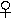 the Earth 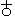.

------------------------------------------------------------------------

###### \[\[Vol. 2, Page\]\] 30 THE SECRET DOCTRINE.

also of Astrology, represented Venus in its astronomical tables as a
*Globe poised over a Cross,* and the Earth, as a *Globe under a Cross*.
The esoteric meaning of this is: "Earth fallen into generation, or into
the production of its species through sexual union." But the later
Western nations did not fail to give quite a different interpretation.
They explained this sign through their mystics -- guided by the light of
the Latin Church -- as meaning that our Earth and all on it were
redeemed *by the Cross,* while Venus (otherwise *Lucifer* or Satan) was
trampling upon it. Venus is the most occult, powerful, and mysterious of
all the planets; the one whose influence upon, and relation to the Earth
is most prominent. In exoteric Brahmanism, Venus or *Sukra --* a male
deity\* -- is the son of Bhrigu, one of the Prajapati and a Vedic sage,
and is Daitya-Guru, or the priest-instructor of the primeval giants. The
whole history of "Sukra" in the Puranas, refers to the Third and to the
Fourth Races.

"*It is through Sukra that the* '*double ones*' (*the Hermaphrodites*)
*of the Third* (Root-Race) *descended from the first* '*Sweat-born,*'"
*says the Commentary. Therefore it is represented under the symbol of
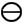 (the circle and diameter) during the Third* (*Race*)
*and of* 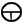 *during the Fourth.*

This needs explanation. The *diameter,* when found isolated in a circle,
stands for female nature, for the first *ideal* World, *self-generated
and self-impregnated* by the universally diffused Spirit of Life --
referring thus to the primitive Root-Race also. It becomes androgynous
as the Races and all on Earth develop into their physical forms, and the
symbol is transformed into a circle with a diameter from which runs a
vertical line: expressive of male and female, not separated as yet --
the first and earliest Egyptian *Tau* ; after which it
becomes  or male-female separated\*\* (See first pp. of
Book I) and fallen into generation. Venus (the planet) is symbolised by
the sign of a globe over the cross, which shows it as presiding over the
natural generation of man. The Egyptians symbolised *Ank*, "life," by
the ansated cross, or 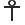, which is only another form of
Venus (Isis) 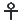, and meant, esoterically, that mankind and
all animal life bad stepped out of the divine spiritual circle and
fallen into physical male and female generation. This sign, from the end
of the Third Race, has the same phallic significance as the "*tree*

\[\[Footnote(s)\]\] -------------------------------------------------

\* In the esoteric philosophy it is male and female, or hermaphrodite;
hence the *bearded* Venus in mythology.

\*\* Therefore, putting aside its religio-metaphysical aspect, the Cross
of the Christians is symbolically far more *phallic* than the pagan
Svastica.

------------------------------------------------------------------------

###### \[\[Vol. 2, Page\]\] 31 THE HORSES OF SUKRA'S CAR.

of life" in Eden *Anouki,* a form of Isis, is the goddess of life; and
*Ank* was taken by the Hebrews from the Egyptians and introduced by
Moses, one learned in the Wisdom of the priests of Egypt, with many
other mystical words. The word *Ank* in Hebrew, with the personal
suffix, means "my life," my being, which "is the personal pronoun
Anochi," from the name of the Egyptian goddess *Anouki.\**

In one of the most ancient Catechisms of Southern India, Madras
Presidency, the hermaphrodite goddess Adanari (see also "*Indian
Pantheon*") has the ansated cross, the Svastica, the "male and female
sign," right in the central part, to denote the pre-sexual state of the
Third Race. Vishnu, who is now represented with a lotus growing out of
his navel -- or the Universe of Brahma evolving out of the central point
*Nara --* is shown in one of the oldest carvings as double-sexed (Vishnu
and Lakshmi) standing on a lotus-leaf floating on the water; which water
rises in a semicircle and pours through the Svastica, "the source of
generation" or of the descent of man.

Pythagoras calls Sukra-Venus the *Sol alter,* "the other Sun." Of the
"seven palaces of the Sun," that of Lucifer Venus is the *third* one in
Christian and Jewish Kabala, the Zohar making of it the abode of
*Samael.* According to the Occult Doctrine, this planet is our Earth's
*primary,* and its spiritual prototype. Hence, Sukra's car
(Venus-Lucifer's) is said to be drawn by an *ogdoad of* "*earth-born
horses,*" while the steeds of the chariots of the other planets are
different.

"*Every sin committed on Earth is felt by Usanas-Sukra. The Guru of the
Daityas is the Guardian Spirit of the Earth and Men. Every change on
Sukra is felt on, and reflected by, the Earth.*"

Sukra, or Venus, is thus represented as the preceptor of the Daityas,
the giants of the Fourth Race, who, in the Hindu allegory, obtained at
one time the sovereignty of all the Earth, and defeated the minor gods.
The *Titans* of the Western allegory are as closely connected with
Venus-Lucifer, identified by later Christians with Satan. Therefore, as
Venus, equally with Isis, was represented with Cow's horns on her head,
the symbol of mystic Nature, and one that is convertible with, and
significant of, the moon, since all these were lunar goddesses, the
configuration of this planet is now placed by theologians between the
horns of the mystic Lucifer.\*\* It is owing to the fanciful
interpretation of the

\[\[Footnote(s)\]\] -------------------------------------------------

\* The ansated Cross is the astronomical planetary sign of Venus,
"signifying the existence of *parturient energy* in the sexual sense,
and this was one of the attributes of Isis, the *Mother,* of Eve,
*Hauvah,* or Mother-Earth, and was so recognised among all the ancient
peoples in one or another mode of expression." (From a modern Kabalistic
**MS**.)

\*\* Athenaeus shows that the first letter of Satan's name was
represented in days of old by an arc and crescent; and some Roman
Catholics, good and kind men, would persuade the public that it is in
honour of Lucifer's crescent-like horns that Mussulmen \[\[Footnote
continued on next page\]\]

------------------------------------------------------------------------

###### \[\[Vol. 2, Page\]\] 32 THE SECRET DOCTRINE.

archaic tradition, which states that Venus changes simultaneously
(geologically) with the Earth; that whatever takes place on the one
takes place on the other; and that many and great were their common
changes -- it is for these reasons that St. Augustine repeats it,
applying the several changes of configuration, colour, and even of the
orbital paths, to that theologically-woven character of Venus-Lucifer.
He even goes so far in his pious fancy as to connect the last changes of
the planet with the Noachian and mythical Deluge alleged to have taken
place 1796 years B.C. (See "*City of God*" lxxi., ch. viii.).

As Venus has no satellites, it is stated allegorically, that "Asphujit"
(this "planet") adopted the Earth, the progeny of the Moon, "who
overgrew its parent and gave much trouble," a reference to the occult
connection between the two. The Regent (of the planet) Sukra\* loved his
adopted child so well that he incarnated as Usanas and gave it perfect
laws, which were disregarded and rejected in later ages. Another
allegory, in Harivansa, is that Sukra went to Siva asking him to protect
his pupils, the Daityas and Asuras, from the fighting gods; and that to
further his object he performed a Yoga rite "imbibing the *smoke* of
chaff with his *head downwards* for 1,000 years." This refers to the
great inclination of the axis of Venus (amounting to 50 degrees), and to
its being enveloped in eternal clouds. But it relates only to the
physical constitution of the planet. It is with its Regent, the
informing Dhyan Chohan,

\[\[Footnote(s)\]\] -------------------------------------------------

\[\[Footnote continued from previous page\]\] have chosen the Crescent
for their national arms. Venus has always been identified, since the
establishment of Roman Catholic dogmatism, with Satan and Lucifer, or
the great Dragon, contrary to all reason and logic. As shown by the
symbologists and astronomers, the association between the serpent and
the idea of darkness had an astronomical foundation. The position which
the constellation of Draco at one time occupied showed that the great
serpent was the ruler of the night. This constellation was formerly at
the very centre of the heavens, and is so extensive that it was called
the Great Dragon. Its body spreads over seven signs of the Zodiac; and
Dupuis, "who," says Staniland Wake, "sees in the Dragon of the
Apocalypse a reference to the celestial serpent," remarks that "it is
not astonishing that a constellation so extended should be represented
by the author of that book as a Great Dragon with seven heads, who drew
the third part of the stars from heaven and cast them to Earth";
(Dupuis, tome **III**., p. 255). Only Dupuis never knew *why* Draco,
once the *pole-star* -- the symbol of "Guide," Guru and director -- had
been thus degraded by posterity. "The gods of our fathers are our
devils," says an Asiatic proverb. When Draco ceased to be the
*lode-star,* the guiding sidereal divinity, it shared the fate of all
the fallen gods. Seth and Typhon was at one time, Bunsen tells us, "a
great god universally adored throughout Egypt, who conferred on the
sovereigns of the 18th and 19th Dynasties the symbols of life and power.
But subsequently, in the course of the 20th Dynasty, he is suddenly
treated as an evil Demon, insomuch that his effigies and name are
obliterated on all the monuments and inscriptions that could be
reached." The real occult reason will be given in these pages.

\* Sukra is the son of Bhrigu the great Rishi, and one of the Seven
*Prajapati,* the founder of the Race of Bhargavas, in which Parasu Rama
is born.

------------------------------------------------------------------------

###### \[\[Vol. 2, Page\]\] 33 PARENT STARS AND SISTER PLANETS.

that Occult mysticism has to deal. The allegory which states that for
killing Sukra's mother, Vishnu was cursed by him to be *reborn seven
times* on the Earth, is full of occult philosophical meaning. It does
not refer to Vishnu's Avatars, since these number nine, the tenth being
still to come, but to the Races on Earth. Venus, or Lucifer (also Sukra
and Usanas) the planet, is the light-bearer of our Earth, in both its
physical and mystic sense. The Christians knew it well in early times,
since one of the earliest popes of Rome is known by his Pontiff name as
Lucifer.

"*Every world has its parent star and sister planet. Thus Earth is the
adopted child and younger brother of Venus, but its inhabitants are of
their own kind*. . . . *All sentient complete beings* (full septenary
men or higher beings) *are furnished, in their beginnings, with forms
and organisms in full harmony with the nature and state of the sphere
they inhabit.*"*\**

"*The Spheres of Being, or centres of life, which are isolated nuclei
breeding their men and their animals, are numberless; not one has any
resemblance to its sister-companion or to any other in its own special
progeny.*"*\*\**

"*All have a double physical and spiritual nature.*"

"*The nucleoles are eternal and everlasting; the nuclei periodical and
finite. The nucleoles form part of the absolute. They are the embrasures
of that black impenetrable fortress, which is for ever concealed from
human or even Dhyanic sight. The nuclei are the light of eternity
escaping therefrom.*"

"*It is that* **L***IGHT which condenses into the forms of the* '*Lords
of Being*' *-- the first and the highest of which are, collectively,*
**J**IVATMA, *or Pratyagatma* (said figuratively to issue from
Paramatma. It is the Logos of the Greek philosophers -- appearing at the
beginning of every new Manvantara). *From these downwards -- formed from
the ever-consolidating waves of that light, which becomes on the
objective plane gross matter -- proceed the numerous hierarchies of the
Creative Forces, some formless, others having their*

\[\[Footnote(s)\]\] -------------------------------------------------

\* This is a flat contradiction of Swedenborg, who *saw,* in "the *first
Earth of the astral world,*" inhabitants *dressed as are the peasants in
Europe;* and on the *Fourth* Earth women clad as are the shepherdesses
in a *bal masque.* Even the famous astronomer Huygens laboured under the
mistaken idea that other worlds and planets have the same identical
beings as those who live on our Earth, possessing the same figures,
senses, brain-power, arts, sciences, dwellings and even to the same
fabric for their wearing apparel! (*Theorie du Monde*)*.* For the
clearer comprehension of the statement that the Earth "is the progeny of
the Moon," see Book I., stanza **VI**.

\*\* This is a modern gloss. It is added to the old Commentaries for the
clearer comprehension of those disciples who study esoteric Cosmogony
after having passed through Western learning. The earlier Glosses are
too redundant with adjectives and figures of speech to be easily
assimilated.

------------------------------------------------------------------------

###### \[\[Vol. 2, Page\]\] 34 THE SECRET DOCTRINE.

*own distinctive form, others, again, the lowest* (*Elementals*)*,
having no form of their own, but assuming every form according to the
surrounding conditions.*"

"*Thus there is but one Absolute Upadhi* (basis) *in the spiritual
sense, from, on, and in which, are built for Manvantaric purposes the
countless basic centres on which proceed the Universal, cyclic, and
individual Evolutions during the active period.*"

"*The informing Intelligences, which animate these various centres of
Being, are referred to indiscriminately by men beyond the Great Range\*
as the Manus, the Rishis, the Pitris\*\*, the Prajapati, and so on; and
as Dhyani Buddhas, the Chohans, Melhas* (fire-gods)*,
Bodhisattvas,\*\*\* and others, on this side. The truly ignorant call
them gods; the learned profane, the one God; and the wise, the
Initiates, honour in them only the Manvantaric manifestations of* THAT
*which neither our Creators* (the Dhyan Chohans) *nor their creatures
can ever discuss or know anything about. The* ABSOLUTE *is not to be
defined, and no mortal or immortal has ever seen or comprehended it
during the periods of Existence. The mutable cannot know the Immutable,
nor can that which lives perceive Absolute Life.*"

Therefore, man cannot know higher beings than his own "progenitors."
"*Nor shall he worship them,* "but he ought to learn *how* he came into
the world.

\(c\) Number Seven, the fundamental figure among all other figures in
every national religious system, from Cosmogony down to man, must have
its *raison d*'*etre.* It is found among the ancient Americans, as
prominently as among the archaic Aryans and Egyptians. The question will
be fully dealt with in the second part of this Book; meanwhile a few
facts may be given here. Says the author of the "*Sacred Mysteries among
the Mayas and Quiches, 11,500 years ago*"*\*\*\**\*:--

\[\[Footnote(s)\]\] -------------------------------------------------

\*" Beyond" the Great Range, means, in our case, India, as being the
Trans-Himalayan region for the Cis-Himalayan region.

\*\* The term Pitris is used by us in these Slokas to facilitate their
comprehension, but it is not so used in the original Stanzas, where they
have distinct appellations of their own, besides being called "Fathers"
and "Progenitors."

\*\*\* It is erroneous to take literally the *worship* of the human
Bodhisattvas, or Manjusri. It is true that, exoterically, the Mahayana
school teaches adoration of these without distinction, and that
Huien-Tsang speaks of some disciples of Buddha as being worshipped. But
esoterically it is not the disciple or the learned Manjusri *personally*
that received honours, but the divine Bodhisattvas and Dhyani Buddhas
that animated (*Amilakha*, as the Mongolians say) the human forms.

\*\*\*\* The author of this work is Augustus Le Plongeon. He and his
wife are well known in the United States for their untiring labours in
Central America. It is they who discovered the sepulchre of the royal
Kan Coh, at Cichen-Itza. The author \[\[Footnote continued on next
page\]\]

------------------------------------------------------------------------

###### \[\[Vol. 2, Page\]\] 35 THE "SEVEN" MYSTERY.

"Seven seems to have been the sacred number *par excellence* among all
civilised nations of antiquity. Why? Each separate people has given a
different explanation, according to the peculiar tenets of their
(*exoteric*) religion. That it was the *number of numbers for those
initiated into the sacred mysteries, there can be no doubt.* Pythagoras
. . . calls it the 'Vehicle of Life' containing body and soul, since it
is formed of a Quaternary, that is Wisdom and intellect, and of a
*Trinity* or *action and matter.* The Emperor Julian, '*In matrem,
etc.,'* expresses himself thus: 'Were I to touch upon the initiation
into our Sacred Mysteries, which the Chaldees Bacchized, respecting the
*seven-rayed* god, lighting up the soul through him, I should say things
unknown to the rabble, very unknown, but well known to the blessed
Theurgists.' " (p. 141).

And who, acquainted with the Puranas, the Book of the Dead, the
Zendavesta, the Assyrian tiles, and finally the Bible, and who has
observed the constant occurrence of the number seven, in these records
of people living from the remotest times unconnected and so far apart,
can regard as a coincidence the following fact, given by the same
explorer of ancient Mysteries? Speaking of the prevalence of seven as a
mystic number, among the inhabitants of the "Western continent" (of
America), he adds that it is not less remarkable. For: --

"It frequently occurs in the *Popul-vuh* . . . we find it besides in the
*seven families* said by Sahagun and Clavigero to have accompanied the
mystical personage named *Votan,* the reputed founder of the great city
of Nachan, identified by some with Palenque. In the *seven caves\** from
which the ancestors of the Nahuatl are reported to have emerged. In the
*seven cities* of Cibola, described by Coronado and Niza. . . . In the
*seven Antilles;* in the *seven heroes* who, we are told, escaped the
Deluge . . . ."

"Heroes," moreover, whose number is found the same in every "Deluge"
story -- from the seven Rishis who were saved with Vaivasvata Manu, down
to Noah's ark, into which beasts, fowls, and living creatures were taken
by "Sevens." Thus we see the figures 1, 3, 5, 7, as perfect, because
thoroughly mystic, numbers playing a prominent part in every Cosmogony
and evolution of living Beings. In China, 1, *3, 5, 7,* are called
"celestial numbers" in the canonical "*Book of Changes.*" (*Yi King*, or
*transformation,* as in "Evolution").

The explanation of it becomes evident when one examines the ancient

\[\[Footnote(s)\]\] -------------------------------------------------

\[\[Footnote continued from previous page\]\] seems to believe and to
seek to prove that the esoteric learning of the Aryans and the Egyptians
was derived from the Mayas. But, although certainly coeval with Plato's
Atlantis, the Mayas belonged to the Fifth Continent, which was preceded
by Atlantis and Lemuria.

\* These *seven caves, seven cities,* etc., etc., stand in every case
for the seven centres, or zones, upon which the seven primitive groups
of the first Root-race were born.

------------------------------------------------------------------------

###### \[\[Vol. 2, Page\]\] 36 THE SECRET DOCTRINE.

Symbols: all these are based upon and start from the figures given from
the Archaic Manuscript in the proem of Book I. , the
symbol of evolution and fall into generation or matter, is reflected in
the old Mexican sculptures or paintings, as it is in the Kabalistic
Sephiroth, and the Egyptian *Tau.* Examine the Mexican **MSS** (*Add.
MSS.* Brit. Mus. 9789)\*; you will find in it a tree whose trunk is
covered with *ten* fruits ready to be plucked by a male and female, one
on each side of it, while from the top of the trunk two branches shoot
horizontally to the right and left, thus forming a perfect
 (tau), the ends of the two branches, moreover, each
bearing a triple bunch, with a bird -- the bird of immortality, Atman or
the divine Spirit -- sitting between the two, and thus making the
*seventh.* This represents the same idea as the Sephirothal Tree,*ten in
all,* yet, when separated from its upper triad, leaving *Seven*. These
are the celestial fruits, the ten or 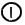 10, born out of
the two invisible male and female seeds, making up the 12, or the
Dodecahedron of the Universe. The mystic system contains the
, the central point; the 3 or ; the
five, , and the seven or , or again
; the triangle in the square and the synthesizing point
in the interlaced double triangles. This for the world of the
archetypes. The phenomenal world receives its culmination and the reflex
of all in **M**AN. Therefore he is the mystic square -- in his
metaphysical aspect -- the *Tetraktis;* and becomes the *Cube*on the
creative plain. His symbol is the cube unfolded\*\* and 6 becoming 7, or
the 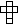 *three* crossways (the female) and *four*
vertically; and this is man, the culmination of the deity on Earth,
whose body is the cross of flesh, *on, through,*and *in* which he is
ever crucifying and putting to death the divine Logos or his **H**IGHER
**S**ELF.

"The universe," says every Philosophy and Cosmogony, "hath a Ruler
(Rulers collectively) set over it, which is called the **W**ORD (Logos);
the fabricating Spirit is its Queen: which two are the *First Power*
after the **O**NE."

These are the Spirit and Nature, which two form our illusory universe.
The two inseparables remain in the *Universe of Ideas* so long as it
lasts, and then merge back into Parabrahm, the One ever changeless. "The
Spirit, whose essence is eternal, one and self-existent," emanates a
pure ethereal LIGHT -- a dual light not perceptible to the elementary
senses -- in the Puranas, in the Bible, in the Sepher

\[\[Footnote(s)\]\] -------------------------------------------------

\* The engraving is reproduced in the "*Sacred Mysteries of the Mayas
and Quiches*" on p. 134.

\*\* See "*Source of Measures*" p. 50 to 53 and also Book II. Part 2.

------------------------------------------------------------------------

###### \[\[Vol. 2, Page\]\] 37 THE THREE KINDS OF LIGHT.

Jezirah, the Greek and Latin hymns, in the Book of Hermes, in the
Chaldean Book of Numbers, in the esotericism of Lao-tse, everywhere. In
the Kabala, which explains the secret meaning of Genesis, this light is
the DUAL-MAN, or the Androgyne (rather the sexless) angels, whose
generic name is **A**DAM **K**ADMON. It is they who complete man, whose
ethereal form is emanated by other divine, but far lower beings, who
solidify the body with clay, or the "dust of the ground" -- an allegory
indeed, but as scientific as any Darwinian evolution and more *true*.

The author of the "*Source of Measures*" says that the foundation of the
Kabala and all its mystic books is made to rest upon the *ten
Sephiroth;* which is a fundamental truth.\* He shows these ten Sephiroth
or the ten numbers in the following diagram: --

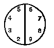

wherein the circle is the *naught,* its vertical diameter line is the
first or primal ONE (the *Word* or *Logos*)*,* from which springs the
series of the other numbers up to 9, the limit of the digits. The 10 is
the first Divine Manifestation\*\* containing "every possible power of
exact expression of proportion." By this Kabalistic speculation we are
taught that the Sephiroth "were the numbers or emanations of the
Heavenly Light (figures 20612 to 6561), they were the 10 'Words,' DBRIM,
41224, the light, of which they were the flux, was the Heavenly Man, the
Adam KDM (the 144- 144); and the Light, by the New Testament or Covenant
(or 41224) created God; just as, by the Old Testament God (Alhim, 31415)
creates light (20612 to 6561)."

Now there are three kinds of light in Occultism, as in the Kabala. (1)
The Abstract and Absolute Light, which is Darkness; (2) The Light of the
Manifested-Unmanifested, called by some the Logos; and (3) The latter
light reflected in the Dhyan Chohans, the minor *logoi* (the Elohim,
collectively), who, in their turn, shed it on the objective Universe.
But in the Kabala -- re-edited and carefully adjusted to fit the
Christian tenets by the Kabalists of the **XIII**. century -- the three
lights are described as: -- (1) The clear and penetrating, that of
Jehovah; (2) reflected light; and (3) light in the *abstract.*" This
light abstractly taken (in a metaphysical or symbolical sense) is Alhim
(Elohim God),

\[\[Footnote(s)\]\] -------------------------------------------------

\* See "*Masonic Review,*" Cincinnati, June 1886, Art. Kabala No. 6.

\*\* See "*Isis Unveiled,*" Vol. II., pp. 300 *et seq.,* for a proof of
the antiquity of the decimal system of figures.

------------------------------------------------------------------------

###### \[\[Vol. 2, Page\]\] 38 THE SECRET DOCTRINE.

while the clear penetrating light is Jehovah. The light of Alhim belongs
to the world in general, in its allness and general fulness, but the
light of Jehovah is that pertaining to the chiefest production, man,
whom this light penetrated and made." The author of the "*Source of
Measures*" pertinently refers the reader to Inman's "*Ancient Faiths
embodied in Ancient Names,*" vol. ii., p. 648. There, an engraving of
"the *vesica piscis,* Mary and the female emblem, copied from a rosary
of the blessed Virgin . . . . printed at Venice, 1542," and therefore,
as Inman remarks, "with a license from the Inquisition, consequently
orthodox," will show the reader what the Latin Church understood by this
"*penetrating power of light and its effects* " How sadly disfigured --
applied as they were to the grossest anthropomorphic conceptions -- have
become, under Christian interpretation, the noblest and grandest, as the
most exalted, ideas of deity of the Eastern philosophy!

The Occultists call this light *Daiviprakriti* in the East, and light of
*Christos* in the West. It is the light of the LOGOS, the direct
reflection of the ever Unknowable on the plane of Universal
manifestation. But here is the interpretation thereof given by the
modern Christians from the Kabala. As declared by the author just cited:
--

"To the fulness of the world in general with its chiefest content, man,
the term Elohim-Jehovah applies. In extracts from the *Zohar,* the Rev.
Dr. Cassell (a Kabalist), to prove that the Cabbalah sets forth the
doctrine of the Trinity, among other things says: 'Jehovah is Elohim
(Alhim) . . . by three steps God (Alhim), and Jehovah become the same,
and though separated each and together, they are of the same one.'"
Similarly, Vishnu becomes the Sun, the visible symbol of the impersonal
deity. Vishnu is described as "striding through the seven regions of the
Universe in *three steps.*" But with the Hindus this is an *exoteric*
account, a surface tenet and an allegory, while the Kabalists give it
out as the esoteric and final meaning. But to proceed: --

"Now light," explains the author, "as shown, is 20612 to 6561, as the
proper enunciation of the integral and numerical relation of diameter to
circumference of a circle. God (Alhim, *i.e*., 3.1415 to one, a modified
form of the above) is the reduction of this, so as to obtain a standard
unit*one,*as the basis, in general, of all calculation and all
mensuration. But, for the production of animal life, and for especial
*time measure* or the lunar year, that influence which causes conception
and embryotic development, the numbers of the Jehovah measure ('*man
even Jehovah*' measure), viz. 113 to 355, have to be specialised.\* But
this last ratio is but a modified form of light or 20612 to 6561, as a
'\[\[*pi*\]\]' *value,* being only a variation of the same (that is
20612 to 6561 is 31415 to one, or Alhim or God) -- and in such a manner
that one can be made

\[\[Footnote(s)\]\] -------------------------------------------------

*\* See* "*Source of Measures,*" pp. 276, *et seq.* App. **VII.**

------------------------------------------------------------------------

###### \[\[Vol. 2, Page\]\] 39 THE NUMBERS OF CREATION.

to flow into and be derived from the other, and these are the three
steps by which the *Unity* and sameness can be shown of the divine
names. That is, the two are but variations of the same ratio, viz., that
of '\[\[pi\]\].' The object of this comment is to show the same
measuring use for the Cabbalah as was employed in the three Covenants of
the Bible, and in the symbols of Masonry, as just noticed."

"First then, the Sephiroth are described as *Light,* that is, they
themselves are a function of, indeed, the same as, the manifestation of
Ain Soph; and they are so from the fact that *Light* represents the
ratio of 20612 to 6561, as part of the 'Words,' DBRIM, 41224, or as to
the Word, Debar, 206 (= 10 cubits). *Light* is so much the burden of the
Kabbalah, in explaining the Sephiroth, that the most famous book on the
Kabbalah is called *Zohar* or *Light.* In this we find expressions of
this kind: -- 'The Infinite was entirely unknown and diffused no light
before the luminous point violently broke through into vision . . . .'
'When he first assumed the form (of the Crown, or the first Sephira), he
caused 9 splendid lights to emanate from it, which, shining through it,
diffused a bright light in all directions': that is, these 9 with his
one (which was the origin, as above, of the nine), together made the 10,
that is  or , or *the sacred Ten*
(*numbers or Sephiroth*)*,* or *Jod -*- and these numbers were '*the
Light.*' Just as in the Gospel of St. John, God (Alhim, 31415 to one)
was that light (20612 to 6561) by which (Light) all things were made."

In *Sepher Jezirah,* or Numbers of Creation, the whole process of
evolution is given out in Numbers. In its "32 paths of Wisdom" the
number 3 is repeated four times, and the number 4 five times. Therefore,
the Wisdom of God is contained in numbers (Sephrim or Sephiroth), for
Sepher (or S-ph-ra when unvowelled) means "to cipher." And therefore,
also, we find Plato stating that the deity *geometrizes* in fabricating
the Universe.

The Kabalistic book, the Sepher Jezirah, opens with a statement of the
hidden wisdom of *Alhi* in *Sephrim, i.e ,* the Elohim in the Sephiroth.

"In thirty and two paths, hidden wisdom, established Jah, JHVH,
Tzabaoth, Elohi of Israel, Alhim of Life, El of Grace and Mercy --
exalted, uplifted Dweller on high, and King of Everlasting, and his name
-- Holy! in three Sephrim: viz: -- B-S'ph-r, V-S'ph-r, V-Siph-o-r."

"This Comment sets forth 'the *Hidden Wisdom*' of the original text by
hidden Wisdom, that is, by the use of words carrying a special set of
Numbers and a special phraseology, which will set forth the very
explanatory system which we find to fit so accurately in the Hebrew
Bible. . . . . In setting forth his scheme, to enforce it, and to finish
out his detailed exposition in a general postulate, viz., the one word

------------------------------------------------------------------------

###### \[\[Vol. 2, Page\]\] 40 THE SECRET DOCTRINE.

*Sephrim* (*Sephiroth*) of the Number Jezirah, the author explains the
separation of this word in the three subordinate ones, a play upon a
common word *s-ph-r,* or number."

The prince Al-Chazari says to the Rabbi\*: -- "I wish now that thou
wouldest impart to me some of the chiefest or leading principles of
Natural Philosophy, which as thou sayest were in former times worked out
by them (the Ancient Wise Ones)"; to which the Rabbi makes answer: --
"To such principles appertains the Number of Creation of our Race-father
Abraham" (that is Abram and Abraham, or numbers 41224 and 41252). He
then says that this book of Number treats of teaching the *Alhim-ness*
and *One-ness* through, "DBRIM," viz., the numbers of the Word
"*Words.*" That is, it teaches the use of the ratio 31415 to one,
through 41224, which last, in the description of the Ark of the
Covenant, was divided into two parts by two tables of stone, on which
these, DBRIM or 41224, were written or engraved -- or 20612 by 2. He
then comments on these three subordinately used words, and takes care as
to one of them to make the comment: -- "And *Alhim* (31415 to 1) said:
Let there be Light (20612 to 6561)."

The three words as given in the text are: 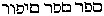. And the
Rabbi in commenting upon them says: "It teaches the *Alhim-ness* (31415)
and One-ness (the diameter to Alhim) through Words (**DBRIM,** 41224),
by which on the one side there is infinite expression in heterogeneous
creations, and on the other a final harmonic tendency to *One-ness*"
(which as everyone knows is the mathematical function of "\[\[*pi*\]\]"
of the schools, which measures, and weighs and numbers the stars of
heaven, and yet resolves them back into the final Oneness of the
Universe through Words). "Their final accord perfects itself in that
Oneness that ordains them and which consists in 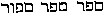 (Book
of Al-Chazari), that is the Rabbi, in his first comment, leaves the jod,
or *i*, out of one of the words, whereas afterwards he restores it
again. If we take the values of those subordinate words, we find them to
be 340, 340, 346; together these are 1026, and the division of the
general word into these has been to produce these numbers, which by
Temurah may be changed in various ways for various purposes." (Kabala.)

The reader is asked to turn to Stanza **IV**. of Book I. and its fourth
commentary to find that the 3, 4 -- (7), and the thrice seven, or 1065,
the number of Jehovah, is the number of the 21 Prajapati mentioned in
the Mahabharata, or the three *Sephrim* (words in cipher or figures).
And this comparison between the Creative Powers of Archaic philosophy
and the anthropomorphic Creator of *exoteric* Judaism (since their
esotericism shows its identity with the Secret Doctrine) will lead the
student to perceive and discover that, in truth, Jehovah is but a
*lunar* and

\[\[Footnote(s)\]\] -------------------------------------------------

\* In the "*Book Al-Chazari*" by Jehuda-ha-Levi, translated by Dr. D.
Cassell.

------------------------------------------------------------------------

###### \[\[Vol. 2, Page\]\] 41 THE EMANATIONS OF AIN-SOPH.

"generation" god. (See Book I, Part 2*,* "*Deus Lunus.*") It is a fact
well known to every conscientious student of the Kabala, that the deeper
he dives into it, the more he feels convinced that unless the Kabala --
or what is left of it -- is read by the light of the Eastern esoteric
philosophy, its study leads only to the discovery that, on the lines
traced by exoteric Judaism and Christianity, the monotheism of both is
nothing more exalted than ancient Astrolatry, now vindicated by modern
Astronomy. The Kabalists never cease to repeat that *primal
intelligence* can never be understood. It cannot be comprehended, nor
can it be located, therefore it has to remain nameless and negative.
Hence the Ain-Soph -- the "UNKNOWABLE" and the "UNNAMEABLE" -- which, as
*it* could not be made manifest, was conceived to emanate manifesting
Powers. It is then with its *emanations alone that human intellect has
to, and can deal.* Christian theology, having rejected the doctrine of
emanations and replaced them with direct, conscious creations of angels
and the rest out of *nothing,* now finds itself hopelessly stranded
between Supernaturalism, or miracle, and materialism. An *extra*-cosmic
god is fatal to philosophy, an *intra*-cosmic Deity -- *i.e.* Spirit and
matter inseparable from each other -- is a philosophical necessity.
Separate them and that which is left is a gross superstition under a
mask of emotionalism. But why "geometrize," as Plato has it, why
represent these emanations under the form of an immense arithmetical
table? The question is well answered by the author just cited. His
remarks are quoted in Part II., § "*The Theogony of the Creative Gods.*"

"Mental perception," he says, "to become physical perception, must have
the Cosmic principle of *light*: and by this, our mental circle must
become visible through light; or, for its complete manifestation, the
Circle must be that of physical visibility, or Light itself. Such
conceptions, thus formulated, became the groundwork of the philosophy of
the divine manifesting in the Universe."

This is philosophy. It is otherwise when we find the Rabbi in
*Al-Chazari* saying that "under s'ph-r is to be understood *calculation*
and *weighing* of created bodies. For the *calculation,* by means of
which a body must be constructed in harmony or symmetry, by which it
must be in construction rightly arranged and made to correspond to the
object in design, consists at last in *number, extension, mass, weight;*
co-ordinate relation of movements, then harmony of music, must consist
altogether by number, that is (S'ph-r). . . By Sippor (s'phor) is to be
understood the words of Alhim whereunto joins or adapts itself the
design of the frame or form of construction; for example, it was said
'Let Light be.' The *work became as the* WORDS *were spoken,* that is,
as the numbers of the work came forth. . . . ."

This is *materialising the Spiritual* without scruple. But the Kabala

------------------------------------------------------------------------

###### \[\[Vol. 2, Page\]\] 42 THE SECRET DOCTRINE.

was not always so well adapted to anthropo-monotheistic conceptions.
Compare this with any of the six schools of India. For instance, in
Kapila's "Sankhya" Philosophy, unless, allegorically speaking, Purusha
mounts on the shoulders of Prakriti, the latter remains irrational,
while the former remains inactive without her. Therefore Nature (in man)
must become a compound of Spirit and Matter before he becomes what he
is; and the Spirit latent in Matter must be awakened to life and
consciousness gradually. The Monad has to pass through its mineral,
vegetable and animal forms, before the Light of the Logos is awakened in
the animal man. Therefore, till then, the latter cannot be referred to
as "MAN," but has to be regarded as a Monad imprisoned in ever changing
forms. *Evolution,* not *creation,* by means of WORDS is recognized in
the philosophies of the East, even in their exoteric records. *Ex
oriente lux*. Even the name of the first man in the Mosaic Bible had its
origin in India, Professor Max Muller's negation notwithstanding. The
Jews got their Adam from Chaldea; and Adam-Adami is a compound word and
therefore a manifold symbol, and proves the occult dogmas.

This is no place for philological disquisitions. But the reader may be
reminded that the words *Ad* and *Adi* mean in Sanskrit "the first"; in
Aramaean, "One" (*Ad-ad,* "the only one"); in Assyrian, "father" whence
*Ak-Ad* or "father-creator."\* And once the statement is found correct
it becomes rather difficult to confine Adam to the Mosaic Bible alone,
and to see therein simply a Jewish name. *Vide* Part II. of this Volume,
§ "Adam-Adami."

There is frequent confusion in the attributes and genealogies of the
gods in their theogonies, as given to the world by the half-initiated
writers, Brahmanical and Biblical, the Alpha and the Omega of the
records of that symbolical science. Yet there could be no such confusion
made by the earliest nations, the descendants and pupils of the divine
instructors: for both the attributes and the genealogies were
inseparably linked with cosmogonical symbols, the "gods" being the life
and animating "soul-principle" of the various regions of the Universe.
Nowhere and by no people was speculation allowed to range *beyond* those
*manifested* gods. The boundless and infinite UNITY remained with every
nation a virgin forbidden soil, untrodden by man's thought,

\[\[Footnote(s)\]\] -------------------------------------------------

\* The appellation *Ak-ad* (or Akkadians) is of the same class as *Ad-m,
Ha-va* (Eve), *AEd-en* (Eden); Ak-Ad meaning "Son of *Ad*" (like the
sons of Ad in Ancient Arabia). *Ad-ad,* the "Only One" and the First,
was the *Ad-on* or "Lord" of Syria and consort of *Ad-ar-gat* or
Aster't, the Syrian goddess. And Gan-AEden (Eden) or Gandunia was
Babylonia and Mesopotamia. In Assyrian *Ak* meant Creator, the letter K
pronounced Kh (Ah) gutturally. According to Swedenborg's mysticism Adam
was not a man but a church (?) of primitive light. In the Vedas *Ad*-iti
is the primitive light, the Akasa of the phenomenal world.

------------------------------------------------------------------------

###### \[\[Vol. 2, Page\]\] 43 ADAM-ADAMI.

untouched by fruitless speculation. The only reference made to it was
the brief conception of its diastolic and systolic property, of its
periodical expansion or dilatation, and contraction. In the Universe
with all its incalculable myriads of systems and worlds disappearing and
re-appearing in eternity, the anthropomorphised powers, or gods, their
Souls, had to disappear from view with their bodies: -- "The breath
returning to the eternal bosom which exhales and inhales them," says our
Catechism.

"*Ideal nature,*" the abstract Space in which everything in the Universe
is mysteriously and invisibly generated, is the same female side of
procreative power in Nature in the Vedic as in every other Cosmogony.
Aditi is Sephira, and the Sophia-Achamoth of the Gnostics, and Isis, the
virgin Mother of Horus. In every Cosmogony, behind and higher than the
*creative* deity, there is a superior deity, a planner, an Architect,
*of whom* the Creator is but the executive agent. And still higher,
*over* and *around, within* and *without,* there is the UNKNOWABLE and
the *unknown,* the Source and Cause of all these Emanations. . . . .

It thus becomes easy to account for the reason why "*Adam-Adami*" is
found in the Chaldean scripture, certainly earlier than the Mosaic
Books. In Assyrian *Ad* is the father, and in Aramaean *Ad* is "One,"
and *Ad-ad* the "only one," while *Ak* is in Assyrian "creator." Thus
*Ad-am-ak-ad-mon* became Adam Kadmon in the Kabala (*Zohar*)*,* meaning
as it did, the "One (Son) of the divine Father, or the creator," for the
words "*am*" and "*om*" meant at one time in nearly every language the
*divine,* or the *deity.* Thus Adam Kadmon and Adam-Adami came to mean:
-- "The first emanation of the Father-Mother or divine nature," and
literally "the first divine one." And it is easy to see that *Ad*-Argat
(or *Aster*'*t,* the Syrian goddess, the consort of *Ad-on,* the lord
god of Syria or the Jewish Adonai), and Venus, Isis, Ishtar, Mylitta,
Eve, etc., etc., are identical with the *Aditi* and Vach of the Hindus.
They are all the "Mothers of all living" and "of the gods." On the other
hand -- cosmically and astronomically -- all the male gods became at
first "Sun-gods," then, theologically, the "Suns of Righteousness" and
the Logoi, all symbolised by the Sun.\* They are all *Protogonoi* (the
first-born) and

\[\[Footnote(s)\]\] -------------------------------------------------

\* Adam-Jehovah, Brahma and Mars are, in one sense, identical; they are
all symbols for primitive or initial *generative powers* for the
purposes of human procreation. Adam is red, and so also are Brahma-Viraj
and Mars -- god and planet. Water is the blood of the Earth; therefore,
all these names are connected with Earth and Water. "It takes *earth and
water* to create a *human* soul," says Moses. Mars is identical with
*Kartikeya* God of War (in one sense) -- which god is born of the Sweat
of Siva, *Siva Gharmaja* and the Earth. In the Mahabharata he is shown
as born without the intervention of a woman. And he is also called
"Lohita," the *red*, like Adam, and the other "first men." Hence, the
author of "*The Source of Measures*" is quite right in thinking that
Mars (and all the other gods of like attributes), "being the *god of
war* and of \[\[Footnote continued on next page\]\]

------------------------------------------------------------------------

###### \[\[Vol. 2, Page\]\] 44 THE SECRET DOCTRINE.

*Mikroprosopoi.* With the Jews Adam Kadmon was the same as Athamaz,
Tamaz, or the Adonis of the Greeks -- "the One *with,* and *of* his
father" -- the "Father" becoming during the later Races *Helios,* the
Sun, as Apollo *Karneios,\** for instance, who was the "Sun born";
Osiris, Ormazd, and so on, were all followed by, and found themselves
transformed later on into still more earthly types: such as Prometheus,
the crucified of Mount Kajbee, Hercules, and so many others, sun-gods
and heroes, until all of them came to have no better significance than
phallic symbols.

In the *Zohar* is *i*t said "Man was created by the Sephiroth
(Elohim-Javeh, also) and they engendered by common power the *earthly*
Adam." Therefore in *Genesis* the Elohim say: -- "Behold Man is become
*as one of us.*" But in Hindu Cosmogony or "Creation," Brahma-Prajapati
*creates* Viraj and the Rishis, spiritually; therefore the latter are
distinctly called "the Mind-born Sons of Brahma"; and this specified
mode of *engendering* precluded every idea of *Phallicism,* at any rate
in the earlier human nations. This instance well illustrates the
respective *spirituality* of the two nations.

-------

3\. **S**AID THE "**L**ORD OF THE SHINING **F**ACE." "**I** SHALL SEND
THEE A FIRE WHEN THY WORK IS COMMENCED. **R**AISE THY VOICE TO OTHER
**L**OKAS, APPLY TO THY **F**ATHER THE **L**ORD OF THE **L**OTUS
(*Kumuda-Pati*) (*a*) FOR HIS **S**ONS . . . . **T**HY PEOPLE SHALL BE
UNDER THE RULE OF THE **F**ATHERS (*Pitri-pati*)*.* **T**HY MEN SHALL BE
MORTALS. **T**HE MEN OF THE **L**ORD OF **W**ISDOM (*Budha, Mercury*)
NOT THE SONS OF **S**OMA (*the Moon*) ARE IMMORTAL. **C**EASE THY
COMPLAINTS (*b*). **T**HY SEVEN SKINS ARE YET ON THEE. . . . **T**HOU
ART NOT READY. **T**HY MEN ARE NOT READY (*c*).

(*a*) *Kumuda-Pati* is the Moon, the Earth's parent, in his region of
Soma-loka. Though the Pitris (Pitar or "Fathers") are sons of the Gods,
elsewhere sons of Brahma and even Rishis, they are generally known as
the "lunar" ancestors.

(*b*) Pitri-pati is the lord or king of the *Pitris,* Yama, the god of
Death and the Judge of mortals. The men of Budha (Mercury) are

\[\[Footnote(s)\]\] -------------------------------------------------

\[\[Footnote continued from previous page\]\] *bloodshed,* was but a
secondary idea flowing out of the primary one of shedding of blood in
*conception* for the first time." Hence Jehovah became later a
*fighting* god, "Lord of Hosts," and one who commands war. He is the
aggressive *Zodh* *--* or Cain by permutation who *slew* his (female)
"*brother,*" whose "blood crieth from the ground," the *Earth* having
opened *her mouth* to receive *the blood.* (*Genesis* iii*.*)

\* Apollo *Karneios* is certainly a Greek transformation from the Hindu
Krishna *Karna*. "Karna" means *radiant* from "carne," "*a ray,*" and
*Karneios,* which was a title of Apollo with the Celts as with the
Greeks, meant "Sun born."

------------------------------------------------------------------------

###### \[\[Vol. 2, Page\]\] 45 THE FIRST WAR IN HEAVEN.

metaphorically *immortal* through their Wisdom. Such is the common
belief of those who credit every star or planet with being inhabited.
(And there are men of science -- M. Flammarion among others -- who
believe in this fervently, on logical as well as on astronomical data).
The Moon being an inferior body to the Earth even, to say nothing of
other planets, the terrestrial men produced by her sons -- the lunar men
or "ancestors" -- from her shell or body, cannot be immortal. They
cannot hope to become real, self-conscious and intelligent men, unless
they are *finished,* so to say, by other creators. Thus in the Puranic
legend, the son of the Moon (*Soma*) is *Budha* (Mercury), "the
intelligent" and the Wise, because he is the offspring of Soma, the
"regent" of the visible Moon, not of Indu, the physical Moon. Thus
Mercury is the elder brother of the Earth, metaphorically -- his
step-brother, so to say, the offspring of *Spirit* -- while she (the
Earth) is the progeny of the *body.* These allegories have a deeper and
more scientific meaning (astronomically and geologically) thA

n our modern physicists are willing to admit. The whole cycle of the
"first War in Heaven," the Taraka-maya, is as full of philosophical as
of Cosmogonical and astronomical truths. One can trace therein the
biographies of all the planets by the history of their gods and rulers.
Usanas (Sukra, or Venus), the bosom-friend of Soma and the foe of
Brihaspati (Jupiter) the instructor of the gods, whose wife Tara (or
Taraka) had been carried away by the Moon, *Soma --* "of whom he begat
Budha" -- took also an active part in this war against "the gods" and
forthwith was degraded into a *demon* (Asura) deity, and so he remains
to this day.\*

Here the word "men" refers to the celestial men, or what are called in
India the PITAR or *pitris,* the Fathers, the progenitors of men. This

\[\[Footnote(s)\]\] -------------------------------------------------

\* Usanas-Sukra or Venus is our "Lucifer," the morning star, of course.
The ingenuity of this allegory in its manifold meanings is great indeed.
Thus *Brihaspati* (the planet Jupiter) or Brahmanaspati is, in the Rig
Veda, a deity who is the symbol and the prototype of the *exoteric* or
ritualistic worship. He is priest sacrificer, suppliant, and the medium
through which the prayers of mortals reach the gods. He is the
*Purohita* (family priest, or Court Chaplain) of the Hindu Olympus and
the spiritual *Guru* of the Gods. Soma is the mystery god and presides
over the mystic and occult nature in man and the Universe. Tara, the
priest's wife, who symbolizes the worshipper, prefers esoteric truths to
their mere shell, exotericism; hence she is shown as carried off by
Soma. Now Soma is the sacred juice of that name, giving mystic visions
and trance revelations, the *result of which union is Budha* (Wisdom),
Mercury, Hermes, etc., etc.; that science in short which to this day is
proclaimed by the Brihaspatis of Theology as devilish and *Satanic.*
What wonder that by expanding the cycle of this allegory we find
Christian theology espousing the quarrel of the Hindu gods, and
regarding *Usanas* (Lucifer), who helped Soma against that ancient
personification of ritualistic worship (Brahmanaspati, the lord of the
Brahmans, now become "Jupiter-Jehovah") as **S**ATAN, the "enemy of
God"!

------------------------------------------------------------------------

###### \[\[Vol. 2, Page\]\] 46 THE SECRET DOCTRINE.

does not remove the seeming difficulty, in view of modern hypotheses, of
the teaching, which shows these progenitors or ancestors creating the
first human Adams out of their sides: as astral shadows. And though it
is an improvement on Adam's rib, still geological and climatic
difficulties will be brought forward. Such, however, is the teaching of
Occultism.

(*c*) Man's organism was adapted in every race to its surroundings. The
first Root-Race was as ethereal as ours is material. The progeny of the
seven Creators, who evolved the seven primordial Adams,\* surely
required no purified gases to breathe and live upon (see Part **III**.
of this Volume). Therefore, however strongly the impossibility of this
teaching may be urged by the devotees of modern science, the Occultist
maintains that the case was as stated *aeons of years* before even the
evolution of the Lemurian, the first physical man, which itself took
place 18,000,000 years ago.\*\*

Preliminary evolution is described in one of the **B**OOKS OF **D**ZYAN
and the Commentaries thereon in this wise: --

Archaic Scripture teaches that at the commencement of every local Kalpa,
or Round, the earth is reborn; "as the human *Jiva* (monad), when
passing into a new womb, gets re-covered with a new body, so does the
Jiva of the Earth; it gets a more perfect and solid covering with each
Round after re-emerging once more from the matrix of space into
objectivity" (Comment). This process is attended, of course, by the
throes of the new birth or geological convulsions.

Thus the only reference to it is contained in one verse of the volume of
the *Book of Dzyan* before us, where it says:

--------

4\. **A**ND AFTER GREAT THROES SHE (*the Earth*) CAST OFF HER OLD THREE
AND PUT ON HER NEW SEVEN SKINS, AND STOOD IN HER FIRST ONE (*a*)*.*

(*a*) This refers to the growth of the Earth, whereas in the Stanza
treating of the First Round it is said (given in the Commentary): --

"*After the changeless* (avikara) *immutable nature* (Essence,
sadaikarupa) *had awakened and changed* (differentiated) *into* (a state
of) *causality* (avayakta)*, and from cause* (Karana) *had become its
own discrete effect* (vyakta), *from invisible it became visible. The
smallest of the small* (the most atomic of

\[\[Footnote(s)\]\] -------------------------------------------------

\* As shown elsewhere, it is only the "Heavenly Man," Adam Kadmon, of
the first chapter of *Genesis,* who is made "in the image and likeness
of God." Adam, of chapter ii., is not said to be made in that *image*
nor in the divine likeness, before he ate of the forbidden fruit. The
former Adam is the Sephirothal Host; the second Adam is the Mindless
first human Root-race; the third Adam is the race that separated, whose
eyes are opened.

\*\* For a discussion of the scientific objections to the views and
figures here enunciated, the reader is referred to the Addenda, which
form Part **III**. of this book.

------------------------------------------------------------------------

###### \[\[Vol. 2, Page\]\] 47 NARADA AND ASURAMAYA.

atoms, or aniyamsam aniyasam) *became* *one and the many* (ekanekarupa);
*and producing the Universe produced also the Fourth Loka* (our Earth)
*in the garland of the seven lotuses. The Achyuta then became the
Chyuta.\**

The Earth is said to cast off her old *three* skins, because this refers
to the three preceding Rounds she has already passed through; the
present being the *fourth* Round out of the seven. At the beginning of
every new **R**OUND, after a period of "obscuration," the earth (as do
also the other six "earths") casts off, or is supposed to cast off, her
old skins as the Serpent does: therefore she is called in the
*Aitareya-Brahmana* the *Sarpa Rajni,* "the Queen of the Serpents," and
"the mother of all that moves." The "Seven Skins," in the first of which
she now stands, refer to the seven geological changes which accompany
and correspond to the evolution of the Seven Root-Races of Humanity.

Stanza **II**., which speaks of this Round, begins with a few words of
information concerning the age of our Earth. The chronology will be
given in its place. In the Commentary appended to the Stanza, two
personages are mentioned: Narada and Asura Maya, especially the latter.
All the calculations are attributed to this archaic celebrity; and what
follows will make the reader superficially acquainted with some of these
figures.

--------

**T**WO **A**NTEDILUVIAN **A**STRONOMERS.

To the mind of the Eastern student of Occultism, two figures are
indissolubly connected with mystic astronomy, chronology, and their
cycles. Two grand and mysterious figures, towering like two giants in
the Archaic Past, emerge before him, whenever he has to refer to Yugas
and Kalpas. When, at what period of pre-history they lived, none save a
few men in the world know, or ever can know with that certainty which is
required by exact chronology. It may have been 100,000 years ago, it may
have been 1,000,000, for all that the outside world will ever know. The
mystic West and Freemasonry talk loudly of Enoch and Hermes. The mystic
East speaks of **N**ARADA, the old Vedic Rishi, and of **ASU**RAMAYA,
the Atlantean.

It has already been hinted that of all the incomprehensible characters
in the Mahabharata and the Puranas, Narada, the son of Brahrna in Matsya
Purana, the progeny of Kasyapa and the daughter of Daksha

\[\[Footnote(s)\]\] -------------------------------------------------

\* Achyuta is an almost untranslatable term. It means that which is not
subject to fall or change for the worse: the *Unfalling;* and it is the
reverse of *chyuta,* "the Fallen." The Dhyanis who incarnate in the
human forms of the *Third* Root-Race and endow them with intellect
(Manas) are called the *chyuta,* for they fall into generation.

------------------------------------------------------------------------

###### \[\[Vol. 2, Page\]\] 48 THE SECRET DOCTRINE.

in the Vishnu Purana, is the most mysterious. He is referred to by the
honourable title of Deva Rishi (divine Rishi, more than a demi-god) by
Parasara, and yet he is cursed by Daksha and even by Brahma. He informs
Kansa that Bhagavat (or Vishnu in exotericism) would incarnate in the
eighth child of Devaki, and thus brings the wrath of the Indian *Herod*
upon Krishna's mother; and then, from the cloud on which he is seated --
invisible as a true *Manasaputra -- he* lauds Krishna, in delight at the
Avatar's feat of killing the monster Kesim. Narada is here, there, and
everywhere; and yet, none of the Puranas gives the true characteristics
of this great enemy of physical procreation. Whatever those
characteristics may be in Hindu Esotericism, Narada -- who is called in
Cis-Himalayan Occultism *Pesh-Hun,* the "Messenger," or the Greek
*Angelos --* is the sole confidant and the executor of the universal
decrees of Karma and *Adi-Budh:* a kind of active and ever incarnating
logos, who leads and guides human affairs from the beginning to the end
of the Kalpa.

"Pesh-Hun" is a general not a special Hindu possession. He is the
mysterious guiding intelligent power, which gives the impulse to, and
regulates the impetus of cycles, Kalpas and universal events.\* He is
Karma's visible adjuster on a general scale; the *inspirer* and the
leader of the greatest heroes of this Manvantara. In the exoteric works
he is referred to by some very uncomplimentary names; such as
"Kali-Karaka," *strife-maker,* "Kapi-vaktra," *monkey-faced,* and even
"Pisuna," the spy, though elsewhere he is called Deva-Brahma. Even Sir
W. Jones was strongly impressed with this mysterious character from what
he gathered in his Sanskrit Studies. He compares him to Hermes and
Mercury, and calls him "the eloquent messenger of the gods" (see *Asiat.
Res.* I. p. 264). All this led the late Dr. Kenealy ("*Book of God*")*,*
on the ground that the Hindus believe him to be a great Rishi, "who is
for ever wandering about the earth, giving good counsel," to see in him
one of his twelve *Messiahs.* He was, perhaps, not so far off the real
track as some imagine.

What Narada *really is,* cannot be explained in print; nor would the
modern generations of the profane gather much from the information. But
it may be remarked, that if there is in the Hindu Pantheon a deity which
resembles Jehovah, in, tempting by "suggestion" of thoughts and
"hardening" of the hearts of those whom he would make his tools and
victims, it is Narada. Only with the latter it is no desire to obtain a
pretext for "plaguing," and thus showing that "*I am* the Lord God."

\[\[Footnote(s)\]\] -------------------------------------------------

\* This is perhaps the reason why, in the Bhagavad Gita, we are told
that Brahma had communicated to Narada in the beginning that all men
whatsoever, even *Mlechchhas,* outcasts and barbarians, might know the
true nature of Vasudeva and learn to have faith in that deity.

------------------------------------------------------------------------

###### \[\[Vol. 2, Page\]\] 49 THE MIRROR OF FUTURITY.

Nor is it through any ambitious or selfish motive; but, verily, to serve
and guide universal progress and evolution.

Narada is one of the few prominent characters, save some gods, in the
Puranas, who visits the so-called nether or infernal regions, Patala.
Whether or not it was from his intercourse with the thousand-headed
Sesha, the serpent who bears the seven Patalas and the entire world like
a diadem upon his heads, and who is the great teacher of astronomy,\*
that Narada learned all that he knew, certain it is that he surpasses
Garga's Guru in his knowledge of cyclic intricacies. It is he who has
charge of our progress and national weal or woe. It is he who brings on
wars and puts an end to them. In the old Stanzas Pesh-Hun is credited
with having calculated and recorded all the astronomical and cosmic
cycles to come, and with having taught the Science to the first gazers
at the starry vault. And it is Asuramaya, who is said to have based all
his astronomical works upon those records, to have determined the
duration of all the past geological and cosmical periods, and the length
of the all the cycles to come, till the end of this life-cycle, or the
end of the seventh Race.

There is a work among the Secret Books, called the "Mirror of Futurity,"
wherein all the Kalpas within Kalpas and cycles within the bosom of
Sesha, or infinite Time, are recorded. This work is ascribed to
*Pesh-Hun* Narada. There is another old work which is attributed to
various Atlanteans. It is these two Records which furnish us with the
figures of our cycles, and the possibility of calculating the date of
cycles to come. The chronological calculations which will presently be
given are, however, those of the Brahmins as explained further on; but
most of them are also those of the Secret Doctrine.

The chronology and computations of the Brahmin Initiates are based upon
the Zodiacal records of India, and the works of the above-mentioned
astronomer and magician -- Asuramaya. The Atlantean zodiacal records
cannot err, as they were compiled under the guidance of those who first
taught astronomy, among other things, to mankind.

But here again we are deliberately and recklessly facing a new
difficulty. We shall be told that our statement is contradicted by
*science,* in the person of a man regarded as a great authority (in the
West) upon all subjects of Sanskrit literature -- Professor Albrecht
Weber, of Berlin. This, to our great regret, cannot be helped; and we
are ready to maintain what is now stated. Asuramaya, to whom the epic
tradition points as the earliest astronomer in Aryavarta, one to whom
"the

\[\[Footnote(s)\]\] -------------------------------------------------

\* Sesha, who is also Ananta, the infinite, and the "Cycle of Eternity"
in esotericism, is credited with having given his astronomical knowledge
to Garga, the oldest astronomer of India, who propitiated him, and
forthwith knew all about the planets and how to read omens.

------------------------------------------------------------------------

###### \[\[Vol. 2, Page\]\] 50 THE SECRET DOCTRINE.

Sun-god imparted the knowledge of the stars," *in propria persona,* as
Dr. Weber himself states, is identified by him, in some very mysterious
way, with the "Ptolemaios" of the Greeks. No more valid reason is given
for this identification than that "this latter name (Ptolemaios), as we
see from the inscription of Piyadasi, became the Indian 'Turamaya,' out
of which the name 'Asuramaya' *might* very easily grow." No doubt it
"*might,*" but the vital question is -- Are there any good proofs that
it *has* thus *grown?* The only evidence that is given for it is, that
it *must* be so: "since this Maya is distinctly assigned to Romaka-pura
in the West."\* The Maya is evident, since no Sanskritist among
Europeans can tell where that locality of "Romaka-pura" was, except,
indeed, that it was somewhere "in the West." Anyhow, as no member of the
Asiatic Society, or Western Orientalist, will ever listen to a
Brahmanical teaching, it is useless to take the objections of European
Orientalists into consideration. "Romakapura" was in "the West,"
certainly, since it was part and parcel of the last continent of
**A**TLANTIS. And it is equally certain that it is Atlantis, which is
assigned in the Hindu Puranas as the birth-place of Asuramaya, "as great
a magician as he was an Astrologer and an Astronomer." Moreover, Prof.
Weber refuses to assign any great antiquity to the Indian Zodiac, and
feels inclined to think that the Hindus never knew of a Zodiac at all
till "they had borrowed one from the Greeks."\*\* This statement clashes
with the most ancient traditions of India, and must therefore be
ignored. (Vide "*The Zodiac and its Antiquity*")*.* We are the more
justified in ignoring it, as the learned German Professor himself tells
us in the introduction to his work (*History of Sanskrit Literature*)
that "in addition to the natural obstacles which impede investigation
(in India), there still prevails a dense mist of prejudices and
preconceived opinions hovering over the land, and enfolding it as with a
veil." Caught in that veil, it is no wonder that Dr. Weber should
himself have been led into involuntary errors. Let us hope that he knows
better now.

Now whether Asuramaya is to be considered a modern myth, a personage who
flourished in the day of the Macedonian Greeks, or as that which he is
claimed to be by the Occultists, in any case his calculations agree
entirely with those of the Secret Records.

From fragments of immensely old works attributed to the Atlantean
astronomer, and found in Southern India, the calendar elsewhere men-

\[\[Footnote(s)\]\] -------------------------------------------------

\* See "*Lectures on the Indian Literature,*" p. 253, by Prof. A. Weber;
in Trubner's Asiatic Series.

\*\* Even the Maya Indians of Guatemala had their Zodiac from untold
antiquity. And "primitive man acted in the same manner independently of
time or locality in every age," observes a French writer.

------------------------------------------------------------------------

###### \[\[Vol. 2, Page\]\] 51 WHAT THE EARTH-WHIRL PRODUCED.

tioned was compiled by two very learned Brahmins\* in 1884 and 1885. The
work is proclaimed by the best Pundits as faultless -- from the
Brahmanical standpoint -- and thus far relates to the chronology of the
orthodox teachings. If we compare its statements with those made several
years earlier in "Isis Unveiled," with the fragmentary teachings
published by some Theosophists, and with the present data derived from
the Secret Books of Occultism, the whole will be found to agree
perfectly, save in some details which may not be explained; for secrets
of higher Initiation -- as unknown to the writer as they are to the
reader -- would have to be revealed, and that *cannot be done.* (But see
"*Chronology of the Brahmins*" at the close of Stanza **II**.)

\[\[Footnote(s)\]\] -------------------------------------------------

\* The "*Tirukkanda Panchanga*" for the *Kali Yug* 4986, by Chintamany
Raghanaracharya, son of the famous Government astronomer of Madras, and
Tartakamala Venkata Krishna Rao.

--------

------------------------------------------------------------------------

[Next Section](sd2-1-03)

[Contents](sd2-0-co.htm#contents)
