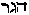
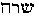

##### The Secret Doctrine by H. P. Blavatsky -- Vol. 2

------------------------------------------------------------------------

###### \[\[Vol. 2, Page\]\] 75 THE SECRET OF THE FALL OF THE ANGELS.

#### STANZA III. ATTEMPTS TO CREATE MAN.

> §§ (11) The Descent of the Demiurge. (12) The lunar gods ordered to
> create. (13) The higher gods refuse.

11\. **T**HE **L**ORD OF THE **L**ORDS CAME. **F**ROM HER BODY HE
SEPARATED THE WATERS, AND THAT WAS HEAVEN ABOVE, THE FIRST HEAVEN (*the*
*atmosphere, or the air, the firmament*) (*a*)*.*

(*a*) Here tradition falls again into the Universal. As in the earliest
version, repeated in the Puranas, so in the latest, the Mosaic account.
In the first it is said: "He the Lord" (the god who has the form of
Brahma) "when the world had become one ocean (*Harivamsa I.* 36)
concluding that within the waters lay the earth, and desirous to raise
it up," to separate it, "created himself in another form. As in the
preceding Kalpa (Manvantara) he had assumed the shape of a tortoise, so
in this one he took the shape of a boar, etc. etc." In the Elohistic
"creation" (*Genesis,* verses 6, 7, 8, and 9) "God" creates a firmament
in the midst of the waters . . . . . and says "let *dry land* appear."
And now comes the traditional peg whereunto is hung the esoteric portion
of the Kabalistic interpretation.

11.. **T**HE GREAT CHOHANS (*Lords*)*,* CALLED THE **L**ORDS OF THE
**M**OON, OF THE AIRY **B**ODIES (*a*). "BRING FORTH MEN, (*they were
told*)*,* MEN OF YOUR NATURE. **G**IVE THEM (*i.e., the Jivas or
Monads*) THEIR FORMS WITHIN. **S**HE (*Mother Earth or Nature*) WILL
BUILD COVERINGS WITHOUT (*external bodies*). (*For*) MALES-FEMALES WILL
THEY BE. **L**ORDS OF THE FLAME, ALSO."

(*a*) Who are the Lords of the Moon? In India they are called *Pitris*
or "lunar ancestors," but in the Hebrew scrolls it is Jehovah himself
who is the "Lord of the Moon," collectively as the Host, and also as one
of the Elohim. The astronomy of the Hebrews and their observance of
*times* was regulated by the moon. A Kabalist, having shown that "Daniel
. . . told off God's providence by *set times,"* and that the
"Revelation" of John "speaks of a carefully measured *cubical* city
descending out of the heavens," etc., adds --

------------------------------------------------------------------------

###### \[\[Vol. 2, Page\]\] 76 THE SECRET DOCTRINE.

"But the vitalizing power of heaven lay chiefly *with the moon*. . . .
It was the Hebrew  (Jehovah), and St. Paul enjoins:
'Let no man judge you for your observance of the seventh day, and the
*day of the new moon, which are a shadow of things to come;* but the
body (or substance) is of Christ" or Jehovah, that function of this
power that "made the barren woman . . . a mother . . . for they are the
gift of Jehovah" . . . which is a key to the objection which her husband
made to the Shunamite, as to her going to the man of God -- "for it is
neither the seventh day nor the *day of the new moon. .* . . (2 *Kings*,
iv., 23.) The living spiritual powers of the constellations had mighty
wars, marked by the movements and positions of the stars and planets,
and especially as the result of the conjunction of the moon, earth, and
sun. Bentley comments on the Hindu "War between the gods and the
giants," as marked by the eclipse of the Sun at the ascending node of
the Moon, 945 **B.C**. (! !), at which time was born\* or produced from
the sea, **S**RI (Sarai, S-r-i, the wife of the Hebrew A-bram\*\*). Sri
is also Venus-Aphrodite the Western emblem "of the luni-solar year or
the moon (as Sri is the wife of the moon; *vide* foot-note), the goddess
of increase\*\*\* . . . " Therefore . . . "the grand monument and
landmark of the exact period of the lunar year and month, by which this
cycle (of 19 tropical years and 235 revolutions of the moon) could be
calculated, was Mount Sinai -- the Lord Jehovah coming down thereon. . .
. Paul speaks (then) as a mystagogue, when he says concerning the freed
woman and bond woman of Abraham: 'For this Hagar (the bond-woman) is
Mount Sinai in Arabia.' How could a woman be a mountain? and such a
mountain! Yet . . . she was. . . . Her name was Hagar, Hebrew
, whose numbers re-read 235, or in exact measure, the
very number of lunar months to equal nineteen tropical years to complete
this cycle. . . . Mount Sinai being, in the esoteric language of the
wisdom, the monument of the exact time of the lunar

###### \[\[Footnote(s)\]\] -------------------------------------------------

\* According to the wonderful chronology of Bentley, who wrote in days
when Biblical chronology was still undisputed; and also according to
that of those modern Orientalists who dwarf the Hindu dates as far as
they can.

\*\* Now *Sri* is the daughter of Bhrigu, one of the Prajapatis and
Rishis, the chief of the Bhrigus, "the Consumers," the aerial class of
gods. She is Lakshmi, the wife of Vishnu, and she is "the bride of Siva"
(Gauri), and she is Sarasvati, "the watery," the wife of Brahma, because
the three gods and goddesses are one, under three aspects. Read the
explanation by Parasara, in *Vishnu Purana* in Bk. I., ch. viii. (Vol.
I., Wilson's trans., p. 119), and you will understand. "The Lord of Sri"
is the moon, he says, and "Sri is the wife of Narayana, the God of
Gods"; Sri or Lakshmi (Venus) is Indrani, as she is Sarasvati, for in
the words of Parasara: "Hari (or Iswara, "the Lord") is all that is
called male in the Universe; Lakshmi is all that is termed female. There
is nothing else than they." Hence she is "female," and "God" is male
Nature.

\*\*\* Sri is goddess of, and herself "Fortune and Prosperity."

------------------------------------------------------------------------

###### \[\[Vol. 2, Page\]\] 77 THE VARIOUS CLASSES OF CREATORS.

years and months, by which this spiritual vitalizing cycle could be
computed -- and which mountain, indeed, was called (see Fuerst), "the
Mountain of the Moon (Sin). So also Sarai (**SRI**), the wife of Abram,
could have no child until her name was changed to Sarah,
, giving to her the property of this lunar influence."\*

This may be regarded as a digression from the main subject; but it is a
very necessary one with a view to Christian readers. For who, after
studying dispassionately the respective legends of Abram or Abraham,
Sarai or Sarah, who was "fair to look upon," and those of Brahma and
Sarasvati, or Sri, Lakshmi-Venus, with the relations of all these to the
Moon and Water; -- and especially one who understands the real
Kabalistic meaning of the name Jehovah and its relation to, and
connection with, the moon -- who can doubt that the story of Abram is
based upon that of Brahma, or that Genesis was written upon the old
lines used by every ancient nation? All in the ancient Scriptures is
allegorical -- all based upon and inseparably connected with Astronomy
and Cosmolatry.

-------

13\. **T**HEY (*the Moon-gods*) WENT, EACH ON HIS ALLOTTED LAND: SEVEN
OF THEM, EACH ON HIS LOT. **T**HE **L**ORDS OF THE **F**LAME REMAINED
BEHIND. **T**HEY WOULD NOT GO, THEY WOULD NOT CREATE (*a*).

(*a*) The Secret teachings show the divine Progenitors creating men on
seven portions of the globe "each on his lot" -- *i.e.*, each a
different race of men externally and internally, and on different zones.
This polygenistic claim is considered elsewhere (*vide* Stanza
**VII.**). But who are "They" who create, and the "Lords of the Flame,"
"who do not"? Occultism divides the "Creators" into twelve classes; of
which four have reached *liberation* to the end of the "Great Age," the
fifth is ready to reach it, but still remains active on the intellectual
planes, while seven are still under direct Karmic law. These last act on
the man-bearing globes of our chain.

Exoteric Hindu books mention seven classes of Pitris, and among them two
distinct kinds of Progenitors or Ancestors: the *Barhishad* and the
*Agnishwatta;* or those possessed of the "sacred fire" and those devoid
of it. Hindu ritualism seems to connect them with sacrificial fires, and
with *Grihasta* Brahmins in earlier incarnations: those who have, and
those who have **not** attended as they should to their household sacred
fires in their previous births. The distinction, as said, is derived
from the *Vedas.* The first and highest class (esoterically) the
*Agnishwatta,*

###### \[\[Footnote(s)\]\] -------------------------------------------------

\* *"Masonic Review";* Cincinnati, June 1886, Art. "The Cabbalah."

------------------------------------------------------------------------

###### \[\[Vol. 2, Page\]\] 78 THE SECRET DOCTRINE.

are represented in the exoteric allegory as *Grihasta*
(Brahman-householders) who, in their past births in other Manvantaras
having failed to maintain their domestic fires and to offer burnt
sacrifices, have lost every right to have oblations with fire presented
to them. Whereas the Barhishad, being Brahmins who have kept up their
household sacred fires, are thus honoured to this day. Thence the
*Agnishwatta* are represented as devoid of, and the *Barhishad* as
possessed of, fires.

But esoteric philosophy explains the original qualifications as being
due to the difference between the natures of the two classes: the
*Agnishwatta* Pitris are devoid of fire (*i.e.*, of creative passion),
because too divine and pure (*vide supra,* Sloka 11th); whereas the
Barhishad, being the lunar spirits more closely connected with Earth,
became the creative Elohim of form, or the Adam of dust.

The allegory says that Sanandana and other *Vedhas,* the Sons of Brahma,
*his first progeny,* "were without desire or passion, inspired with the
holy wisdom, estranged from the Universe and *undesirous of progeny"*
(*Vishnu Purana,* Book I. vii.). This also is what is meant in Sloka 11
by the words: "They would not create," and is explained as follows: --
"The primordial Emanations from the creative Power are too near the
absolute Cause. They are transitional and latent forces, which will
develop only in the next and subsequent removes." This makes it plain.
Hence Brahma is said to have felt wrathful when he saw that those
"embodied spirits, produced from his limbs (*gatra*), would not multiply
themselves." After which, in the allegory, he creates other seven
*mind-born* Sons (see *"Moksha-Darma"* and *"Mahabharata"*)*,* namely*,
Marichi, Atri, Angiras, Pulastya, Pulaha, Kratu* and *Vasishta,* the
latter being often replaced by *Daksha,* the most prolific of the
creators. In most of the texts these Seven Sons of *Vasishta-Daksha* are
called the seven Rishis of the *Third* Manvantara; the latter referring
both to the Third Round and also to the third Root-Race and its
branch-Races in the Fourth Round. These are all the creators of the
various beings on this Earth, the Prajapati, and at the same time they
appear as divers reincarnations in the early Manvantaras or races.

It thus becomes clear why the *Agnishwatta,* devoid of the grosser
*creative fire,* hence unable to create physical man, having no
*double,* or astral body, to project, since they were without any
*form*, are shown in exoteric allegories as Yogis, Kumaras (chaste
youths), who became "rebels," *Asuras,* fighting and opposing gods,\*
etc., etc. Yet it is they

###### \[\[Footnote(s)\]\] -------------------------------------------------

\* Because, as the allegory shows, the Gods who had no personal merit of
their own, dreading the sanctity of those self-striving incarnated
Beings who had become *ascetics* and Yogis, and thus threatened to upset
the power of the former by their *self-acquired* powers -- renounced
them. All this has a deep philosophical meaning and refers to the
evolution and acquirement of divine powers through *self-exertion.* Some
Rishi- \[\[Footnote continued on next page\]\]

------------------------------------------------------------------------

###### \[\[Vol. 2, Page\]\] 79 THE LIVING SPIRITUAL FIRE.

alone who could complete man, *i.e.*, make of him a self-conscious,
almost a divine being -- god on Earth. The *Barhishad,* though possessed
of creative fire, were devoid of the higher **M**AHAT-mic element. Being
on a level with the lower principles -- those which precede gross
objective matter -- they could only give birth to the outer man, or
rather to the model of the physical, the astral man. Thus, though we see
them intrusted with the task by Brahma (the collective *Mahat* or
Universal Divine Mind), the "Mystery of Creation" is repeated on Earth,
only in an inverted sense, as in a *mirror.* It is those who are unable
to create the spiritual immortal man, who project the senseless model
(the *Astral*) of the physical Being; and, as will be seen, it was those
who would not multiply, who sacrificed themselves to the good and
salvation of *Spiritual Humanity.* For, to complete the *septenary man,*
to add to his three lower principles and cement them with the spiritual
Monad -- which could never dwell in such a form otherwise than in an
*absolutely latent state* -- two connecting principles are needed:
*Manas* and *Kama.* This requires a living *Spiritual Fire* of the
middle principle from the *fifth* and *third states* of Pleroma. But
this fire is the possession of the *Triangles,* not of the (perfect)
*Cubes,* which symbolize the Angelic Beings:\* the former having from
the first creation got hold of it and being said to have appropriated it
for themselves, as in the allegory of Prometheus. These are the active,
and therefore -- in Heaven -- no longer "pure" Beings. They have become
the independent and free Intelligences, shown in every Theogony as
fighting for that independence and freedom, and hence -- in the ordinary
sense -- "rebellious to the divine passive law." These are then those
"Flames" (the *Agnishwatta*) who, as shown in Sloka 13, "remain behind"
instead of going along with the others to create men on Earth. But the
true esoteric meaning is that most of them were destined to incarnate as
the *Egos* of the forthcoming crop of Mankind. The human *Ego* is
neither Atman nor Buddhi, but the higher *Manas:* the intellectual
fruition and the efflorescence of the intellectual self-conscious
*Egotism* -- in the higher spiritual sense. The ancient works refer to
it as *Karana Sarira* on the plane of *Sutratma,* which is the golden
thread on which, like beads, the various personalities of this higher
*Ego* are strung. If the reader were told, as in the *semi-esoteric*
allegories, that these Beings were returning *Nirvanees,* from preceding
*Maha-Manvantaras --* ages of incalculable dura-

###### \[\[Footnote(s)\]\] -------------------------------------------------

\[\[Footnote continued from previous page\]\] Yogis are shown in the
Puranas to be far more powerful than the gods. Secondary gods or
temporary powers in Nature (the Forces) are doomed to disappear; it is
only the spiritual potentiality in man which can lead him to become one
with the INFINITE and the ABSOLUTE.

\* See Book I., Stanzas III. to V. The triangle becomes a Pentagon
(five-fold) on Earth.

------------------------------------------------------------------------

###### \[\[Vol. 2, Page\]\] 80 THE SECRET DOCTRINE.

tion which have rolled away in the Eternity, a still more incalculable
time ago -- he would hardly understand the text correctly; while some
Vedantins might say: "This is not so; the Nirvanee can never return";
which is true during the Manvantara he belongs to, and erroneous where
Eternity is concerned. For it is said in the Sacred Slokas:

*"The thread of radiance which is imperishable and dissolves only in
Nirvana, re-emerges from it in its integrity on the day when the Great
Law calls all things back into action*. . . ."

Hence, as the higher "Pitris or Dhyanis" had no hand in his physical
creation, we find primeval man, issued from the bodies of his
*spiritually fireless* progenitors, described as aeriform, devoid of
compactness, and **M**INDLESS. He had no middle principle to serve him
as a medium between the *highest* and the *lowest,* the spiritual man
and the physical brain, for he lacked *Manas.* The Monads which
incarnated in those empty **S**HELLS, remained as unconscious as when
separated from their previous incomplete forms and vehicles. There is no
potentiality for creation, or self-Consciousness, in a *pure* Spirit on
this our plane, unless its too homogeneous, perfect, because divine,
nature is, so to say, mixed with, and strengthened by, an essence
already differentiated. It is only the lower line of the Triangle --
representing the first triad that emanates from the Universal **M**ONAD
-- that can furnish this needed consciousness on the plane of
differentiated Nature. But how could these pure Emanations, which, on
this principle, must have originally been themselves *unconscious* (in
our sense), be of any use in supplying the required principle, as they
could hardly have possessed it themselves? The answer is difficult to
comprehend, unless one is well acquainted with the philosophical
metaphysics of a beginningless and endless series of Cosmic Re-births;
and becomes well impressed and familiarised with that immutable law of
Nature which is **E**TERNAL **M**OTION, cyclic and spiral, therefore
progressive even in its seeming retrogression. The one divine Principle,
the nameless **T**HAT of the Vedas, is the universal Total, which,
neither in its spiritual aspects and emanations, nor in its physical
atoms, can ever be at *"absolute rest"* except during the "Nights" of
Brahma. Hence, also, the "first-born" are those who are first set in
motion at the beginning of a Manvantara, and thus the first to fall into
the lower spheres of materiality. They who are called in Theology "the
Thrones," and are the "Seat of God," must be the first incarnated men on
Earth; and it becomes comprehensible, if we think of the endless series
of past Manvantaras, to find that the last had to come first, and the
first last. We find, in short, that the higher Angels had broken,
countless aeons before, through the "Seven Circles," and thus *robbed*
them of the Sacred fire;

------------------------------------------------------------------------

###### \[\[Vol. 2, Page\]\] 81 MAN, A GOD IN ANIMAL FORM.

which means in plain words, that they had assimilated during their past
incarnations, in lower as well as in higher worlds, all the wisdom
therefrom -- the reflection of **M**AHAT in its various degrees of
intensity. No Entity, whether angelic or human, can reach the state of
Nirvana, or of absolute purity, except through aeons of suffering and
the *knowledge* of EVIL as well as of good, as otherwise the latter
remains incomprehensible.

Between man and the animal -- whose Monads (or Jivas) are fundamentally
identical -- there is the impassable abyss of Mentality and
Self-consciousness. What is human mind in its higher aspect, whence
comes it, if it is not a portion of the essence -- and, in some rare
cases of incarnation, the *very essence* -*-* of a higher Being: one
from a higher and divine plane? Can man -- a god in the animal form --
be the product of Material Nature by evolution alone, even as is the
animal, which differs from man in external shape, but by no means in the
materials of its physical fabric, and is informed by the same, though
undeveloped, Monad -- seeing that the intellectual potentialities of the
two differ as the Sun does from the Glow-worm? And what is it that
creates such difference, unless man is an animal *plus* *a living god*
within his physical shell? Let us pause and ask ourselves seriously the
question, regardless of the vagaries and sophisms of both the
materialistic and the psychological modern sciences.

To some extent, it is admitted that even the esoteric teaching is
allegorical. To make the latter comprehensible to the average
intelligence, requires the use of symbols cast in an intelligible form.
Hence the allegorical and semi-mythical narratives in the exoteric, and
the (only) *semi*-metaphysical and objective representations in the
esoteric teachings. For the purely and transcendentally spiritual
conceptions are adapted only to the perceptions of those who "see
without eyes, hear without ears, and sense without organs," according to
the graphic expression of the Commentary. The too puritan idealist is at
liberty to spiritualise the tenet, whereas the modern psychologist would
simply try to spirit away our "fallen," yet still divine, human Soul in
its connection with *Buddhi.*

The mystery attached to the highly spiritual ancestors of the *divine*
man within the earthly man is very great. His dual creation is hinted at
in the Puranas, though its esoteric meaning can be approached only by
collating together the many varying accounts, and reading them in their
symbolical and allegorical character. So it is in the Bible, both in
*Genesis* and even in the *Epistles* of Paul. For that *creator,* who is
called in the second chapter of Genesis the "Lord God," is in the
original the *Elohim,* or *Gods* (the Lords), in the plural; and while
one of them makes the earthly Adam of dust, the other breathes into him
the breath of life, and the third makes of him a *living soul* (ii. 7),
all of which readings

------------------------------------------------------------------------

###### \[\[Vol. 2, Page\]\] 82 THE SECRET DOCTRINE.

are implied in the plural number of the Elohim.\* "The first man is of
the Earth, the second (the last, or rather highest) is from heaven,"
says Paul in I. *Corinthians* xv. 47.

In the Aryan allegory the rebellious Sons of Brahma are all represented
as holy ascetics and Yogis. Re-born in every Kalpa, they generally try
to impede the work of human procreation. When Daksha, the chief of the
*Prajapati* (creators), brings forth 10,000 sons for the purpose of
peopling the world, Narada -- a son of Brahma, the great Rishi, and
*virtually* a "Kumara," if not so in name -- interferes with, and twice
frustrates Daksha's aim, by persuading those Sons to remain holy
ascetics and eschew marriage. For this, Daksha curses Narada to be
*re-born as a man,* as Brahma had cursed him before for refusing to
marry, and obtain progeny, saying: -- "Perish in thy present (*Deva* or
angelic) form and take up thy abode in the womb," *i.e.*, become a man
(*Vayu Purana; Harivamsa,* 170). Notwithstanding several conflicting
versions of the same story, it is easy to see that Narada belongs to
that class of Brahma's, "first-born," who have all proven rebellious to
the law of animal procreation, for which they had to incarnate as *men.*
Of all the Vedic Rishis, Narada, as already shown, is the most
incomprehensible, because the most closely connected with the occult
doctrines -- especially with the secret cycles and Kalpas (*vide
supra*)*.*

Certain contradictory statements about this Sage have much distracted
the Orientalists. Thus he is shown as refusing positively to *create*
(have progeny), and even as calling his father Brahma "a false teacher"
for advising him to get married (*"Narada-Pancha-Ratra*"); nevertheless,
he is referred to as one of the Prajapati, "progenitors"! In *Naradiya
Purana,* he describes the laws and the duties of the celibate adepts;
and as these occult duties do not happen to be found in the fragment of
about 3,000 Stanzas in the possession of European museums, the Brahmins
are proclaimed liars;

the Orientalists forgetting that the *Naradiya* is credited with
containing 25,000 Stanzas, and that it is not very likely that such
**MSS.** should be found in the hands of the Hindu profane, those who
are ready to sell any precious olla for a red pottage. Suffice it to
say, that Narada is

###### \[\[Footnote(s)\]\] -------------------------------------------------

\* Seth, as Bunsen and others have shown, is not only the *primitive
god* of the Semites -- early Jews included -- but also their
"semi-divine ancestor." For, says Bunsen (*"God in History,"* vol. i,
pp. 233, 234), "the Seth of Genesis, the father of Enoch (*the* man)
must be considered as originally running parallel with that derived from
the Elohim, Adam's father." "According to Bunsen, the Deity (the god
Seth) was the *primitive god* of Northern Egypt and Palestine"
(Staniland Wake, "The Great Pyramid"). And Seth became considered in the
later Theology of the Egyptians as "AN EVIL DAEMON," says the same
Bunsen, for he is one with Typhon and one with the Hindu demons as a
logical sequel.

------------------------------------------------------------------------

###### \[\[Vol. 2, Page\]\] 83 "FIRES," "SPARKS," AND "FLAMES."

*the* Deva-Rishi of Occultism *par excellence;* and that the Occultist
who does not ponder, analyse, and study Narada from his seven esoteric
facets, will never be able to fathom certain anthropological,
chronological, and even Cosmic Mysteries. He is one of the *Fires*
above-mentioned, and plays a part in the evolution of this Kalpa from
its incipient, down to its final stage. He is an actor who appears in
each of the successive acts (Root-Races) of the present Manvantaric
drama, in the world allegories which strike the key-note of esotericism,
and are now becoming more familiar to the reader. But shall we turn to
other ancient Scriptures and documents for the corroboration of the
"Fires," "Sparks," and "Flames?" They are plentiful, if one only seeks
for them in the right places. In the *"Book of the Concealed Mystery,"*
they are clearly enunciated, as also in the *"Ha Idra Zuta Qadisha,"* or
the lesser holy Assembly. The language is very mystical and veiled, yet
still comprehensible. Therein, among the sparks of Prior Worlds,
"vibrating Flames and Sparks," from the divine flint, the *workmen*
proceed to create man, "male and female" (427); which "Flames and
Sparks" (Angels and their Worlds, Stars and Planets) are said,
figuratively, to "become extinct and die," that is to say, remain
*unmanifested* until a certain process of nature is accomplished. To
show how thickly veiled from public view are the most important facts of
anthropogenesis, two passages are now quoted from two Kabalistic books.
The first is from the *Book of the Concealed Mystery:* --

(429.) From a Light-Bearer (one of the seven sacred planets) of
insupportable brightness proceeded a radiating Flame, dashing off, like
a vast and mighty hammer, those sparks which were the prior worlds.

(430.) And with most subtle ether were these intermingled and bound
mutually together, but *only when they were conjoined together,* even
the great Father and great Mother.

(431.) From *Hoa*, himself, is AB, the Father; and from Hoa, himself, is
RUACH, the Spirit; who are hidden in the Ancient of Days, and therein is
that Ether concealed.

(432.) And it was connected with a Light-Bearer (a planet and its angel
or regent), which went forth from that Light-Bearer of insupportable
brightness, which is hidden in the bosom of *Aima,* the Great Mother.\*

Now the following extract from the Zohar\*\* also deals with the same
mystery: -- "The Pre-Adamite Kings. 'We have learned in the Siphrah
D'Tzniootha: That the *At-tee'kah DAt-tee'keen,* Ancient of Ancients,
before He prepared his Form, built Kings, and engraved

###### \[\[Footnote(s)\]\] -------------------------------------------------

\* *See* Mr. Mather's *"Kabbalah Unveiled."*

\*\* Translated in I. Myer's *Qabbalah.*

------------------------------------------------------------------------

###### \[\[Vol. 2, Page\]\] 84 THE SECRET DOCTRINE.

Kings, and sketched out Kings (men, the Kings of the animals), and they
could not exist: till he overthrew them *and hid them until after a
time,* therefore it is written: 'And these are the Kings which reigned
in the land of Edom' . . . . And they could not exist till
*Resha'Hiv'rah,* the White Head, the *At'-tee-'kah D'At-tee'keen,*
Ancient of Ancients, arranged Himself . . . . and formed all forms above
and below. . . . Before He arranged himself in his Form had not been
formed all those whom he desired to form, and all worlds have been
destroyed . . . . they did not remain in their places, because the form
of the Kings had not been formed as it ought to be, and *the Holy City
had not been prepared."* (*Zohar* iii., 135*a; 292a Idra Zootah.* Brody,
etc.)

Now the plain meaning of these two allegorical and metaphysical
disquisitions is simply this: Worlds and men were in turn formed and
destroyed, *under the law of evolution* and *from pre-existing
material,* until both the planets and their men, in our case our Earth
and its animal and human races, became what they are now in the present
cycle: opposite polar forces, an equilibrized compound of Spirit and
Matter, of the positive and the negative, of the male and the female.
Before man could become male and female *physically,* his prototype, the
creating Elohim, had to arrange his Form on this sexual plane
*astrally.* That is to say, the atoms and the organic forces, descending
into the plane of the given differentiation, had to be marshalled in the
order intended by Nature, so as to be ever carrying out, in an
immaculate way, that law which the Kabala calls the *Balance,* through
which everything that exists does so as male and female in its final
perfection, in this present stage of materiality. *Chochmah,* Wisdom,
the Male Sephiroth, had to diffuse itself *in*, and *through, Binah,*
intelligent Nature, or Understanding. Therefore the First Root-race of
men, sexless and mindless, had to be overthrown and "hidden until after
a time"; *i.e.*, the first race, instead of dying, disappeared *in the
second race,* as certain lower lives and plants do in their progeny. It
was a wholesale transformation. The First became the Second Root-race,
without either begetting it, procreating it, or dying. *"They passed by*
together," as it is written: "And he died and another reigned in his
stead" (*Genesis* xxvi. 31 *et seq. Zohar* iii., 292*a*). Why? Because
"the *Holy City* had not been prepared." And what is the "Holy City"?
The *Maquom* (the Secret *Place* or the Shrine) on Earth: in other
words, the human womb, the microcosmic copy and reflection of the
*Heavenly Matrix,* the female space or primeval Chaos, in which the male
Spirit fecundates the germ of the Son, or the visible Universe.\* So
much so, that in the paragraph on "the Emanation of the Male and Female
Principles" in the Zohar

###### \[\[Footnote(s)\]\] -------------------------------------------------

\* *Vide* "The Holy of Holies: its esoteric meaning," in Part IO of this
Volume.

------------------------------------------------------------------------

###### \[\[Vol. 2, Page\]\] 85 THE SON OF YAH.

(*ibid.*)*,* it is said that, on this earth, the **W**ISDOM from the
"Holy Ancient" "does not shine except in male and female." "*Hohmah,*
Wisdom, is the Father, and **B**INAH, understanding, is the Mother . . .
. and when they connect one with the other they bring forth and diffuse
and emanate truth. In the sayings of Rabbi Je-yeva Sabah, *i.e.*, the
Old, we learned this: What is Binah Understanding? But when they connect
in one another, the \[\[diagram\]\] (Yod) in the \[\[diagram\]\] (Heh),
they become impregnated and produce a Son. And, therefore, it is called
*Binah,* Understanding. It means BeN YaH, *i.e.*, Son of YaH. This is
the completeness of the whole."\*

This is also the "completeness" of phallicism by the Rabbis, its perfect
apotheosis, the divine being dragged into the animal, the sublime into
the grossness of the terrestrial. Nothing so graphically gross exists in
Eastern Occultism, nor in the primitive Kabala -- the "Chaldean Book of
Numbers." We have said so in "Isis Unveiled": --

"We find it rather unwise on the part of Catholic writers to pour out
their vials of wrath in such sentences as these: 'In a multitude of
pagodas, the phallic stone, ever and always assuming, like the Grecian
*batylos,* the brutally indecent form of the *lingham* . . . the Maha
Deva.' Before casting slurs on a symbol whose profound metaphysical
meaning is too much for the modern champions of that religion of
sensualism *par excellence,* Roman Catholicism, to grasp, they are in
duty bound to destroy their oldest churches, and change the form of the
cupolas of their own temples. The Mahody of Elephanta, the Round Tower
of Bhangulpore, the minarets of Islam -- either rounded or pointed --
are the originals of the *Campanile* column of San Marco, at Venice, of
the Rochester Cathedral, and of the modern Duomo of Milan. All of these
steeples, turrets, domes, and Christian temples, are the reproductions
of the primitive idea of the *lithos,* the upright phallus." (Vol. II.,
p. 5.)

Nevertheless, and however it may be, the fact that all these Hebrew
Elohim, Sparks, and Cherubs are identical with the Devas, Rishis and the
Fires and Flames, the Rudras and the forty-nine Agnis of the ancient
Aryas, is sufficiently proven by and in the Kabala.

###### \[\[Footnote(s)\]\] -------------------------------------------------

\* *Zohar* iii.*,* 290*a*, quoted in Isaac Myer's Qabbalah, p. 387.

-------

------------------------------------------------------------------------

[Next Section](sd2-1-05)

[Contents](sd2-0-co.htm#contents)
