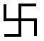
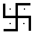

##### The Secret Doctrine by H. P. Blavatsky -- Vol. 2

------------------------------------------------------------------------

###### \[\[Vol. 2, Page\]\] 86 THE SECRET DOCTRINE.

#### STANZA IV. CREATION OF THE FIRST RACES.

> §§ (14) Creation of men. (15) They are empty shadows. (16) The
> Creators are perplexed how to create a THINKING man. (17) What is
> needed for the formation of a perfect Man.

14\. **T**HE **S**EVEN **H**OSTS, THE "**W**ILL (*or Mind*)-**B**ORN"
**L**ORDS, **P**ROPELLED BY THE **S**PIRIT OF **L**IFE-**G**IVING
(*Fohat*)*,* SEPARATE MEN FROM THEMSELVES, EACH ON HIS OWN **Z**ONE
(*a*).

(*a*) They threw off their "shadows" or *astral bodies* -*-* if such an
ethereal being as a "lunar Spirit" may be supposed to rejoice in an
astral, besides a hardly tangible body. In another Commentary it is said
that the "Ancestors" *breathed* out the first man, as Brahma is
explained to have breathed out the *Suras* (Gods), when they became
"*Asuras*" (from *Asu,* breath). In a third it is said that they, the
newly-created men, "were the shadows of the Shadows."

With regard to this sentence -- "They were the shadows of the Shadows"
-- a few more words may be said and a fuller explanation attempted. This
first process of the evolution of mankind is far easier to accept than
the one which follows it, though one and all will be rejected and
doubted even by some Kabalists, especially the Western, who study the
present effects, but have neglected to study their primary causes. Nor
does the writer feel competent to explain a mode of procreation so
difficult of appreciation save for an Eastern Occultist. Therefore it is
useless to enter here into details concerning the process, though it is
minutely described in the Secret Books, as it would only lead to
speaking of facts hitherto unknown to the profane world, and hence to
their being misunderstood. An "Adam" made of the dust of the ground will
always be found preferable, by a certain class of students, to one
projected out of the ethereal body of his creator; though the former
process has never been heard of, while the latter is familiar, as all
know, to many Spiritualists in Europe and America, who, of all men,
ought to understand it. For who of those who have witnessed the
phenomenon of a materialising form oozing out of the pores of a medium
or, at other times, out of his *left side,* can fail to credit the
possibility, at least, of such a *birth?* If there are

------------------------------------------------------------------------

###### \[\[Vol. 2, Page\]\] 87 MAN NOT CREATED PERFECT.

in the Universe such beings as Angels or Spirits, whose *incorporeal*
essence may constitute an intelligent entity notwithstanding the absence
of any (to us) solid organism; and if there are those who believe that a
god made the first man out of dust, and breathed into him a living Soul
-- and there are millions upon millions who believe both -- what does
this doctrine of ours contain that is so impossible? Very soon the day
will dawn, when the world will have to choose whether it will accept the
miraculous creation of man (and Kosmos too) out of *nothing,* according
to the dead letter of *Genesis,* or a first man born from a fantastic
link -- absolutely "*missing*" so far -- the common ancestor of man, and
of the "true ape."\* Between these two fallacies,\*\* Occult philosophy
steps in. It teaches that the first human stock was projected by higher
and semi-divine Beings out of their own essences. If the latter process
is to be considered as abnormal or even inconceivable -- because
obsolete in Nature at this point of evolution -- it is yet proven
possible on the authority of certain "Spiritualistic" FACTS. Which,
then, we ask of the three hypotheses or theories is the most reasonable
and the least absurd? Certainly no one -- provided he is not a
soul-blind materialist -- can ever object to the occult teaching.

Now, as shown, we gather from the latter that man was not "created" the
complete being he is now, however imperfect he still remains. There was
a spiritual, a psychic, an intellectual, and an animal evolution, from
the highest to the lowest, as well as a physical development -- from the
simple and homogeneous, up to the more complex and heterogeneous; though
not quite on the lines traced for us by the modern evolutionists. This
double evolution in two contrary directions, required various ages, of
divers natures and degrees of spirituality and intellectuality, to
fabricate the being now known as man. Furthermore, the one absolute,
ever acting and never erring law, which proceeds on the

###### \[\[Footnote(s)\]\] -------------------------------------------------

\* ". . . Huxley, supported by the most evident discoveries in
Comparative Anatomy, could utter the momentous sentence that the
anatomical differences between man and the highest apes are less than
those between the latter and the lowest apes. In relation to our
genealogical tree of man, the necessary conclusion follows that the
human race has *evolved gradually from the true apes.*" ("*The Pedigree
of Man,*" by Ernest Haeckel, translated by Ed. B. Aveling, p. 49).

What may be the scientific and *logical* objections to the opposite
conclusion -- we would ask? The anatomical resemblances between Man and
the Anthropoids -- grossly exaggerated as they are by Darwinists, as M.
de Quatrefages shows -- are simply enough "accounted for" when the
origin of the latter is taken into consideration.

"Nowhere, in the older deposits, is an ape to be found that approximates
more closely to man, or a man that approximates more closely to an ape .
. . . . ."

\*\* ". . . . . The same gulf which is found to-day between Man and Ape,
goes back with undiminished breadth and depth to the Tertiary period.
This fact alone is enough to make its untenability clear," (Dr. F.
Pfaff, Prof. of Natural Science in the University of Erlangen).

------------------------------------------------------------------------

###### \[\[Vol. 2, Page\]\] 88 THE SECRET DOCTRINE.

same lines from one eternity (or Manvantara) to the other -- ever
furnishing an ascending scale for the manifested, or that which we call
the great Illusion (*Maha-Maya*)*,* but plunging Spirit deeper and
deeper into materiality on the one hand, and then *redeeming it through
flesh* and liberating it -- this law, we say, uses for these purposes
the Beings from other and higher planes, men, or *Minds* (Manus), in
accordance with their Karmic exigencies.

At this juncture, the reader is again asked to turn to the Indian
philosophy and religion. The Esotericism of both is at one with our
Secret Doctrine, however much the form may differ and vary.

-------

**O**N THE **I**DENTITY AND **D**IFFERENCES OF THE **I**NCARNATING
**P**OWERS.

**T**HE Progenitors of Man, called in India "Fathers," Pitara or Pitris,
are the creators of our bodies and lower principles. They are ourselves,
as the *first personalities,* and *we are they.* Primeval man would be
"the bone of their bone and the flesh of their flesh," if they had body
and flesh. As stated, they were "*lunar* Beings."

The Endowers of man with his conscious, immortal EGO, are the "Solar
Angels" -- whether so regarded metaphorically or literally. The
mysteries of the Conscious EGO or human Soul are great. The esoteric
name of these "Solar Angels" is, literally, the "Lords" (*Nath*) of
"persevering ceaseless devotion" (*pranidhana*)*.* Therefore they of the
*fifth* principle (*Manas*) seem to be connected with, or to have
originated the system of the Yogis who make of *pranidhana* their
*fifth* observance (see *Yoga Shastra,* II., 32.) It has already been
explained why the trans-Himalayan Occultists regard them as evidently
identical with those who in India are termed *Kumaras, Agnishwattas,*
and the *Barhishads.*

How precise and true is Plato's expression, how profound and
philosophical his remark on the (human) soul or EGO, when he defined it
as "a compound of the *same* and the *other.*" And yet how little this
hint has been understood, since the world took it to mean that the soul
was the breath of God, of Jehovah. It is "the *same* and the *other,*"
as the great Initiate-Philosopher said; for the EGO (the "Higher Self"
when merged with and in the Divine Monad) is Man, and yet the *same* as
the "OTHER," the Angel in him incarnated, as the same with the universal
**M**AHAT. The great classics and philosophers felt this truth, when
saying that "there must be something within us which produces our
thoughts. Something very subtle; it is a breath; it is fire; it is
ether;

------------------------------------------------------------------------

###### \[\[Vol. 2, Page\]\] 89 PITRIS OF THE GODS AND DEMONS.

it is quintessence; it is a slender likeness; it is an intellection; it
is a number; it is harmony. . . . . " (*Voltaire*)*.*

All these are the *Manasam* and *Rajasas:* the *Kumaras, Asuras,* and
other rulers and *Pitris,* who incarnated in the Third Race, and in this
and various other ways endowed mankind with Mind.

There are seven classes of Pitris, as shown below, three incorporeal and
four corporeal; and two kinds, the Agnishwatta and the Barhishad. And we
may add that, as there are two kinds of Pitris, so there is a double and
a triple set of Barhishad and Agnishwatta. The former, having given
birth to their astral doubles, are reborn as *Sons of Atri,* and are the
"Pitris of the Demons," or corporeal beings, on the authority of Manu
(III., 196); while the Agnishwatta are reborn as Sons of Marichi (a son
of Brahma), and are the Pitris of the Gods (*Manu* again, *Matsya* and
*Padma Puranas* and *Kulluka* in the Laws of the *Manavas,* III.,
195).\* Moreover, the *Vayu Purana* declares all the seven orders to
have originally been the *first gods,* the *Vairajas,* whom Brahma "with
the eye of Yoga, beheld in the eternal spheres, and who are the *gods of
gods*"; and the *Matsya* adds that the Gods worshipped them; while the
*Harivansa* (*S.* 1, 935) distinguishes the Virajas as one class of the
Pitris only -- a statement corroborated in the Secret Teachings, which,
however, identify the Virajas with the *elder Agnishwattas\*\** and the
*Rajasas,* or *Abhutarajasas,* who are incorporeal without even an
astral phantom. Vishnu is said, in most of the **MSS**., to have
incarnated in and through them. "In the *Raivata Manvantara,* again,
Hari, best of gods, was born of *Sambhuti,* as the divine Manasas --
originating with the deities called Rajasas." Sambhuti was a daughter of
Daksha, and wife of Marichi, the father of the *Agnishwatta,* who, along
with the Rajasas, are ever associated with *Manasas.* As remarked by a
far more able Sanskritist than Wilson, Mr. Fitzedward Hall, "Manasa is
no inappropriate name for a deity associated with the Rajasas. We appear
to have in it Manasam -- the same as *Manas* -- with the change of
termination required to express male personification" (*Vishnu Purana*
Bk. III., ch. I., p. 17 footnote). All the sons of *Viraja* are
*Manasa,* says *Nilakantha.* And

###### \[\[Footnote(s)\]\] -------------------------------------------------

\* We are quite aware that the *Yayu* and *Matsya Puranas* identify
(agreeably to Western interpretation) the Agnishwatta with the seasons,
and the Barhishad Pitris with the months; adding a fourth class -- the
Kavyas -- cyclic years. But do not Christian, Roman Catholics identify
their Angels with planets, and are not the seven Rishis become the
*Saptarshi* -- a constellation? They are deities presiding over all the
cyclic divisions.

\*\* The Vayu Purana shows the region called Viraja-loka inhabited by
the Agnishwattas.

------------------------------------------------------------------------

###### \[\[Vol. 2, Page\]\] 90 THE SECRET DOCTRINE.

Viraja is Brahma, and, therefore, the *incorporeal* Pitris are called
Vairajas from being the sons of Viraja, says *Vayu Purana.*

We could multiply our proofs *ad infinitum,* but it is useless. The wise
will understand our meaning, the *unwise* are not required to. There are
thirty-three crores, or 330 millions, of gods in India. But, as remarked
by the learned lecturer on the Bhagavad Gita, "they may be all devas,
but are by no means all 'gods', in the high spiritual sense one
attributes to the term." "This is an unfortunate blunder," he remarks,
"generally committed by Europeans. Deva is a kind of spiritual being,
and because the same word is used in ordinary parlance to mean god, it
by no means follows that we have to worship thirty-three crores of
gods." And he adds suggestively: "These beings, as may be naturally
inferred have a *certain affinity* with one of the three component
*Upadhis* (basic principles) into which we have divided man." -- (*Vide
Theosophist,* Feb., 1887, *et seq.*)

The names of the deities of a certain mystic class change with every
Manvantara. Thus the twelve great gods, *Jayas,* created by Brahma to
assist him in the work of creation in the very beginning of the Kalpa,
and who, lost in Samadhi, neglected to create -- whereupon they were
cursed to be repeatedly born in each Manvantara till the seventh -- are
respectively called *Ajitas, Tushitas, Satyas, Haris, Vaikunthas,
Sadhyas,* and *Adityas:* they are *Tushitas* (in the second Kalpa), and
*Adityas* in this *Vaivasvata* period (see *Vayu Purana*)*,* besides
other names for each age. But they are identical with the *Manasa* or
*Rajasas,* and these with our incarnating Dhyan Chohans. They are all
classes of the *Gnana-devas.*

Yes; besides those beings, who, like the Yakshas, Gandharvas, Kinaras,
etc., etc., taken in their *individualities,* inhabit the astral plane,
there are real *Devagnanams,* and to these classes of *Devas* belong the
*Adityas,* the *Vairajas,* the *Kumaras,* the *Asuras,* and all those
high celestial beings whom Occult teaching calls *Manaswin,* the Wise,
foremost of all, and who would have made all men the *self-conscious*
spiritually intellectual beings they will be, had they not been "cursed"
to fall into generation, and to be reborn themselves as mortals for
their neglect of duty.

-------

#### STANZA IV. -- (Continued.)

15\. **S**EVEN TIMES **S**EVEN **S**HADOWS (*chhayas*) OF **F**UTURE
**M**EN (*or Amanasas*) (*a*) WERE (*thus*) **B**ORN, **E**ACH OF HIS
OWN COLOUR (*complexion*) AND KIND (*b*). EACH (*also*) INFERIOR TO HIS
**F**ATHER (*creator*)*.* **T**HE **F**ATHERS, THE **B**ONELESS, COULD
GIVE NO **L**IFE TO **B**EINGS WITH

------------------------------------------------------------------------

###### \[\[Vol. 2, Page\]\] 91 SEVEN CLASSES OF PITRIS.

**B**ONES. **T**HEIR **P**ROGENY WERE **B**HUTA (*phantoms*) WITH
NEITHER **F**ORM NOR **M**IND, **T**HEREFORE THEY WERE CALLED THE
**C**HHAYA (*image or shadow*) **R**ACE (*c*).

(*a*) *Manu,* as already remarked, comes from the root "*man*" to think,
hence "a thinker." It is from this Sanskrit word very likely that sprung
the Latin "mens," mind, the Egyptian "*Menes,*" the "Master-Mind," the
Pythagorean *Monas,* or conscious "*thinking unit,*" mind also, and even
our "Manas" or mind, the fifth principle in man. Hence these shadows are
called *amanasa,* "mindless."

With the Brahmins the Pitris are very sacred, because they are the
Progenitors,\* or ancestors of men -- the first *Manushya* on this Earth
-- and offerings are made to them by the Brahmin when a son is born unto
him. They are more honoured and their ritual is more important than the
worship of the gods (See the "*Laws of Manu,*" Bk. III., p. 203).

May we not now search for a philosophical meaning in this dual group of
progenitors?

The Pitris being divided into *seven classes,* we have here the mystic
number again. Nearly all the Puranas agree that three of these are
*arupa,* formless, while four are corporeal; the former being
intellectual and spiritual, the latter material and devoid of intellect.
Esoterically, it is the *Asuras* who form the first three classes of
Pitris -- "born in the body of night" -- whereas the other four were
produced from the body of twilight. Their fathers, the gods, were doomed
to be born fools on Earth, according to *Vayu Purana.* The legends are
purposely mixed up and made very hazy: the Pitris being in one the sons
of the gods, and, in another those of Brahma; while a third makes them
instructors of their own fathers. It is the Hosts of the four material
classes who create men simultaneously on the seven zones.

Now, with regard to the seven classes of Pitris, each of which is again
divided into seven, a word to students and a query to the profane. That
class of the "Fire Dhyanis," which we identify on undeniable grounds
with the Agnishwattas, is called in our school the "Heart" of the
Dhyan-Chohanic Body; and it is said to have incarnated in the third race
of men and made them perfect. The esoteric Mystagogy speaks of the
mysterious relation existing between the hebdomadic essence or substance
of this angelic Heart and that of man, whose

###### \[\[Footnote(s)\]\] -------------------------------------------------

\* This was hinted at in *Isis Unveiled, Vol.* I.*, p*. xxxviii., though
the full explanation could not then be given: "The *Pitris* are not the
ancestors of the present living men, but those of the first human kind
or Adamic race; the spirits of *human* races, which, on the great scale
of descending evolution, preceded our races of men, and were physically
as well as spiritually, far superior to our modem pigmies. In
*Manava-Dharma-Sastra* they are called the *Lunar* ancestors."

------------------------------------------------------------------------

###### \[\[Vol. 2, Page\]\] 92 THE SECRET DOCTRINE.

every physical organ, and psychic, and spiritual function, is a
reflection, so to say, a copy on the terrestrial plane of the model or
prototype *above.* Why, it is asked, should there be such a strange
repetition of the number seven in the anatomical structure of man? Why
should the heart have *four lower* "cavities and *three higher*
divisions," answering so strangely to the septenary division of the
human principles, separated into two groups, the higher and the lower;
and why should the same division be found in the various classes of
Pitris, and especially our Fire Dhyanis? For, as already stated, these
Beings fall into four corporeal (or grosser) and three incorporeal (or
subtler) "principles," or call them by any other name you please. Why do
the seven nervous plexuses of the body radiate *seven* rays? Why are
there these seven plexuses, and why seven distinct layers in the human
skin?

"*Having projected their shadows and made men of one element* (ether),
*the progenitors re-ascend to Maha-loka, whence they descend
periodically, when the world is renewed, to give birth to new men.*

"*The subtle bodies remain without understanding* (Manas) *until the
advent of the Suras* (Gods) *now called Asuras* (not Gods)," says the
Commentary.

"*Not-gods,*" for the Brahmins, perhaps, but the highest *Breaths,* for
the Occultist; since those progenitors (Pitar), the formless and the
intellectual, refuse to build man, but endow him with mind; the four
corporeal classes creating only his body.

This is very plainly shown in various texts of the *Rig Veda* -- the
highest authority for a Hindu of any sect whatever. Therein *Asura*
means "spiritual divine," and the word is used as a synonym for Supreme
Spirit, while in the sense of a "God," the term "Asura" is applied to
Varuna and Indra and pre-eminently to Agni -- the three having been in
days of old the *three highest gods,* before Brahmanical Theo-Mythology
distorted the true meaning of almost everything in the Archaic
Scriptures. But, as the key is now lost, the Asuras are hardly
mentioned.

In the *Zendavesta* the same is found. In the Mazdean, or Magian,
religion, "Asura" is the lord *Asura Visvavedas,* the "all-knowing" or
"omniscient Lord"; and *Asura-Mazdha,* become later *Ahura-Mazdha,* is,
as Benfey shows, "the Lord who *bestows Intelligence*" -- Asura-Medha
and Ahura-Mazdao. Elsewhere in this work it is shown, on equally good
authority, that the Indo-Iranian Asura was always regarded as
*sevenfold.* This fact, combined with the name Mazdha, as above, which
makes of the sevenfold Asura the "Lord," or "Lords" collectively "who
*bestow Intelligence,*" connects the *Amshaspends* with the Asuras and
with our incarnating Dhyan Chohans, as well as with the Elohim, and the
seven informing gods of Egypt, Chaldea, and every other country.

Why these "gods" refused to create men is not, as stated in exoteric

------------------------------------------------------------------------

###### \[\[Vol. 2, Page\]\] 93 A GRAND APOCALYPTIC METAPHOR.

accounts, because their pride was too great to share the celestial power
of their essence with the children of Earth, but for reasons already
suggested. However, allegory has indulged in endless fancies and
theology taken advantage thereof in every country to make out its case
against these first-born, or the *logoi,* and to impress it as a truth
on the minds of the ignorant and credulous. (Compare also what is said
about Makara and the Kumaras in connection with the Zodiac.)

The Christian system is not the only one which has degraded them into
demons. Zoroastrianism and even Brahmanism have profited thereby to
obtain hold over the people's mind. Even in Chaldean exotericism, Beings
who *refuse to create, i.e.,* who are said to oppose thereby the
*Demiurgos,* are also denounced as the Spirits of Darkness. The Suras,
who win their intellectual independence, fight the Suras who are devoid
thereof, who are shown as passing their lives in profitless ceremonial
worship based on blind faith -- a hint now ignored by the *orthodox*
Brahmins -- and forthwith the former become *A-Suras. The* first and
*mind-born* Sons of the Deity refuse to create progeny, and are *cursed*
by Brahma to be *born as men.* They are hurled *down to Earth,* which,
later on, is transformed, in theological dogma, into the *infernal*
regions. Ahriman destroys the Bull created by Ormazd -- which is the
emblem of terrestrial *illusive* life, the "germ of sorrow" -- and,
forgetting that the perishing finite seed must die, in order that the
plant of immortality, the plant of spiritual, eternal life, should
sprout and live, Ahriman is proclaimed the enemy, the opposing power,
the devil. Typhon cuts Osiris into fourteen pieces, in order to prevent
his peopling the world and thus creating misery; and Typhon becomes, in
the exoteric, theological teaching, the Power of Darkness. But all this
is the exoteric shell. It is the worshippers of the latter who attribute
to disobedience and rebellion the effort and self-sacrifice of those who
would help men to their original status of divinity through
*self-conscious* efforts; and it is these worshippers of Form who have
made demons of the Angels of Light.

Esoteric philosophy, however, teaches that *one third\** of the Dhyanis
-- *i.e.*, the three classes of the *Arupa* Pitris, endowed with
intelligence, "which is a formless breath, composed of *intellectual*
not elementary substances" (see *Harivamsa,* 932) -- was simply *doomed
by the law of Karma and evolution to be reborn* (or incarnated) on
Earth.\*\* Some

###### \[\[Footnote(s)\]\] -------------------------------------------------

\* Whence the subsequent assertions of St. John's vision, referred to in
his Apocalypse, about "the great red Dragon having seven heads and *ten*
horns, and seven crowns upon his heads," whose "tail drew the *third
part* of the stars of heaven and did cast them to the earth" (ch. xii.).

\*\* The verse "did cast them to the Earth," plainly shows its origin in
the grandest and oldest allegory of the Aryan mystics, who, after the
destruction of the Atlantean \[\[Footnote continued on next page\]\]

------------------------------------------------------------------------

###### \[\[Vol. 2, Page\]\] 94 THE SECRET DOCTRINE.

of these were *Nirmanakayas* from other Manvantaras. Hence we see them,
in all the Puranas, reappearing on this globe, in the *third
Manvantara,* as Kings, Rishis and heroes (read Third Root-Race). This
tenet, being too philosophical and metaphysical to be grasped by the
multitudes, was, as already stated, disfigured by the priesthood for the
purpose of preserving a hold over them through superstitious fear.

The supposed "rebels," then, were simply those who, compelled by Karmic
law to drink the cup of gall to its last bitter drop, *had to incarnate*
anew, and thus make responsible thinking entities of the astral statues
projected by their inferior brethren. Some are said to have refused,
because they had not in them the requisite materials -- *i.e.*, an
astral body -- since they were *arupa.* The refusal of others had
reference to their having been Adepts and Yogis of long past preceding
Manvantaras; another mystery. But, later on, as *Nirmanakayas,* they
sacrificed themselves for the good and salvation of the *Monads* which
were waiting for their turn, and which otherwise would have had to
linger for countless ages in irresponsible, animal-like, though in
appearance human, forms. It may be a parable and an allegory *within an
allegory.* Its solution is left to the intuition of the student, if he
only reads that which follows with his *spiritual eye.*

As to their fashioners or "Ancestors" -- those Angels who, in the
exoteric legends, obeyed the law -- they must be identical with the
Barhishad Pitris, or the Pitar-Devata, *i.e.*, *those possessed of the
physical creative fire.* They could only create, or rather clothe, the
human Monads with their own astral Selves, but they could not make man
in their image and likeness. "Man must not be like one of us," say the
*creative* gods, entrusted with the fabrication of the lower animal but
higher; (see *Gen.* and *Plato*'*s Timaeus*)*.* Their creating the
semblance of men out of their own divine Essence means, esoterically,
that it is

###### \[\[Footnote(s)\]\] -------------------------------------------------

\[\[Footnote continued from previous page\]\] *giants* and *sorcerers,*
concealed the truth -- *astronomical, physical,* and *divine*, as it is
a page out of *pre-cosmic* theogony -- under various allegories. Its
esoteric, true interpretation is a veritable Theodice of the "Fallen
Angels," so called; the *willing* and the *unwilling,* the *creators*
and those who *refused to create,* being now mixed up most perplexingly
by Christian Catholics, who forget that their highest Archangel, St.
Michael, who is shown to conquer (to master and to assimilate) the
**D**RAGON OF **W**ISDOM and of divine Self-sacrifice (now miscalled and
calumniated as Satan), WAS THE FIRST TO REFUSE TO CREATE! This led to
endless confusion. So little does Christian theology understand the
paradoxical language of the East and its symbolism, that it even
explains, in its *dead letter sense,* the Chinese Buddhist and Hindu
exoteric rite of raising a noise during certain eclipses to scare away
the "great red Dragon," which laid a plot to carry away the light! But
here "Light" means esoteric Wisdom, and we have sufficiently explained
the secret meaning of the terms *Dragon, Serpent,* etc., etc., all of
which refer to Adepts and Initiates.

------------------------------------------------------------------------

###### \[\[Vol. 2, Page\]\] 95 WHAT PROMETHEUS SYMBOLIZED.

they who became the first Race, and thus shared its destiny and further
evolution. They *would* not, simply because they *could* not, give to
man that sacred spark which burns and expands into the flower of human
reason and self-consciousness, for they had it not to give. This was
left to that class of Devas who became symbolised in Greece under the
name of Prometheus, to those who had nought to do with the physical
body, yet everything with the purely spiritual man. (*See Part II of
this volume,* "*The Fallen Angels*"; *also* "*The Gods of Light proceed
from the Gods of Darkness.*")

Each class of Creators endows man with what it has to give: the one
builds his external form; the other gives him its essence, which later
on becomes the Human *Higher Self* owing to the *personal exertion of
the individual*; but they could not make men as they were themselves --
perfect, because sinless; sinless, because having only the first, pale
shadowy outlines of attributes, and these all perfect -- from the human
standpoint -- white, pure and cold as the virgin snow. Where there is no
struggle, there is no merit. Humanity, "of the Earth earthy," was not
destined to be created by the angels of the first divine Breath:
therefore they are said to *have refused* to do so, and man had to be
formed by more material creators,\* who, in their turn, could give only
what they had in their own natures, and no more. Subservient to eternal
law, the pure gods could only project out of themselves *shadowy* men, a
little less ethereal and spiritual, less *divine and perfect* than
themselves -- shadows still. The first humanity, therefore, was a pale
copy of its progenitors; too material, even in its ethereality, to be a
hierarchy of gods; too spiritual and pure to be MEN, endowed as it is
with every *negative* (*Nirguna*) perfection. Perfection, to be fully
such, must be born out of imperfection, the *incorruptible* must grow
out of the corruptible, having the latter as its vehicle and basis and
contrast. Absolute light is absolute darkness, and *vice versa.* In
fact, there is neither light nor

###### \[\[Footnote(s)\]\] -------------------------------------------------

\* In spite of all efforts to the contrary, Christian theology -- having
burdened itself with the Hebrew esoteric account of the creation of man,
which is understood *literally* -- cannot find any reasonable excuse for
its "*God,* the Creator," who produces a man devoid of mind and sense;
nor can it justify the punishment following an act, for which Adam and
Eve might plead *non compos.* For if the couple is admitted to be
ignorant of good and evil before the eating of the forbidden fruit, how
could it be expected to know that *disobedience was evil?* If primeval
man was meant to remain a half-witted, or rather witless, being, then
his creation was aimless and even *cruel,* if produced by an omnipotent
and perfect God. But Adam and Eve are shown, even in Genesis, to be
created by a class of lower divine Beings, the *Elohim,* who are so
jealous of their personal prerogatives as reasonable and intelligent
creatures, that they will not allow man to become "as one of us." This
is plain, even from the dead-letter meaning of the Bible. The Gnostics,
then, were right in regarding the Jewish God as belonging to a class of
lower, material and not very holy denizens of the invisible World.

------------------------------------------------------------------------

###### \[\[Vol. 2, Page\]\] 96 THE SECRET DOCTRINE.

darkness in the realms of truth. Good and Evil are twins, the progeny of
Space and Time, under the sway of Maya. Separate them, by cutting off
one from the other, and they will both die. Neither exists *per se,*
since each has to be generated and created out of the other, in order to
come into being; both must be known and appreciated before becoming
objects of perception, hence, in mortal mind, they must be divided.

Nevertheless, as the illusionary distinction exists, it requires a
*lower order of creative angels* to "create" inhabited globes --
especially ours -- or to deal with matter on this earthly plane. The
philosophical Gnostics were the first to think so, in the historical
period, and to invent various systems upon this theory. Therefore in
their schemes of creation, one always finds their *Creators* occupying a
place at the very foot of the ladder of spiritual Being. With them,
those who created our earth and its mortals were placed on the very
limit of *mayavic* matter, and their followers were taught to think --
to the great disgust of the Church Fathers -- that for the creation of
those wretched races, in a spiritual and moral sense, which grace our
globe, no high divinity could be made responsible, but only angels of a
*low hierarchy,\** to which class they relegated the Jewish God,
Jehovah.

Mankinds different from the present are mentioned in all the ancient
Cosmogonies. Plato speaks, in the *Phaedrus,* of a *winged race of men.*
Aristophanes (*in Plato*'*s Banquet*)*,* speaks of a race androgynous
and with round bodies. In *Pymander,* all the animal kingdom even is
double-sexed. Thus in § 18, it is said: "The circuit having been
accomplished, *the knot was loosened*. . . . and all the animals, which
were equally androgynous, were *untied* (separated) *together with man*.
. . . ." for. . . . "the causes had to produce effects on earth."\*\*
Again, in the ancient Quiche Manuscript, the *Popol Vuh* -- published by
the late Abbe Brasseur de Bourbourg -- the first men are described as a
race "whose sight was unlimited, and who knew all things at once": thus
showing the *divine knowledge of Gods,* not mortals. The Secret
Doctrine, correcting the unavoidable exaggerations of popular fancy,
gives the facts as they are recorded in the Archaic symbols.

###### \[\[Footnote(s)\]\] -------------------------------------------------

\* In *Isis Unveiled* several of these Gnostic systems are given. One is
taken from the *Codex Nazaraeus,* the Scriptures of the Nazarenes, who,
although they existed long before the days of Christ, and even before
the laws of Moses, were Gnostics, and many of them Initiates. They held
their "Mysteries of Life" in Nazara (ancient and modern Nazareth), and
their doctrines are a faithful echo of the teachings of the Secret
Doctrine -- some of which we are now endeavouring to explain.

\*\* See the translation from the Greek by Francois, Monsieur de Foix,
Evesque d'Ayre: the work dedicated to Marguerite de France, Reine de
Navarre. Edition of 1579, Bordeaux.

------------------------------------------------------------------------

###### \[\[Vol. 2, Page\]\] 97 THE TREES OF LIFE.

(*b*) These "shadows" were born "each of his own colour and kind," each
also "inferior to his creator," because the latter was a complete being
of his kind. The Commentaries refer the first sentence to the colour or
complexion of each human race thus evolved. In *Pymander,* the Seven
primitive men, created by Nature from the "heavenly Man," all partake of
the qualities of the "Seven *Governors,*" or Rulers, who loved Man --
their own reflection and synthesis.

In the Norse Legends, one recognizes in Asgard, the habitat of the gods,
as also in the *Ases* themselves, the same mystical *loci* and
personifications woven into the popular "myths," as in our Secret
Doctrine; and we find them in the Vedas, the Puranas, the Mazdean
Scriptures and the Kabala. The *Ases* of Scandinavia, the rulers of the
world which preceded ours, whose name means literally the "pillars of
the world," its "supports," are thus identical with the Greek
*Cosmocratores,* the "Seven Workmen or Rectors" of Pymander, the seven
Rishis and Pitris of India, the seven Chaldean gods and seven evil
spirits, the seven Kabalistic Sephiroth synthesised by the upper triad,
and even the seven Planetary Spirits of the Christian mystics. The Ases
create the earth, the seas, the sky and the clouds, the whole visible
world, from the remains of the slain giant Ymir; but they do not create
**M**AN, but only his form from the *Ask* or ash-tree. It is Odin who
endows him with life and soul, after Lodur had given him blood and
bones, and finally it is Honir who furnishes him with his intellect
(*manas*) and with his conscious senses. The Norse Ask, the Hesiodic
Ash-tree, whence issued the men of the generation of bronze, the Third
Root-Race, and the *Tzite* tree of the *Popol-Vuh,* out of which the
Mexican *third* race of men was created, are all one.\* This may be
plainly seen by any reader. But the Occult reason why the Norse
Yggdrasil, the Hindu Aswatha, the Gogard, the Hellenic tree of life, and
the Tibetan Zampun, are one with the Kabalistic Sephirothal Tree, and
even with the Holy Tree made by Ahura Mazda, and the Tree of Eden -- who
among the western scholars can tell?\*\* Nevertheless, the fruits of all
those "Trees," whether Pippala or Haoma or yet the more prosaic apple,
are the "plants of life," in fact and verity. The prototypes of our
races were all enclosed in the microcosmic tree, which grew and
developed *within and under* the great mundane macrocosmic tree\*\*\*;
and the mystery is half revealed in the *Dirghotamas,* where it is said:
"Pippala, the sweet fruit of that tree upon which come *spirits who*

###### \[\[Footnote(s)\]\] -------------------------------------------------

\* See Max Muller's review of the *Popol-Vuh.*

\*\* Mr. James Darmesteter, the translator of the Vendidad, speaking of
it, says: "*The tree, whatever it is* . . ." (p. 209).

\*\*\* Plato's "*Timaeus*."

------------------------------------------------------------------------

###### \[\[Vol. 2, Page\]\] 98 THE SECRET DOCTRINE.

*love the science,* and where the gods produce all marvels." As in the
Gogard, among the luxuriant branches of all those mundane trees, the
"Serpent" dwells. But while the Macroscosmic tree is the Serpent of
Eternity and of absolute Wisdom itself, those who dwell in the
Microcosmic tree are the Serpents of the manifested Wisdom. One is the
One and All; the others are its *reflected* parts. The "tree" is man
himself, of course, and the Serpents dwelling in each, the conscious
*Manas,* the connecting link between Spirit and Matter, heaven and
earth.

Everywhere, it is the same. The *creating* powers produce Man, but fail
in their final object. All these logoi strive to endow man with
*conscious* immortal spirit, reflected in the Mind (*manas*) alone; they
fail, and they are all represented as being punished for the failure, if
not for the attempt. What is the nature of the punishment? A sentence of
imprisonment in the lower or nether region, which is *our earth*; *the
lowest in its chain*; an "eternity" -- meaning the duration of the
life-cycle -- in the *darkness* of matter, or *within animal Man.* It
has pleased the half ignorant and half designing Church Fathers to
disfigure the graphic symbol. They took advantage of the metaphor and
allegory found in every old religion to turn them to the benefit of the
new one. Thus man was transformed into the darkness of a material hell;
his divine consciousness, obtained from his indwelling Principle (the
Manasa), or the incarnated Deva, became the glaring flames of the
infernal region; and our globe that Hell itself. *Pippala, Haoma,* the
fruit of the Tree of Knowledge, were denounced as the *forbidden* fruit,
and the "Serpent of Wisdom," the Voice of reason and consciousness,
remained identified for ages with the Fallen Angel, which is the old
Dragon, the Devil! (*Vide* Part II., "The Evil Spirit, who, or what?")

The same for the other high symbols. The *Svastica,* the most sacred and
mystic symbol in India, the "Jaina-Cross" as it is now called by the
Masons, notwithstanding its direct connection, and even identity with
the Christian Cross, has become dishonoured in the same manner. It is
the "devil's sign," we are told by the Indian missionaries. "Does it not
shine on the head of the great *Serpent* of Vishnu, on the thousand
headed Sesha-Ananta, in the depths of Patala, the Hindu *Naraka* or
Hell"? It does: but what is Ananta? As Sesha, it is the almost endless
Manvantaric cycle of time, and becomes *infinite* Time itself, when
called Ananta, the great seven-headed Serpent, on which rests Vishnu,
the *eternal Deity,* during *Pralayic* inactivity. What has Satan to do
with this highly metaphysical symbol? The *Svastica* is the most
philosophically scientific of all symbols, as also the most
comprehensible. It is the summary in a few lines of the whole work of
*creation,* or evolution, as one should rather say, from Cosmo-theogony
down to Anthro-

------------------------------------------------------------------------

###### \[\[Vol. 2, Page\]\] 99 THE HAMMER OF THOR.

pogony, from the indivisible unknown Parabrahm to the humble *moneron*
of materialistic science, whose *genesis is as unknown* to that science
as is that of the All-Deity itself. The *Svastica* is found heading the
religious symbols of every old nation. It is the "Worker's Hammer" in
the Chaldean *Book of Numbers,* the "Hammer" just referred to in the
"*Book of Concealed Mystery*" (*Ch.* I., §§ 1*,* 2, 3, 4, etc.), "which
striketh sparks from the flint" (Space), those sparks becoming worlds.
It is "Thor's Hammer," the magic weapon forged by the dwarfs against the
Giants, or the *pre-cosmic* Titanic forces of Nature, which rebel and,
while alive in the region of matter, will not be subdued by the Gods,
the Agents of Universal Harmony, but have first to be destroyed. This is
why the world is formed out of the relics of the murdered Ymir. The
Svastica is the Miolnir, the "storm-hammer"; and therefore it is said
that when the Ases, the holy gods, after having been purified by fire
(the fire of passions and suffering in their life-incarnations), become
fit to dwell in Ida in eternal peace, then Miolnir will become useless.
This will be when the bonds of Hel (the goddess-queen of the region of
the Dead) will bind them no longer, for the kingdom of evil will have
passed away. "Surtur's flames had not destroyed them, nor yet had the
raging waters" of the several deluges. . . . . "Then came the sons of
Thor. They brought *Miolnir* with them, no longer as a weapon of war,
but as the hammer with which to consecrate the new heaven and the new
Earth. . . . . "\*

Verily many are its meanings! In the *Macrocosmic* work, the "**H**AMMER
OF **C**REATION," with its four arms bent at right angles, refers to the
continual *motion* and revolution of the invisible Kosmos of Forces. In
that of the manifested Kosmos and our Earth, it points to the rotation
in the cycles of Time of the world's axes and their equatorial belts;
the two lines forming the *Svastica*  meaning Spirit and
Matter, the four hooks suggesting the motion in the revolving cycles.
Applied to the *Microcosm,* Man, it shows him to be a link between
heaven and Earth: the right hand being raised at the end of a horizontal
arm, the left pointing to the Earth. In the *Smaragdine Tablet of
Hermes,* the uplifted right hand is inscribed with the word "*Solve,*"
the left with the word "*Coagula.*" It is at one and the same time an
Alchemical, Cosmogonical, Anthropological, and Magical sign, with seven
keys to its inner meaning. It is not too much to say that the compound
symbolism of this universal and most suggestive of signs contains the
key to the seven great mysteries of Kosmos. Born in the mystical
conceptions of the early Aryans, and by them placed at the very
threshold of eternity, on the head of the serpent Ananta, it found

###### \[\[Footnote(s)\]\] -------------------------------------------------

\* See "*Asgard and the Gods*": "The *renewal of the World.*"

------------------------------------------------------------------------

###### \[\[Vol. 2, Page\]\] 100 THE SECRET DOCTRINE.

its spiritual death in the scholastic interpretations of mediaeval
Anthropomorphists. It is the *Alpha* and the *Omega* of universal
creative Force, evolving from pure Spirit and ending in gross Matter. It
is also the key to the cycle of Science, divine and human; and he who
comprehends its full meaning is for ever liberated from the toils of
*Mahamaya,* the great Illusion and Deceiver. The light that shines from
under the divine hammer, now degraded into the mallet or gavel of the
Grand Masters of Masonic Lodges, is sufficient to dissipate the darkness
of any human schemes or fictions.

How prophetic are the songs of the three Norse Goddesses, to whom the
ravens of Odin whisper of the past and the future, as they flutter
around in their abode of crystal beneath the flowing river. The songs
are all written down in the "*Scrolls* of Wisdom," of which many are
lost but some still remain: and they repeat in poetical allegory the
teachings of the archaic ages. To summarise from Dr. Wagner's "Asgard
and the Gods," the "renewal of the world," which is a prophecy about the
seventh Race of our Round told in the past tense.

The Miolnir had done its duty in this Round, and: --

". . . . on the field of Ida, the field of resurrection (for the Fifth
Round), the sons of the highest gods assembled, and *in them their
fathers rose again* (the *Egos* of all their past incarnations). They
talked of the Past and the Present, and remembered the wisdom and
prophecies of their ancestor which had all been fulfilled. Near them,
but *unseen of them,* was the strong, the mighty One, who rules all
things. . . . and ordains the eternal laws that govern the world. They
*all knew he was there, they felt his presence and his power, but were
ignorant of his name. At his command the new Earth rose out of the
Waters of Space.* To the South above the Field of Ida, he made another
heaven called Audlang, and further off, a third, Widblain. Over Gimil's
cave, a wondrous palace was erected, covered with gold and shining
bright in the sun." These are the three gradually ascending planets of
our "Chain." There the Gods were enthroned, as *they used to be*. . . .
From Gimil's heights (the *seventh* planet or globe, the highest and the
purest), they looked down upon the happy descendants of LIF and
LIFTHRASIR (the coming Adam and Eve of purified *humanity*)*,* and
signed to them to CLIMB *up* *higher,* to *rise in knowledge and
wisdom,* step by step, from one "heaven to another," until they were at
last fit to be united to the Gods in the house of All-Father (p. 305).

He who knows the doctrines of Esoteric *Budhism,* (or Wisdom), though so
imperfectly sketched hitherto, will see clearly the allegory contained
in the above.

Its more philosophical meaning will be better understood if the reader
thinks carefully over the myth of Prometheus. It is examined

------------------------------------------------------------------------

###### \[\[Vol. 2, Page\]\] 101 THE DIVINE BABE, AGNI.

further on in the light of the Hindu *Pramantha.* Degraded into a
*purely physiological* symbol by some Orientalists, and taken in
connection with terrestrial fire only, their interpretation is an insult
to every religion, including Christianity, whose greatest mystery is
thus dragged down to matter. The "friction" of divine Pramantha and
Arani could suggest itself under this image only to the brutal
conceptions of the German materialists -- than whom there are none
worse. It is true that the Divine babe, *Agni* with the
Sanskrit-speaking Race, who became *Ignis* with the Latins, is born from
the conjunction of Pramantha and Arani (Svastica) during the sacrificial
ceremony. But what of that? *Twashtri* (Viswakarman) is the "divine
artist and *carpenter*"*\** and is also the Father of the gods and of
*creative fire* in the Vedas. So ancient is the symbol and so sacred,
that there is hardly an excavation made on the sites of old cities
without its being found. A number of such *terra cotta* discs, called
*fusaiolos,* were found by Dr. Schliemann *under* the ruins of ancient
Troy. Both these forms  and  were
excavated in great abundance, their presence being one more proof that
the ancient Trojans and their ancestors were pure Aryans.

(*c*) Chhaya, as already explained, is the astral image. It bears this
meaning in Sanskrit works. Thus Sanjna (Spiritual Consciousness), the
wife of Surya, the Sun, is shown retiring into the jungle to lead an
ascetic life, and leaving behind to her husband her Chhaya, shadow or
image.

###### \[\[Footnote(s)\]\] -------------------------------------------------

\* The "Father of the Sacred Fire," writes Prof. Jolly, "is Twashtri . .
. his mother was Maya. He himself was styled *Akta* (anointed,
\[\[*christos*\]\]), after the priest had poured upon his head the
*spirituous* (?) **S**OMA, and on his body butter purified by
sacrifice"; ("*Man before Metals,*" p. 190). The source of his
information is not given by the French Darwinist. But the lines are
quoted to show that light begins to dawn even upon the materialists.
Adalbert Kuhn, in his "*Die Herabkunft des Feuers,*" identifies the two
signs  and  with *Arani*, and
designates them under this name. He adds: "This process of kindling fire
naturally led men to the idea of sexual reproduction," etc. Why could
not a more dignified idea, and one more occult, have led man to invent
that symbol, in so far as it is connected, in one of its aspects, with
human reproduction? But its chief symbolism refers to Cosmogony.

"*Agni*, in the condition of *Akta,* or anointed, is suggestive of
Christ," remarks Prof. Jolly. "*Maya,* Mary, his mother; *Twastri*, St.
Joseph, the carpenter of the Bible." In the *Rig Veda,* Viswakarman is
the highest and oldest of the Gods and their "Father." He is the
"carpenter or builder," because God is called even by the monotheists,
"the Architect of the Universe." Still, the original idea is purely
metaphysical, and had no connection with the later Phallicism.

------------------------------------------------------------------------

###### \[\[Vol. 2, Page\]\] 102 THE SECRET DOCTRINE.

16\. **H**OW ARE THE (*real*) MANUSHYAS BORN? **T**HE MANUS WITH MINDS,
HOW ARE THEY MADE? (*a*) **T**HE FATHERS (*Barhishad* (?)) CALL TO THEIR
HELP THEIR OWN FIRE (*the Kavyavahana, electric fire*)*,* WHICH IS THE
FIRE WHICH BURNS IN EARTH. **T**HE SPIRIT OF THE EARTH CALLED TO HIS
HELP THE SOLAR FIRE (*Suchi, the spirit in the Sun*)*.* **T**HESE THREE
(*the Pitris and the two fires*) PRODUCED IN THEIR JOINT EFFORTS A GOOD
RUPA. **I**T (*the form*) COULD STAND, WALK, RUN, RECLINE AND FLY.
**Y**ET IT WAS STILL BUT A CHHAYA, A SHADOW WITH NO SENSE (*b*) . . . .
. .

(*a*) Here an explanation again becomes necessary in the light, and with
the help of the exoteric added to the esoteric scriptures. The
"*Manushyas*" (men) and the *Manus* are here equivalent to the Chaldean
"Adam" -- this term not meaning at all the first man, as with the Jews,
or one solitary individual, but *mankind* collectively, as with the
Chaldeans and Assyrians. It is the four orders or classes of Dhyan
Chohans out of the seven, says the Commentary, "who were the progenitors
of the *concealed* man*,*" *i.e*., the subtle inner man. The "Lha" of
the Moon, the lunar spirits, were, as already stated, only the
*ancestors of his form, i.e.,* of the model according to which Nature
began her external work upon him. Thus primitive man was, when he
appeared, only a senseless Bhuta\* or a "Phantom." This "creation" was a
failure, the reason of which will be explained in the Commentary on
Sloka 20.

(*b*) This attempt was again a failure. It allegorizes the vanity of
*physical* nature's unaided attempts to construct even a perfect
*animal* -- let alone man. For the "Fathers," the lower Angels, are all
Nature-Spirits and the higher Elementals also possess an intelligence of
their own; but this is not enough to construct a THINKING man. "*Living*
Fire" was needed, that fire which gives the human mind its
self-perception and self-consciousness, or *Manas*; and the progeny of
*Parvaka* and *Suchi* are the *animal electric* and solar fires, which
create animals, and could thus furnish but a physical living
constitution to that first astral model of man. The first creators,
then, were the Pygmalions of primeval man: they failed to animate the
statue -*- intellectually.*

This Stanza we shall see is very suggestive. It explains the mystery of,
and fills the gap between, the informing principle in man -- the

###### \[\[Footnote(s)\]\] -------------------------------------------------

\* It is not clear why "*Bhutas*" should be rendered by the Orientalists
as meaning "evil Spirits" in the Puranas. In the *Vishnu Purana,* Book
I, ch. 5, the Sloka simply says: "Bhutas -- fiends, frightful from being
monkey-coloured and carnivorous"; and the word in India now means
*ghosts,* ethereal or *astral* phantoms, while in esoteric teaching it
means *elementary* substances, something made of attenuated, noncompound
essence, and, specifically, the astral *double* of any man or animal. In
this case these primitive men are the *doubles* of the first ethereal
Dhyanis or Pitris.

------------------------------------------------------------------------

###### \[\[Vol. 2, Page\]\] 103 THE DIVINE REBELS.

HIGHER SELF or human Monad -- and the animal Monad, both one and the
same, although the former is endowed with *divine* intelligence, the
latter with *instinctual* faculty alone. How is the difference to be
explained, and the presence of that HIGHER SELF in man accounted for?

"*The Sons of* MAHAT *are the quickeners of the human Plant. They are
the Waters falling upon the arid soil of latent life, and the Spark that
vivifies the human animal. They are the Lords of Spiritual Life
eternal.*" . . . . "*In the beginning* (in the Second Race) *some* (of
the Lords) *only breathed of their essence into Manushya* (men); *and
some took in man their abode.*"

This shows that not all men became incarnations of the "divine
*Rebels,*" but only a few among them. The remainder had their fifth
principle simply quickened by the spark thrown into it, which accounts
for the great difference between the intellectual capacities of men and
races. Had not the "sons of Mahat," speaking allegorically, skipped the
intermediate worlds, in their impulse toward intellectual freedom, the
animal man would never have been able to reach upward from this earth,
and attain through self-exertion his ultimate goal. The cyclic
pilgrimage would have to be performed through all the planes of
existence half unconsciously, if not entirely so, as in the case of the
animals. It is owing to this rebellion of intellectual life against the
morbid inactivity of pure spirit, that we are what we are --
self-conscious, thinking men, with the capabilities and attributes of
Gods in us, for good as much as for evil. Hence the REBELS are our
saviours. Let the philosopher ponder well over this, and more than one
mystery will become clear to him. It is only by the attractive force of
the contrasts that the two opposites -- Spirit and Matter -- can be
cemented on Earth, and, smelted in the fire of self-conscious experience
and suffering, find themselves wedded in Eternity. This will reveal the
meaning of many hitherto incomprehensible allegories, foolishly called
"fables." (*Vide infra,* "*The Secret of Satan.*")

It explains, to begin with, the statement made in Pymander: that the
"heavenly MAN," the "Son of the Father," who partook of the nature and
essence of the Seven Governors, or *creators* and *Rulers* of the
material world, "peeped through the *Harmony* and, breaking through the
*Seven Circles of Fire,* made manifest the downward-born nature."\* It
explains every verse in that Hermetic narrative, as also the Greek
allegory of Prometheus. Most important of all, it explains the many
allegorical accounts about the "Wars in Heaven," including that of
*Revelation* with respect to the Christian dogma of the *fallen angels.*
It explains the "rebellion" of the oldest and highest Angels, and the
meaning of their being cast down from Heaven into the depths of Hell,

###### \[\[Footnote(s)\]\] -------------------------------------------------

\* See "*Pymander,*" Bk. II., verses 17 to 29.

------------------------------------------------------------------------

###### \[\[Vol. 2, Page\]\] 104 THE SECRET DOCTRINE.

*i.e*., MATTER. It even solves the recent perplexity of the
Assyriologists, who express their wonder through the late George Smith.

"My first idea of this part" (of the rebellion), he says, "was that the
wars with the powers of Evil *preceded the Creation*; I now think it
followed the account of the fall" (*Chaldean Account of Genesis,* p.
92). In this work Mr. George Smith gives an engraving, from an early
Babylonian cylinder, of the Sacred Tree, the Serpent, man and woman. The
tree has seven branches: *three* on the man's side, *four* on that of
the female. These branches are typical of the seven Root-Races, in the
*third* of which, at its very close, occurred the separation of the
sexes and the so-called FALL into generation. The three earliest Races
were sexless, then hermaphrodite; the other four, male and female, as
distinct from each other. "The Dragon," says Mr. G. Smith, "which in the
Chaldean account of the creation leads man to sin, is the creation of
Tiamat, the living principle of the Sea, or Chaos . . . which was
opposed to the deities at the creation of the world." This is an error.
The Dragon is the male principle, or Phallus, personified, or rather
*animalized*; and Tiamat, "the embodiment of the Spirit of Chaos," of
the deep, or Abyss, is the female principle, the Womb. The "Spirit of
*Chaos* and *Disorder*" refers to the mental perturbation which it led
to. It is the sensual, attractive, magnetic principle which fascinates
and seduces, the ever living active element which throws the whole world
into disorder, chaos, and sin. The Serpent seduces the woman, but it is
the latter who seduces man, and both are included in the Karmic curse,
though only as a natural result of a cause produced. Says George Smith:
"It is clear that the Dragon is included in the curse for the Fall, and
that the Gods" (the Elohim, jealous at seeing the man of clay becoming a
Creator in his turn, like all the animals,) "invoke on the head of the
human Race all the evils which afflict humanity. Wisdom and knowledge
shall injure him, he shall have family quarrels, he will anger the gods,
he shall submit to tyranny. . . . he shall be disappointed in his
desires, he shall pour out *useless prayers,* he shall commit future
sin. . No doubt subsequent lines continue this topic, but again our
narrative is broken, and it re-opens only where the gods are preparing
for war with the powers of evil, which are led by Tiamat (the woman). .
. . " (*Babylonian Legend of Creation,* p. 92.)

This account is omitted in *Genesis,* for monotheistic purposes. But it
is a mistaken policy -- born no doubt of fear, and regard for dogmatic
religion and its superstitions -- to have sought to restore the Chaldean
fragments by *Genesis,* whereas it is the latter, far younger than any
of the fragments, which ought to be explained by the former.

-------

------------------------------------------------------------------------

###### \[\[Vol. 2, Page\]\] 105 MAN'S FATHER, THE SUN.

17\. **T**HE BREATH (*human Monad*) NEEDED A FORM; THE **F**ATHERS GAVE
IT. **T**HE BREATH NEEDED A GROSS BODY; **T**HE EARTH MOULDED IT.
**T**HE **B**REATH NEEDED THE SPIRIT OF LIFE; THE SOLAR LHAS BREATHED IT
INTO ITS FORM. THE BREATH NEEDED A MIRROR OF ITS BODY (*astral shadow*);
"**W**E GAVE IT OUR OWN," SAID THE **D**HYANIS. **T**HE BREATH NEEDED A
VEHICLE OF DESIRES (*Kama Rupa*); "**I**T HAS IT," SAID THE **D**RAINER
OF **W**ATERS (*Suchi, the fire of passion and animal* *instinct*)*.*
**T**HE BREATH NEEDS A MIND TO EMBRACE THE **U**NIVERSE; "**W**E CANNOT
GIVE THAT," SAID THE **F**ATHERS. "**I** NEVER HAD IT," SAID THE
**S**PIRIT OF THE **E**ARTH. "**T**HE FORM WOULD BE CONSUMED WERE **I**
TO GIVE IT MINE," SAID THE **G**REAT (*solar*) **F**IRE . . . .
(*nascent*) **M**AN REMAINED AN EMPTY, SENSELESS **B**HUTA . . . .
**T**HUS HAVE THE BONELESS GIVEN LIFE TO THOSE WHO BECAME (*later*) MEN
WITH BONES IN THE THIRD (*race*) (*a*)*.*

As a full explanation is found in Stanza V. (*Vide* paragraph (*a*)), a
few remarks will now suffice. The "Father" of primitive physical man, or
of his body, is the vital electric principle residing in the Sun. The
Moon is its Mother, because of that mysterious power in the Moon which
has as decided an influence upon human gestation and generation, which
it regulates, as it has on the growth of plants and animals. The "Wind"
or Ether, standing in this case for the agent of transmission by which
those influences are carried down from the two luminaries and diffused
upon Earth, is referred to as the "nurse"; while "Spiritual Fire" alone
makes of man a divine and perfect entity.

Now what is that "Spiritual Fire"? In alchemy it is HYDROGEN, in
general; while in esoteric actuality it is the emanation or the Ray
which proceeds from its *noumenon,* the "Dhyan of the first Element."
Hydrogen is *gas* only on our terrestrial plane. But even in chemistry
hydrogen "would be the only existing form of matter, in our sense of the
term,"\* and is very nearly allied to *protyle,* which is our *layam.*
It is the father and generator, so to say, or rather the *Upadhi*
(basis), of both AIR and WATER, and is "fire, air and water," in fact:
*one* under three aspects; hence the chemical and alchemical trinity. In
the world of manifestation or matter it is the objective symbol and the
material emanation from the subjective and purely spiritual entitative
Being in the region of *noumena.* Well might Godfrey Higgins have
compared Hydrogen to, and even identified it with, the To ON, the "One"
of the Greeks. For, as he remarks, Hydrogen is *not* Water, though it
generates it; Hydrogen is not fire, though it manifests or creates it;
nor is it Air, though air may be regarded as a product of the union of
Water and

###### \[\[Footnote(s)\]\] -------------------------------------------------

\* See "*Genesis of the Elements,*" by Prof. W. Crookes, p. 21.

------------------------------------------------------------------------

###### \[\[Vol. 2, Page\]\] 106 THE SECRET DOCTRINE.

Fire -- since Hydrogen is found in the aqueous element of the
atmosphere. It is three in one.

If one studies comparative Theogony, it is easy to find that the secret
of these "Fires" was taught in the *Mysteries* of every ancient people,
pre-eminently in Samothrace. There is not the smallest doubt that the
Kabeiri, the most arcane of all the ancient deities, gods and men, great
deities and Titans, are identical with the Kumaras and Rudras headed by
Kartikeya -- a Kumara also. This is quite evident even exoterically; and
these Hindu deities were, like the Kabeiri, the *personified sacred
Fires of the most occult powers of Nature. The* several branches of the
Aryan Race, the Asiatic and the European, the Hindu and the Greek, did
their best to conceal their true nature, if not their importance. As in
the case of the Kumaras, the number of the Kabeiri is uncertain. Some
say that there were three or four only; others say seven. Aschieros,
Achiosersa, Achiochersus, and Camillus may very well stand for the
*alter egos* of the four Kumaras -- Sanat-Kumara, Sananda, Sanaka, and
Sanatana. The former deities, whose reputed father was Vulcan, were
often confounded with the Dioscuri, Corybantes, Anaces, etc.; just as
the Kumara, whose reputed father is Brahma, (or rather, the "Flame of
his Wrath," which prompted him to perform the ninth or Kumara creation,
resulting in Rudra or Nilalohita (Siva) and the Kumaras), were
confounded with the Asuras, the Rudras, and the Pitris, for the simple
reason that they are all one -- *i.e.*, correlative Forces and Fires.
There is no space to describe these "fires" and their real meaning here,
though we may attempt to do so if the third and fourth volumes of this
work are ever published. Meanwhile a few more explanations may be added.

The foregoing are all mysteries which must be left to the personal
intuition of the student for solution, rather than described. If he
would learn something of the secret of the FIRES, let him turn to
certain works of the Alchemists, who very correctly connect fire with
every element, as do the Occultists. The reader must remember that the
ancients considered religion, and the natural sciences along with
philosophy, to be closely and inseparably linked together. AEsculapius
was the Son of Apollo -- the Sun or FIRE of Life; at once *Helios,
Pythios,* and the god of oracular Wisdom. In exoteric religions, as much
as in esoteric philosophy, the Elements -- especially fire, water, and
air -- are made the progenitors of our *five* *physical senses,* and
hence are directly connected (in an occult way) with them. These
physical senses pertain even to a lower creation than the one called in
the Puranas *Pratisarga,* or secondary Creation. "Liquid fire proceeds
from indiscrete fire," says an Occult axiom.

"The Circle is the THOUGHT; the diameter (or the line) is the WORD;

------------------------------------------------------------------------

###### \[\[Vol. 2, Page\]\] 107 BATH-KOL, DAUGHTER OF THE VOICE.

and their union is LIFE." In the Kabala, Bath-Kol is the daughter of the
*Divine Voice,* or primordial light, Shekinah. In the Puranas and Hindu
exotericism, Vach (the Voice) is the female *Logos* of Brahma -- a
permutation of Aditi, *primordial light.* And if Bath-Kol, in Jewish
mysticism, is an articulate praeternatural voice from heaven, revealing
to the "chosen people" the sacred traditions and laws, it is only
because Vach was called, before Judaism, the "Mother of the Vedas," who
entered into the Rishis and inspired them by her revelations; just as
Bath-Kol is said to have inspired the prophets of Israel and the Jewish
High-Priests. And both exist to this day, in their respective sacred
symbologies, because the ancients associated sound or Speech with the
Ether of Space, of which Sound is the characteristic. Hence Fire, Water
and Air are the primordial Cosmic Trinity. "I am thy Thought, thy God,
more ancient than the moist principle, the *light that radiates within
Darkness* (Chaos), and the shining *Word* of God (Sound) is the Son of
the Deity." ("Pymander," § 6.)\*

Thus we have to study well the "Primary creation," before we can
understand the Secondary. The first Race had three *rudimentary*
elements in it; and *no fire* as yet; because, with the Ancients, the
evolution of man, and the growth and development of his spiritual and
physical senses, were subordinate to the evolution of the elements on
the Cosmic plane of this Earth. All proceeds from *Prabhavapyaya,* the
evolution of the creative and sentient principles in the gods, and even
of the so-called creative deity himself. This is found in the names and
appellations given to Vishnu in exoteric scriptures. As the *Protologos*
(the Orphic), he is called *Purvaja,* "pregenetic," and then the other
names connect him in their descending order more and more with matter.

The following order on parallel lines may be found in the evolution of
the Elements and the Senses; or in Cosmic terrestrial "MAN" or "Spirit,"
and mortal physical man: --

> 1\. Ether ... Hearing ... Sound.  
> 2. Air ... Touch ... Sound and Touch.  
> 3. Fire, or Light ... Sight ... Sound, Touch and Colour.  
> 4. Water ... Taste ... Sound, Touch, Colour and Taste.  
> *5.* Earth ... Smell ... Sound, Touch, Colour, Taste and Smell.

As seen, each Element adds to its own characteristics, those of its

###### \[\[Footnote(s)\]\] -------------------------------------------------

\* The opponents of Hinduism may call the above Pantheism, Polytheism,
or anything they may please. If Science is not entirely blinded by
prejudice, it will see in this account a profound knowledge of *natural
Sciences and Physics,* as well as of Metaphysics and Psychology. But to
find this out, one has to study the personifications, and then convert
them into chemical atoms. It will then be found to satisfy both physical
and even purely materialistic *Science*, as well as those who see in
evolution the work of the "Great Unknown Cause" in its phenomenal and
illusive aspects.

------------------------------------------------------------------------

###### \[\[Vol. 2, Page\]\] 108 THE SECRET DOCTRINE.

predecessor; as each Root-Race adds the characterizing sense of the
preceding Race. The same is true in the *septenary* creation of man, who
evolves gradually in seven stages, and on the same principles, as will
be shown further on.

Thus, while Gods or Dhyan Chohans (Devas) proceed from the First Cause
-- which is not Parabrahm, for the latter is the ALL CAUSE, and cannot
be referred to as the "*First* Cause," -- which First Cause is called in
the Brahmanical Books Jagad-Yoni, "the womb of the world," mankind
emanates from these active agents in Kosmos. But men, during the first
and the second races, were not physical beings, but merely *rudiments*
of the future men: *Bhutas,* which proceeded from Bhutadi, "origin," or
the "original place whence sprung the Elements." Hence they proceeded
with all the rest from *Prabhavapyaya,* "the place whence is the
origination, and into which is the resolution of all things," as
explained by the Commentator. Whence also our physical senses. Whence
even the highest "created" deity itself, in our philosophy. As one with
the Universe, whether we call him Brahma, Iswara, or Purusha, he is a
manifested deity, -- hence created, or limited and conditioned. This is
easily proven, even from the exoteric teachings.

After being called the *incognizable,* eternal Brahma (neuter or
abstract), the Punda-Rikaksha, "supreme and imperishable glory," once
that instead of *Sadaika-Rupa,* "changeless" or "immutable" Nature, he
is addressed as *Ekanaka-Rupa,* "both single and manifold," he, the
cause, becomes merged with his own effects; and his names, if placed in
esoteric order, show the following descending scale: --

> 1\. Mahapurusha or Paramatman ... Supreme Spirit.  
> *2.* Atman or Purvaja (Protologos) ...The living Spirit of Nature.  
> 3. Indriyatman, or Hrishikesa ..........Spiritual or intellectual soul
> (One with the senses).  
> 5. Bhutatman ................................ . The living, or Life
> Soul.  
> 6. Kshetrajna .................................. Embodied soul, or the
> Universe of Spirit and Matter.  
> 7. Bhrantidarsanatah .........................False perception --
> Material Universe.

The last name means something perceived or conceived of, owing to false
and erroneous apprehension, as a material form; but, in fact, only
*Maya,* illusion, as all is in our physical universe.

It is in strict analogy with ITS attributes in both the spiritual and
material worlds, that the evolution of the Dhyan Chohanic Essences takes
place; the characteristics of the latter being reflected, in their turn,
in *Man,* collectively, and in each of his principles; *every one of
which contains in itself, in the same progressive order, a portion of
their various* "*fires*" *and elements.*

------------------------------------------------------------------------

[Next Section](sd2-1-06)

[Contents](sd2-0-co.htm#contents)
