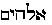
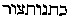
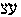

##### The Secret Doctrine by H. P. Blavatsky -- Vol. 2

------------------------------------------------------------------------

###### \[\[Vol. 2, Page\]\] 202 THE SECRET DOCTRINE.

**E**DENS, **S**ERPENTS, AND **D**RAGONS.

Whence the idea, and the true meaning of the term "Eden"? Christians
will maintain that the Garden of Eden is the holy Paradise, the place
*desecrated by the sin* of Adam and Eve; the Occultist will deny this
dead-letter interpretation, and show the reverse. One need not believe
and see in the Bible divine revelation in order to say that this ancient
book, if read esoterically, is based upon the same universal traditions.
What Eden was is partially shown in *Isis Unveiled.*\*

It was said that: "The Garden of Eden as a locality is no myth at all;
it belongs to those landmarks of history which occasionally disclose to
the student that the *Bible* is not all mere allegory. Eden, or the
Hebrew  Gan-Eden, meaning the park or the garden of
Eden, is an archaic name of the country watered by the Euphrates and its
many branches, from Asia and Armenia to the Erythraean sea." (A. Wilder
says that Gan-duniyas is a name of Babylonia.) In the Chaldean "*Book of
Numbers,*" the location is designated in numerals, and in the cypher
Rosicrucian manuscript, left by Count St. Germain, it is fully
described. In the Assyrian *Tablets* it is rendered *Ganduniyas.*
"Behold," says the  (*Elohim*) of Genesis, "the man is
become as one of us." The *Elohim* may be accepted in one sense for
*gods* or powers, and in another for *Aleim,* or priests -- the
hierophants initiated into the good and evil of this world; for there
was a college of priests called the *Aleim,* while the head of their
caste, or the chief of the hierophants was known as *Java-Aleim.*
Instead of becoming a neophyte, and gradually obtaining his esoteric
knowledge through a regular initiation, an *Adam,* or Man, uses his
intuitional faculties and, prompted by the serpent (*Woman* and matter),
tastes of the Tree of Knowledge -- the esoteric or Secret Doctrine --
unlawfully. The priests of Hercules, or Mel-karth, the "Lord of the
Eden," all wore "coats of skin." The text says: "And *Java-Aleim* made
for Adam and his wife  'Chitonuth our.' " The first
Hebrew word, "*chiton,*" is the Greek \[\[*Chiton*\]\], *Chiton.* It
became a Slavonic word by adoption from the *Bible,* and means a *coat,*
an upper garment.

"Though containing the same substratum of esoteric truth as does every
early Cosmogony, the Hebrew Scripture wears on its face the marks of a
double origin. Its Genesis is purely a reminiscence of the Babylonian
captivity. The names of places, men and even objects, can be traced from
the original text to the Chaldeans and the Akkadians, the progenitors
and Aryan instructors of the former. It is strongly contested that the
Akkad tribes of Chaldea, Babylonia and Assyria were in

###### \[\[Footnote(s)\]\] -------------------------------------------------

\* Vol. I., pp. 575, *et seq.*

------------------------------------------------------------------------

###### \[\[Vol. 2, Page\]\] 203 THE GARDEN OF EDEN, A COLLEGE.

any way cognate with the Brahmans of Hindostan; but there are more
proofs in favour of this opinion than otherwise. The Shemite or Assyrian
ought, perchance, to have been called the Turanian, and the Mongolians
have been denominated Scyths. But if the Akkadians ever existed,
otherwise than in the imagination of some ethnologists and philologists,
they certainly would never have been a Turanian tribe, as some
Assyriologists have striven to make us believe. They were simply
emigrants on their way to Asia Minor from India, the cradle of humanity,
and their sacerdotal adepts tarried to civilize and initiate a barbarian
people. Halevy proved the fallacy of the Turanian mania in regard to
Akkadian people, and other scientists have proved that the Babylonian
civilization was neither born nor developed in that country. It was
imported from India, and the importers were Brahminical Hindus."

And now, ten years after this was written, we find ourselves
corroborated by Professor Sayce, who says in his first Hibbert lecture
that the culture of the Babylonian city Eridu was of *foreign
importation. It* came from India.

"Much of the theology was borrowed by the Semites from the non-Semitic
Akkadians or proto-Chaldeans, whom they supplanted, and whose local
cults they had neither the will nor the power to uproot. Indeed,
throughout a long course of ages the two races, Semites and Akkadians,
lived side by side, their notions and worship of the gods blending
insensibly together."

Here, the Akkadians are called "non-Semitic," as we had insisted they
were in "*Isis,*" which is another corroboration. And we are no less
right in always maintaining that the Jewish Biblical history was a
compilation of *historical* facts, arranged from other people's history
in Jewish garb -- Genesis excluded, which is esotericism pure and
simple. But it is really from the Euxine to Kashmir and beyond, that
science has to search for the cradle -- or rather one of the chief
cradles -- of mankind and the sons of Ad-ah; and especially in after
times, when the Garden of Ed-en on the Euphrates became the college of
the astrologers and magi, the Aleim.

But this "college" and this Eden belong to the Fifth Race, and are
simply a faint reminiscence of the Adi-varsha, of the primeval Third
Race. What is the etymological meaning of the word *Eden?* In Greek it
is \[*hedone*\], signifying *voluptuousness.* In this aspect it is no
better than the Olympus of the Greeks, Indra's heaven (Swarga) on Mount
Meru, and even the paradise full of *Houris,* promised by Mahomet to the
faithful. The Garden of Eden was never the property of the Jews; for
China, which can hardly be suspected of having known anything of the
Jews 2,000 **B.C**., has such a primitive garden in Central Asia
inhabited by the "Dragons of Wisdom," the Initiates. And according to
Klaproth,

------------------------------------------------------------------------

###### \[\[Vol. 2, Page\]\] 204 THE SECRET DOCTRINE.

the hieroglyphical chart copied from a Japanese Cyclopaedia in the book
*of Fo-kone-ky,* places its "Garden of Wisdom" on the plateau of Pamir
between the highest peaks of the Himalayan ranges; and describing it as
the culminating point of Central Asia, shows the four rivers -- Oxus,
Indus, Ganges, and Silo -- flowing from a common source, the "*Lake of
the Dragons.*"

But this is not the Genetic Eden; nor is it the Kabalistical Garden of
Eden. For the former -- *Eden Illa-ah* -- means in one sense Wisdom, a
state like that of Nirvana, a paradise of Bliss; while in another sense
it refers to Intellectual man himself, the container of the Eden in
which grows the tree of Knowledge of good and evil: man being the
*Knower* thereof.

Renan and Barthelemy St. Hilaire, basing themselves "on the most solid
inductions," think it impossible to doubt any longer, and both place the
cradle of humanity "on the region of the Timaus." Finally, the Asiatic
Journal\* concludes that: "All the traditions of the human race
gathering its primitive families at the region of their birth-place,
show them to us grouped around the countries where Jewish tradition
places the Garden of Eden; where the Aryans (Zoroastrians) established
their Airyana-vaego or the Meru (?). They are hemmed in to the North by
the countries which join the lake Aral, and to the South by Baltistan,
or Little Tibet. Everything concurs in proving that there was the abode
of that primitive humanity to which we have to be traced."

That "primitive humanity" was in its Fifth Race, when the "four-mouthed
Dragon," the lake, of which very few traces are now left, was the abode
of the "Sons of Wisdom," the first mind-born sons of the Third Race. Yet
it was neither the only one nor the primitive cradle of humanity, though
it was the copy of the cradle, verily, of the first thinking *divine*
man. It was the *Paradesa,* the highland of the first Sanskrit-speaking
people, the *Hedone,* the country of delight of the Greeks, but it was
not the "*bower* of voluptuousness" of the Chaldeans, for the latter was
only the reminiscence of it; and also because it was not there that the
*Fall of Man* occurred after the "separation." The Eden of the Jews was
*copied* from the Chaldean *copy.*

That the Fall of man into generation occurred during the earliest
portion of what science calls the Mesozoic times, or the age of the
reptiles, is evidenced by the Bible phraseology concerning the serpent,
the nature of which is explained in the *Zohar.* The question is not
whether Eve's incident with the tempting reptile is allegorical or
textual, for no one can doubt that it is the former, but to show the
antiquity of the symbolism on the very face of it, and that it was not
only a Jewish but an universal idea.

###### \[\[Footnote(s)\]\] -------------------------------------------------

\* "*Journal Asiatique,*" seventh year, 1855.

------------------------------------------------------------------------

###### \[\[Vol. 2, Page\]\] 205 FLYING CAMELS.

Now we find in the *Zohar* a very strange assertion, one that is
calculated to provoke the reader to merry laughter by its ludicrous
absurdity. It tells us that the serpent, which was used by *Shamael*
(the supposed Satan), to seduce Eve, was a kind of *flying camel
\[\[*kamelomorphon\]\].

A "flying camel" is indeed too much for the most liberal-minded
**F.R.S**. Nevertheless, the *Zohar,* which can hardly be expected to
use the language of a Cuvier, was right in its description:\* for we
find it called in the old Zoroastrian **MSS**. *Aschmogh,* which in the
Avesta is represented as having lost after the Fall "its *nature and its
name,*" and is described as a huge serpent with a camel's neck.

"There are no winged serpents, nor veritable dragons," asserts
Salverte,\*\* " . . . grasshoppers are called by the Greeks *winged
serpents,* and this metaphor may have created several narratives on the
existence of winged serpents."

There are none *now*; but there is no reason why they should not have
existed during the Mesozoic age; and Cuvier, who has reconstructed their
skeletons, is a witness to "flying camels." Already, after finding
simple fossils of certain saurians, the great naturalist has written,
that, "if anything can justify the Hydra and other monsters, whose
figures were so often repeated by mediaeval historians, it is
incontestably the *Plesiosaurus.*"\*\*\*

We are unaware if Cuvier had added anything in the way of a further *mea
culpa.* But we may well imagine his confusion, for all his slanders
against archaic veracity, when he found himself in the presence of a
*flying* saurian, "the Pterodactyl" (found in Germany), "78 feet long,
and carrying vigorous wings attached to its reptilian body." That fossil
is described as a reptile, the *little fingers of whose hands* are so
elongated as to bear a long membranous wing. Here, then, the "flying
camel" of the Zohar is vindicated. For surely, between the long neck of
the Plesiosaurus and the membranous wing of the Pterodactyl, or still
better the Mosasaurus, there is enough scientific probability to build a
"flying camel," or a long-necked dragon. Prof. Cope, of Philadelphia,
has shown that the Mosasaurus fossil in the chalk was a *winged serpent
of* this kind. There are characters in its vertebrae, which indicate
union with the Ophidia rather than with the Lacertilia.

And now to the main question. It is well known that Antiquity has never
claimed palaeontography and paleontology among its arts and sciences;
and it never had its Cuviers. Yet on Babylonian tiles, and especially in
old Chinese and Japanese drawings, in the oldest Pagodas

###### \[\[Footnote(s)\]\] -------------------------------------------------

\* See Moses Maimonides, "*More Nevochim.*"

\*\* "*Science Occulte,*" p. 646.

\*\*\* "*Revolution du Globe,*" vol. v., p. 464.

------------------------------------------------------------------------

###### \[\[Vol. 2, Page\]\] 206 THE SECRET DOCTRINE.

and monuments, and in the Imperial library at Pekin, many a traveller
has seen and recognised perfect representations of Plesiosauri and
Pterodactyls in the multiform Chinese dragons.\* Moreover, the prophets
speak in the Bible of the flying fiery serpents,\*\* and Job mentions
the Leviathan.\*\*\* Now the following questions are put very directly:
--

I. How could the ancient nations know anything of the extinct monsters
of the carboniferous and Mesozoic times, and even represent and describe
them orally and pictorially, unless they had either *seen those monsters
themselves or possessed descriptions of them in their traditions,* which
descriptions necessitate *living and intelligent eye-witnesses?*

II\. And if such eye-witnesses are once admitted (unless retrospective
clairvoyance is granted), how can humanity and the first palaeolithic
men be no earlier than about the middle of the tertiary period? We must
bear in mind that most of the men of science will not allow man to have
appeared before the Quaternary period, and thus shut him out completely
from the Cenozoic times. Here we have extinct species of animals, which
disappeared from the face of the Earth millions of years ago, described
by, and known to, nations whose civilization, it is said, could hardly
have begun a few thousand years ago. How is this? Evidently either the
Mesozoic time has to be made to overlap the Quaternary period, or man
must be made the contemporary of the Pterodactyl and the Plesiosaurus.

It does not stand to reason, because the Occultists believe in and
defend ancient wisdom and science, even though winged saurians are
called "flying camels" in the translations of the *Zohar,* that we
believe as readily in all the stories which the middle ages give us of
such dragons. Pterodactyls and Plesiosauri ceased to exist with the bulk

###### \[\[Footnote(s)\]\] -------------------------------------------------

\* We read in the "*Memoire a l*'*Academie*" of the "naive astonishment
of Geoffrey St. Hilaire, when M. de Paravey showed to him in some old
Chinese works and Babylonian tiles dragons, . . . . saurians and
ornithorhynchuses (aquatic animals *found only in Australia*)*,* etc.,
extinct animals that he had thought unknown on earth. . . . till his own
day."

\*\* See *Isaiah,* xxx. 6: "The viper and the flying serpent unto the
land of trouble and anguish," and the fiery serpents conquered by the
brazen serpent of Moses.

\*\*\* The fossils reconstructed by science, which we know ought to be
sufficient warrant for the possibility of even a *Leviathan,* let alone
Isaiah's flying serpents, or *saraph mehophep,* which words are
translated in all the Hebrew dictionaries as "saraph," enflamed or fiery
venom, and "mehophep," *flying*. But, although Christian theology has
always connected both (*Leviathan and saraph mehophep*) with the devil,
the expressions are metaphorical and have nought to do with the "evil
one." But the word *Dracon* has become a synonym for the latter. In
Bretagne the word *Drouk* now signifies "devil," whence, as we are told
by Cambry ("*Monuments Celtiques,*" p. 299), the devil's tomb in
England, *Draghedanum sepulcrum.* In Languedoc the meteoric fires and
*will-o*'*-the-wisps* are called *Dragg*, and in Bretagne Dreag, *Wraie*
(or wraith), the castle of Drogheda in Ireland meaning the devil's
castle.

------------------------------------------------------------------------

###### \[\[Vol. 2, Page\]\] 207 KIRCHER'S DRAGON.

of the Third Race. When, therefore, we are gravely asked by Roman
Catholic writers to credit Christopher Scherer's and Father Kircher's
cock-and-bull stories of their having seen with their own eyes living
fiery and flying dragons, respectively in 1619 and 1669, we may be
allowed to regard their assertions as either dreams or fibs.\* Nor shall
we regard otherwise than as a *poetical license* that other story told
of Petrarch, who, while following one day his Laura in the woods and
passing near a cave, is credited with having found a dragon, whom he
forthwith stabbed with his dagger and killed, thus preventing the
monster from devouring the lady of his heart.\*\* We would willingly
believe the story had Petrarch lived in the days of Atlantis, when such
antediluvian monsters may still have existed. We deny their existence in
our present era. The sea-serpent is one thing, the dragon quite another.
The former is denied by the majority because it exists and lives in the
very depths of the ocean, is very scarce, and rises to the surface only
when compelled, perhaps, by hunger. Thus keeping invisible, it may exist
and still be denied. But if there was such a thing as a dragon of the
above description, how could it have ever escaped detection? It is a
creature contemporary with the earliest Fifth Race, and exists no more.

###### \[\[Footnote(s)\]\] -------------------------------------------------

\* The ultramontane writers accept the whole series of draconian stories
given by Father Kircher (*Edipus AEgyptiacus,* "*De Genere Draconum,*")
quite seriously. According to that Jesuit, he himself saw a dragon which
was killed in 1669 by a Roman peasant, as the director of the Museo
Barberini sent it to him, to take the beast's likeness, which Father
Kircher did and had it published in one of his *in-folios.* After this
he received a letter from Christopher Scherer, Prefect of the Canton of
Soleure, Switzerland, in which that official certifies to his having
seen himself *with his own eyes,* one fine summer night in 1619, a
living dragon. Having remained on his balcony "to contemplate the
perfect purity of the firmament," he writes, "I saw a fiery, shining
dragon rise from one of the caves of Mount Pilatus and direct itself
rapidly towards Fluelen to the other end of the lake. Enormous in size,
his tail was still longer and his neck very extended. His head and jaws
were those of a serpent. In flying he emitted on his way numerous sparks
(? !) . . . . I thought at first I was seeing a meteor, but soon looking
more attentively, I was convinced by his flight and the conformation of
his body that I saw a *veritable dragon.* I am happy to be thus able to
enlighten your Reverence on the *very real* existence of those animals";
in *dreams,* the writer ought to have added, of long past ages.

\*\* As a convincing proof of the reality of the fact, a Roman Catholic
refers the reader to the picture of that incident painted by Simon de
Sienne, a friend of the poet, on the portal of the Church *Notre Dame du
Don* at Avignon; notwithstanding the prohibition of the Sovereign
Pontiff, who "would not allow this triumph of love to be enthroned in
the holy place"; and adds: "Time has injured and rubbed out the work of
art, but has not weakened its tradition." De Mirville's "Dragon-Devils"
of our era seem to have no luck, as they disappear most mysteriously
from the museums where they are said to have been. Thus the dragon
embalmed by Ulysses Aldobranda and presented to the Musee du Senat,
either in Naples or Bologna, "was there still in 1700, but is there no
more." (*Vol. 2, p. 427, "Pneumatologie.*")

------------------------------------------------------------------------

###### \[\[Vol. 2, Page\]\] 208 THE SECRET DOCTRINE.

The reader may inquire why we speak of dragons at all? We answer:
*firstly,* because the knowledge of such animals is a proof of the
enormous antiquity of the human race; and *secondly,* to show the
difference between the zoological real meaning of the words "dragon,"
"*Naga,*" and "Serpent," and the metaphorical one, when used
symbolically. The profane reader, who knows nothing of the mystery
language, is likely, whenever he finds one of these words mentioned, to
accept it literally. Hence, the *quid pro quos* and unjust accusations.
A couple of instances will suffice.

*Sed et serpens?* aye: but what was the nature of the serpent? Mystics
intuitionally see in the serpent of *Genesis* an animal emblem and a
high spiritual essence: a cosmic force superintelligent, a "great fallen
light," a spirit sidereal, aerial and tellurian at the same time, "whose
influence circumambulates the globe (*qui circumambulat terram*)*,* as a
Christian fanatic of the dead-letter (de Mirville) has it, and which
only manifested itself under the physical emblem, which was the most
convenient "with respect to its moral and intellectual *coils*"*: i.e.*
under the ophidian form.

But what will Christians make of the Brazen Serpent, the "DIVINE
HEALER," if the serpent is to be regarded as the emblem of cunning and
evil? The "Evil One" itself? How can the line of demarcation ever be
settled, when it is traced arbitrarily in a sectarian theological
spirit. For, if the followers of the Roman Church are taught that
Mercury and AEsculapius, or Asclepios, who are, in truth, one, are
"devils and sons of devils," and the wand and serpent of the latter were
"the devil's wand"; how about the "brazen serpent" of Moses? Every
scholar knows that both the *heathen* wand and the Jewish "serpent" are
one and the same, namely, the *Caduceus of Mercury,* son of
**A**POLLO-PYTHON. It is easy to comprehend why the Jews adopted the
ophidian shape for their "seducer." With them it was purely
*physiological and phallic*; and no amount of casuistical reasoning on
the part of the Roman Catholic Church can give it another meaning, once
that the mystery language is well studied, and that the Hebrew scrolls
are read numerically. The Occultists know that the serpent, the *Naga,*
and the dragon have each a septenary meaning; that the Sun, for
instance, was the *astronomical* and cosmic emblem of the two contrasted
lights, and the two serpents of the Gnostics, the good and the evil one;
they also know that, when *generalised,* the conclusions of both science
and theology present two most ridiculous extremes. For, when the former
tells us that it is sufficient to trace the legends of the serpents to
their primal source, the astrological legend, and to meditate seriously
on the *Sun*, conqueror of Python, and the celestial virgin in the
Zodiac forcing back the devouring dragon, if we would have the key of
all the subsequent religious dogmas; it is easy to perceive that,
instead of

------------------------------------------------------------------------

###### \[\[Vol. 2, Page\]\] 209 COBRAS AS SYMBOLS.

generalising, the author simply has his eye on Christian religion and
*Revelation.* We call this one extreme. The other we see in this: when,
repeating the famous decision of the Council of Trent, theology seeks to
convince the masses that "from the fall of man until the hour of his
baptism the devil has full power over him, and *possesses him by right*
(*diabolum dominationem et potestatem super homines habere et jure cos
possidere*)." To this Occult philosophy answers: Prove first the
existence of the devil *as an entity,* and then we may believe in such
congenital possession. A very small amount of observation and knowledge
of human nature may be sufficient to prove the fallacy of this
theological dogma. Had **S**ATAN any reality, in the objective or even
subjective world (in the ecclesiastical sense), it is the poor devil who
would find himself chronically obsessed and even possessed by the wicked
-- hence by the bulk of mankind. It is humanity itself, and especially
the clergy, headed by the haughty, unscrupulous and intolerant Roman
Church, which have begotten, given birth to, and reared in love the evil
one; but this is a digression.

"The whole world of thought is reproached by the Church with having
adored the serpent. The whole of humanity 'incensed and at the same time
stoned it.' The Zend Avesta speaks of it as the Kings and Vedas do, as
the Edda and the Bible. . . . Everywhere the sacred serpent, the naga,
and its shrine and its priest; in Rome it is the Vestal who prepares its
meal with the same care as she bestows on the sacred fire. In Greece,
AEsculapius cannot cure without its assistance, and delegates to it his
powers. Everyone has heard of the famous Roman embassy sent by the
Senate to the god of medicine and its return with the not less famous
serpent, which proceeded of its own will and by itself toward its
Master's temple on one of the islands of the Tiber. Not a Bacchante that
did not wind it (the serpent) in her hair, not an Augur but questioned
it oracularly, not a necromancer whose tomb is free from its presence!
The Cainites and the Ophites call it Creator, while recognizing, as
Schelling did, that the serpent is 'evil in substance and its
personification.' "\*

Yes, the author is right, and if one would have a complete idea of the
prestige which the serpent enjoys to our own day, one ought to study the
matter in India and learn all that is believed about, and still
attributed to, the *Nagas* (Cobras) in that country; one should also
visit the Africans of Whydah, the Voodoos of Port-au-Prince and Jamaica,
the Nagals of Mexico, and the Pa, or men-serpents of China, &c. But why
wonder that the serpent is "adored" and at the same time cursed, since
we

###### \[\[Footnote(s)\]\] -------------------------------------------------

\* "Sacred Serpents" on p. 432 of de Mirville's "*Memoire.*"

------------------------------------------------------------------------

###### \[\[Vol. 2, Page\]\] 210 THE SECRET DOCTRINE

know that from the beginning it was a symbol?\* In every ancient
language the word *dragon* signified what it now does in Chinese --
(*lang*) *i.e.,* "*the being who excels in intelligence*" and in Greek
\[\[*drakon*\]\], or "he who sees and watches." And is it to the animal
of that name that any of these epithets can apply? Is it not evident,
wherever superstition and oblivion of the primitive meaning may have led
savages now, that the said qualifications were intended to apply to the
human originals, who were symbolized by serpents and dragons? These
"originals" -- called to this day in China "the Dragons of Wisdom" --
were the first disciples of the Dhyanis, who were their instructors; in
short, the primitive adepts of the Third Race, and later, of the Fourth
and Fifth Races. The name became universal, and no sane man before the
Christian era would ever have confounded the man and the symbol.

The symbol of Chnouphis, or the soul of the world, writes Champollion,
"is among others that of an enormous serpent standing on human legs;
this reptile, the emblem of the good genius, is a *veritable
Agathodaemon.* It is often represented bearded. . . . . That sacred
animal, identical with the serpent of the Ophites, is found engraved on
numerous Gnostic or Basilidean stones . . . . The serpent has various
heads, but is constantly inscribed with the letters
\[\[*CHNOUBIS*\]\]."\*\* Agathodaemon was endowed "with the knowledge of
good and evil," *i.e.*, with divine Wisdom, as without the former the
latter is impossible.\*\*\* Repeating Iamblichus, Champollion shows him
to be "the deity called \[\[*Eichton\]\]* (or the fire of the celestial
gods -- the great \*\*\*\* Thot-

###### \[\[Footnote(s)\]\] -------------------------------------------------

\* This is about as just as though -- a few millenniums hence -- a
fanatic of some future new creed, who was bent on glorifying *his*
religion at the expense of *ancient* Christianity, were to say:
"Everywhere the quadruped lamb was adored. The nun placed it, calling it
the Agnus, on her bosom; the priest laid it on the altar. It figured in
every paschal meal, and was glorified loudly in every temple. And yet
the Christians dreaded it and hated it, for they slew and devoured it. .
. ." Heathens, at any rate, do not eat their sacred symbols. We know of
no serpent, or reptile-eaters except in Christian civilized countries,
where they begin with frogs and eels, and must end with real snakes, as
they have begun with lamb and ended with horse-flesh.

\*\* "*Pantheon,*" *3.*

\*\*\* The solar Chnouphis, or *Agathodaemon,* is the Christos of the
Gnostics, as every scholar knows. He is intimately connected with the
seven sons of Sophia (Wisdom), the seven sons of Aditi (universal
Wisdom), her eighth being Marttanda, the Sun, which seven are the seven
planetary regents or genii. Therefore Chnouphis was the *spiritual Sun
of Enlightenment,* of Wisdom, hence the patron of all the Egyptian
Initiates, as Bel-Merodach (or Bel-Belitanus) became later with the
Chaldeans.

\*\*\*\* Hermes, or rather Thot, was a generic name. Abul Teda shows in
"*Historia Anti-Islamitica*" five Hermes, and the names of Hermes, Nebo,
Thot were given respectively in various countries to great Initiates.
Thus *Nebo,* the son of Merodach and Zarpanitu (whom Herodotus calls
Zeus-Belos), gave his name to all the great prophets, seers and
Initiates. They were all "serpents of Wisdom," as connected with the Sun
astronomically, and with Wisdom spiritually.

------------------------------------------------------------------------

###### \[\[Vol. 2, Page\]\] 211 TWO SCHOOLS OF MAGIC.

Hermes), to whom Hermes Trismegistus attributes the invention of
magic."\*

The "*invention of* *magic!*" A strange term to use, as though the
unveiling of the eternal and actual mysteries of nature could be
*invented*! As well attribute, millenniums hence, the *invention*
instead of the discovery of radiant matter to Prof. Crookes. Hermes was
not the inventor, or even the discoverer, for, as said in the foot-note,
Thot-Hermes is a generic name, as is Enoch (Enoichion, the "inner,
spiritual eye")*, Nebo,* the prophet and seer, etc. It is not the proper
name of any one living man, but a generic title of many adepts. Their
connection in symbolic allegories with the serpent is due to their
enlightenment by the solar and planetary gods during the earliest
intellectual Race, the Third. They are all the representative patrons of
the Secret Wisdom. Asclepios is the son of the Sun-god Apollo -- and he
is Mercury; Nebo is the son of Bel-Merodach; Vaivasvata Manu, the great
Rishi, is the son of Vivisvat -- the Sun or Surya, etc., etc. And while,
astronomically, the Nagas along with the Rishis, the Gandharvas,
Apsarasas, Gramanis (or Yakshas, minor gods) Yatudhanas and Devas, are
the Sun's attendants throughout the twelve solar months; in theogony,
and also in anthropological evolution, they are gods and men -- when
incarnated in the *nether* world. Let the reader be reminded, in this
connection, of the fact that Apollonius met in Kashmir Buddhist *Nagas
-*- which are neither serpents zoologically, nor yet the *Nagas*
ethnologically, but "wise men."

The Bible, from *Genesis* to *Revelations,* is but a series of
historical records of the great struggle between white and black Magic,
between the Adepts of the right path, the Prophets, and those of the
left, the Levites, the clergy of the brutal masses. Even the students of
Occultism, though some of them have more archaic **MSS**. and direct
teaching to rely upon, find it difficult to draw a line of demarcation
between the *Sodales* of the Right Path and those of the Left. The great
schism that arose between the sons of the Fourth Race, as soon as the
first Temples and Halls of Initiation had been erected under the
guidance of "the Sons of God," is allegorized in the Sons of Jacob. That
there were two schools of Magic, and that the orthodox Levites did not
belong to the *holy* one, is shown in the words pronounced by the dying
Jacob. And here it may be well to quote a few sentences from "*Isis
Unveiled.*"

The dying Jacob thus describes his sons: "Dan," he says, "shall be a
*serpent* by the way, an *adder* in the path, that biteth the
horse-heels, so that his rider shall fall backwards (*i.e.,* he will
teach candidates *black* magic) . . . . I have waited for thy salvation,
O Lord!" Of Simeon and Levi the patriarch remarks that they" . . . *are*
brethren; instru-

\[\[Footnote(s)\]\] -------------------------------------------------

\* "*Pantheon,*" text 15.

------------------------------------------------------------------------

###### \[\[Vol. 2, Page\]\] 212 THE SECRET DOCTRINE.

ments of *cruelty* are in their habitations. O my soul, come not thou
into their *secret*; unto *their assembly.*"\* Now in the original, the
words "their secret" really are "their **S**OD."\*\* And Sod was the
name for the great mysteries of Baal, Adonis and Bacchus, who were all
sun-gods and had serpents for symbols. The Kabalists explain the
allegory of the fiery serpents by saying that this was the name given to
the tribe of Levi, to all the *Levites,* in short, and that Moses was
the chief of the *Sodales.*\*\*\* It is to the mysteries that the
original meaning of the "Dragon-Slayers" has to be traced, and the
question is fully treated of hereafter.

Meanwhile it follows that, if Moses was the chief of the Mysteries, he
was the Hierophant thereof, and further, if, at the same time, we find
the prophets thundering against the "abominations" of the people of
Israel, that there were two schools. "Fiery serpents" was, then, simply
the epithet given to the Levites of the priestly caste, after they had
departed from the *good law,* the traditional teachings of Moses: and to
all those who followed *Black Magic.* Isaiah, when referring to the
"rebellious children" who will have to carry their riches into the land
whence come "the viper and *fiery* flying *serpent*" (*xxx.* 6), or
Chaldea and Egypt, whose Initiates had already greatly degenerated in
his day (700 **B.C**.), meant the sorcerers of those lands.\*\*\*\* But
these must be carefully distinguished from the "Fiery Dragons of Wisdom"
and the "Sons of the Fire Mist."

In the "*Great Book of the Mysteries*" we are told that: "Seven Lords
created Seven men; three Lords (Dhyan Chohans or Pitris) were holy and
good, four less heavenly and full of passion. . . . The *chhayas*
(phantoms) of the Fathers were as they."

This accounts for the differences in human nature, which is divided into
seven gradations of good and evil. There were seven tabernacles ready to
be inhabited by Monads under seven different Karmic conditions. The
Commentaries explain on this basis the easy spread of evil, as soon as
the human Forms had become real men. Some ancient

###### \[\[Footnote(s)\]\] -------------------------------------------------

\* "*Genesis,*" ch. xlix.

\*\* Dunlap, in his introduction to "*Sod, the Mysteries of Adonis,*"
explains the word "Sod" as *arcanum*, religious mystery, on the
authority of Schindler's "*Penteglott.*" "The secret of the Lord is with
them that fear him," says Psalm xxv., 14. This is a mistranslation of
the Christians, for it ought to read "*Sod Ihoh* (the mysteries of Ihoh)
are for *those who fear him*" (*Dunlap,* "*Mysteries of Adonis,*" xi).
"Al (El) is terrible in the great Sod of the *Kadeshim* (the priests,
the holy, the *Initiated*)*,* Psalm lxxxix, 7" (*ibid*.)*.* The Kadeshim
were very far from holy. (*Vide* Part **II**., "*The Holy of Holies.*")

\*\*\* "The members of the *priest-Colleges* were called *Sodales,*"
says Freund's "Latin Lexicon" (iv. 448). "Sodalities were constituted in
the Idaean Mysteries of the **M**IGHTY **M**OTHER," writes *Cicero in de
Senectute.* ("*Mysteries of Adonis.*")

\*\*\*\* The priests of Baal who jumped over the fires. But this was a
Hebrew term and a local one. "Saraph" -- "fiery or flaming venom."

------------------------------------------------------------------------

###### \[\[Vol. 2, Page\]\] 213 THE SEVENTH SON OF THE SEVENTH SON.

philosophers ignored the seven in their genetical accounts and gave only
four. Thus the Mexican local *Genesis* has "four *good* men" described
as the four real ancestors of the human race, "who were neither begotten
by the gods nor born of woman"; but whose creation was a wonder wrought
by the creative Powers, and who were made only after "three *attempts at
manufacturing men had failed.*" The Egyptians had in their theology only
"four sons of God," whereas in *Pymander seven* are given -- thus
avoiding any mention of the evil nature of man; though when Seth from a
god sank into Set-Typhon, he began to be called "the seventh son."
Whence probably arose the belief that "the seventh son of the seventh
son" is always a natural-born magician, though, at first, only a
*sorcerer* was meant. **A**PAP, the serpent symbolizing evil, is slain
by Aker, Set's serpent;\* therefore Set-Typhon could not be that evil.
In the "*Book of the Dead*" it is commanded (*v*. 13) that chapter
clxiii. should be read "in the presence of a serpent on two legs," which
means a high Initiate, a Hierophant, for the discus and ram's horns\*\*
that adorn his "serpent's" head in the hieroglyphics of the title of the
said chapter denote this. Over the "serpent" are represented the two
mystic eyes of Ammon,\*\*\* the hidden "mystery god." This passage
corroborates our assertion, and shows what the word "serpent" meant in
antiquity.

But as to the Nagals and Nargals, whence came the similarity of names
between the Indian Nagas and the American Nagals?

"The Nargal was the Chaldean and Assyrian chief of the Magi (Rab-Mag),
and the Nagal was the chief sorcerer of the Mexican Indians. Both derive
their names from Nergal-Serezer, the Assyrian god, and the Hindu Nagas.
Both have the same faculties and the power to have an attendant
*daemon*, with whom they identify themselves completely. The Chaldean
and Assyrian Nargal kept his *daemon,* in the shape of some animal
considered sacred, inside the temple; the Indian Nagal keeps his
wherever he can -- in the neighbouring lake, or wood, or in the house in
the shape of some household animal."\*\*\*\*

Such similarity cannot be attributed to *coincidence.* A new world is
discovered, and we find that, for our forefathers of the Fourth Race,

###### \[\[Footnote(s)\]\] -------------------------------------------------

\* "*Book of the Dead*" xxxix.

\*\* The same ram's horns are found on the heads of Moses which were on
some old medals seen by the writer in Palestine, one of which is in her
possession. The horns, made to form part of the shining aureole on the
statue of Moses in Rome (Michael Angelo), are vertical instead of being
bent down to the ears, but the emblem is the same; hence the Brazen
Serpent.

\*\*\* But see Harris's "*Magic Papyrus*" No. v.; and the ram-headed
Ammon manufacturing men on a potter's wheel.

\*\*\*\* Brasseur de Bourbourg: "*Mexique,*" pp. 135 and 574.

------------------------------------------------------------------------

###### \[\[Vol. 2, Page\]\] 214 THE SECRET DOCTRINE.

it was already an old one. That Arjuna, Krishna's companion and *chela,*
is said to have descended into *Patala,* the "antipodes," and therein
married *Ulupi,*\* a Naga (or Nagini rather), the daughter of the king
of the Nagas, Kauravya.\*\*

And now it may be hoped the full meaning of the serpent emblem is
proven. It is neither that of evil, nor, least of all, that of the
devil; but is *,* indeed, the \[\[SEMES EILAM ABRASAX\]\] ("the eternal
Sun-Abrasax"), the central spiritual sun of all the Kabalists,
represented in some diagrams by the circle of Tiphereth.

And here, again, we may quote from our earlier volumes and enter into
further explanations.

"From this region of unfathomable depth (Bythos, Aditi, Shekinah, the
veil of the unknown) issues forth a circle formed of spirals. This is
Tiphereth; which, in the language of symbolism, means a grand cycle,
composed of smaller ones. Coiled within, so as to follow the spirals,
lies the serpent -- emblem of Wisdom and Eternity -- the dual Androgyne;
the cycle representing *Ennoia*, or the divine mind (a power which does
not create but which must assimilate), and the serpent, the
Agathodaemon, the Ophis, *the Shadow of the Light* (non-eternal, yet the
greatest divine light on our plane). Both were the *Logoi* of the
Ophites: or the Unity as *Logos* manifesting itself as a double
principle of Good and Evil."

Were it light alone, inactive and absolute, the human mind could not
appreciate nor even realise it. Shadow is that which enables light to
manifest itself, and gives it objective reality. Therefore, shadow is
not evil, but is the necessary and indispensable corollary which
completes Light or Good: *it is its creator on Earth.*

According to the views of the Gnostics, these two principles are
immutable Light and Shadow, Good and Evil being virtually one and having
existed through all eternity, as they will ever continue to exist so
long as there are manifested worlds.

This symbol accounts for the adoration by this sect of the Serpent, as
the Saviour, coiled either around the sacramental loaf, or a Tau, the
phallic emblem. As a Unity, Ennoia and Ophis are the *Logos.* When
separated, one is the Tree of Life (spiritual), the other, the Tree

###### \[\[Footnote(s)\]\] -------------------------------------------------

\* Ulupi has an entirely Atlantean ring about it. Like Atlantis, it is
neither a Greek nor a Sanskrit name, but reminds one of Mexican names.

\*\* "Mahabharata," Adiparva, Sloka, 7788, 7789. The "Bhagavata Purana,"
ix., xx., 31, as explained by Sridhera, the commentator, makes Ulupi the
daughter of the king of Manipura; but the late Pundit Dayanand
Saraswati, certainly the greatest Sanskrit and Puranic authority in
India on such questions, personally corroborated that Ulupi was daughter
of the king of the Nagas at Patala, or America, 5000 years ago, and that
the Nagas were Initiates.

------------------------------------------------------------------------

###### \[\[Vol. 2, Page\]\] 215 BUDDHA'S GREAT MOUNTAIN.

of Knowledge of Good and Evil. Therefore, we find Ophis urging the first
human couple -- the material production of Ilda-Baoth, but which owed
its spiritual principle to Sophia-Achamoth -- to eat of the forbidden
fruit, although Ophis represents divine Wisdom.

The serpent, the Tree of Knowledge of Good and Evil, and the Tree of
Life, are all symbols transplanted from the soil of India. The
Arasa-Maram, the banyan tree, so sacred with the Hindus (since Vishnu
during one of his incarnations, reposed under its mighty shade and there
taught human philosophy and sciences), is called the Tree of Knowledge
and the Tree of Life. Under the protecting foliage of this king of the
forests, the Gurus teach their pupils their first lessons on immortality
and initiate them into the mysteries of life and death. The Java-Aleim
of the Sacerdotal College are said, in the Chaldean tradition, to have
taught the sons of men to become like one of them. To the present day
Foh-tchou,\* who lives in his Foh-Maeyu, or temple of Buddha, on the top
of the "Kouin-long-sang,"\*\* the great mountain, produces his greatest
religious miracles under a tree called in Chinese Sung-Ming-Shu, or the
Tree of Knowledge and the Tree of Life, for ignorance is death, and
knowledge alone gives immortality. This marvellous display takes place
every three years, when an immense concourse of Chinese Buddhists
assembles in pilgrimage at the holy place.

Now it may become comprehensible why the earliest Initiates and Adepts,
or the "Wise Men," for whom it is claimed that they were initiated into
the mysteries of nature by the UNIVERSAL MIND, represented by the
highest angels, were named the "Serpents of Wisdom" and "Dragons;" as
also how the first physiologically complete couples -- after being
initiated into the mystery of human creation through Ophis, *the
manifested Logos* and the androgyne, by eating of the fruit of knowledge
-- gradually began to be accused by the material spirit of posterity of
having *committed Sin,* of having disobeyed the "Lord God," and of
having been tempted by the Serpent.

So little have the first Christians (who despoiled the Jews of their
Bible) understood the first four chapters of Genesis in their esoteric
meaning, that they never perceived that not only was no sin intended in
this disobedience, but that actually the "Serpent" was "the Lord God"
himself, who, as the Ophis, the Logos, or the bearer of divine creative
wisdom, taught mankind to become creators in their turn.\*\*\* They

###### \[\[Footnote(s)\]\] -------------------------------------------------

\* Foh-tchou, literally, in Chinese meaning Buddha's lord, or the
teacher of the doctrines of Buddha-Foh.

\*\* This mountain is situated south-west of China, almost between China
and Tibet.

\*\*\* Let the reader be reminded that in the *Zohar,* and also in all
the Kabalistic works, it is maintained that "Metatron united to
*Shekinah*" (or Shekinah as the veil (grace) \[\[Footnote continued on
next page\]\]

------------------------------------------------------------------------

###### \[\[Vol. 2, Page\]\] 216 THE SECRET DOCTRINE.

never realised that the *Cross was* an evolution from the "tree and the
serpent," and thus *became the salvation of mankind.* By this it would
become the very first fundamental symbol of Creative cause, applying to
geometry, to numbers, to astronomy, to measure and to animal
reproduction. According to the Kabala the *curse on man came with the
formation of woman.*\* The circle was separated from its diameter line.
"From the possession of the double principle in one, that is the
Androgyne condition, the separation of the dual principle was made,
presenting two opposites, whose destiny it was, for ever after, to seek
reunion into the original *one* condition. The curse was this, viz.:
that nature, impelling the search, evaded the desired result by the
production of a new being, distinct from that reunion or oneness
desired, by which the natural longing to recover a lost state was and is
for ever being cheated. It is by this tantalizing process of a continued
curse that Nature lives."\*\* (*Vide* "*Cross and Circle,*" Part II.)

The allegory of Adam being driven away from the "Tree of Life" means,
esoterically, that the newly separated Race abused and dragged the
mystery of Life down into the region of animalism and bestiality. For,
as the *Zohar* shows, that Matronethah (Shekinah, the wife of Metatron
symbolically) "is the way to the great Tree of Life, the Mighty Tree,"
and Shekinah is divine grace. As explained: This Tree reaches the
heavenly vale and is hidden between three mountains (the upper triad of
principles, in man). From these three mountains, the Tree ascends above
(the adept's knowledge aspires heavenward) and then redescends below
(into the adept's *Ego* on Earth). This Tree is revealed in the day time
and is hidden during the night, *i.e*., revealed to an enlightened mind
and hidden to Ignorance, which is night. (See *Zohar* I., 172, *a* and
*b*.) "The Tree of the Knowledge of the Good and the Evil grows from the
roots of the Tree of Life." (Comm.) But then also: "In the Kabala it is
plainly to be found that "the '*Tree of Life*' was

###### \[\[Footnote(s)\]\] -------------------------------------------------

\[\[Footnote continued from previous page\]\] of Ain-Soph), representing
the Logos, is that very *Tree of Knowledge*; while Shamael -- the dark
aspect of the Logos -- occupies only the rind of that tree, and has the
knowledge of EVIL alone. As Lacour, who saw in the scene of the Fall
(*chap.* iii., *Genesis*) an incident pertaining to Egyptian Initiation,
says: -- "The Tree of the *Divination,* or of the *Knowledge* of Good
and Evil . . . . is the science of *Tzyphon,* the genius of doubt, *Tzy*
to teach, and *phon*, doubt. Tzyphon is one of the Aleim; we shall see
him presently under the name of *Nach,* the tempter" (*Les OEloim, Vol.
II.,* p. 218). He is now known to the symbologists under the name
**J**EHOVAH.

\* This is the view taken and adopted by all the Church Fathers, but it
is not the real esoteric teaching. The *curse* did not begin with the
formation of either man or woman, for their separation was a natural
sequence of evolution, but for *breaking the law* (*See supra*).

\*\* "By which (human) nature lives," not even the animal -- but the
misguided, sensual and vicious nature, which *men, not nature, created.*

------------------------------------------------------------------------

###### \[\[Vol. 2, Page\]\] 217 "MYTHICAL" MONSTERS A REALITY.

the ansated cross in its sexual aspect, and that the '*Tree of
Knowledge*' was the separation and the coming together again to fulfil
the fatal condition. To display this in numbers the values of the
letters composing the word Otz ( ), tree, are 7 and 9,
the seven being the holy feminine number and the nine the number of the
phallic or male energy. This ansated cross is the symbol of the Egyptian
*female-male, Isis-Osiris,* the germinal principle in all forms, based
on the primal manifestation applicable in all directions and in all
senses."\*

This is the Kabalistic view of the Western Occultists, and it differs
from the more philosophical Eastern or Aryan views upon this
subject.\*\* The separation of the sexes was in the programme of nature
and of natural evolution; and the creative faculty in male and female
was a gift of Divine wisdom. In the truth of such traditions the whole
of antiquity, from the patrician philosopher to the humblest spiritually
inclined plebeian, has believed. And as we proceed, we may successfully
show that the *relative* truth of such legends, if not their absolute
exactness -- vouched for by such giants of intellect as were Solon,
Pythagoras, Plato, and others -- begins to dawn upon more than one
modern scientist. He is perplexed; he stands startled and confused
before proofs that are being daily accumulated before him; he feels that
there is no way of solving the many historical problems that stare him
in the face, unless he begins by accepting ancient traditions.
Therefore, in saying that we believe absolutely in ancient records and
*universal* legends, we need hardly plead guilty before the impartial
observer, for other and far more learned writers, among those who belong
to the modern scientific school, evidently believe in much that the
Occultists do: *e.g.,* in "Dragons," not only symbolically, but also in
their actual existence at one time.

"It would have indeed been a bold step for anyone, some thirty years
ago, to have thought of treating the public to a collection of stories
ordinarily reputed fabulous, and of claiming for them the consideration
due to genuine realities, or to have advocated tales, believed to be
time-honoured fictions, as actual facts; and those of the nursery as
being, in many instances, legends, more or less distorted, descriptive
of real beings or events. Nowadays it is a less hazardous proceeding . .
. . . "

Thus opens the introduction to a recent (1886) and most interesting work
by Mr. Charles Gould, called "Mythical Monsters." He boldly states his
belief in most of these monsters. He submits that: -- "Many of the
so-called mythical animals, which, throughout long ages and in all
nations, have been the fertile subjects of fiction and fable, come

###### \[\[Footnote(s)\]\] -------------------------------------------------

\* "The Source of Measures."

\*\* *Vide infra,* "The Septenary," in Part **II**.

------------------------------------------------------------------------

###### \[\[Vol. 2, Page\]\] 218 THE SECRET DOCTRINE.

legitimately within the scope of plain matter-of-fact natural history;
and that they may be considered, not as the outcome of exuberant fancy,
but as creatures which really once existed, and of which, unfortunately,
only imperfect and inaccurate descriptions have filtered down to us,
probably very much refracted, through the mists of time. . . .
Traditions of creatures *once co-existing with man, some of which are so
weird and terrible as to appear at first sight to be impossible.* For me
the major part of those creatures are not chimeras but objects of
rational study. The dragon, in place of being a creature evolved out of
the imagination of an Aryan man by the contemplation of lightning
flashing through the caverns which he tenanted, as is held by some
mythologists, is an animal which once lived and dragged its ponderous
coils and perhaps flew. . . . . To me the specific existence of the
Unicorn seems not incredible, and in fact, more probable than that
theory which assigns its origin to a lunar myth\* . . . For my part I
doubt the general derivation of myths from 'the contemplation of the
visible workings of external nature.' It seems to me easier to suppose
that the palsy of time has enfeebled the utterance of these oft-told
tales until their original appearance is almost unrecognisable, than
that *uncultured savages should possess powers of imagination and
poetical invention far beyond those enjoyed by the most instructed
nations of the present day*; less hard to believe that these wonderful
stories of gods and demigods, of giants and dwarfs, of dragons and
monsters of all descriptions are *transformations than to believe* them
to be inventions."\*\*

It is shown by the same geologist that man, "successively traced to
periods *variously estimated from thirty thousand to one million years
.* . . . . , co-existed with animals which have long since become
extinct (*p*. 20)." These animals, "weird and terrible," were, to give a
few instances -- (1) "Of the *genus Cidastes,* whose huge bones and
vertebrae show them to have attained a length of nearly two hundred feet
. . . . . . " The remains of such monsters, no less than ten in number,
were seen by Professor Marsh in the Mauvaises Terres of Colorado, strewn
upon the plains. (2) The *Titanosaurus montanus,* reaching fifty or
sixty feet in length; (3) the *Dinosaurians* (in the Jurassic beds of
the Rocky Mountains), of still more gigantic proportions; (4) the
*Atlanto-Saurus immanis,* a *femur* of which alone is over six feet in
length, and which would be thus over one hundred feet in length! But
even yet the line has not been reached, and we hear of the discovery of
remains of such titanic proportions as to possess a thigh-bone over
twelve feet in length (*p*. 37). Then we read of the monstrous
*Sivatherium* in the Himalayas, the four-horned stag, as large as an
elephant, and exceeding the latter in height; of the gigantic
*Megatherium:* of colossal flying lizards, *Pterodactyli,* with

###### \[\[Footnote(s)\]\] -------------------------------------------------

\* "*The Unicorn: a Mythological Investigation,*" Robert Brown, jun.,
**F.S.A**.

\*\* Pp. 3 and 4, Introduction to "Mythical Monsters."

------------------------------------------------------------------------

###### \[\[Vol. 2, Page\]\] 219 THE FLYING DRAGONS.

crocodile jaws on a duck's head, etc., etc. *All these were co-existent
with man, most probably attacked man, as man attacked them*; and we are
asked to believe that the said man was no larger then than he is now! Is
it possible to conceive that, surrounded in Nature with such monstrous
creatures, man, unless himself a colossal giant, could have survived,
while all his foes have perished? Is it with his stone hatchet that he
had the best of a *Sivatherium* or a gigantic flying saurian? Let us
always bear in mind that at least one great man of science, de
Quatrefages, sees no good scientific reasons why man should not have
been "contemporaneous with the earliest mammalia and go back as *far as
the* *Secondary Period.*"\*

"It appears," writes the very conservative Professor Jukes, "that the
flying dragons of romance had something like a real existence in former
ages of the world."\*\* "Does the written history of man," the author
goes on to ask, "comprising a few thousand years, embrace the whole
course of his intelligent existence? Or have we in the long mythical
eras, extending over hundreds of thousands of years, and recorded in the
chronologies of Chaldea and China, shadowy mementoes of prehistoric man,
handed down by tradition, and perhaps transported by a few survivors to
existing lands, from others which, like the fabled Atlantis of Plato,
may have been submerged, or the scene of some great catastrophe which
destroyed them with all their civilization;" (p. 17).

The few remaining giant animals, such as elephants, themselves smaller
than their ancestors the Mastodons, and Hippopotami, are the only
surviving relics, and tend to disappear more entirely with every day.
Even they have already had a few pioneers of their future genus, and
have decreased in size in the same proportion as men did. For the
remains of a pigmy elephant were found (*E. Falconeri*) in the cave
deposits of Malta; and the same author asserts that they were associated
with the remains of pigmy Hippopotami, the former being "only two feet
six inches high; or the still-existing *Hippopotamus* (*Choeropsis*)
*Liberiensis,* which M. Milne-Edwards figures as little more than two
feet in height."\*\*\*

Sceptics may smile and denounce our work as full of nonsense or
fairy-tales. But by so doing they only justify the wisdom of the Chinese
philosopher Chuang, who said that "the things that men do know can in no
way be compared, numerically speaking, to the things that are
unknown";\*\*\*\* and thus they laugh only at their own ignorance.

###### \[\[Footnote(s)\]\] -------------------------------------------------

\* "*The Human Species,*" p. 52.

\*\* "*Manual of Geology,*" p. 301.

\*\*\* "*Recherches sur les Mammiferes,*" plate I.

\*\*\*\* Preface to "Wonders by Land and Sea," (Shan Hai King).

------------------------------------------------------------------------

[Next Section](sd2-1-12)

[Contents](sd2-0-co.htm#contents)
