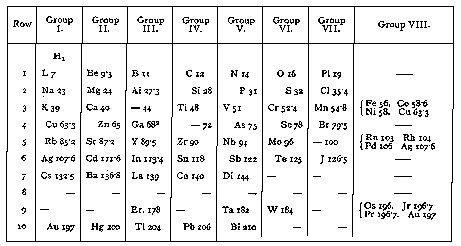

##### *The Secret Doctrine* by H. P. Blavatsky -- Vol. 2

------------------------------------------------------------------------

###### \[\[Vol. 2, Page\]\] 605 THE VEDIC TEACHINGS.

\[\[Page continued from [previous section](sd2-2-12)\]\]

### C.

#### **T**HE **S**EPTENARY **E**LEMENT IN THE **V**EDAS.

###### **I**T CORROBORATES THE **O**CCULT **T**EACHING CONCERNING THE **S**EVEN **G**LOBES

###### AND THE **S**EVEN **R**ACES.

We have to go to the very source of historical information, if we would
bring our best evidence to testify to the facts enunciated. For, though
entirely allegorical, the Rig-Vedic hymns are none the less suggestive.
The seven rays of Surya (the Sun) are made therein parallel to the Seven
Worlds (of every planetary chain), to the seven rivers of heaven and
earth, the former being the seven creative Hosts, and the latter the
Seven men, or primitive human groups. The Seven ancient Rishis -- the
progenitors of all that lives and breathes on earth -- are the seven
friends of Agni, his seven "horses," or seven "**H**EADS." The human
race has sprung from fire and water, it is allegorically stated;
fashioned by the **F**ATHERS, or the ancestor-sacrificers, from Agni;
for Agni, the Aswins, the Adityas (*Rig-Veda III.,* 54, 16, *II.,* 29*,*
3, 4), are all synonymous with that "sacrificer," or the fathers,
variously called *Pitar* (*Pitris,* fathers)*,* Angirases*\*\** (*Ibid,*
1*,* 31, 17, 139, *et seq.*)*,* the *Sadhyas,* "divine sacrificers," the
most occult of all. They are all called *deva putra rishayah* or "the
Sons of God" (*X.,* 62*;* 1, 4). The "sacrificers," moreover, are
collectively the ONE sacrificer, the father of the gods, Visvakarman,
who performed the great Sarva-Medha ceremony, and ended by sacrificing
himself. (See Rig-Vedic Hymns.)

###### \[\[Footnote(s)\]\] -------------------------------------------------

\[\[Continued fn from previous page\]\] "who like \[\[*Aisa*\]\] *gives
to all their portion of good and evil,*" and is therefore *Karma*
(*Vide* Liddell). By this abbreviation, however, *the subject to
Destiny* or *Karma* is meant, the **S**ELF or Ego, and that which is
reborn. Nor is \[\[*Antimimon Pneumatos*\]\] our conscience, but our
*Buddhi;* nor is it again the "*counterfeit* of Spirit" but "modelled
after," or a *counterpart* of the Spirit -- which *Buddhi* is, as the
vehicle of *Atma* (*Vide* Ar. Theism, 17; and Liddell's definitions).

\* C. W. King's *Gnostics,* p. 38.

\*\* Prof. Roth (in Peter's Lexicon) defines the Angirases as an
intermediate race of higher beings between gods and men; while Prof.
Weber, according to his invariable custom of modernising and
anthropomorphising the divine, sees in them the original priests of the
religion which was common to the Aryan Hindus and Persians. Roth is
right. "Angirases" was one of the names of the Dhyanis, or Devas
*instructors* ("guru-deva"), of the late Third, the Fourth, and even of
the Fifth Race Initiates.

------------------------------------------------------------------------

###### \[\[Vol. 2, Page\]\] 606 THE SECRET DOCTRINE.

In these Hymns the "Heavenly Man" is called *purusha,* "the Man," (*X.*
90, 1) from whom Viraj was born (*X.* 90, 5); and from Viraj, the
(mortal) man. It is Varuna (now drawn from his sublime position to be
the chief of the lords-Dhyanis or Devas) who regulates all natural
phenomena, who "makes a path for the Sun, for him to follow." The seven
rivers of the sky (the descending creative gods) and the seven rivers of
the earth (the seven primitive mankinds) are under his control, as will
be seen. For he who breaks Varuna's laws (Vratani, "courses of natural
action," active laws) is punished by Indra (*X*. 113, 5), the Vedic
powerful god, whose *Vrata* (law or power) is greater than the *Vratani*
of any other god.

Thus, the Rig Veda, the oldest of *all* *the known* ancient records, may
be shown to corroborate the occult teachings in almost every respect.
Its hymns -- the records written by the earliest Initiates of the Fifth
(our race) concerning the primordial teachings -- speak of the Seven
Races (two still to come) allegorising them by the "seven streams" (1,
35, 8); and of the Five Races ("*panca krishtayah*") which have already
inhabited this world (*ibid*) on the five regions "*panca pradicah*"
(*IX,* 86, 29), as also of the *three continents* that were.\*

It is those scholars only who will master the secret meaning of the
*Purushasukta* (in which the intuition of the modern Orientalist has
chosen to see "one of the very latest hymns of the Rig-Veda"), who may
hope to understand how harmonious are its teachings and how
corroborative of the Esoteric doctrines. One must study in all the
abstruseness of their metaphysical meaning the relations in it between
the (Heavenly) man "Purusha," **S**ACRIFICED for the production of the
Universe and all in it (*See Visvakarman*)*,* and the terrestrial mortal
man (*Hymn X. 20,* 1, 16), before one realizes the hidden philosophy of
this verse: --

"15. He ("Man," *purusha,* or Visvakarman) had seven enclosing logs of
fuel, and *thrice seven* layers of fuel; when the gods performed the
sacrifice, they bound the Man as victim" . . . . This relates to the
three Septenary primeval Races, and shows the antiquity of the Vedas,
who knew of no other, probably in this earliest *oral* teachings; and
also

###### \[\[Footnote(s)\]\] -------------------------------------------------

\* Three submerged, or otherwise destroyed, continents -- the first
"continent" of the First Race prevailing to the last and existing to
this day -- are described in the occult Doctrine, the *Hyperborean,* the
*Lemurian* (adopting the name now known in Science), and the
*Atlantean*. Most of Asia issued from under the waters after the
destruction of Atlantis; Africa came still later, while Europe is the
fifth and the latest -- portions of the two Americas being far older.
But of these, more anon. The Initiates who recorded the Vedas -- or the
Rishis of our Fifth Race -- wrote at a time when Atlantis had already
gone down. Atlantis is the fourth continent that *appeared*, but *the
third that disappeared.*

------------------------------------------------------------------------

###### \[\[Vol. 2, Page\]\] 607 THE SEVEN EARTHS AND THE SEVEN RACES.

to the seven primeval groups of mankind, as Visvakarman represents
divine humanity collectively.\*

The same doctrine is found reflected in the other old religions. It may,
and must have come down to us disfigured and misinterpreted, as in the
case of the Parsis, who read it in their Vendidad and elsewhere, without
understanding the allusions they contain any better than the
Orientalists do; yet the doctrine is plainly mentioned in their old
works. (See the enumeration of the seven *spheres* --not the "*Karshvare
of the* *earth,*" as believed -- in Fargard **XIX**., 30). But see
further on.

Comparing the esoteric teaching with the interpretations by James
Darmesteter (the Vendidad, edited by Prof. Max Muller), one may see at a
glance where the mistake is made, and the cause that produced it. The
passage runs thus: --

"The Indo-Iranian Asura (Ahura) *was often conceived as seven-fold;* by
the play of certain mythical (?) formulae and the strength of certain
*mythical* (?) numbers, the ancestors of the Indo-Iranians had been led
to speak *of seven worlds,*\*\* and the Supreme God was often made
seven-fold, as well as the worlds over which he ruled." (*Vide the foot
note*)*.* "The seven worlds became in Persia the seven *Karshvare* of
the earth: the earth is divided into seven Karshvare, *only one of which
is known and* *accessible to man,* the one on which we live, namely,
*Hvaniratha;* which amounts to saying *that there are seven
earths.\*\*\** Parsi mythology knows also of seven heavens. Hvaniratha
itself is divided into seven climes. (Orm. Ahr. § 72. "*Vendidad Introd.
p.* Lx.,)" and the same division and doctrine is to be found in the
oldest and most revered of the Hindu

###### \[\[Footnote(s)\]\] -------------------------------------------------

\* Nor is this archaic teaching so very *unscientific,* since one of the
greatest naturalists of the age -- the late Professor Agassiz --
admitted the multiplicity of the geographical origins of man, and
supported it to the end of his life. The unity of the human species was
accepted by the illustrious Professor of Cambridge (U.S.A.) in the same
way as the Occultists do -- namely, in the sense of their essential and
original homogeneity and their origin from one and the same source: --
*e.g*., Negroes, Aryans, Mongols, etc., have all originated in the same
way and from the same ancestors. The latter were all of one essence, yet
differentiated, because belonging to seven planes which differed in
degree though not in kind. That original physical difference was but
little more accentuated by that of geographical and climatic conditions,
later on. This is not the theory of Agassiz, of course, but the esoteric
version. It is fully discussed in the *Addenda* (Part **III.**).

\*\* The seven worlds are, as said, the seven spheres of the chain, each
presided over by one of the "Seven great gods" of every religion. When
the latter became degraded and anthropomorphized, and the metaphysical
ideas nearly forgotten, the synthesis or the highest, the seventh, was
separated from the rest, and that personification became the *eighth*
god, whom monotheism tried to unify but -- failed. In no exoteric
religion is God really one, if analyzed metaphysically.

\*\*\* The six invisible globes of our chain are both "worlds" and
"earths" as is our own, albeit invisible. But where could be the Six
invisible *earths* on *this* globe?

------------------------------------------------------------------------

###### \[\[Vol. 2, Page\]\] 608 THE SECRET DOCTRINE.

scriptures -- the Rig-veda. Mention is made therein of six worlds,
*besides our earth:* the six *rajamsi* above *prithivi --* the earth, --
or "this" (idam) as opposed to that which is *yonder* (*i.e.,* the six
globes on the *three* other planes or worlds). (*See Rig-veda I.* 34*,
III.* 56*; VII* 10, 411, and *V*., 60. 6).

The italics are ours to point out the identity of the tenets with those
of the esoteric doctrine, and the mistake made. The Magi or Mazdeans
only believed in what other people believed in; namely, in seven
"worlds" or globes of our planetary chain, of which *only one* is
accessible to man (at the present time), our Earth; and in the
successive appearance and destruction of seven continents or earths on
this our globe, each continent being divided, in commemoration of the
seven globes (one visible, six invisible), into seven islands or
continents, "seven climes," etc., etc. This was a common belief in those
days when the now Secret Doctrine was open to all. It is this
multiplicity of localities under Septenary division, that made the
Orientalists (led astray, moreover, by the oblivion of both the
uninitiated Hindus and Parsis of their primitive doctrines) feel so
puzzled by this ever-recurring seven-fold number, as to regard it as
"mythical." It is that oblivion of the first principles which has led
the Orientalists off the right track and made them commit the greatest
blunders. The same failure is found in the definition of the Gods. Those
who are ignorant of the esoteric doctrine of the earliest Aryans, can
never assimilate or understand correctly the metaphysical meaning
contained in these **B**EINGS.

Ahura Mazda (Ormazd) was the head and synthesis of the seven *Amesha
Spentas* (or Amshaspends), and, therefore, an Amesha Spenta himself.
Just as "Jehovah-Binah Arelim" was the head and synthesis of the Elohim
and no more; so Agni-Vishnu-Surya was the synthesis and head, or the
focus whence emanated in physics as in metaphysics, from the Spiritual
as from the physical Sun, the Seven Rays, the seven fiery tongues, the
seven planets or gods. All these became supreme gods and *the* **O**NE
**G**OD, but only after the loss of the primeval secrets, the sinking of
Atlantis, or "the Flood," and the occupation of India by the Brahmans,
who sought safety on the summits of the Himalayas, when even the high
table-lands of what is now Tibet became submerged for a time. Ahura
Mazda is addressed only as "the Most Blissful Spirit, Creator *of the
corporeal* World" in the Vendidad. "Ahura Mazda" in its literal
translation means the "Wise Lord" (*Ahura* "lord," and *Mazda* "wise").
Moreover, this name of *Ahura,* in Sanskrit *Asura,* connects him with
the *Manasaputras,* the Sons of Wisdom who informed the mindless man,
and endowed him with his mind (*manas*)*.* Ahura (asura) may be derived
from the root *ah* "to be," but in its primal signification it is what
the Secret Teaching shows it to be.

------------------------------------------------------------------------

###### \[\[Vol. 2, Page\]\] 609 THE ZOROASTRIAN SEPTENARY.

When geology shall have found out how many thousands of years ago the
disturbed waters of the Indian Ocean reached the highest plateaux of
Central Asia, when the Caspian Sea and the Persian Gulf made one with
it, then only will they know the age of the Aryan Brahminical nation,
and the time of its descent into the plains of Hindostan, which it did
millenniums later.

Yima, the so-called "first man" in the *Vendidad,* as much as his
twin-brother Yama, the Son of Vaivasvata Manu, belongs to two epochs of
the Universal History. He is the "Progenitor" of the Second human Race,
hence the personification of the shadows of the Pitris, and the father
of the *postdiluvian* Humanity. The Magi said "Yima," as we say "man"
when speaking of mankind. The "fair Yima," the first mortal who
converses with Ahura Mazda, *is the first* "*man*" *who dies* or
disappears, not the first who is born. The "Son of Vixanghat," was, like
the Son of Vaivasvata, the symbolical man, who stood in esotericism as
the representative of the *first three races* and the collective
Progenitor thereof. Of these races the first two never died\* but only
vanished, absorbed in their progeny, and the third knew death only
towards its close, after the separation of the sexes and its "Fall" into
generation. This is plainly alluded to in the **II**. Fargard of the
*Vendidad.* Yima refuses to become the bearer of the law of Ahura Mazda,
saying "I was not born, I was not taught to be the preacher and the
bearer of thy law." And then Ahura Mazda asks him to make his men
increase and "watch over his world" (3 and 4).

He refuses to become the priest of Ahura Mazda, because he is *his* *own
priest and sacrificer,* but he accepts the second proposal. He is made
to answer: --

> "Yes! . . . yes, I will rule and watch over thy world. There shall be,
> while I am King, neither cold wind nor hot wind, *neither disease nor
> death.*"

Then Ahura Mazda brings him a golden ring and a poniard, the emblems of
sovereignty, and under the sway of Yima --

> "Three hundred *winters* passed away, and the earth was *replenished*
> with flocks and herds, with men, and dogs, and birds, and with red
> blazing fires," etc. (300 *winters* mean 300 periods or cycles.)

"Replenished," mark well, that is to say, all this had been on it
before; and thus is proven the knowledge of the doctrine about the
successive destructions of the world and its life cycles. Once the "300
winters" were over, Ahura Mazda warns Yima that the earth is becoming
too full, and men have nowhere to live. Then Yima steps forward, and
with the help of Spenta Armaita (the female genius, or Spirit of the
Earth) makes that earth stretch out and become larger by

###### \[\[Footnote(s)\]\] -------------------------------------------------

\* Death came only after man had become a *physical* creature, *vide
supra.* The men of the First Race and also of the Second, dissolved and
disappeared in their progeny.

------------------------------------------------------------------------

###### \[\[Vol. 2, Page\]\] 610 THE SECRET DOCTRINE.

one-third, after which "new herds and flocks and men" appear upon it.
Ahura Mazda warns him again, and Yima makes the earth by the same magic
power to become larger by two-thirds. "Nine hundred winters" *pass*
away, and Yima has to perform the ceremony *for the third time.* The
whole of this is allegorical. The three processes of stretching the
earth, refer to the three successive continents and races issuing one
after and from the other, as explained more fully elsewhere. After the
*third* time, Ahura Mazda warns Yima in an assembly of "celestial gods
and excellent mortals" that upon the material world the fatal winters
are going to fall, and all *life* will perish. This is the old Mazdean
symbolism for the "flood," and the coming cataclysm to Atlantis, which
sweeps away every race in its turn. Like Vaivasvata Manu and Noah, Yima
makes a *vara* (an enclosure, an ark) under the God's direction, and
brings thither the seed of every living creature, animals and "fires."

It is of this "earth" or new continent that Zarathustra became the
law-giver and ruler. This was the Fourth Race in its beginning, after
the men of the Third began to die out. Till then, as said (*vide supra,*
foot note) there had been no regular death, but only a transformation,
for *men had no personality* as yet. They had monads -- breaths of the
**O**NE Breath, and as impersonal as the source from which they
proceeded. They had bodies, or rather shadows of bodies, which were
sinless, hence *Karmaless.* Therefore, as there was no Kamaloka -- least
of all Nirvana or even Devachan -- for the "souls" of men who had no
personal *Egos,* there could be no intermediate periods between the
incarnations. Like the Phoenix, primordial man resurrected out of his
old into a new body. Each time, and with each new generation, he became
more solid, more physically perfect, agreeably with the evolutionary
law, which is the *Law of Nature.* Death came with the complete physical
organism, and with it -- moral decay.

This explanation shows one more old religion agreeing in its symbology
with the universal Doctrine.

Elsewhere the oldest Persian traditions, the relics of Mazdeism of the
still older Magians, are given, and some of them explained. Mankind did
not issue from one solitary couple. Nor was there ever a first man --
whether Adam or Yima -- but a first mankind.

It may, or may not be, "mitigated polygenism." Once that both creation
*ex-nihilo* *--* an absurdity -- and a superhuman Creator or creators --
a fact -- are made away with by science, polygenism presents no more
difficulties or inconveniences (rather fewer from a scientific point of
view) than monogenism does.

Nevertheless, it is as scientific as any other claim. For in his
Introduction to Nott's and Gliddon's "*Types of Mankind,*" Agassiz
declares

------------------------------------------------------------------------

###### \[\[Vol. 2, Page\]\] 611 THE SEPTENATE IN THE PURANAS.

his belief in an indefinite number of "*primordial races of men created*
*separately*"*;* and remarks that, "whilst in every zoological province
animals are of *different species, man, in spite of the diversity of his
races,* *always forms one and the same human being.*"

Occultism defines and limits the number of primordial races to seven,
because of the "seven progenitors," or *prajapatis,* the evolvers of
beings. These are neither gods, nor supernatural Beings, but advanced
Spirits from another and lower planet, reborn on this one, and giving
birth in their turn in the present Round to present Humanity. This
doctrine is again corroborated by one of its echoes -- the Gnostic. In
their Anthropology and Genesis of man they taught that "a certain
company of *Seven* angels," formed the first men, who were no better
than senseless, gigantic, shadowy forms -- "a mere wriggling worm" (!)
writes Irenaeus (I., 24, 1), who takes, as usual, the metaphor for
reality.

### D.

#### **T**HE **S**EPTENARY IN THE **E**XOTERIC **W**ORKS.

We may now examine other ancient Scriptures and see whether they contain
the septenary classification, and, if so, to what degree.

As much, if not much more, even than in the Jewish Bible, scattered
about in the thousands of Sanskrit texts, some still unopened, others
yet unknown, as well as in all the Puranas, the numbers seven and
forty-nine (7 x 7) play a most prominent part. They are found from the
Seven creations in Chapter I., down to the seven rays of the Sun at the
final Pralaya, which expand into Seven Suns and absorb the material of
the whole Universe. Thus the *Matsya* Purana has: "For the sake of
promulgating the Vedas, Vishnu, in the beginning of a Kalpa, related to
Manu the story of Narasimha and the events of *seven* Kalpas." Then
again the same Purana shows that "in all the Manvantaras, classes of
Rishis\* appear by seven and *seven,* and having established a code of
law and morality depart to felicity" -- the Rishis representing many
other things besides living Sages.

In Hymn xix., 53, of *Atharva Veda* (Dr. Muir's translation) one reads:
--

###### \[\[Footnote(s)\]\] -------------------------------------------------

\*" These are the seven persons by whom in the several Manvantaras" --
says Parasara -- "created beings have been protected. Because the whole
world has been pervaded by the energy of the deity, he is entitled
Vishnu, from the root *Vis* 'to enter' or 'pervade,' for all the gods,
the Manus, the Seven Rishis, the Sons of the Manu, the Indras, all are
but the impersonated potencies (*Vibhutayah*) of Vishnu" (Vish. Purana).
Vishnu is the Universe; and the Universe itself is divided in the *Rig
Veda* into *seven* regions -- which ought to be sufficient authority,
for the Brahmins, at all events.

------------------------------------------------------------------------

###### \[\[Vol. 2, Page\]\] 612 THE SECRET DOCTRINE.

" 1. Time carries (us) forward, a steed, with *seven rays,* a thousand
eyes, undecaying, full of fecundity. On him intelligent sages mount; his
wheels are all the worlds."

"2. Thus Time moves on *seven wheels;* he has *seven* naves; immortality
is his axle. He is at present *all these worlds.* Time hastens onward
the first God."

"3. A full jar is contained in Time. We behold him existing in many
forms. He is all these worlds in the future. They call him 'Time in the
highest Heaven' " . . . .

Now add to this the following verse from the Esoteric volumes: --

"Space and Time are one. Space and Time are nameless, for they are the
incognizable **T**HAT, which can be sensed *only through its seven*
*rays* -- which are the *Seven Creations,* the *Seven Worlds, the Seven*
*Laws,*" etc., etc., etc. . . .

Remembering that the Puranas insist on the identity of Vishnu with Time
and Space\*; and that even the Rabbinical symbol for God is MAQOM,
"Space," it becomes clear why, for purposes of a manifesting Deity --
Space, Matter, and Spirit -- the one central point became the Triangle
and Quaternary (the perfect Cube), hence *Seven.* Even the *Pravaha*
wind (the mystic and occult Force that gives the impulse to, and
regulates the course of the stars and planets) is septenary. The Kurma
and Linga Puranas enumerate seven principal winds of that name, which
winds are the principles of Cosmic Space. They are intimately connected
with *Dhruva\*\** (now Alpha), the Pole-Star, which is connected in its
turn with the production of various phenomena through cosmic forces.

Thus, from the Seven Creations, seven Rishis, Zones, Continents,
Principles, etc., etc. in the Aryan Scriptures, the number has passed
through Indian, Egyptian, Chaldaic, Greek, Jewish, Roman, and finally
Christian mystic thought, until it landed in and remained impressed
indelibly on every exoteric theology. The seven old books stolen out of
Noah's ark by Ham, and given to Cush, his son, and the seven Brazen
columns of Ham and Cheiron, are a reflection and a remem-

###### \[\[Footnote(s)\]\] -------------------------------------------------

\* Vishnu is *all* -- the worlds, the stars, the seas, etc., etc.
"Vishnu is all that is, all that is not . . . . but is not
*Vastubhuta,*" "a substance" (Vishnu Purana, Book **II**. ch. xii).
"That which people call the highest God is not a substance *but the
cause of it;* not one that is here, there, or elsewhere, *not what we
see,* but that in which all is -- SPACE."

\*\* Therefore it is said in the Puranas that the view of Dhruva (the
polar star) at night, and of the celestial porpoise (Sisumara, a
constellation) "expiates whatever sin has been committed during the
day." The fact is that the rays of the four stars in the circle of
perpetual apparition -- the Agni, Mahendra, Kasyapa, and Dhruva, placed
in the tail of *Ursa Minor* (Sisumara) -- focussed in a certain way and
on a certain object produce extraordinary results. The *astro-magians*
of India will understand what is meant.

------------------------------------------------------------------------

###### \[\[Vol. 2, Page\]\] 613 WHO ARE THE MARUTS?

brance of the Seven primordial mysteries instituted according to the
"Seven secret emanations," the "Seven Sounds," and seven rays -- the
spiritual and sidereal models of the seven thousand times seven copies
of them in later aeons.

The mysterious number is once more prominent in the no less mysterious
Maruts. The Vayu Purana shows, and Harivansa corroborates, that the
Maruts -- the oldest as the most incomprehensible of all the secondary
or lower gods in the Rig Veda -- "are *born in every* *manvantara*
(Round) *seven times seven* (or 49); that in each Manvantara, *four
times seven* (or twenty-eight) they obtain emancipation, but their
places are *filled up by persons reborn in that character.*" What are
the *Maruts* in their esoteric meaning, and who *those persons* "reborn
in that character"? In the Rig and other Vedas, the Maruts are
represented as the storm gods and the *friends and allies* of Indra;
they are the "Sons of heaven and of earth." This led to an allegory that
makes them the children of Siva, the great patron of the Yogis, "the
**M**AHA-**Y**OGI, the great *ascetic,* in whom is centred the highest
perfection of austere penance and abstract meditation, *by which the
most unlimited powers are obtained,* *marvels and miracles are worked,
the highest spiritual knowledge is* *acquired, and union with the great
spirit of the universe is eventually* *gained.*" In the Rig Veda the
name Siva is unknown, but the god is called Rudra, which is a word used
for *Agni,* the fire god, the Maruts being called therein his sons. In
the *Ramayana* and the Puranas, their mother, Diti -- the sister, or
complement of, and a form of Aditi -- anxious to obtain a son who would
destroy Indra, is told by Kasyapa the Sage, that "if, with thoughts
wholly pious and person entirely pure, she carrys the babe in her womb
for a hundred years" she will get such a son. But Indra foils her in the
design. With his thunderbolt he *divides the embryo in her womb into
seven portions,* and then divides every such portion *into seven pieces
again,* which become the swift-moving deities, the Maruts.\* These
deities are only another *aspect,* or a development of the Kumaras, who
are *Rudras* in their patronymic, like many others.\*\*

Diti, being Aditi, unless the contrary is proven to us, Aditi, we say,
or Akasa in her highest form, is *the Egyptian seven-fold heaven.* Every
true Occultist will understand what this means. Diti, we repeat, is the
sixth

###### \[\[Footnote(s)\]\] -------------------------------------------------

\* In the Ramayana it is Bala-Rama, Krishna's elder brother, who does
it.

\*\* With regard to the origin of Rudra, it is stated in several
*Puranas* that his (spiritual) progeny, *created in him by Brahma,* was
not confined to either the *seven* Kumaras or the *eleven* Rudras, etc.,
but "comprehends infinite numbers of beings *in* *person and equipments
like their* (virgin) father. Alarmed at their fierceness, numbers, and
*immortality*, Brahma desires his son Rudra to form creatures of a
different and mortal nature." Rudra *refusing to create,* desists, etc.,
hence *Rudra* is *the first rebel.* (*Linga, Vayu, Matsya,* and other
Puranas.)

------------------------------------------------------------------------

###### \[\[Vol. 2, Page\]\] 614 THE SECRET DOCTRINE.

principle of *metaphysical* nature, the *Buddhi* of Akasa. Diti, the
mother of the Maruts, is one of her terrestrial forms, made to
represent, at one and the same time, the divine Soul in the ascetic, and
the divine aspirations of mystic Humanity toward deliverance from the
webs of Maya, and final bliss in consequence. Indra, now degraded,
because of the Kali Yuga, when such aspirations are no more general but
have become abnormal through a general spread of *Ahamkara* (the feeling
of Egotism, *Self,* or **I**-AM-NESS) and ignorance -- was, in the
beginning, one of the greatest gods of the Hindu Pantheon, as the Rig
Veda shows. *Sura-dhipa,* "the chief of the gods," has fallen down from
*Jishnu,* "the leader of the celestial host," -- the Hindu St. Michael
-- to an opponent of asceticism, the enemy of every holy aspiration. He
is shown married to Aindri (Indrani), the personification of
*Aindri-yaka,* the evolution of the element of senses, whom he married
"because of her *voluptuous* *attractions*"*;* after which he began
sending celestial female demons to excite the passions of holy men,
Yogis, and "to beguile them from the potent penances which he dreaded."
Therefore, Indra, now characterized as "the god of the firmament, the
personified atmosphere" -- is in reality the cosmic principle *Mahat,*
and the fifth human -- *Manas* in its dual aspect: as connected with
*Buddhi;* and as allowing himself to be dragged down by his
*Kama*-principle (the body of passions and desires). This is
demonstrated by Brahma telling the conquered god that his frequent
defeats were due to *Karma,* and were a punishment for his
licentiousness, and the seduction of various nymphs. It is in this
latter character that he seeks, to save himself from destruction, to
destroy the coming "babe" destined to conquer him: -- the babe, of
course, allegorizing the divine and steady will of the Yogi --
determined to resist all such temptations, and thus destroy the passions
within his earthly personality. Indra succeeds again, because flesh
conquers spirit -- (Diti is shown frustrated in the Dvapara Yug, during
that period when the Fourth Race was flourishing). He divides the
"Embryo" (of new *divine* adeptship, begotten once more by the Ascetics
of the Aryan Fifth Race), into *seven* portions -- a reference not alone
to the *seven* sub-races of the new Root-Race, in each of which there
will be a "Manu,"\* but also to the seven degrees of adeptship -- and
then each

###### \[\[Footnote(s)\]\] -------------------------------------------------

\* Notwithstanding the terrible, and evidently *purposed*, confusion of
Manus, Rishis, and their progeny in the Puranas, one thing is made
clear: there have been and there will be seven Rishis in every Root-Race
(called also *Manvantara* in the sacred books) as there are fourteen
Manus in every Round, the "presiding gods, the Rishis and Sons of the
Manus" being identical. (See Book **III**. ch. 1 of *Vishnu Purana.*)
"Six" Manvantaras are given, the Seventh being our own in the Vishnu
Purana. The *Vayu* Purana furnishes the nomenclature of the Sons of the
fourteen Manus in every Manvantara, and the Sons of the seven Sages or
Rishis. The latter are the progeny \[\[Continued on next page\]\]

------------------------------------------------------------------------

###### \[\[Vol. 2, Page\]\] 615 THE DOOM OF CONTINUAL REBIRTH.

portion into seven pieces -- alluding to the Manu-Rishis of each
Root-Race, and even sub-race.

It does not seem difficult to perceive what is meant by the Maruts
obtaining "*four times seven*" emancipations in every "manvantara," and
by those persons who, being *reborn* in that character (of the *Maruts*
in their esoteric meaning), "fill up their places." The Maruts represent
(*a*) the *passions* that storm and rage within every candidate's
breast, when preparing for an ascetic life -- this *mystically;* (*b*)
the occult potencies concealed in the manifold aspects of *Akasa*'*s*
lower principles -- her body, or *sthula sarira,* representing the
terrestrial, lower, atmosphere of every inhabited globe -- this
mystically and sidereally; (*c*) actual conscious Existences, Beings of
a cosmic and psychic nature.

At the same time "Maruts" is, in occult parlance, one of the names given
to those EGOS of great Adepts who have passed away, and who are known
also as *Nirmanakayas;* of those Egos for whom -- *since they* *are
beyond illusion --* there is no Devachan, and who, having either
voluntarily renounced it for the good of mankind, or not yet reached
Nirvana, remain invisible on earth. Therefore are the Maruts\* shown
firstly -- as the sons of Siva-Rudra -- the "Patron Yogi," whose
"*third* eye," mystically, must be acquired by the ascetic before he
becomes an adept; then, in their cosmic character, as the subordinates
of Indra and his opponents -- variously. The "four times seven"
emancipations have a reference to the four Rounds, and the four Races
that preceded ours, in each of which *Marut-Jivas* (monads) have been
re-born, and have obtained final liberation, if they have only availed
themselves of it. Instead of which, preferring the good of mankind,
which would struggle still more hopelessly in the meshes of ignorance
and misery, *were it not* *for this extraneous help --* they are re-born
over and over again "in that character," and thus "fill up their own
places." *Who* they are, "*on* *earth*" -- every student of Occult
science knows. And he also knows that the Maruts are *Rudras,* among
whom also the family of Twashtri, a synonym of Visvakarman -- the great
patron of the Initiates -- is included. This gives us an ample knowledge
of their true nature.

###### \[\[Footnote(s)\]\] -------------------------------------------------

\[\[Continued.from previous page\]\] of the Progenitors of mankind. All
the Puranas speak of the seven Prajapatis of this period (Round).

\* "Chakshuba was the Manu of the sixth period (Third Round and Third
Race), in which Indra was Manojava" (*Mantradruma* in the *Bhagavata
Purana*)*.* As there is a perfect analogy between the "great Round"
(*Mahakalpa*)*,* each of the seven Rounds, and each of the seven great
Races in every one of the Rounds -- therefore, Indra of the sixth
period, or Third Round, corresponds to the close of the Third Race (at
the time of the *Fall* or the separation of sexes). Rudra, as the father
of the Maruts, has many points of contact with Indra, the Marutwan, or
"lord of the Maruts." To receive a name Rudra is said to have wept for
it. Brahma called him Rudra; but *he wept seven times* *more and so
obtained seven other names --* of which he uses one during *each*
"period."

------------------------------------------------------------------------

###### \[\[Vol. 2, Page\]\] 616 THE SECRET DOCTRINE.

The same for the Septenary Division of Kosmos and human principles. The
Puranas, along with other sacred texts, teem with allusions to this.
First of all, the mundane Egg which contained Brahma, or the Universe,
"was externally invested with *seven* natural elements, at first loosely
enumerated as Water, Air, Fire, Ether, and *three secret* elements"
(Book I.); then the "World" is said to be "encompassed on every side" by
seven elements, also *within* the egg -- as explained, "the universe is
encompassed on every side, above and below by the *Andakat*'*aha --* the
shell of the egg of Brahma." . . . Around the shell flows water, which
is surrounded with fire; fire by air; air by ether; ether by the origin
of the elements (Ahamkara); the latter by Universal Mind ("Intellect" in
the Texts) (Book **II**., ch. **VII**. *Vishnu Purana*)*.* It relates to
spheres of being as much as to principles. *Prithivi* is not our Earth,
but the World, the Solar system, and means the *broad,* the *Wide.* In
the *Vedas --* the greatest of all authorities, though needing the key
to read it correctly -- three terrestrial and three celestial earths are
mentioned as having been called into existence simultaneously with
*Bhumi* -- our earth. We have often been told that six, not *seven*,
appears to be the number of spheres, principles, etc. We answer that
there are, in fact, only six principles in man; since his body is *no
principle,* but the covering, the shell thereof. So with the *planetary
chain;* speaking of which, esoterically, the Earth (as well as the
seventh, or rather *fourth* plane, one that stands as the seventh if we
count from the first triple kingdom of the Elementals that begin the
formation) may be left out of consideration, being (to us) the only
distinct body of the seven. The language of occultism is varied. But
supposing that *three* earths only, instead of seven, are meant in the
Vedas, what are those three, since we still know of but one? Evidently
there *must be* an occult meaning in the statement under consideration.
Let us see. The "Earth that floats" on the Universal Ocean (of Space),
which Brahma divides in the Puranas into seven zones, is *Prithivi,* the
world divided into seven *principles;* a cosmic division looking
metaphysical enough, but, in reality, *physical* in its occult effects.
Many Kalpas later, our Earth is mentioned, and, in its turn, is divided
into seven zones\* on that same law of analogy that guided ancient
philosophers. After which one finds on it seven continents, seven isles,
seven oceans, seven seas and rivers, seven mountains, and seven
climates, etc., etc., etc.\*\*

###### \[\[Footnote(s)\]\] -------------------------------------------------

\* See the Puranas.

\*\* In *Vishnu Purana,* Book **II**., chap. iv., it is stated that the
**E**ARTH, "with its continents, mountains, oceans, and exterior shell,
is *fifty crores* (500 millions) of yojanas in extent," to which the
commentator remarks that "*this comprises the planetary spheres;* for
the diameter of the seven zones and oceans -- each ocean being of the
same diameter as the continent it encloses, and each successive
continent being twice the \[\[Continued on next page\]\]

------------------------------------------------------------------------

###### \[\[Vol. 2, Page\]\] 617 PERSIAN SYMBOLOGY.

Furthermore, it is not only in the Hindu Scriptures and philosophy that
one finds references to the *Seven Earths,* but in the Persian,
Phoenician, Chaldean, and Egyptian Cosmogonies, and even in Rabbinical
literature. The Phoenix\* -- called by the Hebrews Onech \[Heb char\]
(from *Phenoch,* Enoch, symbol of a secret cycle and initiation), and by
the Turks, *Kerkes --* lives a thousand years, after which, kindling a
flame, it is self-consumed; and then, reborn from itself -- it lives
another thousand years, up to *seven times seven:* (See "Book of Ali" --
Russian transl.), when comes the day of Judgment. The "seven times
seven," 49, are a transparent allegory, and an allusion to the
forty-nine "Manus," the Seven Rounds, and the seven times seven human
cycles in each Round on each globe. The *Kerkes* and the *Onech* stand
for a race cycle, and the mystical tree Ababel -- the "*Father Tree*" in
the Kuran -- shoots out new branches and vegetation at every
resurrection of the Kerkes or Phoenix; the "Day of judgment" meaning a
"minor *Pralaya*" (See "*Esoteric Buddhism*")*.* The author of the "Book
of God" and the "Apocalypse" believes that "the Phoenix is very plainly
the same as the *Simorgh,* the Persian *roc*, and the account which is
given us of this last bird, yet more decisively establishes the opinion
that the death and revival of the Phoenix exhibit the successive
destruction and reproduction of the world, which many believed to be
effected by the agency of a fiery deluge" -- (p. 175); and a watery one
in turn. "When the Simorgh was asked her age, she informed Caherman that
this world is very ancient, for it has been already *seven times
replenished* with beings different from men, and *seven times
depopulated;\*\** that the age of the human race, in which we now are,
is to endure *seven thousand numbers,* and that she herself had seen
*twelve* of these revolutions, and knew not how many more she had to
see." (*Oriental* Collections, ii., 119.)

The above, however, is no new statement. From Bailly, in the last
century, down to Dr. Kenealy, in this one, these facts have been noticed
by several writers, but now a connection can be established between

###### \[\[Footnote(s)\]\] -------------------------------------------------

\[\[Continued from previous page\]\] diameter of that which precedes it
-- amounts to but two crores or fifty-four lakhs etc. . . . Whenever any
contradictions in different Puranas occur, they have to be ascribed . .
. to differences of Kalpas and *the like.*" "The like" ought to read
"Occult meaning," which explanation is withheld by the commentator, who
wrote for *exoteric, sectarian* purposes, and was misunderstood by the
translator for various other reasons, the least of which is -- ignorance
of the esoteric philosophy.

\* The *Phoenix,* connected with the Solar Cycle of 600 years (with
ciphers taken out or with more added according to which cycle is meant),
the Western cycle of the Greeks and other nations -- is a generic symbol
for several kinds of cycles. Fuller details will be given in the section
on "Kalpas and Cycles."

\*\* The tense is the "past" because the book is allegorical, and has to
veil the truths contained.

------------------------------------------------------------------------

###### \[\[Vol. 2, Page\]\] 618 THE SECRET DOCTRINE.

the Persian oracle and the Nazarene prophet. Says the author of the
"Book of God": --

"The Simorgh is in reality the same as the winged *Singh* of the Hindus,
and the Sphinx of the Egyptians. It is said that the former will appear
at the end of the world . . . . as a monstrous lion-bird. From these the
Rabbins have borrowed their mythos of an enormous Bird, sometimes
standing on the Earth, sometimes walking in the ocean . . . while its
head props the sky; and with the symbol, they have also adopted the
doctrine to which it relates. They teach *that there are to* *be seven
successive renewals of the globe,* that each reproduced system *will
last seven thousand years;* (*?*) and that the *total duration of the*
*universe will be* 49,000 *years.* This opinion, which involves the
doctrine of the pre-existence of each renewed creature, they may either
have learned during their Babylonian captivity, or *it may have been
part of* *the primeval* religion which their priests had preserved from
remote times" (p. 176). It shows rather that the initiated Jews
*borrowed,* and their non-initiated successors, the Talmudists, lost the
sense, and applied the Seven Rounds, and the forty-nine races, etc., to
the wrong end.

Not only "*their* priests," but those of every other country. The
Gnostics, whose various teachings are the many echoes of the one
primitive and universal doctrine, put the same numbers, under another
form, in the mouth of Jesus in the very occult *Pistis Sophia.* We say
more: even the Christian editor or author of *Revelation* has preserved
this tradition and speaks of the Seven **R**ACES, four of which, with
part of the fifth, are gone, and two have to come. It is stated as
plainly as could be stated in chapter xvii., verses 9 and 10. Thus saith
the angel: "And here *is* the mind which hath wisdom. The seven heads
are seven mountains, on which the woman sitteth. And there are SEVEN
Kings, *five* are fallen, and one *is,* and the other is not yet come .
. . . " Who, acquainted in the least with the symbolical language of
old, will fail to discern in the *five* Kings that have fallen, the four
Root-Races that were, and part of the fifth, the one that *is*; and in
the *other,* that "*is not yet* *come,*" the sixth and seventh coming
root races, as also the sub-races of this, our present race? Another
still more forcible allusion to the Seven Rounds and the forty-nine
root-races in *Leviticus,* will be found elsewhere in the Addenda, Part
**III**.

-------

### E.

#### **S**EVEN IN **A**STRONOMY, **S**CIENCE, AND **M**AGIC.

Again, number seven is closely connected with the occult significance of
the Pleiades, those seven daughters of Atlas, "the six present, the

------------------------------------------------------------------------

###### \[\[Vol. 2, Page\]\] 619 THE CYCLE OF THE NAROS.

seventh *hidden.*" In India they are connected with their nursling, the
war god, Karttikeya. It is the *Pleiades* (in Sanskrit, *Krittika*) who
gave the god their name, for Karttikeya is the planet Mars,
*astronomically.* As a god he is the son of Rudra, born without the
intervention of a woman. He is a *Kumara,* a "virgin youth" again,
generated in the fire from the Seed of Siva -- the *holy spirit* --
hence called Agni-bhu. The late Dr. Kenealy believed that, in India,
Karttikeya is the secret symbol of the cycle of Naros, composed of 600,
666, and 777 years, according to whether it is solar or lunar, divine or
mortal, years that are counted; and the six visible, or the seven actual
sisters, the Pleiades, are needed for the completion of this most secret
and mysterious of all the astronomical and religious symbols. Therefore,
when made to commemorate one particular event, Karttikeya appeared, of
old, as a *Kumara,* an ascetic, with *six heads* -- one for each century
of the Naros. When the symbolism was needed for another event, then, in
conjunction with the seven sidereal sisters, Karttikeya is seen
accompanied by Kaumara (or Sena) his female aspect. He is then riding on
a peacock -- the bird of Wisdom and Occult Knowledge, and the Hindu
Phoenix, whose Greek relation with the 600 years of Naros is well-known.
A six-rayed star (double triangle) a Swastica, a six and occasionally
seven-pointed crown is on his brow; the peacock's tail represents the
sidereal heavens; and the twelve signs of the Zodiac *are hidden on his*
*body;* for which he is also called Dwadasa Kara," ("the
twelve-handed"), and Dwadasaksha, "twelve-eyed." It is as Sakti-dhara,
however, the "Spear-holder," and the conqueror of Taraka, "Taraka-jit,"
that he is shown most famous.

The years of the Naros, being (in India) counted in two ways -- either
"100 years of the gods," (*divine* years) -- or 100 *mortal years* --
one can see the tremendous difficulty for the non-initiated in
comprehending correctly this cycle, which plays such an important part
in St. John's Revelation. It is the truly apocalyptic Cycle; yet in none
of the numerous speculations about it have we found anything but *a few*
*approximate* truths, because of its being of various lengths and
relating to various pre-historic events.

It has been urged against the duration claimed by the Babylonians for
their divine ages, that Suidas shows the ancients counting, in their
chronological computations, days for years. Dr. Sepp in his ingenious
plagiarism -- exposed elsewhere -- of the Hindu 432 in thousands and
millions of years (the duration of the Yugas) which he dwarfed to 4,320
*lunar* years before the "birth of Christ" -- as "foreordained" in the
sidereal (besides the invisible) heavens, and proved "by the apparition
of the Star of Bethlehem" -- appeals to Suidas and his authority. But
Suidas had no other warrant for it than his own speculations, and he

------------------------------------------------------------------------

###### \[\[Vol. 2, Page\]\] 620 THE SECRET DOCTRINE.

was no Initiate. He cites, as a proof, Vulcan, in showing him as having,
according to chronological claim, reigned 4,477 years, *i.e.*, 4,477
*days, as* he thinks, or rendered in years, 12 years, 3 months, and 7
days; he has 5 days in his original -- thus committing an error even in
such an easy calculation. (See Suidas, art. \[\[*Heelios*\]\].) True,
there are other ancient writers guilty of like fallacious speculations
-- Calisthenes, for instance, who assigns to the astronomical
observations of the Chaldeans only 1,903 years, whereas Epigenes
recognises 720,000 years (*Pliny. Histor.* *Natur. Lib.* **VII.** *c.*
56.) The whole of these hypotheses made by profane writers are based
upon and due to a misunderstanding. The chronology of all the Western
peoples, ancient Greeks and Romans, was borrowed from India. Now, it is
said in the Tamil edition of *Bagavadam* that 15 solar days make a
*Paccham;* two *paccham* (or 30 days) are a month of the mortals, adding
that such a month is only one day of the *Pitar Devata* (*Pitris*)*.*
Again, two of these months constitute a *roodoo,* three *roodoo* make an
*ayanam,* and two *ayanams* a year -- which year of the mortals is *but
a day of the gods.* It is on such misunderstood teachings that some
Greeks have imagined that all the initiated priests had transformed days
into years!

This mistake of the ancient Greek and Latin writers became pregnant with
results in Europe. At the close of the past and the beginning of this
century, relying upon the purposely mutilated accounts of Hindu
chronology, brought from India by certain too zealous and as
unscrupulous missionaries, Bailly, Dupuis, and others built quite a
fantastic theory upon the subject. Because the Hindus had made half a
revolution of the moon, a measure of time; and because a month composed
of only fifteen days -- of which Quint. Curtius speaks (*Menses in
quinos dies descriperunt dies.* Quint. Curt. **LVIII**., c. 9) -- is
found mentioned in Hindu literature, therefore, it is a verified fact
that their *year* was only half a year, when it was *not called a day.*
The Chinese, too, divided their Zodiac into twenty-four parts, hence
their year into twenty-four fortnights, but such computation did not,
nor does it prevent their having an astronomical year just the same as
ours. And they have a period of sixty days -- the Southern Indian
*Roodoo,* to this day in some provinces. Moreover, Diodorus Siculus
(Lib. I. § 26, p. 30) calls "*thirty days* an Egyptian year," or that
period during which the moon performs a complete revolution. Pliny and
Plutarch both speak of it (*Hist. Nat.* Lib. **VII**., c. 48, Vol**.
III**., p. 185, and *Life of Numa,* § 16); but does it stand to reason
that the Egyptians, who knew astronomy as well as any other people did,
made the *lunar* month consist of thirty days, when it is only
twenty-eight days with fractions? This lunary period had *an occult*
*meaning* surely as much as the *Ayanam* and the *roodoo* of the Hindus
had. The year of two months' duration, and the period of sixty days
also,

------------------------------------------------------------------------

###### \[\[Vol. 2, Page\]\] 621 VARIOUS CYCLIC CALCULATIONS.

was a universal measure of time in antiquity, as Bailly himself shows in
his *Traite de l*'*Astronomie Orientale.* The Chinamen, according to
their own books, divided their year into two parts, from one equinox to
the other (*Mem. Acad. Ins.* T. **XVI**., c. 48, *Tom.* **III**., p.
183); the Arabs anciently divided the year into six seasons, each
composed of two months; in the Chinese astronomical work called
*Kioo-tche,* it is said that two moons make a measure of time, and six
measures a year; and to this day the aborigines of Kamschatka have their
years of six months, as they had when visited by Abbe Chappe (Voyage to
Siberia, Vol. III., p. 19). But is all this a reason to say that when
the Hindu Puranas say "a *solar year*" they mean *one solar* day! It is
the knowledge of the natural laws that make of seven the root
nature-number, so to say, in the manifested world -- at any rate in our
present terrestrial life-cycle -- and the wonderful comprehension of its
workings, that unveiled to the ancients so many of the mysteries of
nature. It is these laws, again, and their processes on the sidereal,
terrestrial, and moral planes, which enabled the old astronomers to
calculate correctly the duration of the cycles and their respective
effects on the march of events; to record beforehand (prophecy, it is
called) the influence which they will have on the course and development
of the human races. The Sun, Moon, and planets being the never-erring
time measurers, whose potency and periodicity were well known, became
thus the great Ruler and rulers of our little system in all its *seven*
*domains,* or "spheres of action."\*

This has been so evident and remarkable, that even many of the modern
men of Science, Materialists as well as Mystics, had their attention
called to this law. Physicians and theologians, mathematicians and
psychologists have drawn the attention of the world repeatedly to this
fact of periodicity in the behaviour of "Nature." These numbers are
explained in the "Commentaries" in these words.

**T**HE **C**IRCLE IS NOT THE "**O**NE" BUT THE **ALL**.

**I**N THE HIGHER \[*heaven*\] THE IMPENETRABLE **R**AJAH \["*ad
Mutant,*" *see Atharva-Veda X.,* 105\], IT \[*the Circle*\] BECOMES
**O**NE, BECAUSE \[*it* *is*\] THE INDIVISIBLE, AND THERE CAN BE NO
**T**AU IN IT.

**I**N THE SECOND \[*of the three* "*Rajamsi*" (*tritiye*)*, or the
three* "*Worlds*"\] THE ONE BECOMES TWO \[*male and female*\]*;* AND
THREE \[*add* *the Son or logos*\]*;* AND THE **S**ACRED **F**OUR
\["*tetractis,*" *or the* "*Tetragrammaton.*"\]

**I**N THE THIRD \[*the lower world or our earth*\] THE NUMBER BECOMES
FOUR, AND THREE, AND TWO. **T**AKE THE FIRST TWO, AND THOU WILT

###### \[\[Footnote(s)\]\] -------------------------------------------------

\* The spheres of action of the combined Forces of Evolution and Karma
are (1) the Super-spiritual or *noumenal;* (*2*) the Spiritual; (3) the
Psychic; (4) the Astro-ethereal; (5) the Sub-astral; (6) the Vital; and
(7) the purely *physical* spheres.

------------------------------------------------------------------------

###### \[\[Vol. 2, Page\]\] 622 THE SECRET DOCTRINE.

OBTAIN **S**EVEN, THE SACRED NUMBER OF LIFE; BLEND \[*the latter*\] WITH
THE MIDDLE **R**AJAH, AND THOU WILT HAVE **N**INE, THE SACRED NUMBER OF
**BEING** AND **BECOMING**."\*

When the Western Orientalists have mastered the real meaning of the Rig
Vedic divisions of the World -- the two-fold, three-fold, six and
seven-fold, and especially the nine-fold division, the mystery of the
cyclic divisions applied to heaven and earth, gods and men, will become
clearer to them than it is now. For --

> "**T**HERE IS A HARMONY OF NUMBERS IN ALL NATURE; *in the force of
> gravity, in the planetary movements, in the laws of heat, light,
> electricity, and chemical affinity, in the forms of animals and
> plants, in the perception of the mind.* The direction, indeed, of
> modern natural and physical science, is towards a generalization which
> shall express the fundamental laws of all, by one simple numerical
> ratio. We would refer to Professor Whewell's 'Philosophy of the
> Inductive Sciences,' and to Mr. Hay's researches into the laws of
> harmonious colouring and form. *From these it appears that the number
> seven is distinguished in the laws regulating the harmonious
> Perception of forms, colours, and sounds*, and probably of taste also,
> if we could analyse our sensations of this kind with mathematical
> accuracy." ("Medical Review," July, 1844).

So much so, indeed, that more than one physician has stood aghast at the
periodical *septenary* return of the cycles in the rise and fall of
various complaints, and naturalists have felt themselves at an utter
loss to explain this law. "The birth, growth, maturity, vital functions
. . . . change, diseases, decay and death, of insects, reptiles, fishes,
birds, mammals, and even of man, are more or less controlled by a law of
completion in *weeks,*" or seven days.\*\* Dr. Laycock (*Lancet,*
1842-3), writing on the Periodicity of Vital Phenomena, records a "most
remarkable illustration and confirmation of the law in insects."\*\*\*

###### \[\[Footnote(s)\]\] -------------------------------------------------

\* In Hinduism, as understood by the Orientalists from the
*Atharvaveda,* the three rajamsi refer to the three strides of Vishnu;
his ascending higher step, being taken in the highest world (A. V.,
**VII**., 99, 1, cf. I 155*,* 5)*.* It is the *divo rajah,* or the
"sky," as they take it. But it is something besides this in Occultism.
The sentence *pareshu, guhyeshu,* *vrateshu,* cf. I, 155, 3, and
**IX.**, 75, 2; or again, verse X., 114, in Atharvaveda -- has yet to be
explained.

\*\* H. Grattan Guinness, **F.R.G.S**., in his "Approaching End of the
Age."

\*\*\* Having given a number of illustrations from natural history, the
doctor adds: "The facts I have briefly glanced at are general facts,
*and cannot happen day after day in so* *many millions of animals of
every kind,* FROM THE **L**ARVA OR **O**VUM OF A **M**INUTE **I**NSECT
UP TO **M**AN, *at definite periods,* from a mere *chance or
coincidence* . . . I think it impossible to come to any less general
conclusion than this, that *in animals, changes occur* every *three and
a half, seven, fourteen, twenty-one,* or *twenty-eight days,* or at some
*definite number of weeks*" or septenary cycles. Again, the same Dr.
Laycock states that: -- "Whatever type the fever may exhibit, *there
will be a paroxysm on the seventh day* . . . the *fourteenth will be
remarkable as a day of amendment* . . . " (either cure or death taking
place). "If the fourth (paroxysm) be severe, and the fifth less so, the
disease will end at the *seventh* paroxysm, and . . . change for the
better . . . will be seen on the *fourteenth day*, \[\[footnote
continued on following page\]\]

------------------------------------------------------------------------

###### \[\[Vol. 2, Page\]\] 623 THE SEPTENATE IN PHYSIOLOGY.

To all of which Mr. Grattan Guinness, the author of "The Approaching End
of the Age," says very pertinently, as he defends Biblical Chronology,
"And man's life . . . is *a week, a week of decades.* 'The days of our
years are threescore years and ten.' Combining the testimony of all
these facts, we are bound to admit that *there prevails in organic*
*mature a law of septiform periodicity, a law of completion in weeks*"
(p. 269). Without accepting the conclusions, and especially the premises
of the learned Founder of "the East London Institute for Home and
Foreign Missions," the writer accepts and welcomes his researches in the
occult chronology of the Bible. Just as, while rejecting the theories
and hypotheses of modern Science and its generalizations, we bow before
its great achievements in the world of the physical, or in all the minor
details of material nature.

There is most assuredly an occult "chronological system in Hebrew
Scripture" -- the *Kabala* being its warrant; there is in it "a system
of

###### \[\[Footnote(s)\]\] -------------------------------------------------

\[\[Continued from previous page\]\] namely, about three or four o'clock
a.m., when the system is most languid." (See "Approaching End of the
Age," by Grattan Guinness, pp. 258 to 269, wherein this is quoted.)

This is pure "soothsaying" by *cyclic* calculations, and it is connected
with Chaldean astrolatry and astrology. Thus materialistic Science --
medicine, *the most materialistic* *of all* -- applies our occult laws
to diseases, studies natural history with its help, recognizes its
presence as a fact in nature, and yet must needs pooh-pooh the same
archaic knowledge when claimed by the Occultists. For if the mysterious
Septenary Cycle is a law in nature, *and it is one,* as proven; if it is
found controlling the evolution and *involution* (or death) in the
realms of entomology, icthyology and ornithology, as in the Kingdom of
the Animal, mammalia and man -- why cannot it be present and acting in
Kosmos, in general, in its natural (though occult) divisions of time,
races, and *mental* development? And why, furthermore, should not the
most ancient adepts have studied and thoroughly mastered these cyclic
laws under all their aspects? Indeed, Dr. Stratton states as a
physiological and pathological fact, that "in health the human pulse is
more frequent *in* *the morning than in the evening for six days out of
seven;* and that on the *seventh day it is slower.*" (*Ibid. Edinb. Med.
and Surg. Journal,* Jan. 1843.) Why, then, should not an Occultist show
the same in cosmic and terrestrial life in the pulse of the planet and
races? Dr. Laycock divides life by *three great septenary periods;* the
first and last, each stretching over 21 years, and the central period or
prime of life lasting 28 years, or four times seven. He subdivides the
first into *seven distinct stages,* and the other two into *three* minor
periods, and says that "The fundamental unit of the greater periods is
*one week of seven days, each day being twelve hours*"*;* and that
"single and compound *multiples* of this unit, determine the length of
these periods by the same ratio, as multiples of the unit of twelve
hours determine the lesser periods. *This law* *binds all periodic vital
phenomena together, and links the periods observed in the lowest*
*annulose animals, with those of man himself, the highest of the
vertebrate.*" If *Science* does this, why should the latter scorn the
Occult information, namely, that (speaking Dr. Laycock's language) "*one
week* of the manvantaric (*lunar*) fortnight, of fourteen days (or seven
manus), that fortnight of twelve hours in a day representing seven
periods or seven races -- is now passed?" This language of science fits
our doctrine admirably. We (mankind) *have* lived over "*a* *week of
seven days,* each day being *twelve hours,*" since three and a half
races are now gone for ever, the fourth is submerged, and we are now in
the Fifth Race.

------------------------------------------------------------------------

###### \[\[Vol. 2, Page\]\] 624 THE SECRET DOCTRINE.

weeks" -- which is based on the archaic Indian system, which may still
be found in the old Jyotisha.\* And there are in it cycles of "the
*week* of days," of the "*week* of months," of years, of centuries, and
even of millenniums, decamillenniums, and more, or "the week of years of
years."\*\* But all this can be found in the archaic doctrine. And if
this common source of the chronology in every Scripture, however
*veiled,* is denied in the case of the Bible, then the six days, and a
Sabbath, the seventh, can hardly disconnect *Genesis* from the Puranic
Cosmogonies. For the first "Week of Creation" shows the septiformity of
its chronology and thus connects it with Brahma's "Seven Creations." The
able volume from the pen of Mr. Grattan Guinness, in which he has
collected on some 760 pages every proof of that septiform calculation,
is good evidence. For if the Bible chronology is, as he says, "regulated
by the law of weeks," and if it is septenary, whatever the measures of
the creation week and the length of its days; and if, finally, "the
Bible system includes weeks on a great variety of scales," then this
system is shown to be identical with all the pagan systems. Moreover,
the attempt to show that 4,320 years (in lunar months) elapsed between
"Creation" and the Nativity, is a clear and unmistakable connection with
the 4,320,000 of the Hindu Yugas. Otherwise, why make such efforts to
prove that these figures, which are pre-eminently Chaldean and
Indo-Aryan, play such a part in the New Testament? We shall prove it now
still more forcibly.

Let the impartial critic compare the two accounts -- the Vishnu Purana
and the Bible -- and he will find that the "seven creations" of Brahma
are at the foundation of the "week" of creation in *Genesis* i*.* The
two allegories are different, but the systems are all built on the same
foundation-stone. The Bible can be understood *only by the light* *of
the Kabala.* Take the *Zohar,* the "Book of Concealed Mystery," however
now disfigured, and compare. The seven Rishis and the fourteen Manus of
the seven Manvantaras -- issue from Brahma's head; they are his
"mind-born sons," and it is with them that begins the division of
mankind and its races from the Heavenly man, "the Logos" (the
manifested), who is Brahma Prajapati. Says (V. 70 in) the "Ha Idra Rabba
Qadisha" (the Greater Holy Assembly) of the skull (head)

###### \[\[Footnote(s)\]\] -------------------------------------------------

\* See for the length of such cycles or *Yugas* in Vriddha Garga and
other ancient astronomical Sections (Jyotisha). They vary from the cycle
of five years -- which Colebrooke calls "the cycle of the Vedas,"
specified in the institutes of Parasara, "and the basis of calculation
for larger cycles" (*Miscell. Essays,* Vol. I., pp. 106 and 108) -- up
to the Mahayuga or the famous cycle of 4,320,000 years.

\*\* The Hebrew word for "week" is *Seven;* and any length of time
divided by *Seven* would have been a "week" in their day, even
49,000,000 years, as it is seven times seven millions. But their
calculation is throughout septiform.

------------------------------------------------------------------------

###### \[\[Vol. 2, Page\]\] 625 THE HAIRY SYMBOL.

of Macroprosopus, the ancient One\* (*Sanat,* an appellation of Brahma),
that in every one of his hairs is a "hidden fountain issuing from the
concealed brain." "And it shineth and goeth forth through that hair unto
the hair of Microprosopus, and from it (which is the manifest
**Q**UATERNARY, the *Tetragrammaton*) his brain is formed; and thence
that brain goeth into THIRTY and TWO paths" (or the *triad* and the
*duad,* or again 432). And again: (V. 80) "Thirteen curls of hair exist
on the one side and on the other of the skull" -- *i.e.*, six on one and
six on the other, the thirteenth being also the fourteenth, as it is
male-female, "and through them commenceth the division of the hair" (the
division of things, Mankind and Races).

"We *six* are lights which shine forth from a *seventh* (light)," saith
Rabbi Abba; "*thou art the seventh light*" (the synthesis of us all, he
adds, speaking of *Tetragrammaton* and his seven "companions," whom he
calls "the eyes of Tetragrammaton.")

**T**ETRAGRAMMATON is Brahma Prajapati, who assumed *four* forms, in
order to create four kinds of *supernal* creatures, *i.e.*, made himself
*fourfold,* or the manifest *Quaternary* (see Vishnu Purana, Book I. ch.
V.); and who, after that, is re-born in the *seven* Rishis, his
*Manasaputras,* "mind-born sons," who became later, 9, 21 and so on, who
are all said to be born from various parts of Brahma\*\*

###### \[\[Footnote(s)\]\] -------------------------------------------------

\* Brahma creates in the first Kalpa (day one) various "sacrificial
animals" *pasu* -*-* or the celestial bodies and the Zodiacal signs, and
plants *which* he uses *in* *sacrifices* at the opening of *Treta* Yuga.
The esoteric meaning of it shows him proceeding cyclically and creating
astral prototypes on the *descending spiritual arc* and then on the
*ascending* physical arc. The latter is the sub-division of a *two-fold*
creation, subdivided again into seven descending and seven ascending
degrees of spirit falling, and of matter ascending -- the inverse of
what takes place (as in a mirror which reflects the right on the left
side) in this manvantara of ours. It is the same, *esoterically,* in the
Elohistic Genesis (chap. i.), and in the Jehovistic copy, as in Hindu
cosmogony.

\*\* It is very surprising to see theologians and Oriental scholars
express indignation at the "*depraved* taste of the Hindu mystics" who,
not content with having *invented* the "Mind-born" Sons of Brahma, make
the Rishis, Manus, and Prajapatis of every kind *spring from various
parts of the body of their primal Progenitor --* Brahma (see Wilson's
footnote in his *Vishnu Purana,* Vol. I., p. 102). Because the average
public is unacquainted with the Kabala, the key to, and glossary of, the
much veiled Mosaic Books, therefore, the clergy imagines the truth will
never out. Let any one turn to the English, Hebrew, or Latin texts of
the Kabala, now so ably translated by several scholars, and he will find
that the Tetragrammaton, which is the Hebrew IHVH, is also both the
"Sephirothal Tree"-- *i.e.*, it contains all the Sephiroth except
Kether, the crown -- and the united *body* of the "Heavenly man" (Adam
Kadmon) from whose limbs emanate the Universe and everything in it.
Furthermore, he will find that the idea in the Kabalistic Books (the
chief of which in the *Zohar* are the "Books of Concealed Mystery," of
the "Greater," and the "Lesser Holy Assembly") is entirely phallic and
far more crudely expressed than is the four-fold Brahma in any of the
Puranas. (See "*Kabala Unveiled,*" by Mr. S. L. Mathers, Chap. xxii.,
concerning the remaining members of Microprosopus).

------------------------------------------------------------------------

###### \[\[Vol. 2, Page\]\] 626 THE SECRET DOCTRINE.

There are two *Tetragrammatons:* the Macro and the Microprosopus. The
first is the *absolute* perfect Square, or the **T**ETRACTIS within the
Circle, both abstract conceptions, and is therefore called **A**IN --
the Non-being, *i.e*., illimitable or absolute *Be-ness.* But when
viewed as Microprosopus, or the "Heavenly man," the manifested Logos, he
is the *triangle in the square* -- the *sevenfold cube* not the
fourfold, or the plane Square. For it is written in the same "Greater
Holy Assembly" -- (83): "And concerning this, the children of Israel
wished to know in their minds, like as it is written (*Exod.* xvii. 7.):
'Is the Tetragrammaton in the midst of us, or the Negatively Existent
One?'\* (*Where did* *they distinguish* between Microprosopus, who is
called Tetragrammaton, and between Macroprosopus, who is called **A**IN,
*Ain* the negatively existent?) "\*\*

Therefore, Tetragrammaton is the THREE *made* four and the FOUR made
three, and is represented on this Earth by his seven "companions," or
"Eyes" -- the "Seven eyes of the Lord." Microprosopus is, at best, only
a *secondary* manifested Deity. For, verse 1,152 of the "Greater Holy
Assembly" (Kabala) says --

"We have learned that there *were ten* (companions) who entered into the
*Sod,* ('mysterious assembly or mystery'), and that *seven only* came
forth"\*\*\* (*i.e.*, 10 for the unmanifested, 7 for the manifested
Universe.)

1,158. "And when Rabbi Shimeon revealed the *Arcana* there were found
none present there save those (seven companions) . . . . 1,159. And
Rabbi Shimeon called them the seven eyes of Tetragrammaton, like as it
is written, Zach. iii., 9, 'These are the seven eyes (or principles) of
Tetragrammaton," ' -*- i.e.*, the four-fold Heavenly man, or pure
spirit, is resolved into Septenary man, pure matter and Spirit.

Thus the Tetrad is *Microprosopus,* and the latter is the male-female
Chochmah-Binah, the 2d and 3d Sephiroth. The Tetragrammaton is the very
essence of number Seven, in its terrestrial significance. Seven stands
between four and nine -- the basis and foundation (astrally) of our
physical world and man, in the kingdom of Malkuth.

For Christians and believers, this reference to Zaccharias and

###### \[\[Footnote(s)\]\] -------------------------------------------------

\* \[\[Continued from previous page\]\] For, this "Tree of Life" is also
the "tree of knowledge of good and evil," whose chief mystery is that of
human procreation. It is a mistake to regard the Kabala as *explaining*
the mysteries of Kosmos or Nature; it explains and unveils only a few
allegories in the Bible, and *is more esoteric* than is the latter.

\* Simplified in the English Bible to: "Is the Lord (! !) among us, or
not?" (See *Exodus* xvii. 7.)

\*\* See *Kabala Denudata,* by S. Liddell MacGregor Mathers, **F.T.S**.,
p. 121.

\*\*\* Translators often render the word "companion" (angel, also adept)
by "*Rabbi,*" as the Rishis are called *gurus.* The "Zohar" is, if
possible, more occult than the Books of Moses; to read the "Book of
Concealed Mystery" one requires the keys furnished by the genuine
"Chaldean Book of Numbers," which is not extant.

------------------------------------------------------------------------

###### \[\[Vol. 2, Page\]\] 627 THE NUMBER SEVEN IN CHEMISTRY.

especially to the Epistle of Peter (I P. ii. 2-5) ought to be
conclusive. In the old symbolism, man, chiefly the *inner* Spiritual man
is called "a stone." Christ is the corner-stone, and Peter refers to all
men as "lively" (living) stones. Therefore a "stone with seven eyes" on
it can only mean what we say, *i.e.,* a man whose constitution or
("principles,") is septenary.

To demonstrate more clearly the seven in Nature, it may be added that
not only does the number seven govern the periodicity of the phenomena
of life, but that it is also found dominating the series of chemical
elements, and equally paramount in the world of sound and in that of
colour as revealed to us by the spectroscope. This number is the factor,
*sine qua non,* in the production of occult astral phenomena.

Thus, if the chemical elements are arranged in groups according to their
atomic weights, they will be found to constitute a series of groups of
seven; the first, second, etc., members of each group bearing a close
analogy in *all* their properties to the corresponding members of the
next group. The following table, copied from Hellenbach's *Magie der
Zahlen,* exhibits this law and fully warrants the conclusion he draws in
the following words: "We thus see that chemical variety, so far as we
can grasp its inner nature, depends upon numerical relations, and we
have further found in this variety a ruling law for which we can assign
no cause; we find a law of periodicity governed by the number *seven*."

The eighth column in this list is, as it were, the *octave* of the
first, containing elements almost identical in chemical and other
properties with those in the first; a phenomenon which accentuates the
septenary law of periodicity. For further details the reader is referred
to Hellenbach's

------------------------------------------------------------------------

###### \[\[Vol. 2, Page\]\] 628 THE SECRET DOCTRINE.

work, where it is also shown that this classification is confirmed by
the spectroscopic peculiarities of the elements.

It is needless to refer in detail to the number of vibrations
constituting the notes of the musical scale; they are strictly analogous
to the scale of chemical elements, and also to the scale of colour as
unfolded by the spectroscope, although in the latter case we deal with
only *one* octave, while both in music and chemistry we find a series of
*seven* octaves represented theoretically, of which *six* are fairly
complete and in ordinary use in both sciences. Thus, to quote
Hellenbach: --

> "It has been established that, from the standpoint of phenomenal law,
> upon which all our knowledge rests, the vibrations of sound and light
> increase regularly, that they divide themselves into *seven* columns,
> and that the successive numbers in each column are closely allied;
> *i.e.*, that they exhibit a close relationship which not only is
> expressed in the figures themselves, but also is practically confirmed
> in chemistry as in music, in the latter of which the ear confirms the
> verdict of the figures. . . . . . The fact that this periodicity and
> variety is governed by the number *seven* is undeniable, and it far
> surpasses the limits of mere chance, and must be assumed to have an
> adequate cause, which cause must be discovered."

Verily, then, as Rabbi Abbas said: "We are six lights which shine forth
from a seventh (*light*); thou (Tetragrammaton) art the seventh light
(the origin) of us all;" (V. 1,160) and -- "For assuredly there is no
stability in those six, save what they derive from the seventh. For ALL
THINGS DEPEND FROM THE SEVENTH." (V. 1,161. Kabala, "The Greater Holy
Assembly.")

The (ancient and modern) Western American Zuni Indians seem to have
entertained similar views. Their present-day customs, their traditions
and records, all point to the fact that, from time immemorial, their
institutions -- political, social and religious -- were (and still are)
shaped according to the septenary principle. Thus all their ancient
towns and villages were built in clusters of six, around a seventh. It
is always a group of seven, or of thirteen, and always the six surround
the seventh. Again, their sacerdotal hierarchy is composed of six
"Priests of the House" seemingly synthesized in the seventh, who is a
woman, the "**P**RIESTESS **M**OTHER." Compare this with the "seven
great officiating priests" spoken of in *Anugita,* the name given to the
"seven senses," exoterically, and to the seven human principles,
*esoterically.* Whence this identity of symbolism? Shall we still doubt
the fact of Arjuna going over to Patala (the Antipodes, America) and
there marrying Ulupi, the daughter of the Naga (or rather *Nargal*)
King? But to the Zuni priests.

These receive an annual tribute, to this day, of corn of seven colours.
Undistinguished from other Indians during the whole year, on a certain
day, they come out (the six priests and one priestess) arrayed in their

------------------------------------------------------------------------

###### \[\[Vol. 2, Page\]\] 629 THE SEVEN PRIESTS OF THE ZUNIS.

priestly robes, each of a colour sacred to the particular God whom the
priest serves and personifies; each of them representing one of the
seven regions, and each receiving corn of the colour corresponding to
that region. Thus, the white represents the East, because from the East
comes the first Sun-light; the yellow, corresponds to the North, from
the colour of the flames produced by the *aurora borealis;* the red, the
South, as from that quarter comes the heat; the blue stands for the
West, the colour of the Pacific Ocean, which lies to the West; black is
the colour of the nether underground region -- darkness; corn with
grains of all colours on one ear represents the colours of the upper
region -- of the firmament, with its rosy and yellow clouds, shining
stars, etc. The "speckled" corn -- each grain containing all the colours
-- is that of the "Priestess-Mother": woman containing in herself the
seeds of all races past, present and future; Eve being the mother of all
living.

Apart from these was the Sun -- the Great Deity -- whose priest was the
spiritual head of the nation. These facts were ascertained by Mr. F.
Hamilton Cushing, who, as many are aware, became an Indian Zuni, lived
with them, was initiated into their religious mysteries, and has learned
more about them than any other man now living.

Seven is also the great magic number. In the occult records the weapon
mentioned in the Puranas and the *Mahabharata --* the *Agneyastra* or
"fiery weapon" bestowed by Aurva upon his chela Sagara -- is said to be
built of seven elements. This weapon -- supposed by some ingenious
Orientalists to have been a "rocket" (!) -- is one of the many thorns in
the side of our modern Sanskritists. Wilson exercises his penetration
over it, on several pages in his *Specimens of the Hindu Theatre,* and
finally fails to explain it. He can make nothing out of the
*Agneyastra.*

"These weapons," he argues, "are of a very unintelligible character.
Some of them are wielded as missiles; but, in general, they *appear to
be* *mystical powers exercised by the individual --* such as those of
paralysing an enemy, or *locking his senses fast in sleep,* or bringing
down storm, and rain, and fire, from heaven. (*Vide supra,* pp. 427 and
428.) . . . . They assume celestial shapes, endowed with human
faculties. . . . . The *Ramayana* calls them the Sons of Krisaswa" (p.
297).

The Sastra-devatas, "gods of the divine weapons," are no more
Agneyastra, the weapon, than the gunners of modern artillery are the
cannon they direct. But this simple solution did not seem to strike the
eminent Sanskritist. Nevertheless, as he himself says of the armiform
progeny of Krisaswa, "the allegorical origin of the (Agneyastra) weapons
is, undoubtedly, the more ancient."\* It is the fiery javelin of Brahma.

###### \[\[Footnote(s)\]\] -------------------------------------------------

\* It is. But *Agneyastra* are fiery "missile weapons," not "edged"
weapons, as there is some difference between *Sastra* and *Astra* in
Sanskrit.

------------------------------------------------------------------------

###### \[\[Vol. 2, Page\]\] 630 THE SECRET DOCTRINE.

The seven-fold Agneyastra, like the *seven* senses and the "seven
principles," symbolized by the seven priests, are of untold antiquity.
How old is the doctrine believed in by Theosophists, the following
section will tell.

-------

\[\[Page continued in next section\]\]

------------------------------------------------------------------------

[Next Section](sd2-2-14)

[Contents](sd2-0-co.htm#contents)
