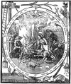
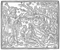
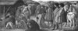

  
[Intangible Textual Heritage](../../index)  [Time](../index) 
[Index](index)  [Previous](crt07)  [Next](crt09) 

------------------------------------------------------------------------

[Buy this Book at
Amazon.com](https://www.amazon.com/exec/obidos/ASIN/0486233545/internetsacredte)

------------------------------------------------------------------------

*Christmas in Ritual and Tradition*, by Clement A. Miles, \[1912\], at
Intangible Textual Heritage

------------------------------------------------------------------------

## CHAPTER V

## CHRISTMAS DRAMA

> Origins of the Mediaeval Drama—Dramatic Tendencies in the
> Liturgy—Latin Liturgical Plays—The Drama becomes
> Laicized—Characteristics of the Popular Drama—The Nativity in the
> English Miracle Cycles—Christmas Mysteries in France—Later French
> Survivals of Christmas Drama—German Christmas Plays—Mediaeval
> Italian Plays and Pageants—Spanish Nativity Plays—Modern Survivals
> in Various Countries—The Star-singers, &c.

[  
Click to enlarge](img/image14.jpg)  
  

THE ADORATION OF THE SHEPHERDS.

From Broadside No. 305 in the Collection of the Society of Antiquaries
at Burlington House (by permission).

(Photo lent by Mr. F. Sidgwick, who has published the print on a modern
Christmas broadside.)

In this chapter the Christian side only of the Christmas drama will be
treated. Much folk-drama of pagan origin has gathered round the
festival, but this we shall study in our Second Part. Our subject here
is the dramatic representation of the story of the Nativity and the
events immediately connected with it. The Christmas drama has passed
through the same stages as the poetry of the Nativity. There is first a
monastic and hieratic stage, when the drama is but an expansion of the
liturgy, a piece of ceremonial performed by clerics with little attempt
at verisimilitude and with Latin words drawn mainly from the Bible or
the offices of the Church. Then, as the laity come to take a more
personal interest in Christianity, we find fancy beginning to play
around the subject, bringing out its human pathos and charm, until,
after a transitional stage, the drama leaves the sanctuary, passes from
Latin to the vulgar tongue, is played by lay performers in the streets
and squares of the city, and, while its framework remains religious,
takes into itself episodes of a more or less secular character. The
Latin liturgical plays are to the “miracles” and “mysteries” of the
later Middle Ages as a Romanesque church, solemn, oppressive, hieratic,
to p. 122 a Gothic
cathedral, soaring, audacious, reflecting every phase of the popular
life.

The mediaeval religious drama [5-1](crt22.htm#Note_5-1) was a natural development from the Catholic
liturgy, not an imitation of classical models. The classical drama had
expired at the break-up of the Roman Empire; its death was due largely,
indeed, to the hostility of Christianity, but also to the rude
indifference of the barbarian invaders. Whatever secular dramatic
impulses remained in the Dark Ages showed themselves not in public and
organized performances, but obscurely in the songs and mimicry of
minstrels and in traditional folk-customs. Both of these classes of
practices were strongly opposed by the Church, because of their
connection with heathenism and the licence towards which they tended.
Yet the dramatic instinct could not be suppressed. The folk-drama in
such forms as the Feast of Fools found its way, as we shall see, even
into the sanctuary, and—most remarkable fact of all—the Church's own
services took on more and more a dramatic character.

While the secular stage decayed, the Church was building up a stately
system of ritual. It is needless to dwell upon the dramatic elements in
Catholic worship. The central act of Christian devotion, the Eucharist,
is in its essence a drama, a representation of the death of the Redeemer
and the participation of the faithful in its benefits, and around this
has gathered in the Mass a multitude of dramatic actions expressing
different aspects of the Redemption. Nor, of course, is there merely
symbolic *action*; the offices of the Church are in great part
*dialogues* between priest and people, or between two sets of singers.
It was from this antiphonal song, this alternation of versicle and
respond, that the religious drama of the Middle Ages took its rise. In
the ninth century the “Antiphonarium” traditionally ascribed to Pope
Gregory the Great had become insufficient for ambitious choirs, and the
practice grew up of supplementing it by new melodies and words inserted
at the beginning or end or even in the middle of the old antiphons. The
new texts were called “tropes,” and from the ninth to the thirteenth
century many were written. An interesting Christmas p. 123 example is the
following ninth-century trope ascribed to Tutilo of St. Gall:—

> “Hodie cantandus est nobis puer, quem gignebat ineffabiliter ante
> tempora pater, et eundem sub tempore generavit inclyta mater. (To-day
> must we sing of a Child, whom in unspeakable wise His Father begat
> before all times, and whom, within time, a glorious mother brought
> forth.)
>
> Int\[errogatio\].
>
> Quis est iste puer quem tam magnis praeconiis dignum vociferatis?
> Dicite nobis ut collaudatores esse possimus. (Who is this Child whom
> ye proclaim worthy of so great laudations? Tell us that we also may
> praise Him.)
>
> Resp\[onsio\].
>
> Hic enim est quem praesagus et electus symmista Dei ad terram venturum
> praevidens longe ante praenotavit, sicque praedixit. (This is He whose
> coming to earth the prophetic and chosen initiate into the mysteries
> of God foresaw and pointed out long before, and thus foretold.)”

Here followed at once the Introit for the third Mass of Christmas Day,
“Puer natus est nobis, et filius datus est nobis, &c. (Unto us a child
is born, unto us a son is given.)” The question and answer were no doubt
sung by different choirs. [5-2](crt22.htm#Note_5-2)

One can well imagine that this might develop into a regular little
drama. As a matter of fact, however, it was from an Easter trope in the
same manuscript, the “Quem quaeritis,” a dialogue between the three
Maries and the angel at the sepulchre, that the liturgical drama sprang.
The trope became very popular, and was gradually elaborated into a short
symbolic drama, and its popularity led to the composition of similar
pieces for Christmas and Ascensiontide. Here is the Christmas trope from
a St. Gall manuscript:—

> “*On the Nativity of the Lord at Mass let there be ready two deacons
> having on dalmatics, behind the altar, saying*:
>
> Quem quaeritis in praesepe, pastores, dicite? (Whom seek ye in the
> manger, say, ye shepherds?)p. 124  id="Page_124">
>
> *Let two cantors in the choir answer*:
>
> Salvatorem Christum Dominum, infantem pannis involutum, secundum
> sermonem angelicum. (The Saviour, Christ the Lord, a child wrapped in
> swaddling clothes, according to the angelic word.)
>
> *And the deacons*:
>
> Adest hic parvulus cum Maria, matre sua, de qua, vaticinando, Isaias
> Propheta: ecce virgo concipiet et pariet filium; et nuntiantes dicite
> quia natus est. (Present here is the little one with Mary, His Mother,
> of whom Isaiah the prophet foretold: Behold, a virgin shall conceive,
> and shall bring forth a son; and do ye say and announce that He is
> born.)
>
> *Then let the cantor lift up his voice and say*:
>
> Alleluia, alleluia, jam vere scimus Christum natum in terris, de quo
> canite, omnes, cum Propheta dicentes: Puer natus est! (Alleluia,
> alleluia. Now we know indeed that Christ is born on earth, of whom
> sing ye all, saying with the Prophet: Unto us a child is
> born.)” [5-3](crt22.htm#Note_5-3)

The dramatic character of this is very marked. A comparison with later
liturgical plays suggests that the two deacons in their broad vestments
were meant to represent the midwives mentioned in the apocryphal Gospel
of St. James, and the cantors the shepherds.

A development from this trope, apparently, was the “Office of the
Shepherds,” which probably took shape in the eleventh century, though it
is first given in a Rouen manuscript of the thirteenth. It must have
been an impressive ceremony as performed in the great cathedral, dimly
lit with candles, and full of mysterious black recesses and hints of
infinity. Behind the high altar a *praesepe* or “crib” was prepared,
with an image of the Virgin. After the “Te Deum” had been sung five
canons or their vicars, clad in albs and amices, entered by the great
door of the choir, and proceeded towards the apse. These were the
shepherds. Suddenly from high above them came a clear boy's voice: “Fear
not, behold I bring you good tidings of great joy,” and the rest of the
angelic message. The “multitude of the heavenly host” was represented by
other boys stationed probably p. 125 in the triforium galleries, who broke out into the
exultant “Gloria in excelsis.” Singing a hymn, “Pax in terris
nunciatur,” the shepherds advanced towards the crib where two
priests—the midwives—awaited them. These addressed to the shepherds
the question “Whom seek ye in the manger?” and then came the rest of the
“Quem quaeritis” which we already know, a hymn to the Virgin being sung
while the shepherds adored the Infant. Mass followed immediately, the
little drama being merely a prelude. [5-4](crt22.htm#Note_5-4)

More important than this Office of the Shepherds is an Epiphany play
called by various names, “Stella,” “Tres Reges,” “Magi,” or “Herodes,”
and found in different forms at Limoges, Rouen, Laon, Compiègne,
Strasburg, Le Mans, Freising in Bavaria, and other places. Mr. E. K.
Chambers suggests that its kernel is a dramatized Offertory. It was a
custom for Christian kings to present gold, frankincense, and myrrh at
the Epiphany—the offering is still made by proxy at the Chapel Royal,
St. James's—and Mr. Chambers takes “the play to have served as a
substitute for this ceremony, when no king actually regnant was
present.” [5-5](crt22.htm#Note_5-5) Its
most essential features were the appearance of the Star of Bethlehem to
the Magi, and their offering of the mystic gifts. The star, bright with
candles, hung from the roof of the church, and was sometimes made to
move.

In the Rouen version of the play it is ordered that on the day of the
Epiphany, Terce having been sung, three clerics, robed as kings, shall
come from the east, north, and south, and meet before the altar, with
their servants bearing the offerings of the Magi. The king from the
east, pointing to the star with his stick, exclaims:—

> “Stella fulgore nimio rutilat. (The star glows with exceeding
> brightness.)”

The second monarch answers:

> “Quae regem regum natum demonstrat. (Which shows the birth of the King
> of Kings.)”p. 126  id="Page_126">

And the third:

> “Quem venturum olim prophetiae signaverant. (To whose coming the
> prophecies of old had pointed.)”

Then the Magi kiss one another and together sing:

> “Eamus ergo et inquiramus eum, offerentes ei munera: aurum, thus, et
> myrrham. (Let us therefore go and seek Him, offering unto Him gifts:
> gold, frankincense, and myrrh.)”

Antiphons are sung, a procession is formed, and the Magi go to a certain
altar above which an image of the Virgin has been placed with a lighted
star before it. Two priests in dalmatics—apparently the
midwives—standing on either side of the altar, inquire who the Magi
are, and receiving their answer, draw aside a curtain and bid them
approach to worship the Child, “for He is the redemption of the world.”
The three kings do adoration, and offer their gifts, each with a few
pregnant words:—

“Suscipe, rex, aurum. (Receive, O King,
gold.)”  
“Tolle thus, tu vere Deus. (Accept incense, Thou very
God.)”  
“Myrrham, signum sepulturae. (Myrrh, the sign of
burial.)”  

The clergy and people then make their offerings, while the Magi fall
asleep and are warned by an angel to return home another way. This they
do symbolically by proceeding back to the choir by a side
aisle. [5-6](crt22.htm#Note_5-6)

In its later forms the Epiphany play includes the appearance of Herod,
who is destined to fill a very important place in the mediaeval drama.
Hamlet's saying “he out-Herods Herod” sufficiently suggests the raging
tyrant whom the playwrights of the Middle Ages loved. His appearance
marks perhaps the first introduction into the Christian religious play
of the evil principle so necessary to dramatic effect. At first Herod
holds merely a mild conversation with the Magi, begging them to tell him
when they have found the new-born King; in later versions of the play,
however, his wrath is shown on learning that the Wise Men have p. 127 departed home by
another way; he breaks out into bloodthirsty tirades, orders the slaying
of the Innocents, and in one form takes a sword and brandishes it in the
air. He becomes in fact the outstanding figure in the drama, and one can
understand why it was sometimes named after him.

In the Laon “Stella” the actual murder of the Innocents was represented,
the symbolical figure of Rachel weeping over her children being
introduced. The plaint and consolation of Rachel, it should be noted,
seem at first to have formed an independent little piece performed
probably on Holy Innocents’ Day. [5-7](crt22.htm#Note_5-7) This later coalesced with the “Stella,” as did
also the play of the shepherds, and, at a still later date, another
liturgical drama which we must now consider—the “Prophetae.”

This had its origin in a sermon (wrongly ascribed to St. Augustine)
against Jews, Pagans, and Arians, a portion of which was used in many
churches as a Christmas lesson. It begins with a rhetorical appeal to
the Jews who refuse to accept Jesus as the Messiah in spite of the
witness of their own prophets. Ten prophets are made to give their
testimony, and then three Pagans are called upon, Virgil, Nebuchadnezzar
and the Erythraean Sibyl. The sermon has a strongly dramatic character,
and when chanted in church the parts of the preacher and the prophets
were possibly distributed among different choristers. In time it
developed into a regular drama, and more prophets were brought in. It
was, indeed, the germ of the great Old Testament cycles of the later
Middle Ages. [5-8](crt22.htm#Note_5-8)

An extension of the “Prophetae” was the Norman or Anglo-Norman play of
“Adam,” which began with the Fall, continued with Cain and Abel, and
ended with the witness of the prophets. In the other direction the
“Prophetae” was extended by the addition of the “Stella.” It so happens
that there is no text of a Latin drama containing both these extensions
at the same time, but such a play probably existed. From the
mid-thirteenth to the mid-fourteenth century, indeed, there was a
tendency for the plays to run together into cycles and become too long
and too elaborate for performance in church. In the eleventh century,
even, they had begun to pass out into the churchyard or p. 128 the market-place,
and to be played not only by the clergy but by laymen. This change had
extremely important effects on their character. In the first place the
vulgar tongue crept in. As early, possibly, as the twelfth century are
the Norman “Adam” and the Spanish “Misterio de los Reyes Magos,” the
former, as we have seen, an extended vernacular “Prophetae,” the latter,
a fragment of a highly developed vernacular “Stella.” They are the first
of the popular as distinguished from the liturgical plays; they were
meant, as their language shows, for the instruction and delight of the
folk; they were not to be listened to, like the mysterious Latin of the
liturgy, in uncomprehending reverence, but were to be understanded of
the people.

The thirteenth and fourteenth centuries saw a progressive supplanting of
Latin by the common speech, until, in the great cycles, only a few
scraps of the church language were left to tell of the liturgical origin
of the drama. The process of popularization, the development of the
plays from religious ceremonial to lively drama, was probably greatly
helped by the *goliards* or vagabond scholars, young, poor, and fond of
amusement, who wandered over Europe from teacher to teacher, from
monastery to monastery, in search of learning. Their influence is shown
not merely in the broadening of the drama, but also in its passing from
the Latin of the monasteries to the language of the common folk.

A consequence of the outdoor performance of the plays was that
Christmas, in the northern countries at all events, was found an
unsuitable time for them. The summer was naturally preferred, and we
find comparatively few mentions of plays at Christmas in the later
Middle Ages. Whitsuntide and Corpus Christi became more popular dates,
especially in England, and the pieces then performed were vast cosmic
cycles, like the York, Chester, Towneley, and “Coventry” plays, in which
the Christmas and Epiphany episodes formed but links in an immense chain
extending from the Creation to the Last Judgment, and representing the
whole scheme of salvation. It is in these Nativity scenes, however, that
we have the only English renderings of the Christmas story in
drama, [5-9](crt22.htm#Note_5-9) and
though they p. 129 were actually performed not at the winter
festival [42](crt24.htm#Footnote_42) but
in the summer, they give in so striking a way the feelings, the point of
view, of our mediaeval forefathers in regard to the Nativity that we are
justified in dealing with them here at some length.

As the drama became laicized, it came to reflect that strange medley of
conflicting elements, pagan and Christian, materialistic and spiritual,
which was the actual religion of the folk, as distinguished from the
philosophical theology of the doctors and councils and the mysticism of
the ascetics. The popularizing of Christianity had reached its climax in
most countries of western Europe in the fifteenth century, approximately
the period of the great “mysteries.” However little the ethical teaching
of Jesus may have been acted upon, the Christian religion on its
external side had been thoroughly appropriated by the people and wrought
into a many-coloured polytheism, a true reflection of their minds.

The figures of the drama are contemporaries of the spectators both in
garb and character; they are not Orientals of ancient times, but
Europeans of the end of the Middle Ages. Bethlehem is a “faier borow,”
Herod a “mody king,” like unto some haughty, capricious, and violent
monarch of the time, the shepherds are rustics of England or Germany or
France or Italy, the Magi mighty potentates with gorgeous trains, and
the Child Himself is a little being subject to all the pains and
necessities of infancy, but delighted with sweet and pleasant things
like a bob of cherries or a ball. The realism of the writers is
sometimes astounding, and comic elements often appear—to the people of
the Middle Ages religion was so real and natural a thing that they could
laugh at it without ceasing to believe in or to love it.

The English mediaeval playwrights, it may safely be said, are surpassed
by no foreigners in their treatment of Christmas subjects. To illustrate
their way of handling the scenes I may p.
130 gather from the four great cycles
a few of the most interesting passages.

From the so-called “Ludus Coventriae” I take the arrival of Joseph and
Mary at Bethlehem; they ask a man in the street where they may find an
inn:—

“*Joseph.*  Heyl, wurchepful sere, and good
day!  
A ceteceyn of this cytë ye seme to be;  
Of herborwe [43](crt24.htm#Footnote_43) ffor spowse and me I yow pray,  
ffor trewly this woman is fful werë,  
And fayn at reste, sere, wold she be;  

We wolde ffulffylle the byddynge of oure
emperoure,  
ffor to pay tribute, as right is oure,  
And to kepe oureselfe ffrom dolowre,  
We are come to this cytë.  

*Cives.*  Sere, ostage in this towne know I
non,  
Thin wyff and thou in for to slepe;  
This cetë is besett with pepyl every won,  
And yett thei ly withowte fful every strete.  

Withinne no walle, man, comyst thou nowth,  
Be thou onys [44](crt24.htm#Footnote_44) withinne the cytë gate;  
Onethys [45](crt24.htm#Footnote_45) in the strete a place may be sowth,  
Theron to reste, withowte debate.  

*Joseph.*  Nay, sere, debate that wyl I nowth;  
Alle suche thyngys passyn my powere:  
But yitt my care and alle my thought  
Is for Mary, my derlynge dere.  

A! swete wyff, wat xal we do?  
Wher xal we logge this nyght?  
Onto the ffadyr of heffne pray we so,  
Us to kepe ffrom every wykkyd whyt.  

*Cives.*  Good man, o word I wyl the sey,  
If thou wylt do by the counsel of me;  
Yondyr is an hous of
haras [46](crt24.htm#Footnote_46) that
stant be the wey,  
Amonge the bestys herboryd may ye be.p. 131   

*Maria.*  Now the fadyr of hefne he mut yow
yelde!  
His sone in my wombe forsothe he is;  
He kepe the and thi good be fryth and ffelde!  
Go we hens, husbond, for now tyme it
is.” [5-11](crt22.htm#Note_5-11)
  

The scene immediately after the Nativity is delicately and reverently
presented in the York cycle. The Virgin worships the Child, saluting Him
thus:—

“Hayle my lord God! hayle prince of pees!  
Hayle my fadir, and hayle my sone!  
Hayle souereyne sege all synnes to sesse!  
Hayle God and man in erth to
wonne! [47](crt24.htm#Footnote_47)  
Hayle! thurgh whos myht  
All this worlde was first be-gonne,  
merkness [48](crt24.htm#Footnote_48) and light.  

Sone, as I am sympill sugett of thyne,  
Vowchesaffe, swete sone I pray the,  
That I myght the take in the\[r\] armys of
mine,  
And in this poure wede to arraie the;  
Graunte me thi blisse!  
As I am thy modir chosen to be  
in sothfastnesse.”  

Joseph, who has gone out to get a light, returns, and this dialogue
follows:—

“*Joseph.*  Say, Marie doghtir, what chere with
the?  
*Mary.*    Right goode, Joseph, as has been
ay.  
*Joseph.*  O Marie! what swete thyng is that on thy
kne?  
*Mary.*    It is my sone, the soth to saye, that is so
gud  
*Joseph.*  Wel is me I bade this day, to se this
foode! [49](crt24.htm#Footnote_49)  
Me merueles mekill of this light  
That thus-gates shynes in this place,  
For suth it is a
selcouth [50](crt24.htm#Footnote_50)
sight!p. 132   
*Mary.*    This hase he ordand of his grace, my sone so
ying,  
A starne to be schynyng a space at his bering  

\*       \*       \*       \*       \*  

*Joseph.* Nowe welcome, floure fairest of
hewe,  
I shall the menske [51](crt24.htm#Footnote_51) with mayne and myght.  
Hayle! my maker, hayle Crist Jesu!  
Hayle, riall king, roote of all right!  
Hayle, saueour.  
Hayle, my lorde,
lemer [52](crt24.htm#Footnote_52) of
light,  
Hayle, blessid floure!  

*Mary.*    Nowe lord! that all this worlde schall
wynne,  
To the my sone is that I saye,  
Here is no bedde to laye the inne,  
Therfore my dere sone, I the praye sen it is
soo,  
Here in this cribbe I myght the lay betwene ther bestis
two.  
And I sall happe [53](crt24.htm#Footnote_53) the, myn owne dere childe,  
With such clothes as we haue here.  

*Joseph.*  O Marie! beholde thes beestis
mylde,  
They make louyng in ther manere as thei wer
men.  
For-sothe it semes wele be ther chere thare lord thei
ken.  

*Mary.*    Ther lorde thai kenne, that wate I
wele,  
They worshippe hym with myght and mayne;  
The wedir is colde, as ye may feele,  
To halde hym warme thei are full fayne, with thare
warme breth.” [5-12](crt22.htm#Note_5-12)   

The playwrights are at their best in the shepherd scenes; indeed these
are the most original parts of the cycles, for here the writers found
little to help them in theological tradition, and were thrown upon their
own wit. In humorous dialogue and naïve sentiment the lusty burgesses of
the fifteenth century were thoroughly at home, and the comedy and pathos
of these scenes must have been as welcome a relief to the spectators,
from the p. 133 long-winded solemnity of many of the plays, as they
are to modern readers. In the York mysteries the shepherds make uncouth
exclamations at the song of the angels and ludicrously try to imitate
it. The Chester shepherds talk in a very natural way of such things as
the diseases of sheep, sit down with much relish to a meal of “ale of
Halton,” sour milk, onions, garlick and leeks, green cheese, a sheep's
head soused in ale, and other items; then they call their lad Trowle,
who grumbles because his wages have not been paid, refuses to eat,
wrestles with his masters and throws them all. They sit down
discomfited; then the Star of Bethlehem appears, filling them with
wonder, which grows when they hear the angels’ song of “Gloria in
excelsis.” They discuss what the words were—“glore, glare with a glee,”
or, “glori, glory, glorious,” or, “glory, glory, with a glo.” At length
they go to Bethlehem, and arrived at the stable, the first shepherd
exclaims:—

“Sym, Sym, sickerlye  
Heare I see Marye,  
And Jesus Christe faste by,  
Lapped in haye.” [5-13](crt22.htm#Note_5-13)   

Joseph is strangely described:—

“Whatever this oulde man that heare is,  
Take heede howe his head is whore,  
His beirde is like a buske of breyers,  
With a pound of heaire about his mouth and
more.” [5-14](crt22.htm#Note_5-14)
  

Their gifts to the Infant are a bell, a flask, a spoon to eat pottage
with, and a cape. Trowle the servant has nought to offer but a pair of
his wife's old hose; four boys follow with presents of a bottle, a hood,
a pipe, and a nut-hook. Quaint are the words of the last two givers:—

“*The Thirde Boye.*  

O, noble childe of thee!  
Alas! what have I for thee,  
Save only my pipe?p.
134   
Elles trewly nothinge,  
Were I in the rockes or in,  
I coulde make this pippe  
That all this woode should ringe,  
And quiver, as yt were.  

*The Fourth Boye.*  

Nowe, childe, although thou be comon from God,  
And be God thy selfe in thy manhoode,  
Yet I knowe that in thy childehoode  
Thou wylte for sweete meate loke,  
To pull downe aples, peares, and plumes,  
Oulde Joseph shall not nede to hurte his
thombes,  
Because thou hast not pleintie of crombes,  
I geve thee heare my
nutthocke.” [5-15](crt22.htm#Note_5-15)
  

Let no one deem this irreverent; the spirit of this adoration of the
shepherds is intensely devout; they go away longing to tell all the
world the wonder they have seen; one will become a pilgrim; even the
rough Trowle exclaims that he will forsake the shepherd's craft and will
betake himself to an anchorite's hard by, in prayers to “wache and
wake.”

More famous than this Chester “Pastores” are the two shepherd plays in
the Towneley cycle. [5-16](crt22.htm#Note_5-16) The first begins with racy talk, leading to a
wrangle between two of the shepherds about some imaginary sheep; then a
third arrives and makes fun of them both; a feast follows, with much
homely detail; they go to sleep and are awakened by the angelic message;
after much debate over its meaning and over the foretellings of the
prophets—one of them, strangely enough, quotes a Latin passage from
Virgil—they go to Bethlehem and present to the Child a “lytyll spruse
cofer,” a ball, and a gourd-bottle.

The second play surpasses in humour anything else in the mediaeval drama
of any country. We find the shepherds first complaining of the cold and
their hard lot; they are “al lappyd in sorow.” They talk, almost like
modern Socialists, of the oppressions of the rich:—

“For the tylthe of our landys lyys falow as the
floore,  
As ye ken.p. 135   
We ar so hamyd, [54](crt24.htm#Footnote_54)  
For-taxed and ramyd, [55](crt24.htm#Footnote_55)  
We ar mayde hand-tamyd,  
With thyse gentlery men.  

Thus thay refe [56](crt24.htm#Footnote_56) us our rest, Our Lady theym
wary! [57](crt24.htm#Footnote_57)  
These men that ar
lord-fest, [58](crt24.htm#Footnote_58)
they cause the ploghe tary.”  

To these shepherds joins himself Mak, a thieving neighbour. Going to
sleep, they make him lie between them, for they doubt his honesty. But
for all their precautions he manages to steal a sheep, and carries it
home to his wife. She thinks of an ingenious plan for concealing it from
the shepherds if they visit the cottage seeking their lost property: she
will pretend that she is in child-bed and that the sheep is the new-born
infant. So it is wrapped up and laid in a cradle, and Mak sings a
lullaby. The shepherds do suspect Mak, and come to search his house; his
wife upbraids them and keeps them from the cradle. They depart, but
suddenly an idea comes to one of them:—

“*The First Shepherd.* Gaf ye the chyld any
thyng?  
*The Second.* I trow not oone farthyng.  
*The Third.* Fast agane will I flyng,  
Abyde ye me there. \[*He goes back.*\]  
Mak, take it to no grefe, if I com to thi
barne.”  

Mak tries to put him off, but the shepherd will have his way:—

“Gyf me lefe hym to kys, and lyft up the
clowtt.  
What the devill is this? he has a long
snowte.”  

So the secret is out. Mak's wife gives a desperate explanation:—

“He was takyn with an elfe,  
I saw it myself.  
When the clok stroke twelf  
Was he forshapyn.”  

p. 136 Naturally
this avails nothing, and her husband is given a good tossing by the
shepherds until they are tired out and lie down to rest. Then comes the
“Gloria in excelsis” and the call of the angel:—

“Ryse, hyrd men heynd! for now is he borne  
That shall take fro the feynd that Adam had
lorne:  
That warloo [59](crt24.htm#Footnote_59) to sheynd, [60](crt24.htm#Footnote_60) this nyght is he borne,  
God is made youre freynd: now at this morne  
He behestys,  
At Bedlem go se,  
Ther lygys that fre [61](crt24.htm#Footnote_61)  
In a cryb fulle poorely,  
Betwyx two bestys.”  

The shepherds wonder at the song, and one of them tries to imitate it;
then they go even unto Bethlehem, and there follows the quaintest and
most delightful of Christmas carols:—

“*Primus Pastor.*  

Hail, comly and clene,  
Hail, yong child!  
Hail, maker, as I meene,  
Of a maden so milde!  
Thou has warëd, [62](crt24.htm#Footnote_62) I weene,  
The warlo [63](crt24.htm#Footnote_63) so wilde;  
The fals giler of
teen, [64](crt24.htm#Footnote_64)  
Now goes he begilde.  
Lo! he merys, [65](crt24.htm#Footnote_65)  
Lo! he laghës, my sweting.  
A welfare meting!  
I have holden my
heting. [66](crt24.htm#Footnote_66)  
Have a bob of cherys!  

*Secundus Pastor.*  

Hail, sufferan Savioure,  
For thou has us soght!  
Hail, frely [67](crt24.htm#Footnote_67) foyde [68](crt24.htm#Footnote_68) and floure,  
That all thing has wroght!p.
137   
Hail, full of favoure,  
That made all of noght!  
Hail, I kneel and I cowre.  
A bird have I broght  
To my barne.  
Hail, litel tinë mop! [69](crt24.htm#Footnote_69)  
Of oure crede thou art
crop; [70](crt24.htm#Footnote_70)  
I wold drink on thy cop,  
Litel day starne.  

*Tertius Pastor.*  

Hail, derling dere,  
Full of godhede!  
I pray thee be nere  
When that I have nede.  
Hail! swete is thy
chere; [71](crt24.htm#Footnote_71)  
My hart woldë blede  
To see thee sitt here  
In so poorë wede,  
With no pennys.  
Hail! Put forth thy
dall! [72](crt24.htm#Footnote_72)  
I bring thee bot a ball;  
Have and play thee with all,  
And go to the tenis!” [5-17](crt22.htm#Note_5-17)   

The charm of this will be felt by every reader; it lies in a curious
incongruity—extreme homeliness joined to awe; the Infinite is contained
within the narrowest human bounds; God Himself, the Creator and
Sustainer of the universe, a weak, helpless child. But a step more, and
all would have been irreverence; as it is we have devotion, human,
naïve, and touching.

It would be interesting to show how other scenes connected with
Christmas are handled in the English miracle-plays: how Octavian (Caesar
Augustus) sent out the decree that all the world should be taxed, and
learned from the Sibyl the birth of Christ; how the Magi were led by the
star and offered their symbolic gifts; how the raging of the boastful
tyrant Herod, the p. 138 Slaughter of the Innocents, and the Flight into
Egypt are treated; but these scenes, though full of colour, are on the
whole less remarkable than the shepherd and Nativity pieces, and space
forbids us to dwell upon them. They contain many curious anachronisms,
as when Herod invokes Mahounde, and talks about his princes, prelates,
barons, baronets and burgesses. [73](crt24.htm#Footnote_73)

The religious play in England did not long survive the Reformation.
Under the influence of Protestantism, with its vigilant dread of
profanity and superstition, the cycles were shorn of many of their
scenes, the performances became irregular, and by the end of the
sixteenth century they had mostly ceased to be. Not sacred story, but
the play of human character, was henceforth the material of the drama.
The rich, variegated religion of the people, communal in its expression,
tinged everywhere with human colour, gave place to a sterner, colder,
more individual faith, fearful of contamination by the use of the
outward and visible.

There is little or no trace in the vernacular Christmas plays of direct
translation from one language into another, though there was some
borrowing of motives. Thus the Christmas drama of each nation has its
own special flavour.

If we turn to France, we find a remarkable fifteenth-century cycle that
belongs purely to the winter festival, and shows the strictly Christmas
drama at its fullest development. This great mystery of the “Incarnacion
et nativité de nostre saulveur et redempteur Jesuchrist” was performed
out-of-doors at Rouen in 1474, an exceptional event for a northern city
in winter-time. The twenty-four *establies* or “mansions” set up for the
various scenes reached across the market-place from the “Axe and Crown”
Inn to the “Angel.”

p. 139 After a
prologue briefly explaining its purpose, the mystery begins, like the
old liturgical plays, with the witness of the prophets; then follows a
scene in Limbo where Adam is shown lamenting his fate, and another in
Heaven where the Redemption of mankind is discussed and the Incarnation
decided upon. With the Annunciation and the Visitation of the Virgin the
first day closed. The second day opened with the ordering by Octavian of
the world-census. The edict is addressed:—

“A tous roys, marquis, ducs et contes,  
Connestables, bailifs, vicomtes  
Et tous autres generalment  
Qui sont desoubz le firmament.”  

Joseph, in order to fulfil the command of Cyrenius, governor of Syria,
leaves Nazareth for Bethlehem. A comic shepherds’ scene follows, with a
rustic song:—

“Joyeusement, la garenlo,  
Chantons en venant a la veille,  
Puisque nous avons la bouteille  
Nous y berons jusques a bo.”  

When Joseph and Mary reach the stable where the Nativity is to take
place, there is a charming dialogue. Joseph laments over the meanness of
the stable, Mary accepts it with calm resignation.

*Joseph.*  

“Las! vecy bien povre merrien  
Pour edifier un hostel  
Et logis a ung seigneur tel.  
Il naistra en bien povre place.  

*Marie.*  

Il plait a Dieu qu'ainsy se face.  

\*       \*       \*       \*       \*  

*Joseph.*  

Ou sont ces chambres tant fournies  
De Sarges, de Tapiceriesp.
140   
Batus d'or, ou luyt mainte pierre,  
Et nates mises sur la terre,  
Affin que le froit ne mefface?  

*Marie.*  

Il plait a Dieu qu'ainsy se face.  

\*       \*       \*       \*       \*  

*Joseph.*  

Helas! cy gerra povrement  
Le createur du firmament  
Celui qui fait le soleil luire,  
Qui fait la terre fruis produire,  
Qui tient la mer en son espace.  

*Marie.*  

Il plait a Dieu qu'ainsy se face.”  

At last Christ is born, welcomed by the song of the angels, adored by
His mother. In the heathen temples the idols fall; Hell mouth opens and
shows the rage of the demons, who make a hideous noise; fire issues from
the nostrils and eyes and ears of Hell, which shuts up with the devils
within it. And then the angels in the stable worship the Child Jesus.
The adoration of the shepherds was shown with many naïve details for the
delight of the people, and the performance ended with the offering of a
sacrifice in Rome by the Emperor Octavian to an image of the Blessed
Virgin. [5-19](crt22.htm#Note_5-19)

The French playwrights, quite as much as the English, love comic
shepherd scenes with plenty of eating and drinking and brawling. A
traditional figure is the shepherd Rifflart, always a laughable type. In
the strictly mediaeval plays the shepherds are true French rustics, but
with the progress of the Renaissance classical elements creep into the
pastoral scenes; in a mystery printed in 1507 Orpheus with the Nymphs
and Oreads is introduced. As might be expected, anachronisms often
occur; a peculiarly piquant instance is found in the S. Geneviève
mystery, where Caesar Augustus gets a piece of Latin translated into
French for his convenience.

[  
Click to enlarge](img/image15.jpg)  
  

THE SHEPHERDS OF BETHLEHEM.

From “Le grant Kalendrier compost des Bergiers” (N. le Rouge, Troyes,
1529).

(Reproduced from a modern broadside published by Mr. F. Sidgwick.)

p. 141 Late
examples of French Christmas mysteries are the so-called “comedies” of
the Nativity, Adoration of the Kings, Massacre of the Innocents, and
Flight into Egypt contained in the “Marguerites” (published in 1547) of
Marguerite, Queen of Navarre, sister of François I. Intermingled with
the traditional figures treated more or less in the traditional way are
personified abstractions like Philosophy, Tribulation, Inspiration,
Divine Intelligence, and Contemplation, which largely rob the plays of
dramatic effect. There is some true poetry in these pieces, but too much
theological learning and too little simplicity, and in one place the
ideas of Calvin seem to show
themselves. [5-20](crt22.htm#Note_5-20)

The French mystery began to fall into decay about the middle of the
sixteenth century. It was attacked on every side: by the new poets of
the Renaissance, who preferred classical to Christian subjects; by the
Protestants, who deemed the religious drama a trifling with the solemn
truths of Scripture; and even by the Catholic clergy, who, roused to
greater strictness by the challenge of Protestantism, found the comic
elements in the plays offensive and dangerous, and perhaps feared that
too great familiarity with the Bible as represented in the mysteries
might lead the people into heresy. [5-21](crt22.htm#Note_5-21) Yet we hear occasionally of Christmas dramas
in France in the seventeenth, eighteenth, and nineteenth centuries. In
the neighbourhood of Nantes, for instance, a play of the Nativity by
Claude Macée, hermit, probably written in the seventeenth century, was
commonly performed in the first half of the
nineteenth. [5-22](crt22.htm#Note_5-22)
At Clermont the adoration of the shepherds was still performed in 1718,
and some kind of representation of the scene continued in the diocese of
Cambrai until 1834, when it was forbidden by the bishop. In the south,
especially at Marseilles, “pastorals” were played towards the end of the
nineteenth century; they had, however, largely lost their sacred
character, and had become a kind of review of the events of the
year. [5-23](crt22.htm#Note_5-23) At
Dinan, in Brittany, some sort of Herod play was performed, though it was
dying out, in 1886. It was acted by young men on the Epiphany, and there
was an “innocent” whose throat they pretended to cut with a wooden
sword. [5-24](crt22.htm#Note_5-24)

p. 142 An
interesting summary of a very full Nativity play performed in the
churches of Upper Gascony on Christmas Eve is given by Countess
Martinengo-Cesaresco. [5-25](crt22.htm#Note_5-25) It ranges from the arrival of Joseph and Mary
at Bethlehem to the Flight into Egypt and the Murder of the Innocents,
but perhaps the most interesting parts are the shepherd scenes. After
the message of the angel—a child in a surplice, with wings fastened to
his shoulders, seated on a chair drawn up to the ceiling and supported
by ropes—the shepherds leave the church, the whole of which is now
regarded as the stable of the Divine Birth. They knock for admittance,
and Joseph, regretting that the chamber is “so badly lighted,” lets them
in. They fall down before the manger, and so do the shepherdesses, who
“deposit on the altar steps a banner covered with flowers and greenery,
from which hang strings of small birds, apples, nuts, chestnuts, and
other fruits. It is their Christmas offering to the curé; the shepherds
have already placed a whole sheep before the altar, in a like spirit.”
The play is not mere dumb-show, but has a full libretto.

A rather similar piece of dramatic ceremonial is described by Barthélemy
in his edition of Durandus, [5-26](crt22.htm#Note_5-26) as customary in the eighteenth century at La
Villeneuve-en-Chevrie, near Mantes. At the Midnight Mass a *crèche* with
a wax figure of the Holy Child was placed in the choir, with tapers
burning about it. After the “Te Deum” had been sung, the celebrant,
accompanied by his attendants, censed the *crèche*, to the sound of
violins, double-basses, and other instruments. A shepherd then
prostrated himself before the crib, holding a sheep with a sort of
little saddle bearing sixteen lighted candles. He was followed by two
shepherdesses in white with distaffs and tapers. A second shepherd,
between two shepherdesses, carried a laurel branch, to which were
fastened oranges, lemons, biscuits, and sweetmeats. Two others brought
great *pains-bénits* and lighted candles; then came four shepherdesses,
who made their adoration, and lastly twenty-six more shepherds, two by
two, bearing in one hand a candle and in the other a festooned crook.
The same ceremonial was practised at the Offertory and after the close
of the Mass. All was done, it is said, with such piety and edification
that p. 143 St.
Luke's words about the Bethlehem shepherds were true of these French
swains—they “returned glorifying and praising God for all the things
they had heard and seen.”

In German there remain very few Christmas plays earlier than the
fifteenth century. Later periods, however, have produced a multitude,
and dramatic performances at Christmas have continued down to quite
modern times in German-speaking parts.

At Oberufer near Pressburg—a German Protestant village in Hungary—some
fifty years ago, a Christmas play was performed under the direction of
an old farmer, whose office as instructor had descended from father to
son. The play took place at intervals of from three to ten years and was
acted on all Sundays and festivals from Advent to the Epiphany. Great
care was taken to ensure the strictest piety and morality in the actors,
and no secular music was allowed in the place during the season for the
performances. The practices began as early as October. On the first
Sunday in Advent there was a solemn procession to the hall hired for the
play. First went a man bearing a gigantic star—he was called the
“Master Singer”—and another carrying a Christmas-tree decked with
ribbons and apples; then came all the actors, singing hymns. There was
no scenery and no theatrical apparatus beyond a straw-seated chair and a
wooden stool. When the first was used, the scene was understood to be
Jerusalem, when the second, Bethlehem. The Christmas drama, immediately
preceded by an Adam and Eve play, and succeeded by a Shrove Tuesday one,
followed mediaeval lines, and included the wanderings of Joseph and Mary
round the inns of Bethlehem, the angelic tidings to the shepherds, their
visit to the manger, the adoration of the Three Kings, and various Herod
scenes. Protestant influence was shown by the introduction of Luther's
“Vom Himmel hoch,” but the general character was very much that of the
old mysteries, and the dialogue was full of quaint
naïveté. [5-27](crt22.htm#Note_5-27)

At Brixlegg, in Tyrol, as late as 1872 a long Christmas play was acted
under Catholic auspices; some of its dialogue was in p. 144 the Tyrolese
*patois* and racy and humorous, other parts, and particularly the
speeches of Mary and Joseph—out of respect for these holy
personages—had been rewritten in the eighteenth century in a very
stilted and undramatic style. Some simple shepherd plays are said to be
still presented in the churches of the Saxon
Erzgebirge. [5-28](crt22.htm#Note_5-28)

The German language is perhaps richer in real Christmas plays, as
distinguished from Nativity and Epiphany episodes in great cosmic
cycles, than any other. There are some examples in mediaeval
manuscripts, but the most interesting are shorter pieces performed in
country places in comparatively recent times, and probably largely
traditional in substance. Christianity by the fourteenth century had at
last gained a real hold upon the German people, or perhaps one should
rather say the German people had laid a strong hold upon Christianity,
moulding it into something very human and concrete, materialistic often,
yet not without spiritual significance. In cradle-rocking and religious
dancing at Christmas the instincts of a lusty, kindly race expressed
themselves, and the same character is shown in the short popular
Christmas dramas collected by Weinhold and
others. [5-29](crt22.htm#Note_5-29) Many
of the little pieces—some are rather duets than plays—were sung or
acted in church or by the fireside in the nineteenth century, and
perhaps even now may linger in remote places. They are in dialect, and
the rusticity of their language harmonizes well with their naïve, homely
sentiment. In them we behold the scenes of Bethlehem as realized by
peasants, and their mixture of rough humour and tender feeling is
thoroughly in keeping with the subject.

One is made to feel very vividly the amazement of the shepherds at the
wondrous and sudden apparition of the angels:—

“*Riepl.* Woas is das für a Getümmel,  
I versteh mi nit in d'Welt.  
*Jörgl.* Is den heunt eingfalln der Himmel,  
Fleugn d'Engeln auf unserm Feld?  
*R.* Thuen Sprüng macha  
*J.* Von oben acha!p.
145   
*R.* I turft das Ding nit noacha thoan,  
that mir brechn Hals und
Boan.” [74](crt24.htm#Footnote_74) [5-30](crt22.htm#Note_5-30)   

The cold is keenly brought home to us when they come to the manger:—

“*J.* Mei Kind, kanst kei Herberg finden?  
Muest so viel Frost leiden schoan.  
*R.* Ligst du under kalden Windeln!  
Lägts ihm doch a Gwandl oan!  
*J.* Machts ihm d'Füess ein,  
Hüllts in zue fein!” [75](crt24.htm#Footnote_75) [5-31](crt22.htm#Note_5-31)   

Very homely are their presents to the Child:—

“Ein drei Eier und ein Butter  
Bringen wir auch, nemt es an!  
Einen Han zu einer Suppen,  
Wanns die Mutter kochen kann.  
Giessts ein Schmalz drein, wirds wol guet
sein.  
Weil wir sonsten gar nix han,  
Sind wir selber arme Hirten,  
Nemts den guten Willen
an.” [76](crt24.htm#Footnote_76) [5-32](crt22.htm#Note_5-32)   

One of the dialogues ends with a curious piece of ordinary human
kindliness, as if the Divine nature of the Infant were quite forgotten
for the moment:—

“*J.* Bleib halt fein gsund, mein kloans
Liebl,  
Wannst woas brauchst, so komm ze mir.  

\*       \*       \*       \*       \*  

*J.* Pfüet di Gôt halt!p.
146   
*R.* Wär fein gross bald!  
*J.* Kannst in mein Dienst stehen ein,  
Wann darzu wirst gross gnue
sein.” [77](crt24.htm#Footnote_77) [5-33](crt22.htm#Note_5-33)   

Far more interesting in their realism and naturalness are these little
plays of the common folk than the elaborate Christmas dramas of more
learned German writers, Catholic and Lutheran, who in the sixteenth and
seventeenth centuries became increasingly stilted and bombastic.

The Italian religious drama [5-34](crt22.htm#Note_5-34) evolved somewhat differently from that of the
northern countries. The later thirteenth century saw the outbreak of the
fanaticism of the Flagellants or *Battuti*, vast crowds of people of all
classes who went in procession from church to church, from city to city,
scourging their naked bodies in terror and repentance till the blood
flowed. When the wild enthusiasm of this movement subsided it left
enduring traces in the foundation of lay communities throughout the
land, continuing in a more sober way the penitential practices of the
Flagellants. One of their aids to devotion was the singing or reciting
of vernacular poetry, less formal than the Latin hymns of the liturgy,
and known as *laude*. [78](crt24.htm#Footnote_78) These *laude* developed a more or less dramatic
form, which gained the name of
*divozioni*. [79](crt24.htm#Footnote_79)
They were, perhaps (though not certainly, for there seems to have been
another tradition derived from the regular liturgical drama), the source
from which sprang the gorgeously produced *sacre rappresentazioni* of
the fifteenth century.

The *sacre rappresentazioni* corresponded, though with considerable
differences, to the miracle-plays of England and France. Their great
period was the fifty years from 1470 to 1520, and p.
147 they were performed, like the
*divozioni*, by confraternities of religious laymen. The actors were
boys belonging to the brotherhoods, and the plays were intended to be
edifying for youth. They are more refined than the northern religious
dramas, but only too often fall into insipidity.

Among the texts given by D'Ancona in his collection of *sacre
rappresentazioni* is a Tuscan
“Natività,” [5-36](crt22.htm#Note_5-36)
opening with a pastoral scene resembling those in the northern
mysteries, but far less vigorous. It cannot compare, for character and
humour, with the Towneley plays. Still the shepherds, whose names are
Bobi del Farucchio, Nencio di Pucchio, Randello, Nencietto, Giordano,
and Falconcello, are at least meant to have a certain rusticity, as they
feast on bread and cheese and wine, play to the Saviour on bagpipe or
whistle, and offer humble presents like apples and cheese. The scenes
which follow, the coming of the Magi and the Murder of the Innocents,
are not intrinsically of great interest.

It is possible that this play may have been the spectacle performed in
Florence in 1466, as recorded by Machiavelli, “to give men something to
take away their thoughts from affairs of state.” It “represented the
coming of the three Magi Kings from the East, following the star which
showed the Nativity of Christ, and it was of so great pomp and
magnificence that it kept the whole city busy for several months in
arranging and preparing it.” [5-37](crt22.htm#Note_5-37)

An earlier record of an Italian pageant of the Magi is this account by
the chronicler Galvano Flamma of what took place at Milan in 1336:—

> “There were three kings crowned, on great horses, ... and an exceeding
> great train. And there was a golden star running through the air,
> which went before these three kings, and they came to the columns of
> San Lorenzo, where was King Herod in effigy, with the scribes and wise
> men. And they were seen to ask King Herod where Christ was born, and
> having turned over many books they answered, that He should be born in
> the city of David distant five miles from Jerusalem. And having heard
> this, those three kings, crowned with golden crowns, holding in their
> hands golden cups with gold, incense, p.
> 148 and myrrh, came to the church of
> Sant’ Eustorgio, the star preceding them through the air, ... and a
> wonderful train, with resounding trumpets and horns going before them,
> with apes, baboons, and diverse kinds of animals, and a marvellous
> tumult of people. There at the side of the high altar was a manger
> with ox and ass, and in the manger was the little Christ in the arms
> of the Virgin Mother. And those kings offered gifts unto Christ; then
> they were seen to sleep, and a winged angel said to them that they
> should not return by the region of San Lorenzo but by the Porta
> Romana; which also was done. There was so great a concourse of the
> people and soldiers and ladies and clerics that scarce anything like
> it was ever beheld. And it was ordered that every year this festal
> show should be performed.” [5-38](crt22.htm#Note_5-38) id="Nanchor_5-38">

How suggestive this is of the Magi pictures of the fifteenth century,
with their gorgeous eastern monarchs and retinues of countless servants
and strange animals. No other story in the New Testament gives such
opportunity for pageantry as the Magi scene. All the wonder, richness,
and romance of the East, all the splendour of western Renaissance
princes could lawfully be introduced into the train of the Three Kings.
With Gentile da Fabriano and Benozzo Gozzoli it has become a magnificent
procession; there are trumpeters, pages, jesters, dwarfs, exotic
beasts—all the motley, gorgeous retinue of the monarchs of the time,
while the kings themselves are romantic figures in richest attire,
velvet, brocade, wrought gold, and jewels. It may be that much of this
splendour was suggested to the painters by dramatic spectacles which
actually passed before their eyes.

I have already alluded to the Spanish “Mystery of the Magi Kings,” a
mere fragment, but of peculiar interest to the historian of the drama as
one of the two earliest religious plays in a modern European language.
Though plays are known to have been performed in Spain at Christmas and
Easter in the Middle Ages, [5-39](crt22.htm#Note_5-39) we have no further texts until the very short
“Representation of the Birth of Our Lord,” by Gómez Manrique, Señor de
Villazopeque (1412-91), acted at the convent at Calabazanos, of which
the author's sister was Superior. The characters p.
149 introduced are the Virgin, St.
Joseph, St. Gabriel, St. Michael, St. Raphael, another angel, and three
shepherds. [5-40](crt22.htm#Note_5-40)

Touched by the spirit of the Renaissance, and particularly by the
influence of Virgil, is Juan del Encina of Salamanca (1469-1534), court
poet to the Duke of Alba, and author of two Christmas
eclogues. [5-41](crt22.htm#Note_5-41)
The first introduces four shepherds who bear the names of the
Evangelists, Matthew, Mark, Luke, and John, and are curiously mixed
personages, their words being half what might be expected from the
shepherds of Bethlehem and half sayings proper only to the authors of
the Gospels. It ends with a *villancico* or carol. The second eclogue is
far more realistic, and indeed resembles the English and French pastoral
scenes. The shepherds grumble about the weather—it has been raining for
two months, the floods are terrible, and no fords or bridges are left;
they talk of the death of a sacristan, a fine singer; and they play a
game with chestnuts; then comes the angel—whom one of them calls a
“smartly dressed lad” (*garzon repìcado*)—to tell them of the Birth,
and they go to adore the Child, taking Him a kid, butter-cakes, eggs,
and other presents.

Infinitely more ambitious is “The Birth of
Christ” [5-42](crt22.htm#Note_5-42) by
the great Lope de Vega (1562-1635). It opens in Paradise, immediately
after the Creation, and ends with the adoration of the Three Kings. Full
of allegorical conceits and personified qualities, it will hardly please
the taste of modern minds. Another work of Lope's, “The Shepherds of
Bethlehem,” a long pastoral in prose and verse, published in 1612,
contains, amid many incongruities, some of the best of his shorter
poems; one lullaby, sung by the Virgin in a palm-grove while her Child
sleeps, has been thus translated by Ticknor:—

“Holy angels and blest,  
Through these palms as ye sweep,  
Hold their branches at rest,  
For my babe is asleep.  

And ye Bethlehem palm-trees,  
As stormy winds rushp.
150   
In tempest and fury,  
Your angry noise hush;  
Move gently, move gently,  
Restrain your wild sweep;  
Hold your branches at rest,  
My babe is asleep.  

My babe all divine,  
With earth's sorrows oppressed,  
Seeks in slumber an instant  
His grievings to rest;  
He slumbers, he slumbers,  
O, hush, then, and keep  
Your branches all still,  
My babe is asleep!” [5-43](crt22.htm#Note_5-43)   

Apart from such modern revivals of the Christmas drama as Mr. Laurence
Housman's “Bethlehem,” Miss Buckton's “Eager Heart,” Mrs. Percy
Dearmer's “The Soul of the World,” and similar experiments in Germany
and France, a genuine tradition has lingered on in some parts of Europe
into modern times. We have already noticed some French and German
instances; to these may be added a few from other countries.

In Naples there is no Christmas without the “Cantata dei pastori”; it is
looked forward to no less than the Midnight Mass. Two or three theatres
compete for the public favour in the performance of this play in rude
verse. It begins with Adam and Eve and ends with the birth of Jesus and
the adoration of the shepherds. Many devils are brought on the stage,
their arms and legs laden with brass chains that rattle horribly. Awful
are their names, Lucifero, Satanasso, Belfegor, Belzebù, &c. They not
only tempt Adam and Eve, but annoy the Virgin and St. Joseph, until an
angel comes and frightens them away. Two non-Biblical figures are
introduced, Razzullo and Sarchiapone, who are tempted by devils and
aided by angels. [5-44](crt22.htm#Note_5-44) In Sicily too the Christmas play still lingers
under the name of *Pastorale*. [5-45](crt22.htm#Note_5-45)

p. 151 A
nineteenth-century Spanish survival of the “Stella” is described in
Fernan Caballero's sketch, “La Noche de
Navidad.” [5-46](crt22.htm#Note_5-46) At
the foot of the altar of the village church, according to this account,
images of the Virgin and St. Joseph were placed, with the Holy Child
between them, lying on straw. On either side knelt a small boy dressed
as an angel. Solemnly there entered the church a number of men attired
as shepherds, bearing their offerings to the Child; afterwards they
danced with slow and dignified movements before the altar. The shepherds
were followed by the richest men of the village dressed as the Magi
Kings, mounted on horseback, and followed by their train. Before them
went a shining star. On reaching the church they dismounted; the first,
representing a majestic old man with white hair, offered incense to the
Babe; the others, Caspar and Melchior, myrrh and gold respectively. This
was done on the feast of the Epiphany.

A remnant possibly of the “Stella” is to be found in a Christmas custom
extremely widespread in Europe and surviving even in some Protestant
lands—the carrying about of a star in memory of the Star of Bethlehem.
It is generally borne by a company of boys, who sing some sort of carol,
and expect a gift in return.

The practice is—or was—found as far north as Sweden. All through the
Christmas season the “star youths” go about from house to house. Three
are dressed up as the Magi Kings, a fourth carries on a stick a paper
lantern in the form of a six-pointed star, made to revolve and lighted
by candles. There are also a Judas, who bears the purse for the
collection, and, occasionally, a King Herod. A doggerel rhyme is sung,
telling the story of the Nativity and offering good
wishes. [5-47](crt22.htm#Note_5-47) In
Norway and Denmark processions of a like character were formerly
known. [5-48](crt22.htm#Note_5-48)

In Normandy at Christmas children used to go singing through the village
streets, carrying a lantern of coloured paper on a long osier
rod. [5-49](crt22.htm#Note_5-49) At
Pleudihen in Brittany three young men representing the Magi sang carols
in the cottages, dressed in their holiday clothes covered with
ribbons. [5-50](crt22.htm#Note_5-50)

p. 152 In England
there appears to be no trace of the custom, which is however found in
Germany, Austria, Holland, Italy, Bohemia, Roumania, Poland, and
Russia. [5-51](crt22.htm#Note_5-51)

In Thuringia a curious carol used to be sung, telling how Herod tried to
tempt the Wise Men—

“‘Oh, good Wise Men, come in and dine;  
I will give you both beer and wine,  
And hay and straw to make your bed,  
And nought of payment shall be said.’”  

But they answer:—

“‘Oh, no! oh, no! we must away,  
We seek a little Child to-day,  
A little Child, a mighty King,  
Him who created
everything.’” [5-52](crt22.htm#Note_5-52)   

In Tyrol the “star-singing” is very much alive at the present day. In
the Upper Innthal three boys in white robes, with blackened faces and
gold paper crowns, go to every house on Epiphany Eve, one of them
carrying a golden star on a pole. They sing a carol, half religious,
half comic—almost a little drama—and are given money, cake, and drink.
In the Ilsethal the boys come on Christmas Eve, and presents are given
them by well-to-do people. In some parts there is but one singer, an old
man with a white beard and a turban, who twirls a revolving star. A
remarkable point about the Tyrolese star-singers is that before anything
is given them they are told to stamp on the snowy fields outside the
houses, in order to promote the growth of the crops in
summer. [5-53](crt22.htm#Note_5-53)

In Little Russia the “star” is made of pasteboard and has a transparent
centre with a picture of Christ through which the light of a candle
shines. One boy carries the star and another twirls the
points. [5-54](crt22.htm#Note_5-54) In
Roumania it is made of wood and adorned with frills and little bells. A
representation of the “manger,” illuminated from behind, forms the
centre, and the star also shows pictures of Adam and Eve and
angels. [5-55](crt22.htm#Note_5-55)

p. 153 A curious
traditional drama, in which pagan elements seem to have mingled with the
Herod story, is still performed by the Roumanians during the Christmas
festival. It is called in Wallachia “Vicleim” (from Bethlehem), in
Moldavia and Transylvania “Irozi” (plural from *Irod* = Herod). At least
ten persons figure in it: “Emperor” Herod, an old grumbling monarch who
speaks in harsh tones to his followers; an officer and two soldiers in
Roman attire; the three Magi, in Oriental garb, a child, and “two
comical figures—the *paiaţa* (the clown) and the *moşul*, or old man,
the former in harlequin accoutrement, the latter with a mask on his
face, a long beard, a hunch on his back, and dressed in a sheepskin with
the wool on the outside. The plot of the play is quite simple. The
officer brings the news that three strange men have been caught, going
to Bethlehem to adore the new-born Messiah; Herod orders them to be
shown in: they enter singing in a choir. Long dialogues ensue between
them and Herod, who at last orders them to be taken to prison. But then
they address the Heavenly Father, and shout imprecations on Herod,
invoking celestial punishment on him, at which unaccountable noises are
heard, seeming to announce the fulfilment of the curse. Herod falters,
begs the Wise Men's forgiveness, putting off his anger till more
opportune times. The Wise Men retire.... Then a child is introduced, who
goes on his knees before Herod, with his hands on his breast, asking
pity. He gives clever answers to various questions and foretells the
Christ's future career, at which Herod stabs him. The whole troupe now
strikes up a tune of reproach to Herod, who falls on his knees in deep
repentance.” The play is sometimes performed by puppets instead of
living actors. [5-56](crt22.htm#Note_5-56)

Christmas plays performed by puppets are found in other countries too.
In Poland “during the week between Christmas and New Year is shown the
*Jaselki* or manger, a travelling series of scenes from the life of
Christ or even of modern peasants, a small travelling puppet-theatre,
gorgeous with tinsel and candles, and something like our ‘Punch and
Judy’ show. The market-place of Cracow, especially at night, is a very
pretty spectacle, its sidewalks all lined with these glittering
Jaselki.” [5-57](crt22.htm#Note_5-57) In
Madrid p. 154 at
the Epiphany a puppet-play was common, in which the events of the
Nativity and the Infancy were mimed by wooden
figures, [5-58](crt22.htm#Note_5-58) and
in Provence, in the mid-nineteenth century, the Christmas scenes were
represented in the same way. [5-59](crt22.htm#Note_5-59)

Last may be mentioned a curious Mexican mixture of religion and
amusement, a sort of drama called the “Posadas,” described by Madame
Calderon de la Barca in her “Life in Mexico”
(1843). [5-60](crt22.htm#Note_5-60) The
custom was based upon the wanderings of the Virgin and St. Joseph in
Bethlehem in search of repose. For eight days these wanderings of the
holy pair to the different *posadas* were represented. On Christmas Eve,
says the narrator, “a lighted candle was put into the hand of each lady
\[this was at a sort of party\], and a procession was formed, two by
two, which marched all through the house ... the whole party singing the
Litanies.... A group of little children, dressed as angels, joined the
procession.... At last the procession drew up before a door, and a
shower of fireworks was sent flying over our heads, I suppose to
represent the descent of the angels; for a group of ladies appeared,
dressed to represent the shepherds.... Then voices, supposed to be those
of Mary and Joseph, struck up a hymn, in which they begged for
admittance, saying that the night was cold and dark, that the wind blew
hard, and that they prayed for a night's shelter. A chorus of voices
from within refused admittance. Again those without entreated shelter,
and at length declared that she at the door, who thus wandered in the
night, and had not where to lay her head, was the Queen of Heaven! At
this name the doors were thrown wide open, and the Holy Family entered
singing. The scene within was very pretty: a *nacimiento*.... One of the
angels held a waxen baby in her arms.... A padre took the baby from the
angel and placed it in the cradle, and the *posada* was completed. We
then returned to the drawing-room—angels, shepherds, and all, and
danced till supper-time.” [5-60](crt22.htm#Note_5-60) Here the
religious drama has sunk to little more than a “Society” game.

[  
Click to enlarge](img/image16.jpg)  
  

THE ADORATION OF THE MAGI. MASACCIO

(*Berlin: Kaiser Friedrich Museum*)

p. 155 

------------------------------------------------------------------------

------------------------------------------------------------------------

[Next: Postscript](crt09)
