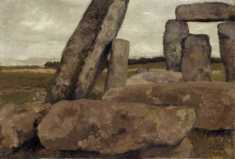

------------------------------------------------------------------------

[Sacred Time](index)  [Origins of World Religions](origtime)

------------------------------------------------------------------------

# Sacred Texts Timeline

This is a timeline which gives the history of sacred texts, as well as a
few other relevant events. Of course, not all of the dates in this
timeline are accurate; some are entirely conjectural. I have included a
few dates, events and documents which are or may be entirely fictional.
Links on this page are to resources at this site, not to external sites.
I welcome feedback about any errors of fact in this timeline.

For space reasons, I have used the [abbreviations](#abbr) listed at the
end of this file.

date

Judaism, Christianity, Islam, Zoroastrianism, Baha'i.

Hinduism, Buddhism, Jainism, Sikhism.

Confucianism, Taoism, Shinto.

Other

5000 BCE +

4004 (Sunday 23 October) Bishop Usshers' (1581-1656) date for [Biblical
creation of the world](../bib/kjv/gen) based on O.T. Chronology.
According to Ussher, Adam and Eve were driven from Paradise on Monday 10
November 4004 BC. Ussher was Archbishop of Armagh, Primate of All
Ireland, and Vice-Chancellor of Trinity College in Dublin \[chr\].

------------------------------------------------------------------------

According to John Lightfoot (1602-1675), Vice-Chancellor of Cambridge
University and a contemporary of Ussher, man was created on "October 23,
4004 B.C., at nine o'clock in the morning" \[chr\].

------------------------------------------------------------------------

4,320,000,000 Creation of Universe by Brahma (Modern Hindu). The
Rig-Veda has three hymns on the subject of Creation. See [Rig-Veda
10:cxxix](../hin/rigveda/rv10129), [Rig-Veda
10:cxxx](../hin/rigveda/rv10130), and [Rig-Veda
10:cxc](../hin/rigveda/rv10190). \[hin\].

 

14,000,000,000 [Big Bang](../bib/kjv/gen.htm#1:3).

------------------------------------------------------------------------

14,000,000,000 -300,000 yrs. after the Big Bang, protons and electrons
[separate](../bib/kjv/gen.htm#1:4).

------------------------------------------------------------------------

14,000,000,000 -? yrs. [The universe cools unevenly](cosmic.jpg)

------------------------------------------------------------------------

5,000,000,000: Sun forms.

------------------------------------------------------------------------

3,000,000,000 [Earth cools](../bib/kjv/gen.htm#1:9) and [life on
Earth](../dna/index) begins.

------------------------------------------------------------------------

70,000,000 Dinosaurs die out.

------------------------------------------------------------------------

2,000,000 Australopithecines emerge in Southern Africa.

------------------------------------------------------------------------

70,000 Ice age begins.

------------------------------------------------------------------------

55,000 First inhabitants of [Australia](../aus/index).

------------------------------------------------------------------------

15,000 [Paleolithic cave paintings](../nel/index).

------------------------------------------------------------------------

10,000 Paleo-Indians enter [America](../nam/index).

------------------------------------------------------------------------

9,500 Ice age ends, catastrophic worldwide sea level rise (100 meters?).
Black Sea floods, thought to be origin of [Ancient Near East Flood
story](../ane/gilgdelu).

------------------------------------------------------------------------

9500 [Plato's date for the sinking of Atlantis](../atl/index).

------------------------------------------------------------------------

8500-6300 Domestication of sheep, cattle, pigs and goats.

------------------------------------------------------------------------

6000+ Mother Goddess worshipped in Europe, Near East. \[wic\].

------------------------------------------------------------------------

5000 Beginning of agriculture in Near East.

------------------------------------------------------------------------

4000 (trad.) Overthrow of Matriarchy \[wic\].

4000 BCE

3760 start of Jewish year count.

3201 Beginning of Kali Yuga, the current (and most evil) age \[hin\].

o.c. [I Ching](../ich/index) \[cfu\].

3100 o.c. [Pyramid Texts](../egy/pyt/index) \[egy\].

3000 BCE

 

 

2953-2838 Chinese Emperor Fu Hsi, produced first w.v. of [I
Ching](../ich/index) \[cfu\].

------------------------------------------------------------------------

2300-1000 Period described in [Shu Ching (Book of
History)](../cfu/sbe03/index.htm#shu) \[cfu\].

2494-2345 Pyramid Texts \[egy\].

2000 BCE

2000-1900 [Abraham](../bib/kjv/gen.htm#12:1), b. in Ur, according to
[Bible](../bib/kjv/gen.htm#25:7) lived to age of 175.

------------------------------------------------------------------------

1500-1350 [Moses, trad. founder of Judaism; the Exodus from
Egypt.](../bib/kjv/exo)

------------------------------------------------------------------------

1500 Zoroaster/Zarathustra, o.c. [Gathas, Avesta](../zor/index) \[zor\].

------------------------------------------------------------------------

1491 (trad.) According to Bishop Ussher, [the date of the Biblical
flood](../bib/kjv/gen.htm#6:1). The Ark touched down on Mt. Ararat on 5
May 1491 BC (a Wednesday) \[chr\].

------------------------------------------------------------------------

1200 Origin of Judaism, o.c. of O.T., starting with [the
Torah](../bib/tan/index) (the first 5 books).

1750 Collapse of Indus Valley Civilization.

------------------------------------------------------------------------

1500 Indo-Europeans invade India. [Vedic](../hin/index.htm#vedas)
Culture. \[hin\].

------------------------------------------------------------------------

1550-1450 o.c. [Rig-Veda](../hin/rigveda/index), [Sama-Veda](../hin/sv)
and [Yajur-Veda](../hin/yv/index) \[hin\].

1143 w.v. of [I Ching](../ich/index) by King Wen and Duke of Chou.
\[cfu\]

1800 [Enuma Elish](../ane/enuma), Bablyonian Creation Myth. \[ane\]

------------------------------------------------------------------------

1792 Hammurabi ruler in Bablyon, auth. of [Code of
Hammurabi](../ane/hamurabi), earliest legal codex.

------------------------------------------------------------------------

1760 [Gilgamesh Epic](../ane/gilgdelu).\[ane\]

------------------------------------------------------------------------

1600 Orig. [Egyptian Book of the Dead](../egy/ebod/index). (Book of
Coming Forth by Day).

------------------------------------------------------------------------

1500 (ca.) Volcanic destruction of Thera, thought to be the origin of
[Atlantis story](../atl/index).

------------------------------------------------------------------------

1194 Fall of Troy (events described in
[Iliad/Odyssey](../cla/homer/index)).

------------------------------------------------------------------------

1100 (ca.) [Rise of Mayan culture](../nam/pvuheng).

1000 BCE

990-922 [King Solomon](../bib/kjv/kg1.htm#1:46).

------------------------------------------------------------------------

950 o.c. [Torah/Pentateuch](../bib/tan/index), [Song of
Songs](../bib/kjv/sol).

1000 o.c. [Atharva Veda](../hin/av) \[hin\].

1000-500 [Shih Ching (Book of Odes)](../cfu/sbe03/index.htm#shih)
\[cfu\].

 

800 BCE

740 O.T. Book of [Isaiah](../bib/kjv/isa).

800-700 [Brihad-Aranyaka and Chandogya Upanishads](../hin/upan/index)
\[hin\].

------------------------------------------------------------------------

800-400 Aranyakas, Brahmanas and [Upanishads](../hin/upan/index)
\[hin\].

 

800 or 700 [Homer (?): Illiad and Odyssey](../cla/homer/index).

------------------------------------------------------------------------

800: [Hesiod: Works and Days, Theogony](../cla/hesiod/index)

700 BCE

700 Books of [Deuteronomy](../bib/kjv/deu), [Joshua](../bib/kjv/jos),
[Samuel](../bib/kjv/sa1). (O.T.)

------------------------------------------------------------------------

628-551 [Zarathustra/Zoroaster](../zor/index)

------------------------------------------------------------------------

600 Babylonian Exile \[jud\]

700 o.c. [Ramayana](../hin/rama/index) \[hin\].

------------------------------------------------------------------------

600 w.v. [Rig Veda](../hin/rigveda/index) \[hin\]

650 o.c. [Tao te Ching](../tao/taote).

664-525 Rev. [Egyptian Book of the Dead](../egy/ebod/index)

------------------------------------------------------------------------

600 BCE

520 Books of [Zechariah](../bib/kjv/zac), [Isaiah](../bib/kjv/isa).
(O.T.)

599-527 (trad.) Mahavira, founder [Jainism](../jai/index).

------------------------------------------------------------------------

563-483 [Buddha](../bud/index) (b. April 8, 563 BCE).

------------------------------------------------------------------------

540 w.v. [Mahabharata](../hin/maha/index) \[hin\].

------------------------------------------------------------------------

540-468 (hist.) [Mahavira, founder Jainism](../jai/index).

------------------------------------------------------------------------

500 o.c. Angas \[jai\].

580-500 (trad.) [Lao-tzu, founder of Taoism](../tao/index).

551-479 [Confucius (K'ung tzu), founder of Confucianism](../cfu/index).

------------------------------------------------------------------------

520 (trad.) [Tao-te Ching](../tao/taote) \[tao\].

610-570 [Sappho](../cla/sappho/index).

500 BCE

w.v. [Gensis](../bib/kjv/gen), [Exodus](../bib/kjv/exo),
[Numbers](../bib/kjv/num). (O.T.)

 

480-390 (alt.) [Lao tzu](../tao/index).

------------------------------------------------------------------------

409 w.v. [Confucian Canon](../cfu/index.htm#cfucan).

 

400 BCE

Books of [Proverbs](../bib/kjv/pro), [Job](../bib/kjv/job) (O.T.)

------------------------------------------------------------------------

350 w.v. [Song of Songs](../bib/kjv/sol) (O.T.).

------------------------------------------------------------------------

330 Alexander destroys old [Avesta](../zor/index). \[zor\]

300 w.v. [Mahabharata](../hin/maha/index),
[Bhagavad-Gita](../hin/gita/index). \[hin\]

371-289 [Mencius (Meng-tzu)](../cfu/menc/index). \[cfu\]

------------------------------------------------------------------------

369-286 [Chuang-tzu](../tao/index). \[tao\]

------------------------------------------------------------------------

350 (hist.) [Tao-te Ching](../tao/taote). \[tao\].

------------------------------------------------------------------------

340 [Writings of Chuang-tzu](../tao/index). \[tao\]

360 [Critias by Plato](../atl/critias.txt): contains story of Atlantis.

300 BCE

[Book of Jonah](../bib/kjv/jon) (O.T.)

------------------------------------------------------------------------

285 [Septuagint](../bib/index), first Greek trans. of the O.T.

250 Abhidharma, part of the [Tripitaka](../bud/index). \[bud\]

------------------------------------------------------------------------

240 [Dhammapada](../bud/index) canonized by Asoka. \[bud\]

------------------------------------------------------------------------

200 w.v. [Atharva Veda](../hin/av). \[hin\]

250 w.v. [Tao te Ching](../tao/index). \[tao\]

------------------------------------------------------------------------

213 [Emperor Ch'in Shih burns books, including Confucian, Taoist texts
and the Five Classics](../cfu/index). \[cfu\]

 

200 BCE

200-120 early Mishnah \[jud\].

------------------------------------------------------------------------

164 Book of [Daniel](../bib/kjv/dan) (O.T.).

------------------------------------------------------------------------

160 O.T. [Apocrypha](../bib/apo/index): [Tobit](../bib/apo/tob), [1
Esdras](../bib/apo/es1), [Enoch](../chr/apo/enoch), others.

------------------------------------------------------------------------

150 Early Qumran (Dead Sea Scrolls).

150 [Yoga Sutras of Patanajali](../hin/yogasutr). \[hin\]

[I Ching](../ich/index) commentaries, Rev. [Chinese
Classics](../cfu/index.htm#fivecla). \[cfu\]

 

100 BCE

5-7 (ca.) [b. of Jesus](../bib/kjv/mat.htm#1:18), founder of
[Christianity](../chr/index).

[Ramayana of Valmiki](../hin/rama/index). \[hin\]

------------------------------------------------------------------------

Ceylonese Tipitaka \[bud\].

86 Rev. [Shu Ching (Book of History)](../cfu/sbe03/index.htm#shu), [Shih
Ching (Book of Odes)](../cfu/sbe03/index.htm#shih). \[cfu\]

47 First burning of the Library of Alexandria (by Romans). including
works of [Sappho](../cla/sappho/index), and possibly ancient manuscripts
and [maps from unknown Ice Age civilizations](../piri/index).

1 CE

1-33 (trad.) Jesus. Events described in the first four N.T. books.

------------------------------------------------------------------------

33 (trad.) either April 3, 30 CE or April 7, 33 CE: the
[Crucifixion](../bib/kjv/mat.htm#27:31).

------------------------------------------------------------------------

30-96 [New Testament](../bib/kjv/index).

------------------------------------------------------------------------

50-63 (N.T.) [Colossians](../bib/kjv/col), [Philemon](../bib/kjv/plm),
[Ephesians](../bib/kjv/eph), [Philippians](../bib/kjv/phi).

------------------------------------------------------------------------

60-80 (N.T.) [Acts of the Apostles](../bib/kjv/act).

------------------------------------------------------------------------

68 Destruction of Qumran community. (Dead Sea Scrolls).

------------------------------------------------------------------------

70 (N.T.) [Gospel of Mark](../bib/kjv/mar).

------------------------------------------------------------------------

80 (N.T.) [Gospel of Matthew](../bib/kjv/mat).

------------------------------------------------------------------------

80 (N.T.) [Gospel of Luke](../bib/kjv/luk).

------------------------------------------------------------------------

90 (N.T.) [Gospel of John](../bib/kjv/joh).

------------------------------------------------------------------------

81-96 o.c. [Revelation of St. John](../bib/kjv/rev).

[Diamond Sutra](../bud/sbe49/sbe4929), Heart Sutra. \[bud\]

------------------------------------------------------------------------

65 Entry of [Buddhism](../bud/index.htm#north) into China.

o.c. [Kojiki](../shi/kojiki), [Nihongi](../shi/index). \[shi\]

 

100 CE

o.c. Nag Hammadi Scriptures.

------------------------------------------------------------------------

100 Synod of Jamnia, Can. of O.T. \[chr\]

------------------------------------------------------------------------

150 N.T. [Apocrypha](../chr/apo/index). \[chr\]

------------------------------------------------------------------------

Mishna.\[jud\]

------------------------------------------------------------------------

o.c. Sepher ha Zohar \[jud\].

166 Buddhism formally established in China.

------------------------------------------------------------------------

[Lotus Sutra](../bud/lotus/index), [Buddha-Charita of
Ashvagosha](../bud/sbe49/index). \[bud\]

150 w.v. [Shu Ching (Book of History)](../cfu/sbe03/index.htm#shu).
[Shih Ching (Book of Odes)](../cfu/sbe03/index.htm#shih). \[cfu\]

 

200 CE

 

 

Can. of [Tao te Ching](../tao/taote). \[tao\]

Mayan Classical Phase (to 900 CE), o.c. [Popul Vuh](../nam/pvuheng).

300 CE

[Denkart](../zor/index) in Pahlavi.

------------------------------------------------------------------------

(to 14th Cent.) comp. of Midrash.

------------------------------------------------------------------------

300-400 w.v. Nag Hammadi Scriptures in Coptic.

------------------------------------------------------------------------

350 w.v. [Avesta](../zor/index) in Pahlavi.

------------------------------------------------------------------------

350 Jewish Talmund and Gemara.

------------------------------------------------------------------------

325 Council of Nicea, Can. of [Christian Bible](../bib/index).

(to 13th Cent.) Puranas \[hin\].

 

365-408 Burning of Sibylline Books.

------------------------------------------------------------------------

391 Second burning of library at Alexandria (by Christians).

400 CE

Babylonian Talmund \[jud\].

------------------------------------------------------------------------

401 [Confessions of St. Augustine](../chr/augconf). \[chr\]

------------------------------------------------------------------------

404 Cod. of the [Vulgate (Latin Bible)](../bib/vul/index).

w.v. Angas in Prakrit \[jai\].

------------------------------------------------------------------------

400-450 Cod. of the Abhidharma (Tripitaka) \[bud\].

 

 

500 CE.

550-950 [Bundahishn](../zor/index). \[zor\]

------------------------------------------------------------------------

570-632 [Muhammed, founder of Islam](../isl/index).

538-552 [Buddhism reaches Japan](../bud/rosa/index).

 

550 Last temple to Isis (at Phiae) closes.

------------------------------------------------------------------------

(to 7th Cent.) o.c. [Eddas](../neu/ice/index).

600 C.E.

610 w.v. [Qur'an](../isl/index). \[isl\]

------------------------------------------------------------------------

630 First [Hadith](../isl/index). \[isl\]

------------------------------------------------------------------------

644-656 Can. of [Qur'an](../isl/index). \[isl\]

 

 

(to 9th Cent.) o.c. Welsh [Mabinogion](../neu/celt/mab/index).

------------------------------------------------------------------------

642 Third (and final) destruction of Library of Alexandria (by Moslems).

700 C.E.

 

760 o.c of Bardo Thödol (Tibetean Book of the Dead). \[tib\]

712 w.v. [Kojiki](../shi/kojiki). \[shi\]

------------------------------------------------------------------------

720 w.v. [Nihongi](../shi/index). \[shi\]

------------------------------------------------------------------------

742 Can. of [Writings of Chuang-tzu](../tao/index).

 

800 C.E.

[Sepher Yetzirah](../jud/sephir) \[jud\].

------------------------------------------------------------------------

Can. of [Hadith](../isl/index) \[isl\].

------------------------------------------------------------------------

[Shikand Gumani Vazar](../zor/index) \[zor\].

868 [Diamond Sutra](../bud/sbe49/sbe4929) is first book printed in China
\[bud\].

 

w.v. [Poetic Edda](../neu/poe/index)

900 C.E.

[Bundahishn](../zor/index). \[zor\]

Agamas \[hin\].

------------------------------------------------------------------------

946 Start of Tibetan calendar, Kalachakra Tantra \[tib\].

927 [Yengiski](../shi/yengi) \[shi\].

950 (trad.) [Necronomicon](../nec/index) of Abdul Alhazred.

1000 C.E.

1054 Schism between East and West Church \[chr\].

1016-1100 Naropa \[tib\]

------------------------------------------------------------------------

1039-1123 Milarepa \[tib\]

 

 

1100 C.E.

 

1150 Kuo-an Shih yuan's [Ten Pictures of the Ox](../bud/mzb/oxherd).
\[bud\]

1175-1120 compilation of [Confucian Canon](../cfu/index.htm#cfucan) by
Chu Hsi.

1179-1241 Snorri Sturlson (auth. [Prose Edda](../neu/pre/index),
[Heimskringla](../neu/heim/index)).

1200 C.E.

1270-1300 w.v. of Sepher ha Zohar by Moses de Leon.

1222-1282 Nichiren \[bud\].

------------------------------------------------------------------------

1236 [Dogen, founds Soto School of Zen](../bud/rosa/index) \[bud\].

 

1220 [Prose Edda](../neu/pre/index).

1300 C.E.

1306-21 [Divine Comedy](../chr/dante/index) by Dante.

------------------------------------------------------------------------

1397-1468 Johannes Gutenberg. patron saint of

etexts.

 

 

o.c. [Key of Solomon](../pag/kos/index).

------------------------------------------------------------------------

1300-1325 w.v. White Book of Rhydderch
([Mabinogion](../neu/celt/mab/index)).

------------------------------------------------------------------------

1375-1425 Author of Red Book of Hergest
([Mabinongion](../neu/celt/mab/index)).

1400 C.E.

1456 First p.v. Vulgate [Bible](../bib/vul/index) by Gutenberg.

------------------------------------------------------------------------

1463 first Latin translation of [Corpus Hermeticum](../chr/herm/index).

------------------------------------------------------------------------

1483-1546 [Martin Luther](../chr/luther/index) chr. reformer.

1440-1518 Kabir, Isl. Mystic.

------------------------------------------------------------------------

1469-1538 Guru Nanak, founder of [Sikhism](../skh/index).

 

1486 [Malleus Malificarum](../pag/mm/index): textbook for witch-hunters.

1500 C.E.

1517 M. Luther's [95 Theses](../chr/the9510.txt).

------------------------------------------------------------------------

1522 [N.T.](../bib/index) Translated into German by M. Luther.

------------------------------------------------------------------------

1525 [N.T.](../bib/index) Translated into Englsh by W. Tyndale
(1494-1536).

------------------------------------------------------------------------

1534 p.v. entire [Bible](../bib/index) in German by M. Luther.

------------------------------------------------------------------------

1535 p.v. [Bible](../bib/index) in English by Miles Coverdale
(1488-1569).

------------------------------------------------------------------------

1546 O.T. [Apocrypha](../bib/apo/index) Can. by Catholic Church.

------------------------------------------------------------------------

1560 [Foxe's Book of Martyrs](../chr/martyrs/index) \[chr\].

1539 (5th) [Guru Arjan](../skh/index) \[skh\].

 

1503-1566 [Nostradamus](../nos/index).

------------------------------------------------------------------------

1554-1558 w.v. [Popul Vuh](../nam/pvuheng).

------------------------------------------------------------------------

1527-1608. [Calls of Enoch](../eso/enoch/callench), by J. Dee.

1600 C.E.

1618-9 [Synod of Dordrecht](../chr/syndort). \[chr\]

------------------------------------------------------------------------

1629 O.T. [Apocrypha](../bib/apo/index) removed from Protestant Bible.

------------------------------------------------------------------------

1674 [Westminster Shorter Catechism](../chr/westcat1).

------------------------------------------------------------------------

1677 [Paradise Lost/Regained](../chr/milton/index) by J. Milton.

------------------------------------------------------------------------

1678 [Pilgrim's Progress](../chr/bunyan/index) by J. Bunyan.

Janam Sakhis \[skh\].

------------------------------------------------------------------------

Final version of [Adi Granth](../skh/index) \[skh\]

 

1614 Rosicrucian [Fama Fraternitatis](../eso/fama).

1700 C.E

1789 [Episcopal Book of Common Prayer](../chr/bcp.txt).

------------------------------------------------------------------------

1793 Thomas Paine's [Age of Reason](../aor/paine/index).

[Mahanirvana Tantra](../tantra/maha/index) \[bud\].

------------------------------------------------------------------------

1708 death of last [Sikh guru](../skh/index).

 

1750 [Walam Olum](../nam/walam/walam).

1800 C.E

1805-1849 Joseph Smith, founder [Mormonism](../mor/index).

------------------------------------------------------------------------

1817-1892 Baha'u'llah, (Mirza Husayn-'Ali), founder
[Baha'i](../bhi/index), auth. [Kitab-i-Iqan](../bhi/iqa). \[bhi\]

------------------------------------------------------------------------

1819-1850 the [Bab](../bhi/index) (Mirza 'Ali-Muhammad) \[bhi\].

------------------------------------------------------------------------

1823 [Book of Mormon](../mor/index) tr. Joseph Smith.

------------------------------------------------------------------------

1859 Darwins' [Origin of Species](../aor/darwin/origin/index).

------------------------------------------------------------------------

1871 Darwins' [Descent of Man](../aor/darwin/descent/index).

------------------------------------------------------------------------

1891 [Baltimore Catechism](../chr/balt/index).

1879-1910 Publication of the [Sacred Books of the East](../sbe/index) by
Max Müller, 50 volumes of English translations of primary texts of
Eastern religions. \[hin\]\[bud\]\[zor\]\[cfu\]\[isl\]

1882 [Kojiki](../shi/kojiki) trans. into English by R.H.
Chamberlain.\[shi\]

------------------------------------------------------------------------

1896 The [Nihongi](../shi/index) trans. into English by W.G.
Ashton.\[shi\]

1802-1884 Elias Lönnrot (auth. [Kalevala](../neu/index.htm#finland)).

------------------------------------------------------------------------

1812-1820 English trans. of [Walam Olum](../nam/walam/walam).

------------------------------------------------------------------------

1835-1849 [Kalevala](../neu/index.htm#finland), national epic of
Finland, by Lönnrot.

------------------------------------------------------------------------

1880 [The Book of Oahspe](../oah/index).

------------------------------------------------------------------------

1882 [Atlantis, the Antediluvian World](../atl/ataw/index). by Donnelly.

------------------------------------------------------------------------

1885 p.v. [Walam Olum](../nam/walam/walam) (Brinton).

------------------------------------------------------------------------

1888 [The Secret Doctrine](../the/sd/index) by H.P. Blatavsky.

------------------------------------------------------------------------

1890-1922 [The Golden Bough](../pag/frazer/index) by Frazer.

------------------------------------------------------------------------

1899 [Aradia, Gospel of the Witches](../pag/aradia), by C. Leland.
\[wic\]

1900 CE.

1909 Darwins' [Voyage of the Beagle](../aor/darwin/beagle/index).

------------------------------------------------------------------------

1934 [Declaration of Barmen](../chr/barmen) by K. Barth condems Hitler
\[chr\].

------------------------------------------------------------------------

1945 Discovery of Nag Hammadi Scriptures.

------------------------------------------------------------------------

1947-56 Discovery of Qumran (Dead sea) scrolls.

------------------------------------------------------------------------

1992 Dead Sea Scrolls published on microfiche.

 

 

1921 [The Witch Cult in Western Europe](../pag/wcwe/index) by M. Murray.
\[wic\]

------------------------------------------------------------------------

1922 Last year books unambigiously entered public domain in U.S., per
the 'Digital Millenium' Copyright Act of 1998.

------------------------------------------------------------------------

1933 God of the Witches by M. Murray. \[wic\]

------------------------------------------------------------------------

1948 [The White Goddess](../pag/twg) by R. Graves. \[wic\]

------------------------------------------------------------------------

1949-61 Gardnerian [Book of Shadows](../pag/gbos/index) \[wic\].

------------------------------------------------------------------------

1968 [Principia Discordia](../eso/pridisc).

------------------------------------------------------------------------

1985 [TAZ](../eso/taz) by Hakim Bey.

------------------------------------------------------------------------

80s and early 90s: [Internet Book of Shadows](../bos/index).

------------------------------------------------------------------------

3/9/1999 After three years of research, [ith.oarc.science](../index)
goes live.

2000 CE.

???

???

???

???

### Key to Abbreviations

auth. = author.

b\. = born

ca. = circa

Can. = Canonicalization

Cent.= century.

Cod. = Codification

comp. = composition.

d\. = died

hist.= accepted historical date

o.c= date of original (typically, although not necessarily oral)
composition.

Orig. = original

O.T. = Old Testament.

p.v. = printed version

Rev. = Revised.

trad. = traditional date

trans. = translation

w.v. = written version

\[bhi\] Baha'i

\[bud\] Buddhism

\[tib\] Tibetan Buddhism

\[chr\] Christianity

\[cfu\] Confucianism

\[hin\] Hinduism

\[isl\] Islam

\[jai\] Jainism

\[jud\] Judaism

\[shi\] Shinto

\[skh\] Sikhism

\[tao\] Taoism

\[wic\] Wicca

\[zor\] Zoroastrianism

\[egy\] Egypt

\[ane\] Ancient Near East

------------------------------------------------------------------------

This page © copyright J.B. Hare, 1997-2001.

[Collection copyright](../sect103) © 1997-2001 J.B. Hare. HTML markup
Copyright © 1997-2001 J.B. Hare except where noted. All files at this
site named **index.htm** or **index.html** are Copyright © 1997-2001
J.B. Hare except where noted. All graphics Copyright © 1997-2001 J.B.
Hare, all rights reserved (except where noted).
