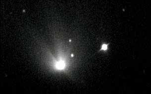
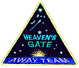

 

|                                                 |
|-------------------------------------------------|
|  [UFOs](../index)  |

------------------------------------------------------------------------

<table width="75%" data-background="tile.jpg">
<colgroup>
<col style="width: 50%" />
<col style="width: 50%" />
</colgroup>
<tbody>
<tr class="odd">
<td data-valign="center" width="50%"> 

Heaven's Gate Website Logo 
(Click to enlarge)</td>
<td data-valign="center" width="50%"><h1 id="heavens-gate-texts">HEAVEN'S GATE TEXTS</h1></td>
</tr>
</tbody>
</table>

 

[Jump to texts](#texts)

------------------------------------------------------------------------

  
 Heaven's Gate leader 'Do' 

On March 22, 1997, almost the entire body of adherents to Heaven's Gate
committed near-simultaneous suicide. They died in their mansion in a
California suburb outside of San Diego by voluntarily ingesting large
amounts of painkillers in applesauce. The last two left suffocated
themselves. Heaven's Gate left behind 39 corpses and extensive
documentation as to their beliefs--that they were disembodied
extraterrestrials waiting for a mothership to take them home and the
planet Earth was about to be 'recycled'. Their practices included
communal living, taking new names ending in 'ody', and mortification of
the body (particularly abstention from sex and intoxicants, close
cropped hair, unisex outfits and male castration).

  
 Hale Bopp 'UFO' photo  
(click to enlarge) 

Why did this small and 'mostly harmless' group end up becoming one of
the most famous mass suicides in US history? They had a history of
millennial predictions (it *was* the late 90s, after all) and media
stunts. Like many inward-facing spiritual groups, they lived simple
lives in an authoritarian commune. On multiple occasions, their leader
'Do' had predicted that they would be picked up by a UFO, and each time
they had been disappointed. When a photo of comet Hale-Bopp with some
background stars was interpreted by the UFO underground as having an
accompanying spaceship in it, this opportunity seemed too good to miss
by the Heaven's Gate adherents.

  
 'Mission Patch' 

This group is worth studying, if only because it is one of those rare
opportunities to view the evolution of a belief system before it had a
chance to start revising its own early history. We have a large volume
of unedited documents from the earliest to the final days of Heaven's
Gate, transcribed by the group's adherents in electronic form. They
never got to the difficult stage that most religions go through when
faced with having to sort out (and edit) their early texts. Of course,
this is due to the fact that the group didn't believe in procreation and
ended up self-destructing in a spectacular fashion.

Why include this material at this site? We certainly don't condone their
tragic mass suicide. It is painful to watch these people, all of whom
had families and potential futures, talk themselves into believing that
it was completely rational to commit suicide. Of course, this is not the
first time this has happened in the name of religion; for instance, the
founder of Jainism starved himself to death. However, while this site's
'prime directive' is religious tolerance, we *also* believe in people
making informed choices when it comes to matters of belief. It is worth
noting that there are many similar groups out there, and perhaps looking
at this particular example may help keep someone else from stepping into
the void.

 *Note on copyrights.* These materials, in
particular the Anthology, are covered by copyrights. By [explicit
release](book/02), they are available for unaltered, non-commercial
reproduction. How to obtain commercial clearance for these texts is
unknown and sacred-texts can't assist in this. 

------------------------------------------------------------------------

### Anthology

[How and When "Heaven's Gate" May Be Entered](book/book)  
 This is an anthology of all of the group's
official writings, reproduced without alteration. 

### Older Classroom Materials

[Anonymous Sexaholics Celibate Church Statement of
Beliefs](txt/asccsobeliefs.txt)  
[Anonymous Sexaholics Celibate Church Introduction and
Ways](txt/asccintro.txt)  
[Prospective Candidate Letter](txt/proscanidate.txt)  
[Preparing For Service](txt/preparfservice.txt)  
[Ruffles "Snacks for Thinkers"](txt/ruffles.txt)  

### Newsgroups Postings

[A time to die for God?](txt/newsdieforgod.txt)  
["Thanks for Actions Against CAN"](txt/newsthanksaction.txt)  
[The Jews and Christians Promote
Lies-Unknowingly](txt/newsjewschristians.txt)  

### Misc. Documents

["During a brief window of time, some may wish to follow
us."](txt/briefwindow.txt)  
[What if they're right?](txt/rkkodystatement.txt)  

### Transcripts

[Last Chance to Evacuate Earth Before It's Recycled](txt/vt092996.txt)  
[Planet About To Be Recycled - Your Only Chance To Survive - Leave With
Us](txt/vt100596.txt)  
