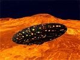

  
[Intangible Textual Heritage](../../index)  [UFOs](../index) 
[Index](index)  [Previous](idtc05)  [Next](idtc07) 

------------------------------------------------------------------------

  
*In Days To Come*, by Ashtar (Ethel P. Hill), \[1957\], at Intangible
Textual Heritage

------------------------------------------------------------------------

p. 32

### CHAPTER IV.

My message concerns a number of erroneous claims being made by those who
crave personal publicity. Any one who may attempt to invest us with
powers of divination and announce themselves the recipients of
information pertaining to the private affairs of individuals (unless
they apply specifically to serious national or international matters)
are guilty of falsification. Only insofar as they affect our plans
(which must of necessity depend to a considerable extent on the
understanding and cooperation of dwellers on your planet) will we pay
any attention to your own purely personal problems by prying into the
future for answers to your queries.

Our interest lies in two directions: Providing the facilities (unknown
to your inhabitants) to prevent a wanton waste of life through the
reckless employment of inconceivably powerful forces for destructive
purposes . . . forces intended for constructive and creative purposes
*only!* And, with our better comprehension of the principles involved
both in producing and directing such intensive energies, to transmit (at
the appointed time) to those proven trustworthy, the knowledge of a
practical nature which we possess

p. 33

in regard to these forces. At present, anything we might add to the sum
total of earthly achievement along scientific lines, would naturally be
directed to warlike operations. We must *first* assist in the abolition
of existing agencies bent on world domination BY FORCE! A planet
populated by fear-driven slaves in the power of a mere handful of
tyrannical (May I inquire what is the polite synonym for "bullies")
rulers, would not even interest us!

Having held numerous consultations with the honorable gentlemen
responsible for the founding of this country, our indignation has been
aroused by the manner in which their noble visions of Freedom, Industry
and Progress have lost the luster of their original inspiration and
deteriorated into a dingy counterfeit of the original heroic model held
before the eyes of the people. At that time much assistance of an
amazing type was given at crucial moments. Inspiration and the courage
and determination to follow these magnificent ideals, called forth
overwhelming response from Watchers in Unseen Realms. Had they not been
carrying forward God's Plan, depending on His guidance and His help, no
such country as America would now exist!

I confine my remarks to this land for the obvious reason that it is here
that a stand must be taken to rescue this precious and priceless IDEAL
from extinction! Should this country succumb to the pressures

p. 34

now being brought to bear to submerge it in a World-wide flood of
ANTI-GOD villainy, where might FREEDOM find a lodging place?

The combined forces of Space Men (assigned to canvass the entire global
situation and submit a workable plan for the rescue of those being
rapidly drawn into a tightening net of infamy) are united in what we
believe to be the only means of handling this grave problem. Naturally,
we do not propose to confine our efforts to this country, by any means.
There are others in far greater need of immediate aid, being in many
places, suffering hideous injustice and cruelty.

Before going further, I wish to make it crystal clear that we work at
all times under the direct supervision of your future Ruler, the Christ.

NOW—What we ask you to do is to lend credence to our "reality" and our
entirely *impersonal* desire to be of service! The sooner these two
facts are accepted by people generally, the more quickly and easily
shall we be able to achieve our goal and the fewer lives will be lost in
the process. We are admonished to save *every soul* who will gladly
adapt to the glorious transformation scheduled for the NEW AGE! Some may
be removed from your planet to help for a time from planes invisible, as
many thousands are now doing. I am referring to

p. 35

great many arrivals on the astral planes and a great many others, dating
back to your beloved Washington, the immortal Lincoln and other men of
their caliber.

We are submitting our plans to the HIGHEST COURT OF HEAVEN for approval
and we look forward with confidence to your whole-hearted cooperation!

My Love! *A S H T A R*.

------------------------------------------------------------------------

[Next: Chapter V](idtc07)
