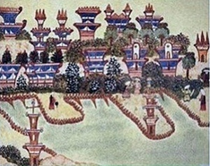

  
[Intangible Textual Heritage](../../index)  [UFOs](../index) 
[Mars](../mars/index) 

------------------------------------------------------------------------

[Buy this Book at
Amazon.com](https://www.amazon.com/exec/obidos/ASIN/0691001014/internetsacredte)

------------------------------------------------------------------------

<table width="75%">
<colgroup>
<col style="width: 50%" />
<col style="width: 50%" />
</colgroup>
<tbody>
<tr class="odd">
<td width="50%" data-valign="TOP"></td>
<td width="50%" data-valign="CENTER"><h1 id="from-india-to-the-planet-mars" data-align="CENTER">From India to the Planet Mars</h1>
<h2 id="by-théodore-flournoy-tr.-daniel-b.-vermilye" data-align="CENTER">by Théodore Flournoy; tr. Daniel B. Vermilye</h2>
<h4 id="section" data-align="CENTER">[1900]</h4></td>
</tr>
</tbody>
</table>

------------------------------------------------------------------------

[Contents](#contents)    [Start Reading](ipm00)    [Page
Index](pageidx)    [Text \[Zipped\]](ipmtxt.zip)

------------------------------------------------------------------------

|                                                                                                                           |
|---------------------------------------------------------------------------------------------------------------------------|
|  |

This is a skeptical inquiry into a remarkable 19th century French
medium, here called Hélène Smith. Her actual name was Catherine-Elise
Muller (b. 1861 d. 1929). She popularized the concept of automatic
writing, which earned her admiration from the latter-day Surrealists.
And her interplanetary psychic visions are extremely similar to
contactee accounts from the 1950s and 1960s.

Hélène, at the hands of her bossy and controlling sprit guide 'Leopold,'
visited remote times and places, particularly 15th century India (where
she was a doomed princess), and 18th century France (where she was Marie
Antoinette), and of greatest interest, Mars. This book documents the
Martian language and writing, includes hand-drawn illustrations of
scenes, and mysterious vignettes of life on another planet. Included are
over forty short texts in 'Martian,' with translations in French
(interlinear) and English.

Flournoy's book brought Hélène fame, and the book is still in print over
a hundred years later. However, she was not appreciative of his critical
approach, and refused to work with him any further after the book was
published.

------------------------------------------------------------------------

 [Title Page](ipm00)  
[Contents](ipm01)  
[Translator's Preface](ipm02)  
[Chapter I. Introduction](ipm03)  
[Chapter II. Childhood and Youth of Mlle. Smith](ipm04)  
[Chapter III. Mlle. Smith Since Her Initiation Into Spiritism](ipm05)  
[Chapter IV. The Personality of Leopold](ipm06)  
[Chapter V. The Martian Cycle](ipm07)  
[Chapter VI. The Martian Cycle (Continued)—The Martian
Language](ipm08)  
[Chapter VII. The Martian Cycle (Concluded).—The Ultra-Martian](ipm09)  
[Chapter VIII. The Hindoo Cycle](ipm10)  
[Chapter IX. The Royal Cycle](ipm11)  
[Chapter X. Supernormal Appearances](ipm12)  
[Chapter XI. Conclusion](ipm13)  
