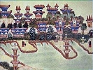

  
[Intangible Textual Heritage](../../index)  [UFOs](../index) 
[Mars](../mars/index)  [Index](index)  [Previous](ipm02)  [Next](ipm04) 

------------------------------------------------------------------------

[Buy this Book at
Amazon.com](https://www.amazon.com/exec/obidos/ASIN/0691001014/internetsacredte)

------------------------------------------------------------------------

  
*From India to the Planet Mars*, by Théodore Flournoy; tr. Daniel B.
Vermilye, \[1900\], at Intangible Textual Heritage

------------------------------------------------------------------------

p. 1

# FROM INDIA TO THE PLANET MARS

### CHAPTER I

#### INTRODUCTION

IN the month of December, 1894, I was invited by M. Aug. Lemaître,
Professor of the College of Geneva, to attend some seances of a
non-professional medium, receiving no compensation for her services, and
of whose extraordinary gifts and apparently supernormal faculties I had
frequently heard.

Having gladly accepted the invitation of my worthy colleague, I found
the medium in question, whom I shall call Mlle. Hélène Smith, to be a
beautiful woman about thirty years of age, tall, vigorous, of a fresh,
healthy complexion, with hair and eyes almost black, of an open and
intelligent countenance, which at once invoked sympathy. She evinced
nothing of the emaciated or tragic aspect which one habitually ascribes
to the sibyls of tradition, but wore an air of health, of physical and
mental

p. 2

vigor, very pleasant to behold, and which, by-the-way, is not often
encountered in those who are good mediums.

The number of those invited to take part in the seance being complete,
we seated ourselves in a circle, with our hands resting upon the
traditional round table of spiritistic circles. Mlle. Smith—who
possesses a triple mediumship: visual, auditive, and typtological [\*](#fn_0)—began, in the most natural manner, to
describe the various apparitions which passed before her eyes in the
partially darkened room. Suddenly she stops and listens; she hears a
name spoken in her ear, which she repeats to us with astonishment; then
brief sentences, the words of which are spelled out by raps on the
table, explain the meaning of the vision. Speaking for myself alone
(there were three of us to divide the honor of the seance), I was
greatly surprised to recognize in scenes which passed before my eyes
events which had transpired in my own family prior to my birth. Whence
could the medium, whom I had never met before, have derived the
knowledge of events belonging to a remote past, of a private nature, and
utterly unknown to any living person?

The astounding powers of Mrs. Piper, the famous Boston medium, whose
wonderful intuition reads the latent memories of her visitors like an
open book, recurred to my mind, and I went out from that seance with
renewed hope of finding myself some day face to face with the
"supernormal"—a true and genuine

p. 3

supernormal—telepathy, clairvoyance, spiritistic manifestations, it
matters not by what name it be called, provided only that it be wholly
out of the ordinary, and that it succeed in utterly demolishing the
entire framework of established present-day science.

I was able at this time to obtain general information only concerning
the past of Mlle. Smith, but it was all of a character favorable to her,
and has since been fully confirmed.

Of modest bearing and an irreproachable moral character, she has for
years earned an honorable living as an employée of a commercial house,
in which her industry, her perseverance, and her high character have
combined to secure her a very responsible and important position.

Some three years prior to the date of my introduction to her she had
been initiated into a spiritistic group, where her remarkable psychic
powers almost immediately manifested themselves; and she then became a
member of various other spiritistic circles. From its commencement her
mediumship manifested the complex type to which I have already alluded,
and from which it has never deviated. Visions in a waking state,
accompanied by typtological dictation and auditive hallucinations,
alternately appeared. From the point of view of their content these
messages had generally a bearing on past events usually unknown to the
persons present, but which were always verified by referring to
biographical dictionaries or to the traditions of the families
interested. To these phenomena of retrocognition

p. 4

or of hypermnesia were joined occasionally, according to the
environment, moral exhortations, communicated through the table, more
frequently in poetry than in prose, addressed to the sitters; medical
consultations, accompanied by prescriptions generally appropriate;
communications from parents or friends recently deceased; or, finally,
revelations as piquant as they were unverifiable concerning the
*antériorités* (that is, the previous existences) of the sitters, almost
all of whom, being profound believers in spiritism, would not have been
at all surprised to learn that they were the reincarnations respectively
of Coligny, of Vergniaud, of the Princess Lamballe, or of other notable
personages. It is necessary, finally, to add that all these messages
seemed to be more or less bound up with the mysterious presence of a
"spirit" answering to the name of Leopold, who assumed to be the guide
and protector of the medium.

I at once undertook to improve my acquaintance with Hélène Smith. She
freely consented to give seances for my benefit, alternating with a
series which she was giving M. Lemaître, and another for the benefit of
Prof. Cuendet, vice-president of the Geneva Society (spiritistic) for
Psychic Studies, all of which I was permitted to attend. In this way I
have been able to be present at the greater part of Hélène's seances
during the past five years. The personal observations that I have thus
been able to make, reinforced by notes on sittings which I was unable to
attend, kindly furnished me by MM. Lemaître and Cuendet, form the basis
of the study

p. 5

which follows; to which must be added, however, certain letters of Mlle.
Smith, as well as the numerous and very interesting conversations I have
held with her either immediately preceding or following her seances, or
at her home, where I also have had the advantage of being able to talk
with her mother. Finally, various documents and accessory information,
which will be cited in their respective time and place, have also been
of assistance in enabling me partially to elucidate certain obscure
points. Notwithstanding all these sources of information, however, I am
still very far from being able to disentangle and satisfactory explain
the complex phenomena which constitute Hélène's mediumship.

Dating from the period at which I made the acquaintance of Mlle. Smith
(*i.e.*, from the winter of 1894-95), while most of her spiritistic
communications have continued to present he same character as to form
and content as before, a double and very important modification in her
mediumship has been observed.

1\. As to their psychological form.—While up to that time Hélène had
experienced partial and limited automatisms only—visual, auditive,
typtomotor hallucinations—compatible with the preservation to a certain
extent of the waking state, and not involving noticeable loss of memory,
from that time and with increasing frequency she has been subject to an
entire loss of consciousness and a failure to retain, on returning to
her normal state, any recollection of what has transpired during the
seance. In physiological terms, the hemisomnambulism without amnesia,

p. 6

which had been her stopping-point up to that time, and which the sitters
mistook for the ordinary waking state, was now transformed into total
somnambulism with consecutive amnesia.

In spiritistic parlance, Mlle. Smith now became completely entranced,
and having formerly been an ordinary visual and auditive medium, she now
advanced to the higher plane of an "incarnating medium."

I fear that this change must in a great measure be attributed to my
influence, since it followed almost immediately upon my introduction to
Hélène's seances. Or, even if the total somnambulism would have
inevitably been eventually developed by virtue of an organic
predisposition and of a tendency favorable to hypnoid states, it is
nevertheless probable that I aided in hastening its appearance by my
presence as well as by a few experiments which I permitted myself to
make upon Hélène.

As is well known, mediums are usually surrounded by a halo of
veneration, which prevents any one from touching them during their
trances The idea would never occur to any ordinary frequenter of
spiritistic circles to endeavor to ascertain the condition of the
medium's sensory and motor functions by feeling her hands, pinching the
flesh, or pricking the skin with a pin. Silence and immobility are the
strict rule, in order not to hinder the spontaneous production of the
phenomena, and a few questions or brief observations on the receipt of a
message is all that is permissible by way of conversation, and no one
therefore would, under ordinary circumstances, dare

p. 7

to attempt any manipulation of the medium Mlle. Smith had always been
surrounded by this respectful consideration, and during the first three
seances I conformed myself strictly to the passive and purely
contemplative attitude of the other sitters. But at the fourth sitting
my discretion vanished. I could not resist a strong desire to ascertain
the physiological condition of the charming seeress, and I made some
vigorous elementary experiments upon her hands, which lay temptingly
spread out opposite me on the table. These experiments, which I renewed
and followed up at the succeeding seance (February 3, 1895),
demonstrated that there is present in Mlle. Smith, *during her visions*,
a large and varied assortment of sensory and motor disturbances which
had hitherto escaped the notice of the sitters, and which are thoroughly
identical with those that may be observed in cases of hysteria (where
they are more permanent), and those that may be momentarily produced in
hypnotic subjects by suggestion. This was not at all astonishing, and
was to have been expected. But one consequence, which I had not
foreseen, did occur when, four days after my second experimental seance,
Mlle. Smith fell completely asleep for the first time at a sitting with
M. Cuendet (February 7th), at which I was not present. The sitters were
somewhat frightened, and, in trying to awaken her, discovered the
rigidity of her arms, which were considerably contractured. Leopold
however, communicating by means of the table upon which she was leaning,
fully reassured them, and gave them to understand that such sleep was
not at

p. 8

all prejudicial to the medium. After assuming various attitudes and
indulging in some amusing mimicry, Mlle. Smith awoke in excellent
spirits, retaining as a last recollection of her dream that of a kiss
which Leopold had imprinted upon her forehead.

From that day on somnambulisms were the rule with Hélène, and the
seances at which she did not fall completely asleep for at least a few
moments formed rare exceptions to the course of events during the next
four years. It is a great deprivation for Mlle. Smith that these
slumbers ordinarily leave her no memory upon her awakening of what has
transpired in her trance, and she longs for the seances of former times
when the visions unfolded themselves before her eyes, furnishing her
with a pleasing spectacle which was always unexpected, and which,
continually being renewed, caused the seances to be to her a source of
great delight. For the sitters, on the other hand, these scenes of
somnambulism and incarnation, together with the various physiological
phenomena of catalepsy, lethargy, contractures, etc., which accompanied
them, added great variety and additional interest to Hélène Smith's
remarkable and instructive triple mediumship.

The greater sometimes implies the less: simultaneously with the access
of complete somnambulism came new forms and innumerable shades of
hemisomnambulism. The triple form of automatism which distinguished the
first years of Mlle. Smith's spiritistic experiences has been
wonderfully developed since 1895, and it would now be difficult to name
any principal forms of psychic mediumship of which

p. 9

she has not furnished curious specimens. I shall have occasion to cite
several of them in the course of this work. Hélène constitutes the most
remarkable medium I have ever met, and very nearly approaches the ideal
of what might be called the polymorphous, or multiform, medium, in
contradistinction to the uniform mediums, whose faculties only concern
themselves with one kind of automatism.

2\. A modification analogous to that which took place in the psychologic
form of the messages consisting of a marked improvement in their depth
and importance, was noticeable simultaneously in their content.

Alongside of the unimportant communications, complete at one sitting and
independent one of another, which filled up a large part of each of
Hélène's seances and in no wise differentiated her faculties from those
of the majority of mediums, she manifested from the beginning a marked
tendency. to a superior systematization and a more lofty chain of
visions; communications were often continued through several seances,
and reached their conclusion only at the end of several weeks. But from
the period at which I made the acquaintance of Mlle. Smith this tendency
towards unity began to assert itself still more strongly. Several long
somnambulistic dreams began to appear and to develop, the events of
which continued to be unfolded through months, even years, and indeed
still continue; a species of romance of the subliminal imagination
analogous to those "continued stories" which so many of our race tell
themselves in their moments of *far niente*, or at times when their
routine

p. 10

occupations offer only slight obstacles to day-dreaming, and of which
they themselves are generally the heroes.

Mlle. Smith has no fewer than three distinct somnambulistic romances,
and if to these is added the existence of that secondary personality to
which I have already alluded, and which reveals itself under the name of
Leopold, we find ourselves in the presence of four subconscious
creations of vast extent, which have been evolved on parallel lines for
several years, and which manifest themselves in irregular alternation
during the course of different seances, or often even in the same
seance.

All of these have undoubtedly a common origin in Hélène's subliminal
consciousness; but in practice, at least, and to all appearance, these
imaginative constructions present a relative independence and a
diversity of content sufficiently great to render it necessary to study
them separately. I shall confine myself at present to a general view of
them.

Two of these romances are connected with the spiritistic idea of
previous existences. It has, indeed, been revealed that Hélène Smith has
already lived twice before on this globe. Five hundred years ago she was
the daughter of an Arab sheik, and became, under the name of Simandini,
the favorite wife of a Hindoo prince named Sivrouka Nayaka, who reigned
over Kanara, and built in the year 1401 the fortress of Tchandraguiri.
In the last century she reappeared in the person of the illustrious and
unfortunate Marie Antoinette. Again reincarnated, as a punishment for
her sins and the perfecting of her character, in

p. 11

the humble circumstances of Hélène Smith, she in certain somnambulistic
states recovers the memory of her glorious avatars of old, and becomes
again for the moment Hindoo princess or queen of France.

I will designate under the names of "Hindoo" or "Oriental" cycle and
"Royal" cycle the whole of the automatic manifestations relative to
these two previous existences. I shall call the third romance the "
Martian" cycle, in which Mlle. Smith, by virtue of the mediumistic
faculties, which are the appanage and the consolation of her present
life, has been able to enter into relation with the people and affairs
of the planet Mars, and to unveil their mysteries to us. It is in this
astronomical somnambulism that the phenomenon of glossolalia, [\*](#fn_1) appears, which consists of the fabrication
and the use of an unknown language, and which is one of the principal
objects of this study; we shall see, however, that analogous facts are
likewise presented in the Hindoo cycle.

The personality of Leopold maintains very complex relations with the
preceding creations. On the one hand, it is very closely connected with
the Royal cycle, owing to the fact that the name of Leopold is only a
pseudonym under which is concealed the illustrious Cagliostro, who, it
appears, was madly infatuated with Queen Marie Antoinette, and who now,
discarnate and floating in space, has constituted himself the guardian
angel in some respects of Mile. Smith, in whom after a long search he
has again

p. 12

found the august object of his unhappy passion of a century ago.

On the other hand, this rôle of protector and spiritual guide which he
assumes towards Hélène confers upon him a privileged place in her
somnambulisms. He is more or less mixed up in the greater part of them;
assists at them, watches over them, and perhaps in a measure directs
them. He also occasionally appears in the midst of a Hindoo or a Martian
scene, delivering his message by certain characteristic movements of the
hand.

To sum up: sometimes revealing himself by raps upon the table, the taps
of a finger, or by automatic writing; sometimes incarnating himself
completely and speaking by the mouth of Mlle. Smith while
entranced—Leopold fulfils in these seances the multiple and varied
functions of spirit-guide, giving good advice relative to the manner of
acting towards the medium; of stage-manager hidden behind the scenes
watching the performance and ready at any time to intervene; of
benevolently disposed interpreter willing to furnish explanations of all
that is obscure; of censor of morals sharply reprimanding the sitters
when he deems it necessary; of sympathetic physician prompt at diagnosis
and well versed in the pharmacopoeia, etc. He also appears under his own
name of Cagliostro to the somnambulistic gaze of the resuscitated Marie
Antoinette and answers her questions by means of auditive
hallucinations. Nor is this all: to make our summary complete, it is
necessary also to investigate the personal connection of Mlle. Smith
with her invisible protector. She

p. 13

often invokes and questions Leopold at her own convenience, and while he
remains sometimes for weeks without giving any sign of life, he at other
times readily responds to her by means of voices or visions which
surprise her while fully awake in the course of her daily duties, and in
which he lavishes upon her in turn material or moral advice, useful
information, or the encouragement and consolation of which she has need.

Although I have accused myself of perhaps having had much to do with the
transformation of Hélène's hemisomnambulism into complete trances, I
believe myself, however, altogether innocent of the origin, and
therefore of the subsequent development, of the great subliminal
creations of which I have spoken. The first, that of Leopold, is of very
early date, even going back probably, as we shall see, prior to Mlle.
Smith's initiation into spiritism. As to the three cycles, they did not,
it is true, commence to display their full amplitude until after I had
made Hélène's acquaintance; and since they start from the time when she
first became subject to veritable trances, it would seem as though that
supreme form of automatism is the only one capable of allowing the full
expansion of productions so complex, and the only psychological
*container* appropriate and adequate to such a *content*. But the first
appearance of all three was clearly prior to my presence at the seances.
The Hindoo dream, where I shall be found playing a rôle which I did not
seek, evidently began (October 16, 1894) eight weeks before my admission
to Mlle. Smith's seances. The Martian romance, which dates

p. 14

from the same period, is closely connected, as I shall also show, with
an involuntary suggestion of M. Lemaître, who made the acquaintance of
Hélène in the spring of 1894, nine months before my introduction to her.
The Royal cycle, finally, had been roughly outlined at seances held at
the home of M. Cuendet, in December, 1893. Nevertheless, I repeat, only
since 1895 have the exuberant growth and magnificent flowering of that
subliminal vegetation taken place under the stimulating and provocative
influence, albeit wholly unintentional and altogether unsuspected at the
time, of the varied environments of Mlle. Smith's seances.

As far as the indiscreet revelations in regard to my own family, which
so much astonished me at my first meeting with Mlle. Smith, are
concerned, as well as the innumerable extraordinary facts of the same
kind with which her mediumship abounds, and to which she owes her
immense reputation in spiritistic circles, it will suffice to return in
the closing chapters of this book.

------------------------------------------------------------------------

### Footnotes

[2:\*](ipm03.htm#fr_0) *I.e.*, Spirit-rapping—the
faculty of obtaining responses by means of raps upon a table.

[11:\*](ipm03.htm#fr_1) Glossolalia signifies the
"gift of tongues," or the ability to speak foreign languages without
having consciously acquired them.

------------------------------------------------------------------------

[Next: Chapter II. Childhood and Youth of Mlle. Smith](ipm04)
