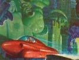

  
[Intangible Textual Heritage](../../index)  [UFOs](../index) 
[Index](index)  [Previous](irl13)  [Next](irl15) 

------------------------------------------------------------------------

[Buy this Book at
Amazon.com](https://www.amazon.com/exec/obidos/ASIN/0932813631/internetsacredte)

------------------------------------------------------------------------

  
*I Remember Lemuria*, by Richard S. Shaver, \[1948\], at Intangible
Textual Heritage

------------------------------------------------------------------------

p. 116

### CHAPTER II

#### Whence Came Sathanas?

This Arch-Angle, Sathanas, is not of the race of Nor. Being of Earth
myself, it pains me to say that his ancestors first breathed the then
untainted air of the third planet. Sathanas sprang from a vari-form
family, originating among the Angles of Earth, which we call Mu. The
Angles had originally been a blond, blue-eyed family of normal-appearing
Earthmen. Then, some time in the past, Sathanas’ bloodline had been
crossed with some dark, hairy, cloven-hooved race of space. Long before
the migration which emptied most of the Sun's planets of intelligent
life, his family had taken over a dark planet—by name, Satana—on the
outer rims of the Nor Empire. In time, their ability had won them the
administration of the affairs of the planet from the Rulers of Nor. And,
from that one planet, eventually, they were given the Rulership of all
the little planets in the small system of which Satana was the dominant
world. The "Angles" and their leaders were variously designated—a
separate political group under their "Monitor Angles—Arch-Angles—and
their supreme head, their Ruler and representative in the God Council on
Nor—Elder Angle Fontal.

There were some dozen of the Arch-Angles with some dozen small planets
in their administration. One of these was the Arch-Angle Sathanas, Ruler
of the Home planet of the Angles in their group, the planet Satana.
Being the first planet that the family had settled on after they left
Mu, they had, in accordance with the customs of the God-Race,

p. 117

taken the name of the planet that they ruled as their family name. The
rest of these planets were colonized with Angles from the cities of
Earth . . . a numerous, systemwide clan.

Sathanas’ family had been well liked for a long time . . . and being
just and wise rulers, they, as well as the peoples under them,
prospered. And so, Sathanas had the best education that Nor could
provide.

As I remember Sathanas, he was a fellow of some fifty feet in height,
dark visaged, with the horns that indicated a crossing of the blood line
with that of some Titans (which wasn't uncommon in ancient Mu) . I had
seen him first at a council meeting some centuries ago, when I first
acquired the status of a Ruler by my acquisition of the tiny planet of
Callay. It was after concluding most of the formal ceremony incidental
to the investiture of several new rulers that someone first introduced
us.

I can still picture the scene as he first greeted me with the accepted
ceremony of Nor's tradition. A score of usLemurians, Titans, Atlans,
variforms and a few from planets I'd never heard of—had found the favor
of the Elders of the Council of Nor and were being made rulers of
certain planets of the Nor Empire. Not big, important planets, true . .
. but still, we were all pleased that we should be so honored by the
Elders. Not all became rulers as they grew older and bigger—even of
small planets and planetoids.

Finally, the long ceremonies of creating a new ruler of a provincial
planet were over and we could relax for a brief time before the
festivities began in celebration of the event. Several of us newly
invested rulers had gathered together slightly apart from the tremendous
bulk of swarming Elders—gathered in a laughing, harmlessly excited
little circle. We kept congratulating one another and with mock
solemnity addressed each other with all the titles we'd ever heard and
remembered. That was one of the best moments

p. 118

of my life. I recall that I laughed, and raising my right arm in a
formal Nortan salute, had addressed a great golden-haired Titan, though
he was one of us, addressed him with as solemn a look and as impressive
voice as I could manage.

"O Mighty Zeus, Grand Lord of the Thirtieth Tender Fleet, Conqueror of
Limitless Cow Pastures, Ruler of the Lately Discovered World of Olympia,
Greetings! Grant . . . "

"My Lords!" At the strange sound of someone addressing us so, we turned
startled and looked up into the smiling understanding eyes of one of the
Elders of Nor—one of the younger ones. He couldn't have been more than a
few centuries older than we. For a moment we didn't know what to say,
but the Elder continued before we became embarrassed.

"My Lords, may I present the Lord Sathanas, Arch-Angle and Ruler of the
Planet Satana?"

We returned his salute and noticed this 'Lord Sathanas' that he'd
presented. Accustomed as I am to life in all its varied forms and
colors, the dark, ominous appearance of 'Lord Sathanas' was slightly
depressing. He was too dark. Not the bronze darkness of a heavy space
tan but the darkness of the sky just before a storm on Mother Mu. He
made no effort to be friendly, just greeted us with stock phrases as
though impatient to meet people more his equal. His impatience and
boredom were further emphasized by the way he kept prancing on his
cloven hooves—his heritage from some variform ancestor—and by the
nervous way he kept drumming his fingers on the jeweled clasp of his
weapon belt. Nothing about him pleased me, particularly the swaggering
way he kept his long dark cape in motion. I thought to myself, 'What's
he afraid of—that we'll contaminate his precious cloak?' I looked him
full in the face—that handsome cynical face with the blue eyes of his
Angle family, icily and incongruously staring back

p. 119

at me with the disdain ill-befitting a Ruler of Nor. That struck me as
odd and jarring, here in this usually solemn hall(and my nostrils
twitched with the scent of the evil, sulphurous odor about him, no doubt
from some ingredient of his nutrient vapors.

I should have known then, or at least have been suspicious, but, in the
hallowed halls of the Council of Nor one does not suspect one's equals.
But he was a dero [4](#fn_40)—I know that now.

There was a time, once, when the peoples of Mu and the other Sun planets
were unaware that there could be such a thing as a dero. But that was
when the Sun and Earth were young—before the Sun burned hot and deadly.
But as the Sun burned down through its layers of carbon, it eventually
reached the heavier substances near its core—the "de"—producing
radio-active metals. It is the deadly emanations given off by burning
radio-actives that produce in life, a dero—a detrimental energy from the
Sun that so motivates life that they are like that which is
robot—controlled by these "de", or detrimental energy emanations—evil
completely.

We didn't find that out until later, though. His family, foolishly
indulgent, had concealed all the signs of his deroism. They didn't know
enough of science to realize what a dread thing a dero can be.

They had paid for their indulgence and their ignorance with their
lives—lives that should have been immortal—for the first of Sathanas
crimes had been the summary and permanent removal of all the heirs above
his rank in the family blocking his mad rise to power.

'Something has happened to Sathanas', people said. In a way, they were
right, but they didn't know in what way or they would have removed him.
I know from similar cases that his character was a long time growing.

p. 120

Sathanas had been born on the planet Mu (Earth) in one of the older
cities and the mech of that city was condemned not long after Sathanas
had left Mu to become the satellite Ruler of one of the planets under
the Elders of Nor.

His was pretty much the same background, in many ways, as that of
Ex-Elder Zeit whose antecedents I had studied long ago, as I had been
curious as to how an apparently intelligent man had become such an
unthinking monster.

I thought—and experiments of the Elder scientists subsequently
proved—that aging mech has produced many a criminal. I think that their
subjection to the infected energy from the wornout pleasure mech was the
cause of this as it formed their inner polarization—their very
soul—along dis-inductive lines. Hence, as long as stars blaze in space,
such characters will induct that will to Evil from the stars' mighty
destructive fields. And unfortunately there is absolutely no way to
prevent these creations.

The whole group connected with Sathanas had fallen into some evil and
dissipated habits, had formed a cult of great power, and had built
secret hideouts where they could indulge their perverted tastes in
safety. They did not relish being deterred by Nor laws protecting the
rights of every individual to safety of person. All this evil they had
kept concealed behind many a barrier of sub-officials. And all went
along smoothly for the Gods of Space know only how many years.

But finally, a very beautiful young Nor maiden had wheedled and vamped
her way out of their unholy clutches and exposed the whole rotten mess.

Their use of girls for wall ornaments, [5](#fn_41) living in stimmed

p. 121

nutrient, the whole depraved business of torture for pleasure and
profit—the horrible circuses where captive men were forced to fight for
their lives against beasts from the unsettled sun-planets—all this
disgusting blight on the rule and culture of the Nor Empire had finally
been dragged out into the open. What Sathanas had thought was a corner
on illegal entertainment had turned into a trap from which he was now
just barely making his escape.

------------------------------------------------------------------------

### Footnotes

[119:4](irl14.htm#fr_40) DERO: (See 'I Remember
Lemuria")

[120:5](irl14.htm#fr_41) STIMMED BODY—ORNAMENTS:
This use of girls and women for ornaments is a particularly revealing
angle on the opulence and cruel disregard for the natural rights of man
which has marked ray-secrets since the earliest days. This use is an
old, and p. 120 still extant, custom in the
caverns that honeycomb this planet we call Earth but which the ancient
ancestors of all of us called Mu. Down there in the great old ray
mansions’ salons are wall brackets where young women are hung, and the
stim currents of too great pleasure flows make their bodies rigid with
an overwhelming synthetic nerve-electric. The effect is one of great
beauty for the girls’ young bodies are then like forced flowers pouring
out all the beauty and love of a lifetime in an almost visible and very
sensual outpouring of energy—like the flower pours out its pollen in a
single day. Thus a place can be decorated with human flowers—if one
doesn't care how soon such human flowers wilt. When the custom began, it
is probable that the wonderful old mech contained strong beneficial
flows which made the experience of the human ornament one of benefit.
They survived, stronger than before and better. But as the mech grows
older, such strong subjections to great energy flows from the old mech
are no longer supportable by the human frame.

In the caverns, the custom still survives of decorating the walls for a
feast with these living stimmed ornaments, but the custom of surviving
the ordeal of pleasure has perished, from what I hear.—Author.

------------------------------------------------------------------------

[Next: Chapter III. Back on Mother Mu](irl15)
