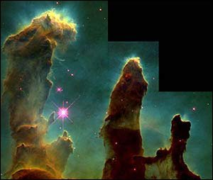

  
[Intangible Textual Heritage](../../index)  [UFOs](../index) 

------------------------------------------------------------------------

<table width="75%">
<colgroup>
<col style="width: 50%" />
<col style="width: 50%" />
</colgroup>
<tbody>
<tr class="odd">
<td width="50%" data-valign="TOP"> 
</td>
<td width="50%" data-valign="TOP"><h1 id="other-tongues--other-flesh" data-align="CENTER">Other Tongues--Other Flesh</h1>
<h2 id="by-george-hunt-williamson" data-align="CENTER">by George Hunt Williamson</h2>
<h4 id="section" data-align="CENTER">[1953]</h4></td>
</tr>
</tbody>
</table>

------------------------------------------------------------------------

|                                                                                                                           |
|---------------------------------------------------------------------------------------------------------------------------|
|  |

George Hunt Williamson was a pioneering UFO researcher who developed
many of the themes of modern UFOology. Williamson invented the concept
of 'walk-ins,' who he called 'The Wanderers.' Walk-ins are normal humans
who are actually (unknown to themselves) reincarnated 'Space Brothers.'
Williamson also worked with George Adamski, another UFO pioneer. One of
the centerpieces of this book is a labored interpretation of symbols in
footprints left when Venusians had a close encounter with Adamski in the
California desert.

Williamson has a somewhat opaque and very inflated resume. While his
official bibliography lists numerous academic credentials and honors,
Williamson actually dropped out of college, purchased some of his
degrees from a diploma mill and invented the rest. He also claims to be
an expert on Southwestern Native Americans, which is strange, because
I've never seen any papers by him on that topic. Despite the attempt to
reinvent himself as a *bona fide* scientist, Williamson repeatedly
disparages the scientific method in this book, calling scientists 'The
Guessers.'

Even murkier is his association with the Nazi William Dudley Pelley,
whom he worked for briefly in the early 1950s. That said, it is
difficult to spot any explicit trace of extreme right-wing politics in
this book. Williamson believed that most of the aliens visiting Earth
look like humans (or *are* humans), are benign, and preach a telepathic
message of peace and brotherhood. In this book at least, the amoral,
almond-eyed 'grey' aliens who conduct hostile abduction of humans for
medical experimentation and mutilate livestock are nowhere to be found.

This book fell into the public domain in the US, because it was not
renewed at the US copyright office in a timely fashion as required by
law at the time. It is not currently in the public domain in any other
country. For an independent report on the copyright registration and
renewal status of this book, see [this PDF file](otofcr.pdf).

------------------------------------------------------------------------

[Title Page](otof00)  
[Contents](otof01)  
[Plates](otof02)  
[Illustrations](otof03)  
[Prologue](otof04)  

### Book I. God Provided--Man Divided

[Chapter 1. The Great Influx](otof05)  
[Chapter 2. The Grand Man](otof06)  
[Chapter 3. Magnetism: The Universal 'I Am'](otof07)  

### Book II: Other Tongues

[Chapter 1. The Solex-Mal](otof08)  
[Chapter 2. Tracks on the Desert](otof09)  
[Chapter 3: Maldek and Malona](otof10)  

### Book III. Other Flesh

[Chapter 1. The Migrants](otof11)  
[Chapter 2. The Wanderers](otof12)  
[Chapter 3. The Prophets](otof13)  
[Chapter 4. The Harvesters](otof14)  
[Chapter 5. The Agents](otof15)  
[Chapter 6. The Intruders](otof16)  
[Chapter 7. The Guessers](otof17)  
[Chapter 8. The Remnant](otof18)  

 

[Epilogue](otof19)  
[Bibliography](otof20)  
