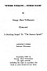
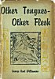
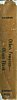
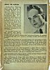
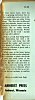
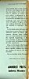
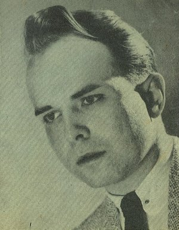

  
[Intangible Textual Heritage](../../index)  [UFOs](../index) 
[Index](index)  [Next](otof01) 

------------------------------------------------------------------------

p. 1

# "OTHER TONGUES--OTHER FLESH"

###### by

## George Hunt Williamson

b\. 1926, d. 1986

###### Illustrated

###### A Startling Sequel To "The Saucers Speak!"

#### Amherst Press: Amherst, Wisconsin

#### \[1953\]

NOTICE OF ATTRIBUTION  
Scanned at Intangible Textual Heritage, February 2005. Proofed by John
Bruno Hare. This text is in the public domain in the United States
because it was not registered at the US Copyright Office. It is not in
the public domain in the UK, EU or other countries where copyright is
based on date of decease. These files may be used for any non-commercial
purpose, provided this notice of attribution is included intact in all
copies.

 

[  
Click to enlarge](img/title.jpg)  
Title Page  

<table data-border="0">
<colgroup>
<col style="width: 33%" />
<col style="width: 33%" />
<col style="width: 33%" />
</colgroup>
<tbody>
<tr class="odd">
<td data-valign="top" width="218">

<a href="img/fcover.jpg"> 
Click to enlarge</a> 
Front Cover 

</td>
<td data-valign="top" width="218">

<a href="img/spine.jpg"> 
Click to enlarge</a> 
Spine 

</td>
<td data-valign="top" width="218">

<a href="img/bcover.jpg"> 
Click to enlarge</a> 
Back Cover 

</td>
</tr>
<tr class="even">
<td data-valign="top" width="218">

<a href="img/fflap.jpg"> 
Click to enlarge</a> 
Front Flap 

</td>
<td data-valign="top" width="218">
 
</td>
<td data-valign="top" width="218">

<a href="img/bflap.jpg"> 
Click to enlarge</a> 
Back Flap 

</td>
</tr>
</tbody>
</table>

### BACK COVER TEXT

### *ABOUT THE AUTHOR*

George Hunt Williamson 

|                  |
|------------------|
|  |

served with the Army Air Corps during World War II as Radio Director for
the Army Air Forces Technical Training Command. He was a member of the
AAFTTC Headquarters Staff. He received the Army Commendation Award from
Brig. Gen. C. W. Lawrence for his outstanding record of service to the
Air Force in Public Relations. He served as an instructor in
Anthropology for the United States Armed Forces Institute, and was later
appointed Lieutenant in the U. S. Infantry.

He attended Cornell College, Eastern New Mexico University, the
University of Arizona, and took a special course at the University of
Denver. He majored in anthropology with many courses in sociology,
biology, philosophy and geology.

In 1948 he was awarded the coveted Gold Key for outstanding scientific
research by the Illinois State Archaeological Society. He has spent a
great deal of time doing field-work in Social Anthropology in the
northern part of the United States, Mexico and Canada. He is an
authority on Indian dances, music and ceremonial costuming. Several of
his articles have appeared in scientific journals.

He is listed in the July, 1952 Supplement to "Who's Who In America", and
his name appears in the latest editions of "Who Knows, And What", and
"Who's Who in the West". He is included in Volume Twenty-Nine of "Who's
Who In America", and also in "American. Men of Science".

He is co-author of *The Saucers Speak!* (A Documentary Report Of
Interstellar Communication By Radiotelegraphy).

Mrs. Williamson, the former Betty Jane Hettler, is a chemist and an
anthropologist, holding an A.S. degree from Grand Rapids Junior College;
a B.S. degree from Eastern New Mexico University; and a B.A. degree from
the University of Arizona. Both are members of the American
Anthropological Association, and the American Association for the
Advancement of Science.

### FRONT FLAP TEXT

In more recent times, there has been a growing realization that on other
worlds than ours, even in other universes, there are other living
beings. The idea that earthbound man may someday journey into the
heavens to discover other men and women, like or unlike himself, "grows
by leaps and bounds. Within man's soul lies the truth--mortals exist on
other spheres!

Here is a book that brings home this tremendous fact with a dynamic
force and sweep that will astound the reader, and convince him beyond
all doubt. Here is a *history*, a collection of *proof*, and a
tremendous *theory*.

While man in his heart knows that other worlds are also inhabited, he is
reluctant to admit that Earth is only one small house of the "many
mansions" in the Father's house. But the truth stares him in he face,
and now, having arrived at a place in his civilization where only Truth
will be able to survive, it has become necessary to reaffirm

(*More on inside back flap*)

### BACK FLAP TEXT

(*Continued from front flap*)

and establish three truths, namely: 1) Science and religion are one and
the same thing; 2) The entire universe is magnetic in nature, and even
culture is influenced by the laws of magnetism; 3) Space visitors,
mentioned in the Bible and ancient mythology, have been coining to Earth
throughout the ages, and are now making themselves known to aid mankind
in entering a New Age.

In this book, many references and quotations are given from the latest
authentic reports on Saucer phenomena. Because many believe there are
contradictions in some of the reported happenings, it has been necessary
to show that there is a great story and purpose behind all these
experiences.

Here, in this book, is the history of *other tongues*, and of *other
flesh*; calm, scientific evidence that there are brothers of ours in the
skies overhead.

We are not alone in the Universe!

JACKET DESIGN BY RAY PALMER

------------------------------------------------------------------------

[Next: Contents](otof01)
