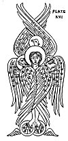
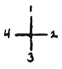

  
[Intangible Textual Heritage](../../index)  [UFOs](../index) 
[Index](index)  [Previous](otof12)  [Next](otof14) 

------------------------------------------------------------------------

p. 247

### CHAPTER 3

### THE PROPHETS

Blessed be the Lord God of Israel, who "spake by the mouth of his holy
*prophets*, which have been since the world began." (St. Luke 1:70).

The Prophets went before the face of the Lord to prepare his ways; to
give light to them that sat in darkness and in the shadow of death; to
guide their feet into the *way of peace*.

There have always been prophets and there always will be prophets; they
are with us today. Wordsworth said: "Mighty Prophet! Seer blest, On whom
those truths do rest, Which we are toiling all our lives to find."

In Old Testament times there were orders or bands of prophets, called
*schools of the prophets*. In New Testament times Christian prophets
constituted an order ranking next to that of apostle. The Moslems had
Mohammed, the Mormons had Joseph Smith and the Christian Scientists had
Mary Baker Eddy. Those who are discerning the signs of God and are
telling the people of what the future holds are still exercising the
office of *Prophet*.

Isaiah, Jeremiah, Ezekiel, Daniel, Hosea, Joel, Amos, Obadiah, Jonah,
Micah, Haggai, Zechariah and Malachi were prophets along with others
during the Old Testament days. Of course, Isaiah and Ezekiel seem to
have had more direct contact with

p. 248

space intelligences than any of the others. Many of their writings are
no longer available, such as "The Acts of Uzziah" written by Isaiah.
(See II Chronicles 26:22).

Chapter Six of Isaiah was referred to in *Maldek And Malona*, showing us
that this prophet was visited by space intelligences and thereby
received his information for prophecy. Isaiah, himself, was a
"Wanderer", a "Son of Light". To show that he knew of extraterrestrial
visitation to Earth, he wrote:

"Lift up your eyes on high, and behold who hath created these *things*,
that bringeth out their host by number: he calleth them all by names by
the greatness of his might, for that he is strong in power; not one
faileth." (Isaiah 40:26).

David had said: "He telleth the number of the stars; he calleth them all
by their names." (Psalms 147:4).

Isaiah wasn't referring to *things* or *stars* alone, and he didn't mean
the light they gave off in the heavens. By "host" he meant the
intelligences that were coming earthward from the heavenly bodies.

Isaiah's prophecy in Chapter Five could easily refer to the present time
as well as it did the prophet's time. The vineyard and the wild grapes
therein symbolizes our world of today and its people. In one of the new
editions of the Bible, the following verses are omitted. Chapter Five
ends with verse twenty-five. Why were these verses taken out after all
these years?

"And he will lift up an ensign to the nations

p. 249

from far, and will hiss unto them from the end of the earth: and,
behold, they shall come with speed swiftly: None shall be weary nor
stumble among them; none shall slumber nor sleep; neither shall the
girdle of their loins be loosed, nor the latchet of their shoes be
broken: Whose arrows are sharp, and all their bows bent, their horses'
hoofs shall be counted like flint, and their wheels like a whirlwind:
Their roaring shall be like a lion, they shall roar like young lions:
yea, they shall roar, and lay hold of the prey, and shall carry it away
safe, and none shall deliver it. And in that day they shall roar against
them like the roaring of the sea: and if one look unto the land, behold
darkness and sorrow (distress), and the light is darkened in the heavens
thereof (when it is light, it shall be dark in the destructions
thereof). (Isaiah 5:26-30).

The space friends have "wheels like whirlwinds", their "arrows (truth)
are sharp", they "come with speed swiftly", and they shall "lay hold of
the prey, and shall carry it away safe".

Ezekiel had his encounter with space craft many years after Isaiah in
595 B.C. He gets off to a grand start in Chapter One giving us a perfect
description of Flying Saucers, their landing, and their occupants
getting out. Although the entire verses being transposed and generally
mixed up, we can obtain a comprehensive view of the situation by careful
reading and proper correlation. Remember that Ezekiel had no mechanical
contrivances with which to make comparisons and he was therefore
compelled to use

p. 250

 

[  
Click to enlarge](img/pl16.jpg)  
PLATE XVI  

 

p. 251

the only things with which he was familiar--animals, birds, and
horse-drawn chariots with *wheels*.

In this connection the Tetramorph of Greek art is interesting. (See
[Plate XVI](#img_pl16)). This symbolic drawing was taken from a
Byzantine Mosaic in the Convent of Vatopedi on Mt. Athos. The principal
figure is that of a Man, the three heads of the other creatures
appearing from behind, and six large wings covered with eyes are
arranged around the heads and across the body of the Man, whose feet
rest on fiery *wheels* which are also winged (indicating flight). All
the heads are invested with plain nimbi. The Tetramorph was the
ancients' idea or conception of what Ezekiel saw that day in 595 B.C. by
the River of Chebar. It is one of the world's earliest known drawings of
Saucers.

The verses in Chapter One which make the most sense in the light of our
modern knowledge of space-craft will be given in that order.

"And I looked, and, behold, a whirlwind came out of the north, a great
cloud, and a fire infolding (catching) itself, and a brightness was
about it, and out of the midst thereof as the color of amber, out of the
midst of the fire." (Ezekiel 1:4).

Many of the spacecraft sighted within the last few years have displayed
a very bright amber glow.

"And every one had four faces, and every one had four wings. And their
feet were straight feet (a straight foot); and the sole of their feet
was like the sole of a calf's foot: and they sparkled like the color of
burnished brass." (Ezekiel 1:6-7).

p. 252

We shall see in a moment why they had four faces and four wings. The
"straight foot" is, of course, the ball-bearing landing-gear-like
devices on the bottom of some Saucers with their contact points.

"Their wings were joined one to another; they turned not when they went;
they went every one *straight forward*. As for the likeness of their
faces; they four had the face of a man, and the face of a lion, on the
right side: and they four had the face of an ox on the left side: they
four also had the face of an eagle." (Ezekiel 1:9-10).

"And they went every one straight forward: *whither the spirit* was to
go, they went; and they turned not when they went." (Ezekiel 1:12).

This could easily represent a fleet of four space craft or Saucers with
their insignia shown on the sides, designating what portion of the
heavens they come from. A man; a lion; an ox (bull); and an eagle. One
represented the Constellation Aquarius (Man); one the Constellation Leo
(Lion); one the Constellation Taurus (Ox or Bull); and one the
Constellation Scorpio (Eagle). For the complete reconstruction of the
ancient Scale of Four see Plate XVII. When reading this plate on the
hidden meaning of the Four, the vertical columns should be considered as
separate units, so that, when you read down in any of the four columns,
you will discover all related material. Likewise, when you read across
from left to right in the horizontal lines or sections, you will
discover four items that are all related.

p. 253

 

THE HIDDEN MEANING OF THE SCALE OF FOUR (DIVINE TETRAD):

 

|                                   |                 |                 |                  |                |
|-----------------------------------|-----------------|-----------------|------------------|----------------|
| The Four Numerals:                | 1               | 2               | 3                | 4              |
| The Four Cardinal Directions:     | North           | East            | South            | West           |
| The Four Seasons:                 | Winter          | Summer          | Autumn           | Spring         |
|                                   | Winter Solstice | Summer Solstice | Autumnal Equinox | Vernal Equinox |
| Four Constellations:              | Aquarius        | Leo             | Taurus           | Scorpio        |
|                                   | Gemini          | Aries           | Virgo            | Cancer         |
|                                   | Libra           | Sagittarius     | Capricorn        | Pisces         |
|                                   | Saturn          | Mars            | Fixed Stars      | Jupiter        |
|                                   | Mercury         | Sun             | Moon             | Venus          |
| Four Royal Stars of the Ancients: | Fomalhaut       | Regulus         | Aldebaran        | Antares        |
| Four Great Primary Forces         | RMF             | ES              | SM               | EM             |
| Four Beasts:                      | Man             | Lion            | Bull             | Eagle          |
| Four Gospels and Evangelists:     | Matthew         | Mark            | Luke             | John           |
| Four Rivers of Paradise:          | Gihon           | Tigris          | Euphrates        | Pison          |
|                                   | Incarnation     | Resurrection    | Passion          | Ascension      |
| Four Elements:                    | Air             | Fire            | Earth            | Water          |
| The Four Tribes:                  | Reuben          | Judah           | Ephraim          | Dan            |
| Four Major or Greater Prophets:   | Isaiah          | Daniel          | Jeremiah         | Ezekiel        |
| Four Archangels:                  | Gabriel         | Michael         | Uriel            | Raphael        |
|                                   | Cold            | Heat            | Dryness          | Moisture       |
| The Four Kingdoms:                | Metals          | Animals         | Stones           | Plants         |
|                                   | Flying          | Walking         | Creeping         | Swimming       |
|                                   | Cherub          | Seraph          | Ariel            | Tharsis        |

 

p. 254

Since Ezekiel could not conceive of a bird being able to fly in "any
direction" without turning around, and since the Saucers did fly or go
in any direction without turning, he naturally had to add wings to all
four sides in order to remedy that defect, and also to protect himself
and his writings from the uniformed populace. If there had been a
Project "Whirlwind" (Saucer) in Ezekiel's time he would have been
ridiculed indeed; and probably was by many.

Ezekiel didn't realize that the Saucers were separate from their
respective occupants. He thought the men in the Saucers were the spirits
of the wheels; to him the Saucers were living things!

"Also out of the midst thereof came the likeness of *four living
creatures*. And this was their appearance; they had the *likeness of a
man*." (Ezekiel 1:5).

Now that the Saucers are on the ground perhaps we can find out more
about them.

"Now as I beheld the living creatures, behold one wheel upon the earth
by the living creatures, with his four faces." (Ezekiel 1:15).

Two-faced men are bad enough, but Ezekiel would have had a difficult
time, indeed, with four-faced men. However, the prophet did not mean
that the living creatures had four faces, he meant the wheels had "four
faces".

"The appearance of the wheels and their work was like unto the color of
a beryl: *and they four had one likeness*: and their appearance and
their work was as it were *a wheel in the middle of a wheel*." (Ezekiel
1:16).

p. 255

"As for their rings, they were so high that they were dreadful; and
their rings (strakes) were full of eyes round about them four. And when
the living creatures went, the wheels went by them: and when the living
creatures were lifted up from the earth, the wheels were lifted up.
Whithersoever the spirit was to go, they went, thither was their spirit
to go; and the wheels were lifted up over against them: for the spirit
of the living creature (spirit of life) was in the wheels." (Ezekiel
1:18-20).

"And the likeness of the firmament upon the heads of the living creature
was as the color of the terrible crystal, stretched forth over their
heads above." (Ezekiel 1:22).

The firmament over the heads of the living creatures is, of course the
dome, and the "eyes round about" were the portholes or observation
openings of a Flying Disc or Saucer (Compare Adamski's photographs in
"*Flying Saucers Have Landed*"). The word "rings" can also be translated
"strakes" which is a shipbuilding term. It means one breadth of plates
along the bottom or sides of a vessel reaching from stem to stern. Now
the first word "rings" in verse eighteen cannot be translated "strakes,"
therefore it should read: "As for their rings, they were so high that
they were dreadful; and their strakes were full of eyes round about them
four." It means that the counter-rotating rings of the underneath
portion of the Saucer "were so high that they were dreadful",

p. 256

and the strakes or sides of the Saucer which were composed of one
breadth "were full of eyes round about them four". This latter
description means that all four Saucers had the porthole openings.

The phrase, "when the living creatures were lifted up from the earth,
the wheels were lifted up", means that when the occupants of the Saucers
were in their ships, they both (creatures and wheels) left the ground
together.

The "firmament" or dome of the Saucers was like "the color of the
terrible crystal". On top of each dome there is a light or lamp that
sends forth a terrifically bright beam. This corresponds to the "polar
vent" area of our own big "spaceship", the Earth. Usually this light is
a "pulsating" light and changes colors. It would have appeared
"terrible" to Ezekiel, indeed.

"And there was a voice from the firmament that was over their heads,
when they stood, and had let down their wings. And above the firmament
that was over their heads was the likeness of a throne, as the
appearance of a sapphire stone: and upon the likeness of the throne was
the likeness as the appearance of a man above upon it. And I saw as the
color of amber, as the appearance of fire round about within it, from
the appearance of his loins even upward, and from the appearance of his
loins even downward, I saw as it were the appearance of fire, and it had
brightness round about. As the appearance of the bow that is in the
cloud in the day of rain (the rainbow),

p. 257

so was the appearance of the brightness round about." (Ezekiel 1:25-28).

In the November, 1953 issue of *Mystic Magazine*, Orfeo M. Angelucci
told his story of contact with space beings to Paul M. Vest. Here is
part of what he said: "But even as the glowing red orb vanished two
smaller discs came from it. These discs were a soft fluorescent green
and shot toward me like shooting stars. They streaked down in front of
my car and hovered about fifteen feet directly in front of me. I judged
them to be about thirty inches each in diameter. Hanging silently in the
air like iridescent bubbles, their green light fluctuated in pulsations.
As I gazed at those two eerie balls of green fire I heard a masculine
voice, strong, well-modulated and speaking perfect English. The voice
apparently came from *between* the two green discs." Again, he said:
"The glowing discs created a soft illumination, but I could see no
person anywhere. The voice stated that the small green discs were
instruments of transmission and reception comparable to nothing
developed on Earth. Then the voice added that through the discs I was in
direct communication with friends from another planet." Then Orfeo said:
"The area between the discs began to glow with a soft green light which
gradually formed itself into a kind of luminous screen as the discs
themselves faded perceptibly. Within that luminous, three-dimensional
screen there appeared images of the heads and shoulders of two persons,
as though in a cinema close-up." He continued:

p. 258

\[paragraph continues\] "Those two figures struck me somehow as being
the ultimate of human perfection. There was a nobility about them, their
eyes were larger and much more expressive and they emanated a kind of
radiance that gave me a sense of wonder." Orfeo said that he had the
feeling while they studied him that they knew every thought that passed
in his mind: "I seemed to be in telepathic communication with them, for
thoughts, understandings, and new comprehensions flashed through my
consciousness that would have required hours of conversation to
transmit."

If Angelucci's experience had taken place in 595 B.C., he too, would
have been a prophet like [Ezekiel](errata.htm#23). Instead he is a
Prophet of the New Age now dawning on Earth.

Considering the strange experience of Angelucci, we can interpret
Ezekiel 1:25-28, as follows:

A voice came from the dome of the hovering Saucer. Then, Ezekiel says
that above the dome "was the likeness of a throne, as the appearance of
a sapphire stone". Notice he doesn't say an actual throne, but "the
*likeness* of a throne". Later he says "the *likeness* as the appearance
of a man". Therefore, the throne and the man were not actually
there--only their *likeness*. They were projected there, even as the man
and woman were projected between the two green discs observed by Orfeo.
Then, Ezekiel tells us that he saw the "appearance of fire", and that
"it had brightness round about; as the appearance of the rainbow, so was
the appearance

p. 259

of the brightness round about". Ezekiel was seeing the aura of the space
visitor speaking to him from some sort of highly evolved television
system. Where was this visitor? He is separate and distinct from the
four living creatures, or occupants of the Saucers. Possibly he was as
far away as the planet Saturn as we shall see presently.

The prophet says the throne appeared as "a sapphire stone". The ruby, or
red corundum, is almost never called sapphire, but all other gem
varieties are, as white, *green*, purple, and yellow sapphire.
Therefore, a "sapphire stone" can be *green!* Besides, the color
sapphire blue is *greenish-blue* in hue. Again this sounds very similar
to Orfeo Angelucci's experience. In Ezekiel 1:16, we read: "The
appearance of the wheels and their work was like unto the color of a
*beryl*. "An emerald is a rich green variety of beryl; and the beryl is
commonly green or bluish-green--aquamarine and emerald are varieties.
Again the *green* color!

The gem sapphire is usually the birthstone of April and Taurus. And
Taurus is ruled by Venus. This gem has been ascribed to Saturn, and to
Venus. It was mentioned in *Revelation* as one of the foundations of the
New Jerusalem. Moses and Aaron saw the God of Israel with a paved work
of sapphire under his feet.

"And they saw the God of Israel: and there was under his feet as it were
a paved work of a sapphire stone, and as it were the body of heaven in
his clearness." (Exodus 24:10).

p. 260

The Book of Revelation also speaks of a similar happening and that will
be discussed a little later on.

One legend about Aaron's rod says that it was made of *sapphire*.
Sapphires are used against the evil eye and witchcraft of all kinds; the
gem is said to exert good influence on its owners.

The beryl is designated the birthstone of October or Scorpio. Some Bible
authorities claim it was one of the stones in the High Priest's
breastplate and one of the foundation stones of the New Jerusalem. It
was sometimes used to make *crystal balls!* Saucers or Crystal Bells of
Beryl, indeed!

It is possible, therefore, that one of the Saucers of the four came from
Venus, representing the Constellation of Taurus (Ox or Bull,), and the
"voice of one that spake" could have been the voice of the Head (Kadar)
of the Universal Tribunal on Saturn.

Then in Ezekiel 1:28, we read: "This was the appearance of the likeness
of the glory of the Lord. And when I saw it, I fell upon my face, and I
heard a voice of one that spake."

"And he said unto me, Son of man, stand upon thy feet, and I will speak
unto thee. And the spirit entered into me when he spake unto me, and set
me unto my feet, that I heard him that spake unto me." (Ezekiel 2:1-2).

When the prophet says that "the spirit entered into" him when the voice
"spake unto" him, he means that telepathic communication had been set
up--the same thing again as the Angelucci experience!

p. 261

"And he said unto me, Son of Man, I send thee to the children of Israel,
to a rebellious nation (nations) that hath rebelled against me: they and
their fathers have transgressed against me, even unto this very day."
(Ezekiel 2:3).

Here, Ezekiel is being sent unto the people as Isaiah was sent: "And he
said, Go, and tell this people, Hear ye indeed, but understand not; and
see ye indeed, but perceive not." (Isaiah 6:9).

Isaiah and the Saucers were discussed in *Maldek and Malona*. Both
prophets had encounters with extraterrestrial beings and then were told
to go forth and give the message to the people. The very same thing is
happening today in our twentieth century!

Ezekiel goes on to make many references to Flying Saucers. In Ezekiel
3.12-15, we read: "Then the spirit took me up, and I heard behind me a
voice of a great rushing, saying, Blessed be the glory of the Lord from
his place. I heard also the noise of the wings of the living creatures
that touched (kissed) one another, and the noise of the wheels over
against them, and a noise of a great rushing. So that spirit lifted me
up, and took me away, and I went in bitterness (bitter), in the heat of
my spirit, but the hand of the Lord was strong upon me. Then I came to
them to the captivity at Tel-abib, that dwelt by the river of Chebar."

Ezekiel could truthfully say that he "rode a Flying Saucer". The "great
rushing" was the characteristic *humming* of a space craft.

p. 262

In Chapter Ten, the prophet speaks of the vision of the Cherubim and the
Wheels.

"Then I looked, and, behold, in the firmament that was above the head of
the cherubim there appeared over them as it were a *sapphire* stone, as
the appearance of the likeness of a throne." (Ezekiel 10:1).

Here we encounter the *greenish-blue* color again. And the prophet says,
"*as it were* a sapphire stone." This means it appeared to be *like* a
sapphire stone, but was not actually such a thing.

"And when I looked, behold the four wheels by the cherubim, one wheel by
one cherub, and another wheel by another cherub: and the appearance of
the wheels was as the color of a beryl stone. And as for their
appearances, they four had one likeness, as if a wheel had been in the
midst of a wheel." (Ezekiel 10:9-10).

The cherubim here represent the occupants of the Saucers. So, Ezekiel
had another contact with the four Saucers! One Saucer was by one
occupant, and so on. Again they appeared *green*.

"As for the wheels, it was cried unto them in my hearing, O wheel."
(Ezekiel 10:13).

This can also be translated: "As for the wheels, they were called in my
hearing, wheel, or *galgal*."

Ezekiel says the cherubim "mounted up from the earth" in his sight, "and
the glory of the God of Israel was over them above". (Ezekiel 10:19).

A Saucer increasing its speed and going through various color changes,
all the time glowing brilliantly,

p. 263

would indeed appear as "the glory of the God of Israel".

"And the likeness of their faces was the same faces which I saw by the
river of Chebar, their appearances and themselves: they went every one
*straight forward*." (Ezekiel 10:22).

In Chapter Eleven, we read: "Moreover the spirit lifted me up, and
brought me unto the east gate of the Lord's house." (Ezekiel 11:1).

"Then did the cherubim lift up their wings, and the wheels beside them;
and the glory of the God of Israel was over them above. And the glory of
the Lord went up from the midst of the city, and stood upon the mountain
which is on the east side of the city." (Ezekiel 11:22-23).

The colorful, pulsating, glowing Saucers went straight up from the
"midst of the city" and hovered over the mountain "on the east side of
the city".

Pages and pages of interpretation could be written about Ezekiel's
Saucer experiences, but enough has been given here to show the
connection. Every verse seems to hold new, important information. For
instance, Ezekiel 1:13: "As for the likeness of the living creatures,
their appearance was like burning coal of fire, and like the appearance
of lamps: it went up and down among the living creatures; and the fire
was bright, and out of the fire went forth lightning."

This sounds very similar to the experience of ex-Mayor Oskar Linke, of
Gleimershausen, near Meiningen, Germany. Herr Linke and his eleven
year-old

p. 264

stepdaughter, Gabriele, saw a Saucer that had landed and they observed
two human figures near it clothed in a kind of *shimmering metallic
substance*. Herr Linke said, "I noticed that one man appeared to be
carrying a *lamp on his chest . . . the lamp flashed on and off
regularly*."

In describing the "take off' of the Saucer, Linke made such statements
as: "The color at first seemed green, then changed to red. At the same
time I heard a slight hum. The whole object rose slowly. The rate of
ascent now became much greater, and at the same time we heard a
whistling sound, rather like the noise made by a falling bomb, but not
nearly so loud. The object rose in a horizontal position, swerved away
toward a nearby village and disappeared, still climbing over the hills
and forests [toward](errata.htm#24) Stockheim."

Ezekiel's living creatures appeared like "burning coals of fire."
Linke's human figures appeared like "shimmering metallic substances".
Ezekiel's living creatures had the appearance of lamps, and the fire
went *up and down* among the living creatures. Linke's human figure had
something which appeared to be a lamp on his chest, and the lamp flashed
*on and off* regularly. Herr Linke and the prophet Ezekiel had an almost
identical experience, even to the color of *green*, and the Saucer going
"up from the midst" and being over the mountains and hills, and the
"noise of a great rushing" and the "whistling sound".

Isaiah and Ezekiel are not the only ones mentioned

p. 265

in the Bible who had Saucer contact. Job 40:6, may refer to a contact:
"Then answered the Lord unto Job out of the *whirlwind*, and said . . ."
Saucers have *always* been with us, and the Bible itself is a record of
early contacts. The Bible, because of many translations, mistakes made
by scribes, and deliberate tampering by men, is not *perfect*, but it
does give us fairly accurate historical reports, especially in the Old
Testament.

"And Jacob went on his way, and the angels of God met him. And when
Jacob saw them, he said, This is God's host: and he called the name of
that place Mahanaim (Two hosts)." (Genesis 32:1-2).

"And it came to pass, as they still went on, and talked, that, behold,
there appeared a chariot of fire, and horses of fire, and parted them
both asunder; and Elijah went up by a whirlwind into heaven. And Elisha
saw it. (II Kings 2:11-12).

Elijah had completed his mission and was removed by a Saucer. Because of
this Elijah was translated and Elisha was endowed. The latter took up
the mantle of the former and carried on.

Elijah left Earth in "a chariot of fire" in 896 B.C., and for three
years afterward, Elisha traveled about the country doing a great deal of
good. He cured the sick, raised the dead, fed the hungry, and spread the
word of God. There were subversives in those days too, and Elisha was in
trouble with the King of Syria, and the king sent an army to capture the
man of God.

"Therefore sent he thither horses, and chariots,

p. 266

and a great (heavy) host: and they came by night, and compassed the city
about. And when the servant (minister) of the man of God was risen
early, and gone forth, behold a host compassed the city both with horses
and chariots. And his servant said unto him, Alas, my master! how shall
we do? And he answered, Fear not: for they that be with us are more than
they that be with them. And Elisha prayed, and said, Lord, I pray thee,
open his eyes, that he may see. And the Lord opened the eyes of the
young man; and he saw: and, behold, *the mountain was full of horses and
chariots of fire round about Elisha. And when they came down to him*,
Elisha prayed unto the Lord, and said, Smite this people, I pray thee,
with blindness. And he smote them with blindness according to the word
of Elisha." (II Kings 6:14-18).

Here is a positive statement that there is a marked difference between
the chariots of the king and the "chariots of fire". These "fire
chariots" *came down*--and they couldn't possibly come down unless they
were first up. And Elisha didn't wait there until hundreds of "chariots
of fire" rolled and rumbled down the mountain-side--they had been on the
mountain, "the mountain was full of" them--but they "came down" to
Elisha, gliding noiselessly as only Saucers can do.

The "heavenly host" or Saucer intelligences were watching over the men
of God in ancient times, even as today. *The Prophets* received their
information directly from space intelligences and relayed

p. 267

it on--usually to *The Remnant*, for members of this group were the
special charge of prophets.

Remember that *The Wanderers*, in a sense are "Sons of Light", but the
term fits space intelligences in space craft in a more direct way. In
the "Golden Scripts", we read:

"The Sons of Light array themselves at my bid-ding: they go forth in the
world and make it beautiful." (G. S. 209:1).

"The Sons of Light are of the Host; they are a creation of the Father
for a purpose; men call them angels; they are called Sons of Light by
the Father's cohorts." (G. S. 209: 3-4).

In Chapter 209, verse 2, we read: "They are a goodly company indeed, but
not the Goodly Company that findeth me through suffering." Here the
Elder Brother is saying that the space intelligences in the Saucers are
a part of the goodly company, but not the Goodly Company of "Wanderers"
who go in and out of life on Earth to help their fellow man and thereby
suffer.

"They are endowed with infallible powers in Matter, in that Matter
obeyeth them; Matter is their servant: they have dominion over it. They
know neither time nor space but transfer themselves from planet unto
planet in the twinkling of an eye. They come and go upon the Father's
business: great is their joy therein: they are pure in heart and
beauteous of mien. They seek to do the Father's will, and in that they
seek, they do find life wondrous." (G. S. 209: 6-9).

p. 268

"I tell you, be advised! Ye are as gods yourselves among men; the Sons
of Light are your ministering servants." (G. S. 209:21).

"Do I speak unto you of mysteries? I say that ye shall know them in the
Day of Understanding. Behold my [ministers](errata.htm#25) who are Sons
of Light manifesting, have orders of me that ye be protected in your
thought and persons when it so cometh that ye advance my Plan." (G. S.
209:31-32).

"Hear my words and be wise! I speak as a teacher who is honored with
wisdom." (G. S. 209:36).

On page twenty-five of *I Rode A Flying Saucer*, by George W. Van
Tassel, there is a message dated May 17, 1952. In part, it reads: "My
center has given me authority to describe vaguely this ship I command.
In your dimensions my, what you would call 'flagship', is three-hundred
feet thick, and fifteen-hundred feet in diameter. Our crew *seventy-two
hundred*."

The fact that the crew numbered seventy-two hundred is very significant
and if we go to our Bible, we discover why.

"And, behold, one of them which were with Jesus stretched out his hand,
and drew his sword, and struck a servant of the high priest's and smote
off his ear. Then said Jesus unto him, Put up again thy sword into his
place: for all they that take the sword shall perish with the sword.
Thinkest thou that I cannot now pray to my Father, and he shall
presently give me more than *twelve legions of angels?* But how then
shall the scriptures be fulfilled, that

p. 269

thus it must be?" (St. Matthew 26:51-54).

In designating the number of angels the Father would send if Jesus
requested them, the Master used the then familiar Roman military unit,
the legion. A legion varied from the time of the early re-public until
the empire in the number of men composing it. The Emperor Marius made
many changes in its basic structure. However, the legion Triarii
consisted of six-hundred men; this was the third line of the Roman army.
Therefore, twelve Triarii equalled *seventy-two hundred men*, the same
number as the crew of the space 'flagship".

There is a cross-reference in the Bible to "twelve legions of angels"
found in St. Matthew 26:53 which is quoted above. That cross-reference
refers us back to II Kings 6:17, which has already been mentioned, but
it will be quoted again for emphasis.

"I pray thee, open his eyes, that he may see. And the Lord opened the
eyes of the young man; and he saw: and, behold, the mountain was full of
horses and chariots of fire round Elisha."

In going back to the year 4004 B.C., we find in Genesis 5:24, the
following:

"And Enoch walked with God and he was not; for God took him." Again
there is another cross-reference and it refers us to II Kings 2:11,
which has already been quoted. There is mention of Enoch in Hebrews
11:5: "By faith Enoch was translated that he should not see death; and
was not found, because God had translated him: for before his
translation he had this testimony, that he pleased

p. 270

\[paragraph continues\] God."

Look at the Bible dates as they are recorded. In the first chapter of
Genesis, first verse you will find the beginning of the story of the
creation of the Earth. At the head of the center column reference is the
date 4004 B.C. At the end of chapter three, after God had driven Adam
and Eve out of the Garden of Eden, there is the date 4003 B.C., or, one
year later than the beginning of Creation. In chapter five where the
generations of Adam are listed, counting forward to the removal of
Enoch, there is a lapse of nine-hundred eighty-five years, but the date
at the head of the column is again 4004 B.C. How come?

Science has proven beyond a doubt that the Earth is millions of years
old. Besides, there are in existence a number of documents dated much
earlier than the alleged Bible date of creation. In the book, *Ancient
Times, A History Of The Early World*, by James Henry Breasted, on page
45, chapter 61, we find reference to the Egyptian culture: "He decided
to use the Moon no longer for dividing his year. He would have twelve
months, and he would make his months all the same length, that is,
thirty days each; then he would celebrate five feast days; a kind of
holiday week that was five days long at the end of the year. This gave
him a year of three-hundred sixty-five days. He was not enough of an
astronomer to know that every four years he ought to have a leap year of
three-hundred sixty-six days although he discovered this fact later.
This convenient

p. 271

\[paragraph continues\] Egyptian calendar was devised in 4241 B.C. and
its introduction is the *earliest dated event in history*. Furthermore,
this calendar is the very one which has descended to us, after more than
six thousand years, unfortunately with awkward alterations in the length
of the months, but for these alterations the Egyptians were not
responsible."

The calendar we use today was devised two-hundred thirty-seven years
*before* the Earth was created if we want to accept the Bible dates.
However, Archbishop Ussher (1581-1656 A.D.) figured out much of the
Bible chronology and dated certain events by it. The dates, therefore,
are not actually [scriptural](errata.htm#26), but man-made. Certain
Fundamental Christian groups believe the world was really created on
October 23, 4004 B.C. The question that immediately comes up is: 'What
was going on the day before, October 22nd? If the world hadn't been
created yet, there couldn't have been an October, since that month was
devised by man many years later!

"Who layeth the beams of his chambers in the waters: who maketh the
clouds his chariot: who walketh upon the wings of the wind: Who maketh
his angels spirits; his ministers a flaming fire." (Psalms 104:3-4).
Again there is a cross-reference to II Kings 2:11.

"The chariots of God are twenty thousand, even thousands of angels: the
Lord is among them, as in Sinai, in the holy place." (Psalms 68:17).

There are cross-references here to II Kings 6:16-17, already quoted.
Daniel 7:9-10; Hebrews 12:20-22;

p. 272

\[paragraph continues\] Deuteronomy 33 are also referred to.

"I beheld till the thrones were cast down, and the Ancient of days did
sit, whose garment was white as snow, and the hair of his head was like
the pure wool: his throne was like the fiery flame, and his wheels as
burning fire. A fiery stream issued and came forth from before him:
thousand thousands ministered unto him (and ten thousand times ten
thousand stood before him: the judgment was set and the books were
opened." (Daniel 7:9-10).

Daniel and all the other prophets saw great fiery objects come down from
the heavens and they con-versed with tremendous numbers of
[celestial](errata.htm#27) beings who emerged from these objects--these
beings instructed the prophets in the beauteous laws of love. More will
be said about Daniel in *The Remnant*. A colossal program of aid,
comfort and instruction was instituted with *The Prophets*. Of course,
the Bible account is somewhat confused due to the many translations and
alterations, and in some cases the deliberate attempt to cover up the
truth in order to keep the mass of people "ignorant". However, people
who know the truth are not dependent upon theological dogma or doctrine
to "save them" or make them free: "Ye shall know the truth and the truth
shall make you free."

"For they could not endure that which was commanded, And if so much as a
beast touch the mountain, it shall be stoned, or thrust through with a
dart: And so terrible was the sight, that Moses said, I exceedingly fear
and quake: But ye are come unto

p. 273

mount Sion, and unto the city of the living God, the heavenly Jerusalem,
and to an innumerable company of angels." (Hebrews 12:20-22).

"As an eagle stirreth up her nest, fluttereth over her young, spreadeth
abroad her wings, taketh them, beareth them on her wings: So the Lord
alone did lead him, and there was no strange god with him." (Deuteronomy
32:11).

"And this is the blessing, wherewith Moses the man of God blessed the
children of Israel before his death. And he said, The Lord came from
Sinai, and rose up from Seir unto them; he shined forth from mount
Paran, and he came with ten thousands of saints: from his right hand
went a fiery law (fire of law) for them." (Deuteronomy 33:1-2).

All the foregoing seems to point to a great company of angels, or
heavenly host, who had descended to Earth to give Moses and his people
specific information, and they warned Moses and the people not to come
near as the force field surrounding the ships might injure them. This
has happened in our time also, when space intelligences have warned
individuals about getting too close to the ships while they are
hovering. Adamski, Bethurum, and Fry experienced this. The ancient
people could easily understand death or injury as a result of a stone,
dart, or arrow wound; but they knew nothing of radiation, or rays,
beams, or electro-magnetic energy.

"In the third month, when the children of Israel were gone forth out of
the land of Egypt, the same day came they into the wilderness of Sinai.
For they

p. 274

were departed from Rephidim, and were come to the desert of Sinai, and
had pitched in the wilderness; and there Israel camped before the mount.
And Moses went up unto God, and the Lord called unto him out of the
mountain, saying, Thus shalt thou say to the house of Jacob, and tell
the children of Israel; Ye have seen what I did unto the Egyptians, and
how I bare you on eagles' wings, and brought you unto myself." (Exodus
19:1-4).

Now, only those verses which are pertinent to the subject will be
quoted, since the intervening verses pertain to messages of instruction
from the space beings (or the Lord, as the ancients believed) to the
people, and the people's reply, with Moses acting as message bearer.

"And the Lord said unto Moses, Lo, I come unto thee in a thick cloud,
that the people may hear when I speak with thee, and *believe thee
forever*. And Moses told the words of the people unto the Lord." (Exodus
19:9).

"And be ready against the third day: for the third day the Lord will
come down in the sight of all the people upon mount Sinai. And thou
shalt set bounds unto the people round about, saying, Take heed to
yourselves, *that ye go not up into the mount, or touch the border of
it*: whosoever toucheth the mount shall be surely put to death: There
shall not a hand touch it, but he shall surely be stoned, or shot
through; whether it be beast or man, it shall not live: when the trumpet
soundeth long, they shall come up to the mount." (Exodus 19:11-13).

p. 275

The space intelligences meant here that they would give a signal, a
"trumpet" blast that "soundeth long", when it was safe for the people to
come up to the mount.

"And it came to pass on the third day in the morning, that there were
thunders and lightning, and a thick cloud upon the mount, and the voice
of the trumpet exceeding loud; so that all the people that were in the
camp trembled." (Exodus 19:16).

"And the Lord came down upon mount Sinai, on the top of the mount: and
the Lord called Moses up to the top of the mount; and Moses went up."
(Exodus 19:20).

Then the Lord told Moses to go down and warn the people so that they
wouldn't "break through unto the Lord to gaze, and many of them perish".

"And God spake all these words, saying, I am the Lord thy God which have
brought thee out of the land of Egypt, out of the house of bondage."
(Exodus 20:1-2).

Then follows the Decalogue or Ten Commandments:

1\. Thou shalt have no other Gods before me.

2\. Thou shall not make unto thee any graven images.

3\. Thou shalt not take the name of the Lord thy God in vain.

4\. Remember the sabbath day to keep it holy.

5\. Honor thy father and thy mother.

6\. Thou shalt not kill.

7\. Thou shalt not commit adultery. p. 276

8\. Thou shalt not steal.

9\. Thou shalt not bear false witness.

10\. Thou shalt not covet.

"And all the people saw the thunderings, and the lightnings, and the
noise of the trumpet, and the mountain smoking." (Exodus 20:18).

"When they had heard the king, they departed; and, lo, *the star*, which
they saw in the east, *went before them, till it came and stood over
where the young child was*. When they saw the star, they rejoiced with
exceeding great joy." (St. Matthew 2:9-10).

"And there were in the same country shepherds abiding in the field,
keeping watch over their flock by night. And, lo, *the angel of the Lord
came upon them*, and the *glory of the Lord shone round about them*: and
they were sore afraid. And the angel said unto them, Fear not: for,
behold, I bring you good tidings of great joy, which shall be to all
people. For unto you is born this day in the city of David a Savior,
which is Christ the Lord." (St. Luke 2:8-11).

"And *suddenly there was with the angel a multitude of heavenly host*
praising God, and saying, Glory to God in the highest, and on earth
peace, good will toward men." (St. Luke 2:13-14).

For many years astronomers have tried to justify the actions of the Star
of Bethlehem. There are several theories, but no agreement has been
reached as yet. The constellations and conjunctions back to that period
have been checked and it is found

p. 277

that no such *natural* event took place. One well-known astronomer said:
"In my opinion, the Star of Bethlehem was created especially for the
event."

What manner of "star" was it that "went before them", and then "stood
over", or hovered over, "where the young child was"? Saucer sightings by
the thousands have proven that in the night skies, they do, indeed, look
like bright and shining "stars". The "Spacecraft of Bethlehem" must have
been an enormous ship specially designed and constructed for the event.
(Van Tassel and Pelley also hold to this opinion).

Peace on earth, good will toward men, indeed! What have the people of
Earth done with the great message of peace and good will which the
Heavenly Host has brought them over the many centuries? And what are we
doing with the messages they are still bringing to us? The answer is
obvious: we have met peace and brotherly love with courts, prisons,
want, firebombs and hellbombs, murders, lust, greed and fear. Oh, thou
faithless generation!

In II Corinthians 12:2-4, Paul tells of being "caught up to the third
heaven", and "caught up into paradise", where he "heard unspeakable
words, which it is not lawful (possible) for a man to utter". Paul's
visions were his apostolic credentials.

St. John was an apostle, but he was also a prophet. The Revelation of
St. John the Divine again brings in the Four Beasts and Saucers.
Therefore, from Genesis to Revelation we have numerous accounts of space
intelligences contacting, conversing with,

p. 278

and sometimes taking away, men of Earth.

Read the entire Chapter Four of Revelation. John says that a trumpet
talked with him--he was "in the spirit"--"a throne was set in heaven".

"And he that sat was to look upon like a jasper and a sardine stone: and
there was a rainbow round about the throne, in sight like unto an
emerald." (Revelation 4:3).

In Ezekiel 1:16 the beryl was referred to! in Ezekiel 1:26, the sapphire
was mentioned. Now, St. John had an experience almost identical with
Ezekiel's, except the Jasper, the Sardine (Sardius), and the Emerald are
used to describe the scene. All five of these stones, however, were
included in the High Priest's breastplate. (See Exodus 28:17-20). A Sard
or Sardine is a deep orange-red variety of chalcedony. The Sardius is
either a ruby or a sard. Therefore, the color represented by these
stones is *red*. The Jasper of the Bible was a dark-green or opalescent
milky iridescence stone. Here is the *green* again! And the Emerald, of
course, is green as everyone knows. Remember Orfeo said there was a
glowing *red* orb, followed by two *green* discs? Remember Oskar Linke
said that, "The color at first seemed *green*, then changed to *red*"?
The *rainbow* is again mentioned as it was in Ezekiel 1:28.

Then St. John tells us that "round about the throne were four and twenty
seats", and upon the seats he saw "four and twenty elders".

These twenty-four representatives could possibly constitute the Saturn
Tribunal, with two members

p. 279

for each of the twelve planets.

John, now acting as a prophet, said: "Out of the throne proceeded
lightnings and thunderings and voices . . . and there were *seven lamps
of fire* burning before the throne . . . there was a sea of glass like
unto crystal . . . round about the throne were *four beasts* full of
eyes before and behind."

The seven lamps represent the Council of Seven Lights as mentioned
previously. Once again, the Saucers are described.

"And the first beast was like a *lion*, and the second beast like a
*calf*, and the third beast had a face as a *man*, and the fourth beast
was like a flying *eagle*." (Revelation 4:7).

It should be mentioned here that the Constellation Scorpio is now
thought of as a scorpion. However, from Abraham's time on up to more
recent time, Scorpio was known as the "flying eagle".

When Ezekiel first mentioned the Four Beasts, the ancient Jewish
initiates accused him of exposing to the profane the profundities of the
secret doctrine. The cherubim constitute the mystical symbol of the
fullness of wisdom and these creatures are the spiritual guardians of
the four rivers of life flowing from the effulgency of the Creator. When
the twelve tribes of Israel encamped in the wilderness, the banners of
Reuben (the man), Judah (the lion), Ephrain (the bull), and Dan (the
eagle) were placed at the four corners. In the Oedipus Judaicus, Sir W.
Drummond reproduces a figure from Kircher which reveals the encampment
of Israel to have been

p. 280

symbolic of the *order of the universe*. And, according to Iranous,
there must be four Gospels of the New Testament just as there are four
quarters of the world and four general winds. The church is supposed to
have four pillars like the cherubim, from the midst of which the Word
goes forth. The creatures of the lower senses are the four animal
natures to be first overcome by man before he can enter into the sphere
of light. In the Kabbalah, Adolph Franck writes: "All human faces may be
traced, finally, to four primary types, to which they either draw near
or from which they recede according to the rank held by the souls in
their intellectual and moral order." In the Zohar it is written that the
celestial throne of Ezekiel's vision signifies the *traditional* law,
and the appearance of a man sitting upon the throne represents the
*written* law. (Again, see Plate XVII [p. 253](#page_253)).

There is no record today, or in Biblical times, where Saucers or Saucer
beings ever deliberately injured anyone. Some people may say that the
reference to "smote them with blindness" in II Kings 6:18, already
referred to, means that harm or injury resulted from contact with space
intelligences. However, if we read on we find that Elisha said: "Lord,
open the eyes of these men, that they may see. And the Lord opened their
eyes, and they saw." (II Kings 6:20).

"And the king of Israel said unto Elisha, when he saw them, My father,
shall I smite them? shall I smite them? And he answered, Thou shalt not

p. 281

smite them. Set bread and water before them, that they may eat and
drink, and go to their master." (II Kings 6:21-22).

Therefore, the "blindness" was only temporary, for the men not only
regained their sight, but they were well fed and sent on their way home.

The heavens are still full of "horses and chariots of fire"; they are
here as it was promised. They are here to protect us, to guide us, to
encourage us, to make us triumphant over life's circumstances on Earth.
Let us be assured that we are part of a *living* Universe, not a dead
universe. Beyond our sight there are other worlds more real than the one
in which we live, worlds of Light and power. In those worlds God is
King. Fear not, for they that are with us are more than they which are
with the persons and things that oppose us.

And you who would tell the world of new things, do not be concerned
whether that world hears or not, "for they are a rebellious house, yet
they shall know that there hash been a *prophet* among them".

------------------------------------------------------------------------

[Next: Chapter 4. The Harvesters](otof14)
