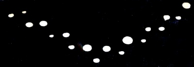

  
[Intangible Textual Heritage](../../index)  [UFOs](../index) 

------------------------------------------------------------------------

[Buy this Book at
Amazon.com](https://www.amazon.com/exec/obidos/ASIN/1605970301/internetsacredte)

------------------------------------------------------------------------

<table width="75%">
<colgroup>
<col style="width: 100%" />
</colgroup>
<tbody>
<tr class="odd">
<td width="50%" data-valign="TOP"> 
The Lubbock Lights
<h1 id="the-report-on-unidentified-flying-objects" data-align="CENTER">The Report on Unidentified Flying Objects</h1>
<h2 id="by-edward-j.-ruppelt" data-align="CENTER">by Edward J. Ruppelt</h2>
<h4 id="section" data-align="CENTER">[1956]</h4></td>
</tr>
</tbody>
</table>

------------------------------------------------------------------------

[Contents](#contents)    [Start Reading](rufo00)    [Page
Index](pageidx)    [Text \[Zipped\]](rufotxt.zip)

------------------------------------------------------------------------

|                                                                                                                           |
|---------------------------------------------------------------------------------------------------------------------------|
|  |

This is Edward J. Ruppelt's memoir of his role in the seminal US Air
Force UFO study projects: Projects Sign, Grudge and Blue Book. According
to this account, he coined the acronym 'UFO' and put many of the
official procedures for reporting and studying UFOs in place. An
enjoyable read, this book captures the feel of working for the mid-20th
century US military. He describes the changing attitudes of the USAF
about UFOs during the early 1950s: wobbling between denial, ridicule,
paranoia, and genuine inquiry.

A key point of this book is to resolve doubts about the military's role.
Ruppelt makes a strong case that UFOs weren't a top secret weapons
system; the reports were not disinformation by intelligence agencies;
nor was there a concerted effort to cover up UFOs by the US government.
Ruppelt does recount many times when the brass tried to dismiss reports
without investigating them sufficiently. However, this comes across as
simply standard-issue military 'cover-your-ass' behavior, not a vast
conspiracy.

He gives unique details on some of the most impressive sightings on his
watch. These were largely witnessed by highly trained observers such as
radar operators, fighter and commercial pilots, astronomers, and other
scientists, often during the course of their official duties. The Air
Force group that Ruppelt worked for had access to data on top secret
balloon launches and test flights, so they were able to sort out which
reports could be explained in this way. He consulted with a wide range
of scientific specialists, many of whom were in favor of the
extraterrestrial hypothesis, and some who were skeptics.

Fully a quarter of the reports were still unexplained after this
rigorous filtering. Ruppelt is decidedly agnostic, but open-minded,
about the reality behind the 'unexplained' sightings. Unlike
[Keyhoe](../fsar/index), he does not claim that UFOs are interplanetary
spacecraft, only that this is one of the *possible* explanations. --J.B. Hare, May 13, 2008.

------------------------------------------------------------------------

 [Title Page and Front Matter](rufo00)  
[Foreword](rufo01)  
[Contents](rufo02)  
[Chapter One. Project Blue Book and the UFO Story](rufo03)  
[Chapter Two. The Era of Confusion Begins](rufo04)  
[Chapter Three. The Classics](rufo05)  
[Chapter Four. Green Fireballs, Project Twinkle, Little Lights, and
Grudge](rufo06)  
[Chapter Five. The Dark Ages](rufo07)  
[Chapter Six. The Presses Roll—The Air Force Shrugs](rufo08)  
[Chapter Seven. The Pentagon Rumbles](rufo09)  
[Chapter Eight. The Lubbock Lights, Unabridged](rufo10)  
[Chapter Nine. The New Project Grudge](rufo11)  
[Chapter Ten. Project Blue Book and the Big Build-Up](rufo12)  
[Chapter Eleven. The Big Flap](rufo13)  
[Chapter Twelve. The Washington Merry-Go-Round](rufo14)  
[Chapter Thirteen. Hoax or Horror?](rufo15)  
[Chapter Fourteen. Digesting the Data](rufo16)  
[Chapter Fifteen. The Radiation Story](rufo17)  
[Chapter Sixteen. The Hierarchy Ponders](rufo18)  
[Chapter Seventeen. What Are UFO's?](rufo19)  
