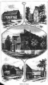

  
[Intangible Textual Heritage](../../index)  [Utopia](../index) 
[Index](index)  [Next](csus01) 

------------------------------------------------------------------------

[Buy this Book at
Amazon.com](https://www.amazon.com/exec/obidos/ASIN/0486215806/internetsacredte)

------------------------------------------------------------------------

*The Communistic Societies of the United States*, by Charles Nordhoff,
\[1875\], at Intangible Textual Heritage

------------------------------------------------------------------------

# THE COMMUNISTIC SOCIETIES

###### OF

## THE UNITED STATES

###### FROM PERSONAL VISIT AND OBSERVATION

###### INCLUDING DETAILED ACCOUNTS OF THE

###### ECONOMISTS, ZOARITES, SHAKERS, THE AMANA, ONEIDA, BETHEL, AURORA, ICARIAN, AND OTHER EXISTING SOCIETIES, THEIR RELIGIOUS CREEDS, SOCIAL PRACTICES, NUMBERS, INDUSTRIES, AND PRESENT CONDITION.

## BY CHARLES NORDHOFF

#### New York, Harper & brothers

#### \[1875\]

[  
Click to enlarge](img/front.jpg)  
VIEWS IN ZOAR  

------------------------------------------------------------------------

[Next: Table of Contents](csus01)
