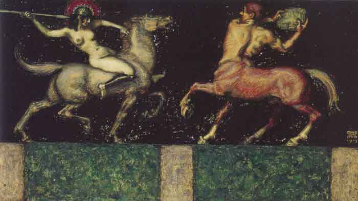

  
[Intangible Textual Heritage](../../index)  [Women](../index) 

------------------------------------------------------------------------

<table width="75%">
<colgroup>
<col style="width: 50%" />
<col style="width: 50%" />
</colgroup>
<tbody>
<tr class="odd">
<td data-valign="CENTER" width="50%"></td>
<td data-valign="CENTER" width="50%"><h1 id="the-amazons" data-align="CENTER">The Amazons</h1>
<h2 id="by-guy-cadogan-rothery" data-align="CENTER">by Guy Cadogan Rothery</h2>
<h4 id="section" data-align="CENTER">[1910]</h4></td>
</tr>
</tbody>
</table>

------------------------------------------------------------------------

With all of the oceans of ink spilled over subjects such as
[Atlantis](../../atl/index), Bigfoot and [UFOs](../../ufo/index), not to
mention the pop culture awareness created by the *Xena, Warrior
Princess* TV series, I find it surprising that there are so few books
devoted to the Amazons. The legend of the Amazons is amazingly
consistent across three continents, even though actual documentary proof
seems elusive. In particular, the Athenians were most insistent about
the historical reality of a nation of all-women warriors; their legends
described a prehistoric conflict with the Amazons as one of their finest
hours. Although later the Amazons became just another map-filling
imaginary creature alongside Centaurs, Cyclops, and Giants, Greek legend
gives many fine-grained details about the geography, history and
anthropology of the Amazon nation. It would be most interesting to see
if any of these can be verified using modern techniques.

J. B. Hare

------------------------------------------------------------------------

[Title Page](ama00)  
[Contents](ama01)  
[Chapter I: Introductory](ama02)  
[Chapter II. The Amazons of Antiquity](ama03)  
[Chapter III: The Amazons of Antiquity--(continued)](ama04)  
[Chapter IV: Amazons in Far Asia](ama05)  
[Chapter V: Modern Amazons of the Caucasus](ama06)  
[Chapter VI: Amazons of Europe](ama07)  
[Chapter VII: Amazons of Africa](ama08)  
[Chapter VIII: Amazons of America](ama09)  
[Chapter IX: The Amazon Stones](ama10)  
[Chapter X: Conclusion](ama11)  
