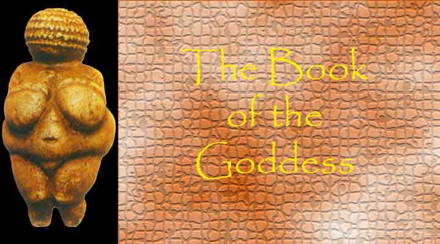

  
[Intangible Textual Heritage](../../index)  [Women](../index) 

------------------------------------------------------------------------

<table width="75%">
<colgroup>
<col style="width: 50%" />
<col style="width: 50%" />
</colgroup>
<tbody>
<tr class="odd">
<td width="50%" data-valign="TOP"> 
</td>
<td width="50%" data-valign="TOP"><h1 id="book-of-the-goddess" data-align="CENTER">Book of the Goddess</h1>
<h2 id="by-anna-livia-plurabelle" data-align="CENTER">by Anna Livia Plurabelle</h2>
<h4 id="alp" data-align="CENTER">© 2002, ALP</h4></td>
</tr>
</tbody>
</table>

------------------------------------------------------------------------

[Title Page](bog00)  
[Preface](bog01)  

### The Nine Principles of the Goddess

[The Nine Principles of the Goddess](bog02)  

### Genesis

[Genesis](bog03)  

### The Names of the Goddess

[The Names of the Goddess](bog04)  

### Hymns to the One Goddess

[I](bog05)  
[II](bog06)  
[III](bog07)  
[IV](bog08)  
[V](bog09)  

### Hymns to the Ennead

[Hymns to the Ennead](bog10)  
[Amaterasu](bog11)  
[Kali](bog12)  
[Selene](bog13)  
[Gaia](bog14)  
[Demeter](bog15)  
[Athena](bog16)  
[Maria](bog17)  
[Aphrodite](bog18)  
[Eris](bog19)  
[The Testament of Gaia](bog20)  

### Commentary

[Introduction](bog21)  
[First Principle: Amaterasu](bog22)  
[Second Principle: Kali](bog23)  
[Third Principle: Selene](bog24)  
[Fourth Principle: Gaia](bog25)  
[Fifth Principle: Demeter](bog26)  
[Sixth Principle: Athena](bog27)  
[Seventh Principle: Maria](bog28)  
[Eighth Principle: Aphrodite](bog29)  
[Ninth Principle: Eris](bog30)  
[Coda: The Goddess Prayer](bog31)  
