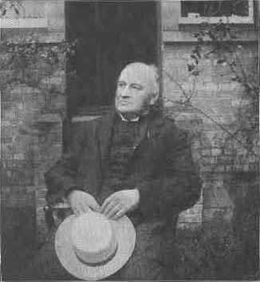

[Intangible Textual
Heritage](../../index) [Journals](../../journals/index) [Zoroastrianism](../index)

------------------------------------------------------------------------

# Miscellaneous Short Zoroastrian Texts

<table data-cellpadding="5">
<colgroup>
<col style="width: 50%" />
<col style="width: 50%" />
</colgroup>
<tbody>
<tr class="odd">
<td data-valign="TOP"></td>
<td rowspan="2" data-valign="TOP">The texts gathered here are not Zoroastrian <em>per se</em>, but rather a series of articles by Lawrence H. Mills expounding on some key ideas of Zoroastrian thought. Mills was one of the foremost western scholars of Zoroastrianism in the Victorian era, and his translations make up a large portion of those freely available on the internet. Like most of the Orientalists of his time, Mills makes no apologies for being a Christian scholar of foreign religion. However, as can be seen from these articles, he held Zarathushtra and his religion in very high (even holy) esteem, and they read more like sermons than encylopedia entries. These were originally published from 1907-1910 in <em>The Open Court</em> magazine. 
  
Last updated August 29, 2002.</td>
</tr>
<tr class="even">
<td data-valign="TOP">Lawrence H. Mills at seventy 
from <em>The Open Court</em>, vol. XXI, 3, p. 189 [1907].</td>
</tr>
</tbody>
</table>

------------------------------------------------------------------------

[God and His Immortals](../../journals/oc/lm-ghi1) (vol. XXI, 1, pp.
33-42) \[1907\]  
[God and His Immortals: Their Counterparts](../../journals/oc/lm-ghi2)
(vol. XXI, 3, pp. 164-168) \[1907\]  
[God Hypothetically Conceived As More Than
Personal](../../journals/oc/lm-gmp) (vol. XXI, 9, pp. 547-556)
\[1907\]  
[God and the World Physical](../../journals/oc/lm-gwp) (vol. XXII, 4,
pp. 216-223) \[1908\]  
   
**see also Mills' short commentary on Rumi:**  
["God Has No Opposite"](../../journals/oc/lm-ghno) (vol. XXII, 10, pp.
577-580) \[1908\]  

------------------------------------------------------------------------

[Intangible Textual
Heritage](../../index) [Journals](../../journals/index) [Zoroastrianism](../index)
