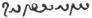
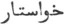
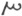

  
[Intangible Textual Heritage](../../index)  [Zoroastrianism](../index) 
[Index](index)  [Previous](sbe0405)  [Next](sbe0407) 

------------------------------------------------------------------------

[Buy this Book at
Amazon.com](https://www.amazon.com/exec/obidos/ASIN/1402185790/internetsacredte)

------------------------------------------------------------------------

*The Zend Avesta, Part I (SBE04)*, James Darmesteter, tr. \[1880\], at
Intangible Textual Heritage

------------------------------------------------------------------------

## CHAPTER V.

### THE VENDÎDÂD.

§ 1. According to Parsi tradition the Vendîdâd [3](#fn_243) is the only Nosk, out of the twenty-one,
that was preserved in its entirety [4](#fn_244). This is a statement to which it is
difficult to trust; for, if there is anything that shows how right the
Parsis are in admitting that the Avesta is only a collection of
fragments, it is just the fragmentary character of the Vendîdâd.

The Vendîdâd has often been described as the book of the laws of the
Parsis; it may be more exactly called the code, of purification, a
description, however, which is itself only so far correct that the laws
of purification are the object of the largest part of the book.

p. lxxxiv

The first two chapters deal with mythical matter, without any direct
connection with the general object of the Vendîdâd, and are remnants of
an old epic and cosmogonic literature. The first deals with the
creations and counter-creations of Ahura Mazda and Angra Mainyu; the
second speaks of Yima, the founder of civilisation. Although there was
no particular reason for placing them in the Vendîdâd, as soon as they
were admitted into it they were put at the beginning, because they
referred to the first ages of the world. Three chapters of a mythical
character, about the origin of medicine, were put at the end of the
book, for want of any better place, but might as well have been kept
apart [1](#fn_245), as was the so-called
Hadhokht Nosk fragment. There is also another mythical Fargard, the
nineteenth, which, as it treats of the revelation of the law by Ahura to
Zarathu*s*tra, would have been more suitably placed at the beginning of
the Vendîdâd proper, that is, as the third Fargard.

The other seventeen chapters deal chiefly with religious observances,
although mythical fragments, or moral digressions, are met with here and
there, which are more or less artificially connected with the text, and
which were most probably not written along with the passages which they
follow [2](#fn_246).

§ 2. A rough attempt at regular order appears in these seventeen
chapters: nearly all the matter contained in the eight chapters from V
to XII deals chiefly with impurity from the dead and the way of
dispelling it; but the subject is again treated, here and there, in
other Fargards [3](#fn_247), and matter
irrelevant to the subject has also found its way into these same eight
Fargards [4](#fn_248). Fargards XIII and XIV
are devoted to the dog, but must be completed with a part of the XVth.
Fargards XVI, XVII, and most part of XVIII deal with several sorts of
uncleanness, and their proper

p. lxxxv

place should rather have been after the XIIth Fargard. Fargard III is
devoted to the earth [1](#fn_249); Fargard IV
stands by itself, as it deals with a matter which is treated only there,
namely, civil and penal laws [2](#fn_250).

No better order prevails within these several parts prescriptions on one
and the same subject are scattered about through several Fargards,
without any subject being treated at once in a full and exhaustive way;
and this occasions needless repetitions [3](#fn_251).

The main cause of this disorder was, of course, that the advantage of
order is rarely felt by Orientals; but it was further promoted by the
very form of exposition adopted by the first composers of the Vendîdâd.
The law is revealed by Ahura in a series of answers to questions put to
him by Zarathu*s*tra [4](#fn_252); and as these
questions are not of a general character, but refer to details, the
matter is much broken into fragments, each of which, consisting of a
question with its answer, stands by itself, as an independent passage.

We shall treat in the following pages, first of the laws of
purification, then of the civil laws, and, lastly, of the penalties both
religious and civil.

### A.

§ 3. The first object of man is purity, yao*z*d*a*u: 'purity is for man,
next to life, the greatest good [5](#fn_253).'

Purity and impurity have not in the Vendîdâd the exclusively spiritual
meaning which they have in our languages: they do not refer to an inward
state of the

p. lxxxvi

person, but chiefly to a physical state of the body. Impurity or
uncleanness may be described as the state of a person or thing that is
possessed of the demon; and the object of purification is to expel the
demon.

The principal means by which uncleanness enters man is death, as death
is the triumph of the demon.

When a man dies, as soon as the soul has parted from the body, the
Dru*g* Nasu or Corpse-Dru*g* falls upon the dead from the regions of
hell, and whoever thenceforth touches the corpse becomes unclean, and
makes unclean whomsoever he touches [1](#fn_254).

The Dru*g* is expelled from the dead by means of the Sag-dîd, 'the look
of the dog:' 'a four-eyed dog' or a white one with yellow ears' is
brought near the body and is made to look at the dead; as soon as he has
done so, the Dru*g* flees back to hell [2](#fn_255).

The Dru*g* is expelled from the living, whom she has seized through
their contact with the dead, by a process of washings with ox's urine
(gômêz or nîrang) and with water, combined with the Sag-dîd [3](#fn_256).

The real import of these ceremonies is shown by the spells which
accompany their performance: 'Perish, O fiendish Dru*g*! Perish, O brood
of the fiend! Perish, O world of the fiend! Perish away, O Dru*g*! Rush
away, O Dru*g*! Perish away, O Dru*g*! Perish away to the regions of the
north, never more to give unto death the living world of the holy
spirit!'

Thus, in the death of a man, there is more involved than the death of
one man: the power of death, called forth from hell, threatens from the
corpse, as from a stronghold, the whole world of the living, ready to
seize whatever may fall within his reach, and 'from the dead defiles the
living, from the living rushes upon the living.' When a man dies in a
house, there is danger for three days lest somebody else should die in
that house [4](#fn_257).

p. lxxxvii

The notion or feeling, out of which these ceremonies grew was far from
unknown to the other Indo-European peoples what was peculiar to Mazdeism
was that it carried it to an extreme, and preserved a clearer sense of
it, while elsewhere it grew dimmer and dimmer, and faded away. In fact,
when the Greek, going out of a house where a dead man lay, sprinkled
himself with water from the ἀρδανίον at the door, it was death that he
drove away from himself. The Vedic Indian, too, although his rites were
intended chiefly for the benefit of the dead, considered himself in
danger and, while burning the corpse, cried aloud: 'Away, go away, O
Death! injure not our sons and our men!' (Rig-veda X, 18, 1.)

§ 4. As to the rites by means of which the Dru*g* is expelled, they are
the performance of myths. There is nothing in worship but what existed
before in mythology. What we call a practice is only an imitation of
gods, an ὁμοίωσις θεῷ, as man fancies he can bring about the things he
wants, by performing the acts which are supposed to have brought about
things of the same kind when practised by the gods.

The Parsis, being at a loss to find four-eyed dogs, interpret the name
as meaning a dog with two spots above the eyes [1](#fn_258): but it is clear that the two-spotted
dog's services are only accepted for want of a four-eyed one; or of a
white one with yellow ears, which amounts to saying that there were
myths, according to which the death-fiend was driven away by dogs of
that description. This reminds one at once of the three-headed Kerberos,
watching at the doors of hell, and, still more, of the two brown,
four-eyed dogs of Yama, who guard the ways to the realm of death [2](#fn_259).

The identity of the four-eyed dog of the Parsi with Kerberos and Yama's
dogs appears, moreover, from the Parsi tradition that the yellow-eared
dog watches at the

p. lxxxviii

head of the *K*inva*t* bridge, which leads from this to the next world,
and with his barking drives away the fiend from the souls of the holy
ones, lest he should drag them to hell [1](#fn_260).

Wherever the corpse passes by, death walks with it; all along the way it
has gone, from the house to its last resting-place, a spirit of death is
breathing and threatening the living. Therefore, no man, no flock, no
being whatever that belongs to the world of Ahura, is allowed to pass by
that way until the deadly breath, that blows through it, has been blown
away to hell [2](#fn_261). The four-eyed dog is
made to go through the way three times, or six times, or nine times,
while the priest helps the look of the dog with his spells, dreaded by
the Dru*g*.

§ 5. The use of gômêz in cleansing the unclean is also derived from old
mythic conceptions [3](#fn_262). The storm
floods that cleanse the sky of the dark fiends in it were described in a
class of myths as the urine of a gigantic animal in the heavens. As the
floods from the bull above drive away the fiend from the god, so they do
from man here below, they make him 'free from the death-demon'
(frânasu), and the death-fiend flees away hellwards, pursued by the
fiend-smiting spell: 'Perish thou, O Dru*g* . . . , never more to give
over to Death the living world of the good spirit!'

§ 6. As uncleanness is nothing else than the contagion of death, it is
at its greatest intensity when life is just departing. The Nasu at that
moment defiles ten persons around the

p. lxxxix

corpse [1](#fn_263) when a year is over, the
corpse defiles no longer [2](#fn_264). Thus the
notion of uncleanness is quite the reverse of what thought elsewhere:
the corpse, when rotten, is less unclean than the body still all but
warm with life; death defiles least when it looks most hideous, and
defiles most when it might look majestic. The cause is that in the
latter case the death-demon has just arrived in the fulness of his
strength, whereas in the former case time has exhausted his power.

§ 7. As the focus of the contagion is in the corpse, it must be disposed
of so that death may not spread abroad. On this point the old
Indo-European customs have been completely changed by Mazdeism. The
Indo-Europeans either burnt the corpse or buried it: both customs are
held to be sacrilegious in the Avesta.

§ 8. This view originated from the notion of the holiness of the
elements being pushed to an extreme. The elements, fire, earth, and
water are holy, and during the Indo-Iranian period they were already
considered so, and in the Vedas they are worshipped as godlike beings.
Yet this did not prevent the Indian from burning his dead; death did not
appear to him so decidedly a work of the demon, and the dead man was a
traveller to the other world, whom the fire kindly carried to his
heavenly abode 'on his undecaying, flying pinions, wherewith he killed
the demons.' The fire was in that, as in the sacrifice, the god that
goes from earth to heaven, from man to god, the mediator, the god most
friendly to man. In Persia it remains more distant from him; being an
earthly form of the eternal, infinite, godly light [3](#fn_265), no death, no uncleanness can be allowed
to enter it, as it is here below the purest offspring of the good
spirit, the purest part of his pure creation. Its only function is to
repel the fiends with its bright blazing. In every place where Parsis
are settled, an everlasting fire is kept, the Bahrâm fire, which,
'preserved by a more than Vestal

p. xc

care [1](#fn_266),' and ever fed with perfumes
and dry well-blazing wood, whichever side its flames are brought by the
wind, it goes and kills thousands and thousands of fiends, as Bahrâm
does in heaven [2](#fn_267). If the necessities
of life oblige us to employ fire for profane uses, it must be only for a
time an exile on our hearth, or in the oven of the potter, and it must
go thence to the Right-Place of the fire (Dâityô Gâtu), the altar of the
Bahrâm fire, there to be restored to the dignity and rights of its
nature [3](#fn_268).

At least, let no gratuitous and wanton degradation be inflicted upon it:
even blowing it with the breath of the mouth is a crime [4](#fn_269); burning the dead is the most heinous of
sins: in the times of Strabo it was a capital crime [5](#fn_270), and the Avesta expresses the same, when
putting it in the number of those sins for which there is no
atonement [6](#fn_271).

Water was looked upon in the same light. Bringing dead matter to it is
as bad as bringing it to the fire [7](#fn_272).
The Magi are said to have overthrown a king for having built
bath-houses, as they cared more for the cleanness of water than for
their own [8](#fn_273).

§ 9. Not less holy was the earth, or, at least, it became so. There was
a goddess who lived in her, Spe*n*ta Ârmaiti [9](#fn_274); no corpse ought to defile her sacred
breast: burying the dead is, like burning the dead, a deed for which
there is no atonement [10](#fn_275). It was not
always so in Persia. the burning of the dead had been forbidden for

p. xci

years [1](#fn_276), while the burying was still
general [2](#fn_277). Cambyses had roused the
indignation of the Persians by burning the corpse of Amasis: yet, years
later, Persians still buried their dead. But the priests already felt
scruples, and feared to defile a god. Later on, with the ascendancy of
the Magian religion, the sacerdotal observances became the general
law [3](#fn_278).

§ 10. Therefore the corpse is laid on the summit of a mountain, far from
man, from water, from tree, from fire, and from the earth itself, as it
is separated from it by a layer of stones or bricks [4](#fn_279). Special buildings, the Dakhmas, were
erected for this purpose [5](#fn_280). There
far from the world the dead were left to lie, beholding the sun [6](#fn_281).

§ 11. Not every corpse defiles man, but only those of such beings as
belong to the world of Ahura. They are the only ones in whose death the
demon triumphs, The corpse of an Ahrimanian creature does not defile; as
its life was incarnate death, the spring of death that was in it is
dried up with its last breath: it killed while alive, it can

p. xcii

do so no more when dead; it becomes clean by dying [1](#fn_282). None of the faithful are defiled by the
corpse of an Ashemaogha or of a Khrafstra. Nay, killing them is a pious
work, as it is killing Ahriman himself [2](#fn_283).

§ 12. Not only real death makes one unclean, but partial death too.
Everything that goes out of the body of man is dead, and becomes the
property of the demon. The going breath is unclean, it is forbidden to
blow the fire with it [3](#fn_284), and even to
approach the fire without screening it from the contagion with a
Penôm [4](#fn_285). Parings of nails and
cuttings or shavings of hair are unclean, and become weapons in the
hands of the demons unless they have been protected by certain rites and
spells [5](#fn_286). Any phenomenon by which
the bodily nature is altered, whether accompanied with danger to health
or not, was viewed as a work of the demon, and made the person unclean
in whom it took place. One of these phenomena, which is a special object
of attention in the Vendîdâd, is the uncleanness of women during their
menses. The menses are sent by Ahriman [6](#fn_287), especially when they last beyond the
usual time: therefore a woman, as long as they last, is unclean and
possessed of the demon: she must be kept confined, apart from the
faithful whom her touch would defile, and from the fire which her very
look would injure; she is not allowed to eat as much as she wishes, as
the strength she might acquire would accrue to the fiends. Her food is
not given to her from hand to hand, but is passed to her from a
distance [7](#fn_288), in a long leaden spoon.
The origin of all these notions is in certain physical instincts, in
physiological psychology, which is the reason why they are found among
peoples very far removed from one another by race or religion [8](#fn_289). But they took in Persia a new meaning
as they were made a logical part of the whole religious system.

§ 13. A woman that has been just delivered of a child

p. xciii

is also unclean [1](#fn_290), although it would
seem that she ought to be considered pure amongst the pure, since life
has been increased by her in the world, and she has enlarged the realm
of Ormazd. But the strength of old instincts overcame the drift of new
principles. Only the case when the woman has been delivered of a
still-born child is examined in the Vendîdâd. She is unclean as having
been in contact with a dead creature; and she must first drink gômêz to
wash over the grave in her womb. So utterly unclean is she, that she is
not even allowed to drink water, unless she is in danger of death; and
even then, as the sacred element has been defiled, she is liable to the
penalty of a Peshôtanu [2](#fn_291). It appears
from modern customs that the treatment is the same when the child is
born alive: the reason of which is that, in any case, during the first
three days after delivery she is in danger of death [3](#fn_292). A great fire is lighted to keep away
the fiends, who use then their utmost efforts to kill her and her
child [4](#fn_293). She is unclean only because
the death-fiend is in her.

§ 14. Logic required that the sick man should be treated as an unclean
one, that is, as one possessed. Sickness, being sent by Ahriman, ought
to be cured like all his other works, by washings and spells. In fact,
the medicine of spells was considered the most powerful of all [5](#fn_294), and although it did not oust the
medicine of the lancet and that of drugs, yet it was more highly
esteemed and less mistrusted. The commentator on the Vendîdâd very
sensibly observes that if it does not relieve, it will surely do no
harm [6](#fn_295), which seems not to have been
a matter of course with those who heal by the knife and physic. It

p. xciv

appears from the last Fargard that all or, at least, many diseases might
be cured by spells and Barashnûm washing. It appears from Herodotus and
Agathias that contagious diseases required the same treatment as
uncleanness: the sick man was excluded from the community of the
faithful [1](#fn_296), until cured and cleansed
according to the rites [2](#fn_297).

§ 15. The unclean are confined in a particular place, apart from all
clean persons and objects, the Armê*s*t-gâh [3](#fn_298), which may be described, therefore, as
the Dakhma for the living. All the unclean, all those struck with
temporary death, the man who has touched dead matter, the woman in her
menses, or just delivered of child, the leper [4](#fn_299), or the man who has made himself unclean
for ever by carrying a corpse alone [5](#fn_300), stay there all the time of their
uncleanness.

§ 16. Thus far for general principles. From the diversity of
circumstances arises a system of casuistry, the development of which may
be followed first through the glosses to the Vendîdâd, in which the
labours of several generations of theologians are embodied, and, later
on, through the Ravâets. We will give a few instances of it, as found in
the Vendîdâd itself.

The process of the cleansing varies according to the degree of
uncleanness; and, again, the degree of uncleanness depends on the state
of the thing that defiles and the nature of the thing that is defiled.

The uncleanness from the dead is the worst of all, and it is at its
utmost when contracted before the Nasu has been expelled from the corpse
by the Sag-dîd [6](#fn_301): it can be cured
only by means of the most complicated system of cleansing, the nine
nights’ Barashnûm [7](#fn_302).

p. xcv

If the Nasu has already been expelled from the corpse, as the defiling
power was less, a simple washing once made, the Ghosel, is enough [1](#fn_303).

The defiling power of the Nasu reaches farther, if the death has just
taken place, and if the dying creature occupied a higher rank in the
scale of beings [2](#fn_304); for the more
recent the victory of the demon, or the higher the being he has
overcome, the stronger he must have been himself.

Menstruous women are cleansed by the Ghosel [3](#fn_305).

As for things they are more or less deeply defiled according to their
degree of penetrability: metal vessels, can be cleansed, earthen vessels
cannot [4](#fn_306); leather is more easily
cleansed than woven cloth [5](#fn_307); dry
wood than soft wood [6](#fn_308). Wet matter is
a better conductor of uncleanness than dry matter, and corpses cease to
defile after a year [7](#fn_309).

### B.

§ 17. In the cases heretofore reviewed, only religious purposes are
concerned. There is another order of laws, in which, although religion
interferes, yet it is not at the root; namely, the laws about contracts
and assaults, to, which the fourth Fargard is devoted, and which are the
only remains extant of the civil and penal legislation of
Zoroastrianism.

The contracts were divided into two classes, according to their mode of
being entered into, and according to the value of their object [8](#fn_310). As to their mode they are
word-contracts or hand-contracts: as to their object, they are
sheep-contracts, ox-contracts, man-contracts, or field-contracts, which
being estimated in money value are contracts to the amount of 3, 12, 500
istîrs, and upwards [9](#fn_311).

No contract can be made void by the will of one party

p. xcvi

alone; he who breaks a contract is obliged to pay the value of the
contract next higher in value.

The family and the next of kin are, it would seem, answerable for the
fulfilment of a contract, a principle of the old Indo-European civil
law [1](#fn_312).

§ 18. Assaults are of seven degrees: âgerepta, avaoiri*s*ta [2](#fn_313), stroke, sore wound, bloody wound,
broken bone, and manslaughter. The gravity of the guilt does not depend
on the gravity of the deed only, but also on its frequency. Each of
these seven crimes amounts, by its being repeated without having been
atoned for, to the crime that immediately follows in the scale, so that
an âgerepta seven times repeated amounts to manslaughter.

### C.

§ 19. Every crime makes the guilty man liable to two penalties, one here
below, and another in the next world.

The penalty here below consists of a certain number of stripes with the
Aspahê-a*s*tra or the Sraoshô-*k*arana [3](#fn_314).

The unit for heavy penalties is two hundred stripes; the crime and the
criminal thus punished are called Peshô-tanu or Tanu-peretha (Parsi:
Tanâfûhr). The two words literally mean, 'one who pays with his own
body,' and 'payment with one's body,' and seem to have originally
amounted to

p. xcvii

\[paragraph continues\] 'worthy of death,
worthiness of death;' and in effect the word Peshôtanu is often
interpreted in the Pahlavi Commentary by margarzân, 'worthy of death.'
But, on the whole, it was attached to the technical meaning of 'one who
has to receive two hundred strokes with the horse-whip [1](#fn_315).' The lowest penalty in the Vendîdâd is
five stripes, and the degrees from five stripes to Peshôtanu are ten,
fifteen, thirty, fifty, seventy, ninety, two hundred. For instance,
âgerepta is punished with five stripes, avaoiri*s*ta with ten, stroke
with fifteen, sore wound with thirty, bloody wound with fifty, broken
bone with seventy, manslaughter with ninety; a second manslaughter,
committed without the former being atoned for, is punished with the
Peshôtanu penalty. In the same way the six other crimes, repeated eight,
or seven, or six, or five, or four, or three times make the committer go
through the whole series of penalties up to the Peshôtanu penalty.

§ 20. If one reviews the different crimes described in the Vendîdâd, and
the respective penalties prescribed for them, one cannot but wonder at
first sight at the strange inequality between crime and penalty.
Beccaria would have felt uncomfortable while reading the Vendîdâd. It is
safer to kill a man than to serve bad food to a shepherd's dog, for the
manslayer gets off with ninety stripes, whereas the bad master is at
once a Peshôtanu [2](#fn_316), and will receive
two hundred stripes. Two hundred stripes are awarded if one tills land
in which a corpse has been buried within the year [3](#fn_317), if a woman just delivered of child
drinks water [4](#fn_318), if one suppresses
the menses of a woman [5](#fn_319), if one
performs a sacrifice in a house where a man has just died [6](#fn_320), if one neglects fastening the corpse of
a dead man so that birds or dogs may not take dead matter to trees and
rivers [7](#fn_321). Two hundred stripes if one
throws on the ground a bone of a man's corpse, of a dog's carcase as big
as two ribs, four

p. xcviii

hundred if one throws a bone as big as a breast bone, six hundred if one
throws a skull, one thousand if the whole corpse [1](#fn_322). Four hundred stripes if one, being in a
state of uncleanness, touches water or trees [2](#fn_323), four hundred if one covers with cloth a
dead man's feet, six hundred if one covers his legs, eight hundred if
the whole body [3](#fn_324). Five hundred
stripes for killing a whelp, six hundred for killing a stray dog, seven
hundred for a house dog, eight hundred for a shepherd's dog [4](#fn_325), one thousand stripes for killing a
Vanhâpara dog, ten thousand stripes for killing a water dog [5](#fn_326).

Capital punishment is expressly pronounced only against the false
cleanser [6](#fn_327) and the 'carrier
alone [7](#fn_328).'

Yet any one who bethinks himself of the spirit of the old Aryan
legislation will easily conceive that there may be in its eyes many
crimes more heinous, and to be punished more severely, than
manslaughter: offences against man injure only one man; offences against
gods endanger all mankind. No one should wonder at the unqualified
cleanser being put to death who reads Demosthenes’ Neaera; the Persians
who defiled the ground by burying a corpse were not more severely
punished than the Greeks were for defiling with corpses the holy ground
of Delos [8](#fn_329), or than the conquerors
at Arginousae; nor would the Athenians, who put to death Atarbes [9](#fn_330), have much stared at the awful revenge
taken for the murder of the sacred dog. There is hardly any prescription
in the Vendîdâd, however odd and absurd it may seem, but has its
counterpart or its explanation in other Aryan legislations: if we had a
Latin or a Greek Vendîdâd, I doubt whether it would look more rational.

§ 21. Yet, if theoretically the very absurdity of its principles is
nothing peculiar to the Mazdean law, nay, is a proof of its
authenticity, it may be doubted whether it could

p. xcix

ever have been actually applied in the form stated in the texts. It may
be doubted whether the murder of a shepherd's dog could have been
actually punished with eight hundred stripes, much more whether the
murder of a water dog could have been really punished with ten thousand
stripes, unless we suppose that human endurance was different in ancient
Persia from what it is elsewhere, or even in modern Persia herself [1](#fn_331). Now as we see that in modern tradition
bodily punishment is estimated in money value, that is to say, converted
into fines, a conversion which is alluded to in the Pahlavi
translation [2](#fn_332), it may readily be
admitted that as early as the time of the last edition of the Vendîdâd,
that conversion had already been made. In the Ravâets, two hundred
stripes, or a Tanâfûhr, are estimated as equal to three hundred istîrs
or twelve hundred dirhems, or thirteen hundred and fifty rupees; a
stripe is therefore about equal to six rupees [3](#fn_333). How far that system prevailed in
practice, whether the guilty might take advantage of this commutation of
his own accord, or only with the assent of the judge, we cannot decide.
It is very likely that the riches of the fire-temples came for the most
part from that source, and that the sound of the dirhems often made the
Sraoshô-*k*arana fall from the hands of the Mobeds. That the system of
financial penalties did not, however, suppress the system of bodily
penalties, appears from the customs of the Parsis who apply both, and
from the Pahlavi Commentary which expressly distinguishes three sorts of
atonement: the atonement by money (khvâstak), the atonement by the
Sraoshô-*k*arana, and the atonement by cleansing.

§ 22. This third element of atonement is strictly religious. It consists
in repentance, which is manifested by avowal of the guilt and by the
recital of a formula of repentance,

p. c

the Patet. The performance of the Patet has only a religious effect: it
saves the sinner from penalties in the other world, but not from those
here below: it delivers him before God, but not before man. When the
sacrilegious cleanser has repented his sin, he is not the less flayed
and beheaded, but his soul is saved [1](#fn_334). Yet, although it has no efficacy in
causing the sin to be remitted, the absence of it has power to cause it
to be aggravated [2](#fn_335).

§ 23. Thus far for sins that can be atoned for. There are some that are
anâperetha, 'inexpiable,' which means, as it seems, that they are
punished with death here below, and with torments in the other world.

Amongst the anâperetha sins are named the burning of the dead, the
burying of the dead [3](#fn_336), the eating
dead matter [4](#fn_337), unnatural sin [5](#fn_338), and self-pollution [6](#fn_339). Although it is not expressly declared
that these sins were punished with death, yet we know it of several of
them, either from Greek accounts or from Parsi tradition. There are also
whole classes of sinners whose life, it would seem, can be taken by any
one who detects them in the act, such as the courtezan, the highwayman,
the Sodomite, and the corpse-burner [7](#fn_340).

§ 24. Such are the most important principles of the Mazdean law that can
be gathered from the Vendîdâd. These details, incomplete as they are,
may give us an idea, if not of the Sassanian practice, at least of the
Sassanian ideal. That it was an ideal which intended to pass into
practice, we know from the religious wars against Armenia, and from the
fact that very often the superintendence of justice and the highest
offices of the state were committed to Mobeds.

We must now add a few words on the plan of the following translation. As
to our method we beg to refer to the second chapter above. It rests on
the Parsi tradition, corrected or confirmed by the comparative method.
The

p. ci

\[paragraph continues\] Parsi tradition is
found in the Pahlavi Commentary [1](#fn_341),
the understanding of which was facilitated to us first by the Gujarathi
translation and paraphrase of Aspendiârji [2](#fn_342), and by a Persian transliteration and
translation belonging to the Haug collection in Munich [3](#fn_343), for the use of which we were indebted
to the obliging kindness of the Director of the State Library in Munich,
Professor von Halm. The Ravâets and the Saddar [4](#fn_344) frequently gave us valuable information
as to the traditional meaning of doubtful passages. As for the works of
European scholars, we are much indebted to the Commentary on the Avesta
by Professor Spiegel, and to the translations in the second edition of
Martin Haug's Essays.

We have followed the text of the Avesta as given by Westergaard; the
division into paragraphs is according to Westergaard; but we have given
in brackets the corresponding divisions of Professor Spiegel's edition.

Many passages in the Vendîdâd Sâdah are mere quotations from the Pahlavi
Commentary which have crept into the Sâdah text: we have not admitted
them into the text. They are generally known to be spurious from their
not being translated in the Commentary [5](#fn_345): yet the absence of a Pahlavi
translation is not always an unmistakable sign of such spuriousness.
Sometimes the translation has been lost in our manuscripts, or omitted
as having already been given in identical or nearly identical terms.
When we thought

p. cii

that this was the case, we have admitted the untranslated passages into
the text, but in brackets [1](#fn_346).

We have divided the principal Fargards into several sections according
to the matter they contain: this division, which is meant as an attempt
to resolve the Vendîdâd into its primitive fragments, has, of course, no
traditional authority, the divisions into paragraphs being the only ones
that rest upon the authority of the manuscripts.

The translation will be found, in many passages, to differ greatly from
the translations published heretofore [2](#fn_347). The nature of this series of
translations did not allow us to give full justificatory notes, but we
have endeavoured in most cases to make the explanatory notes account to
scholars for the new meanings we have adopted, and, in some cases, we
hope that the original text, read anew, will by itself justify our
translation [3](#fn_348).

We must not conclude this introduction without tendering our warmest
thanks to Mr. E. W. West, who kindly revised the MS. of the translation
before it went to press, and who has, we hope, succeeded in making our
often imperfect English more acceptable to English readers.

JAMES DARMESTETER.

     PARIS,  
November, 1879.

------------------------------------------------------------------------

### Footnotes

[lxxxiii:3](sbe0406.htm#fr_245) The word
Vendîdâd is a corruption of Vîdaêvô-dâtem (dâtem), 'the anti-demoniac
law.' It is sometimes applied to the whole of the law (Vendîdâd Sâdah).

[lxxxiii:4](sbe0406.htm#fr_246) See above, [p.
xxxii](sbe0404.htm#page_xxxii).

[lxxxiv:1](sbe0406.htm#fr_247) As an
introduction to a code of laws on physicians; see Farg. VII, 36-44.

[lxxxiv:2](sbe0406.htm#fr_248) For instance,
Farg. V, 15-20; III, 24-29; 30-32; 33; IV, 47-49.

[lxxxiv:3](sbe0406.htm#fr_249) III, 14-22; 36
seq.; XIX, 11-25.

[lxxxiv:4](sbe0406.htm#fr_250) The passages on
medicine (VII, 36-44), and on the sea Vouru-kasha 15-20).

[lxxxv:1](sbe0406.htm#fr_251) It contains two
digressions, the one on funeral laws, the other on husbandry. See Farg.
III, Introd.

[lxxxv:2](sbe0406.htm#fr_252) It contains one
digression on physical weal, which must have belonged originally to
Farg. III. See Farg. IV. Introd.

[lxxxv:3](sbe0406.htm#fr_253) V, 27-30 = VII,
6-9; V, 45-54 = VII, 60-69; V, 57-62 = VII, 17-22.

[lxxxv:4](sbe0406.htm#fr_254) The outward form
of the Vendîdâd has been often compared with that of the Books of Moses.
But in reality, in the Bible, there is no conversation between God and
the lawgiver: the law comes down unasked, and God gives commands, but
gives no answers. In the Vendîdâd, on the contrary, it is the wish of
man, not the will of God, that is the first cause of the revelation. Man
must ask of Ahura, who knows everything, and is pleased to answer
(XVIII, 13 seq.); the law is 'the question to Ahura,' âhuri frasnô.

[lxxxv:5](sbe0406.htm#fr_255) Farg. V, 21, from
Yasna XLVIII (XLVII), 5.

[lxxxvi:1](sbe0406.htm#fr_256) Farg. VII, 1
seq.

[lxxxvi:2](sbe0406.htm#fr_257) In the shape of
a fly. 'The fly that came to the smell of the dead body was thought to
be the corpse-spirit that came to take possession of the dead in the
name of Ahriman' (Justi, Persien, p. 88).

[lxxxvi:3](sbe0406.htm#fr_258) Farg. VIII,
35-72; IX, 12-36.

[lxxxvi:4](sbe0406.htm#fr_259) Saddar 78.

[lxxxvii:1](sbe0406.htm#fr_260) In practice
they are still less particular: 'the Sag-dîd may be performed by a
shepherd's dog, by a house dog, by a Vohunazga dog (see Farg. XIII, 19,
n.), or by a young dog (a dog four months old), Comm. ad Farg. VII, 2.
As birds of prey are as fiend-smiting as the dog (see above, [p.
lxxiii](sbe0405.htm#page_lxxiii), n. [4](sbe0405.htm#fn_216)), they are
Nasu-smiters like him, and one may appeal to their services, when there
is no dog at hand (see Farg. VII, 3, n. 5).

[lxxxvii:2](sbe0406.htm#fr_261) Rig-veda X, 14,
10 seq.

[lxxxviii:1](sbe0406.htm#fr_262) Gr. Rav. p.
592. Allusions to this myth are found in Farg. XIII, 9, and XIX, 30. The
Commentary ad Farg. XIII, 17 has: 'There are dogs who watch over the
earthly regions: there are others who watch over the fourteen heavenly
regions.' The birth of the yellow-eared dog is described in the Ravâet
(l.c.) as follows: 'Ormazd, wishing to keep the body of the first man,
Gayômart, from the assaults of Ahriman, who tried to kill him, cried
out: "O thou-yellow-eared dog, arise!" and directly the dog barked and
shook his two ears; and the unclean Satan and the fiends, when they saw
the dreadful looks of the yellow-eared dog, and heard his barking, were
sore afraid and fled down to hell.'

[lxxxviii:2](sbe0406.htm#fr_263) Farg. VIII,
14-22.

[lxxxviii:3](sbe0406.htm#fr_264) Orm. Ahr.
§124. The use of gômêz has been lately found to be known in
Basse-Bretagne (Luzel, Le Nirang des Parsis en Basse-Bretagne, Mélusine,
493).

[lxxxix:1](sbe0406.htm#fr_265) Farg. V, 27; cf.
n. 5.

[lxxxix:2](sbe0406.htm#fr_266) Farg. VIII,
33-340

[lxxxix:3](sbe0406.htm#fr_267) Ignem coelitus
delapsum (Ammian. Marcel. XXVII, 6); Cedrenus; Elisaeus; Recogn.
Clement. IV, 29; Clem. Homil. IX, 6; Henry Lord.

[xc:1](sbe0406.htm#fr_268) J. Fryer, A New
Account of East India and Persia, 1698, p. 265.

[xc:2](sbe0406.htm#fr_269) Farg. VIII, 81-96;
79-80. Cf. above, p. lxiv.

[xc:3](sbe0406.htm#fr_270) Extinguishing it is
a mortal sin (Ravâets; Elisaeus; cf. Strabo XV, 14).

[xc:4](sbe0406.htm#fr_271) A custom still
existing with the Tâzîk, an Iranian tribe in Eastern Persia (de
Khanikoff, Ethnographie de la Perse). Strabo XV, 14. Manu has the same
prescription (IV, 53). Cf. Farg. XIV, 8, n. 7.

[xc:5](sbe0406.htm#fr_272) Strabo XV, 14; cf.
Herod. III, 16.

[xc:6](sbe0406.htm#fr_273) Farg. I, 17; cf.
Farg. VIII, 74.

[xc:7](sbe0406.htm#fr_274) Farg. VII, 25-27;
Strabo XV, 14; Herod. I, 138.

[xc:8](sbe0406.htm#fr_275) King Balash (Josué
le Stylite, traduction Martin, § xx). It seems as if there were a
confusion between Balash and Kavât; at any rate, it shows that bathing
smacked of heresy. Jews were forbidden to perform the legal ablutions
(Fürst, Culturgeschichte der Juden, 9).

[xc:9](sbe0406.htm#fr_276) See above, [p.
lxxii](sbe0405.htm#page_lxxii).

[xc:10](sbe0406.htm#fr_277) Farg. I, 13.

[xci:1](sbe0406.htm#fr_278) From the reign of
Cyrus (cf. above, [p. li](sbe0404.htm#page_li)).

[xci:2](sbe0406.htm#fr_279) Cf. above, [p.
xlv](sbe0404.htm#page_xlv).

[xci:3](sbe0406.htm#fr_280) Still the worship
of the earth seems not to have so deeply penetrated the general religion
as the worship of fire, The laws about the disposal of the dead were
interpreted by many, it would seem, as intended only to secure the
purity of water and fire, and they thought that they might be at peace
with religion if they had taken care to bury the corpse, so that no part
of it might be taken by animals to fire or water (Farg. III, 41, n, 7).

[xci:4](sbe0406.htm#fr_281) Farg, VI, 44 seq.;
VIII, 10, seq. Cf. IX, 11, n 4. Moreover, the Dakhma is ideally
separated from the ground by means of a golden thread, which is supposed
to keep it suspended in the air (Ravâet, ap. Spiegel, Uebersetzung des
Avesta II, XXXVI).

[xci:5](sbe0406.htm#fr_282) 'The Dakhma is a
round building, and is designated by some writers, "The Tower of
Silence." A round pit, about six feet deep, is surrounded by an annular
stone pavement, about seven feet wide, on which the dead bodies are
placed. This place is enclosed all round by a stone wall some twenty
feet high, with a small door on one side for taking the body in. The
whole is built up of and paved with stone. The pit has communication
with three or more closed pits, at some distance into which the rain
washes out the liquids and the remains of the dead bodies' (Dadabhai
Naoroji, The Manners and Customs of the Parsees, Bombay, 1864, p. 16).
Cf. Farg. VI. 50. A Dakhma is the first building the Parsis erect when
settling on a new place (Dosabhoy Framjee).

[xci:6](sbe0406.htm#fr_283) The Avesta and the
Commentator attach great importance to that point: it is as if the dead
man's life were thus prolonged, since he can still behold the sun.
'Grant us that we may long behold the sun,' said the Indian *Ri*shi.

[xcii:1](sbe0406.htm#fr_284) Farg. V, 35 seq.

[xcii:2](sbe0406.htm#fr_285) See above, [p.
lxxiii](sbe0405.htm#page_lxxiii).

[xcii:3](sbe0406.htm#fr_286) See above, [p.
xc](#page_xc).

[xcii:4](sbe0406.htm#fr_287) See Farg. XIV, 8,
n. 7.

[xcii:5](sbe0406.htm#fr_288) Farg. XVII.

[xcii:6](sbe0406.htm#fr_289) Farg. I, 18-19;
XVI, 11. Cf. Bund. III.

[xcii:7](sbe0406.htm#fr_290) Farg XVI, 15.

[xcii:8](sbe0406.htm#fr_291) Cf. Leviticus. See
Pliny VII, 13.

[xciii:1](sbe0406.htm#fr_292) Farg. V, 45, seq.

[xciii:2](sbe0406.htm#fr_293) Farg. VII, 70
seq.

[xciii:3](sbe0406.htm#fr_294) 'When there is a
pregnant woman in a house, one must take care that there be fire
continually in it; when the child is brought forth, one must burn a
candle, or, better still, a fire, for three days and three nights, to
render the Dêvs and Dru*g*s unable to harm the child; for there is great
danger during those three days and nights after the birth of the child'
(Saddar 16).

[xciii:4](sbe0406.htm#fr_295) 'When the child
is being born, one brandishes a sword on the four sides, lest fairy Aal
kill it' (Polack, Persien I, 223). In Rome, three gods, Intercidona,
Pilumnus, and Deverra, keep her threshold, lest Sylvanus come in and
harm her (Augustinus, De Civ. D. VI, 9).

[xciii:5](sbe0406.htm#fr_296) Farg. VII, 44.

[xciii:6](sbe0406.htm#fr_297) Ibid. [p.
96](sbe0414.htm#page_96), n. [1](sbe0414.htm#fn_688).

[xciv:1](sbe0406.htm#fr_298) Herod. I, 138.

[xciv:2](sbe0406.htm#fr_299) Agathias II, 23.

[xciv:3](sbe0406.htm#fr_300) The Armê*s*t-gâh
for women in their menses is called Dashtânistân.

[xciv:4](sbe0406.htm#fr_301) Herod. l. l.;
Farg. II, 29.

[xciv:5](sbe0406.htm#fr_302) Farg. III, 21, n.
2.

[xciv:6](sbe0406.htm#fr_303) Farg. VIII, 35-36;
98-99; cf. VII, 29-30, and p. 1 to 30.

[xciv:7](sbe0406.htm#fr_304) Farg. IX. The
Barashnûm, originally meant to remove the uncleanness from the dead,
became a general instrument of holiness. Children when putting on the
Kôstî (Farg. XVIII, 9, n. 4) perform it to be cleansed from the natural
uncleanness they have contracted in the womb of their mothers. It is
good for every one to perform it once a year.

[xcv:1](sbe0406.htm#fr_305) Farg. VIII, 36.

[xcv:2](sbe0406.htm#fr_306) Farg. V, 27 seq.;
VII, 1 seq.

[xcv:3](sbe0406.htm#fr_307) Farg. XVI, 12.

[xcv:4](sbe0406.htm#fr_308) Farg. VII, 73 seq.

[xcv:5](sbe0406.htm#fr_309) Farg. VII, 14 seq.

[xcv:6](sbe0406.htm#fr_310) Farg. VII, 28 seq.

[xcv:7](sbe0406.htm#fr_311) Farg VIII, 33-34.

[xcv:8](sbe0406.htm#fr_312) See [p.
34](sbe0410.htm#page_34), n. [3](sbe0410.htm#fn_476).

[xcv:9](sbe0406.htm#fr_313) An istîr (στατήρ)
is as much as four dirhems (δραχμή). The dirhem is estimated by modern
tradition a little more than a rupee.

[xcvi:1](sbe0406.htm#fr_314) Farg. IV, 5 seq.

[xcvi:2](sbe0406.htm#fr_315) Two different
sorts of menaces; see IV, 54.

[xcvi:3](sbe0406.htm#fr_316) The general
formula is literally 'Let (the priest; probably, the Sraoshâ-varez)
strike so many strokes with the Aspahê-a*s*tra, so many strokes with the
Sraoshô-*k*arana.' A*s*tra means in Sanskrit 'a goad,' so that
Aspahê-a*s*tra may mean 'a horse-goad;' but Aspendiârji translates it by
durra, 'a thong,' which suits the sense better, and agrees with
etymology too ('an instrument to drive a horse, a whip;' a*s*tra, from
the root az, 'to drive;' it is the Aspahê-a*s*tra which is referred to
by Sozomenos II, 13: ἱμάσιν ὡμοῖς χαλεπῶς αὐτὸν ἐβασάνισαν οἱ μάγοι (the
Sraoshâ-varez), βιαζόμενοι προσκυῆσαι τὸν ἥλιον). Sraoshô-*k*arana is
translated by *k*âbuk, 'a whip,' which agrees with the Sanskrit
translation of the sî-srôsh*k*aranâm sin, 'yat tribhir
go*k*armasa*t*aghâtâis prâya*sk*ityam bhavati tâvanmâtram, a sin to be
punished with three strokes with a whip.' It seems to follow that
Aspahê-a*s*tra and Sraoshô-*k*arana are one and the same instrument,
designated with two names, first in reference to its shape, and then to
its use (Sraoshô-*k*arana meaning 'the instrument for penalty,' or 'the
instrument of the Sraoshâ-varez?'). The Aspahê-a*s*tra is once called
a*s*tra mairya, 'the a*s*tra for the account to be given,' that is, 'for
the payment of the penalty' (Farg. XVIII, 4).

[xcvii:1](sbe0406.htm#fr_317) Farg. IV, 20, 21,
24, 25, 28, 29, 32, 33, 35, 36, 38, 39, 41,42; V, 44; VI, 5, 9, 19, 48,
&c.

[xcvii:2](sbe0406.htm#fr_318) Farg. IV, 40, and
XIII, 24.

[xcvii:3](sbe0406.htm#fr_319) Farg. VI, 5.

[xcvii:4](sbe0406.htm#fr_320) Farg. VII, 70
seq.

[xcvii:5](sbe0406.htm#fr_321) Farg. XVI, 13
seq.

[xcvii:6](sbe0406.htm#fr_322) Farg. V, 39.

[xcvii:7](sbe0406.htm#fr_323) Farg. VI, 47 seq.

[xcviii:1](sbe0406.htm#fr_324) Farg. VI, 10
seq.

[xcviii:2](sbe0406.htm#fr_325) Farg. VIII, 104
seq.

[xcviii:3](sbe0406.htm#fr_326) Farg. VIII, 23
seq.

[xcviii:4](sbe0406.htm#fr_327) Farg, XIII, 8
seq.

[xcviii:5](sbe0406.htm#fr_328) Farg. XIV, 1
seq.

[xcviii:6](sbe0406.htm#fr_329) Farg. IX, 47
seq.

[xcviii:7](sbe0406.htm#fr_330) Farg. III, 14
seq. Yet there were other capital crimes. See below, § 23.

[xcviii:8](sbe0406.htm#fr_331) Diodor. XII, 58.

[xcviii:9](sbe0406.htm#fr_332) Aelianus, Hist.
Var. V, 17.

[xcix:1](sbe0406.htm#fr_333) In the time of
Chardin, the number of stripes inflicted on the guilty never exceeded
three hundred; in the old German law, two hundred; in the Hebrew law,
forty.

[xcix:2](sbe0406.htm#fr_334) Ad Farg. XIV, 2.

[xcix:3](sbe0406.htm#fr_335) In later Parsîism
every sin (and every good deed) has its value in money fixed, and may
thus be weighed in the scales of Rashnu. If the number of sin dirhems
outweigh the number of the good deed dirhems, the soul is saved.
Herodotus noticed the same principle of compensation in the Persian law
of his time (I, 137; cf. VII, 194).

[c:1](sbe0406.htm#fr_336) Farg. IX, 49, n.; Cf.
III, 20 seq.

[c:2](sbe0406.htm#fr_337) Farg. IV, 20, 24, 28,
32, 35, &c.

[c:3](sbe0406.htm#fr_338) Farg. I, 13, 17;
Strabo XV, 14.

[c:4](sbe0406.htm#fr_339) Farg. VII, 23 seq.

[c:5](sbe0406.htm#fr_340) Farg. I, 12; Cf.
VIII, 32.

[c:6](sbe0406.htm#fr_341) Farg. VIII, 27.

[c:7](sbe0406.htm#fr_342) See [p.
111](sbe0414.htm#page_111), n. [1](sbe0414.htm#fn_721); Farg. XVIII, 64.

[ci:1](sbe0406.htm#fr_343) Our quotations refer
to the text given in Spiegel's edition, but corrected after the London
manuscript.

[ci:2](sbe0406.htm#fr_344) Bombay, 1842, 2
Vols. in 8°.

[ci:3](sbe0406.htm#fr_345) Unfortunately the
copy is incomplete: there are two lacunae, one from I, 11 to the end of
the chapter; the other, more extensive, from VI, 26 to IX. The perfect
accordance of this Persian translation with the Gujarathi of Aspendiârji
shows that both are derived from one and the same source. Their
accordance is striking even in mistakes; for instance, the Pahlavi
avâstâr  , a
transliteration of the Zend a-vâstra, 'without pastures' (VII. 28), is
misread by the Persian translator *hv*âstâr,   'he who wishes,' owing to
the ambiguity of the Pahlavi letter 
 (av or *hv*), and it is translated by Aspendiârji
*K*âhânâr, 'the wisher.'

[ci:4](sbe0406.htm#fr_346) The prose Saddar (as
found in the Great Ravâet), which differs considerably from the Saddar
in verse, as translated by Hyde.

[ci:5](sbe0406.htm#fr_347) Without speaking of
their not being connected with the context. See Farg. I, 4, 15, 20; II,
6, 20; V, 1; VII, 53-54.

[cii:1](sbe0406.htm#fr_348) Farg. VII, 3; VIII,
95. Formulae and enumerations are often left untranslated, although they
must be considered part of the text (VIII, 72: XI, 9, 12; XX, 6, &c.)

[cii:2](sbe0406.htm#fr_349) Complete
translations of the Vendîdâd have been published by Anquetil Duperron in
France (Paris, 1771), by Professor Spiegel in Germany (Leipzig, 1852),
by Canon de Harlez in Belgium (Louvain, 1877). The translation of
Professor Spiegel was translated into English by Professor Bleeck, who
added useful information from inedited Gujarathi translations (Hertford,
1864).

[cii:3](sbe0406.htm#fr_350) The following is a
list of the principal abbreviations used in this volume:--

Asp. = Aspendiârji's translation.

Bund. = Bundahi*s*; Arabic numbers refer to the chapter (according to
Justi's edition); Roman numbers refer to the page and line.

Comm. = The Pahlavi Commentary.

Gr. Rav. = Le Grand Ravâet (in the Bibliothèque Nationale in Paris,
Supplément Persan, No. 47).

Orm. Ahr. = Ormazd et Ahriman, Paris, Vieweg, 1877.

------------------------------------------------------------------------

[Next: Fargard I](sbe0407)
