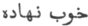

  
[Intangible Textual Heritage](../../index)  [Zoroastrianism](../index) 
[Index](index)  [Previous](sbe2310)  [Next](sbe2312) 

------------------------------------------------------------------------

[Buy this Book at
Amazon.com](https://www.amazon.com/exec/obidos/ASIN/1402185898/internetsacredte)

------------------------------------------------------------------------

*The Zend Avesta, Part II (SBE23)*, James Darmesteter, tr. \[1882\], at
Intangible Textual Heritage

------------------------------------------------------------------------

p. 85

### VI. KHÔRSHÊ*D* YA*S*T.

#### (YA*S*T TO THE SUN.)

This Ya*s*t is recited at any time, but particularly on the days
consecrated to the sun and to Khshathra-Vairya (Shahrîvar),Mithra
(Mihir), Asman (Âsmân), and Anaghra rao*kau* (Anîrân [1](#fn_420)): the last three, Mithra, Asman (the
Heaven), Anaghra (the infinite Light), have a natural connection with
the sun, but its connection with Khshathra-Vairya is not so clear.

Of this Ya*s*t we have a Pahlavi (East India Office, XII), a Persian
(ibid. XXIV), and a Sanskrit translation (Fonds Burnouf V; all three
edited in Études Iraniennes, II).

\_\_\_\_\_\_\_\_\_\_\_\_\_\_\_\_\_\_\_\_\_\_\_\_\_\_\_

0\. May Ahura Mazda be rejoiced . . . .

Ashem Vohû: Holiness is the best of all good . . . .

I confess myself a worshipper of Mazda, a follower of Zarathu*s*tra, one
who hates the Daêvas and obeys the laws of Ahura; For sacrifice, prayer,
propitiation, and glorification unto \[Hâvani\], the holy and master of
holiness [2](#fn_421) . . . .

Unto the undying, shining, swift-horsed Sun [3](#fn_422);

Be propitiation, with sacrifice, prayer, propitiation, and
glorification.

Yathâ ahû vairyô: The will of the Lord is the law of holiness [2](#fn_421). . . .

1\. We sacrifice unto the undying, shining, swift-horsed Sun.

When the light of the sun waxes warmer [4](#fn_423), when the brightness of the sun waxes
warmer, then up

p. 86

stand the heavenly Yazatas, by hundreds and thousands: they gather
together its Glory, they make its Glory pass down, they pour its Glory
upon the earth made by Ahura, for the increase of the world of holiness,
for the increase of the creatures of holiness [1](#fn_424), for the increase of the undying,
shining, swift-horsed Sun.

2\. And when the sun rises up, then the earth, made by Ahura, becomes
clean [2](#fn_425); the running waters become
clean, the waters of the wells become clean, the waters of the sea
become clean, the standing waters become clean; all the holy creatures,
the creatures of the Good Spirit, become clean.

3\. Should not the sun rise up, then the Daêvas would destroy all the
things that are in the seven Karshvares, nor would the heavenly Yazatas
find any way of withstanding or repelling them in the material world.

4\. He who offers up a sacrifice unto the undying, shining, swift-horsed
Sun—to withstand darkness, to withstand the Daêvas born of darkness, to
withstand the robbers and bandits, to withstand the Yâtus and Pairikas,
to withstand death that creeps in unseen—offers it up to Ahura Mazda,
offers it up to the Amesha-Spe*n*tas, offers it up to his own soul [3](#fn_426). He rejoices all the heavenly and
worldly Yazatas, who offers up a sacrifice unto the undying, shining,
swift-horsed Sun.

5\. I will sacrifice unto Mithra, the lord of wide

p. 87

pastures, who has a thousand ears, ten thousand eyes.

I will sacrifice unto the club of Mithra, the lord of wide pastures,
well struck down [1](#fn_427) upon the skulls
of the Daêvas.

I will sacrifice unto that friendship, the best of all friendships, that
reigns between the moon and the sun [2](#fn_428).

6\. For his brightness and glory, I will offer unto him a sacrifice
worth being heard, namely, unto the undying, shining, swift-horsed Sun.
Unto the undying, shining, swift-horsed Sun we offer up the libations,
the Haoma and meat, the baresma, the wisdom of the tongue, the holy
spells, the speech, the deeds, the libations, and the rightly-spoken
words [3](#fn_429).

Yê*n*hê hâtãm: All those beings of whom Ahura Mazda . . . .

7\. Yathâ ahû vairyô: The will of the Lord is the law of holiness . . .
.

I bless the sacrifice and the invocation, and the strength and vigour of
the undying, shining, swift-horsed Sun.

Ashem Vohû: Holiness is the best of all good . . . .

Give unto that man brightness and glory, give him health of body, . . .
. give him the bright, all-happy, blissful abode of the holy Ones.

------------------------------------------------------------------------

### Footnotes

[85:1](sbe2311.htm#fr_440) Or the 11th, 16th,
27th, and 30th days of the month (Anquetil, II, 184).

[85:2](sbe2311.htm#fr_443) As above, Yt. I, 0.

[85:3](sbe2311.htm#fr_442) Sîrôzah I, 11.

[85:4](sbe2311.htm#fr_444) 'That is to say,
rises up' (Phl. tr.).

[86:1](sbe2311.htm#fr_445) Literally 'of the
body of holiness,' that is to say, of the bodily creatures that
incorporate holiness.

[86:2](sbe2311.htm#fr_446) 'From the
uncleanness that the Daêvas mix with the earth during the night' (Phl.
tr.).

[86:3](sbe2311.htm#fr_447) As he benefits them
and himself thereby.

[87:1](sbe2311.htm#fr_448) Hunivikhtem:
suniyuktam (Sansk. tr.);  
(Pers. tr.).

[87:2](sbe2311.htm#fr_449) As they succeed one
another in regular order.

[87:3](sbe2311.htm#fr_450) Cf. Yt. III, 18.

------------------------------------------------------------------------

[Next: VII. Mâh Ya*s*t](sbe2312)
