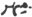
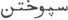
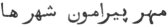
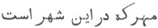

  
[Intangible Textual Heritage](../../index)  [Zoroastrianism](../index) 
[Index](index)  [Previous](sbe2314)  [Next](sbe2316) 

------------------------------------------------------------------------

[Buy this Book at
Amazon.com](https://www.amazon.com/exec/obidos/ASIN/1402185898/internetsacredte)

------------------------------------------------------------------------

*The Zend Avesta, Part II (SBE23)*, James Darmesteter, tr. \[1882\], at
Intangible Textual Heritage

------------------------------------------------------------------------

p. 119

#### X. MIHIR YA*S*T.

This Ya*s*t, one of the longest of the Avesta and one of the most
interesting in a literary point of view, is not very instructive for
mythology. It consists of long descriptive pieces, sometimes rather
spirited, and of fervent prayers and invocations for mercy or
protection. Originally Mithra was the god of the heavenly light (§§ 12,
50, 67, 104, 124 seq., 136 seq., &c.); and in that character he knows
the truth, as he sees everything; he is therefore taken as a witness of
truth, he is the preserver of oaths and good faith (§§ 2, 44 seq., 79
seq., 81 seq., &c.); he chastises those who break their promises and lie
to Mithra, destroys their houses and smites them in battle (§§ 17 seq.,
28 seq., 35 seq., 47 seq., 99 seq., 105 seq., 112 seq., 128 seq., &c.).

Particularly interesting are §§ 115-118, as giving a sketch of moral
hierarchy in Iran, and §§ 121-122, as being perhaps the source of the
trials in the later Roman [Mithraicism](errata.htm#1). Cf. Vend. Introd.
IV, 8 and Ormazd et Ahriman, §§ 59-61.

\_\_\_\_\_\_\_\_\_\_\_\_\_\_\_\_\_\_\_\_\_\_\_

0\. May Ahura Mazda be rejoiced! . . . .

Ashem Vohû: Holiness is the best of all good . . . .

I confess myself a worshipper of Mazda, a follower of Zarathu*s*tra, one
who hates the Daêvas, and obeys the laws of Ahura;

For sacrifice, prayer, propitiation, and glorification unto \[Hâvani\],
the holy and master of holiness . . . .

Unto Mithra, the lord of wide pastures, who has a thousand ears, ten
thousand eyes, a Yazata invoked by his own name, and unto Rama
*Hv*âstra [1](#fn_556),

Be propitiation, with sacrifice, prayer, propitiation, and
glorification.

Yathâ ahû vairyô: The will of the Lord is the law of holiness . . . .

#### I.

1\. Ahura Mazda spake unto Spitama Zarathu*s*tra, saying: 'Verily, when
I created Mithra, the lord of

p. 120

wide pastures, O Spitama! I created him as worthy of sacrifice, as
worthy of prayer as myself, Ahura Mazda [1](#fn_557).

2\. 'The ruffian who lies unto Mithra [2](#fn_558) brings death unto the whole country,
injuring as much the faithful world as a hundred evil-doers [3](#fn_559) could do. Break not the contract, O
Spitama! neither the one that thou hadst entered into with one of the
unfaithful, nor the one that thou hadst entered into with one of the
faithful who is one of thy own faith [4](#fn_560). For Mithra stands for both the faithful
and the unfaithful.

3\. 'Mithra, the lord of wide pastures, gives swiftness to the horses of
those who lie not unto Mithra.

'Fire, the son of Ahura Mazda, gives the straightest way to those who
lie not unto Mithra.

'The good, strong, beneficent Fravashis of the faithful give a virtuous
offspring to those who lie not unto Mithra.

4\. 'For his brightness and glory, I will offer unto him a sacrifice
worth being heard, namely, unto Mithra, the lord of wide pastures.

'We offer up libations unto Mithra, the lord of wide pastures, who gives
a happy dwelling and a good dwelling to the Aryan nations.

5\. 'May he come to us for help! May he come to us for ease! May he come
to us for joy! May he come to us for mercy! May he come to us for
health! May he come to us for victory! May he

p. 121

come to us for good conscience [1](#fn_561)!
May he come to us for bliss [2](#fn_562)! he,
the awful and overpowering, worthy of sacrifice and prayer, not to be
deceived anywhere in the whole of the material world, Mithra, the lord
of wide pastures.

6\. 'I will offer up libations unto him, the strong Yazata, the powerful
Mithra, most beneficent to the creatures: I will apply unto him with
charity [3](#fn_563) and prayers: I will offer
up a sacrifice worth being heard unto him, Mithra, the lord of wide
pastures, with the Haoma and meat, with the baresma, with the wisdom of
the tongue, with the holy spells, with the speech, with the deeds, with
the libations, and with the rightly-spoken words.

'Yê*n*hê hâtãm: All those beings of whom Ahura Mazda [4](#fn_564) . . . .

#### II.

7\. 'We sacrifice unto Mithra, the lord of wide pastures, who is
truth-speaking, a chief in assemblies, with a thousand ears,
well-shapen, with ten thousand eyes, high, with full knowledge [5](#fn_565), strong, sleepless, and ever awake [6](#fn_566);

p. 122

8\. 'To whom the chiefs of nations offer up sacrifices, as they go to
the field, against havocking hosts, against enemies coming in battle
array, in the strife of conflicting nations.

9\. 'On whichever side he has been worshipped first in the fulness of
faith of a devoted heart, to that side turns Mithra, the lord of wide
pastures, with the fiend-smiting wind, with the cursing thought of the
wise [1](#fn_567).

'For his brightness and glory, I will offer him a sacrifice worth being
heard . . . .

#### III.

10\. 'We sacrifice unto Mithra, the lord of wide pastures, . . . .
sleepless, and ever awake.

11\. 'Whom the horsemen worship on the back of their horses, begging
swiftness for their teams, health for their own bodies, and that they
may watch with full success those who hate them, smite down their foes,
and destroy at one stroke their adversaries, their enemies, and those
who hate them [2](#fn_568).

'For his brightness and glory, I will offer him a sacrifice worth being
heard . . . .

#### IV.

12\. 'We sacrifice unto Mithra, the lord of wide pastures, . . . .
sleepless, and ever awake;

13\. 'Who first of the heavenly gods reaches over the Hara [3](#fn_569), before the undying, swift-horsed
sun [4](#fn_570);

p. 123

who, foremost in a golden array, takes hold of the beautiful summits,
and from thence looks over the abode of the Aryans with a beneficent
eye.

14\. 'Where the valiant chiefs draw up their many troops in array [1](#fn_571); where the high mountains, rich in
pastures and waters, yield plenty to the cattle [2](#fn_572); where the deep lakes, with salt waters,
stand [3](#fn_573); where wide-flowing rivers
swell and hurry towards I*s*kata and Pouruta, Mouru and Harôyu, the
Gava-Sughdha and *Hv*âirizem [4](#fn_574);

15\. 'On Arezahi and Savahi, on Fradadhafshu and Vîdadhafshu, on
Vourubare*s*ti and Vourubare*s*ti, on this bright Karshvare of
*Hv*aniratha [5](#fn_575), the abode of cattle,
the dwelling of cattle, the powerful Mithra looks with a health-bringing
eye;

16\. 'He who moves along all the Karshvares, a Yazata unseen, and brings
glory; he who moves along all the Karshvares, a Yazata unseen, and
brings sovereignty; and increases [6](#fn_576)
strength for

p. 124

victory to those who, with a pious intent, holily offer him libations.

'For his brightness and glory, I will offer him a sacrifice worth being
heard . . . .

#### V.

17\. We sacrifice unto Mithra, the lord of wide pastures, . . . .
sleepless, and ever awake;

'Unto whom nobody must lie, neither the master of a house, nor the lord
of a borough, nor the lord of a town, nor the lord of a province.

18\. 'If the master of a house lies unto him, or the lord of a borough,
or the lord of a town, or the lord of a province, then comes Mithra,
angry and offended, and he breaks asunder the house, the borough, the
town, the province; and the masters of the houses, the lords of the
boroughs, the lords of the towns, the lords of the provinces, and the
foremost men of the provinces.

19\. 'On whatever side there is one who has lied unto Mithra, on that
side Mithra stands forth, angry and offended, and his wrath [1](#fn_577) is slow to relent [2](#fn_578).

20\. 'Those who lie unto Mithra, however swift they may be running,
cannot overtake [3](#fn_579); riding, cannot .
. . . [3](#fn_579); driving, cannot [3](#fn_579) The spear that the foe of Mithra flings,
darts backwards, for the

p. 125

number of the evil spells that the foe of Mithra works out [1](#fn_580).

21\. 'And even though the spear be flung well, even though it reach the
body, it makes no wound, for the number of the evil spells that the foe
of Mithra works out [1](#fn_580). The wind
drives away the spear that the foe of Mithra flings, for the number of
the evil spells that the foe of Mithra works out.

'For his brightness and glory, I will offer him a sacrifice worth being
heard . . . .

#### VI.

22\. 'We sacrifice unto Mithra, the lord of wide pastures, . . . .
sleepless, and ever awake;

'Who takes out of distress the man who has not lied unto him, who takes
him out of death.

23\. 'Take us out of distress, take us out of distresses, O Mithra! as
we have not lied unto thee. Thou bringest down terror upon the bodies of
the men who lie unto Mithra; thou takest away the strength from their
arms, being angry and all-powerful; thou takest the swiftness from their
feet, the eye-sight from their eyes, the hearing from their ears.

24\. 'Not the wound [2](#fn_581) of the
well-sharpened spear or of the flying arrow reaches that man to whom
Mithra comes for help with all the strength of his soul, he, of the ten
thousand spies, the powerful, all-seeing, undeceivable Mithra.

'For his brightness and glory, I will offer him a sacrifice worth being
heard . . . .

p. 126

#### VII.

25\. 'We sacrifice unto Mithra, the lord of wide pastures, . . . .
sleepless, and ever awake;

'Who is lordly, deep, strong, and weal-giving; a chief in assemblies,
pleased with prayers [1](#fn_582), high, holily
clever, the incarnate Word, a warrior with strong arms;

26\. 'Who breaks the skulls of the Daêvas, and is most cruel in exacting
pains; the punisher of the men who lie unto Mithra, the withstander of
the Pairikas; who, when not deceived, establisheth nations in supreme
strength; who, when not deceived, establisheth nations in supreme
victory;

27\. 'Who confounds the ways of the nation that delights in havoc, who
turns away their Glory [2](#fn_583), takes away
their strength for victory, blows them away helpless [3](#fn_584), and delivers them unto ten thousand
strokes; he, of the ten thousand spies, the powerful, all-seeing,
undeceivable Mithra.

'For his brightness and glory, I will offer him a sacrifice worth being
heard . . . .

#### VIII.

28\. 'We sacrifice unto Mithra, the lord of wide pastures, . . .
sleepless, and ever awake;

'Who upholds the columns of the lofty house and makes its pillars [4](#fn_585) solid; who gives herds of oxen and male
children to that house in which he has been satisfied; he breaks to
pieces those in which he has been offended.

29\. 'Thou, O Mithra! art both bad and good to

p. 127

nations; thou, O Mithra! art both bad and good to men; thou, O Mithra!
keepest in thy hands both peace and trouble for nations.

30\. 'Thou makest houses large, beautiful with women, beautiful with
chariots, with well-laid foundations [1](#fn_586), and high above their groundwork [2](#fn_587); thou makest that house lofty, beautiful
with women, beautiful with chariots, with well-laid foundations, and
high above its groundwork, of which the master, pious and holding
libations in his hand, offers thee a sacrifice, in which thou art
invoked by thy own name and with the proper words.

31\. 'With a sacrifice, in which thou art invoked by thy own name, with
the proper words will I offer thee libations, O powerful Mithra!

'With a sacrifice, in which thou art invoked by thy own name, with the
proper words will I offer thee libations, O most beneficent Mithra!

'With a sacrifice, in which thou art invoked by thy own name, with the
proper words will I offer thee libations, O thou undeceivable Mithra!

32\. 'Listen unto our sacrifice [3](#fn_588), O
Mithra! Be thou pleased with our sacrifice, O Mithra! Come and sit at
our sacrifice! Accept our libations! Accept them as they have been
consecrated [4](#fn_589)! Gather them together
with love and lay them in the Garô-nmâna!

33\. 'Grant us these boons which we beg of thee, O powerful god! in
accordance [5](#fn_590) with the words of
revelation, namely, riches, strength, and victory, good conscience and
bliss [6](#fn_591), good fame and a good

p. 128

soul; wisdom and the knowledge that gives happiness [1](#fn_592), the victorious strength given by Ahura,
the crushing Ascendant of Asha Vahi*s*ta, and conversation (with God) on
the Holy Word [2](#fn_593).

34\. 'Grant that we, in a good spirit and high spirit, exalted in joy
and a good spirit, may smite all our foes; that we, in a good spirit and
high spirit, exalted in joy and a good spirit, may smite all our
enemies; that we, in a good spirit and high spirit, exalted in joy and a
good spirit, may smite all the malice of Daêvas and Men, of the Yâtus
and Pairikas, of the oppressors, the blind, and the deaf [3](#fn_594).

'For his brightness and glory, I will offer him a sacrifice worth being
heard . . . .

#### IX.

35\. 'We sacrifice unto Mithra, the lord of wide pastures, . . . .
sleepless, and ever awake;

'Victory-making [4](#fn_595), army-governing,
endowed with a thousand senses [5](#fn_596);
power-wielding, power-possessing, and all-knowing;

36\. 'Who sets the battle a going, who stands against (armies) in
battle, who, standing against (armies) in battle, breaks asunder the
lines arrayed. The wings of the columns gone to battle shake, and he
throws terror upon the centre of the havocking host.

37\. 'He can bring and does bring down upon them distress and fear; he
throws down the heads of those who lie unto Mithra, he takes off the
heads of those who lie unto Mithra.

p. 129

38\. 'Sad is the abode, unpeopled with children, where abide men who lie
unto Mithra, and, verily, the fiendish killer of faithful men. The
grazing cow goes a sad straying way, driven along the vales [1](#fn_597) of the Mithradru*g*es: they [2](#fn_598) stand on the road, letting tears run
over their chins [3](#fn_599).

39\. 'Their falcon-feathered arrows, shot from the string of the
well-bent bow, fly towards the mark, and hit it not, as Mithra, the lord
of wide pastures, angry, offended, and unsatisfied, comes and meets
them.

'Their spears, well whetted and sharp, their long spears fly from their
hands towards the mark, and hit it not, as Mithra, the lord of wide
pastures, angry, offended, and unsatisfied, comes and meets them.

40\. 'Their swords, well thrust and striking at the heads of men, hit
not the mark, as Mithra, the lord of wide pastures, angry, offended, and
unsatisfied, comes and meets them.

'Their clubs, well falling and striking at the heads of men, hit not the
mark, as Mithra, the lord of wide pastures, angry, offended, and
unsatisfied, comes and meets them.

41\. 'Mithra strikes fear into them; Rashnu [4](#fn_600) strikes a counter-fear into them [5](#fn_601); the holy Sraosha blows them away from
every side towards the two Yazatas, the maintainers of the world [6](#fn_602). They make the ranks of the army melt
away, as Mithra, the lord

p. 130

of wide pastures, angry, offended, and unsatisfied, comes and meets
them [1](#fn_603).

42\. 'They cry unto Mithra, the lord of wide pastures, saying: "O
Mithra, thou lord of wide pastures! here are our fiery horses taking us
away, as they flee from Mithra; here are our sturdy arms cut to pieces
by the sword, O Mithra!"

43\. 'And then Mithra, the lord of wide pastures, throws them to the
ground, killing their fifties and their hundreds, their hundreds and
their thousands, their thousands and their tens of thousands, their tens
of thousands and their myriads of myriads; as Mithra, the lord of wide
pastures, is angry and offended.

'For his brightness and glory, I will offer him a sacrifice worth being
heard . . . .

#### X.

44\. 'We sacrifice unto Mithra, the lord of wide pastures, . . . .
sleepless, and ever awake;

'Whose dwelling, wide as the earth, extends over the material world,
large [2](#fn_604), unconfined [2](#fn_604), and bright, a far-and-wide-extending
abode.

45\. 'Whose eight friends [3](#fn_605) sit as
spies for Mithra, on all the heights, at all the watching-places,
observing the man who lies unto Mithra, looking at those, remembering
those who have lied unto Mithra, but guarding the ways of those whose
life is sought by

p. 131

men who lie unto Mithra, and, verily, by the fiendish killers of
faithful men.

46\. 'Helping and guarding, guarding behind and guarding, in front,
Mithra, the lord of wide pastures, proves an undeceivable spy and
watcher for the man to whom he comes to help with all the strength of
his soul, he of the ten thousand spies, the powerful, all-knowing,
undeceivable god.

'For his brightness and glory, I will offer him a sacrifice worth being
heard . . . .

#### XI.

47\. 'We sacrifice unto Mithra, the lord of wide pastures, . . .
sleepless, and ever awake;

'A god of high renown and old age [1](#fn_606),
whom wide-hoofed horses carry against havocking hosts, against enemies
coming in battle array, in the strife of conflicting nations [2](#fn_607).

48\. 'And when Mithra drives along towards the havocking hosts, towards
the enemies coming in battle array, in the strife of the conflicting
nations, then he binds the hands of those who have lied unto Mithra, he
confounds their eye-sight, he takes the hearing from their ears; they
can no longer move their feet; they can no longer withstand those
people, those foes, when Mithra, the lord of wide pastures, bears them
ill-will.

'For his brightness and glory, I will offer him a sacrifice worth being
heard . . . .

#### XII.

49 'We sacrifice unto Mithra, the lord of wide pastures, . . . .
sleepless, and ever awake;

50\. 'For whom the Maker, Ahura Mazda, has

p. 132

built up a dwelling on the Hara Berezaiti, the bright mountain around
which the many (stars) revolve [1](#fn_608),
where come neither night nor darkness, no cold wind and no hot wind, no
deathful sickness, no uncleanness made by the Daêvas, and the clouds
cannot reach up unto the Haraiti Bareza [2](#fn_609);

51\. 'A dwelling that all the Amesha-Spe*n*tas, in one accord with the
sun, made for him in the fulness of faith of a devoted heart, and he
surveys the whole of the material world from the Haraiti Bareza.

52\. 'And when there rushes a wicked worker of evil, swiftly, with a
swift step, Mithra, the lord of wide pastures, goes and yokes his horses
to his chariot, along with the holy, powerful Sraosha and
Nairyô-sangha [3](#fn_610), who strikes a blow
that smites the army, that smites the strength of the malicious [4](#fn_611).

'For his brightness and glory, I will offer him a sacrifice worth being
heard . . . .

#### XIII.

53\. 'We sacrifice unto Mithra, the lord of wide pastures, . . . .
sleepless, and ever awake;

54\. 'Who, with hands lifted up, ever cries unto Ahura Mazda, saying: "I
am the kind keeper of all creatures, I am the kind maintainer of all
creatures; yet men worship me not with a sacrifice in which I am invoked
by my own name, as they worship the other gods with sacrifices in which
they are invoked by their own names.

55 [5](#fn_612). "If men would worship me with
a sacrifice

p. 133

in which I were invoked by my own name, as they worship the other
Yazatas with sacrifices in which they are invoked by their own names,
then I would come to the faithful at the appointed time; I would come in
the appointed time of my beautiful, immortal life."

56 [1](#fn_613). 'But the pious man, holding
libations in his hands, does worship thee with a sacrifice, in which
thou art invoked by thy own name, and with the proper words.

'With a sacrifice, in which thou art invoked by thy own name, with the
proper words will I offer thee libations, O powerful Mithra!

'With a sacrifice, in which thou art invoked by thy own name, with the
proper words will I offer thee libations, O most beneficent Mithra!

'With a sacrifice, in which thou art invoked by thy own name, with the
proper words will I offer thee libations, O thou undeceivable Mithra!

57\. 'Listen unto our sacrifice, O Mithra! Be thou pleased with our
sacrifice, O Mithra! Come and sit at our sacrifice! Accept our
libations! Accept them as they have been consecrated! Gather them
together with love and lay them in the Garô-nmâna!

58\. 'Grant us these boons which we beg of thee, O powerful god! in
accordance with the words of revelation, namely, riches, strength, and
victory, good conscience and bliss, good fame and a good soul; wisdom
and the knowledge that gives happiness, the victorious strength given by
Ahura, the crushing Ascendant of Asha-Vahi*s*ta, and conversation (with
God) on the Holy Word.

p. 134

59\. 'Grant that we, in a good spirit and high spirit, exalted in joy
and a good spirit, may smite all our foes; that we, in a good spirit and
high spirit, exalted in joy and a good spirit, may smite all our
enemies; that we, in a good spirit and high spirit, exalted in joy and a
good spirit, may smite all the malice of Daêvas and Men, of the Yâtus
and Pairikas, of the oppressors, the blind, and the deaf.

'For his brightness and glory, I will offer him a sacrifice worth being
heard . . . .

#### XIV.

60\. 'We sacrifice unto Mithra, the lord of wide pastures, . . . .
sleepless, and ever awake;

'Whose renown is good, whose shape is good, whose glory is good; who has
boons to give at his will, who has pasture-fields to give at his will;
harmless to the tiller of the ground, . . . .  [1](#fn_614), beneficent; he, of the ten thousand
spies, the powerful, all-knowing, undeceivable god.

'For his brightness and glory, I will offer him a sacrifice worth being
heard . . . .

#### XV.

61\. 'We sacrifice unto Mithra, the lord of wide pastures, . . . .
sleepless, and ever awake;

'Firm-legged [2](#fn_615), a watcher fully
awake; valiant, a chief in assemblies; making the waters flow forward;
listening to appeals; making the waters run and the plants grow up;
ruling over the

p. 135

\[paragraph continues\] Karshwares [1](#fn_616); delivering [2](#fn_617); happy [3](#fn_618); undeceivable; endowed with many
senses [4](#fn_619); a creature of wisdom;

62\. 'Who gives neither strength nor vigour to him who has lied unto
Mithra; who gives neither glory nor any boon to him who has lied unto
Mithra.

63\. 'Thou takest away the strength from their arms, being angry and
all-powerful; thou takest the swiftness from their feet, the eye-sight
from their eyes, the hearing from their ears.

'Not the wound of the well-sharpened spear or of the flying arrow
reaches that man to whom Mithra comes for help with all the strength of
his soul, he, of the ten thousand spies, the powerful, all-knowing,
undeceivable god [5](#fn_620).

'For his brightness and glory, I will offer him a sacrifice worth being
heard . . . .

#### XVI.

64\. 'We sacrifice unto Mithra, the lord of wide pastures, . . . .
sleepless, and ever awake;

'Who takes possession [6](#fn_621) of the
beautiful, wide-expanding law, greatly and powerfully, and whose face
looks over all the seven Karshvares of the earth;

65\. 'Who is swift amongst the swift, liberal amongst the liberal,
strong amongst the strong, a chief of assembly amongst the chiefs of
assemblies; increase-giving, fatness-giving, cattle-giving,
sovereignty-giving, son-giving, cheerfulness [7](#fn_622)-giving, and bliss [7](#fn_622)-giving.

p. 136

66\. 'With whom proceed Ashi Vanguhi, and Pâre*n*di on her light
chariot [1](#fn_623), the awful Manly Courage,
the awful kingly Glory, the awful sovereign Sky, the awful cursing
thought [2](#fn_624) of the wise, the awful
Fravashis of the faithful, and he who keeps united together the many
faithful worshippers of Mazda [3](#fn_625).

'For his brightness and glory, I will offer him a sacrifice worth being
heard . . . .

#### XVII.

67\. 'We sacrifice unto Mithra, the lord of wide pastures, . . .
sleepless, and ever awake;

'Who drives along on his high-wheeled chariot, made of a heavenly [4](#fn_626) substance, from the Karshvare of
Arezahi [5](#fn_627) to the Karshvare of
*Hv*aniratha, the bright one; accompanied by [6](#fn_628) the wheel of sovereignty [7](#fn_629), the Glory made by Mazda, and the
Victory made by Ahura;

68\. 'Whose chariot is embraced [8](#fn_630) by
the great Ashi Vanguhi; to whom the Law of Mazda opens a way, that he
may go easily; whom four heavenly steeds, white, shining, seen afar,
beneficent, endowed with knowledge, swiftly [9](#fn_631) carry along the heavenly space [10](#fn_632), while the cursing thought of the wise
pushes it forward;

69\. 'From whom all the Daêvas unseen and the Varenya fiends [11](#fn_633) flee away in fear. Oh! may we

p. 137

never fall across the rush of the angry lord [1](#fn_634), who goes and rushes from a thousand
sides against his foe, he, of the ten thousand spies, the powerful,
all-knowing, undeceivable god.

'For his brightness and glory, I will offer him a sacrifice worth being
heard . . . .

#### XVIII.

70\. 'We sacrifice unto Mithra, the lord of wide pastures, . . .
sleepless, and ever awake;

'Before whom Verethraghna, made by Ahura, runs opposing the foes in the
shape of a boar [2](#fn_635), a sharp-toothed
he-boar, a sharp-jawed boar, that kills at one stroke, pursuing [3](#fn_636), wrathful, with a dripping face; strong,
with iron feet, iron fore-paws [4](#fn_637),
iron weapons, an iron tail, and iron jaws;

71\. 'Who, eagerly clinging to the fleeing foe, along with Manly
Courage, smites the foe in battle, and does not think he has smitten
him, nor does he consider it a blow till he has smitten away the
marrow [5](#fn_638) and the column of
life [6](#fn_639), the marrow [5](#fn_638) and the spring of existence.

72\. 'He cuts all the limbs to pieces, and mingles, together with the
earth, the bones, hair, brains, and blood of the men who have lied unto
Mithra [7](#fn_640).

'For his brightness and glory, we offer him a sacrifice worth being
heard . . . .

p. 138

#### XIX.

73\. 'We sacrifice unto Mithra, the lord of wide pastures, . . . .
sleepless, and ever awake;

'Who, with hands lifted up, rejoicing, cries out, speaking thus:

74\. ' "O Ahura Mazda, most beneficent spirit! Maker of the material
world, thou Holy One!

' "If men would worship me [1](#fn_641) with a
sacrifice in which I were invoked by my own name, as they worship the
other gods with sacrifices in which they are invoked by their own names,
then I should come to the faithful at the appointed time; I should come
in the appointed time of my beautiful, immortal life [2](#fn_642)."

75\. 'May we keep our field; may we never be exiles [3](#fn_643) from our field, exiles from our house,
exiles from our borough, exiles from our town, exiles from our country.

76\. 'Thou dashest in pieces the malice of the malicious, the malice of
the men of malice: dash thou in pieces the killers of faithful men!

'Thou hast good horses, thou hast a good chariot: thou art bringing help
at every appeal, and art powerful.

77\. 'I will pray unto thee for help, with many consecrations, with good
consecrations of libations; with many offerings, with good offerings of
libations, that we, abiding in thee, may long inhabit a good abode, full
of all the riches that can be wished for.

p. 139

78\. 'Thou keepest those nations that tender a good worship to Mithra,
the lord of wide pastures; thou dashest in pieces those that delight in
havoc. Unto thee will I pray for help: may he come to us for help, the
awful, most powerful Mithra, the worshipful and praiseworthy, the
glorious lord of nations.

'For his brightness and glory, I will offer him a sacrifice worth being
heard . . . .

#### XX.

79\. 'We sacrifice unto Mithra, the lord of wide pastures, . . . .
sleepless, and ever awake;

'Who made a dwelling for Rashnu [1](#fn_644),
and to whom Rashnu gave all his soul for long friendship;

80\. 'Thou art a keeper and protector of the dwelling of those who lie
not: thou art the maintainer of those who lie not. With thee hath
Verethraghna, made by Ahura, contracted the best of all
friendships [2](#fn_645), and thus it is how so
many men who have lied unto Mithra, even privily [3](#fn_646), lie smitten down on the ground.

'For his brightness and glory, I will offer him a sacrifice worth being
heard . . . .

#### XXI.

81\. 'We sacrifice unto Mithra, the lord of wide pastures, . . . .
sleepless, and ever awake;

'Who made a dwelling for Rashnu, and to whom Rashnu gave all his soul
for long friendship;

82\. 'To whom Ahura Mazda gave a thousand

p. 140

senses [1](#fn_647) and ten thousand eyes to
see. With those eyes and those senses, he watches the man who injures
Mithra, the man who lies unto Mithra. Through those eyes and those
senses, he is undeceivable, he, of the ten thousand spies, the powerful,
all-knowing, undeceivable god.

'For his brightness and glory, I will offer him a sacrifice worth being
heard . . . .

#### XXII.

83\. 'We sacrifice unto Mithra, the lord of wide pastures, . . . .
sleepless, and ever awake;

'Whom the lord of the country invokes for help, with hands uplifted;

'Whom the lord of the town invokes for help, with hands uplifted;

84\. 'Whom the lord of the borough invokes for help, with hands
uplifted;

'Whom the master of the house invokes for help, with hands uplifted;

'Whom the . . . . [2](#fn_648) in danger of
death [3](#fn_649) invokes for help, with hands
uplifted;

'Whom the poor man, who follows the good law, when wronged and deprived
of his rights, invokes for help, with hands uplifted.

85\. 'The voice of his wailing reaches up to the sky, it goes over the
earth all around, it goes over

p. 141

the seven Karshvares, whether he utters his prayer in a low tone of
voice [1](#fn_650) or aloud.

86\. 'The cow driven astray invokes him for help [2](#fn_651), longing for the stables:

' "When will that bull, Mithra, the lord of wide pastures, bring us
back, and make us reach the stables? when will he turn us back to the
right way from the den of the Dru*g* where we were driven [3](#fn_652)?"

87\. 'And to him with whom Mithra, the lord of wide pastures, has been
satisfied, he comes with help; and of him with whom Mithra, the lord of
wide pastures, has been offended, he crushes down the house, the
borough, the town, the province, the country.

'For his brightness and glory, I will offer him a sacrifice worth being
heard . . . .

#### XXIII.

88\. 'We sacrifice unto Mithra, the lord of wide pastures, . . . .
sleepless, and ever awake;

'To whom the enlivening, healing, fair, lordly, golden-eyed Haoma
offered up a sacrifice on the highest of the heights, on the Haraiti
Bareza [4](#fn_653), he

p. 142

the undefiled to one undefiled, with undefiled baresma, undefiled
libations, and undefiled words;

89\. 'Whom [1](#fn_654) the holy Ahura Mazda
has established as a priest, quick in performing the sacrifice and loud
in song. He performed the sacrifice with a loud voice, as a priest quick
in sacrifice and loud in song, a priest to Ahura Mazda, a priest to the
Amesha-Spe*n*tas. His voice reached up to the sky, went over the earth
all around, went over the seven Karshvares.

90\. 'Who first lifted up Haomas, in a mortar inlaid with stars and made
of a heavenly substance. Ahura Mazda longed for him, the
Amesha-Spe*n*tas longed for him, for the well-shapen body of him whom
the swift-horsed sun awakes for prayer from afar [2](#fn_655).

91\. 'Hail to Mithra, the lord of wide pastures, who has a thousand ears
and ten thousand eyes! Thou art worthy of sacrifice and prayer: mayest
thou have sacrifice and prayer in the houses of men! Hail to the man who
shall offer thee a sacrifice, with the holy wood in his hand, the
baresma in his hand, the holy meat in his hand, the holy mortar in his
hand [3](#fn_656), with his hands well-washed,
with the mortar well-washed, with the bundles of baresma tied up, the
Haoma uplifted, and the Ahuna Vairya sung through.

92\. 'The holy Ahura Mazda confessed that religion and so did Vohu-Manô,
so did Asha-Vahi*s*ta, so did Khshathra-Vairya, so did Spe*n*ta-Ârmaiti,
so

p. 143

did Haurvatâ*t* and Ameretâ*t*; and all the Amesha-Spe*n*tas longed for
and confessed his religion. The kind Mazda conferred upon him the
mastership of the world; and \[so did they [1](#fn_657)\] who saw thee amongst all creatures the
right lord and master of the world, the best cleanser of these
creatures.

93\. 'So mayest thou in both worlds, mayest thou keep us in both worlds,
O Mithra, lord of wide pastures! both in this material world and in the
world of the spirit, from the fiend of Death, from the fiend
Aêshma [2](#fn_658), from the fiendish hordes,
that lift up the spear of havoc, and from the onsets of Aêshma, wherein
the evil-doing Aêshma rushes along with Vîdôtu [3](#fn_659), made by the Daêvas.

94\. 'So mayest thou, O Mithra, lord of wide pastures! give swiftness to
our teams, strength to our own bodies, and that we may watch with full
success those who hate us, smite down our foes, and destroy at one
stroke our adversaries, our enemies and those who hate us [4](#fn_660).

'For his brightness and glory, I will offer him a sacrifice worth being
heard . . . .

#### XXIV.

95\. We sacrifice unto Mithra, the lord of wide pastures, . . . .
sleepless, and ever awake;

'Who goes over the earth, all her breadth over, after the setting of the
sun [5](#fn_661), touches both ends of

p. 144

this wide, round earth, whose ends lie afar, and surveys everything that
is between the earth and the heavens,

96\. 'Swinging in his hands a club with a hundred knots, a hundred
edges, that rushes forwards and fells men down; a club cast out of red
brass, of strong, golden brass; the strongest of all weapons, the most
victorious of all weapons [1](#fn_662);

97\. 'From whom Angra Mainyu, who is all death, flees away in fear; from
whom Aêshma, the evildoing Peshôtanu [2](#fn_663), flees away in fear; from whom the
long-handed Bûshyãsta [3](#fn_664) flees away
in fear; from whom all the Daêvas unseen and the Varenya fiends flee
away in fear [4](#fn_665).

98\. 'Oh! may we never fall across the rush of Mithra, the lord of wide
pastures, when in anger [5](#fn_666)! May
Mithra, the lord of wide pastures, never smite us in his anger; he who
stands up upon this earth as the strongest of all gods, the most valiant
of all gods, the most energetic of all gods, the swiftest of all gods,
the most fiend-smiting of all gods, he, Mithra, the lord of wide
pastures [6](#fn_667).

'For his brightness and glory, I will offer him a sacrifice worth being
heard . . . .

#### XXV.

99\. 'We sacrifice unto Mithra, the lord of wide pastures, . . . .
sleepless, and ever awake;

'From whom all the Daêvas unseen and the Varenya fiends flee away in
fear [7](#fn_668).

p. 145

'The lord of nations, Mithra, the lord of wide pastures, drives forward
at the right-hand side of this wide, round earth, whose ends lie afar.

100\. 'At his right hand drives the good, holy Sraosha; at his left hand
drives the tall and strong Rashnu; on all sides around him drive the
waters, the plants, and the Fravashis of the faithful.

101\. 'In his might, he ever brings to them falcon-feathered arrows,
and, when driving, he himself comes there, where are nations, enemy to
Mithra, he, first and foremost, strikes blows with his club on the horse
and his rider; he throws fear and fright upon the horse and his rider.

'For his brightness and glory, I will offer him a sacrifice worth being
heard . . . .

#### XXVI.

102\. 'We sacrifice unto Mithra, the lord of wide pastures, . . . .
sleepless, and ever awake;

'The warrior of the white horse, of the sharp spear, the long spear, the
quick arrows; foreseeing and clever;

103\. 'Whom Ahura Mazda has established to maintain and look over all
this moving [1](#fn_669) world, and who
maintains and looks over all this moving world; who, never sleeping,
wakefully guards the creation of Mazda; who, never sleeping, wakefully
maintains the creation of Mazda.

'For his brightness and glory, I will offer him a sacrifice worth being
heard . . . .

p. 146

#### XXVII.

104\. 'We sacrifice unto Mithra, the lord of wide pastures, . . . .
sleepless, and ever awake;

'Whose long arms, strong with Mithra-strength, encompass what he seizes
in the easternmost river [1](#fn_670) and what
he beats with the westernmost river [2](#fn_671), what is by the Sanaka [3](#fn_672) of the Rangha and what is by the
boundary of the earth [4](#fn_673).

105\. 'And thou, O Mithra! encompassing all this around, do thou reach
it, all over, with thy arms.

'The man without glory [5](#fn_674), led astray
from the right way, grieves in his heart; the man without glory thinks
thus in himself: "That careless Mithra does not see all the evil that is
done, nor all the lies that are told."

106\. 'But I think thus in my heart:

' "Should the evil thoughts of the earthly man be a hundred times worse,
they would not rise so high as the good thoughts of the heavenly Mithra;

' "Should the evil words of the earthly man be a hundred times worse,
they would not rise so high as the good words of the heavenly Mithra;

p. 147

' "Should the evil deeds of the earthly man be a hundred times worse,
they would not rise so high as the good deeds of the heavenly Mithra;

107\. ' "Should the heavenly wisdom [1](#fn_675) in the earthly man be a hundred times
greater, it would not rise so high as the heavenly. wisdom in the
heavenly Mithra;

' "And thus, should the ears of the earthly man hear a hundred times
better, he would not hear so well as the heavenly Mithra, whose ear
hears well, who has a thousand senses, and sees every man that tells a
lie."

'Mithra stands up in his strength, he drives in the awfulness of
royalty, and sends from his eyes beautiful looks that shine from afar,
(saying):

108\. ' "Who will offer me a sacrifice? Who will lie unto me? Who thinks
me a god worthy of a good sacrifice? Who thinks me worthy only of a bad
sacrifice? To whom shall I, in my might, impart brightness and glory? To
whom bodily health? To whom shall I, in my might, impart riches and full
weal? Whom shall I bless by raising him a virtuous [2](#fn_676) offspring?

109\. ' "To whom shall I give in return, without his thinking of it, the
awful sovereignty, beautifully arrayed, with many armies, and most
perfect; the sovereignty of an all-powerful tyrant, who fells down
heads, valiant, smiting, and unsmitten; who orders chastisement to be
done and his order is done at once, which he has ordered in his anger?"

'O Mithra! when thou art offended and not satisfied, he [3](#fn_677) soothes thy mind, and makes Mithra
satisfied.

p. 148

110\. ' "To whom shall I, in my might, impart sickness and death? To
whom shall I impart poverty and sterility [1](#fn_678)? Of whom shall I at one stroke cut off
the offspring?

111\. ' "From whom shall I take away, without his thinking of it, the
awful sovereignty, beautifully arrayed, with many armies, and most
perfect; the sovereignty of an all-powerful tyrant, who fells down
heads, valiant, smiting, and unsmitten; who orders chastisement to be
done and his order is done at once, which he has ordered in his anger?"

'O Mithra! while thou art satisfied and not angry, he moves thy heart to
anger [2](#fn_679), and makes Mithra
unsatisfied.

'For his brightness and glory, I will offer him a sacrifice worth being
heard . . . .

#### XXVIII.

112\. 'We sacrifice unto Mithra, the lord of wide pastures, . . . .
sleepless, and ever awake;

A warrior with a silver helm [3](#fn_680), a
golden cuirass [3](#fn_680), who kills with the
poniard, strong, valiant, lord of the borough. Bright are the ways of
Mithra, by which he goes towards the country, when, wishing well, he
turns its plains and vales to pasture grounds,

113\. 'And then cattle and males come to graze, as many as he wants.

'May Mithra and Ahura [4](#fn_681), the high
gods, come to us for help, when the poniard lifts up its voice

p. 149

aloud [1](#fn_682), when the nostrils of the
horses quiver, when the poniards . . . . [2](#fn_683), when the strings of the bows whistle
and shoot sharp arrows; then the brood of those whose libations are
hated fall smitten to the ground, with their hair torn off.

114\. 'So mayest thou, O Mithra, lord of wide pastures! give swiftness
to our teams, strength to our own bodies, and that we may watch with
full success those who hate us, smite down our foes, and destroy at one
stroke our adversaries, our enemies, and those who hate us [3](#fn_684).

'For his brightness and glory, I will offer him a sacrifice worth being
heard . . . .

#### XXIX.

115\. 'We sacrifice unto Mithra, the lord of wide pastures, . . . .
sleepless, and ever awake.

'O Mithra, lord of wide pastures! thou master of the house, of the
borough, of the town, of the country, thou Zarathu*s*trôtema [4](#fn_685)!

116\. 'Mithra is twentyfold [5](#fn_686)
between two friends or two relations;

'Mithra is thirtyfold between two men of the same group [6](#fn_687);

'Mithra is fortyfold between two partners [7](#fn_688);

p. 150

'Mithra is fiftyfold between wife and husband [1](#fn_689);

'Mithra is sixtyfold between two pupils (of the same master);

'Mithra is seventyfold between the pupil and his master;

'Mithra is eightyfold between the son-in-law and his father-in-law;

'Mithra is ninetyfold between two brothers;

117\. 'Mithra is a hundredfold between the father and the son;

'Mithra is a thousandfold between two nations [2](#fn_690);

'Mithra is ten thousandfold when connected with the Law of Mazda [3](#fn_691), and then he will be every day [4](#fn_692) of victorious strength [5](#fn_693).

118\. 'May I come unto thee with a prayer that goes lowly or goes
highly! As this sun rises up above the Hara Berezaiti and then fulfils
its career, so may I, O Spitama! with a prayer that goes lowly or goes
highly, rise up above the will of the fiend Angra Mainyu [6](#fn_694)!

'For his brightness and glory, I will offer him a sacrifice worth being
heard . . . .

#### XXX.

119\. 'We sacrifice unto Mithra, the lord of wide pastures, . . . .
sleepless, and ever awake.

'Offer up a sacrifice unto Mithra, O Spitama! and order thy pupils to do
the same.

p. 151

'Let the worshipper of Mazda sacrifice unto thee [1](#fn_695) with small cattle, with black cattle,
with flying birds, gliding forward on wings.

120\. 'To Mithra all the faithful worshippers of Mazda must give
strength and energy with offered and proffered Haomas, which the Zaotar
proffers unto him and gives in sacrifice [2](#fn_696). Let the faithful man drink of the
libations cleanly prepared, which if he does, if he offers them unto
Mithra, the lord of wide pastures, Mithra will be pleased with him and
without anger.'

121\. Zarathu*s*tra asked him: 'O Ahura Mazda! how shall the faithful
man drink the libations cleanly prepared, which if he does and he offers
them unto Mithra, the lord of wide pastures, Mithra will be pleased with
him and without anger?'

122\. Ahura Mazda answered: 'Let them wash their bodies three days and
three nights; let them undergo thirty strokes [3](#fn_697) for the sacrifice and prayer unto
Mithra, the lord of wide pastures. Let them wash their bodies two days
and two nights; let them undergo twenty strokes for the sacrifice and
prayer unto Mithra, the lord of wide pastures. Let no

p. 152

man drink of these libations who does not know the staota yêsnya [1](#fn_698): Vîspê ratavô [2](#fn_699).

'For his brightness and glory, I will offer him a sacrifice worth being
heard . . . .

#### XXXI.

123\. 'We sacrifice unto Mithra, the lord of wide pastures, . . . .
sleepless, and ever awake;

'To whom Ahura Mazda offered up a sacrifice in the shining
Garô-nmâna [3](#fn_700).

124\. 'With his arms lifted up towards Immortality [4](#fn_701), Mithra, the lord of wide pastures,
drives forward from the shining Garô-nmâna, in a beautiful chariot that
drives on, ever-swift, adorned with all sorts of ornaments, and made of
gold.

125\. 'Four stallions draw that chariot, all of the same white colour,
living on heavenly food [5](#fn_702) and
undying. The hoofs of their fore-feet are shod with gold, the hoofs of
their hind-feet are shod with silver; all are yoked to the same pole,
and wear the yoke [6](#fn_703) and the
cross-beams of the yoke [6](#fn_703), fastened
with hooks [6](#fn_703) of Khshathra
vairya [7](#fn_704) to a beautiful . . .
. [8](#fn_705)

126\. 'At his right hand drives Rashnu-Razi*s*ta [9](#fn_706), the most beneficent and most
well-shapen.

p. 153

'At his left hand drives the most upright *K*ista [1](#fn_707), the holy one, bearing libations in her
hands, clothed with white clothes, and white herself; and the cursing
thought [2](#fn_708) of the Law of Mazda.

127\. 'Close by him drives the strong cursing thought [2](#fn_708) of the wise man, opposing foes in the
shape of a boar, a sharp-toothed he-boar, a sharp-jawed boar, that kills
at one stroke, pursuing, wrathful, with a dripping face [3](#fn_709), strong and swift to run, and rushing
all around [4](#fn_710).

'Behind him drives Âtar [5](#fn_711), all in a
blaze, and the awful kingly Glory.

128\. 'On a side of the chariot of Mithra, the lord of wide pastures,
stand a thousand bows well-made, with a string of cowgut; they go
through the heavenly space [6](#fn_712), they
fall through the heavenly space upon the skulls of the Daêvas.

129\. 'On a side of the chariot of Mithra, the lord of wide pastures,
stand a thousand vulture-feathered arrows, with a golden mouth [7](#fn_713), with a horn shaft, with a brass tail,
and well-made. They go through the heavenly space, they fall through the
heavenly space upon the skulls of the Daêvas.

130\. 'On a side of the chariot of Mithra, the lord of wide pastures,
stand a thousand spears well-made and sharp-piercing. They go through
the heavenly space, they fall through the heavenly space upon the skulls
of the Daêvas.

'On a side of the chariot of Mithra, the lord of

p. 154

wide pastures, stand a thousand steel-hammers, two-edged, well-made.
They go through the heavenly space, they fall through the heavenly space
upon the skulls of the Daêvas.

131\. 'On a side of the chariot of Mithra, the lord of wide pastures,
stand a thousand swords, two-edged and well-made. They go through the
heavenly space, they fall through the heavenly space upon the skulls of
the Daêvas.

'On a side of the chariot of Mithra, the lord of wide pastures, stand a
thousand maces of iron, well-made. They go through the heavenly space,
they fall through the heavenly space upon the skulls of the Daêvas.

132\. 'On a side of the chariot of Mithra, the lord of wide pastures,
stands a beautiful well-falling club, with a hundred knots, a hundred
edges, that rushes forward and fells men down; a club cast out of red
brass, of strong, golden brass; the strongest of all weapons, the most
victorious of all weapons [1](#fn_714). It goes
through the heavenly space [2](#fn_715), it
falls through the heavenly space upon the skulls of the Daêvas.

133\. 'After he has smitten the Daêvas, after he has smitten down the
men who lied unto Mithra, Mithra, the lord of wide pastures, drives
forward through Arezahê and Savahê, through Fradadhafshu and
Vîdadhafshu, through Vourubare*s*ti and Vouru*g*are*s*ti, through this
our Karshvare, the bright *Hv*aniratha [3](#fn_716).

134\. 'Angra Mainyu, who is all death, flees away in fear; Aêshma, the
evil-doing Peshotanu, flees

p. 155

away in fear; the long-handed Bûshyãsta flees away in fear; all the
Daêvas unseen and the Varenya fiends flee away in fear.

135\. 'Oh! may we never fall across the rush of Mithra, the lord of wide
pastures, when in anger! May Mithra, the lord of wide pastures, never
smite us in his anger; he who stands up upon this earth as the strongest
of all gods, the most valiant of all gods, the most energetic of all
gods, the swiftest of all gods, the most fiend-smiting of all gods, he,
Mithra, the lord of wide pastures [1](#fn_717).

'For his brightness and glory, I will offer him a sacrifice worth being
heard . . . .

#### XXXII.

136\. 'We sacrifice unto Mithra, the lord of wide pastures, . . .
sleepless, and ever awake;

'For whom white stallions, yoked to his chariot, draw it, on one golden
wheel, with a full shining axle.

137\. 'If Mithra takes his libations to his own dwelling [2](#fn_718), "Happy that man, I think,"—said Ahura
Mazda,—"O holy Zarathu*s*tra! for whom a holy priest, as pious as any in
the world [3](#fn_719), who is the Word
incarnate, offers up a sacrifice unto Mithra with bundles of baresma and
with the \[proper\] words.

' "Straight to that man, I think, will Mithra come, to visit his
dwelling,

138\. ' "When Mithra's boons will come to him, as he follows God's
teaching, and thinks according to God's teaching.

' "Woe to that man, I think,"—said Ahura Mazda,—

p. 156

\[paragraph continues\] "O holy
Zarathu*s*tra! for whom an unholy priest, not pious [1](#fn_720), who is not the Word incarnate, stands
behind the baresma, however full may be the bundles of baresma he ties,
however long may be the sacrifice he performs."

139\. 'He does not delight Ahura Mazda, nor the other Amesha-Spe*n*tas,
nor Mithra, the lord of wide pastures, he who thus scorns Mazda, and the
other Amesha-Spe*n*tas, and Mithra, the lord of wide pastures, and the
Law, and Rashnu, and Ar*s*tâ*t*, who makes the world grow, who makes the
world increase.

'For his brightness and glory, I will offer him a sacrifice worth being
heard . . . .

#### XXXIII.

140\. 'We sacrifice unto Mithra, the lord of wide pastures, . . . .
sleepless, and ever awake.

'I will offer up a sacrifice unto the good Mithra, O Spitama! unto the
strong, heavenly god, who is foremost, highly merciful, and peerless;
whose house is above [2](#fn_721), a stout and
strong warrior;

141\. 'Victorious and armed with a well-fashioned weapon, watchful in
darkness and undeceivable. He is the stoutest of the stoutest, he is the
strongest of the strongest, he is the most intelligent of the gods, he
is victorious and endowed with Glory: he, of the ten thousand eyes, of
the ten thousand spies, the powerful, all-knowing, undeceivable god.

'For his brightness and glory, I will offer him a sacrifice worth being
heard. . . .

p. 157

#### XXXIV.

142\. 'We sacrifice unto Mithra, the lord of wide pastures, . . .
sleepless, and ever awake;

'Who, with his manifold knowledge, powerfully increases the creation of
Spe*n*ta Mainyu, and is a well-created and most great Yazata,
self-shining like the moon, when he makes his own body shine;

143\. 'Whose face is flashing with light like the face of the star
Ti*s*trya [1](#fn_722); whose chariot is
embraced by that goddess who is foremost amongst those who have no
deceit in them [2](#fn_723), O Spitama! who is
fairer than any creature in the world, and full of light to shine. I
will worship that chariot, wrought by the Maker, Ahura Mazda, inlaid
with stars and made of a heavenly substance; (the chariot) of Mithra,
who has ten thousand spies, the powerful, all-knowing, undeceivable god.

'For his brightness and glory, I will offer him a sacrifice worth being
heard . . . .

#### XXXV.

144\. 'We sacrifice unto Mithra, the lord of wide pastures, who is
truth-speaking, a chief in assemblies, with a thousand ears,
well-shapen, with a thousand eyes, high, with full knowledge, strong,
sleepless, and ever awake.

'We sacrifice unto the Mithra around countries [3](#fn_724);

'We sacrifice unto the Mithra within countries;

p. 158

'We sacrifice unto the Mithra in this country [1](#fn_725);

'We sacrifice unto the Mithra above countries;

'We sacrifice unto the Mithra under countries;

'We sacrifice unto the Mithra before countries [2](#fn_726);

'We sacrifice unto the Mithra behind countries.

145\. 'We sacrifice unto Mithra and Ahura, the two great, imperishable,
holy gods [3](#fn_727); and unto the stars, and
the moon, and the sun, with the trees that yield up baresma [4](#fn_728). We sacrifice unto Mithra, the lord of
all countries.

'For his brightness and glory, I will offer unto him a sacrifice worth
being heard, namely, unto Mithra, the lord of wide pastures.

'Yathâ ahû vairyô: The will of the Lord is the law of holiness . . . .

'I bless the sacrifice and prayer, and the strength and vigour of
Mithra, the lord of wide pastures, who has a thousand ears, ten thousand
eyes, a Yazata invoked by his own name; and that of Râma *Hv*âstra [5](#fn_729).

'Ashem Vohû: Holiness is the best of all good . . . .

'\[Give\] unto that man [6](#fn_730) brightness
and glory, . . . . give him the bright, all-happy, blissful abode of the
holy Ones!'

------------------------------------------------------------------------

### Footnotes

[119:1](sbe2315.htm#fr_579) Sîrôzah I, 16.

[120:1](sbe2315.htm#fr_580) Cf. Yt. VIII, 50.

[120:2](sbe2315.htm#fr_581) The Mithradru*g*:
one might also translate 'who breaks the contract,' as mithra, as a
common noun, means 'a contract.'

[120:3](sbe2315.htm#fr_582) Kayadhas; cf. Yt.
I, 19.

[120:4](sbe2315.htm#fr_583) Cf. Ardâ Viraf,
chap. lii.

[121:1](sbe2315.htm#fr_584) Cheerfulness at the
head of the *K*inva*t* bridge (Yasna LXII, 6 \[LXI, 17\]; cf. Vend.
XVIII, 6).

[121:2](sbe2315.htm#fr_585) The condition of
the blessed in the next world.

[121:3](sbe2315.htm#fr_586) Va*n*ta,
'assistance, that is, making *g*âdangôi' (Yasna LXII \[LXI\], 1;
*g*âdangôi is making a collection for the poor (Études Iraniennes, II,
155).

[121:4](sbe2315.htm#fr_587) As [p.
30](sbe2306.htm#page_30).

[121:5](sbe2315.htm#fr_588) Perethu-vaêdhayana:
sampûr*n*avittâram kâryanyâyânam (Khorshê*d* Nyâyi*s* 6).

[121:6](sbe2315.htm#fr_589) *G*aghâurv*au*ng
hem: this word, strangely enough, is generally translated 'who has most
strong arms' (balish*th*abhu*g*am); *g*agâuru is translated in the same
way.

[122:1](sbe2315.htm#fr_590) See [p.
12](sbe2304.htm#page_12), note [13](sbe2304.htm#fn_94).

[122:2](sbe2315.htm#fr_591) Cf. Yt. V, 53; X,
94.

[122:3](sbe2315.htm#fr_592) Mount Albôrz,
whence the sun rises; see § 50.

[122:4](sbe2315.htm#fr_593) Mithra is closely
connected with the sun, but not yet identical with it, as he became in
later times ( , the sun;
Deo invicto Soli Mithrae).

[123:1](sbe2315.htm#fr_594) In the flat
countries.

[123:2](sbe2315.htm#fr_595) In the mountainous
parts of Iran.

[123:3](sbe2315.htm#fr_596) In the lake regions
(Seistan, Farsistan, Âdarbai*g*ân).

[123:4](sbe2315.htm#fr_597) In the country of
the large rivers in the East. Mouru is Marv (Margiana), with the Murghâb
river (the Margus); Harôyu is the Herat country, with the Harêrûd;
Gava-Sughdha and *Hv*ârizm are Sogdiana and Khvârizm, with the Oxus. The
situation of I*s*kata and Pouruta is not clear: one might think of
Alexander eschata on the Iaxartes and the Paretacene country between the
Oxus and the Iaxartes.

[123:5](sbe2315.htm#fr_598) The earth is
divided into seven Karshvares, separated from one another by seas and
mountains impassable to men. Arezahi and Savahi are the western and the
eastern Karshvare; Fradadhafshu and Vîdadhafshu are in the south;
Vourubare*s*ti and Vouru*g*are*s*ti are in the north; *Hv*aniratha is
the central Karshvare. *Hv*aniratha is the only Karshvare inhabited by
man (Bundahi*s* XI, 3).

[123:6](sbe2315.htm#fr_599) Doubtful.

[124:1](sbe2315.htm#fr_600) Mainyu, in the
meaning of the Sanskrit manyu (?).

[124:2](sbe2315.htm#fr_601) Doubtful;
aspa*k*a*t*: cf.   to be
late.

[124:3](sbe2315.htm#fr_604) Apayêi*n*ti,
frastanvai*n*ti, framanyêi*n*tê: these are three technical words for the
movements of the three classes of soldiers, footmen, horsemen, and
chariot-men; the last two words are probably synonymous with the first,
but the exact shades of meaning are not known. Mr. West suggests, cannot
outrun, outride, outdrive him.

[125:1](sbe2315.htm#fr_606) The sacramental
words of the contract, by their not being kept, turn to evil spells
against the contract: breaker.

[125:2](sbe2315.htm#fr_607) Doubtful:
*s*anamayô, or *s*anamaoyô; read shanmaoyô (?), from shan, Sansk. kshan.

[126:1](sbe2315.htm#fr_608) Vahmô-sendah; cf.
Vispêrad VIII (IX, 1), Phl. tr.

[126:2](sbe2315.htm#fr_609) Their *Hv*arenô.

[126:3](sbe2315.htm#fr_610) Doubtful.

[126:4](sbe2315.htm#fr_611) Ãithya; cf. Lat.
antae (Brugmann).

[127:1](sbe2315.htm#fr_612) Doubtful.

[127:2](sbe2315.htm#fr_613) Doubtful.

[127:3](sbe2315.htm#fr_614) Cf. Yt. III, 18.

[127:4](sbe2315.htm#fr_615) By the proper
prayers (ya*s*t*au*).

[127:5](sbe2315.htm#fr_616) Doubtful.

[127:6](sbe2315.htm#fr_617) Cf. §5.

[128:1](sbe2315.htm#fr_618) Spiritual
happiness, bliss.

[128:2](sbe2315.htm#fr_619) Vend. XVIII, 51
\[III\].

[128:3](sbe2315.htm#fr_620) See above, [p.
26](sbe2306.htm#page_26), note [2](sbe2306.htm#fn_120). §§ 30-34 = §§
56-59.

[128:4](sbe2315.htm#fr_621) Doubtful (reading
arena*t*-*g*aêsha?).

[128:5](sbe2315.htm#fr_622) See § 82, note.

[129:1](sbe2315.htm#fr_623) Doubtful.

[129:2](sbe2315.htm#fr_624) The cattle.

[129:3](sbe2315.htm#fr_625) The meaning is,
that the cattle of the Mithradru*g*es do not thrive, and that their
pasture-fields are waste.

[129:4](sbe2315.htm#fr_626) See Yt. XII.

[129:5](sbe2315.htm#fr_627) As they flee from
Mithra, they fall into the hands of Rashnu.

[129:6](sbe2315.htm#fr_628) Thrâtâra; one might
feel inclined to read thrâstâra, 'the fear-striking;' cf. § 36.

[130:1](sbe2315.htm#fr_629) Cf. §§ 99-101.

[130:2](sbe2315.htm#fr_631) Doubtful. The text
is corrupt.

[130:3](sbe2315.htm#fr_632) Doubtful. The
number eight has probably an astronomical signification, each of the
eight râtis of Mithra occupying one of the eight points of the compass.

[131:1](sbe2315.htm#fr_633) Doubtful.

[131:2](sbe2315.htm#fr_634) Cf. § 8.

[132:1](sbe2315.htm#fr_635) Bundahi*s* V, 3
seq.; cf. Yt. XII, 13, and Yt. X, 13.

[132:2](sbe2315.htm#fr_636) The Haraiti Bareza
is the same as Hara Berezaiti.

[132:3](sbe2315.htm#fr_637) Sîrôzah I, 9, notes
4 and 5.

[132:4](sbe2315.htm#fr_638) Doubtful
(mâyao*s*).

[132:5](sbe2315.htm#fr_639) Cf. Yt. VIII, II,
24, and Yt. X, 74.

[133:1](sbe2315.htm#fr_640) §§ 56-59 = §§
30-34.

[134:1](sbe2315.htm#fr_641) The text is corrupt
(vasô-yaonâi inatãm?).

[134:2](sbe2315.htm#fr_642) Eredhwô-za*n*gem:
sud*ridh*agaṅghatâ, kila kârye yad pâdâbhyâm yu*g*yate kartum vyavasâyî
*s*akta*sk*a (Yasna LXII, 5 \[LXI, 23\]).

[135:1](sbe2315.htm#fr_643) Kar*s*ô-râzanghem:
kê*s*var vîrâi (Pahl. tr. ibid.).

[135:2](sbe2315.htm#fr_644) From Ahriman; cf.
Yasna XXIX, 6 (vyâna = vi*k*âri*s*n, vi*s*uddhatâ.)

[135:3](sbe2315.htm#fr_645) Yaokh*s*tiva*nt*:
kâmakômand (possessing whatever he wishes for, Vend. XX, 1 \[3\]).

[135:4](sbe2315.htm#fr_646) See Yt. X, 82,
note.

[135:5](sbe2315.htm#fr_647) From Yt. X, 23-24.

[135:6](sbe2315.htm#fr_648) Cf. Yasna XLIII, 7:
vyânayâ: amat vandînît, yat g*ri*h*n*âti.

[135:7](sbe2315.htm#fr_650) Cf. Yt. X, 5, [p.
121](#page_121), notes [1](#fn_561) and [2](#fn_562).

[136:1](sbe2315.htm#fr_651) Cf. Yt. VIII, 38.

[136:2](sbe2315.htm#fr_652) See above, [p.
12](sbe2304.htm#page_12), note [13](sbe2304.htm#fn_94).

[136:3](sbe2315.htm#fr_653) Mithra himself (?).

[136:4](sbe2315.htm#fr_654) Or 'invisible.'

[136:5](sbe2315.htm#fr_655) The western
Karshvare (see above, [p. 123](#page_123), note [5](#fn_575)); this
seems to refer to the career of Mithra during the night; cf. § 95.

[136:6](sbe2315.htm#fr_656) And rolling upon
it.

[136:7](sbe2315.htm#fr_657) Cf. Yt. XIII, 89,
note.

[136:8](sbe2315.htm#fr_658) And uplifted.

[136:9](sbe2315.htm#fr_659) Doubtful.

[136:10](sbe2315.htm#fr_660) See above, [p.
95](sbe2313.htm#page_95), note [1](sbe2313.htm#fn_468).

[136:11](sbe2315.htm#fr_661) See Vend. Introd.
IV, 23.

[137:1](sbe2315.htm#fr_662) Cf. § 98.

[137:2](sbe2315.htm#fr_663) See Yt. XIV, 15;
cf. Yt. X, 127.

[137:3](sbe2315.htm#fr_664) Anupôithwa; cf.
pôithwa (Vend. XIV \[114\]) = rânini*s*n.

[137:4](sbe2315.htm#fr_665) Literally, hands.

[137:5](sbe2315.htm#fr_668) Doubtful.

[137:6](sbe2315.htm#fr_667) The spine.

[137:7](sbe2315.htm#fr_669) Cf. § 80.

[138:1](sbe2315.htm#fr_670) They have
worshipped him and he has consequently overcome the Mithradru*g*es; this
accounts for the word rejoicing.

[138:2](sbe2315.htm#fr_671) Cf. Yt. X, 55.

[138:3](sbe2315.htm#fr_672) Iric; cf. linquo.

[139:1](sbe2315.htm#fr_673) The Genius of Truth
(Yt. XII); Mithra gives a dwelling to the truthful man in the same way
as he destroys the dwelling of the liar (§ 80).

[139:2](sbe2315.htm#fr_674) Cf. § 70.

[139:3](sbe2315.htm#fr_675) Aipi vithi*s*i;
Vedic api vyathis (VIII, 45, 29).

[140:1](sbe2315.htm#fr_676) Yaokh*s*ti, the
root of Persian nyô*s*idan, Pahlavi niyôkh*s*îtan, to hear; one might be
inclined to translate 'a thousand ears,' or 'a thousand hearings;' but
the meaning of the word must have been rather more general, as
Neriosengh translates it (pra*n*idhi, IX, 8 \[25\]).

[140:2](sbe2315.htm#fr_677) Dvâ*k*ina?

[140:3](sbe2315.htm#fr_678) Pithê: m*ri*tyu
(Yasna LIII \[LII\], 6).

[141:1](sbe2315.htm#fr_679) Vâ*k*em, the
so-called vâ*g*.

[141:2](sbe2315.htm#fr_680) Most manuscripts
have added here, from the preceding clauses, 'with hands uplifted!'

[141:3](sbe2315.htm#fr_681) An allusion to a
myth in which Mithra was described as an Indra delivering the cows
carried away by a V*ri*tra: Firmicus Maternus called him abactorem boum
(De Errore Profan. Relig. V); Commodianus compares him with Cacus:

'Vrtebatque boves alienos semper in antris  
Sicut et Cacus Vulcani filius ille.'

\[paragraph continues\] (Apud
Windischmann, Mithra, p. 64.)

[141:4](sbe2315.htm#fr_682) See above, [p.
132](#page_132), note [2](#fn_609).

[142:1](sbe2315.htm#fr_683) Haoma; cf. Yasna
IX, 26 181\].

[142:2](sbe2315.htm#fr_684) For the morning
service in the Gâh U*s*ahîn.

[142:3](sbe2315.htm#fr_685) Cf. Vend. III, 1.

[143:1](sbe2315.htm#fr_686) The
Amesha-Spe*n*tas.

[143:2](sbe2315.htm#fr_687) See Vend. Introd.
IV, 22.

[143:3](sbe2315.htm#fr_688) See ibid.

[143:4](sbe2315.htm#fr_689) See Yt. V, 53; X,
11, 114; V, 53.

[143:5](sbe2315.htm#fr_690) It should seem as
if Mithra was supposed to retrace his steps during the night. The Hindus
supposed that the sun had a bright face and a dark one, and that during
the night it returned from the west to the east with its dark face
turned towards the earth.

[144:1](sbe2315.htm#fr_691) Cf. § 132.

[144:2](sbe2315.htm#fr_692) See Vend. Introd.
V, 19.

[144:3](sbe2315.htm#fr_693) See ibid. IV, 24.

[144:4](sbe2315.htm#fr_694) Cf. § 69.

[144:5](sbe2315.htm#fr_695) Cf. Yt. X, 69.

[144:6](sbe2315.htm#fr_696) §§ 97-98 = §§
234-135.

[144:7](sbe2315.htm#fr_697) Cf. § 97.

[145:1](sbe2315.htm#fr_698) Fravôi*s*; Parsi
tradition translates large: frâz (tr. Phl.), buland (Asp., Yasna LVII,
15 \[LVI, 7, 3\]).

[146:1](sbe2315.htm#fr_699) The Sind.

[146:2](sbe2315.htm#fr_700) The Rangha or
Tigris. The words âg*e*urvayêiti and nighnê, 'he seizes, he beats,' are
the words used of the priest laying the Haoma in the mortar and pounding
it with the pestle (Yasna, X, 2 \[4-5\]). The Sind and the Rangha are
thus compared with the two parts of the Hâvana, the land between is the
Haoma, and Mithra's arms are the arms of the priest.

[146:3](sbe2315.htm#fr_701) Sanakê, an ἅπαξ
λεγόμενον; opposed to the aodhas of the Rangha, Yt. XII, 19.

[146:4](sbe2315.htm#fr_702) The Arabian sea
(?). Cf. Yt. XII, 21.

[146:5](sbe2315.htm#fr_703) Who has not a ray
of the celestial light: here, the man of little faith.

[147:1](sbe2315.htm#fr_704) See above, [p.
4](sbe2304.htm#page_4), n. [5](sbe2304.htm#fn_11).

[147:2](sbe2315.htm#fr_705) Âsna: Sansk.
su*s*îla ([p. 34](sbe2306.htm#page_34), n. [4](sbe2306.htm#fn_181)).

[147:3](sbe2315.htm#fr_706) He who offers thee
a good sacrifice; cf. § 108.

[148:1](sbe2315.htm#fr_707) Doubtful.

[148:2](sbe2315.htm#fr_708) He who offers thee
a bad sacrifice.

[148:3](sbe2315.htm#fr_710) Doubtful.

[148:4](sbe2315.htm#fr_711) See Vend. Introd.
IV, 8.

[149:1](sbe2315.htm#fr_712) When it clashes
with another.

[149:2](sbe2315.htm#fr_713) Kahvãn.

[149:3](sbe2315.htm#fr_714) See Yt. V, 53; X,
11, 94.

[149:4](sbe2315.htm#fr_715) The chief of the
sacerdotal order, the so-called Maubedânmaused.

[149:5](sbe2315.htm#fr_716) Or 'the contract is
twentyfold . . . .,' that is, twenty times more strictly binding than
between any two strangers. This passage is one of the most important of
the Avesta, as a short account of the social constitution and morals of
Zoroastrian Iran.

[149:6](sbe2315.htm#fr_717) Of the same gild
(svapaṅkti, ap. Neriosengh).

[149:7](sbe2315.htm#fr_718) Hadha-gaêtha,
co-proprietors of a gaêtha (a rural estate).

[150:1](sbe2315.htm#fr_719) Doubtful.

[150:2](sbe2315.htm#fr_720) A fair recognition
of the jus gentium.

[150:3](sbe2315.htm#fr_721) The contract
between the faithful and the Law, the covenant (?).

[150:4](sbe2315.htm#fr_722) Reading \[h\]amahê
ayãn.

[150:5](sbe2315.htm#fr_723) The last clause is
doubtful; the text is corrupt.

[150:6](sbe2315.htm#fr_724) Prayer follows
Mithra in his career, rising and setting with him.

[151:1](sbe2315.htm#fr_725) Mithra.

[151:2](sbe2315.htm#fr_726) The translation of
this sentence is conjectural.

[151:3](sbe2315.htm#fr_727) Thirty strokes with
the Sraoshô-*k*arana (upâzana; see Vend. Introd. V, 59); it is an
expiation (âkayaya*n*ta) which purges them from their sins and makes
them fit for offering a sacrifice to Mithra. One may find in this
passage the origin of the painful trials through which the adepts of the
Mithriac mysteries had to go before being admitted to initiation (οὐκ ἂν
οὖν εἰς αὐτὸν δυνήσαιτό τις τελεσθῆναι, εἰ μὴ διά τινων βαθμῶν παρελθὼν
τῶν κοάσεων δείξει ἑαυτὸν ὅσιον καὶ ἀπαθῆ. Suidas s. v., ap.
Windischmann, über Mithra, 68 seq.).

[152:1](sbe2315.htm#fr_728) The sutûd yê*s*t;
the last chapters of the Yasna, from LVIII \[LVII\] to end, according to
Anquetil (Zend-Avesta I, 2, 232).

[152:2](sbe2315.htm#fr_729) The first words of
the Vispêrad.

[152:3](sbe2315.htm#fr_730) Paradise.

[152:4](sbe2315.htm#fr_731) Towards the abode
of the Immortals.

[152:5](sbe2315.htm#fr_732) Fed with ambrosia
(ἀμβρόσιον εἶδαρ) like Poseidon's steeds (Il. XIII, 35; cf. Ovid, Metam.
IV, 274).

[152:6](sbe2315.htm#fr_735) Doubtful (simãm*k*a
simôithrãm*k*a).

[152:7](sbe2315.htm#fr_736) Metal. See Vend.
Introd. IV, 33.

[152:8](sbe2315.htm#fr_737) Upairispâta.

[152:9](sbe2315.htm#fr_738) See Yt. XII.

[153:1](sbe2315.htm#fr_739) See Yt. XVI.

[153:2](sbe2315.htm#fr_741) See above, [p.
12](sbe2304.htm#page_12), note [13](sbe2304.htm#fn_94).

[153:3](sbe2315.htm#fr_742) Cf. Yt. X, 70.

[153:4](sbe2315.htm#fr_743) Or better, rushing
before (pâiri-vâza; cf. the translations of pairi-da*hv*yu, Yt. X, 744
and pairi-vâra, Yt. I, 19). Cf. Yt. XIV, 75.

[153:5](sbe2315.htm#fr_744) The Genius of Fire.

[153:6](sbe2315.htm#fr_745) See [p.
95](sbe2313.htm#page_95), note [1](sbe2313.htm#fn_468).

[153:7](sbe2315.htm#fr_746) A golden point.

[154:1](sbe2315.htm#fr_747) Cf. Yt. X, 96.

[154:2](sbe2315.htm#fr_748) The text has, they
go . . . .

[154:3](sbe2315.htm#fr_749) See above, [p.
123](#page_123), note [5](#fn_575).

[155:1](sbe2315.htm#fr_750) §§ 134-135 = §
97-98.

[155:2](sbe2315.htm#fr_751) Cf. Yt. X, 32.

[155:3](sbe2315.htm#fr_752) Doubtful. Possibly,
'of a pious conscience.'

[156:1](sbe2315.htm#fr_753) An unqualified
priest; cf. Vend. IX, 47-57; XVIII, 1 seq.

[156:2](sbe2315.htm#fr_754) Or, 'whose house is
great.'

[157:1](sbe2315.htm#fr_755) See Yt. VIII.

[157:2](sbe2315.htm#fr_756) Ashi Vanguhi (?);
cf. § 68.

[157:3](sbe2315.htm#fr_757) Who watches around
countries: aiwida*hv*yûm is translated 
 (Pers. tr. of Mihir Nyâyi*s*).

[158:1](sbe2315.htm#fr_758) Âda*hv*yûm:  ; cf. Yasna XXVI, 9 \[28\].

[158:2](sbe2315.htm#fr_759) Pairida*hv*yûm:
 .

[158:3](sbe2315.htm#fr_760) Cf. Vend. Introd.
IV, 8.

[158:4](sbe2315.htm#fr_761) Cf. Vend. p. 22,
note 2.

[158:5](sbe2315.htm#fr_762) Cf. Sîrôzah I, 16.

[158:6](sbe2315.htm#fr_763) Who sacrifices to
Mithra.

------------------------------------------------------------------------

[Next: XI. Srôsh Ya*s*t Hâdhôkht](sbe2316)
