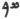

  
[Intangible Textual Heritage](../../index)  [Zoroastrianism](../index) 
[Index](index)  [Previous](sbe2315)  [Next](sbe2317) 

------------------------------------------------------------------------

[Buy this Book at
Amazon.com](https://www.amazon.com/exec/obidos/ASIN/1402185898/internetsacredte)

------------------------------------------------------------------------

*The Zend Avesta, Part II (SBE23)*, James Darmesteter, tr. \[1882\], at
Intangible Textual Heritage

------------------------------------------------------------------------

p. 159

### XI. SRÔSH YA*S*T HÂDHÔKHT.

There are two Ya*s*ts dedicated to Sraosha, the angel of divine
worship [1](#fn_731): one is a part of the
Yasna (LVII \[LVI\]), and this, the other, is called the Srôsh Ya*s*t
Hâdhôkht. Whether it belonged to the so-called Hâdhôkht Nosk [2](#fn_732), one of the twenty-one Nosks of which
the original Avesta was formed [3](#fn_733), or
whether it was recited in the Hâdhôkht sacrifice [4](#fn_734), a particular liturgy, is a matter on
which we have no sufficient information.

The two Ya*s*ts have a few developments in common (see §§ 89, 10-13):
the Hâdhôkht is more liturgical, the Yasna Ya*s*t is more descriptive,
and has to a greater degree the poetical imagery of a Ya*s*t.

The Srôsh Ya*s*t Hâdhôkht is recited every day, during any gâh except
the Rapitvîn. A Pahlavi translation of this Ya*s*t is extant (East India
Office, XII, 102; Paris, Supplément Persan, XXXIII, 259; edited in
Études Iraniennes, II), and Anquetil mentions a Sanskrit translation.

\_\_\_\_\_\_\_\_\_\_\_\_\_\_\_\_\_\_\_\_\_

0\. May Ahura Mazda be rejoiced! . . . .

Ashem Vohû: Holiness is the best of all good . . . .

I confess myself a worshipper of Mazda, a follower of Zarathu*s*tra, one
who hates the Daêvas and obeys the laws of Ahura;

For sacrifice, prayer, propitiation, and glorification unto \[Hâvani\],
the holy and master of holiness . . . .

Unto the holy, strong Sraosha, who is the incarnate Word, a
mighty-speared and lordly god,

Be propitiation, with sacrifice, prayer, propitiation, and
glorification.

Yathâ ahû vairyô: The will of the Lord is the law of holiness . . . .

p. 160

#### I.

1\. We sacrifice unto the holy, tall-formed, fiend-smiting Sraosha, who
makes the world increase, the holy and master of holiness.

Good prayer, excellent prayer to the worlds [1](#fn_735), O Zarathu*s*tra!

2\. This it is that takes away the friendship of the fiend and fiends,
of the he-fiend and of the she-fiend; it turns away in giddiness their
eyes, minds, ears [2](#fn_736), hands, feet,
mouths, and tongues [3](#fn_737); as good
prayer, without deceit and without harm, is Manly Courage [4](#fn_738), and turns away the Dru*g* [5](#fn_739).

3\. The holy Sraosha, the best protector of the poor, is fiend-smiting;
he is the best smiter of the Dru*g*.

The faithful one who pronounces most words of blessing is the most
victorious in victory; the Mãthra Spe*n*ta takes best the unseen Dru*g*
away. The Ahuna Vairya [6](#fn_740) is the best
fiend-smiter among all spells; the word of truth is the fighter [7](#fn_741) that is the best of all fiend-smiters.

The Law of the worshippers of Mazda is the truest giver of all the good
things, of all those that are the offspring of the good principle; and
so is the Law of Zarathu*s*tra.

4\. And he who should pronounce that word [8](#fn_742), O Zarathu*s*tra! either a man or a
woman, with a mind all intent on holiness, with words all intent on

p. 161

holiness, with deeds all intent on holiness, when he is in fear either
of high waters or of the darkness of a rainy night;

Or at the fords of a river, or at the branching-off of roads;

Or in the meeting together of the faithful, or the rushing together of
the worshippers of the Daêvas [1](#fn_743);

5\. Whether on the road [2](#fn_744) or in the
law [3](#fn_745) he has to fear, not in that
day nor in that night shall the tormenting fiend, who wants to torment
him, prevail to throw upon him the look of his evil eye, and the malice
of the thief [4](#fn_746) who carries off
cattle shall not reach him.

6\. Pronounce then that word, O Zarathu*s*tra! that word to be
spoken [5](#fn_747), when thou fall upon the
idolaters [6](#fn_748) and thieves and Daêvas
rushing together. Then the malice of the wicked worshippers of the
Daêvas, of the Yâtus and their followers, of the Pairikas and their
followers, will be affrighted and rush away. Down are the Daêvas! Down
are the Daêva-worshippers, and they take back their mouths from
biting [7](#fn_749).

p. 162

7\. And therefore we take around us the holy-natured Sraosha, the holy,
the fiend-smiter, as one does with shepherds’ dogs; therefore we
sacrifice unto the holy-natured Sraosha, the holy, the fiend-smiter,
with good thoughts, good words, and good deeds.

8 [1](#fn_750). For his brightness and glory,
for his strength and victorious power, for his offering sacrifices unto
the gods [2](#fn_751), I will offer him a
sacrifice worth being heard. I will offer up libations unto the holy
Sraosha, unto the great Ashi Vanguhi [3](#fn_752), and unto Nairyô-sangha [4](#fn_753), the tall-formed.

So may the holy Sraosha, the fiend-smiter, come to us for help!

9\. We worship the holy Sraosha; we worship the great master, Ahura
Mazda, who is supreme in holiness, who is the foremost to do deeds of
holiness.

We worship all the words [5](#fn_754) of
Zarathu*s*tra, and all the good deeds, those done and those to be done.

Yê*n*hê hâtãm: All those beings of whom Ahura Mazda . . . .

#### II.

10 [6](#fn_755). We sacrifice unto the holy,
tall-formed, fiend-smiting Sraosha, who makes the world increase, the
holy and master of holiness;

Who strikes the evil-doing [7](#fn_756) man,
who strikes the evil-doing woman; who smites the fiendish

p. 163

\[paragraph continues\] Dru*g*, and is
most strong and world-destroying; who maintains and looks over all this
moving [1](#fn_757) world;

11\. Who, never sleeping, wakefully guards the creation of Mazda; who,
never sleeping, wakefully maintains the creation of Mazda; who protects
all the material world with his club uplifted, from the hour when the
sun is down;

12\. Who never more did enjoy sleep from the time when the two Spirits
made the world, namely, the good Spirit and the evil One; who every day,
every night, fights with the Mâzainya Daêvas.

13\. He bows not for fear and fright before the Daêvas: before him all
the Daêvas bow for fear and fright reluctantly, and rush away to
darkness [2](#fn_758).

For his brightness and glory, for his strength and victorious power . .
. . [3](#fn_759)

### III.

14\. Yathâ ahû vairyô: The will of the Lord is the law of holiness . . .
.

We sacrifice unto the holy, tall-formed, fiend-smiting Sraosha, who
makes the world increase, the holy and master of holiness;

Who with peace and friendship [4](#fn_760)
watches the Dru*g* and the most beneficent Spirit: so that the
Amesha-Spe*n*tas may go along the seven Karshvares of the earth [5](#fn_761); who is the teacher of the

p. 164

\[paragraph continues\] Law [1](#fn_762): he himself was taught it by Ahura
Mazda, the holy One.

For his brightness and glory, for his strength and victorious power . .
. .

#### IV.

15\. Yathâ ahû vairyô: The will of the Lord is the law of holiness . . .
.

We sacrifice unto the holy, tall-formed, fiend-smiting Sraosha, who
makes the world increase, the holy and master of holiness;

Whom the holy Ahura Mazda has created to withstand Aêshma, the fiend of
the wounding spear; we sacrifice unto Peace, whose breath is friendly,
and unto the two withstanders of sin and guilt [2](#fn_763),

16\. The friends of the holy Sraosha;

The friends of Rashnu Razi*s*ta [3](#fn_764);

The friends of the good Law of the worshippers of Mazda;

The friends of Ar*s*tâ*t* [4](#fn_765), who
makes the world grow, who makes the world increase, who makes the world
prosper;

The friends of Ashi Vanguhi [5](#fn_766);

The friends of the good *K*isti [6](#fn_767);

The friends of the most right *K*ista [7](#fn_768);

p. 165

17\. The friends of all gods;

The friends of the Mãthra Spe*n*ta;

The friends of the fiend-destroying Law;

The friends of the long-traditional teaching;

The friends of the Amesha-Spe*n*tas;

The friends of ourselves, the Saoshya*nt*s [1](#fn_769), the two-footed part of the holy
creation;

The friends of all the beings of the holy world.

For his brightness and glory, for his strength and victorious power. . .
.

#### V.

18\. Yathâ ahû vairyô: The will of the Lord is the law of holiness . . .
.

We sacrifice unto the holy, tall-formed, fiend-smiting Sraosha, who
makes the world increase, the holy and master of holiness;

The first \[Sraosha\], the next, the middle, and the highest; with the
first sacrifice, with the next, with the middle, and with the
highest [2](#fn_770). We sacrifice unto all
\[the moments\] [3](#fn_771) of the holy and
strong Sraosha, who is the incarnate Word;

19\. The strong Sraosha, of the manly courage, the warrior of the strong
arms, who breaks the skulls of the Daêvas; who smites with heavy
blows [4](#fn_772) and is strong to smite; the
holy Sraosha, who smites

p. 166

with heavy blows; we sacrifice unto the crushing Ascendant of both the
holy Sraosha and Ar*s*ti [1](#fn_773).

20\. We sacrifice for all the houses protected by Sraosha, where the
holy Sraosha is dear and friendly treated and satisfied, as well as the
faithful man [2](#fn_774), rich in good
thoughts, rich in good words, rich in good deeds.

21\. We sacrifice unto the body of the holy Sraosha;

We sacrifice unto the body of Rashnu Razi*s*ta;

We sacrifice unto the body of Mithra, the lord of wide pastures;

We sacrifice unto the body of the holy wind;

We sacrifice unto the body of the good Law of the worshippers of Mazda;

We sacrifice unto the body of Ar*s*tâ*t*, who makes the world grow, who
makes the world increase, who makes the world prosper;

We sacrifice unto the body of Ashi Vanguhi;

We sacrifice unto the body of the good *K*isti;

We sacrifice unto the body of the most right *K*ista;

We sacrifice unto the bodies of all the gods;

22\. We sacrifice unto the body of the Mãthra Spe*n*ta;

We sacrifice unto the body of the fiend-destroying Law;

We sacrifice unto the body of the long-traditional teaching;

We sacrifice unto the bodies of the Amesha-Spe*n*tas;

p. 167

We sacrifice unto the bodies of ourselves, the Saoshya*nt*s, the
two-footed part of the holy creation;

We sacrifice unto the bodies of all the beings of the holy world [1](#fn_775).

For his brightness and glory, for his strength and victorious power . .
. . .

23\. Yathâ ahû vairyô: The will of the Lord is the law of holiness . . .
.

I bless the sacrifice and prayer, the strength and vigour of the holy,
strong Sraosha, who is the incarnate Word, a mighty-speared and lordly
god.

\[Give\] unto that man [2](#fn_776) brightness
and glory, . . . . give him the bright, all-happy, blissful abode of the
holy Ones!

------------------------------------------------------------------------

### Footnotes

[159:1](sbe2316.htm#fr_764) Cf. Vend. Introd.
IV, 31.

[159:2](sbe2316.htm#fr_765) Ibid. III, 3.

[159:3](sbe2316.htm#fr_766) See an account of
the Hâdhôkht Nosk in the Dînkart (West, Pahlavi Texts, I, 225, note);
cf. Introd. to Yt. XXI.

[159:4](sbe2316.htm#fr_767) Cf. § 18, note.

[160:1](sbe2316.htm#fr_768) 'Has been taught to
the world, namely, the Law' (Pahl. Comm.).

[160:2](sbe2316.htm#fr_769) Doubtful.

[160:3](sbe2316.htm#fr_770) Derezvã: Pahl.
hûzvân; cf. Yt. I, 28.

[160:4](sbe2316.htm#fr_771) Is the same with
it, is as powerful.

[160:5](sbe2316.htm#fr_772) Doubtful (vârethrem
dâre*s*tâ . . . . zak drû*g* vartî dâ*s*târtûm).

[160:6](sbe2316.htm#fr_773) See [p.
23](sbe2306.htm#page_23).

[160:7](sbe2316.htm#fr_774) Or, 'is the best of
all fiend-smiters in battle.'

[160:8](sbe2316.htm#fr_775) This chapter (Pahl.
Comm.).

[161:1](sbe2316.htm#fr_776) Different words are
used, as usual, to express the same conflict, according as it refers to
the faithful or to the idolaters.

[161:2](sbe2316.htm#fr_777) Aipi-ayanãm: madam
râs.

[161:3](sbe2316.htm#fr_778) Arethyanãm:
dâdistân (from aretha, meaning dînâ, dâdistân).

[161:4](sbe2316.htm#fr_779) Gadha: n*ris*a*m*sa
(Neriosengh); the Pahlavi has 
, a Saka, a Scythe.

[161:5](sbe2316.htm#fr_780) The praise of
Sraosha.

[161:6](sbe2316.htm#fr_781) Keresas*k*a:
krasîâk; cf. Neriosengh ad Yasna IX, 24 \[75\]; that name was in the
later periods applied to Christians, as if keresa were the name of
Christ; cf. Bahman Ya*s*t II, 19; III, 2.

[161:7](sbe2316.htm#fr_782) Doubtful.

[162:1](sbe2316.htm#fr_783) §§ 8-9 = Yasna
LVII, 3-4 \[LVI, 1, 6-12\].

[162:2](sbe2316.htm#fr_784) See Vend. Introd.
IV, 31.

[162:3](sbe2316.htm#fr_785) See Yt. XVII.

[162:4](sbe2316.htm#fr_786) See Vend. XXII, 7
\[22\] and Sîrôzah I, 9.

[162:5](sbe2316.htm#fr_787) The words of the
law.

[162:6](sbe2316.htm#fr_788) §§ 10-13 = Yasna
LVII, 15-18 \[LVI, 7\].

[162:7](sbe2316.htm#fr_789) Cf. Yt. I, 19.

[163:1](sbe2316.htm#fr_790) Cf. above, [p.
145](sbe2315.htm#page_145), note [1](sbe2315.htm#fn_669).

[163:2](sbe2316.htm#fr_791) To hell.

[163:3](sbe2316.htm#fr_792) As above, §§ 8-9.

[163:4](sbe2316.htm#fr_793) To the creation of
Ormazd.

[163:5](sbe2316.htm#fr_794) Doubtful. The Yasna
has: 'Through whose strength, victorious power, wisdom, and knowledge
the Amesha-Spe*n*tas go (avãn; Phl. sâtûnand) along the seven Karshvares
of the earth' (LVII, 23 \[LVI, 10, 2\]).

[164:1](sbe2316.htm#fr_795) He teaches the law
to the three saviours to come, Oshêdar Bâmî, Oshêdar Mâh, and Soshyôs
(Yasna LVII, 24 \[LVI, 10, 2\]; Phl. tr.).

[164:2](sbe2316.htm#fr_796) Pare*s*tas*k*a
mravay*â*os*k*a, to be corrected, according to various readings, into
staretas*k*a mavay*â*os*k*a or something like it; the two genii here
alluded to are Anâstareta and Amuyamna, Sinlessness and Innocence, who
are invoked in company with Akh*s*ti hamvai*ñ*ti in Vispêrad VIII, 4.

[164:3](sbe2316.htm#fr_797) See Yt. XII.

[164:4](sbe2316.htm#fr_798) See Yt. XVII.

[164:5](sbe2316.htm#fr_799) See Vend. XIX, 39.

[164:6](sbe2316.htm#fr_800) See ibid.

[164:7](sbe2316.htm#fr_801) See Yt. XVI, 1.

[165:1](sbe2316.htm#fr_802) The faithful, as
helping through their good deeds in the work of final restoration, to be
performed by Saoshya*nt* (cf. Yt. XIII, 17).

[165:2](sbe2316.htm#fr_803) The first sacrifice
is the Yasna sacrifice; the next (literally, superior) is the Vispêrad;
the middle sacrifice is the Hâdhôkht \[and\] êvak hômâst; the highest
sacrifice is the Dvâzdah hômâst (Pahl. Comm.). Sraosha is called the
first, next, middle, and highest, accordingly as he presides over one or
the other of those sacrifices. For a definition of the êvak hômâst and
Dvâzdah hômâst, see West, Pahlavi Texts, I, 212, note 5.

[165:3](sbe2316.htm#fr_804) Vîspãn, translated
harvisp zamân.

[165:4](sbe2316.htm#fr_805) Literally, the
smiter who smites with smitings.

[166:1](sbe2316.htm#fr_806) The same as
Ar*s*tâ*t*. Cf. Yasna LVII, 34-35 \[LVI, 13, 3-7\].

[166:2](sbe2316.htm#fr_807) He receives alms
(the ashô-dâd).

[167:1](sbe2316.htm#fr_808) Cf. §§ 16-17.

[167:2](sbe2316.htm#fr_809) Who sacrifices to
Sraosha.

------------------------------------------------------------------------

[Next: XII. Rashn Ya*s*t](sbe2317)
