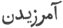
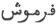

  
[Intangible Textual Heritage](../../index)  [Zoroastrianism](../index) 
[Index](index)  [Previous](sbe2318)  [Next](sbe2320) 

------------------------------------------------------------------------

[Buy this Book at
Amazon.com](https://www.amazon.com/exec/obidos/ASIN/1402185898/internetsacredte)

------------------------------------------------------------------------

*The Zend Avesta, Part II (SBE23)*, James Darmesteter, tr. \[1882\], at
Intangible Textual Heritage

------------------------------------------------------------------------

p. 231

#### XIV. BAHRÂM YA*S*T.

Regarding Bahrâm (Verethraghna), the Genius of Victory, see Vend.
Introd. V, 8.

This Ya*s*t can be divided into four parts:—

I (§§ 1-28). An enumeration of the ten incarnations in which
Verethraghna appeared to Zarathu*s*tra (as a wind, § 2; as a bull, § 7;
as a horse, § 9; as a camel, § 11; as a boar, § 15; as a youth, § 17; as
a raven, § 19; as a ram, § 23; as a buck, § 25; and as a man, § 27).

II (§§ 30-33). The powers given by Verethraghna to his worshipper,
Zarathu*s*tra.

III (§§ 34-46). The magical powers, ascribed to the raven's feather, of
striking terror into an army and dispersing it (the raven being the
seventh incarnation of Verethraghna).

IV (§§ 47-64). The glorification of Verethraghna.

\_\_\_\_\_\_\_\_\_\_\_\_\_\_\_\_\_\_\_\_\_\_\_\_\_\_\_\_

0\. May Ahura Mazda be rejoiced

Ashem Vohû: Holiness is the best of all good . . . .

I confess myself a worshipper of Mazda, a follower of Zarathu*s*tra, one
who hates the Daêvas and obeys the laws of Ahura;

For sacrifice, prayer, propitiation, and glorification unto \[Hâvani\],
the holy and master of holiness . . . .

Unto Verethraghna, made by Mazda, and unto the crushing Ascendant [1](#fn_1035);

Be propitiation, with sacrifice, prayer, propitiation, and
glorification.

Yathâ ahû vairyô: The will of the Lord is the law of holiness . . . .

#### I.

1\. We sacrifice unto Verethraghna, made by Ahura.

Zarathu*s*tra asked Ahura Mazda: 'Ahura Mazda, most beneficent Spirit,
Maker of the material world, thou Holy One!

p. 232

'Who is the best-armed of the heavenly gods?'

Ahura Mazda answered: 'It is Verethraghna, made by Ahura, O Spitama
Zarathu*s*tra!'

2\. Verethraghna, made by Ahura, came to him first, running in the shape
of a strong, beautiful wind, made by Mazda; he bore the good Glory, made
by Mazda, the Glory made by Mazda, that is both health and strength.

3\. Then he, who is the strongest [1](#fn_1036), said unto him [2](#fn_1037): 'I am the strongest in strength; I am
the most victorious in victory; I am the most glorious in Glory; I am
the most favouring in favour; I am the best giver of welfare; I am the
best-healing in health-giving.

4\. 'And I shall destroy the malice of all the malicious, the malice of
Daêvas and men, of the Yâtus and Pairikas, of the oppressors, the blind,
and the deaf.

5\. 'For his brightness and glory, I will offer unto him a sacrifice
worth being heard; namely, unto Verethraghna, made by Ahura. We worship
Verethraghna, made by Ahura, with an offering of libations, according to
the primitive ordinances of Ahura; with the Haoma and meat, the baresma,
the wisdom of the tongue, the holy spells, the speech, the deeds, the
libations, and the rightly-spoken words.

'Yê*n*hê hâtãm: All those beings of whom Ahura Mazda. . . .

#### II.

6\. 'We sacrifice unto Verethraghna, made by Ahura.'

p. 233

Zarathu*s*tra asked Ahura Mazda: 'Ahura Mazda, most beneficent Spirit,
Maker of the material world, thou Holy One!

'Who is, the best-armed of the heavenly Gods?'

Ahura Mazda answered: 'It is Verethraghna, made by Ahura, O Spitama
Zarathu*s*tra!'

7\. Verethraghna, made by Ahura, came to him the second time, running in
the shape of a beautiful bull, with yellow ears and golden horns; upon
whose horns floated the well-shapen Strength, and Victory, beautiful of
form, made by Ahura: thus did he come, bearing the good Glory, made by
Mazda, the Glory made by Mazda, that is both health and strength.

Then he, who is the strongest, said unto him: 'I am the strongest in
strength . . . [1](#fn_1038)

'And I shall destroy the malice of all malicious . . . . [2](#fn_1039)'

For his brightness and glory, I will offer unto him a sacrifice worth
being heard . . . . [3](#fn_1040)

#### III.

8\. We sacrifice unto Verethraghna, made by Ahura.

Zarathu*s*tra asked Ahura Mazda: 'Ahura Mazda, most beneficent Spirit,
Maker of the material world, thou Holy One!

'Who is the best-armed of the heavenly gods?'

Ahura Mazda answered: 'It is Verethraghna, made by Ahura, O Spitama
Zarathu*s*tra!'

9\. Verethraghna, made by Ahura, came to him the third time, running in
the shape of a white, beautiful horse, with yellow ears and a golden
caparison; upon whose forehead floated the well-shapen Strength,

p. 234

and Victory, beautiful of form, made by Ahura: thus did he come, bearing
the good Glory, made by Mazda, that is both health and strength.

Then he, who is the strongest, said unto him: 'I am the strongest in
strength . . . .

'And I shall destroy the malice of all malicious . . . .'

For his brightness and glory, I will offer unto him a sacrifice worth
being heard . . . .

#### IV.

10\. We sacrifice unto Verethraghna, made by Ahura.

Zarathu*s*tra asked Ahura Mazda: 'Ahura Mazda, most beneficent Spirit,
Maker of the material world, thou Holy One!

'Who is the best-armed of the heavenly gods?'

Ahura Mazda answered: 'It is Verethraghna, made by Ahura, O Spitama
Zarathu*s*tra!'

11\. Verethraghna, made by Ahura, came to him the fourth time, running
in the shape of a burden-bearing [1](#fn_1041)
camel, sharp-toothed [2](#fn_1042), swift . .
. . [3](#fn_1043), stamping forwards,
long-haired, and living in the abodes of men [4](#fn_1044);

12\. Who of all males in rut shows greatest strength and greatest fire,
when he goes to his females. Of all females those are best kept whom a
burden-bearing camel keeps, who has thick forelegs and large humps, . .
. . [5](#fn_1045), quick-eyed, long-headed,
bright, tall, and strong;

13\. Whose piercing look goes afar . . . . [6](#fn_1046), even in the dark of the night; who
throws white foam

p. 235

along his mouth; well-kneed, well-footed, standing with the countenance
of an all-powerful master:

Thus did Verethraghna come, bearing the good Glory made by Mazda, the
Glory made by Mazda . . . .

#### V.

14, We sacrifice unto Verethraghna, made by Ahura.

Zarathu*s*tra asked Ahura Mazda: 'Ahura Mazda, most beneficent Spirit,
Maker of the material world, thou Holy One!

'Who is the best-armed of the heavenly gods?'

Ahura Mazda answered: 'It is Verethraghna, made by Ahura, O Spitama
Zarathu*s*tra!'

15\. Verethraghna, made by Ahura, came to him the fifth time, running in
the shape of a boar, opposing the foes, a sharp-toothed he-boar, a
sharp-jawed boar, that kills at one stroke, pursuing, wrathful, with a
dripping face [1](#fn_1047), strong, and swift
to run, and rushing all around [2](#fn_1048).
Thus did Verethraghna come, bearing the good Glory made by Mazda, the
Glory made by Mazda. . . .

#### VI.

16\. We sacrifice unto Verethraghna, made by Ahura.

Zarathu*s*tra asked Ahura Mazda: 'Ahura Mazda, most beneficent Spirit,
Maker of the material world, thou Holy One!

'Who is the best-armed of the heavenly gods?'

Ahura Mazda answered: 'It is Verethraghna, made by Ahura, O Spitama
Zarathu*s*tra!'

p. 236

17\. Verethraghna, made by Ahura, came to him the sixth time, running in
the shape of a beautiful youth of fifteen, shining, clear-eyed,
thin-heeled.

Thus did Verethraghna come, bearing the good Glory made by Mazda, the
Glory made by Mazda . . . .

#### VII.

18\. We sacrifice unto Verethraghna, made by Ahura.

Zarathu*s*tra asked Ahura Mazda: 'Ahura Mazda, most beneficent Spirit,
Maker of the material world, thou Holy One!

'Who is the best-armed of the heavenly gods?'

Ahura Mazda answered: 'It is Verethraghna, made by Ahura, O Spitama
Zarathu*s*tra!'

19\. Verethraghna, made by Ahura, came to him the seventh time, running
in the shape of a raven that . . . . [1](#fn_1049) below and . . . . [1](#fn_1049) above, and that is the swiftest of all
birds, the lightest of the flying creatures.

20\. He alone of living things,—he or none,—overtakes the flight of an
arrow, however well it has been shot. He flies up joyfully at the first
break of dawn, wishing the night to be no more, wishing the dawn, that
has not yet come, to come [2](#fn_1050).

21\. He grazes the hidden ways [3](#fn_1051)
of the mountains, he grazes the tops of the mountains, he grazes the
depths of the vales, he grazes the summit [4](#fn_1052) of the trees, listening to the voices
of the birds.

p. 237

Thus did Verethraghna come, bearing the good Glory made by Mazda [1](#fn_1053), the Glory made by Mazda . . . .

#### VIII.

22\. We sacrifice unto Verethraghna, made by Ahura.

Zarathu*s*tra asked Ahura Mazda: 'Ahura Mazda, most beneficent Spirit,
Maker of the material world, thou Holy One!

'Who is the best-armed of the heavenly gods?'

Ahura Mazda answered: 'It is Verethraghna, made by Ahura, O Spitama
Zarathu*s*tra!'

23\. Verethraghna, made by Ahura, came to him the eighth time, running
in the shape of a wild, beautiful ram, with horns bent round [2](#fn_1054).

Thus did Verethraghna come, bearing the good Glory made by Mazda [3](#fn_1055), the Glory made by Mazda . . . .

#### IX.

24\. We sacrifice unto Verethraghna, made by Ahura.

Zarathu*s*tra asked Ahura Mazda: 'Ahura Mazda, most beneficent Spirit,
Maker of the material world, thou Holy One!

'Who is the best-armed of the heavenly gods?'

Ahura Mazda answered: 'It is Verethraghna, made by Ahura, O Spitama
Zarathu*s*tra!'

p. 238

25\. Verethraghna, made by Ahura, came to him the ninth time, running in
the shape of a beautiful, fighting buck, with sharp horns.

Thus did Verethraghna come, bearing the good Glory made by Mazda, the
Glory made by Mazda. . . .

#### X.

26\. We sacrifice unto Verethraghna, made by Ahura.

Zarathu*s*tra asked Ahura Mazda: 'Ahura Mazda, most beneficent Spirit,
Maker of the material world, thou Holy One!

'Who is the best-armed of the heavenly gods?'

Ahura Mazda answered: 'It is Verethraghna, made by Ahura, O Spitama
Zarathu*s*tra!'

27\. Verethraghna, made by Ahura, came to him the tenth time, running in
the shape of a man, bright and beautiful, made by Mazda: he held a sword
with a golden blade, inlaid with all sorts of ornaments.

Thus did Verethraghna come, bearing the good Glory made by Mazda, the
Glory made by Mazda. . . .

#### XI.

28\. We sacrifice unto Verethraghna, made by Ahura, who makes virility,
who makes death, who makes resurrection, who possesses peace, who has a
free way.

Unto him did the holy Zarathu*s*tra offer up a sacrifice, \[asking\] for
victorious thinking, victorious speaking, victorious doing, victorious
addressing, and victorious answering.

29\. Verethraghna, made by Ahura, gave him the

p. 239

fountains of manliness [1](#fn_1056), the
strength of the arms, the health of the whole body, the sturdiness of
the whole body, and the eye-sight of the Kara fish [2](#fn_1057), that lives beneath the waters and can
measure [3](#fn_1058) a rippling of the water,
not thicker than a hair, in the Rangha whose ends lie afar, whose depth
is a thousand times the height of a man [4](#fn_1059).

For his brightness and glory, I will offer unto him a sacrifice worth
being heard . . . .

#### XII.

30\. We sacrifice unto Verethraghna, made by Ahura, who makes virility,
who makes death, who makes resurrection, who possesses peace, who has a
free way.

Unto him did the holy Zarathu*s*tra offer up a sacrifice, \[asking\] for
victorious thinking, victorious speaking, victorious doing, victorious
addressing, and victorious answering.

31\. Verethraghna, made by Ahura, gave him the fountains of manliness,
the strength of the arms, the health of the whole body, the sturdiness
of the whole body, and the eye-sight of the male horse, that, in the
dark of the night, in its first half [5](#fn_1060) and through the rain, can perceive a
horse's hair lying on the ground and knows whether it is from the head
or from the tail [6](#fn_1061).

p. 240

For his brightness and glory, I will offer unto him a sacrifice worth
being heard . . . .

#### XIII.

32\. We sacrifice unto Verethraghna, made by Ahura, who makes virility,
who makes death, who makes resurrection, who possesses peace, who has a
free way.

Unto him did the holy Zarathu*s*tra sacrifice, \[asking\] for victorious
thinking, victorious speaking, victorious doing, victorious addressing,
and victorious answering.

33\. Verethraghna, made by Ahura, gave him the fountains of virility,
the strength of the arms, the health of the whole body, the sturdiness
of the whole body, and the eye-sight of the vulture with a golden
collar [1](#fn_1062), that, from as far as
nine districts, can perceive a piece of flesh not thicker than the fist,
giving just as much light as a needle gives, as the point of a needle
gives [2](#fn_1063).

For his brightness and glory, I will offer unto him a sacrifice worth
being heard . . . .

#### XIV.

34\. We sacrifice unto Verethraghna, made by Ahura.

Zarathu*s*tra asked Ahura Mazda: 'Ahura Mazda, most beneficent Spirit,
Maker of the material world, thou Holy One!

p. 241

'If I have a curse thrown upon me, a spell told upon me by the many men
who hate me, what is the remedy for it?'

35\. Ahura Mazda answered: Take thou a feather of that bird with . . .
. [1](#fn_1064) feathers, the Vâre*ng*ana, O
Spitama Zarathu*s*tra! With that feather thou shalt rub thy own
body [2](#fn_1065), with that feather thou
shalt curse back thy enemies.

36\. 'If a man holds a bone of that strong bird, or a feather of that
strong bird, no one can smite or turn to flight that fortunate man. The
feather of that bird of birds brings him help; it brings unto him the
homage of men, it maintains in him his glory.

37\. 'Then the sovereign, the lord of countries, will no longer kill
his [3](#fn_1066) hundreds, though he is a
killer of men; the . . . . [4](#fn_1067) will
not kill at one stroke; he alone smites and goes forwards.

38\. 'All tremble before him who holds the feather, they tremble
therefore before me; all my enemies tremble before me and fear my
strength and victorious force and the fierceness established in my body.

39\. 'He [5](#fn_1068) carries the chariot of
the lords; he carries the chariots of the lordly ones, the chariots of
the sovereigns. He carried the chariot of Kavi

p. 242

\[paragraph continues\] Usa [1](#fn_1069); upon his wings runs the male
horse [2](#fn_1070), runs the burden-bearing
camel, runs the water of the river.

40\. 'Him rode the gallant Thraêtaona, who smote A*z*i Dahâka, the
three-mouthed, the three-headed, the six-eyed, who had a thousand
senses; that most powerful, fiendish Dru*g*, that demon, baleful to the
world, the strongest Dru*g* that Angra Mainyu created against the
material world, to destroy the world of the good principle [3](#fn_1071).

'For his brightness and glory, I will offer unto him a sacrifice worth
being heard . . . .

#### XV.

41\. 'We sacrifice to Verethraghna, made by Ahura.

'Verethraghna confounds the glory of this house with its wealth in
cattle. He is like that great bird, the Saêna [4](#fn_1072); he is like the big clouds, full of
water, that beat the mountains.

'For his brightness and glory, I will offer unto him a sacrifice worth
being heard . . . .

#### XVI.

42\. 'We sacrifice to Verethraghna, made by Ahura.'

Zarathu*s*tra asked Ahura Mazda: 'Ahura Mazda, most beneficent Spirit,
Maker of the material world, thou Holy One!

'Where is it that we must invoke the name of Verethraghna, made by
Ahura? Where is it that

p. 243

we must praise him? That we must humbly praise him?'

43\. Ahura Mazda answered: 'When armies meet together in full array, O
Spitama Zarathu*s*tra! (asking) which of the two is the party that
conquers and is not crushed, that smites and is not smitten;

44\. 'Do thou throw [1](#fn_1073) four
feathers [2](#fn_1074) in the way. Whichever
of the two will first worship the well-shapen Strength, and
Verethraghna, beautiful of form, made by Mazda, on his side will victory
stand.

45\. 'I will bless Strength and Victory, the two keepers, the two good
keepers, the two maintainers; the two who . . . . [3](#fn_1075), the two who . . . . [3](#fn_1075), the two who . . . . [3](#fn_1075); the two who forgive, the two who
strike off, the two who forget [4](#fn_1076).

46\. 'O Zarathu*s*tra! let not that spell be shown to any one, except by
the father to his son, or by the brother to his brother from the same
womb, or by the Âthravan to his pupil [5](#fn_1077). These are words that are awful and
powerful, awful and assembly-ruling, awful and victorious, awful and
healing; these are words that save the head that was lost and chant away
the uplifted weapon.'

#### XVII.

47\. We sacrifice to Verethraghna, made by Ahura: who goes along the
armies arrayed, and goes here

p. 244

and there asking, along with Mithra and Rashnu: 'Who is it who lies unto
Mithra? Who is it who thrusts \[his oath\] against Rashnu [1](#fn_1078)? To whom shall I, in my might, impart
illness and death [2](#fn_1079)?

48 [3](#fn_1080). Ahura Mazda said: 'If men
sacrifice unto Verethraghna, made by Ahura, if the due sacrifice and
prayer is offered unto him just as it ought to be performed in the
perfection of holiness, never will a hostile horde enter the Aryan
countries, nor any plague, nor leprosy, nor venomous plants, nor the
chariot of a foe, nor the uplifted spear of a foe.'

49 [4](#fn_1081). Zarathu*s*tra asked: 'What
is then, O Ahura Mazda! the sacrifice and invocation in honour of
Verethraghna, made by Ahura, as it ought to be performed in the
perfection of holiness?'

50\. Ahura Mazda answered: 'Let the Aryan nations bring libations unto
him; let the Aryan nations tie bundles of baresma for him; let the Aryan
nations cook for him a head of cattle, either white, or black, or of any
other colour, but all of one and the same colour.

51\. 'Let not a murderer take of those offerings, nor a whore, nor a . .
. ., who does not sing the Gâthâs, who spreads death in the world and
withstands the law of Mazda, the law of Zarathu*s*tra.

52\. 'If a murderer take of those offerings, or a whore, or a . . . .,
who does not sing the Gâthâs, then Verethraghna, made by Ahura, takes
back his healing virtues.

p. 245

53\. 'Plagues will ever pour upon the Aryan nations; hostile hordes will
ever fall upon the Aryan nations; the Aryans will be smitten by their
fifties and their hundreds, by their hundreds and their thousands, by
their thousands and their tens of thousands, by their tens of thousands
and their myriads of myriads.'

54\. There Verethraghna, made by Ahura, proclaimed thus: 'The Soul of
the Bull [1](#fn_1082), the wise creature,
does not receive from man due sacrifice and prayer; for now the Daêvas
and the worshippers of the Daêvas make blood flow and spill it like
water;

55\. 'For now the . . . . [2](#fn_1083) Daêvas
and the worshippers of the Daêvas bring to the fire the plant that is
called Haperesi, the wood that is called Neme*t*ka [3](#fn_1084);

56\. '(Therefore) when the . . . . [2](#fn_1083) Daêvas and the worshippers of the
Daêvas bow their backs, bend their waists, and arrange all their
limbs [4](#fn_1085), they think they will
smite and smite not, they think they will kill and kill not; and then
the . . . Daêvas and the worshippers of the Daêvas have their minds
confounded and their eyes made giddy [5](#fn_1086).'

For his brightness and glory, I will offer unto him a sacrifice worth
being heard . . . .

p. 246

#### XVIII.

57\. We sacrifice to Verethraghna, made by Ahura.

I offer up Haoma, who saves one's head [1](#fn_1087); I offer up the victorious Haoma; I
offer him up, the good protector; I offer up Haoma, who is a protector
to my body, as a man who shall drink [2](#fn_1088) of him shall win and prevail [3](#fn_1089) over his enemies in battle;

58\. That I may smite this army, that I may smite down this army, that I
may cut in pieces this army that is coming behind me.

For his brightness and glory, I will offer unto him a sacrifice worth
being heard . . . .

#### XIX.

59\. We sacrifice to Verethraghna, made by Ahura.

The prince and his son and his sons who are chiefs of myriads [4](#fn_1090) offer him up a bright . . . . [5](#fn_1091) \[saying\]: 'He is strong, and
Victorious is his name; he is victorious, arid Strong is his name;'

60\. That I may be as constantly victorious as any one of all the
Aryans [6](#fn_1092); that I may smite this
army, that I may smite down this army, that I may cut in pieces this
army that is coming behind me.

For his brightness and glory, I will offer unto him a sacrifice worth
being heard . . . .

p. 247

#### XX.

61\. We sacrifice to Verethraghna, made by Ahura.

Yathâ ahû vairyô: The will of the Lord is the law of holiness . . . .

In the ox is our strength, in the ox is our need [1](#fn_1093); in the ox is our speech, in the ox is
our victory; in the ox is our food, in the ox is our clothing; in the ox
is tillage, that makes food grow for us.

For his brightness and glory, I will offer unto him a sacrifice worth
being heard . . . .

#### XXI.

62\. We sacrifice to Verethraghna, made by Ahura;

Who breaks the columns asunder, who cuts the columns to pieces, who
wounds the columns, who makes the columns shake; who comes and breaks
the columns asunder, who comes and cuts the columns to pieces, who comes
and wounds the columns, who comes and makes the columns shake, both of
Daêvas and men, of the Yâtus and Pairikas, of the oppressors, the blind,
and the deaf.

For his brightness and glory, I will offer unto him a sacrifice worth
being heard . . .

#### XXII.

63\. We sacrifice to Verethraghna, made by Ahura.

When Verethraghna, made by Ahura, binds the hands, confounds the
eye-sight, takes the hearing

p. 248

from the ears of the Mithradru*g*es [1](#fn_1094) marching in columns, allied by cities,
they can no longer move their feet, they can no longer withstand.

For his brightness and glory, I will offer unto him a sacrifice worth
being heard . . . .

64\. Yathâ ahû vairyô: The will of the Lord is the law of holiness. . .
. .

I bless the sacrifice and prayer, and the strength and vigour of
Verethraghna, made by Mazda; and of the crushing Ascendant.

Ashem Vohû: Holiness is the best of all good . . . .

\[Give\] unto that man [2](#fn_1095)
brightness and glory, . . . . give him the bright, all-happy, blissful
abode of the holy Ones.

------------------------------------------------------------------------

### Footnotes

[231:1](sbe2319.htm#fr_1093) Sîrôzah I, 20.

[232:1](sbe2319.htm#fr_1094) Verethraghna.

[232:2](sbe2319.htm#fr_1095) Zarathu*s*tra.

[233:1](sbe2319.htm#fr_1096) As above, § 3.

[233:2](sbe2319.htm#fr_1097) As above, § 4.

[233:3](sbe2319.htm#fr_1098) As above, § 5.

[234:1](sbe2319.htm#fr_1099) Doubtful
(vadharôi*s*).

[234:2](sbe2319.htm#fr_1100) Doubtful
(dadãsôi*s*).

[234:3](sbe2319.htm#fr_1101) ? Urvatô; cf. §
19.

[234:4](sbe2319.htm#fr_1102) Tame,
domesticated.

[234:5](sbe2319.htm#fr_1103) ? Smar*s*nô.

[234:6](sbe2319.htm#fr_1104) ? Haitahê.

[235:1](sbe2319.htm#fr_1105) Cf. Yt. X, 70.

[235:2](sbe2319.htm#fr_1106) Or better,
rushing before. Cf. Yt. X, 127.

[236:1](sbe2319.htm#fr_1108) ? Urvatô,
pishatô.

[236:2](sbe2319.htm#fr_1109) The raven was
sacred to Apollo. The priests of the sun in Persia are said to have been
named ravens (Porphyrius). Cf. Georgica I, 45.

[236:3](sbe2319.htm#fr_1110) Reading vîgâtavô.

[236:4](sbe2319.htm#fr_1111) Doubtful.

[237:1](sbe2319.htm#fr_1112) The royal Glory
is described flying in the shape of a raven, Yt. XIX, 35.

[237:2](sbe2319.htm#fr_1113) Doubtful.

[237:3](sbe2319.htm#fr_1114) While Ardashîr,
the founder of the Sasanian dynasty, was flying from Ardavân, a
beautiful wild ram ran after him and overtook him, and Ardavân
understood from this that the kingly Glory had left him and had passed
over to his rival (Shâh Nâmah, Ardashîr; Kâr Nâmakî Artachshîr, tr.
Noeldeke, p. 45).

[239:1](sbe2319.htm#fr_1115) Erezi, Pahl. gond
(Old Zand-Pahlavi Dictionary, p. 11)

[239:2](sbe2319.htm#fr_1116) See Vendîdâd XIX,
42.

[239:3](sbe2319.htm#fr_1117) Possibly,
perceive.

[239:4](sbe2319.htm#fr_1118) Cf. Yt. XVI, 7,
and Bundahi*s* XVIII, 6: 'those fish . . . . know the scratch of a
needle's point (or better hole) by which the water shall increase, or by
which it is diminishing' (tr. West).

[239:5](sbe2319.htm#fr_1119) Avakhshaity*a*u,
the night before hu-vakhsha (before the time when the light begins to
grow; midnight).

[239:6](sbe2319.htm#fr_1120) Cf. Yt. XVI, 10,
and Bundahi*s* XIX, 32: 'Regarding the Arab p.
240 horse, they say that if, in a dark night, a single hair
occurs on the ground, he sees it' (tr. West).

[240:1](sbe2319.htm#fr_1121) Possibly the
Gypaetus, the vautour doré.

[240:2](sbe2319.htm#fr_1122) 'Even from his
highest flight, he (the vulture) sees when flesh the size of a fist is
on the ground' (Bund. XIX, 31; tr. West). Cf. Horapollo (I, 11).

[241:1](sbe2319.htm#fr_1123) Peshô-parena. The
Vâre*ng*ana is the same bird as the Vâraghna, the raven.

[241:2](sbe2319.htm#fr_1124) The feather of
the Vâre*ng*ana plays here the same part as the Sîmurgh's feather in the
Shâh Nâmah. When Rûdâbah's flank was opened to bring forth Rustem, her
wound was healed by rubbing it with a Sîmurgh's feather; Rustem, wounded
to death by Isfendyâr, was cured in the same manner.

[241:3](sbe2319.htm#fr_1125) Of him who holds
that feather.

[241:4](sbe2319.htm#fr_1126) ? Vaêsaêpa.

[241:5](sbe2319.htm#fr_1127) That bird.

[242:1](sbe2319.htm#fr_1128) Kai Kaus; when he
tried to ascend to heaven on a throne carried by eagles (Journal
Asiatique, 1881, I, 513).

[242:2](sbe2319.htm#fr_1129) A metaphor to
express the swiftness of the wind, of the camel, and of the rivers.

[242:3](sbe2319.htm#fr_1130) Cf. Yt. V, 34.

[242:4](sbe2319.htm#fr_1131) The Sîmurgh; cf.
[p. 241](#page_241), note [2](#fn_1065).

[243:1](sbe2319.htm#fr_1132) Doubtful.

[243:2](sbe2319.htm#fr_1133) Or an arrow
feathered with four Vâre*ng*ana's feathers.

[243:3](sbe2319.htm#fr_1136) Â-dhwao*z*en,
vî-dhwao*z*en, fra-dhwao*z*en.

[243:4](sbe2319.htm#fr_1137) Âmarezen, cf.
 ; vîmarezen, cf. Yt. I,
2; fra marezen, cf.  .

[243:5](sbe2319.htm#fr_1138) Cf. Yt. IV, 10.

[244:1](sbe2319.htm#fr_1139) Against truth.

[244:2](sbe2319.htm#fr_1140) Cf. Yt. X, 108
seq.

[244:3](sbe2319.htm#fr_1141) § 48; cf. Yt.
VIII, 56.

[244:4](sbe2319.htm#fr_1142) §§ 49-53 = Yt.
VIII, 57-61.

[245:1](sbe2319.htm#fr_1143) Gô*s*ûrûn or
Drvâspa; see Yt. IX. The destruction of any living being is an injury to
Drvâspa.

[245:2](sbe2319.htm#fr_1146) ? Vyâmbura.

[245:3](sbe2319.htm#fr_1145) The Haperesi and
the Neme*t*ka are probably some species of green wood; it is forbidden
to put green wood in the fire as it kills it, and injures the Genius of
Water at the same time.

[245:4](sbe2319.htm#fr_1147) In order to
strike.

[245:5](sbe2319.htm#fr_1148) The general
meaning of the last four clauses is that the impious are defeated.

[246:1](sbe2319.htm#fr_1149) ? Sâiri-baoghem;
cf. § 46.

[246:2](sbe2319.htm#fr_1150) Nivazaiti;
literally, swallow (? frôt ô bun burtan, Vend. V, 8 \[26\]).

[246:3](sbe2319.htm#fr_1151) Literally,
overtake.

[246:4](sbe2319.htm#fr_1152) Cf. Yt. V, 85.

[246:5](sbe2319.htm#fr_1153) ? Asânem
sighûirê.

[246:6](sbe2319.htm#fr_1154) Cf. Yt. V, 69.

[247:1](sbe2319.htm#fr_1155) From Yasna X, 20
(62), where, instead of the words, 'in the ox is our strength (amem), in
the ox is our need,' the text has, 'in the ox is his need, in the ox is
our need,' meaning, 'when we give him his need (water and grass), he
gives us our need (milk and calves),' (Pahl. tr.).

[248:1](sbe2319.htm#fr_1156) See [p.
120](sbe2315.htm#page_120), note [2](sbe2315.htm#fn_558).

[248:2](sbe2319.htm#fr_1157) Who shall offer a
sacrifice to Verethraghna.

------------------------------------------------------------------------

[Next: XV. Râm Ya*s*t](sbe2320)
