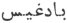

  
[Intangible Textual Heritage](../../index)  [Zoroastrianism](../index) 
[Index](index)  [Previous](sbe2323)  [Next](sbe2325) 

------------------------------------------------------------------------

[Buy this Book at
Amazon.com](https://www.amazon.com/exec/obidos/ASIN/1402185898/internetsacredte)

------------------------------------------------------------------------

*The Zend Avesta, Part II (SBE23)*, James Darmesteter, tr. \[1882\], at
Intangible Textual Heritage

------------------------------------------------------------------------

p. 286

### XIX. ZAMYÂD YA*S*T.

This Ya*s*t, inscribed to the Genius of the Earth, is devoted to a
description of the mountains and the kingly Glory (kavaêm *Hv*arenô),
which are invoked, together with the Earth, in the corresponding formula
of the Sîrôzah (§ 28): there is no Ya*s*t devoted to the Earth itself.

The mountains are simply enumerated (§§ 1-8). The rest of the Ya*s*t is
devoted to the praise of the *Hv*arenô, or, more precisely, to that of
those who possessed it, whose powers or feats are described. The list
begins with Ahura Mazda (§ 10), and closes with Saoshya*nt* (§ 89); that
is to say, it begins with the beginning of the world, and closes with
its end. It includes the Amesha-Spe*n*tas (§ 15), Haoshyangha (§ 26),
Takhma Urupa (§ 28), Yima (§ 31), Mithra (§ 35), Thraêtaona (§ 36),
Keresâspa (§ 38), the kings of the Kaianyan dynasty (§§ 66-72), Kavi
Husravah (§ 74), Zarathu*s*tra (§ 79), Vî*s*tâspa (§ 84). The
unsuccessful efforts of Franghrasyan to take possession of it are
described at length (§§ 56-64).

This Ya*s*t would serve as a short history of the Iranian monarchy, an
abridged Shah Nâmah.

\_\_\_\_\_\_\_\_\_\_\_\_\_\_\_\_\_\_\_\_\_\_\_\_\_\_\_\_\_\_\_\_\_\_

0\. May Ahura Mazda be rejoiced! . . . .

Ashem Vohû: Holiness is the best of all good . . .

I confess myself a worshipper of Mazda, a follower of Zarathu*s*tra, one
who hates the Daêvas and obeys the laws of Ahura;

For sacrifice, prayer, propitiation, and glorification unto \[Hâvani\],
the holy and master of holiness . . . .

Unto Mount Ushi-darena, made by Mazda, the seat of holy happiness; unto
the kingly Glory, made by Mazda; unto that Glory that cannot be forcibly
seized, made by Mazda [1](#fn_1205),

p. 287

Be propitiation, with sacrifice, prayer, propitiation, and
glorification.

Yathâ ahû vairyô: The will of the Lord is the law of holiness . . . .

#### I.

1\. The first mountain that rose up out of the earth, O Spitama
Zarathu*s*tra! was the Haraiti Barez [1](#fn_1206). That mountain stretches all along the
shores of the land washed by waters [2](#fn_1207) towards the east.

The second mountain was Mount Zeredhô, outside [3](#fn_1208) Mount Manusha [4](#fn_1209): this mountain too stretches all along
the shores of the land washed by waters towards the east.

2\. From there grew up Mount Ushi-dh*a*u Ushi-darena [5](#fn_1210), Mount Erezifya [6](#fn_1211), and Mount Fraorepa.

The sixth was Mount Erezura [7](#fn_1212).

The seventh was Mount Bumya [8](#fn_1213).

The eighth was Mount Raoidhita [9](#fn_1214).

p. 288

The ninth was Mount Mazi*s*i*s*v*a*u.

The tenth was Mount A*n*tare-danghu.

The eleventh was Mount Erezisha.

The twelfth was Mount Vâiti-gaêsa [1](#fn_1215).

3\. And Mount Âdarana, Mount Bayana, Mount I*s*kata Upairi-saêna [2](#fn_1216), with the . . . . [3](#fn_1217) snows; the two Hama*n*kuna mountains,
the eight Vasna mountains, the eight powerful Frâva*n*ku, the four
Vidhvana summits;

4\. Mount Aêzakha, Mount Maênakha, Mount Vâkhedrakaê, Mount Asaya, Mount
Tudhaskaê, Mount I*s*avaê, Mount Draoshi*s*v*a*u, Mount Sâiriv*a*u,
Mount Nanghu*s*m*a*u, Mount Kakahyu, Mount A*n*tare-Kangha [4](#fn_1218);

5\. Mount Si*k*idava [5](#fn_1219), Mount
Ahuna, Mount Raêmana, Mount Asha-stembana, Mount Urunyô-vâidhkaê, Mount
Âsnava*nt* [6](#fn_1220), Mount Ushaoma, Mount
U*s*ta-*hv*arenah, Mount Syâmaka [7](#fn_1221), Mount Vafray*a*u, Mount Vourusha;

p. 289

6\. Amongst which stand Mount *G*atara, Mount Adhutavau, Mount
Spitavarena, Mount Spe*n*tô-dâta [1](#fn_1222), Mount Kadrva-aspa [2](#fn_1223), Mount Kaoirisa [3](#fn_1224), Mount Taêra [4](#fn_1225), Mount Barô-srayana, Mount Barana,
Mount Frâpay*a*u, Mount Udrya, and Mount Raêva*nt* [5](#fn_1226), and all those heights to which men
have given the name of mount,

7\. To the number of two thousand mountains, and two hundred and forty
and four [6](#fn_1227), O Spitama
Zarathu*s*tra!

8\. For its brightness and glory, I will offer it a sacrifice worth
being heard, namely, unto the awful kingly Glory. Unto the awful kingly
Glory we offer up the libations, the Haoma and meat, the baresma, the
wisdom of the tongue, the holy spells, the speech, the deeds, the
libations, and the rightly-spoken words [7](#fn_1228).

Yê*n*hê hâtãm: All those beings of whom Ahura Mazda [7](#fn_1228) . . . .

#### II.

9\. We sacrifice unto the awful kingly Glory, made by Mazda; most
conquering, highly working, that possesses health, wisdom, and
happiness, and is more powerful to destroy than all other creatures;

p. 290

10\. That belongs to Ahura Mazda, as (through it) Ahura Mazda made the
creatures, many and good, many and fair, many and wonderful, many and
prosperous, many and bright;

11 [1](#fn_1229). So that they may restore the
world, which will (thenceforth) never grow old and never die, never
decaying and never rotting, ever living and ever increasing, and master
of its wish, when the dead will rise, when life and immortality will
come, and the world will be restored at its wish;

12\. When the creation will grow deathless,—the prosperous creation of
the Good Spirit,—and the Dru*g* shall perish, though she may rush on
every side to kill the holy beings; she and her hundredfold brood shall
perish, as it is the will of the Lord [2](#fn_1230).

13\. For its brightness and glory, I will offer it a sacrifice . . . .

#### III.

14\. We sacrifice unto the awful kingly Glory, made by Mazda . . .
. [3](#fn_1231)

15 [4](#fn_1232). That belongs to the
Amesha-Spe*n*tas, the bright ones, whose looks perform their wish, tall,
quickly coming to do, strong, lordly, who are undecaying and holy;

16\. Who are all seven of one thought, who are all seven of one speech,
who are all seven of one deed; whose thought is the same, whose speech
is the same, whose deed is the same, whose father and commander is the
same, namely, the Maker, Ahura Mazda.

p. 291

17\. Who see one another's soul thinking of good thoughts, thinking of
good words, thinking of good deeds, thinking of Garô-nmâna, and whose
ways are shining as they go down to the libations;

18\. Who are the makers and governors, the shapers and overseers, the
keepers and preservers of these creations of Ahura Mazda.

19 [1](#fn_1233). It is they who shall restore
the world, which will (thenceforth) never grow old and never die, never
decaying and never rotting, ever living and ever increasing, and master
of its wish, when the dead will rise, when life and immortality will
come, and the world will be restored at its wish;

20\. When the creation will grow deathless,—the prosperous creation of
the Good Spirit,—and the Dru*g* shall perish, though she may rush on
every side to kill the holy beings; she and her hundredfold brood shall
perish, as it is the will of the Lord.

For its brightness and glory, I will offer it a sacrifice . . . .

#### IV.

21\. We sacrifice unto the awful kingly Glory, made by Mazda . . . .

22\. That belongs to the gods in the heavens and to those in the
material world, and to the blessed ones, born or not yet born, who are
to perform the restoration of the world [2](#fn_1234).

23 [3](#fn_1235). It is they who shall restore
the world, which will (thenceforth) never grow old and never die, never
decaying and never rotting, ever living and

p. 292

ever increasing, and master of its wish, when the dead will rise, when
life and immortality will come, and the world will be restored at its
wish;

24\. When the creation will grow deathless,—the prosperous creation of
the Good Spirit,—and the Dru*g* shall perish, though she may rush on
every side to kill the holy beings; she and her hundredfold brood shall
perish, as it is the will of the Lord.

For its brightness and glory, I will offer it a sacrifice . . . .

#### V.

25\. We sacrifice unto the awful kingly Glory, made by Mazda . . . .

26\. That clave unto Haoshyangha, the Paradhâta, for a long time [1](#fn_1236), when he ruled over the seven
Karshvares of the earth, over the Daêvas and men, over the Yâtus and the
Pairikas, over the oppressors, the blind, and the deaf, he who smote
two-thirds of the Daêvas of Mâzana and of the Varenya fiends [2](#fn_1237).

For its brightness and glory, I will offer it a sacrifice . . . .

#### VI.

27\. We sacrifice unto the awful kingly Glory, made by Mazda . . . .

28\. That clave unto Takhma Urupa, the well-armed, while he ruled over
the seven Karshvares of the earth, over the Daêvas and men, the Yâtus
and Pairikas, the oppressors, the blind, and the deaf;

29\. When he conquered all Daêvas and men, all the Yâtus and Pairikas,
and rode Angra Mainyu,

p. 293

turned into the shape of a horse, all around the earth from one end to
the other, for thirty years [1](#fn_1238).

For its brightness and glory, I will offer it a sacrifice . . . .

#### VII.

30\. We sacrifice unto the awful kingly Glory, made by Mazda . . . .

31\. That clave unto the bright Yima, the good shepherd, for a long
time [2](#fn_1239), while he ruled over the
seven Karshvares of the earth, over the Daêvas and men, the Yâtus and
Pairikas, the oppressors, the blind, and the deaf;

32\. He who took from the Daêvas both riches and welfare, both fatness
and flocks, both weal and Glory [3](#fn_1240);

In whose reign both aliments [4](#fn_1241)
were never failing for feeding creatures, flocks and men were undying,
waters and plants were undrying;

33\. In whose reign there was neither cold wind nor hot wind, neither
old age nor death, nor envy made by the Daêvas [5](#fn_1242), in the times before his lie, before
he began to have delight in words of falsehood and untruth.

34\. But when he began to find delight in words of falsehood and
untruth [6](#fn_1243), the Glory was seen to
flee away from him in the shape of a bird. When his Glory had
disappeared, then the great [7](#fn_1244) Yima

p. 294

\[paragraph continues\] Khshaêta the good
shepherd, trembled and was in sorrow before his foes [1](#fn_1245); he was confounded, and laid him down
on the ground.

35\. The first time [2](#fn_1246) when the
Glory departed from the bright Yima, the Glory went from Yima, the son
of Vîvangha*nt*, in the shape of a Vâraghna bird [3](#fn_1247).

Then Mithra seized that Glory, Mithra, the lord of wide pastures, whose
ear is quick to hear, who has a thousand senses. We sacrifice unto
Mithra, the lord of all countries, whom Ahura Mazda has created the most
glorious of all the gods in the heavens.

36\. The second time when the Glory departed from the bright Yima, the
Glory went from Yima, the son of Vîvangha*nt*, in the shape of a
Vâraghna bird.

Then Thraêtaona seized that Glory, he, the heir of the valiant Âthwya
clan, who was the most victorious of all victorious men next to
Zarathu*s*tra;

37\. Who smote A*z*i Dahâka, the three-mouthed, the three-headed, the
six-eyed, who had a thousand senses, that most powerful, fiendish
Dru*g*; that demon baleful to the world, the strongest Dru*g* that Angra
Mainyu created against the material world, to destroy the world of the
good principle [4](#fn_1248).

p. 295

38\. The third time when the Glory departed from the bright Yima, that
Glory went from Yima, the son of Vîvangha*nt*, in the shape of a
Vâraghna bird. Then the manly-hearted Keresâspa [1](#fn_1249) seized that Glory; he who was the
sturdiest of the men of strength, next to Zarathu*s*tra, for his manly
courage.

39\. For Manly Courage clave unto him. We worship Manly Courage, firm or
foot, unsleeping, quick to rise, and fully awake, that clave unto
Keresâspa;

40\. Who killed the snake Srvara, the horse-devouring, men-devouring,
yellow, poisonous snake, over which yellow poison flowed a thumb's
breadth thick. Upon him Keresâspa was cooking his food in a brass
vessel: at the time of noon, the fiend felt the heat, and stood upon his
feet: he rushed from under the brass vessel and upset the boiling water:
the manly-hearted Keresâspa fell back affrighted [2](#fn_1250);

41\. Who killed the golden-heeled Ga*n*darewa, that was rushing with
open jaws, eager to destroy the living world of the good principle [3](#fn_1251);

Who killed the brood of Pathana, all the nine [4](#fn_1252);

p. 296

and the brood of Nivika, and the brood of Dâ*s*tayana;

Who killed the golden-crowned Hitâspa [1](#fn_1253), and Vareshava, the son of Dâna [2](#fn_1254), and Pitaona, attended by many
Pairikas [3](#fn_1255);

42\. Who killed Arezô-shamana, him of the manly courage, who was strong,
well-beloved [4](#fn_1256), hail,
energetically rushing, fully awake, never falling back. . . . [5](#fn_1257);

43\. Who killed Snâvidhaka, him who killed with his nails, the
stone-handed: thus did he exclaim to all around: 'I am an infant still,
I am not yet of age: if I ever grow of age, I shall make the earth a
wheel, I shall make the heavens a chariot;

44\. 'I shall bring down the Good Spirit from the shining Garô-nmâna; I
shall make the Evil Spirit rush up from the dreary Hell. They will carry
my

p. 297

chariot, both the Good Spirit and the Evil One, unless the manly-hearted
Keresâspa kill me.'

The manly-hearted Keresâspa killed him, his life went away, his spirit
vanished [1](#fn_1258).

For its brightness and glory, I will offer it a sacrifice . . . .

#### VIII.

45\. We sacrifice unto the awful Glory, that cannot be forcibly
seized [2](#fn_1259), made by Mazda . . . .

46\. For which the Good Spirit and the Evil One did struggle with one
another [3](#fn_1260): for that Glory that
cannot be forcibly seized [2](#fn_1259) they
flung each of them. their darts most swift.

The Good Spirit flung a dart, and so did Vohu-Manô, and Asha-Vahi*s*ta
and Âtar, the son of Ahura Mazda.

The Evil Spirit flung a dart, and so did Akem-Manô [4](#fn_1261), and Aêshma of the wounding spear, and
A*z*i Dahâka and Spityura, he who sawed Yima in twain [5](#fn_1262).

p. 298

47\. Then forward came Âtar [1](#fn_1263), the
son of Ahura Mazda, thinking thus in his heart: 'I want to seize that
Glory that cannot be forcibly seized.'

But A*z*i Dahâka, the three-mouthed, he of the evil law, rushed on his
back, thinking of extinguishing it:

48\. 'Here give it up to me [2](#fn_1264), O
Âtar, son of Ahura Mazda: if thou seizest that Glory that cannot be
forcibly seized, I shall rush upon thee, so that thou mayest never more
blaze on the earth made by Ahura and protect the world of the good
principle.'

And Âtar took back his hands, as the instinct of life prevailed, so much
had A*z*i affrighted him.

49\. Then A*z*i, the three-mouthed, he of the evil law, rushed forward,
thinking thus in his heart: 'I want to seize that Glory that cannot be
forcibly seized.'

But Âtar, the son of Ahura Mazda, advanced behind him, speaking in these
words:

50\. 'There give it up to me [2](#fn_1264),
thou three-mouthed A*z*i Dahâka. If thou seizest that Glory that cannot
be forcibly seized, then I will enter thy hinder part, I will blaze up
in thy jaws, so that thou mayest never more rush upon the earth made by
Mazda and destroy the world of the good principle.'

Then A*z*i took back his hands, as the instinct of life prevailed, so
much had Âtar affrighted him.

51\. That Glory swells up and goes to the sea

p. 299

\[paragraph continues\] Vouru-Kasha. The
swift-horsed Son of the Waters [1](#fn_1265)
seizes it at once: this is the wish of the Son of the Waters, the
swift-horsed: 'I want to seize that Glory that cannot be forcibly
seized, down to the bottom of the sea Vouru-Kasha, in the bottom of the
deep rivers.'

52\. We sacrifice unto the Son of the Waters, the swift-horsed, the tall
and shining lord, the lord of females; the male god, who helps one at
his appeal; who made man, who shaped man [2](#fn_1266), a god who lives beneath waters, and
whose ear is the quickest to hear when he is worshipped.

53\. 'And whosoever of you, O men,'—thus said Ahura Mazda,—'O holy
Zarathu*s*tra! shall seize that Glory that cannot be forcibly seized, he
has the gifts [3](#fn_1267) of an
Âthravan [4](#fn_1268); whosoever shall long
for the illumination of knowledge, he has the gifts of an Âthravan;
whosoever shall long for fulness of knowledge, he has the gifts of an
Âthravan;

54\. 'And Riches will cleave unto him, giving him full welfare, holding
a shield before him, powerful, rich of cattle and garments; and Victory
will cleave unto him, day after day; and likewise Strength, that smites
more than a year. Attended by that Victory, he will conquer the
havocking hordes; attended by that Victory, he will conquer all those
who hate him.'

For its brightness and glory, I will offer it a sacrifice . . . .

p. 300

#### IX.

55\. We sacrifice unto the awful Glory, that cannot be forcibly seized,
made by Mazda . . . .

56\. Which the Turanian ruffian Frangrasyan tried to seize in the sea
Vouru-Kasha. He stripped himself naked, wishing to seize that Glory that
belongs to the Aryan nations, born and unborn, and to the holy
Zarathu*s*tra [1](#fn_1269). But the Glory
escaped, the Glory fled away, the Glory changed its seat, and an arm of
the sea Vouru-Kasha was produced, namely, that lake that is called Lake
Husravah [2](#fn_1270).

57 [3](#fn_1271). Then the most crafty
Turanian Frangrasyan rushed out of the sea Vouru-Kasha, O Spitama
Zarathu*s*tra! thinking evil thoughts: '. . . . [4](#fn_1272) I have not been able to conquer the
Glory that belongs to the Aryan nations, born and unborn, and to the
holy Zarathu*s*tra.

58\. 'Then I will defile all corn and liquors [5](#fn_1273), as to greatness, goodness, and
fairness.'

—'Ahura Mazda will come against thee, ever eager to create new
creatures [6](#fn_1274).'

Then the most crafty Turanian Frangrasyan rushed down into the sea
Vouru-Kasha, O Spitama Zarathu*s*tra!

p. 301

59\. A second time he stripped himself naked, wishing to seize that
Glory that belongs to the Aryan nations, born and unborn, and to the
holy Zarathu*s*tra. But the Glory escaped, the Glory fled away, the
Glory changed its seat, and an arm of the sea Vouru-Kasha was produced,
namely, that lake that is called Lake Vanghazd*a*u [1](#fn_1275).

60 [2](#fn_1276). Then the most crafty
Turanian Frangrasyan rushed out of the sea Vouru-Kasha, O Spitama
Zarathu*s*tra! thinking evil thoughts: '. . . . [3](#fn_1277) I have not been able to conquer the
Glory that belongs to the Aryan nations, born and unborn, and to the
holy Zarathu*s*tra.

61\. 'Then I will defile all corn and liquors, as to greatness,
goodness, and fairness.'

—'Ahura Mazda will come against thee, ever eager to create new
creatures.'

Then the most crafty Turanian Frangrasyan rushed down into the sea
Vouru-Kasha.

62\. A third time he stripped himself naked, wishing to seize the Glory
that belongs to the Aryan nations, born and unborn, and to the holy
Zarathu*s*tra. But the Glory escaped, the Glory fled away, the Glory
changed its seat, and an arm was produced in the sea Vouru-Kasha,
namely, the water that is called Aw*z*-dânva.

63 [4](#fn_1278). Then the most crafty
Turanian Frangrasyan rushed out of the sea Vouru-Kasha, O Spitama
Zarathu*s*tra! thinking evil thoughts: '. . . . [5](#fn_1279) I have

p. 302

not been able to conquer the Glory that belongs to the Aryan nations,
born and unborn, and to the holy Zarathu*s*tra!'

64\. He was not able to seize the Glory that belongs to the Aryan
nations, born and unborn, and to the holy Zarathu*s*tra.

For its brightness and glory, I will offer it a sacrifice . . . .

#### X.

65\. We sacrifice unto the awful Glory that cannot be forcibly seized,
made by Mazda . . . .

66\. That cleaves unto him [1](#fn_1280) who
grows up there, where lies Lake Kãsava [2](#fn_1281), along with the Haêtuma*nt* [3](#fn_1282) river; there where stands Mount
Ushidh*a*u [4](#fn_1283), surrounded by
waters, that run from the mountain.

67\. It [5](#fn_1284) runs unto him, it flows
and swells unto him, bringing good pastures and fine horses, bringing
plenty, full of glory; with beauty and weal; powerful and friendly, rich
of pastures, prolific and golden. It runs unto him, it flows and swells
unto him, bright and glorious, making the white . . . . [6](#fn_1285) grow, smiting away all plagues.

68\. And there comes with him a horse's strength, there comes with him a
camel's strength, there

p. 303

comes with him a man's strength, there comes with him the kingly Glory:
and there is in him, O holy Zarathu*s*tra! so much of kingly Glory as
might extinguish at once all the non-Aryan nations.

69\. And then (through it) living creatures may keep away [1](#fn_1286) hunger and death, living creatures
(may keep away) cold and heat [1](#fn_1286).
Such is the kingly Glory, the keeper of the Aryan nations and of the
five kinds of animals [2](#fn_1287), made to
help the faithful and the Law of the worshippers of Mazda.

For its brightness and glory, I will offer it a sacrifice . . . .

#### XI.

70\. We sacrifice unto the awful kingly Glory, made by Mazda . . . .

71\. That clave unto Kavi Kavâta, and unto Kavi Aipivôhu, and unto Kavi
Usadha, and unto Kavi Arshan, and unto Kavi Pisina, and unto Kavi
Byârshan, and unto Kavi Syâvarshan [3](#fn_1288);

72\. So that they were all of them brave, all of them strong, all of
them healthful, all of them wise, all of them happy in their wishes, all
of them powerful kings.

For its brightness and glory, I will offer it a sacrifice . . . .

#### XII.

73\. We sacrifice unto the awful kingly Glory, made by Mazda . . . .

74 [4](#fn_1289). That clave unto Kavi
Husravah for the well-shapen Strength, for the Victory made by Ahura,
for the crushing Ascendant; for the righteousness of the law, for the
innocence of the law, for the

p. 304

unconquerable power of the law; for the extermination of the enemies at
one stroke;

75\. And for the vigour of health, for the Glory made by Mazda, for the
health of the body, and for a good, virtuous offspring, wise, chief in
assemblies, bright, and clear-eyed, that frees \[their father\] from the
pangs \[of hell\], of good intellect; and for that part in the blessed
world that falls to wisdom and to those who do not follow impiety;

76\. And for a dominion full of splendour, for a long, long life, and
for all boons and remedies;

77\. So that king Husravah \[had the lead\] all along the long race, and
he could not pass through the forest, he [1](#fn_1290), the murderer, who was fiercely
striving against him on horseback; the lord Kavi Husravah prevailed over
all; he put in bonds Frangrasyan and Keresavazda [2](#fn_1291), to avenge the murder of his father
Syâvarshâna, a man, and of Aghraêratha, a semi-man [3](#fn_1292).

For its brightness and glory, I will offer it a sacrifice . . . .

#### XIII.

78\. We sacrifice unto the awful kingly Glory, made by Mazda . . . .

79\. That clave unto the holy Zarathu*s*tra, so that he thought
according to the Law, spake according

p. 305

to the Law, and did according to the Law; so that he was the holiest in
holiness in all the living world, the best-ruling in exercising rule,
the brightest in brightness, the most glorious in glory, the most
victorious in victory.

80\. At his sight the Daêvas rushed away; at his sight the (demoniac)
malices were extinguished; at his sight the *G*ainis [1](#fn_1293) drew back their ways from the mortals
and, lamenting [2](#fn_1294) and wailing, laid
violent hands on the Daêvas.

81\. And that one prayer, the Ahuna Vairya, which the holy Zarathu*s*tra
sang and repeated four times, with a song that waxed louder and louder,
drove back all the Daêvas beneath the earth, and took off from them
sacrifice and prayer [3](#fn_1295).

82\. It was it, the Glory of Zarathu*s*tra, that the Turanian ruffian
Frangrasyan tried to seize to rule over all the Karshvares; round about
the seven Karshvares did that ruffian Frangrasyan rush, trying to seize
the Glory of Zarathu*s*tra [4](#fn_1296). But
that Glory escaped to hidden inlets of the sea [5](#fn_1297); and there those two [6](#fn_1298) made my will [7](#fn_1299) roll on [8](#fn_1300); they entered my will, as it was my
wish, Ahura Mazda's, and as it was the wish of the Law of Mazda.

For its brightness and glory, I will offer it a sacrifice . . . .

p. 306

#### XIV.

83\. We sacrifice unto the awful kingly Glory, made by Mazda . . . .

84\. That clave unto king Vî*s*tâspa, so that he thought according to
the Law, spake according to the Law, and did according to the Law; so
that he professed that Law, destroying his foes and causing the Daêvas
to retire.

85 [1](#fn_1301). Who, driving the Dru*g*
before him [2](#fn_1302), sought wide room for
the holy religion; who, driving the Dru*g* before him, made wide room
for the holy religion; who made himself the arm and support of this law
of Ahura, of this law of Zarathu*s*tra;

86\. Who took her, standing bound, from the hands of the Hunus, and
established her to sit in the middle \[of the world\], high ruling,
never falling back, holy, nourished with plenty of cattle and pastures,
blessed with plenty of cattle and pastures.

87\. The valiant king Vî*s*tâspa conquered all enemies, Tãthrava*nt* of
the evil law, Peshana, the worshipper of the Daêvas, and the fiendish
wicked Are*g*a*t*-aspa and the other wicked *Hv*yaonas [3](#fn_1303).

For its brightness and glory, I will offer it a sacrifice . . . .

#### XV.

88\. We sacrifice unto the awful kingly Glory, made by Mazda . . . .

89 [4](#fn_1304). That will cleave unto the
victorious Saoshya*nt* and his helpers [5](#fn_1305), when he shall restore the

p. 307

world, which will (thenceforth) never grow old and never die, never
decaying and never rotting, ever living and ever increasing, and master
of its wish, when the dead will rise, when life and immortality will
come, and the world will be restored at its wish;

90\. When the creation will grow deathless,—the prosperous creation of
the Good Spirit,—and the Dru*g* shall perish, though she may rush on
every side to kill the holy beings; she and her hundredfold brood shall
perish, as it is the will of the Lord.

For its brightness and glory, I will offer it a sacrifice . . . .

#### XVI.

91\. We sacrifice unto the awful kingly Glory, made by Mazda . . . .

92\. When Astva*t*-ereta [1](#fn_1306) shall
rise up from Lake Kãsava [2](#fn_1307), a
friend of Ahura Mazda, a son of Vîspa-taurvairi [3](#fn_1308), knowing the victorious knowledge.

It was that Glory that Thraêtaona bore with him when A*z*i Dahâka was
killed [4](#fn_1309);

93\. That Frangrasyan, the Turanian, bore when Drv*a*u [5](#fn_1310) was killed, when the Bull was
killed [6](#fn_1311);

That king Husravah bore when Frangrasyan, the Turanian, was killed [7](#fn_1312);

p. 308

That king Vî*s*tâspa bore, when he victoriously maintained Holiness
against the host of the fiends and took off the Drub from the world of
the good principle [1](#fn_1313).

94\. He [2](#fn_1314), with the eye of
intelligence [3](#fn_1315), shall look down
upon all the creatures of the Paê*s*i*s* [4](#fn_1316), her of the evil seed: he shall look
upon the whole living world with the eye of plenty, and his look shall
deliver to immortality the whole of the living creatures.

95\. And there shall his friends [5](#fn_1317)
come forward, the friends of Astva*t*-ereta, who are fiend-smiting,
well-thinking, well-speaking, well-doing, following the good law, and
whose tongues have never uttered a word of falsehood.

Before them shall Aêshma of the wounding spear, who has no Glory, bow
and flee; he shall smite the most wicked Dru*g*, her of the evil seed,
born of darkness.

96\. Akem-Manô [6](#fn_1318) smites, but
Vohu-Manô shall smite him; the Word of falsehood smites, but the Word of
truth shall smite it. Haurvatâ*t* and Ameretâ*t* [7](#fn_1319) shall smite both hunger and thirst:
Haurvatâ*t* and Ameretâ*t* shall smite the evil hunger and the evil
thirst. The evil-doing Angra Mainyu bows and flees, becoming powerless.

For its brightness and glory, I will offer it a sacrifice . . . .

97\. Yathâ ahû vairyô: The will of the Lord is the law of holiness . . .
.

p. 309

I bless the sacrifice and prayer, and the strength and vigour of Mount
Ushi-darena, made by Mazda, the seat of holy happiness; of the kingly
Glory, made by Mazda; of the Glory that cannot be forcibly seized, made
by Mazda [1](#fn_1320).

Ashem Vohû: Holiness is the best of all good . . . .

\[Give\] unto that man [2](#fn_1321)
brightness and glory, . . . . give him the bright, all-happy, blissful
abode of the holy Ones.

------------------------------------------------------------------------

### Footnotes

[286:1](sbe2324.htm#fr_1267) Sîrôzah I, 28.

[287:1](sbe2324.htm#fr_1268) The same as the
Hara Berezaiti, the later Albôrz; see [p. 58](sbe2310.htm#page_58), note
[3](sbe2310.htm#fn_296).

[287:2](sbe2324.htm#fr_1269) The Caspian sea.

[287:3](sbe2324.htm#fr_1270) Doubtful:
pâre*n*tarem aredhô; possibly beyond.

[287:4](sbe2324.htm#fr_1271) According to the
Bundahi*s*, Manusha is another name of Mount Zeredhô (XII, 2). It is the
mountain on which Mânû*sk*îhar was born (ibid. 10).

[287:5](sbe2324.htm#fr_1272) 'The mountain
that gives understanding, that preserves understanding,' the later Mount
Ô*s*dâ*s*târ; see [p. 33](sbe2306.htm#page_33), note
[1](sbe2306.htm#fn_172).

[287:6](sbe2324.htm#fr_1273) See [p.
65](sbe2310.htm#page_65), note [2](sbe2310.htm#fn_319).

[287:7](sbe2324.htm#fr_1274) Mount Arzûr 'is a
summit at the gate of hell' (Bundahi*s* XII, 8; cf. Vend. III, 7 (23);
XIX, 140).

[287:8](sbe2324.htm#fr_1275) The Arzûr Bûm of
Bundahi*s* XII, 2, which 'is in the direction of Arûm' (Asia Minor,
Bundahi*s* XII, 16).

[287:9](sbe2324.htm#fr_1276) The
Rôyi*s*n-ômand mountain of Bundahi*s* XII, 27; its name p. 288 means 'the mountain on which vegetation has
grown' (ibid. tr. West).

[288:1](sbe2324.htm#fr_1277) The Bâdghês
mountain near Herât,  .

[288:2](sbe2324.htm#fr_1278) Or 'Mount
I*s*kata ("rugged"), belonging to the Upairi-saêna ridge.' The
Upairi-saêna ridge or Aparsên ridge is 'the mountain of Persia, and its
beginning is in Seistân and its end in Susiana' (Bund. XII, 9).

[288:3](sbe2324.htm#fr_1279) ? Kãsô-tafedhra;
possibly the name of a mountain; Mount Kãsô-tafedhra Vafra.

[288:4](sbe2324.htm#fr_1280) See [p.
67](sbe2310.htm#page_67), note [4](sbe2310.htm#fn_335).

[288:5](sbe2324.htm#fr_1281) 'Si*k*idâv, a
mountain among those which are in Kangde*z*' (Bund. XII, 2, tr. West).

[288:6](sbe2324.htm#fr_1282) See [p.
7](sbe2304.htm#page_7), note [5](sbe2304.htm#fn_43).

[288:7](sbe2324.htm#fr_1283) The Mount
Siyâk-ômand ('the black mountain') and Mount Vafar-ômand ('the snowy
mountain') of Bundahi*s* XII, 22, which are said to have grown out of
the Apârsên ridge and to extend towards China.

[289:1](sbe2324.htm#fr_1284) The Spendyâd
mountain, near Mount Rêvand (Bundahi*s* XII, 23).

[289:2](sbe2324.htm#fr_1285) The Kôndrâsp
mountain, by the town of Tûs (in Khorasan, Bund. XII, 24).

[289:3](sbe2324.htm#fr_1286) The Kôîrâs
mountain in Îrân-Vê*g* (Bund. XII, 25).

[289:4](sbe2324.htm#fr_1287) Cf. Yt. XV, 7,
and [p. 58](sbe2310.htm#page_58), note [2](sbe2310.htm#fn_295).

[289:5](sbe2324.htm#fr_1288) See [p.
8](sbe2304.htm#page_8), notes [1](sbe2304.htm#fn_46) and
[2](sbe2304.htm#fn_47).

[289:6](sbe2324.htm#fr_1289) 'The other
mountains have grown out of Albûr*z*, in number 2244 mountains' (Bund.
XII, 2).

[289:7](sbe2324.htm#fr_1291) See notes to Yt.
III, 17 ([p. 47](sbe2308.htm#page_47)).

[290:1](sbe2324.htm#fr_1292) §§ 11-12 = §§
19-20, 23-24, 89-90.

[290:2](sbe2324.htm#fr_1293) Doubtful.

[290:3](sbe2324.htm#fr_1294) As above, § 9.

[290:4](sbe2324.htm#fr_1295) §§ 15-17 = Yt.
XIII, 82-84.

[291:1](sbe2324.htm#fr_1296) §§ 19-20 = §§
11-12.

[291:2](sbe2324.htm#fr_1297) The Saoshya*nt*s;
see [p. 165](sbe2316.htm#page_165), note [1](sbe2316.htm#fn_769).

[291:3](sbe2324.htm#fr_1298) §§ 23-24 = §§
19-20.

[292:1](sbe2324.htm#fr_1299) For forty years,
according to the Bundahi*s* (XXXIV, 4); for thirty years, according to
Firdausi.

[292:2](sbe2324.htm#fr_1300) See Yt. V, 22.

[293:1](sbe2324.htm#fr_1301) Cf. Yt. XV, 12,
and notes.

[293:2](sbe2324.htm#fr_1302) For six hundred
and sixteen years and six months (Bundahi*s* XXXIV, 4).

[293:3](sbe2324.htm#fr_1303) See Yt. V, 26,
text and note.

[293:4](sbe2324.htm#fr_1304) Food and drink.

[293:5](sbe2324.htm#fr_1305) Cf. Yt. XV, 16.

[293:6](sbe2324.htm#fr_1306) He pretended to
be a god (Firdausi).

[293:7](sbe2324.htm#fr_1307) Doubtful:
fraê*s*ta.

[294:1](sbe2324.htm#fr_1308) A*z*i Dahâka and
his followers.

[294:2](sbe2324.htm#fr_1309) The Glory is
described as departing three times, because it is threefold, according
as it belongs to the king considered as a priest, a warrior, or a
husbandman. In that threefold character it is identical with Âdar Frobâ,
Âdar Gushasp, and Âdar Bûrzîn Mihr ([p. 7](sbe2304.htm#page_7), notes).

[294:3](sbe2324.htm#fr_1310) A raven, one of
the incarnations of the Genius of Victory (Yt. XIV, 18-21; cf. ibid. §
35).

[294:4](sbe2324.htm#fr_1311) Cf. Yt. V, 34.

[295:1](sbe2324.htm#fr_1312) See V, 37 (pp.
[62](sbe2310.htm#page_62)-[63](sbe2310.htm#page_63), and notes); XIII,
136; XV, 27.

[295:2](sbe2324.htm#fr_1313) Cf. Yasna IX, II
(34-39). This tale belongs to the widespread cyclus of the island-whale
(a whale whose back is mistaken by sailors for an island; they land upon
it, cook their food there, and the monster. awaked by the heat, flies
off and carries them away: see Arabian Nights, Seventy-first Night; Babâ
Bathrâ, 5).

[295:3](sbe2324.htm#fr_1314) See Yt. V, 38.

[295:4](sbe2324.htm#fr_1315) Known in the
Minokhired (XXVII, 50) as 'the wolf Kapô*d*' (perhaps 'the blue wolf,'
as Mr. West suggests), 'which they also call P*e*han.' Those nine sons
of Pathana were nine highwaymen (the very word Pathana seems to have
that meaning): their defeat is told by Keresâspa in a Pahlavi Rivâyat as
follows: 'I have slain the highwaymen who were so big in body that, when
they were p. 296 walking, people considered
in this way, that "below them are the stars and moon, and below them
moves the sun at dawn, and the water of the sea reaches up to their
knees." And I reached up to their legs, and they were smitten on the
legs by me; they fell, and the hills on the earth were shattered by
them' (West, Pahlavi Texts, II, 376). Keresâspa's Fravashi, accordingly,
is invoked against thieves (Yt. XIII, 136). Perhaps the assimilation of
the wolf Kapô*d* with P*e*han is merely a guess of the author of the
Minokhired.

[296:1](sbe2324.htm#fr_1316) The murderer of
Keresâspa's brother, Urvâkhshaya (Yt. XV, 28).

[296:2](sbe2324.htm#fr_1317) Doubtful:
dânayana. Vâresha is the Pahlavi name of a bird of prey (Bund. XIV, 30),
which might induce us to identify Vareshava with the gigantic bird
Kamak, 'which overshadowed the earth and kept off the rain till the
rivers dried up' (West, l.l. 378), and whose destruction was one of the
feats of Keresâspa.

[296:3](sbe2324.htm#fr_1318) Like the Pairika
Knãthaiti, who clave to Keresâspa (Vend. I, 10 \[36\]).

[296:4](sbe2324.htm#fr_1319) Doubtful:
frâzu*s*tem.

[296:5](sbe2324.htm#fr_1320) The rest of the
sentence is obscure, and the text seems to be corrupt.

[297:1](sbe2324.htm#fr_1321) Snâvidhaka
reminds one vividly of the Titanic Otus and Ephialtes (Odyssea XI, 308):

'Such were they youths! Had they to manhood grown,  
 Almighty Jove had trembled on his throne:  
 But ere the harvest of the beard began  
 To bristle on the chin, and promise man,  
 His shafts Apollo aim’d.' (Pope.)

[297:2](sbe2324.htm#fr_1324) The sacerdotal
Glory; see [p. 11](sbe2304.htm#page_11), note [6](sbe2304.htm#fn_78),
cf. § 53.

[297:3](sbe2324.htm#fr_1323) When it had
departed from Yima.

[297:4](sbe2324.htm#fr_1325) Bad Thought, the
demoniac counterpart of Vohu-Manô (Vend. Introd. IV, 34).

[297:5](sbe2324.htm#fr_1326) Spityura was a
brother of Yima's (Bund. XXXI, 3: 'Spîtûr was he who, with Dahâk, cut up
Yim,' ibid. 5, tr. West). Nothing more is known of him, though he
appears to have played a great part in the original Yima legend, and to
have stood to his brother in the same relation as Barmâyûn and Katâyûn
to Ferîdûn, or p. 298 Shagâd to Rustam.
Firdausi does not mention him, and makes Dahâk himself saw *G*emshîd.

[298:1](sbe2324.htm#fr_1327) Âdar Frobâ (the
Glory of the Priest) is meant here: 'when they sawed Yim, Âdar Frobâ
saved his Glory from the hand of Dahâk' (Bund. XVII, 5; Études
Iraniennes, II, 70, 84).

[298:2](sbe2324.htm#fr_1329) Doubtful.

[299:1](sbe2324.htm#fr_1330) Apãm Napâ*t*; see
[p. 6](sbe2304.htm#page_6), note [1](sbe2304.htm#fn_28).

[299:2](sbe2324.htm#fr_1331) An allusion to
old myths on the igneous origin of life (Ormazd et Ahriman, § 78).

[299:3](sbe2324.htm#fr_1332) Doubtful.

[299:4](sbe2324.htm#fr_1333) As that Glory is
the one that belongs to the Âthravan.

[300:1](sbe2324.htm#fr_1334) See Études
Iraniennes, II, 227; cf. § 82.

[300:2](sbe2324.htm#fr_1335) Lake Husru is
within fifty leagues (parasang) of Lake *K*ê*k*ast' (Lake Urumiah, Bund.
XXII, 8, tr. West).

[300:3](sbe2324.htm#fr_1336) Cf. §§ 60, 63.

[300:4](sbe2324.htm#fr_1337) Itha itha yathana
ahmâi.

[300:5](sbe2324.htm#fr_1338) Tarshu*k*a
khshudra*k*a, translated dhânyâni madhûni*k*a (Sansk. tr. to Âfrîgân
Gâhambâr, § 12). Afrâsyâb was charged with having laid Iran waste by
filling up or conducting away rivers (Hamzah Ispahensis, p. 34; cf.
Bund. XXI, 6).

[300:6](sbe2324.htm#fr_1339) This looks like
an answer to Afrâsyâb's threats.

[301:1](sbe2324.htm#fr_1340) The situation of
that lake is not stated.

[301:2](sbe2324.htm#fr_1341) Cf. § 57, 63.

[301:3](sbe2324.htm#fr_1342) Itha itha yathana
ahmâi avatha itha yathana ahmâi.

[301:4](sbe2324.htm#fr_1343) Cf. §§ 57, 60.

[301:5](sbe2324.htm#fr_1344) Itha itha yathana
ahmâi avatha itha yathana ahmâi âvoya itha yathana ahmâi.

[302:1](sbe2324.htm#fr_1345) That is to say,
to any one who . . . . The Kavis or Kings of Iran are meant: Lake Kãsava
was supposed to be 'the home of the Kayân race' (Bund. XXI, 7). The
Kavis are enumerated in the following clauses (§§ 71 seq.).

[302:2](sbe2324.htm#fr_1346) The present Zarah
or Hamûn sea in Seistan.

[302:3](sbe2324.htm#fr_1347) The Helmend
(Ἐτύμανδρος; cf. Vend. I, 14).

[302:4](sbe2324.htm#fr_1348) The seat of the
*Hv*arenô; see [p. 33](sbe2306.htm#page_33), note
[1](sbe2306.htm#fn_172), [p. 287](#page_287), note [5](#fn_1210), and
Introduction to Yt. XVIII.

[302:5](sbe2324.htm#fr_1349) The water of the
rivers in which the Glory lies, and in the midst of which the Kavi has
been nourished.

[302:6](sbe2324.htm#fr_1350) ? Varemi*s*.

[303:1](sbe2324.htm#fr_1352) Doubtful.

[303:2](sbe2324.htm#fr_1353) See [p.
182](sbe2318.htm#page_182), note [2](sbe2318.htm#fn_817).

[303:3](sbe2324.htm#fr_1354) See Yt. XIII, §
132.

[303:4](sbe2324.htm#fr_1355) §§ 74-76 = Yt.
XIII, 133-135.

[304:1](sbe2324.htm#fr_1356) Aurvasâra; see
Yt. XV, 32; cf. Yt. V, 50 (where the words all along the long race have
been omitted in the translation). The words have the lead here have been
supplied from Yt. V, 50: the text here has two words, tãm keresem, of
which both the reading and the meaning are doubtful.

[304:2](sbe2324.htm#fr_1357) Keresavazda, the
Karsîvaz of Firdausi, the brother of Afrâsyâb and the murderer of
Syâvarshâna: he was put to death by Husravah in company with his brother
(Études Iraniennes, II, 227).

[304:3](sbe2324.htm#fr_1358) See [p.
114](sbe2314.htm#page_114), note [7](sbe2314.htm#fn_545).

[305:1](sbe2324.htm#fr_1359) See Vend. XX, 10.

[305:2](sbe2324.htm#fr_1360) Doubtful.
Perhaps: and lamenting and wailing the Daêvas left off injuring.

[305:3](sbe2324.htm#fr_1361) Cf. Yt. XIII, 90.

[305:4](sbe2324.htm#fr_1362) See above, §§
56-64.

[305:5](sbe2324.htm#fr_1363) Cf. §§ 56, 59,
62.

[305:6](sbe2324.htm#fr_1364) Zarathu*s*tra and
Vî*s*tâspa (?); cf. §§ 84-87.

[305:7](sbe2324.htm#fr_1365) Meaning my law.

[305:8](sbe2324.htm#fr_1366) Cf. Yt. XIII, 89,
note 5.

[306:1](sbe2324.htm#fr_1367) §§ 85-86 = Yt.
XIII, 99-100.

[306:2](sbe2324.htm#fr_1368) Or 'with his
spear pushed forwards;' see [p. 205](sbe2318.htm#page_205), note
[1](sbe2318.htm#fn_924).

[306:3](sbe2324.htm#fr_1369) Cf. Yt. V, 109.

[306:4](sbe2324.htm#fr_1370) §§ 89-90 = §§
11-12.

[306:5](sbe2324.htm#fr_1371) See [p.
117](sbe2314.htm#page_117), note [6](sbe2314.htm#fn_555).

[307:1](sbe2324.htm#fr_1372) Saoshya*nt*; cf.
Yt. XIII, 129.

[307:2](sbe2324.htm#fr_1373) Cf. §66 and Vend.
XIX, 5 (18).

[307:3](sbe2324.htm#fr_1374) See Yt. XIII,
142.

[307:4](sbe2324.htm#fr_1375) Cf. § 36.

[307:5](sbe2324.htm#fr_1376) Or 'the demon.'

[307:6](sbe2324.htm#fr_1377) This line is in
contradiction with what we know of the Frangrasyan legend, unless the
text is corrupt and the name of Frangrasyan has been introduced here by
mistake (for Keresâspa?). Yet it may allude to brighter sides, unknown
to us, of the Turanian hero: the Bull (g*a*u*s*) may be his brother
Aghraêratha, the Bull-man (Gôpatishâh); see [p.
114](sbe2314.htm#page_114), note [7](sbe2314.htm#fn_545).

[307:7](sbe2324.htm#fr_1378) See § 77.

[308:1](sbe2324.htm#fr_1379) Cf. § 84.

[308:2](sbe2324.htm#fr_1380) Saoshya*nt*.

[308:3](sbe2324.htm#fr_1381) Cf. Yt. I, 28.

[308:4](sbe2324.htm#fr_1382) A name of the
Dru*g*.

[308:5](sbe2324.htm#fr_1383) See [p.
220](sbe2318.htm#page_220), note [1](sbe2318.htm#fn_981).

[308:6](sbe2324.htm#fr_1384) See [p.
297](#page_297), note [4](#fn_1261).

[308:7](sbe2324.htm#fr_1385) The Genii of the
waters and of the plants (cf. Vend. Introd. IV, 34).

[309:1](sbe2324.htm#fr_1386) Cf. § 0.

[309:2](sbe2324.htm#fr_1387) Who sacrifices to
the kingly Glory.

------------------------------------------------------------------------

[Next: XX. Vana*nt* Ya*s*t](sbe2325)
