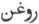

  
[Intangible Textual Heritage](../../index)  [Zoroastrianism](../index) 
[Index](index)  [Previous](sbe2326)  [Next](sbe2328) 

------------------------------------------------------------------------

[Buy this Book at
Amazon.com](https://www.amazon.com/exec/obidos/ASIN/1402185898/internetsacredte)

------------------------------------------------------------------------

*The Zend Avesta, Part II (SBE23)*, James Darmesteter, tr. \[1882\], at
Intangible Textual Heritage

------------------------------------------------------------------------

p. 314

### YA*S*T XXII.

This Ya*s*t is a description of the fate that attends the soul of the
righteous (§§ 1-18) and the soul of the wicked (§§ 19-37) after death.
They spend the first three nights (the sadis or sidôs; cf. Commentaire
du Vendîdâd, XIII, 55) amongst the highest enjoyments or pains; they are
then met by their own conscience in the shape of a beautiful heavenly
maiden (or a fiendish old woman [1](#fn_1330)), and are brought in four steps up to
heaven or down to hell, through the three paradises of Good-Thought,
Good-Word, and Good-Deed, or the three hells of Evil-Thought, Evil-Word,
and Evil-Deed: there they are praised and glorified by Ahura, or rebuked
and insulted by Angra Mainyu, and fed with ambrosia or poison.

Similar developments are to be found in Ya*s*t XXIV, 53-65; Ardâ Vîrâf
XVII; Minokhired II, 123-194.

\_\_\_\_\_\_\_\_\_\_\_\_\_\_\_\_\_\_\_\_\_\_\_\_\_\_\_\_\_

#### I.

1\. Zarathu*s*tra asked Ahura Mazda: 'O Ahura Mazda, most beneficent
Spirit, Maker of the material world, thou Holy One!

'When one of the faithful departs this life, where does his soul abide
on that night?'

Ahura Mazda answered:

2\. 'It takes its seat near the head, singing the U*s*tavaiti
Gâtha [2](#fn_1331) and proclaiming happiness:
"Happy is he, happy the man, whoever he be, to whom Ahura Mazda gives
the full accomplishment of his wishes!" On that night his soul
tastes [3](#fn_1332) as much of pleasure as
the whole of the living world can taste.'

p. 315

3\. —'On the second night where does his soul abide?

4\. Ahura Mazda answered: 'It takes its seat near the head, singing the
U*s*tavaiti Gâtha and proclaiming happiness: "Happy is he, happy the
man, whoever he be, to whom Ahura Mazda gives the full accomplishment of
his wishes!" On that night his soul tastes as much of pleasure as the
whole of the living world can taste.'

5\. —'On the third night where does his soul abide?

6\. Ahura Mazda answered: 'It takes its seat near the head, singing the
U*s*tavaiti Gâtha and proclaiming happiness: "Happy is he, happy the
man, whoever he be, to whom Ahura Mazda gives the full accomplishment of
his wishes!" On that night his soul tastes as much of pleasure as the
whole of the living world can taste.'

7\. At the end [1](#fn_1333) of the third
night, when the dawn appears, it seems to the soul of the faithful one
as if it were brought amidst plants and scents: it seems as if a wind
were blowing from the region of the south, from the regions of the
south, a sweet-scented wind, sweeter-scented than any other wind in the
world.

8\. And it seems to the soul of the faithful one as if he were inhaling
that wind with the nostrils, and he thinks: 'Whence does that wind blow,
the sweetest-scented wind I ever inhaled with my nostrils?

9\. And it seems to him as if his own conscience were advancing to him
in that wind, in the shape of a maiden fair, bright, white-armed,
strong, tall-formed,

p. 316

high-standing, thick-breasted, beautiful of body, noble, of a glorious
seed [1](#fn_1334), of the size of a maid in
her fifteenth year, as fair as the fairest things in the world.

10\. And the soul of the faithful one addressed her, asking: 'What maid
art thou, who art the fairest maid I have ever seen?'

11\. And she, being his own conscience, answers him: 'O thou youth of
good thoughts, good words, and good deeds, of good religion, I am thy
own conscience!

'Everybody did love thee for that greatness, goodness, fairness,
sweet-scentedness, victorious strength and freedom from sorrow, in which
thou dost appear to me;

12\. 'And so thou, O youth of good thoughts, good words, and good deeds,
of good religion! didst love me for that greatness, goodness, fairness,
sweet-scentedness, victorious strength, and freedom from sorrow, in
which I appear to thee.

13\. 'When thou wouldst see a man making derision [2](#fn_1335) and deeds of idolatry, or
rejecting [3](#fn_1336) (the poor) and
shutting his door [4](#fn_1337), then thou
wouldst sit singing the Gâthas and worshipping the good waters and Âtar,
the son of Ahura Mazda, and rejoicing [5](#fn_1338) the faithful that would come from near
or from afar.

p. 317

14\. 'I was lovely and thou madest me still lovelier; I was fair and
thou madest me still fairer; I was desirable and thou madest me still
more desirable; I was sitting in a forward place and thou madest me sit
in the foremost place, through this good thought, through this good
speech, through this good deed of thine; and so henceforth men worship
me for my having long sacrificed unto and conversed with Ahura Mazda.

15\. 'The first step that the soul of the faithful man made, placed him
in the Good-Thought [1](#fn_1339) Paradise;

'The second step that the soul of the faithful man made, placed him in
the Good-Word [2](#fn_1340) Paradise;

'The third step that the soul of the faithful man made, placed him in
the Good-Deed [3](#fn_1341) Paradise;

'The fourth step that the soul of the faithful man made, placed him in
the Endless Lights [4](#fn_1342).'

16\. Then one of the faithful, who had departed before him, asked him,
saying: 'How didst thou depart this life, thou holy man? How didst thou
come, thou holy man! from the abodes full of cattle and full of the
wishes and enjoyments of love? From the material world into the world of
the spirit? From the decaying world into the undecaying one? How long
did thy felicity last?'

17\. And Ahura Mazda answered: 'Ask him not what thou askest him, who
has just gone the dreary

p. 318

way, full of fear and distress, where the body and the soul part from
one another.

18\. '\[Let him eat\] of the food brought to him, of the oil of
Zaremaya [1](#fn_1343): this is the food for
the youth of good thoughts, of good words, of good deeds, of good
religion, after he has departed this life; this is the food for the holy
woman, rich in good thoughts, good words, and good deeds,
well-principled and obedient to her husband, after she has departed this
life.'

#### II.

19\. Zarathu*s*tra asked Ahura Mazda: 'O Ahura Mazda, most beneficent
Spirit, Maker of the material world, thou Holy One!

'When one of the wicked perishes, where does his soul abide on that
night?'

20\. Ahura Mazda answered: 'It rushes and sits near the skull, singing
the Kima [2](#fn_1344) Gâtha, O holy
Zarathu*s*tra!

' "To what land shall I turn, O Ahura Mazda? To whom shall I go with
praying?"

'On that night his soul tastes as much of suffering as the whole of the
living world can taste.'

21\. —'On the second night, where does his soul abide?'

22\. Ahura Mazda answered: 'It rushes and sits near the skull, singing
the Kima Gâtha, O holy

p. 319

\[paragraph continues\] Zarathu*s*tra! "To
what land shall I turn, O Ahura Mazda? To whom shall I go with praying?"

'On that night his soul tastes as much of suffering as the whole of the
living world can taste.'

23\. —'On the third night, where does his soul abide?'

24\. Ahura Mazda answered: 'It rushes and sits near the skull, singing
the Kima Gâtha, O holy Zarathu*s*tra! "To what land shall I turn, O
Ahura Mazda? To whom shall I go with praying?"

'On that night his soul tastes as much of suffering as the whole of the
living world can taste.'

25\. At the end of the third night, O holy Zarathu*s*tra! when the dawn
appears, it seems to the soul of the faithless one as if it were brought
amidst snow and stench, and as if a wind were blowing from the region of
the north, from the regions of the north, a foul-scented wind, the
foulest-scented of all the winds in the world.

26-32. And it seems to the soul of the wicked man as if he were inhaling
that wind with the nostrils, and he thinks: 'Whence does that wind blow,
the foulest-scented wind that I ever inhaled with my nostrils [1](#fn_1345)?'

p. 320

33\. The first step that the soul of the wicked man made laid him in the
Evil-Thought Hell;

The second step that the soul of the wicked man made laid him in the
Evil-Word Hell;

The third step that the soul of the wicked man made laid him in the
Evil-Deed Hell;

The fourth step that the soul of the wicked man made laid him in the
Endless Darkness.

34\. Then one of the wicked who departed before him addressed him,
saying: 'How didst thou perish, O wicked man? How didst thou come, O
fiend! from the abodes full of cattle and full of the wishes and
enjoyments of love? From the material world into the world of the
Spirit? From the decaying

p. 321

world into the undecaying one? How long did thy suffering last?'

35\. Angra Mainyu, the lying one, said: 'Ask him not what thou askest
him, who has just gone the dreary way, full of fear and distress, where
the body and the soul part from one another.

36\. 'Let him eat of the food brought unto him, of poison and poisonous
stench [1](#fn_1346): this is the food, after
he has perished, for the youth of evil thoughts, evil words, evil deeds,
evil religion after he has perished; this is the food for the fiendish
woman, rich in evil thoughts, evil words, and evil deeds, evil religion,
ill-principled, and disobedient to her husband.

 

37 [2](#fn_1347). 'We worship the Fravashi of
the holy man, whose name is Asmô-*hv*anva*nt* [3](#fn_1348); then I will worship the Fravashis of
the other holy Ones who were strong of faith [4](#fn_1349).

38 [2](#fn_1347). 'We worship the memory of
Ahura Mazda, to keep the Holy Word.

'We worship the understanding of Ahura Mazda, to study the Holy Word.

'We worship the tongue of Ahura Mazda, to speak forth the Holy Word.

'We worship the mountain that gives understanding, that preserves
understanding; \[we worship

p. 322

it\] by day and by night, with offerings of libations
well-accepted [1](#fn_1350).

39 [2](#fn_1351). 'O Maker! how do the souls
of the dead, the Fravashis of the holy Ones, manifest [3](#fn_1352) themselves [4](#fn_1353)?'

40\. Ahura Mazda answered: 'They manifest themselves from goodness of
spirit and excellence of mind [5](#fn_1354).'

\_\_\_\_\_\_\_\_\_\_\_\_\_\_\_\_\_\_\_\_\_\_

41 [6](#fn_1355). Then towards the dawning of
the dawn [7](#fn_1356), that bird
Parôdar*s* [8](#fn_1357), that bird
Karetô-dãsu [9](#fn_1358) hears the voice of
the Fire.

p. 323

42\. Here the fiendish Bûshyãsta, the long-handed, rushes from the
region of the north, from the regions of the north, speaking thus, lying
thus: 'Sleep on, O men! Sleep on, O sinners! Sleep on and live in sin.'

------------------------------------------------------------------------

### Footnotes

[314:1](sbe2327.htm#fr_1397) See [p.
319](#page_319), note [1](#fn_1345).

[314:2](sbe2327.htm#fr_1398) The name of the
second Gâtha, which begins with the word u*s*ta: the words in the text,
'Happy the man . . . .,' are its opening line (Ya*s*na XLII, 1).

[314:3](sbe2327.htm#fr_1399) Literally, sees,
perceives.

[315:1](sbe2327.htm#fr_1400) Thrao*s*ta: in
Pahlavi rôi*s*man.

[316:1](sbe2327.htm#fr_1401) 'That is to say,
from the gods' (Pahl. Comm.).

[316:2](sbe2327.htm#fr_1402) Of holy things.

[316:3](sbe2327.htm#fr_1403) Doubtful. The
Pahlavi commentary has the following gloss: 'He would not give his
friends what they begged for.'

[316:4](sbe2327.htm#fr_1404) To the
poor:—Urvarô-straya: urvar babâi*k* kart (Pahl. Comm.): âighshân babâ
barâ asrûnast (star, to tie, as in frastaretem baresma). Cf. Yt. XXIV,
37, 59.

[316:5](sbe2327.htm#fr_1405) With alms to the
poor Mazdayasnians (ashô-dâd).

[317:1](sbe2327.htm#fr_1406) The so-called
Hûmat Paradise (cf. Yt. III, 3).

[317:2](sbe2327.htm#fr_1407) The so-called
Hûkht Paradise.

[317:3](sbe2327.htm#fr_1408) The so-called
Hvarsht Paradise.

[317:4](sbe2327.htm#fr_1409) The seat of the
Garôthmân.

[318:1](sbe2327.htm#fr_1410) Zaremaya is the
spring: the word translated oil (raoghna, Persian  ) might perhaps be better
translated 'butter;' the milk made in the middle of spring was said to
be the best (Vispêrad I, 2; Pahl. Comm.; cf. Dâdistân XXXI, 14).

[318:2](sbe2327.htm#fr_1411) The Gâtha of
lamenting, beginning with the word Kãm (Kãm nemê zãm: 'To what land
shall I turn?'); Yasna XLVI (XLV).

[319:1](sbe2327.htm#fr_1412) A development
similar to that in §§ 9-14 is to be supplied here: in the Ardâ Vîrâf and
the Minokhired the soul of the wicked is met by a horrid old woman, who
is his own conscience: 'And in that wind he saw his own religion and
deeds, as a profligate woman, naked, decayed, gaping, bandy-legged,
lean-hipped, and unlimitedly spotted, so that spot was joined to spot,
like the most hideous noxious creatures (khrafstar), most filthy and
most stinking' (cf. § 9).

Then that wicked soul spoke thus: 'Who art thou? than whom I never saw
any one of the creatures of Aûharmazd and Akharman uglier, or filthier
or more stinking' (cf. § 10).

To him she spoke thus: 'I am thy bad actions, O youth of evil thoughts,
of evil words, of evil deeds, of evil religion! It p. 320 is on account of thy will and actions that I
am hideous and vile, iniquitous and diseased, rotten and foul-smelling,
unfortunate and distressed, as appears to thee (cf. §§ 11-12).

'When thou sawest any one who performed the Yazishn and Drôn ceremonies,
and praise and prayer and the service of God, and preserved and
protected water and fire, cattle and trees, and other good creations,
thou practisedst the will of Akharman and the demons, and improper
actions. And when thou sawest one who provided hospitable reception, and
gave something deservedly in gifts and charity, for the advantage of the
good and worthy who came from far, and who were from near, thou wast
avaricious, and shuttedst up thy door (cf. § 13).

'And though I have been unholy (that is, I have been considered bad), I
am made more unholy through thee; and though I have been frightful, I am
made more frightful through thee; though I have been tremulous, I am
made more tremulous through thee; though I am settled in the northern
region of the demons, I am settled further north through thee; through
these evil thoughts, through these evil words, and through these evil
deeds, which thou practisedst. They curse me, a long time, in the long
execration and evil communion of the Evil Spirit (cf. § 14).

'Afterwards that soul of the wicked advanced the first footstep on
Dûsh-hûmat (the place of evil thoughts), &c.' (The Book of Ardâ Vîrâf,
XVII, 12-27, as translated by Haug).

[321:1](sbe2327.htm#fr_1413) Cf. Yasna XXXI,
20: 'He who would deceive the holy One, to him afterwards (will be) a
long weeping in the dark place, bad food and words of insult. O wicked!
this is the place down which your own conscience will bring you through
your own deeds.'

[321:2](sbe2327.htm#fr_1417) §§
37-[38](errata.htm#4), 39-40, 41-42 are separate fragments.

[321:3](sbe2327.htm#fr_1415) One of the first
disciples of Zoroaster; cf. Yt. XIII, 96.

[321:4](sbe2327.htm#fr_1416) Cf. [p.
33](sbe2306.htm#page_33), note [2](sbe2306.htm#fn_173).

[322:1](sbe2327.htm#fr_1418) § 38 = Yt. I, 31.

[322:2](sbe2327.htm#fr_1419) A Pahlavi
translation of the following two fragments is found in MS. 33, Paris,
Supplément Persan (edited in Études Iraniennes, II).

[322:3](sbe2327.htm#fr_1420) *K*ithra (Paris
MS. p. 255).

[322:4](sbe2327.htm#fr_1421) 'How do they
manifest their assistance?' (Pahl. tr. ibid.); that is to say, when do
they assist their relations and countrymen? (see Yt. XIII, 49 seq.)

[322:5](sbe2327.htm#fr_1422) When men are
instinct with good spirit and good thought.

[322:6](sbe2327.htm#fr_1423) The Pahlavi
translation of this fragment has here §§ 14-16 of the Âtash Nyâyi*s*,
then §§ 18-19 of Vendîdâd XVIII. Therefore the whole passage is to be
restored as follows:

Âtar looks at the hands of all those who pass by: 'What does the friend
bring to his friend . . . .?' (Âtash N. 14.)

And if that passer-by brings him wood holily brought, or bundles of
baresma holily tied up . . . ., then Âtar . . . . will bless him thus:

May herds of oxen grow for thee . . . . (Âtash N. 15-16).

In the first part of the night, Fire, the son of Ahura Mazda, calls the
master of the house for help, saying:

'Up! arise, thou master of the house . . . .' (Vend. XVIII, 18-19).

'Then towards the dawning of the dawn . . . .' (see the text).

[322:7](sbe2327.htm#fr_1424) Cf. Vend. XVIII,
23.

[322:8](sbe2327.htm#fr_1425) 'He who has
knowledge made,' or 'He who has the knowledge of what is made' (kartak
dânishn); his other name Parôdar*s* is 'He who foresees.'

[322:9](sbe2327.htm#fr_1426) Here again a
large passage is omitted: it can only partly be p.
323 supplied from the Pahlavi translation; the words in brackets
refer to Zend texts lost to us:

'Then he flaps his wings and lifts up his voice, saying: "Arise, O men!
\[and also women, grown-up people, and children, &c . . . . Put on well
your girdle and shirt, wash your hands, put your girdle around your
body, go and give food to the cattle and recite aloud the five holy
Gâthas of Spitama Zarathu*s*tra."\]

'Here the fiendish Bûshyãsta . . . .' (see the text). Then the Pahlavi
translation has: 'Never care for the three excellent things, good
thoughts, good words, good deeds' (cf. Vend. XVIII, 25).

------------------------------------------------------------------------

[Next: XXIII. Âfrîn Paighambar Zartû*s*t](sbe2328)
