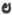
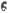

  
[Intangible Textual Heritage](../../index)  [Zoroastrianism](../index) 
[Index](index)  [Previous](sbe31032)  [Next](sbe31034) 

------------------------------------------------------------------------

[Buy this Book at
Amazon.com](https://www.amazon.com/exec/obidos/ASIN/1402185731/internetsacredte)

------------------------------------------------------------------------

*The Zend Avesta, Part III (SBE31)*, L.H. Mills, tr. \[1886\], at
Intangible Textual Heritage

------------------------------------------------------------------------

### YASNA XI.

#### PRELUDE TO THE H(A)OMA-OFFERING [5](#fn_1014).

1\. Three clean creatures (full of blessings) curse betimes while yet
invoking, the cow, the horse, and then H(a)oma. The cow cries to her
driver [6](#fn_1015) thus:

p. 245

\[paragraph continues\] Childless be thou,
shorn of offspring, evil-famed, and slander-followed, who foddered [1](#fn_1016) fairly dost not use me, but fattenest
me for wife or children, and for thy niggard selfish meal.

2\. The horse cries to his rider thus: Be not spanner [2](#fn_1017) of the racers; stretch no coursers to
full-speed; do not stride across the fleetest, thou, who dost not pray
me swiftness in the meeting thick with numbers, in the circuit thronged
with men.

3\. H(a)oma speaks his drinker thus: Childless be thou, shorn of
offspring, evil-famed, and slander-followed, who holdest me from full
outpouring, as a robber, skulls in-crushing. No head-smiter [3](#fn_1018) am I ever, holy H(a)oma, far from
death [4](#fn_1019).

4\. Forth my father gave an offering, tongue and left eye chose Ahura,
set apart for H(a)oma's meal.

5\. Who this offering would deny me, eats himself, or prays it from me,
this which Mazda gave to bless me, tongue with left eye (as my portion).

6\. In his house is born no fire-priest, warrior ne’er in chariot
standing, never more the thrifty tiller. In his home be born Dahâkas,
Mûrakas of evil practice, doing deeds of double nature.

7\. Quick, cut off then H(a)oma's portion, gift of flesh for doughty
H(a)oma! Heed lest H(a)oma

p. 246

bind thee fettered, as he bound the fell Turanian Frangrasyan [1](#fn_1020) (the murderous robber) fast in iron
close-surrounded in the mid-third [2](#fn_1021) of this earth! 8. Thereupon spake
Zarathu*s*tra [3](#fn_1022); Praise to H(a)oma
made by Mazda, good is H(a)oma Mazda-made.

\_\_\_\_\_\_\_\_\_\_\_\_\_\_\_\_\_\_\_\_\_\_\_\_\_

9\.  [4](#fn_1023)Who to us is one hereupon to
thee (becomes) two, to be made to three, for the five [5](#fn_1024)-making of the four, for the
seven-making of the sixth, who are your nine in the decade (?), who
serve you and with zeal [6](#fn_1025).

\_\_\_\_\_\_\_\_\_\_\_\_\_\_\_\_\_\_\_\_\_\_\_\_\_

10\.  [7](#fn_1026)To thee, O holy H(a)oma!
bearer of the ritual sanctity, I offer this my person which is seen (by
all to be) mature, (and fit for gift); to H(a)oma the effective do I
offer it, and to the sacred exhilaration which he bestows; and do thou
grant to me (for this), O holy H(a)oma! thou that drivest death afar,
(Heaven) the best world of the saints, shining, all brilliant.

p. 247

11\. (The Ashem Vohû, &c.)

12-15. May’st Thou rule at Thy will, O Lord [1](#fn_1027)!

16\. I confess myself a Mazdayasnian of Zarathu*s*tra's order [2](#fn_1028).

17\.  [3](#fn_1029)I celebrate my praises for
good thoughts, good words, and good deeds for my thoughts, my speeches,
and (my) actions. With chanting praises I present all good thoughts,
good words, and good deeds, and with rejection I repudiate all evil
thoughts, and words, and deeds. 18. Here I give to you, O ye Bountiful
Immortals! sacrifice and homage with the mind, with words, deeds, and my
entire person; yea, (I offer) to you the flesh of my very body (as your
own). And I praise Righteousness. A blessing is Righteousness (called)
the Best, &c.

------------------------------------------------------------------------

### Footnotes

[244:5](sbe31033.htm#fr_1020) This
characteristic fragment is repeated and extended in the later literature
of the Parsis. The curse of the cow, horse, and of Haoma (scilicet the
priest) when they are stinted, was extended to all domestic animals. It
has been difficult to avoid the full metrical rhythm of the original
with its jingling cadence. A full freedom is also not avoided.

[244:6](sbe31033.htm#fr_1021) Not 'to the
priest;' Ner. g*ri*hîtâram.

[245:1](sbe31033.htm#fr_1022) 'Who dost not
give me cooked (food)' seems improbable. If *hv*âstãm means fodder, why
is it fem., especially here with a feminine correlative? I think that
'having good food' is the meaning of the word, as an adjective, and
agreeing with gãm understood. Possibly, 'who dost not bestow upon me as
the one well-foddered.'

[245:2](sbe31033.htm#fr_1023) Dialectically
used.

[245:3](sbe31033.htm#fr_1024) 'Light is the
intoxication of Haoma;' (other toxicants smite the head).

[245:4](sbe31033.htm#fr_1025) 'Having death
afar.'

[246:1](sbe31033.htm#fr_1026) A Turanian king.

[246:2](sbe31033.htm#fr_1027) Observe the
threefold division of the earth; see it also in Vend. II.

[246:3](sbe31033.htm#fr_1028) A poetical
reproduction. Z. had been long among the ancient dead.

[246:4](sbe31033.htm#fr_1029) The Raspi at
present hands the Haoma-cup to the priest at this point; the efficacy of
the liquor is supposed to be multiplied.

[246:5](sbe31033.htm#fr_1030) Pe*n*daidyâi is
to be read as of course; the letter 
, not unlike 
 in a MS. when turned, was probably half inverted.

[246:6](sbe31033.htm#fr_1031) This seems
rendered by the Pahlavi as an interlude between the Ratu and the Zaotar;
comp. Y. XXVIII, 11. Several broken sentences from other parts of the
Avesta are here doubtfully recalled, perhaps as having especial
sanctity.

[246:7](sbe31033.htm#fr_1032) The Raspi brings
the Haoma-vessel to the Baresman at this point; and touching its stand,
the Mâh-rû, lays a cloth on the right hand of the Zaotar, who, looking
at the vessel, proceeds to recite as follows in verse 10.

[247:1](sbe31033.htm#fr_1033) See Y. VIII,
5-8.

[247:2](sbe31033.htm#fr_1034) See Y. III, 24,
25.

[247:3](sbe31033.htm#fr_1035) This piece is in
the Gâthic dialect, and therefore an especially fitting prelude to the
Confession of faith in Y. XII.

------------------------------------------------------------------------

[Next: Yasna XII. The Mazdayasnian Confession](sbe31034)
