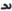

  
[Intangible Textual Heritage](../../index)  [Zoroastrianism](../index) 
[Index](index)  [Previous](sbe37043)  [Next](sbe37045) 

------------------------------------------------------------------------

[Buy this Book at
Amazon.com](https://www.amazon.com/exec/obidos/ASIN/1402156081/internetsacredte)

------------------------------------------------------------------------

*Pahlavi Texts, Part IV (SBE37)*, E.W. West, tr. \[1892\], at Intangible
Textual Heritage

------------------------------------------------------------------------

p. 138

### CHAPTER XLI.

*Sakâ*d*ûm Nask*.

1\. One section of the last twenty-two is the Vakhshistân ('*increase
code*'), particulars about the progress of increase. 2. About atonement,
surrender, and compensation *for* anything, through dispelling *it* by
compensating, atoning, *and* surrendering to *him* whose own *it is;*
the period thereof not *being* appointed. 3. When he, whose origination
of compensation, atonement, *and* surrender is his own, has appointed
the period thereof, the growing of the sin actively, after the appointed
time, is increase.

4\. About increase [1](#fn_334) which is active
(ka*rd*akŏ), and that which is existent (zîstakŏ); how it is when the
existent becomes quite active, and how it is when both are suppressed
(armê*s*tî-aît). 5. About the extraction of increase upon increases
which they may occasion *up* to an equality; where *and* which *it is*.
6. About a righteous gift; that is, how it is when overwhelmed by
impoverishment, *and* how it is when its increase still proceeds.

7\. About the progress of interest (vakhsh) upon effective wealth, when
there is interest for it, and the interest thereon accumulates; also
that which does not progress; how it is when the debtor (*âv*âm-hômônd),
even on bringing back the wealth, is opulent, *and* the lender (*âv*âm
naf*s*man) is opulent on asking for *it*; how it is when each is not
opulent, *and* the debtor *was* not opulent on asking for *it; and* how
it is when the lender (*âv*âm khvê*s*)

p. 139

is opulent on asking for *it, and* the debtor is not opulent through the
wealth.

8\. About where *and* when the life (zîstanŏ) of the lender has once
passed *away*, how *it is* when *the loan* is to be issued anew at the
end of the issue (zihî*s*nŏ), and how it is when *it has* existed in
force, through the one issue *by* the deceased, *and* the interest
accrues. 9. When the debtor passes away, how it is when he puts the
interest into the property of any one through adoption, *and* how *it
is* when it is the interest of the possessor of the wealth in both
worlds.

10\. About the peculiarity *of* retribution, the self-retribution of
*one* liable to retribution for others, *and* the limit of one's own
retribution. 11. About the penalty (tâvân) of him who, purchasing
*animals* for impregnation, gives each a bad male; when *they are* not
pregnant, *and* when they may produce; and whatever is on the same
subject. 12. About the time of allowing the admission of the male *to*
the beast *of* burden, sheep, and camel, and the time of consignment
*to* each separate male for whom reception remains; the *case* when *it
is* the time for admission of the male (gû*s*n-hilîh), *and* the *case*
when *it is* such a consignment as when the period, which is really
originating with the admission of the male, has continued. 13. When, on
account of no consignment *to* the male at the *proper* time, the female
goes on unimpregnated, *and there* is no pregnancy of the cow, mare,
camel, sheep, goat, *or* pig, each separately, how much the penalty is;
*also* the sin they commit.

14\. About the camel, mare, cow, *or* sheep, unto whom *there* is
damaged milk, void of butter (akarag), owing to the appointed time *one*
postpones; also the

p. 140

average *and* least milk of the mare, cow, goat, and sheep, that is, the
measure of their one milking, each separately. 15. About the camel, that
is, how much is its production of hair in a year, *and* the extent that
the camel is surpassing therein among cattle; of them is also the ass
that they allow to be seized upon for as much value as that *of* the
oxen, and the mode of beating them up. 16. Where *and* how it is when
the females of the camel and horse are a multiplying (*a*fzûnŏ)
*tending* to dissatisfaction; the increase even of increases of the ox,
sheep, and goat progresses, *and* of them how much less is the
multiplying of the female—which is an increase of increases *tending* to
dissatisfaction, where *it is* extending over them—to be produced than
that of the male.

17\. The camel which is injured *on* the road, beyond the end of the
appointed time, when they keep it *at* work unlawfully and the road is
bad, when *at* work unlawfully *and* the road is good, *and* when
comfortable at pasture, where seizing upon it becomes *tending* to
dissatisfaction in several *ways*, and they are severally buying *it*
when really invigorated [1](#fn_335), or *at* a
price.

18\. For how much increase of increases he stands up who is buying also
an invigorated dog, *or* pig, at a price; and when *it is that* the
increase and increase of increases remain undeveloped in them, as it
*does* whenever property, *on* which the interest of the residue and
income accumulates, is still for the children *of* the well-destined.

p. 141

19\. About *him* whose supplies some one is silently (agôpŏ) buying up,
and the seller and important holder is quite bereaved, so that the
bereaver *has* plenty for *one* deprived of food *on* a summer's day,
and plenty for him who is *so* also *on* a winter's *day* (dim-i*k*îk);
*also* the supplying of mankind and fire lawfully, in the beginning, for
a summer's day and night, *and* that for a winter's one [1](#fn_336). 20. About clothing when *it* is *that*
which *one* strips off for donation. 21. About the penalty for a first
deprival of food, *and* the sin of it; *also* the penalty of the second
and third, up to the tenth.

22\. About a plaint and defence as regards a debt and its interest, and
the decision thereon; also how *it is* when, for keeping up the
repayment, debts upon debts are cancelled so far as the continuance of
interest; *and* whatever is on the same subject. 23. About the
uselessness of supplies which are not authorised *by* the religion. 24.
About buying a slaughtered [2](#fn_337) sheep
when the seller is bereaved by the delivery; *also* to how many sheep,
in the two previous years, the increase and increase of increases
thereof *had* specially to attain. 25. About where *and* what is that
which would not conduce to increase, *and* what is that which *would*.
26. About the special sin and offence, the use of the milk, heart [3](#fn_338), and wool, the spreading about *which
tends* to dissatisfaction, the increase of increases, and the good

p. 142

figure of any one sheep, and the regulation of every one.

27\. About how the debtor *has* to announce the nature of the loan,
*which* the lender, through irritation, does not approve; and, when the
debtor has provided for a triple issue, when for a double issue, *and*
even when he has for a single issue, the first year is *free* from
begging his own time. 28. About the debtor *and* what [1](#fn_339) he repays, when each year is announced
*and* he does not assent; *and* how it happens, as regards the debtor,
through many repayments, and all the postponements of the lender [2](#fn_340).

29\. About causing the confiscation (pâ*d*îrângarîh) of a human being
(gerpîh) [3](#fn_341), and *its*
cessation [4](#fn_342) owing to worldly work,
where *it is* for one month, *or*, thence onwards, for a second, a
third, a sixth, a ninth, *or* a year at worldly work, *and* where *it
is* regarding several human beings; the production of gain which accrues
upon that single human being; *and* whatever is on the same subject. 30.
About the confiscation of a cloak (gudâd) in the winter, *and of* a
skin-bag for holding water (ma*s*kŏ-î *âv*dânŏ) in the summer; about
whom *they are* appertaining to, on the passing by of the first ten
nights, where *it is* after the bringing out of the cloak at the
beginning of winter, *and of* the water-skin at the beginning of summer;
*or* prior to the length of a month previous,

p. 143

severally, *to* the end of the winter *as regards* the cloak, *and to*
the end of the summer *as regards* the water-skin; that is, *for* how
much gain upon that one cloak, *or* water-skin, is the retribution of
the confiscator to whom *it is* appertaining [1](#fn_343); *and* whatever is on the same subject.

31\. About the increase of grains, *and* that of sheep *with* the
progeny, milk, and wool that they may severally produce. 32. About the
confiscation of clothes and implements by delivering *them* back to
*him* who specially reckons many *as* his own [2](#fn_344); that is, how the produce (vakhsh)
increases when he orders *their* use imperfectly, how it *does* when *he
does so* not imperfectly, *and* how it *does* when he keeps *them* in
inactivity. 33. About the produce of land on which grain is cast, and
*of* that on which *it is* not cast (va-zak-î an-madam ramîtuntô) [3](#fn_345), when by delivery thereof *it* is
self-exhausted. 34. And so also the produce *of* ornaments of gold and
silver, and of red-coloured things, with many regulations on the same
subject *and* what is connected therewith.

------------------------------------------------------------------------

### Footnotes

[138:1](sbe37044.htm#fr_336) As this word is
written vakhs (= nâs) it is doubtful whether vakhsh, 'increase,' or
vinâs, 'sin,' is intended; and the context is insufficient to solve the
doubt.

[140:1](sbe37044.htm#fr_337) Pâz. aôsanghen,
both here and in § 18, no doubt for Av. aoganghem, as in Chap. XX, 58,
the Av.   g and   s being much alike.

[141:1](sbe37044.htm#fr_338) See Farh. Oîm, p.
38, ll. 4-8, and compare Chap. XXXVIII, 13.

[141:2](sbe37044.htm#fr_339) Reading
ba*r*â-zegtalûntakŏ, which word has been corrupted by the repairer of
the MS.

[141:3](sbe37044.htm#fr_340) Reading dîl, but
the word can also be read sar, 'head.'

[142:1](sbe37044.htm#fr_341) Supposing that
madam stands for maman; the two words being sometimes confounded.

[142:2](sbe37044.htm#fr_342) Who allows the
debtor a longer time for repayment.

[142:3](sbe37044.htm#fr_343) Literally 'bodily
form.' The seizure of a slave of the debtor to work off the amount of
the debt is evidently meant.

[142:4](sbe37044.htm#fr_344) Reading
va-s*ak*i*s*nŏ instead of the very similarly-written nik*êz*i*s*nŏ,
'explanation,' of the MS.

[143:1](sbe37044.htm#fr_345) This seems the
more probable meaning if we are to understand that the confiscation has
been actually carried out at an improper season; but, if we suppose that
it is avoided on account of the season, it would be better to translate
as follows:—'*For* how much gain upon that one cloak, *or* water-skin,
is the confiscator, to whom *it is* appertaining, to be compensated.'

[143:2](sbe37044.htm#fr_346) Possibly referring
to the seizure of articles sold by a dealer, but not paid for.

[143:3](sbe37044.htm#fr_347) The form an of the
negative prefix is here used because the Zvâri*s* an-madam is replaced
by the Pâz. an-*av*ar in pronunciation.

------------------------------------------------------------------------

[Next: Chapter XLII](sbe37045)
