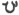

  
[Intangible Textual Heritage](../../index)  [Zoroastrianism](../index) 
[Index](index)  [Previous](sbe37071)  [Next](sbe37073) 

------------------------------------------------------------------------

[Buy this Book at
Amazon.com](https://www.amazon.com/exec/obidos/ASIN/1402156081/internetsacredte)

------------------------------------------------------------------------

*Pahlavi Texts, Part IV (SBE37)*, E.W. West, tr. \[1892\], at Intangible
Textual Heritage

------------------------------------------------------------------------

### CHAPTER XXIII.

*Sû*d*kar Nask*.

1\. The twenty-second fargar*d*, Airyaman [5](#fn_722), is about the meeting of
Kaî-Khûsrôî [6](#fn_723) and Vâê, the
long-continuing lord [7](#fn_724) next to the
renovation *of the*

p. 224

*universe; and* Kaî-Khûsrôî's asking Vâê, the long-continuing lord,
about his smiting so many of the ancients who have been the highest of
mankind in splendour and glory. 2. The reply of Vâê, the long-continuing
lord, about his smiting them; and, upon that answer, Kaî-Khûsrôî's
taking Vâê, the long-continuing lord, and transforming *him* into the
shape of a camel, mounting *him, and* going, with the Irânian levies
(han*g*amanôîkân), to the place where the immortal Haoi*s*t, *son* of
Geurva [1](#fn_725), lies in strength [2](#fn_726), and his letting him lie; also *his*
going beyond (kâdmon) him to the place where Tûs [3](#fn_727), the banisher of strife, lay in
strength, and his letting him also lie; and his going beyond him to the
place where Kaî-*A*pîvêh [4](#fn_728) lies, and
his letting him also lie.

p. 225

3\. His proceeding beyond them, and meeting on the road with that
beneficial victor Sôshâns [1](#fn_729), and
*being* asked by that beneficial victor thus: 'What man art thou who
sittest aloft on Vâê, the long-continuing lord, so that thou makest Vâê
fly, the long-continuing lord transformed into the shape of a camel?' 4.
The speaking of Kai-Khûsrôî, in reply to Sôshâns, thus: 'I am
Kai-Khûsrôî.' 5. The extolling of Kai-Khûsrôî, by Sôshâns, as regards
his *having* extirpated the idol-temples on the shore of Lake
*K*ê*k*ast [2](#fn_730), and his smiting the
wizard Frâsîy*âv* [3](#fn_731).

6\. The glorifying of the Ma*zd*a-worshipping religion *by* Kai-Khûsrôî;
the coming of the powerful being Keresâsp [4](#fn_732), club in hand, advancing towards them at
the dwelling of that wizard Ges [5](#fn_733);
the standing up of Tûs, the banisher of strife, and his calling to
Keresâsp for reliance upon the Gâtha lore and *for* union with them; and
the praising of righteousness [6](#fn_734) *by*
Keresâsp, and his throwing *away* the arm-breaker.

7\. As to these, too, it says that so those men come together *for*
producing the renovation *of the universe who* are mentioned in this
fargar*d*, and also in other places, *and* are all experienced *and*
eminent

p. 226

doers, and all powerful *and* brave; and they shall produce the
renovation through a desire for an existence undecaying, immortal,
hungerless, and thirstless for ever *and* everlasting.

8\. It is perfect excellence *that is* righteousness.

------------------------------------------------------------------------

### Footnotes

[223:5](sbe37072.htm#fr_727) The appellation of
Yas. LIV which begins with the words â airy*e*mâ i*sh*yô; it is here
written aîrêmanŏ (B) and aîremanŏ (K) in Pahlavi.

[223:6](sbe37072.htm#fr_728) See Bk. VIII,
Chap. XIII, 14.

[223:7](sbe37072.htm#fr_729) Pahl. vâê-î
dêrang-khû*d*âî = Av. vaya dareghô*hv*adhâta who is mentioned as a good
spirit in Ny. I, 1. There are, however, p.
224 two Vâês (see Dd. XXX, 4; Mkh. II, 115), the good Vâê who
assists the departed soul, and the bad Vâê who opposes it; the former is
closely connected with the angel Râm in Yt. XV, 0, 58, and the latter
with Astô-vîdhôtu, the demon of death, in Vend. V, 8, 9; Bd. XXVIII, 35.
They appear to be personifications of the upper and lower air,
respectively; the former being considered pure through its connection
with the sacred beings, and the latter impure through contamination by
the demons. Possibly the legend about Vâê in our text may have been
suggested by the words vayû-beredubyô and vayôi in Yas. LIII, 6, 7; in
which case, this fargar*d* must be considered, to some extent, as a
continuation of the preceding one. According to Dd. XXXVI, 3 Kaî-Khûsrôî
was made to pass away by Vâê.

[224:1](sbe37072.htm#fr_730) Compare Av.
Yû*s*ta Gâurvayana of Yt. XIII, 118. But Yôi*s*ta Fryâna, of Yt. XIII,
120, is one of the immortals mentioned in Byt. II, 1; Dd. XC, 3.

[224:2](sbe37072.htm#fr_731) Reading hang,
which can also mean 'a cave;' but we can likewise read hûg, 'spiritual
life.'

[224:3](sbe37072.htm#fr_732) Av. Tusa of Yt. V,
53, 58; he is one of the immortals mentioned in Bd. XXIX, 6; Dd. XXXVI,
3.

[224:4](sbe37072.htm#fr_733) Av. Kavi
Aipivanghu of Yt. XIII, 132, XIX, 71. He was son of Kaî-Kavâ*d*, brother
of Kâî-Ûs, and great-grandfather of Vi*s*tâsp's grandfather (see Bd.
XXXI, 25, 28, 31, 34).

[225:1](sbe37072.htm#fr_734) See Bk. VIII,
Chap. XIV, 14.

[225:2](sbe37072.htm#fr_735) Apparently the
present Lake Urumiyah (see Bd. XVII, 7, XXII, 2; Mkh. II, 95).

[225:3](sbe37072.htm#fr_736) See Bk. VIII,
Chap. XIII, 11.

[225:4](sbe37072.htm#fr_737) See Chap. XV.

[225:5](sbe37072.htm#fr_738) Written  , but the reading is uncertain;
possibly the name may be connected with 'the Ve*s*kŏ progeny' in Chap.
XV, 2.

[225:6](sbe37072.htm#fr_739) Reciting the
Ashem-vohû formula, as a token of adhesion to the religion.

------------------------------------------------------------------------

[Next: Chapter XXIV](sbe37073)
