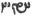

  
[Intangible Textual Heritage](../../index)  [Zoroastrianism](../index) 
[Index](index)  [Previous](sbe37105)  [Next](sbe37107) 

------------------------------------------------------------------------

[Buy this Book at
Amazon.com](https://www.amazon.com/exec/obidos/ASIN/1402156081/internetsacredte)

------------------------------------------------------------------------

*Pahlavi Texts, Part IV (SBE37)*, E.W. West, tr. \[1892\], at Intangible
Textual Heritage

------------------------------------------------------------------------

p. 348

### CHAPTER LVII.

*Bakŏ Nask*.

1\. The eleventh fargar*d*, the Yasna [1](#fn_1325), is *that* the whole of the good works
*which are* to accomplish, *and* those, too, which are
accomplished [2](#fn_1326), are appropriated
*by* the righteous *man* who teaches virtue [3](#fn_1327) to the righteous; even for this
reason, of the good works which *one* accomplishes, *and* those, too,
which are accomplished, *there* is all one store (anbâr), from the work
(var’*z*ŏ) of the original good creation even to the renovation *of the
universe, and* ever afresh the teaching of virtue *by those* who are
righteous comes to the accumulation of the righteous and the
accomplishment of that store, *and* they, too, are in possession of that
store, *in* partnership with the other righteous. 2. This, too, that *it
is* because he would do the best for his own [4](#fn_1328), whose meditation of the liturgy is
for those who are archangels, and who also maintains, for the assistance
of the good, the strength which is his for the existences. 3. And this
statement indicates the great participation of any one in that store,
because when that store is really an accumulation of work on the way,
for the partners in that store who *have done* more, and also *those*
who *have* accomplished less, *and* remains, moreover, in the possession
of them all, then, *as to* those accomplishing more of it, through the
original possession of most of that work, and also through that which
*occurs* when the accomplishers have attained to that plenty more
particularly owing to their more labour, and likewise through the
property, liberally,

p. 349

largely, and lordlily, of those accomplishing more, and the indigence,
unafflictedly [1](#fn_1329), scantily, and
subordinately, of those accomplishing less, *it is* reasonable to speak
of that store as in their possession, and *of their* superiority *as*
greatly over those accomplishing less. 4. This, too, that his work is
good work whose liberality is for the archangels; even for this reason,
because through a little labour *for* the sacred beings, which is itself
that liberality, he contributes duty and good works.

5\. This, too, that it becomes best for him, in both existences [2](#fn_1330), who teaches a wishing for living in
diligence to mankind; even for this reason, because he is a preserver of
them through the wishing for living, and *his* soul, through the
diligence owing to him, attains perfection, here from mankind *and in*
yonder *world* from the sacred beings. 6. This, too, that the ceremonial
and obeisance of Aûha*r*ma*zd* [3](#fn_1331)
are performed by him who is in the way of like thinking and like
praising of the law of Aûha*r*ma*zd* with all the worshippers of
Aûha*r*ma*zd*. 7. This, too, that he is in the leadership of his
religion [4](#fn_1332) who makes the knowledge
of religion ever afresh; even for this reason, because every item of
knowledge which he provides increases some greatness of it. 8. This,
too, that he is in the service of his religion [4](#fn_1332) who demands the knowledge of religion
ever afresh; even for this reason, because so long as he demands more,
he becomes nearer to a knowledge of religion.

p. 350

9\. This, too, that mankind's wishing for life is authorised
(dastovarînî*d*ŏ) by him who authorises the production of anything for
mankind; even for this reason, because authority (dastôbarîh) over the
production of anything is conjoined with that which is for the wishing
for life; so that whosever production of anything is authorisedly, their
life is *free* from any discomfort; and whosever wishing for life is
authorisedly, his production of anything is also authorisedly. 10. This,
too, that acceptance, hints, and words are given [1](#fn_1333) to Aûha*r*ma*zd* by him who asks
again, that which he does not understand of the religion, from him who
does understand; even for this reason, because knowledge is completed
through these three *things:* obtainment, hints, and speaking, and all
three are asked again by him who does not understand. 11. This, too,
that the words of Aûha*r*ma*zd* [2](#fn_1334)
are taught by him who teaches the acceptance, remembrance, and speaking
*of* the religion; even for this reason, because this is the recital of
that compendium (hanger*d*îkîh).

12\. This, too, that the care [3](#fn_1335)
*and* reverence of fire are provided by him who is liberal to a fire as
regards anything he supplies *for* the care *and* reverence which
*others* shall provide *for* the fire, and he becomes equally rewarded
for it. 13. This, too, that by him who teaches the religion of
Aûha*r*ma*zd* with joyfulness [4](#fn_1336),
the care *and* reverence of fire are

p. 351

provided as declared by the religion; even for this reason, because even
that *which is* taught by him combines with the action due to that
teaching. 14. This, too, that the obeisance [1](#fn_1337) *to* those requiring obeisance is
arranged *by him* who loves Vohûman. 15. This, too, that fire is
strengthened—for that work, achieved in the future existence, which is
the greatest [2](#fn_1338) that exists—by him
who invokes fire with the title of fire; even for this reason, because
the title is put by him upon a nature that is laudable, and when invoked
by him with that title the praised *one* is then strengthened by him.

16\. This, too, that he becomes informed as to the religion of
Aûha*r*ma*zd* [3](#fn_1339), who teaches the
religion of Aûha*r*ma*zd* with pleasure; even for this reason, because
every knowledge is exercised *and* increased by teaching. 17. This, too,
that Aûha*r*ma*zd* is propitiated by the excellent sagacity of him who
teaches virtuous words and actions [4](#fn_1340); even for this reason, because
sagacity *has* two parts, the speakable and the workable. 18. This, too,
that the bodily form (kerpŏ) of Aûha*r*ma*zd* is praised as perfection
(nêvakŏtûmîh) [5](#fn_1341) by him who
elevates (bâlistînê*d*ŏ) his own soul [6](#fn_1342) to the station of the sun [7](#fn_1343); even for this reason, because that
bodily form of Aûha*r*ma*zd* exists, and becomes the loftiest *and* most
perfect in the station of the sun.

19\. This, too, that all excellence is purely produced for Aûha*r*ma*zd*
by him who has root in the

p. 352

possession *of* Aûha*r*ma*zd*; even for this reason, because, when a
root is given to him, fruit is also produced by him, and all excellence
is *both* root and fruit [1](#fn_1344). 20.
This, too, that Aûha*r*ma*zd* is invoked with the title 'lord [2](#fn_1345)' by him whom Aûha*r*ma*zd* calls; even
for this reason, because the interpretation of 'Aûha*r*ma*zd*' is really
with *the words* 'greatly wise lord' (mas dânâk khû*d*âî). 21. This,
too, that the names of the sacred beings *which are* invoked [3](#fn_1346) are the praise glorified by *any* one,
and by him who glorifies them they are named; even for this reason,
because the names of the sacred beings are the glorification due to
their names of praise. 22. This, too, that among those of the same class
(ham-gôharân), when he shall do *it* for one race [4](#fn_1347), benefit is produced by him for other
races within that class; among those of the same races
(ham-tôkhmakânân), when he shall produce benefit for one species, *it is
done* by him also for other species within that race; and among the same
species (ham sarâ*d*akŏ), when  he shall produce benefit for one
individual (kerpŏ), *it is done* by him for other individuals within
that species.

23\. This, too, that his personality (khû*d*îh) is the sacred beings’
own [5](#fn_1348), who maintains the
rites [6](#fn_1349) with the assistance of the
righteous. 24. This, too, that his own is in the guardianship [7](#fn_1350) of the sacred beings, whose vehemence
is through Good Thought;

p. 353

even for this reason, because his bravery is for the law. 25. This, too,
that life is given to mankind by him who shall do that which is able to
remain good for them. 26. This, too, that the friendship of
Aûha*r*ma*zd* is appropriated by him who has Aûha*r*ma*zd* as a
guardian, and perpetual guardianship is appropriated by him who teaches
to mankind that thing which becomes their perpetual guardianship *in*
yonder *world*.

27\. This, too, that he causes righteousness [1](#fn_1351) who thinks of anything which is
virtuous. 28. This, too, that he has caused the good commands and
propitiousness [2](#fn_1352) of Aûha*r*ma*zd*,
who gives *his* body and life [3](#fn_1353) to
the sacred beings; and body *and* life are given to the sacred beings by
him who affords friendship to the religion of Zaratû*s*t. 29. And this,
too, that to him who affords friendship to Aûha*r*ma*zd* it occurs owing
to the guardianship of Aûha*r*ma*zd*; and that guardianship is
perpetually [4](#fn_1354) connected with him
who teaches to others that thing which always constitutes their
companionship with the sacred beings.

30\. Excellence *that* is perfect *is* righteousness.

------------------------------------------------------------------------

### Footnotes

[348:1](sbe37106.htm#fr_1354) See Chap. XII, 1
n; it is here written yastô in Pahlavi.

[348:2](sbe37106.htm#fr_1355) See Pahl. Yas.
XXXV, 5.

[348:3](sbe37106.htm#fr_1356) Ibid. 4.

[348:4](sbe37106.htm#fr_1357) Ibid. 6.

[349:1](sbe37106.htm#fr_1358) Pahl. abêshîhâ,
but it should perhaps be avê*s*îhâ, 'unabundantly.'

[349:2](sbe37106.htm#fr_1359) See Pahl. Yas.
XXXV, 9.

[349:3](sbe37106.htm#fr_1360) Ibid. 19.

[349:4](sbe37106.htm#fr_1362) Ibid. 22.

[350:1](sbe37106.htm#fr_1363) See Pahl. Yas.
XXXV, 25.

[350:2](sbe37106.htm#fr_1364) Ibid. 27.

[350:3](sbe37106.htm#fr_1365) See Pahl. Yas.
XXXVI, 1. This section implies that the attendant who feeds a fire with
fuel supplied by others, obtains an equal share of merit with them.

[350:4](sbe37106.htm#fr_1366) Ibid. 4, 5.

[351:1](sbe37106.htm#fr_1367) See Pahl. Yas.
XXXVI, 5.

[351:2](sbe37106.htm#fr_1368) Ibid. 6.

[351:3](sbe37106.htm#fr_1369) Ibid. 7.

[351:4](sbe37106.htm#fr_1370) Ibid. 11.

[351:5](sbe37106.htm#fr_1371) Ibid. 14.

[351:6](sbe37106.htm#fr_1372) Ibid. 15.

[351:7](sbe37106.htm#fr_1373) Ibid. 16; the
highest grade of heaven below the supreme heaven, which latter is called
Garô*d*mân (see Sls. VI, 3 n).

[352:1](sbe37106.htm#fr_1374) See Pahl. Yas.
XXXVII (=V), 2.

[352:2](sbe37106.htm#fr_1375) Ibid. 6.

[352:3](sbe37106.htm#fr_1376) See Pahl. Yas.
XXXVIII, 10-12.

[352:4](sbe37106.htm#fr_1377) Ibid. 13-15.

[352:5](sbe37106.htm#fr_1378) See Pahl. Yas.
XXXIX, 13.

[352:6](sbe37106.htm#fr_1379) Assuming that
  atân stands for   âyinân, as mûn atân is
ungrammatical.

[352:7](sbe37106.htm#fr_1380) See Pahl. Yas.
XXXIX, 15.

[353:1](sbe37106.htm#fr_1381) See Pahl. Yas.
XL, 7.

[353:2](sbe37106.htm#fr_1382) See Pahl. Yas.
XLI, 6.

[353:3](sbe37106.htm#fr_1383) Ibid. 7.

[353:4](sbe37106.htm#fr_1384) Ibid. 17.

------------------------------------------------------------------------

[Next: Chapter LVIII](sbe37107)
