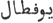

  
[Intangible Textual Heritage](../../index)  [Zoroastrianism](../index) 
[Index](index)  [Previous](sbe37125)  [Next](sbe37127) 

------------------------------------------------------------------------

[Buy this Book at
Amazon.com](https://www.amazon.com/exec/obidos/ASIN/1402156081/internetsacredte)

------------------------------------------------------------------------

*Pahlavi Texts, Part IV (SBE37)*, E.W. West, tr. \[1892\], at Intangible
Textual Heritage

------------------------------------------------------------------------

p. 419

### II. FROM THE RIVÂYAT OF KÂMAH BAHRAH [1](#fn_1649).

1\. The name of the first of these books is Stô*d*-ya*s*t [2](#fn_1650), and this is a book of thirty-three
compilations (ʓûrat), that is, of thirty-three subdivisions (kardah).
The sending down of this book *was* for the description of the
Lord [3](#fn_1651) and his angels; *and* he
made *it* an indispensable duty for the whole world that they learn this
book by heart, and for this purpose they form an assembly. Of this total
of twenty-one Nasks it is one Nask of the Avesta, and in that mode they
recite this.

2\. The name of the second is Stûdgar [4](#fn_1652), and this is of twenty-two
subdivisions, which God, the praiseworthy

p. 420

*and* exalted, sent down for prayer and virtue, authority and
intercession, and giving union to kindred.

3\. The name of the third is Vahi*s*t-mânthrah [1](#fn_1653), and that is of twenty-two
subdivisions, which God, the praiseworthy *and* exalted, sent down for
faith and heedfulness in religion. *One* is reminded, in this book,
about the intention and character of Zaratu*s*t; also the goodness of
the creation, and the good actions before Zaratu*s*t; and the narrative
of this book extends in this manner up to the resurrection.

4\. The name of the fourth is Bagh [2](#fn_1654); this book is of twenty-one parts
(pârah) *or* subdivisions, and its explanation is about whatever is in
the religion; also a declaration of God, the praiseworthy *and* exalted,
and *of* whatever the Lord *has* made incumbent on mankind as to
devotion and heedfulness, as to justice and virtue, *and* as to good
actions, closing the path of Satan to oneself, *and* approaching the
last abode, that is, the other world.

5\. The name of the fifth is Dvâzdah-hâmâst [3](#fn_1655), and the commentary of this book is
for assistance [4](#fn_1656). This book is of
thirty-two subdivisions, which God, the praiseworthy *and* exalted, sent
down in remembrance of the beginning of the creatures of the upper world
and lower world. Also a description of the whole of them, and *of*
whatever the Most Just, the praiseworthy and exalted, *has* made mention
in the

p. 421

sky and the earth, water, plants, and fire, mankind and quadrupeds,
grazing animals and birds, and whatever is created for the advantage and
equipment of them. And like this, moreover, the resurrection, that is,
the raising of the dead, *their* path, assembling, and dispersion, and
the nature *and* circumstances of the resurrection, as to good doers and
evildoers, through the gravity of every action which they perform as
good *or* bad.

6\. The name of the sixth is Nâdar [1](#fn_1657), and that is of thirty-five
compilations which are sent down about the stars and the aspect and life
of the sky. Also a description of the constellations, which are
auspicious and which inauspicious, the method of these sciences and the
operation of each one; whatever they say in sublime words, and whatever
remains in this. They separate this from a book whose name in Arabic is
Bavaf*t*âl [2](#fn_1658) and is about the
knowledge of the stars; and in Persian the name of that book is
Favâmî*g*asân [3](#fn_1659), and they have
made much more mention of the meaning of that, and of instruction of
this kind for the moderns.

7\. The name of the seventh is Pâ*g*am [4](#fn_1660), and this is a book of twenty-two
subdivisions, which God, the praiseworthy *and* exalted, sent down about
quadrupeds *and* how it is necessary to render *them*

p. 422

lawful, which is lawful and which unlawful, *and* how they slaughter
*them;* which it is and how it is necessary to slaughter *it* for the
sake of a season-festival, and whatever is about a season-festival; how
it is necessary to celebrate *it*, and the person who takes the
things [1](#fn_1661); the expense of a
season-festival and how much the reward is; how it is necessary to give
to the priests, controllers (radân), and high-priests, and to any
persons who are without doubts, who in speech, action, and intention are
virtuous, and any persons who recite the season-festival *liturgy*. And
everything wise is in this book; and this is incumbent on all people
that they learn this, and *it is* the same for all till the days of the
guardian spirits; and every one who possesses knowledge seeks for this,
and causes intercession by mankind, for the sake of the worthy, such as
clothing *for* a righteous gift, so that *one* obtains recompense in the
end from heaven; and it is necessary to give this clothing *for* a
righteous gift to relations and the worthy.

8\. The name of the eighth is Ratu*s*tâyî [2](#fn_1662), and this is of fifty subdivisions,
*but* when, after *the time of* Alexander, they held an enquiry, they
found no more *than* thirteen subdivisions. And these are about the
affairs of the king and obedience, judges and whatever becomes important
in holding enquiries, philosophers and devotees; about the edifices of
cities, constructed and made magnificent, birds and species of animals,
fish *and* whatever is

p. 423

\[paragraph continues\] Ormazd's, the
fowls of Ormazd besides the creatures of Aharman; likewise mountains,
rivers, and land, and the like of these.

9\. The name of the ninth is Bari*s* [1](#fn_1663), *and* this is a book of sixty
subdivisions, *but* after *the time of* Alexander they found again no
more *than* twelve subdivisions. And these are about descriptions of
kings and judges, and an investigation of their authority and their
sufficiency; also the relations of a peasant with peasants, of a king
with the kingdom, of judges with a judge, and whatever remains therein.
Any actions that are for every nation, how they are ordered, and the
option as to their species and nature; also whatever the people know,
and the advantage *that* arises therefrom; besides the sins of people,
deceit, telling lies, and whatever remains therein.

Io. The name of the tenth is Ka*s*kasîrah [2](#fn_1664), and this is a book of sixty
subdivisions, *but* after the calamity of Alexander they found again no
*more than* fifteen. Its explanation is about the distinction (faʓl) of
natural wisdom and knowledge [3](#fn_1665)
from acquired knowledge, that is, the knowledge born from the mother,
and the knowledge and instruction they learn; *one* learned in purity
and truthful speaking, and anything that *has* brought mankind with
virtue out of evil, and with purity out of defilement, and this keeps
the doctrine praised *and* great, and whoever is in the vicinity of a
king, and is a peasant, becomes greater *in* honour and dignity; and, in
like manner, any things from which advantage

p. 424

arises for mankind; and, *as to* those who tell lies, how it occurs in
the vicinity of kings and peasants.

11\. The eleventh is the Vi*s*tâsp-shâh [1](#fn_1666), and that is of sixty compilations,
*but* after the calamity of Alexander they found again no *more than*
ten subdivisions. It is about Gu*s*tâsp's acceptance of the sovereignty,
and as to the religion of Zaratu*s*t—who *was* skilful in reciting the
religion, and maintaining *it* and making *it* current in the world—he
chose the religion of Zaratu*s*t.

12\. The name of the twelfth is ‘*H*a*s*t [2](#fn_1667), and this is of twenty-two
subdivisions, which are sent down in six portions (*g*uzû). The first is
about knowing the Lord, may he be honoured and glorified! and faith on
account of Zaratu*s*t. The second portion is about the obedience of
kings, the truth of the religion, complying *with* commands and
resisting them, and restraining *one's* hand from bad actions. The third
portion is about the promise *to* benefactors and their recompense,
evildoers and punishment, and escaping hell. The fourth portion is about
the mansions of the world, agriculture, trimming trees, such as the date
tree, and whatever remains thereof; the trouble and power of mankind and
quadrupeds therefrom, and the obedience they exercise; they are the
people to whom heedfulness is attributed, and whatever remains thereof;
and the high-priests perform *their* duty by the law of the religion.
The fifth portion is about the ranks of mankind, and

p. 425

those are four ranks: the first is to maintain the king grandly, and,
next, the judges and the learned in religion; the second rank is to keep
watch *over* the cities, and to annihilate the enemy; of the third rank
are writers and, secondarily, cultivators and the society of cities; of
the fourth rank are the people of trade, artizans, market-dealers, and
tax-gatherers, in war they appear excited, and it is requisite to give a
tithe *to* the high-priests and king; they keep on foot the obeisances
and good works of which we have spoken, and, when they act thus, they
obtain great rewards in the end [1](#fn_1668).

13\. The name of the thirteenth is Sfend [2](#fn_1669), and that is of sixty subdivisions
which are sent down for the information of people who are in want of it,
and for the knowledge of those persons who become covetous of virtuous
actions, and act after the proceedings of the learned and people of
religion, and receive advantage therefrom; also as reminders that there
is advantage from the daily practice of them. And this book is our
reminder about the accounts of the apostle Zaratu*s*t by religious
people, and whatever is the allotment of God, the exalted; about the
false speaking of the people of the world, and about the goodness of the
condition of the people of the world. Also whatever becomes manifest in
ten years, about the miracles of Zaratu*s*t, by the seven reports that
they recite.

14\. The name of the fourteenth is *G*ira*s*t [3](#fn_1670), and this is of twenty-two
subdivisions sent down for the

p. 426

understanding of the causes of mankind, which *have* made people
manifest in the mother's womb, and afterwards those who come out of the
womb, some of whom are apostles, some kings, and some peasants; and
whatever remains therein.

15\. The name of the fifteenth is Bagh an-ya*s*t [1](#fn_1671), *and* it is of seventeen subdivisions
in praise of the creations of God, the praiseworthy *and* exalted, and
the angels admitted to him; also thanksgiving *for* his favours, and
that which he makes expedient in the religion, augments the thanksgiving
*for* his favour, until *one* obtains *it* back in the end; likewise the
appearance of the angels, and this is noble. Praise be to the sacred
being, the exalted!

16\. The name of the sixteenth is Niyâram [2](#fn_1672), and that is of fifty-four
subdivisions, about decrees *as to* riches, introducing inmates among
outsiders, and whatever is made lawful by the exalted Lord; obtaining
deliverance from hell, performing service, slavery, and the nature of
wayfarers, and every one who performs service and produces remembrance
for mankind; whatever is in the thoughts of mankind, and whatever is in
the bodies of mankind.

17\. The seventeenth is Aspâram [3](#fn_1673),
and this is of sixty-four subdivisions which are sent down about
rituals, those which are in the book of the people of the religion, and
an examination of the people's expense they know of, for the safety and
punishment they order in the world until they obtain deliverance in the
end; and whatever they do lawfully and do unlawfully they know; also
decrees

p. 427

*as to* inheritances and the limits of faith, about anything which they
sow and whatever they grow, *and* about regulating nativity; whatever
*one* makes incumbent on memory, and whatever *one* makes incumbent on
memoranda prepared; also how it is necessary to produce whatever tokens
*there are* at the time of childbirth.

18\. The name of the eighteenth is Duvâsarôni*g*ad [1](#fn_1674), *and* it is of sixty-five
subdivisions; robbers of human beings and quadrupeds, whatever *one*
makes incumbent that they shall give, and an enumeration of what *one*
makes incumbent on each one of them, owing to theft and terror,
obstructing the roads, the dread of the wayfarers, and the disturbance
of prisons; *and* whatever remains therein.

19\. The name of the nineteenth is Askâram [2](#fn_1675), *and* it is of fifty-two
subdivisions, about judges and philosophers, the method of examining
decrees, the knowledge of definitions, and am opinion of those in other
matters.

20\. The name of the twentieth is Vendîdâd [3](#fn_1676), *and* that is of twenty-two
subdivisions, for causing the abstinence of mankind from bad actions,
from the devil and disgrace, foreign magicians and those who act after
their proceedings and become committers of crime; and we are told of
their crime among the whole of the goodness and purity, and the whole of
the wickedness and defilement, and the explanation of them.

p. 428

21\. The name of the twenty-first is Hâdokht [1](sbe37127.htm#fn_1677), and this is a book of
thirty subdivisions, about the manner of bringing together and the
abundance of miracles, also the excellence and connections of them. And
the accursed devil goes far from every one who recites this book
together with the Ya*s*t [2](sbe37127.htm#fn_1678), and this person is near
*to* the rank (pâîgâh) of a sacred being, and his sins become pure; also
in this book the accursed devil becomes cursed, and God knows *it*.

------------------------------------------------------------------------

### Footnotes

[419:1](sbe37126.htm#fr_1690) This writer is
often quoted in the Rivâyats, but no particulars about him have been
noticed. Another copy of this text occurs in MS. 225 of Ouseley's
Collection (O225, fols. 15-19) in the Bodleian Library at Oxford;
Olshausen and Mohl (OM) combine the information given in II and III; and
MS. 10 of Haug's Collection in the State Library at Munich (MH10, fols.
55-57) corn-bines II and IV.

[419:2](sbe37126.htm#fr_1691) See Dk. VIII,
Chap. XLVI.

[419:3](sbe37126.htm#fr_1692) Assuming that
‘*h*vê*s*, his own,' stands for ‘*h*udâî, as in Riv. IV, 2.

[419:4](sbe37126.htm#fr_1693) See Dk. VIII,
Chap. II, and IX, Chaps. II-XXIII.

[420:1](sbe37126.htm#fr_1694) See Dk. VIII,
Chap. III, and IX, Chaps. XXIV-XLVI.

[420:2](sbe37126.htm#fr_1695) Ibid. Chap. IV
and Chaps. XLVII-LXVIII.

[420:3](sbe37126.htm#fr_1696) Ibid. Chap. V.

[420:4](sbe37126.htm#fr_1697) Written
dar-imdâd; but, omitting the letter r, we should have 'the Dâmdâd.'

[421:1](sbe37126.htm#fr_1698) See Dk. VIII,
Chap. VI. Singularly enough, the writers in the Rivâyats profess to know
very much about this and their twelfth Nask, of neither of which the
Dinka*rd* knows anything.

[421:2](sbe37126.htm#fr_1699) In the different
MSS. consulted, this name is four times written   and once  .

[421:3](sbe37126.htm#fr_1700) Variously
written  .

[421:4](sbe37126.htm#fr_1701) See Dk. VIII,
Chap. VII.

[422:1](sbe37126.htm#fr_1702) O225 has
*k*îzhâ, the others only hâ; but compare Dk. VIII, Chap. VII, 5.

[422:2](sbe37126.htm#fr_1703) See Dk. VIII,
Chap. VIII.

[423:1](sbe37126.htm#fr_1704) See Dk. VIII,
Chap. IX.

[423:2](sbe37126.htm#fr_1705) Ibid. Chap. X.

[423:3](sbe37126.htm#fr_1706) So in OM, MH10;
but O225, B29 are corrupted.

[424:1](sbe37126.htm#fr_1707) See Dk. VIII,
Chap. XI. In Riv. IV the surviving subdivisions are said to be only
eight, so as to correspond with the sections of the extant Vi*s*tâsp
Ya*s*t.

[424:2](sbe37126.htm#fr_1708) Ibid. Chap. XII.
O225 has ‘*H*a*s*t.

[425:1](sbe37126.htm#fr_1709) Nothing is said
of the sixth portion, either in the Rivâyats or the Dîn-vi*g*irgard.

[425:2](sbe37126.htm#fr_1710) See Dk. VIII,
Chap. XIV.

[425:3](sbe37126.htm#fr_1711) Ibid. Chap.
XIII. MH10 has *K*irast.

[426:1](sbe37126.htm#fr_1712) See Dk. VIII,
Chap. XV.

[426:2](sbe37126.htm#fr_1713) Ibid. Chaps.
XVI-XX.

[426:3](sbe37126.htm#fr_1714) Ibid. Chaps.
XXVIII-XXXVII.

[427:1](sbe37126.htm#fr_1715) See Dk. VIII,
Chaps. XXI-XXVII. MH10 has Duvâsrôb, and OM Duvâsarô*g*ad; duvâ standing
for dûbâ, or zûbâ, the traditional reading of the Zvâri*s* ganabâ, 'a
thief.'

[427:2](sbe37126.htm#fr_1716) Ibid. Chaps.
XXXVIII-XLIII.

[427:3](sbe37126.htm#fr_1717) Ibid. Chap.
XLIV.

------------------------------------------------------------------------

[Next: III. From the Rivâyat of Narêmân Hôshang](sbe37127)
