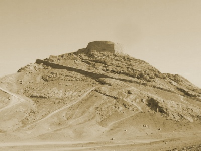

  
[Intangible Textual Heritage](../../index)  [Zoroastrianism](../index) 
[Wisdom of the East](../../woe/index) 

------------------------------------------------------------------------

<table width="75%">
<colgroup>
<col style="width: 50%" />
<col style="width: 50%" />
</colgroup>
<tbody>
<tr class="odd">
<td width="50%" data-valign="TOP"></td>
<td width="50%" data-valign="CENTER"><h1 id="the-teachings-of-zoroaster" data-align="CENTER">The Teachings of Zoroaster</h1>
<h2 id="by-s.a.-kapadia" data-align="CENTER">by S.A. Kapadia</h2>
<h4 id="section" data-align="CENTER">[1905]</h4></td>
</tr>
</tbody>
</table>

------------------------------------------------------------------------

[Contents](#contents)    [Start Reading](toz00)    [Page
Index](pageidx)    [Text \[Zipped\]](toz.txt.gz)

------------------------------------------------------------------------

This is a short study of the Zoroastrian religion, part of the Wisdom of
the East series. S.A. Kapadia, who along with L. Cranmer-Byng, edited or
wrote many of the books in the [Wisdom of the East](../../woe/index),
was a member of the Indian Zoroastrian community, and his personal
insights into the religion are invaluable.

------------------------------------------------------------------------

 [Title Page](toz00)  
[Contents](toz01)  
[Editorial Note](toz02)  
[Author's Preface](toz03)  
[Introduction](toz04)  
[Extracts](toz05)  
[Notes](toz06)  
[Advertisements](toz07)  
