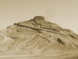

  
[Intangible Textual Heritage](../../index)  [Zoroastrianism](../index) 
[Wisdom of the East](../../woe/index)  [Index](index) 
[Previous](toz00)  [Next](toz02) 

------------------------------------------------------------------------

  
*The Teachings of Zoroaster*, by S.A. Kapadia, \[1905\], at Intangible
Textual Heritage

------------------------------------------------------------------------

p. 6 p. 7

### CONTENTS

|                                                                                                                                                                       |                                                 |
|-----------------------------------------------------------------------------------------------------------------------------------------------------------------------|-------------------------------------------------|
|                                                                                                                                                                       | PAGE                 |
| Zoroaster preaching Mazdeism                                                                                                                                          | [15](toz04.htm#page_15)                         |
| Meditation on the Mount—Conversion of King Gushtasp—Manifestations of the Deity                                                                                       | [16](toz04.htm#page_16)                         |
| Zoroaster's Crusade [against](errata.htm#0) Idol-Worshippers—Monotheists (Mazdayasnians) v. Polytheists (Daêvayasnians—Migration of Daêvayasnians and Hindooism       | [17](toz04.htm#page_17)                         |
| A Parallel—The Ancient Persian and the Modern British Empire                                                                                                          | [18](toz04.htm#page_18)                         |
| The Fall of the Persian Empire and Migration of the Devout Zoroastrians to India                                                                                      | [19](toz04.htm#page_19)                         |
| The Birth of Zoroaster                                                                                                                                                | [20](toz04.htm#page_20)                         |
| The Soul of Nature                                                                                                                                                    | [21](toz04.htm#page_21)                         |
| Definition of Ahura-Mazda (God)                                                                                                                                       | [22](toz04.htm#page_22)                         |
| Meaning of the Word Daêva in the Avesta Language                                                                                                                      | [24](toz04.htm#page_24)                         |
| Creation                                                                                                                                                              | [25](toz04.htm#page_25)                         |
| Zoroastrian Speculative Philosophy—Spenta Mainyus (Creative Spirit) and Angro Mainyus (Destructive Spirit)—Their Incessant Conflict in the State of Nature            | [26](toz04.htm#page_26)                         |
| Doctrine of Dualism refuted                                                                                                                                           | [27](toz04.htm#page_27)                         |
| p. 8                                                                                                                                         |                                                 |
|                                                                                                                                                                       | PAGE                 |
| Evils employed by Angro Mainyus                                                                                                                                       | [28](toz04.htm#page_28)                         |
| Invocation of Spenta Mainyus—Of the Life on the Earth—The Creation of Sixteen Regions                                                                                 | [29](toz04.htm#page_29)                         |
| Yima (Jamshid), the Ruler of Airyana-Vaêjâ—God's Warning to Yima of the Disaster to his Kingdom (Noah and his Ark)                                                    | [30](toz04.htm#page_30)                         |
| Spenta Mainyus and Angro Mainyus, a Contrast between Good and Evil                                                                                                    | [31](toz04.htm#page_31)                         |
| Hygienic Rules laid down by Zoroaster—Preservation of Bodily Health—Fight against Pestilence and Disease (Drukhs Naçus)                                               | [32](toz04.htm#page_32)                         |
| Precepts of Purity—Cultivation and Care of the Soil                                                                                                                   | [33](toz04.htm#page_33)                         |
| The Bubonic Plague and the Parsis of Bombay—The Armour of Health forged by Zoroaster                                                                                  | [34](toz04.htm#page_34)                         |
| Zoroaster's Moral Philosophy. Vohumana (the Good Mind), Akamana (the Evil Mind)                                                                                       | [35](toz04.htm#page_35)                         |
| Good Thoughts (Humata), Good Words (Hukhta), and Good Deeds (Hvarshta) defined                                                                                        | [35](toz04.htm#page_35)–[36](toz04.htm#page_36) |
| A Zoroastrian Household—Status of Women                                                                                                                               | [37](toz04.htm#page_37)–[38](toz04.htm#page_38) |
| Morality of Zoroastrian Women—Tolerance                                                                                                                               | [38](toz04.htm#page_38)                         |
| An Avesta Incident of Mercy and Charity towards the Fallen                                                                                                            | [39](toz04.htm#page_39)–[40](toz04.htm#page_40) |
| God and His Hierarchy of Archangels (Ameshaspends)                                                                                                                    | [41](toz04.htm#page_41)                         |
| Kindness to Dumb Animals—Complaint of Geush-Urvan (the Over-Lord of the Herd of Cattle) to God—A Parable                                                              | [41](toz04.htm#page_41)–[42](toz04.htm#page_42) |
| A Prayer of Repentance for Ill-Treatment or Unkindness to Domestic Animals                                                                                            | [43](toz04.htm#page_43)                         |
| Prohibition of Fasting from Food                                                                                                                                      | [44](toz04.htm#page_44)                         |
| p. 9                                                                                                                                         |                                                 |
| Of the Life Hereafter                                                                                                                  |                                                 |
|                                                                                                                                                                       | PAGE                 |
| The Body and the Soul                                                                                                                                                 | [45](toz04.htm#page_45)                         |
| Severance of their Tie of Friendship—The Glorious Sunset of Life—The Soul's Departure—Its Arrival at "Chinvat Bridge"—The Recorder "Mehr Davar" at the Gate of Heaven | [46](toz04.htm#page_46)                         |
| Doctrine of Reward and Punishment                                                                                                                                     | [47](toz04.htm#page_47)                         |
| Duties of a Zoroastrian Youth after his Confirmation —The Way to Garothman Behest (Heaven)—The Result of the Zoroastrian Philosophy                                   | [48](toz04.htm#page_48)–[49](toz04.htm#page_49) |
| Incidents of Life where Religious Teachings are wanting                                                                                                               | [49](toz04.htm#page_49)                         |
| An Illustration from Life (from Ignorance to Crime, from Crime to the Gallows)                                                                                        | [49](toz04.htm#page_49)–[51](toz04.htm#page_51) |
| Resurrection of the Body                                                                                                               | [52](toz04.htm#page_52)–[53](toz04.htm#page_53) |
| The Memory of the Dead                                                                                                                                                | [54](toz04.htm#page_54)                         |
| All Souls' Day                                                                                                                                                        | [54](toz04.htm#page_54)–[55](toz04.htm#page_55) |
| END OF INTRODUCTION                                                                                                                        |                                                 |
|                                                                                                                                                                       |                                                 |
| EXTRACTS                                                                                                                                                              |                                                 |
| Prayer of Ashem-Vohû                                                                                                                                                  | [57](toz05.htm#page_57)                         |
| The Law of Ahura-Mazda                                                                                                                                                | [58](toz05.htm#page_58)                         |
| Commandments for the Body and the Soul                                                                                                                                | [58](toz05.htm#page_58)                         |
| The Soul's Destination                                                                                                                                                | [61](toz05.htm#page_61)                         |
| The Soul's Rendering of Account                                                                                                                                       | [64](toz05.htm#page_64)                         |
| Gatha Hymn                                                                                                                                                            | [66](toz05.htm#page_66)                         |
| Confession of Faith                                                                                                                                                   | [69](toz05.htm#page_69)                         |
| The Creed                                                                                                                                                             | [69](toz05.htm#page_69)                         |
| p. 10                                                                                                                                       |                                                 |
|                                                                                                                                                                       | PAGE                 |
| Prayer of Kem Nâ Mazda                                                                                                                                                | [70](toz05.htm#page_70)                         |
| Prayer of Ke Verethrem Gâ                                                                                                                                             | [70](toz05.htm#page_70)                         |
| Prayer of Ormuzd Yast (in Praise of God)                                                                                                                              | [70](toz05.htm#page_70)                         |
| God as the King, the Life, the Rewarder                                                                                                                               | [71](toz05.htm#page_71)                         |
| The Creation of the World by Ahura-Mazda and  corresponding Evils by Angro Mainyus                                                                                    | [72](toz05.htm#page_72)                         |
| God's Warning to Yima of Winter and Deluge                                                                                                                            | [74](toz05.htm#page_74)                         |
| Blessings of cultivating the Soil                                                                                                                                     | [76](toz05.htm#page_76)                         |
| Happiness of the Earth                                                                                                                                                | [77](toz05.htm#page_77)                         |
| Grief of the Earth                                                                                                                                                    | [77](toz05.htm#page_77)                         |
| Cultivation of Land where a Corpse is found                                                                                                                           | [78](toz05.htm#page_78)                         |
| Purification of Water defiled by a Corpse                                                                                                                             | [78](toz05.htm#page_78)                         |
| Religious Education                                                                                                                                                   | [79](toz05.htm#page_79)                         |
| Reward for the Pious                                                                                                                                                  | [80](toz05.htm#page_80)                         |
| Forgiveness of Sin                                                                                                                                                    | [81](toz05.htm#page_81)                         |
| The Temptation                                                                                                                                                        | [82](toz05.htm#page_82)                         |
| Banishment of Angro Mainyus                                                                                                                                           | [83](toz05.htm#page_83)                         |
| On Loan                                                                                                                                                               | [84](toz05.htm#page_84)                         |
| On Waste                                                                                                                                                              | [84](toz05.htm#page_84)                         |
| Temperance                                                                                                                                                            | [84](toz05.htm#page_84)                         |
| Souls’ Visit to the Earth                                                                                                                                             | [86](toz05.htm#page_86)                         |
| The Mazdayasnian Confession                                                                                                                                           | [87](toz05.htm#page_87)                         |
| Patet Erani (A Prayer for Repentance)                                                                                                                                 | [89](toz05.htm#page_89)                         |
| Marriage Service                                                                                                                                                      | [91](toz05.htm#page_91)                         |
| The Vision of Ardâ-Virâf                                                                                                                                              | [92](toz05.htm#page_92)                         |
| Sanctity                                                                                                                                                              | [101](toz05.htm#page_101)                       |
| Prayer for Safety                                                                                                                                                     | [102](toz05.htm#page_102)                       |
| NOTES                                                                                                                                                                 | [103](toz06.htm#page_103)                       |

------------------------------------------------------------------------

[Next: Editorial Note](toz02)

