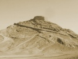

  
[Intangible Textual Heritage](../../index)  [Zoroastrianism](../index) 
[Wisdom of the East](../../woe/index)  [Index](index) 
[Previous](toz01)  [Next](toz03) 

------------------------------------------------------------------------

  
*The Teachings of Zoroaster*, by S.A. Kapadia, \[1905\], at Intangible
Textual Heritage

------------------------------------------------------------------------

p. 11 p. 12

### EDITORIAL NOTE

THE object of the editors of this series is a very definite one. They
desire above all things that, in their humble way, these books shall be
the ambassadors of good-will and understanding between East and West,
the old world of Thought, and the new of Action. In this endeavour, and
in their own sphere, they are but followers of the highest example in
the land. They are confident that a deeper knowledge of the great ideals
and lofty philosophy of Oriental thought may help to a revival of that
true spirit of Charity which neither despises nor fears the nations of
another creed and colour. Finally, in thanking press and public for the
very cordial reception given to the "Wisdom of the East" series, they
wish to state that no pains have been spared to secure the best
specialists for the treatment of the various subjects at hand.

L. CR R-BYNG.  
S. A. KAPADIA.

The Orient Press,  
   4, Harcourt Buildings,  
      Inner Temple, London.

------------------------------------------------------------------------

[Next: Author's Preface](toz03)

