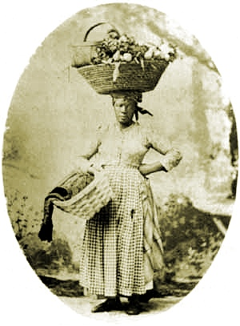

  
[Intangible Textual Heritage](../../index)  [Africa](../index) 

------------------------------------------------------------------------

<table width="75%">
<colgroup>
<col style="width: 50%" />
<col style="width: 50%" />
</colgroup>
<tbody>
<tr class="odd">
<td width="50%" data-valign="TOP"></td>
<td width="50%" data-valign="CENTER"><h1 id="drums-and-shadows" data-align="CENTER">Drums and Shadows</h1>
<h4 id="georgia-writers-project" data-align="CENTER">Georgia Writer's Project</h4>
<h4 id="work-projects-administration" data-align="CENTER">Work Projects Administration</h4>
<h4 id="mary-granger-district-supervisor" data-align="CENTER">Mary Granger, District Supervisor</h4>
<h4 id="copyright-not-renewed" data-align="CENTER">[1940, copyright not renewed]</h4></td>
</tr>
</tbody>
</table>

------------------------------------------------------------------------

[Contents](#contents)    [Start Reading](das00)    [Page
Index](pageidx)    [Text \[Zipped\]](das.txt.gz)

------------------------------------------------------------------------

This collection of oral folklore from coastal Georgia was assembled
during the 1930s as part of a WPA writers' program, under the
supervision of Mary Granger. The accounts in this book, framed by
colorful descriptions of the rural locales where they were collected,
were principally from elderly African-Americans, some of them
centarians. Most had been slaves. In some cases they had known first
generation slaves who had been born in Africa.

This book focuses on a set of beliefs and magical practices (some of
which are today known as 'Hoodoo'), including root doctoring, the
existence of spirits, talismans, lucky and unlucky acts and omens and
more. The interviewer also investigates the use of drums and dancing
during celebrations, funeral and baptism rituals, food taboos, and other
aspects of folklore and ethnology. This study dispels any lingering
doubt that these beliefs are derived directly from Africa--it
exhaustively cross-references the narratives with an appendix of quotes
from African ethnographers, folklorists and explorers.

Do not be put off by the use of phonetic dialect spelling. This is not
being used here to belittle the speakers or cast them as ignorant.
Rather, this book is scrupulously non-judgmental. This is simply how
oral accounts were transcribed before there were portable tape recorders
or camcorders. It takes a bit of work, but after a few pages, these
potent and long-dead voices come to life.

--*John Bruno Hare*, March 23, 2007

------------------------------------------------------------------------

 [Title Page](das00)  
[Acknowledgments](das01)  
[Contents](das02)  
[Foreword](das03)  
[Notes to the Reader](das04)  
[Introduction](das05)  
[Old Fort](das06)  
[Tin City](das07)  
[Yamacraw](das08)  
[Frogtown and Currytown](das09)  
[Springfield](das10)  
[Brownville](das11)  
[Tatemville](das12)  
[White Bluff](das13)  
[Pin Point](das14)  
[Sandfly](das15)  
[Grimball's Point](das16)  
[Wilmington Island](das17)  
[Sunbury](das18)  
[Harris Neck](das19)  
[Pine Barren Near Eulonia](das20)  
[Possum Point](das21)  
[Darien](das22)  
[Sapelo Island](das23)  
[St. Simons Island](das24)  
[St. Marys](das25)  
[Appendix](das26)  
[Glossary](das27)  
[Informants](das28)  
[Bibliography](das29)  
