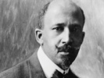

  
[Intangible Textual Heritage](../../index)  [Africa](../index) 
[Index](index)  [Previous](dbn04)  [Next](dbn06) 

------------------------------------------------------------------------

[Buy this Book at
Amazon.com](https://www.amazon.com/exec/obidos/ASIN/0486414434/internetsacredte)

------------------------------------------------------------------------

  
*The Negro*, by W.E.B. Du Bois, \[1915\], at Intangible Textual Heritage

------------------------------------------------------------------------

p. 17

# III    ETHIOPIA AND EGYPT

Having viewed now the land and movements of African people in main
outline, let us scan more narrowly the history of five main centers of
activity and culture, namely: the valleys of the Nile and of the Congo,
the borders of the great Gulf of Guinea, the Sudan, and South Africa.
These divisions do not cover all of Negro Africa, but they take in the
main areas and the main lines in development.

First, we turn to the valley of the Nile, perhaps the most ancient of
known seats of civilization in the world, and certainly the oldest in
Africa, with a culture reaching back six or eight thousand years. Like
all civilizations it drew largely from without and undoubtedly arose in
the valley of the Nile, because that valley was so easily made a center
for the meeting of men of all types and from all parts of the world. At
the same time Egyptian civilization seems to have been African in its
beginnings and in its main line of development, despite strong
influences from all parts of Asia. Of what race, then, were the
Egyptians? They certainly were not white in any sense of the modern use
of that word--neither in color nor physical measurement, in hair nor
countenance, in language nor social customs. They stood in relationship
nearest the Negro race in earliest times, and then gradually through the
infiltration of Mediterranean and Semitic elements became what would be
described in America as a light mulatto stock of Octoroons or Quadroons.
This stock was varied continually: now by new infiltration of Negro
blood from the south, now by Negroid and Semitic blood from the east,
now by Berber types from the north and west.

Egyptian monuments show distinctly Negro and mulatto faces. Herodotus,
in an incontrovertible passage, alludes to the Egyptians as "black and
curly-haired" [1](#fn_3)--a peculiarly
significant statement from

p. 18

one used to the brunette Mediterranean type; in another passage,
concerning the fable of the Dodonian Oracle, he again alludes to the
swarthy color of the Egyptians as exceedingly dark and even black.
Æschylus, mentioning a boat seen from the shore, declares that its crew
are Egyptians, because of their black complexions.

Modern measurements, with all their admitted limitations, show that in
the Thebaid from one-seventh to one-third of the Egyptian population
were Negroes, and that of the predynastic Egyptians less than half could
be classed as non-Negroid. Judging from measurements in the tombs of
nobles as late as the eighteenth dynasty, Negroes form at least
one-sixth of the higher class. [1](#fn_4)

Such measurements are by no means conclusive, but they are apt to be
under rather than over statements of the prevalence of Negro blood. Head
measurements of Negro Americans would probably place most of them in the
category of whites. The evidence of language also connects Egypt with
Africa and the Negro race rather than with Asia, while religious
ceremonies and social customs all go to strengthen this evidence.

The ethnic history of Northeast Africa would seem, therefore, to have
been this: predynastic Egypt was settled by Negroes from Ethiopia. They
were of varied type: the broad-nosed, woolly-haired type to which the
word "Negro" is sometimes confined; the black, curly-haired, sharper
featured type, which must be considered an equally Negroid variation.
These Negroes met and mingled with the invading Mediterranean race from
North Africa and Asia. Thus the blood of the sallower race spread south
and that of the darker race north. Black priests appear in Crete three
thousand years before Christ, and Arabia is to this day thoroughly
permeated with Negro blood. Perhaps, as Chamberlain says, "one of the
prime reasons why no civilization of the type of that of the Nile arose
in other parts of the continent, if such a thing were at all possible,
was that Egypt acted as a sort of channel by which the genius of
Negro-land was drafted off into the service of Mediterranean and Asiatic
culture." [2](#fn_5)

To one familiar with the striking and beautiful types arising from the
mingling of Negro with Latin and Germanic types in America, the puzzle
of the Egyptian type is easily solved. It was unlike any of its
neighbors and a unique type until one views the modern mulatto; then the
faces of Rahotep and Nefert, of Khafra and Amenemhat I,

p. 19

of Aahmes and Nefertari, and even of the great Ramessu II, become
curiously familiar.

The history of Egypt is a science in itself. Before the reign of the
first recorded king, five thousand years or more before Christ, there
had already existed in Egypt a culture and art arising by long evolution
from the days of paleolithic man, among a distinctly Negroid people.
About 4777 B.C. Aha-Mena began the first of three successive Egyptian
empires. This lasted two thousand years, with many Pharaohs, like Khafra
of the Fourth Dynasty, of a strongly Negroid cast of countenance.

At the end of the period the empire fell apart into Egyptian and
Ethiopian halves, and a silence of three centuries ensued. It is quite
possible that an incursion of conquering black men from the south poured
over the land in these years and dotted Egypt in the next centuries with
monuments on which the full-blooded Negro type is strongly and
triumphantly impressed. The great Sphinx at Gizeh, so familiar to all
the world, the Sphinxes of Tanis, the statue from the Fayum, the statue
of the Esquiline at Rome, and the Colossi of Bubastis all represent
black, full-blooded Negroes and are described by Petrie as "having high
cheek bones, flat checks, both in one plane, a massive nose, firm
projecting lips, and thick hair, with an austere and almost savage
expression of power." [1](#fn_6)

Blyden, the great modern black leader of West Africa, said of the Sphinx
at Gizeh: "Her features are decidedly of the African or Negro type, with
'expanded nostrils.' If, then, the Sphinx was placed here--looking out
in majestic and mysterious silence over the empty plain where once stood
the great city of Memphis in all its pride and glory, as an 'emblematic
representation of the king'--is not the inference clear as to the
peculiar type or race to which that king belonged?" [2](#fn_7)

The middle empire arose 3064 B.C. and lasted nearly twenty-four
centuries. Under Pharaohs whose Negro descent is plainly evident, like
Amenemhat I and III and Usertesen I, the ancient glories of Egypt were
restored and surpassed. At the same time there is strong continuous
pressure from the wild and unruly Negro tribes of the upper Nile valley,
and we get some idea of the fear which they inspired throughout Egypt
when we read of the great national rejoicing which followed the triumph
of Usertesen III (c. 2660-22) over

p. 20

these hordes. He drove them back and attempted to confine them to the
edge of the Nubian Desert above the Second Cataract. Hemmed in here,
they set up a state about this time and founded Nepata.

Notwithstanding this repulse of black men, less than one hundred years
later a full-blooded Negro from the south, Ra Nehesi, was seated on the
throne of the Pharaohs and was called "The king's eldest son." This may
mean that an incursion from the far south had placed a black conqueror
on the throne. At any rate, the whole empire was in some way shaken, and
two hundred years later the invasion of the Hyksos began. The domination
of Hyksos kings who may have been Negroids from Asia [1](#fn_8) lasted for five hundred years.

The redemption of Egypt from these barbarians came from Upper Egypt, led
by the mulatto Aahmes. He founded in 1703 B.C. the new empire, which
lasted fifteen hundred years. His queen, Nefertari, "the most venerated
figure of Egyptian history," [2](#fn_9) was a
Negress of great beauty, strong personality, and of unusual
administrative force. She was for many years joint ruler with her son,
Amenhotep I, who succeeded his father. [3](#fn_10)

The new empire was a period of foreign conquest and internal splendor
and finally of religious dispute and overthrow. Syria was conquered in
these reigns and Asiatic civilization and influences poured in upon
Egypt. The great Tahutmes, III, whose reign was "one of the grandest and
most eventful in Egyptian history," [4](#fn_11)
had a strong Negroid countenance, as had also Queen Hatshepsut, who sent
the celebrated expedition to reopen ancient trade with the Hottentots of
Punt. A new strain of Negro blood came to the royal line through Queen
Mutemua about 1420 B.C., whose son, Amenhotep III, built a great temple
at Luqsor and the Colossi at Memnon.

The whole of the period in a sense culminated in the great Ramessu II,
the oppressor of the Hebrews, who with his Egyptian, Libyan, and Negro
armies fought half the world. His reign, however, was the beginning of
decline, and foes began to press Egypt from the white north and the
black south. The priests transferred their power at Thebes, while the
Assyrians under Nimrod overran

p. 21

\[paragraph continues\] Lower Egypt. The
center of interest is now transferred to Ethiopia, and we pass to the
more shadowy history of that land.

The most perfect example of Egyptian poetry left to us is a celebration
of the prowess of Usertesen III in confining the turbulent Negro tribes
to the territory below the Second Cataract of the Nile. The Egyptians
called this territory Kush, and in the farthest confines of Kush lay
Punt, the cradle of their race. To the ancient Mediterranean world
Ethiopia (i.e., the Land of the Black-faced) was a region of gods and
fairies. Zeus and Poseidon feasted each year among the "blameless
Ethiopians," and Black Memnon, King of Ethiopia, was one of the greatest
of heroes.

"The Ethiopians conceive themselves," says Diodorus Siculus (Lib. III),
"to be of greater antiquity than any other nation; and it is probable
that, born under the sun's path, its warmth may have ripened them
earlier than other men. They suppose themselves also to be the inventors
of divine worship, of festivals, of solemn assemblies, of sacrifices,
and every religious practice. They affirm that the Egyptians are one of
their colonies."

The Egyptians themselves, in later days, affirmed that they and their
civilization came from the south and from the black tribes of Punt, and
certainly "at the earliest period in which human remains have been
recovered Egypt and Lower Nubia appear to have formed culturally and
racially one land." [1](#fn_12)

The forging ahead of Egypt in culture was mainly from economic causes.
Ethiopia, living in a much poorer land with limited agricultural
facilities, held to the old arts and customs, and at the same time lost
the best elements of its population to Egypt, absorbing meantime the
oncoming and wilder Negro tribes from the south and west. Under the old
empire, therefore, Ethiopia remained in comparative poverty, except as
some of its tribes invaded Egypt with their handicrafts.

As soon as the civilization below the Second Cataract reached a height
noticeably above that of Ethiopia, there was continued effort to protect
that civilization against the incursion of barbarians. Hundreds of
campaigns through thousands of years repeatedly subdued or checked the
blacks and brought them in as captives to mingle their blood with the
Egyptian nation; but the Egyptian frontier was not advanced.

A separate and independent Ethiopian culture finally began to

p. 22

arise during the middle empire of Egypt and centered at Nepata and
Meroe. Widespread trade in gold, ivory, precious stones, skins, wood,
and works of handicraft arose. [1](#fn_13) The
Negro began to figure as the great trader of Egypt.

This new wealth of Ethiopia excited the cupidity of the Pharaohs and led
to aggression and larger intercourse, until at last, when the dread
Hyksos appeared, Ethiopia became both a physical and cultural refuge for
conquered Egypt. The legitimate Pharaohs moved to Thebes, nearer the
boundaries of Ethiopia, and from here, under Negroid rulers, Lower Egypt
was redeemed.

The ensuing new empire witnessed the gradual incorporation of Ethiopia
into Egypt, although the darker kingdom continued to resist. Both
mulatto Pharaohs, Aahmes and Amenhotep I, sent expeditions into
Ethiopia, and in the latter's day sons of the reigning Pharaoh began to
assume the title of "Royal Son of Kush" in some such way as the son of
the King of England becomes the Prince of Wales.

Trade relations were renewed with Punt under circumstances which lead us
to place that land in the region of the African lakes. The Sudanese
tribes were aroused by these and other incursions, until the revolts
became formidable in the fourteenth century before Christ.

Egyptian culture, however, gradually conquered Ethiopia where her armies
could not, and Egyptian religion and civil rule began to center in the
darker kingdom. When, therefore, Shesheng I, the Libyan, usurped the
throne of the Pharaohs in the tenth century B.C., the Egyptian
legitimate dynasty went to Nepata as king priests and established a
theocratic monarchy. Gathering strength, the Ethiopian kingdom under
this dynasty expanded north about 750 B.C. and for a century ruled all
Egypt.

The first king, Pankhy, was Egyptian bred and not noticeably Negroid,
but his successors showed more and more evidence of Negro blood--Kashta
the Kushite, Shabaka, Tarharqa, and Tanutamen. During the century of
Ethiopian rule a royal son was appointed to rule Egypt, just as formerly
a royal Egyptian had ruled Kush. In many ways this Ethiopian kingdom
showed its Negro peculiarities: first, in its worship of distinctly
Sudanese gods; secondly, in the rigid custom of female succession in the
kingdom, and thirdly, by the election of kings from the various royal
claimants to the throne. "It

p. 23

was the heyday of the Negro. For the greater part of the century. . . .
Egypt itself was subject to the blacks, just as in the new empire the
Sudan had been subject to Egypt." [1](#fn_14)

Egypt now began to fall into the hands of Asia and was conquered first
by the Assyrians and then by the Persians, but the Ethiopian kings kept
their independence. Aspeluta, whose mother and sister are represented as
full-blooded Negroes, ruled from 630 to 600 B.C. Horsiatef (560-525
B.C.) made nine expeditions against the warlike tribes south of Meroe,
and his successor, Nastosenen (525-500 B.C.) was the one who repelled
Cambyses. He also removed the capital from Nepata to Meroe, although
Nepata continued to be the religious capital and the Ethiopian kings
were still crowned on its golden throne.

From the fifth to the second century B.C. we find the wild Sudanese
tribes pressing in from the west and Greek culture penetrating from the
east. King Arg-Amen (Ergamenes) showed strong Greek influences and at
the same time began to employ the Ethiopian speech in writing and used a
new Ethiopian alphabet.

While the Ethiopian kings were still crowned at Nepata, Meroe gradually
became the real capital and supported at one time four thousand artisans
and two hundred thousand soldiers. It was here that the famous Candaces
reigned as queens. Pliny tells us that one Candace of the time of Nero
had had forty-four predecessors on the throne, while another Candace
figures in the New Testament. [2](#fn_15)

It was probably this latter Candace who warred against Rome at the time
of Augustus and received unusual consideration from her formidable foe.
The prestige of Ethiopia at this time was considerable throughout the
world. Pseudo-Callisthenes tells an evidently fabulous story of the
visit of Alexander the Great to Candace, Queen of Meroe, which
nevertheless illustrates her fame: Candace will not let him enter
Ethiopia and says he is not to scorn her people because they are black,
for they are whiter in soul than his white folk. She sent him gold,
maidens, parrots, sphinxes, and a crown of emeralds and pearls. She
ruled eighty tribes, who were ready to punish those who attacked her.

The Romans continued to have so much trouble with their Ethiopian
frontier that finally, when Semitic mulattoes appeared in the east, the
Emperor Diocletian invited the wild Sudanese tribe of

p. 24

\[paragraph continues\] Nubians (Nobadæ)
from the west to repel them. These Nubians eventually embraced
Christianity, and northern Ethiopia came to be known in time as Nubia.

The Semitic mulattoes from the east came from the highlands bordering
the Red Sea and Asia. On both sides of this sea Negro blood is strongly
in evidence, predominant in Africa and influential in Asia. Ludolphus,
writing in the seventeenth century, says that the Abyssinians "are
generally black, which \[color\] they most admire." Trade and war united
the two shores, and merchants have passed to and fro for thirty
centuries.

In this way Arabian, Jewish, Egyptian, Greek, and Roman influences
spread slowly upon the Negro foundation. Early legendary history
declares that a queen, Maqueda, or Nikaula of Sheba, a state of Central
Abyssinia, visited Solomon in 1050 B.C. and had her son Menelik educated
in Jerusalem. This was the supposed beginning of the Axumite kingdom,
the capital of which, Axume, was a flourishing center of trade. Ptolemy
Evergetes and his successors did much to open Abyssinia to the world,
but most of the population of that day was nomadic. In the fourth
century Byzantine influences began to be felt, and in 330 St. Athanasius
of Alexandria consecrated Fromentius as Bishop of Ethiopia. He tutored
the heir to the Abyssinian kingdom and began its gradual
christianization. By the early part of the sixth century Abyssinia was
trading with India and Byzantium and was so far recognized as a
Christian country that the Emperor Justinian appealed to King Kaleb to
protect the Christians in southwestern Arabia. Kaleb conquered Yemen in
525 and held it fifty years.

Eventually a Jewish princess, Judith, usurped the Axumite throne; the
Abyssinians were expelled from Arabia, and a long period begins when as
Gibbon says, "encompassed by the enemies of their religion, the
Ethiopians slept for nearly a thousand years, forgetful of the world by
whom they were forgotten." Throughout the middle ages, however, the
legend of a great Christian kingdom hidden away in Africa persisted, and
the search for Prester John became one of the world quests.

It was the expanding power of Abyssinia that led Rome to call in the
Nubians from the western desert. The Nubians had formed a strong league
of tribes, and as the ancient kingdom of Ethiopia declined they drove
back the Abyssinians, who had already established themselves at Meroe.

p. 25

In the sixth century the Nubians were converted to Christianity by a
Byzantine priest, and they immediately began to develop. A new capital,
Dongola, replaced Nepata and Meroe, and by the twelfth century churches
and brick dwellings had appeared. As the Mohammedan flood pressed up the
Nile valley it was the Nubians that held it back for two centuries.

Farther south other wild tribes pushed out of the Sudan and began a
similar development. Chief among these were the Fung, who fixed their
capital at Senaar, at the junction of the White and Blue Nile. When the
Mohammedan flood finally passed over Nubia, the Fung diverted it by
declaring themselves Moslems. This left the Fung as the dominant power
in the fifteenth century from the Three Cataracts to Fazogli and from
the Red Sea at Suakin to the White Nile. Islam then swept on south in a
great circle, skirted the Great Lakes, and then curled back to
Somaliland, completely isolating Abyssinia.

Between the thirteenth and sixteenth centuries the Egyptian Sudan became
a congeries of Mohammedan kingdoms with Arab, mulatto, and Negro kings.
Far to the west, near Lake Chad, arose in 1520 the sultanate of
Baghirmi, which reached its highest power in the seventh century. This
dynasty was overthrown by the Negroid Mabas, who established Wadai to
the eastward about 1640. South of Wadai lay the heathen and cannibals of
the Congo valley, against which Islam never prevailed. East of Wadai and
nearer the Nile lay the kindred state of Darfur, a Nubian nation whose
sultans reigned over two hundred years and which reached great
prosperity in the early seventeenth century under Soliman Solon.

Before the Mohammedan power reached Abyssinia the Portuguese pioneers
had entered the country from the east and begun to open the country
again to European knowledge. Without doubt, in the centuries of silence,
a civilization of some height had flourished in Abyssinia, but all
authentic records were destroyed by fire in the tenth century. When the
Portuguese came, the older Axumite kingdom had fallen and had been
succeeded by a number of petty states.

The Sudanese kingdoms of the Sudan resisted the power of the Mameluke
beys in Egypt, and later the power of the Turks until the nineteenth
century, when the Sudan was made nominally a part of Egypt. Continuous
upheaval, war, and conquest had by this time done their work, and little
of ancient Ethiopian culture survived except the slave trade.

The entrance of England into Egypt, after the building of the

p. 26

Suez Canal, stirred up eventually revolt in the Sudan, for political,
economic, and religious reasons. Led by a Sudanese Negro, Mohammed
Ahmad, who claimed to be the Messiah (Mahdi), the Sudan arose in revolt
in 1881, determined to resist a hated religion, foreign rule, and
interference with their chief commerce, the trade in slaves. The Sudan
was soon aflame, and the able mulatto general, Osman Digna, aided by
revolt among the heathen Dinka, drove Egypt and England out of the Sudan
for sixteen years. It was not until 1898 that England reëntered the
Sudan and in petty revenge desecrated the bones of the brave, even if
misguided, prophet.

Meantime this Mahdist revolt had delayed England's designs on Abyssinia,
and the Italians, replacing her, attempted a protectorate. Menelik of
Shoa, one of the smaller kingdoms of Abyssinia, was a shrewd man of
predominantly Negro blood, and had been induced to make a treaty with
the Italians after King John had been killed by the Mahdists. The exact
terms of the treaty were disputed, but undoubtedly the Italians tried by
this means to reduce Menelik to vassalage. Menelik stoutly resisted, and
at the great battle of Adua, one of the decisive battles of the modern
world, the Abyssinians on March 1, 1896, inflicted a crushing defeat on
the Italians, killing four thousand of them and capturing two thousand
prisoners. The empress, Taitou, a full-blooded Negress, led some of the
charges. By this battle Abyssinia became independent.

Such in vague and general outline is the strange story of the valley of
the Nile--of Egypt, the motherland of human culture and

------------------------------------------------------------------------

### Footnotes

[17:1](dbn05.htm#fr_3) "αὐτός δὲ εἵκασα τῇδε καὶ
ὅτε μελάγχροές εἰσι καὶ οὐλότριχες." Liber II, Cap. 104.

[18:1](dbn05.htm#fr_4) . Cf. Maciver and
Thompson: *Ancient Races of the Thebaid*.

[18:2](dbn05.htm#fr_5) *Journal of Race
Development*, I, 484.

[19:1](dbn05.htm#fr_6) Petrie: *History of
Egypt*, I, 51, 237.

[19:2](dbn05.htm#fr_7) From *West Africa to
Palestine*, p. 114.

[20:1](dbn05.htm#fr_8) Depending partly on
whether the so-called Hyksos sphinxes belong to the period of the Hyksos
kings or to an earlier period (cf. Petrie, I, 52-53, 237). That Negroids
largely dominated in the early history of western Asia is proven by the
monuments.

[20:2](dbn05.htm#fr_9) Petrie: *History of
Egypt*, II, 337.

[20:3](dbn05.htm#fr_10) Chamberlain: *Journal of
Race Development*, April, 1911.

[20:4](dbn05.htm#fr_11) Petrie: *History of
Egypt*, II, 337.

[21:1](dbn05.htm#fr_12) Reisner: *Archeological
Survey of Nubia*, I, 319.

[22:1](dbn05.htm#fr_13) Hoskins declares that
the arch had its origin in Ethiopia.

[23:1](dbn05.htm#fr_14) Maciver and Wooley:
*Areika*, p. 2.

[23:2](dbn05.htm#fr_15) Acts VIII, 27.

------------------------------------------------------------------------

[Next: IV. The Niger and Islam](dbn06)

