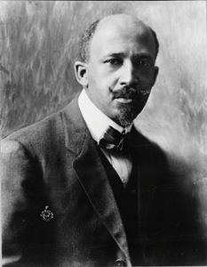

  
[Intangible Textual Heritage](../../index)  [Africa](../index) 

------------------------------------------------------------------------

[Buy this Book at
Amazon.com](https://www.amazon.com/exec/obidos/ASIN/0486414434/internetsacredte)

------------------------------------------------------------------------

<table width="75%">
<colgroup>
<col style="width: 50%" />
<col style="width: 50%" />
</colgroup>
<tbody>
<tr class="odd">
<td width="50%" data-valign="TOP"></td>
<td width="50%" data-valign="CENTER"><h1 id="the-negro" data-align="CENTER">The Negro</h1>
<h2 id="by-w.e.b.-du-bois" data-align="CENTER">by W.E.B. Du Bois</h2>
<h4 id="section" data-align="CENTER">[1915]</h4></td>
</tr>
</tbody>
</table>

------------------------------------------------------------------------

[Contents](#contents)    [Start Reading](dbn00)    [Page
Index](pageidx)    [Text \[Zipped\]](dbn.txt.gz)

------------------------------------------------------------------------

|                                                                                                                           |
|---------------------------------------------------------------------------------------------------------------------------|
|  |

This is a pioneering work on African-American history by the noted
activist and scholar, W.E.B. Du Bois. Born in 1868, three years after
the end of the Civil War, Du Bois lived until 1963, one year before the
March on Washington. He was a founder of the NAACP, and worked his
entire life to lift what he called "the Veil", or segregation.

While some minor items in this book have been disproven, the vast
majority of it still stands as one of the best books ever written on the
subject, and an ideal supplement for any curriculum in world history. Du
Bois covers a vast swath of African history, including the indigenous
high sub-Saharan civilizations such as Zimbabwe, Ghana, and Songhai, the
disasterous impact of centuries of the slave trade, and an overveiw of
Black history in the Caribbean and the United States.

------------------------------------------------------------------------

 [Title Page](dbn00)  
[Contents](dbn01)  
[Preface](dbn02)  
[I. Africa](dbn03)  
[II. The Coming of Black Men](dbn04)  
[III. Ethiopia and Egypt](dbn05)  
[IV. The Niger and Islam](dbn06)  
[V. Guinea and Congo](dbn07)  
[VI. The Great Lakes and Zymbabwe](dbn08)  
[VII. The War of Races at Land's End](dbn09)  
[VIII. African Culture](dbn10)  
[IX. The Trade in Men](dbn11)  
[X. The West Indies and Latin America](dbn12)  
[XI. The Negro in the United States](dbn13)  
[XII. The Negro Problems](dbn14)  
[Suggestions For Further Reading](dbn15)  
