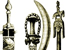

  
[Intangible Textual Heritage](../../index)  [Africa](../index) 
[Index](index)  [Previous](fjo31)  [Next](fjo33) 

------------------------------------------------------------------------

[Buy this Book on
Kindle](https://www.amazon.com/exec/obidos/ASIN/B003C1R142/internetsacredte)

------------------------------------------------------------------------

  
*Notes on the Folklore of the Fjort*, by Richard Edward Dennett,
\[1898\], at Intangible Textual Heritage

------------------------------------------------------------------------

# XXIX. NZAMBI MPUNGU'S AMBASSADOR.

NZAMBI Mpungu heard that some one across the seas was making people who
could speak. This roused his ire, so that he called the ox, the tiger,
the antelope, the cock, and other birds together, and after telling them
the news, he appointed the cock his ambassador.

"Tell the white man that I alone am allowed to make people who can talk,
and that it is wrong of them to make images of men and give them the
power of speech."

And the cock left during the night, passing through a village about
midnight, and only a few of the people got up to do honour to Nzambi
Mpungu's ambassador, so that Nzambi Mpungu waxed wroth, and turned the
inhabitants of that village into monkeys.

------------------------------------------------------------------------

[Next: XXX. Why The Crocodile Does Not Eat The Hen.](fjo33)

