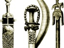

  
[Intangible Textual Heritage](../../index)  [Africa](../index) 
[Index](index)  [Previous](fsn00)  [Next](fsn02) 

------------------------------------------------------------------------

[Buy this Book on
Kindle](https://www.amazon.com/exec/obidos/ASIN/B003C1R0HU/internetsacredte)

------------------------------------------------------------------------

  
*Folk Stories From Southern Nigeria*, by Elphinstone Dayrell, \[1910\],
at Intangible Textual Heritage

------------------------------------------------------------------------

# CONTENTS

[Introduction](fsn02.htm#an_fn_02)  
[I. The Tortoise with a Pretty Daughter](fsn03.htm#an_fn_03)  
[II. How a Hunter obtained Money from his Friends the Leopard, Goat,
Bush Cat, and Cock, and how he got out of repaying
them](fsn04.htm#an_fn_04)  
[III. The Woman with two Skins.](fsn05.htm#an_fn_05)  
[IV. The King's Magic Drum](fsn06.htm#an_fn_06)  
[V. Ituen and the King's Wife](fsn07.htm#an_fn_07)  
[VI. Of the Pretty Stranger who Killed the King](fsn08.htm#an_fn_08)  
[VII. Why the Bat flies by Night](fsn09.htm#an_fn_09)  
[VIII. The Disobedient Daughter who Married a
Skull](fsn10.htm#an_fn_10)  
[IX. The King who Married the Cock's Daughter](fsn11.htm#an_fn_11)  
[X. Concerning the Woman, the Ape, and the Child](fsn12.htm#an_fn_12)  
[XI. The Fish and The Leopard's Wife; or, Why the Fish lives in the
Water](fsn13.htm#an_fn_13)  
[XII. Why the Bat is Ashamed to be seen in the
Daytime](fsn14.htm#an_fn_14)  
[XIII. Why the Worms live Underneath the Ground](fsn15.htm#an_fn_15)  
[XIV. The Elephant and the Tortoise; or, Why the Worms are Blind and the
Elephant has Small Eyes](fsn16.htm#an_fn_16)  
[XV. Why a Hawk kills Chickens](fsn17.htm#an_fn_17)  
[XVI. Why the Sun and the Moon live in the Sky](fsn18.htm#an_fn_18)  
[XVII. Why the Flies Bother the Cows](fsn19.htm#an_fn_19)  
[XVIII. Why the Cat kills Rats](fsn20.htm#an_fn_20)  
[XIX. The Story of the Lightning and the Thunder](fsn21.htm#an_fn_21)  
[XX. Why the Bush Cow and the Elephant are bad
Friends](fsn22.htm#an_fn_22)  
[XXI. The Cock who caused a Fight between two
Towns](fsn23.htm#an_fn_23)  
[XXII. The Affair of the Hippopotamus and the Tortoise; or, Why the
Hippopotamus lives in the Water](fsn24.htm#an_fn_24)  
[XXIII. Why Dead People are Buried](fsn25.htm#an_fn_25)  
[XXIV. Of the Fat Woman who Melted Away](fsn26.htm#an_fn_26)  
[XXV. Concerning the Leopard, the Squirrel, and the
Tortoise](fsn27.htm#an_fn_27)  
[XXVI. Why the Moon Waxes and Wanes](fsn28.htm#an_fn_28)  
[XXVII. The Story of the Leopard, the Tortoise and the Bush
Rat](fsn29.htm#an_fn_29)  
[XXVIII. The King and the Ju Ju Tree](fsn30.htm#an_fn_30)  
[XXIX. How the Tortoise overcame the Elephant and the
Hippopotamus](fsn31.htm#an_fn_31)  
[XXX. Of the Pretty Girl and the Seven jealous
Women](fsn32.htm#an_fn_32)  
[XXXI. How the Cannibals drove the People from Insofan Mountain to the
Cross River (Ikom)](fsn33.htm#an_fn_33)  
[XXXII. The Lucky Fisherman](fsn34.htm#an_fn_34)  
[XXXIII. The Orphan Boy and the Magic Stone](fsn35.htm#an_fn_35)  
[XXXIV. The Slave Girl who tried to Kill her
Mistress](fsn36.htm#an_fn_36)  
[XXXV. The King and the 'Nsiat Bird](fsn37.htm#an_fn_37)  
[XXXVI. Concerning the Fate of Essido and his Evil
Companions](fsn38.htm#an_fn_38)  
[XXXVII Concerning the Hawk and the Owl](fsn39.htm#an_fn_39)  
[XXXVIII. The Story of the Drummer and the
Alligators](fsn40.htm#an_fn_40)  
[XXXIX. The 'Nsasak Bird and the Odudu Bird](fsn41.htm#an_fn_41)  
[XL. The Election of the King Bird (the black-and-white Fishing
Eagle)](fsn42.htm#an_fn_42)

 

------------------------------------------------------------------------

[Next: Introduction](fsn02)

