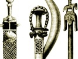

  
[Intangible Textual Heritage](../../index)  [Africa](../index.md) 
[Index](index)  [Previous](fsn12)  [Next](fsn14.md) 

------------------------------------------------------------------------

[Buy this Book on
Kindle](https://www.amazon.com/exec/obidos/ASIN/B003C1R0HU/internetsacredte.md)

------------------------------------------------------------------------

  
*Folk Stories From Southern Nigeria*, by Elphinstone Dayrell, \[1910\],
at Intangible Textual Heritage

------------------------------------------------------------------------

# XI. The Fish and the Leopard's Wife; or, Why the Fish lives in the Water

MANY years ago, when King Eyo was ruler of Calabar, the fish used to
live on the land; he was a great friend of the leopard, and frequently
used to go to his house in the bush, where the leopard entertained him.
Now the leopard had a very fine wife, with whom the fish fell in love.
And after a time, whenever the leopard was absent in the bush, the fish
used to go to his house and make love to the leopard's wife, until at
last an old woman who lived near informed the leopard what happened
whenever he went away. At first the leopard would not believe that the
fish, who had been his friend for so long, would play such a low trick,
but one night he came back unexpectedly, and found the fish and his wife
together; at this the leopard was very angry, and was going to kill the
fish, but he thought as the fish had been his friend for so long, he
would not deal with him himself, but would report his behaviour to King
Eyo. This he did, and the king held a big palaver, at which the leopard
stated his case quite shortly, but when the fish was put upon his
defence he had nothing to say, so the king addressing his subjects said,
"This is a very bad case, as the fish has been the leopard's friend, and
has been trusted by him, but the fish has taken advantage of his
friend's absence, and has betrayed him." The king, therefore, made an
order that for the future the fish should live in the water, and that if
he ever came on the land he should die; he also said that all men and
animals should kill and eat the fish whenever they could catch him, as a
punishment for his behaviour with his friend's wife.

------------------------------------------------------------------------

[Next: XII. Why the Bat is Ashamed to be seen in the Daytime](fsn14.md)

