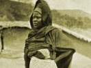

  
[Intangible Textual Heritage](../../index)  [Africa](../index.md) 
[Index](index)  [Previous](hau01)  [Next](hau03.md) 

------------------------------------------------------------------------

  
*Hausa Folk-Lore*, by Maalam Shaihua, tr. by R. Sutherland Rattray,
\[1913\], at Intangible Textual Heritage

------------------------------------------------------------------------

# AUTHOR'S NOTE

ON first proceeding to West Africa (the Gold Coast), and on commencing a
study of the Hausa language, the compiler of this work was struck by the
comparatively high standard of education found among the Hausa MAALAMAI
or scribes. Arabic characters are used by them, as by the Swahili of
East and Central Africa; but, whereas any natives met with there
possessed but a very superficial knowledge of the Arabic language or
writing, the Hausas could boast of a legal, historical, and religious
literature, which was to be found preserved by manuscripts. The MAALAMAI
were everywhere the most respected and honoured members of the
community. It was disappointing, however, at any rate for one who wished
to study Hausa, to find that all their manuscripts were written not only
in Arabic characters, but also in that language. This appears to be
universally the case, even in Nigeria. The use of Arabic to-day among
the educated Hausas corresponds to that of French and Latin in England
in the middle ages.

The writer's intention was, as soon as he had acquired a sound
colloquial knowledge of the Hausa language, to collect some of their
folk-lore and traditions, taking down such information as was required
verbatim, and translating afterwards into English. This plan he had
adopted when collecting his *Chinyanja* folk-lore.

The advantage of such a system is that the original text will help the
student of the language to appreciate its structure and idioms, in a way
that the best grammars could hardly do. The translator will also be
bound down thereby. There will thus be no room for embellishments or
errors creeping in, as is liable to be the case when the investigator
has had to rely on the vagaries of his cook, 'boy,' or other interpreter
for his information. It follows that such a collection will be of more
value from the anthropological standpoint. Indeed, of late years many
collections of native folk-lore compiled according to this method have
been called into being by the demand created by this new science of
anthropology.

As is to be expected, there are not many persons who have the fortune-or
misfortune-to spend four or five preliminary years in acquiring a
knowledge of the language of the people whose traditions they hope to
study; yet such a probation is very necessary, if the collection is to
be of any real value to the anthropologist.

Stories and traditions collected through the medium of an interpreter
are amusing, and might prove of interest in the nursery (though much
would have to be omitted or toned down, as savage folk-lore is often
coarse and vulgar according to our notions, and hardly fit *pour les
juenes filles*); but for the student of anthropology such collections
cannot be considered to possess much value.

The anthropological theorist, who is probably some learned professor at
one or other of our great Universities, where he made a life-study of
primitive customs and beliefs, has, in most cases, to rely for his data
on the field-worker. He needs to feel perfectly convinced that the
information on which he is seeking to base some far-reaching
generalization is absolutely correct; and this can hardly be the case,
however skilled, conscientious, or well trained the field-worker may be,
if the latter be wholly ignorant of the language of the people from whom
he is collecting his information.

Now the literary skill of the Hausas, already referred to, led the
writer to depart somewhat from the modus operandi employed in his
*Chinyanja* folk-lore, the subject-matter of which was taken down from
the lips of the raconteur. For the present work the services of a
learned MAALAM, by name MAALAM *Shaihu*, were secured. He himself wrote
down, or translated from manuscripts in Arabic, such information as was
required. Much of the work contained in the present volumes involved,
first, a translation from Arabic into Hausa, secondly, a transliteration
of the Hausa writing, and thirdly, a translation into English from the
Hausa.

During the writer's 'tours' of service in West Africa, as also during
his furloughs in England, this MAALAM, who was entirely ignorant of
English, made a collection of many hundreds of sheets of manuscripts
(1907-11).

In the meantime the present writer was making a study of the Hausa
language and script, by way of securing the key to their transliteration
and translation. He was fortunate, in the course of his official duties,
in being stationed for some time at YEGI on the VOLTA river. YEGI lies
on the main caravan route between Nigeria and Ashanti. Each month
thousands of Hausas from all parts of Nigeria cross the river here,
going to and from Nigeria with kola or cattle. Such a position enables a
student, even better perhaps than if he were resident in Hausaland, to
get into touch with Hausas from all parts of Nigeria. It was thus
possible to select such stories or traditions as seemed most generally
and widely known, and therefore likely to be of historical value on
account of their antiquity.

The Hausa given in the text is that of Kano or Sokoto, where by general
consent the purest dialect is spoken.

The Hausa Manuscript. The writing is throughout clear, correct, and
legible. It has been written with the *aya* between most of the words to
facilitate easy reading. Some of the specimens of Hausa writing that
have been reproduced from time to time are obviously the work of
illiterate Hausas, or at best are very carelessly written manuscripts,
and as such afford little criterion of the best work of these people.
The hasty scrawls, which, it is true, form the larger part of the
existing manuscripts, in which vowel-signs are missed out and words run
together, often cannot be deciphered by the Hausas, and sometimes not
even by the writers themselves, unless they know the context or subject
by heart. Such manuscripts are therefore worthless for scientific
purposes. They cannot, for instance, serve to disclose those nice points
of grammatical construction which the perusal of a carefully written
manuscript will reveal, though they can hardly be noted in the spoken
language.

The Transliteration. This has been given, letter by letter, word for
word, line by line. Thus it is easy for the student to follow the
original on the page opposite.

The Translation. As literal a translation as is consistent with making
the subject-matter at all readable has been given throughout. It is
primarily as a text-book for students of the language that this work is
intended, and for such a literal translation will be of most use. The
author would crave the pardon of the general reader for the baldness and
utter sacrifice of the English idiom which such a style of translation
must necessarily involve. The latter may, however, find here and there a
certain touch of 'local colour' in the phraseology, which may compensate
for its other obvious defects.

The value of Hausa writings. Hitherto, perhaps, it has not usually been
deemed essential to know much about Hausa writing. (A slight knowledge
of it is necessary, it is true, for the higher standard Government
examination.) This work attempts to go somewhat fully into the subject
of the writing and the signs used, in order to assist the student who
desires a knowledge of the writing that will enable him to decipher
manuscripts as apart from the printed type. *The writer is convinced
that a thorough knowledge of Hausa writing is essential for any advanced
study of the language.* Thus he has so far been rewarded for the time
spent in the minute perusal of the manuscripts comprising the Hausa
portion of this book by the further elucidation or confirmation therein
of grammatical structures not perhaps wholly accepted as proved, and by
the discovery of some new idioms which, to the best of his knowledge,
had apparently escaped the vigilance of previous writers on this
subject, or else had taxed their powers of explanation.

The length of vowels, which is so distinctly shown in the written word,
does not hitherto appear to have had that attention paid to it that it
undoubtedly deserves. Yet the length of a vowel may alter the meaning of
a word entirely, e.g. *guuda, guda; suuna, suna; gadoo, gado*, and soon.
Indeed, an educated MAALAM would consider a word as wrongly spelt
whenever a long vowel was written where it should have been short, or
vice versa. In Hausa writing such an error would amount not merely to
the dropping of an accent, as in English, but to the omission of a
letter. Moreover such a slip may lead to serious confusion, since the
tense of a verb, or even, as has been seen, the entire sense of a word,
may depend on the length assigned to the vowel.

The author of *Hausa Notes*, perhaps the best treatise on the language
yet written, remarks at some length on the apparent 'absurdity' of the
want of any inflexion for the 1st, 2nd, and 3rd persons singular of the
past tense, for the plural of which the well-known forms in *ka* exist,
and thinks the forms for these persons are the same as those used for
the aorist tense. Yet a perusal of almost any half-dozen pages of the
present manuscript will reveal the hidden missing forms. Were the
student to search for these by ear only, he might easily never discover
them, as they are almost indistinguishable in the spoken word.

Again, the definite article,\[1\] for many years conspicuous by its

\[1. First noted by Professor A. Mischlich.\]

absence, will be met with repeatedly in these pages in the final *nun*,
or *ra*, or the *wasali* or *rufua bissa biiuu*.

Enough has been said to show the value and importance of a close perusal
of Hausa manuscripts; but emphasis must be laid on the fact that such
writing must be the work of a learned MAALAM, or probably these very
details, which are of such importance to the scientific investigator,
will be omitted, either through carelessness or ignorance.

Proverbs. So far as possible, the endeavour has been made to omit such
proverbs as have already been collected and published.

The Notes. The student is expected to be familiar with the well-known
works on the Hausa language by Canon Robinson, Dr. Miller, and others;
hence only such phrases, words, or grammatical points as are not
considered in these works are noticed here.

Acknowledgments. The debt is vast which the student of any language owes
to those who have by their labours reduced that language to a definite
form. This makes it possible in a comparatively short time for him to
master what it has cost the pioneers many years of ceaseless labour to
create out of nothing. Availing himself of the fruits of their labour,
he can thus move forward to fresh fields of research. Such is the debt
that the writer owes to Canon Robinson, Dr. Miller, and others. His
thanks are also due to his friend Mr. Diamond Jenness, of Balliol
College, Oxford, for revising the English translation; to Mr. Henry
Balfour, Curator of the Pitt-Rivers Museum, Oxford, for having had the
photographs taken that appear in this work, and for his valuable notes
on the same which are again published through the courtesy of the Royal
Anthropological Institute; to Professor Margoliouth for having
translated the Arabic lines which occur in the Hausa script; to Mr. R.
R. Marett, of Exeter College, Oxford, Reader in Social Anthropology, his
tutor, who by his wonderful enthusiasm and ability may be said to have
organized a school of working anthropologists, building upon the noble
foundations laid by Sir E. B. Tylor and Dr. Frazer; to the authorities
of the Clarendon Press, who, besides dealing most generously with a work
not likely to prove remunerative, have likewise laid the author under
deep obligation by their friendly interest and advice.

Finally, the publication of this work has only been made possible by the
generous grant from the Government of the Gold Coast, to whom, as also
to the Secretary of State for the Colonies, on whose recommendation the
grant was made, the writer has the honour to tender his sincerest
thanks.

R. SUTHERLAND RATTRAY.

EJURA, ASHANTI,  
     WEST AFRICA.  
*Sept*. 8, 1911.

------------------------------------------------------------------------

[Next: Contents](hau03.md)

