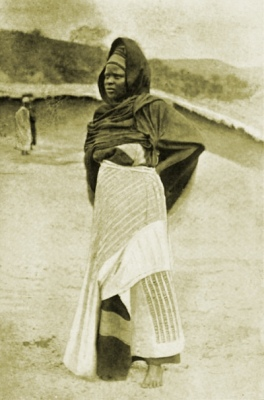

  
[Intangible Textual Heritage](../../index)  [Africa](../index.md) 

------------------------------------------------------------------------

<table width="75%">
<colgroup>
<col style="width: 50%" />
<col style="width: 50%" />
</colgroup>
<tbody>
<tr class="odd">
<td width="50%" data-valign="TOP"></td>
<td width="50%" data-valign="CENTER"><h1 id="hausa-folk-lore" data-align="CENTER">HAUSA FOLK-LORE</h1>
<h3 id="by-maalam-shaihua-translated-by-r.-sutherland-rattray" data-align="CENTER">by Maalam Shaihua, translated by R. Sutherland Rattray</h3>
<h4 id="clarendon-press" data-align="CENTER">Clarendon Press</h4>
<h4 id="section" data-align="CENTER">[1913]</h4></td>
</tr>
</tbody>
</table>

------------------------------------------------------------------------

[Contents](#contents)    [Start Reading](hau00.md)    [Text
\[Zipped\]](hau.txt.gz.md)

------------------------------------------------------------------------

This is a collection of Hausa folklore, which is directly sourced from a
Hausa storyteller, and translated by a European academic. This
originally appeared as two volumes, the translation being in the first
one. These West African stories, from what is today is Nigeria, are from
an Islamic background, giving us a look into this important African
storytelling tradition.

------------------------------------------------------------------------

 [Title Page](hau00.md)  
[Preface](hau01.md)  
[Author's Note](hau02.md)  
[Contents](hau03.md)  
[A Short History, Purporting to Give the Origin of the Hausa Nation and
the Story of Their Conversion to the Mohammedan Religion.](hau04.md)  
[1. The story of the slave by name 'The World'](hau05.md)  
[2. How brothers and sisters first came to quarrel and hate each
other](hau06.md)  
[3. The story of the boy and the old woman, and how the wasp got his
small waist](hau07.md)  
[4. The story about a beautiful maiden, and how the hartebeest got the
marks under its eyes like teardrops](hau08.md)  
[5. How the whip and the 'maara' spoon (a broken bit of calabash) came
to the haunts of men](hau09.md)  
[6. A story about a chief, and how his sons observed his funeral, and
the origin of the spider](hau10.md)  
[7. A story about an orphan, showing that 'he who sows evil, it comes
forth in his own garden'](hau11.md)  
[8. A story about a witch, and how the baby of the family outwitted her,
and invented the first walled town](hau12.md)  
[9. The doctor who went a pilgrimage to Mecca on a hyena](hau13.md)  
[10. A story about a chief and his cook](hau14.md)  
[11. A story about three youths all skilled in certain things, and how
they used that skill to circumvent a difficulty.](hau15.md)  
[12. A story about a giant, and the cause of thunder](hau16.md)  
[13. A story about an orphan which was the origin of the saying 'The
orphan with a coat of skin is hated, but when it is a metal one he is
honoured'](hau17.md)  
[14. A story of a jealous man and what befell him](hau18.md)  
[15. A story of a great friendship and how it was put to the
test](hau19.md)  
[16. A story about a test of skill](hau20.md)  
[17. A story about Miss Salt, Miss Pepper, &c.](hau21.md)  
[18. The story of Muusa (Moses) and how it came about that brothers and
sisters do not marry each other](hau22.md)  
[19. A story about a hunter and his son](hau23.md)  
[20. A story about a maiden and the pumpkin](hau24.md)  
[21. The Gaawoo-tree and the maiden, and the first person who ever went
mad](hau25.md)  
