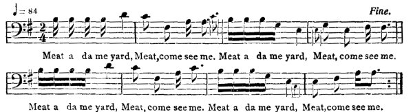
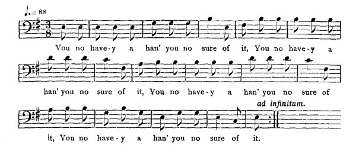

[Intangible Textual Heritage](../../index)  [Africa](../index.md) 
[Index](index)  [Previous](jas039)  [Next](jas041.md)   
 [\[Note\]](jas040n.md)

------------------------------------------------------------------------

### 40. Goat's Escape.

##### a. The Rain.

Richard Pottinger, Claremont, St. Ann.

Anansi and Goat have a little quarrel. Anansi said to Goat, 'Brar Goat,
I gwine ketch you!" Goat say, "You never live, me frien', to ketch me!"
Goat 'fraid fe rain. So one moist night Goat was coming from his field
had to pass Anansi's house, drizzle drizzle rain fall; Brar Goat have to
run up Anansi's house.--"Come in, me frien'!" Goat go in. Anansi step in
a room tak out him fiddle:--

"Me t'ank Brar Rain  
Fe run wil' meat from bush  
Come a house."

Goat didn't like it, keep to de door-way. Anansi not notice him, only
playing de same song, Goat jump down de bottom door Anansi cut after
him. Goat can't cross river, run to de river-side turn a white little
stone. Dog see, de odder side of de river, when Goat turned a little
stone. Anansi run up de river now.--"Brar Dog, see Brar Goat
pass?"--"Yes, Brar! see one little stone a riverside deh? takee up
t'rowee, I show you whe' him deh." Anansi

{p. 52}

tak up de stone, t'row it de odder side, give Brar Dog. Goat drop on him
four feet. Anansi say, "Luck in me han' an' it get 'way!"

##### b. The Dance (1).

Elizabeth Hilton, Harmony Hall, Cock-pit country.

Assono\[1\] an' Anansi make a dance and invite Goat and Dog to the
dance. Anansi make bargain with Assono that when Goat an' Dog come in,
he mus' sit down at one door an' Anansi at the other. Assono sing,
(repeat three times)--

"I sit down a me house deh fe dey come!"

So Anansi sing,

"Whe' me been tell you!"

Dog sing,

"The somebody kyan't run, you no hearie?"

Goat sing,

'I kyan't run, but I cunnie do!"

Anansi say to him, "Brar Goat, you no play de fiddle good! mak me tak de
fiddle stan' 'pon de do'mat play better." That time he gone to shut the
door, Dog and Goat run thru' the other door before Assono catch them.
Assono an' Anansi run after them an' get to a big river. Dog can swim
an' Goat kyan't swim, so Dog swim over the river an' lef' Goat. Goat
turn a big rock an' lie by the roadside. Dog say to Anansi, "Brar
Anansi, tak a rock-stone, lick me down an' I wi' stay mak you come pick
me up!" Anansi tak a big rock so an' fling over the river. Goat get up
an' holla "Baa-a-a-a!" Assono so vex with Anansi that he eat him up same
place.

##### b. The Dance (2).

Alfred Williams, Maroon Town.

Hanansi give a dance, invite any amount of company, an', de night,
everbody come. He invite Brar Goat, an' when him come, Brar Goat stay
outside on de landing, an' Brar Hanansi inside say him gwine to play,
an' he play,

  
Meat a da me yard, Meat, come see me. Meat a da me yard, Meat, come see
me.  
Meat a da me yard, Meat, come see me. Meat a da me yard, Meat, come see
me.

\[1. Assono is a large animal, unidentified. See story 75.\]

{p. 53}

Brar Goat den dance. When he dance he holla,

  
You no have-y a han' you no sure of it,  
You no have-y a han' you no sure of it,  
You no have-y a han' you no sure of it,  
You no have-y a han' you no sure of it.

------------------------------------------------------------------------

[Next: 41. Turtle's Escape.](jas041.md)
