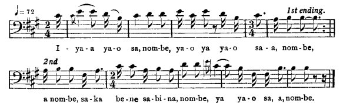
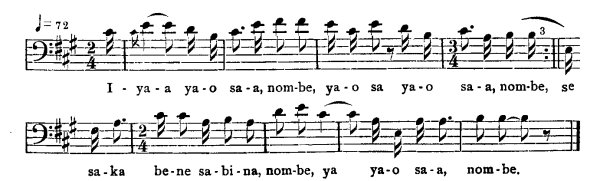

[Intangible Textual Heritage](../../index)  [Africa](../index.md) 
[Index](index)  [Previous](jas059)  [Next](jas061.md)   
 [\[Note\]](jas060n.md)

------------------------------------------------------------------------

### 60. The Animal Race.

##### a. Horse and Turtle.

Alfred Williams, Maroon Town, Cock-pit country.

Horse bet Turtle say a get to Kingston before him. Turtle bet him say
him will get to Kingston before him, Brar Horse. An' Turtle tak up one
of him pickney an' drop dem ev'ry mile-post, an' drop de last one in at
Kingston at de wharf-house, tell 'im 'em going for a sack of salt. An'
de night when dem start, as Brar Horse catch to de firs' mile-post an'
sing out in a harsh note,

  
I-ya-a ya-o sa, nom-be, ya-o ya ya-o sa-a, nom-be,  
a nom-be, sa-ka be-ne sa-bi-na, nom-be, ya ya-o sa, a, nom-be.

Turtle answer quite yonder, soft an' sweet,

  
I-ya-a ya-o sa-a, nom-be, ya-o sa ya-o sa-a, nom-be,  
se sa-ka be-ne sa-bi-na, nom-be, ya ya-o sa-a, nom-be.

\[1. A round tin cooking pot is called a "bonpon". So is a high round
hat.\]

{p. 66}

Horse say, "Well! Brar Turtle gone!" Gallop, draw rein an' 'pur As he
get to de nex' mile-post, hear,

"I-ya-a ya-o sa, nom-be, ya-o ya."

Gallop an' gallop till he get to de nex' mile-post. Turtle sing,

"I-ya-a ya-o sa, nom-be, ya-o ya."

Trabbel on, ride on, ride on, ride on, catch to de nex' mile-post, sing
out,

"I-ya-a ya-o sa, nom-be, ya-o ya."

Turtle answer de same song quite at de mile-post,--

"I-ya-a ya-o sa, nom-be, ya-o ya."

As Horse catch to dat mile-post go in to Kingston, drop down dead!

##### b. Pigeon and Parrot.

Julia Gentle, Santa Cruz Mountains.

Pigeon an' Parrot was co'rtin' one girl an' she say whichever one firs'
come in de house de mornin' she would marry dat one. Parrot could not
fly very fas'. He went an' mek bargain wid anodder Parrot. He went
before an' leave de odder one to follow Pigeon behin'. He went near to
de girl house an' sit down in a tree. Pigeon call, saying,

"Come on, me pretty Poll, come on, me pretty Poll,  
    Stay on de tree so long,  
For de sun an' de moon gwine down,  
    Stay on de tree so long."

Parrot answer Pigeon behind,

"Go on, me pretty Pigeon, go on, me pretty Pigeon,  
    Stay on de tree so long,  
Go on, me pretty Pigeon, go on, me pretty Pigeon,  
    Stay on de tree so long."

Pigeon sail again. He stop, call again,

"Come on, me pretty Poll, come on, me pretty Poll,  
    Stay on de tree so long,  
Come on, me pretty Poll, come on, me pretty Poll,  
    Stay on de tree so long."

Parrot answer,

"Go on, me pretty Pigeon, go on, me pretty Pigeon,  
Stay on de tree so long,  
Go on, me pretty Pigeon, go on, me pretty Pigeon,  
Stay on de tree so long."

{p. 67}

Pigeon sail. When Pigeon nearly catch to de house, call again in de same
tune. Parrot answer before now. Pigeon say, "Stop! a lil' while Parrot
was behin'; how Parrot get before?" When Pigeon went to de house, Parrot
was in de house. Pigeon has to stay outside an' Parrot married to de
girl.

------------------------------------------------------------------------

[Next: 61. The Fasting Trial (fragment).](jas061.md)
